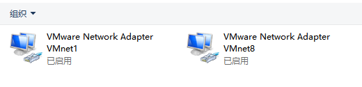
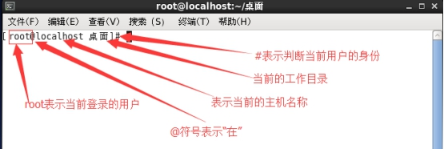
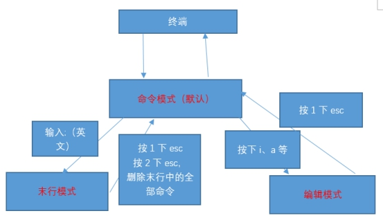
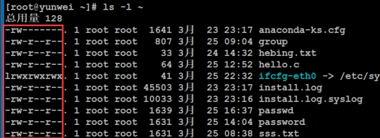
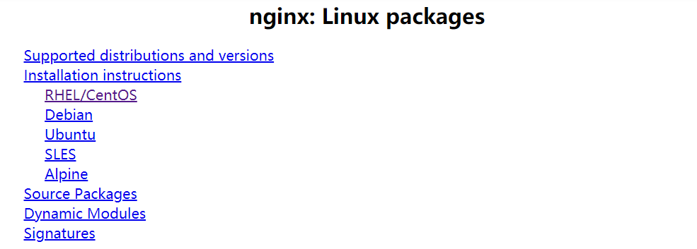
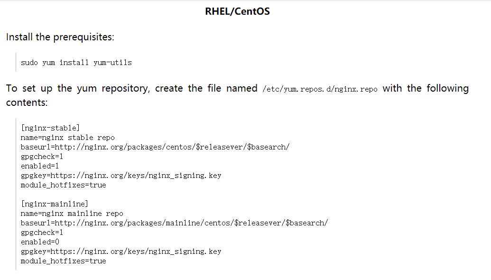
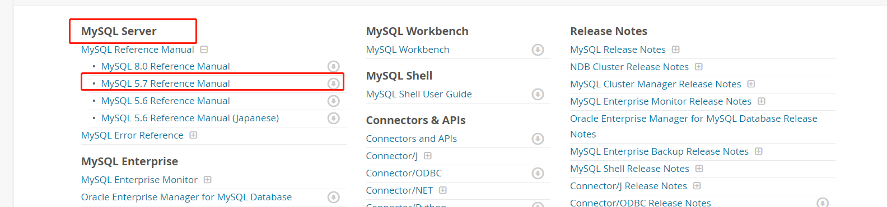
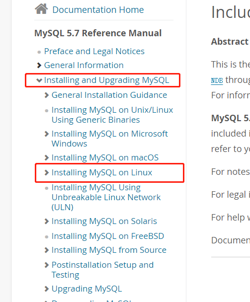
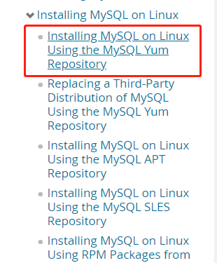
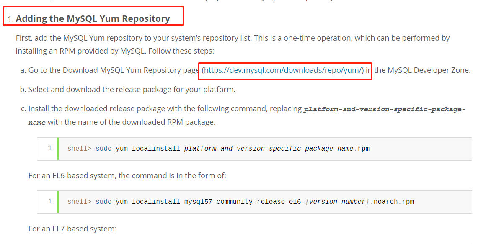

# Linux

# 一、安装


## VMware 安装 192.168.183.139


1. 安装完虚拟机后，默认安装了两块虚拟网卡----VMnet1和VMnet8


> VMnet1是host网卡，用于host方式连接网络
>
>  
>
> VMnet8是NAT网卡，用于NAT方式连接网络的，并且它们的ip地址是随机生成的
>





2. VMware提供了三种工作模式


2.1、桥接模式


> 在这种模式下，使用VMnet0虚拟交换机，虚拟操作系统就像是局域网中的一台独立的主机，与宿主计算机一样，它可以访问网内任何一台机器，在桥接模式下，可以手工配置它的TCP/IP配置信息(IP、子网掩码等，而且还要和宿主机器处于同一网段)，以实现通过局域网的网关或路由器访问互联网，还可以将ip地址和DNS设置成“自动获取”。
>
>  
>
> 如果你想利用VMware在局域网内新建一个服务器，为局域网用户提供Web或网络服务，就应该选择桥接模式。
>
>  
>
> 在桥接模式中，使用VMnet0虚拟交换机，此时虚拟机相当于网络上的一台独立计算机与主机一样，拥有一个独立的IP地址
>


2.2、NAT(网络地址转换模式)


> 使用NAT模式，就是让虚拟机借助NAT(网络地址转换)功能，通过宿主机器所在的网络来访问公网。
>
>  
>
> 也就是说，使用NAT模式可以实现在虚拟系统里访问互联网。
>
>  
>
> NAT模式下的虚拟机的TCP/IP配置信息是由VMnet8虚拟网络的DHCP服务器提供的，因此IP和DNS一般设置为“自动获取”，因此虚拟系统也就无法和本局域网中的其他真实主机进行通讯。采用NAT模式最大的优势是虚拟系统接入互联网非常简单，你不需要进行任何其他的配置，只需要宿主机器能访问互联网即可。
>
>  
>
> 如果你想利用VMWare安装一个新的虚拟系统，在虚拟系统中不用进行任何手工配置就能直接访问互联网，建议你采用NAT模式。
>
>  
>
>  
>

> NAT模式中使用VMnet8虚拟交换机，此时虚拟机可以通过主机“单向访问”网络上的其他主机，  
其他主机不能访问虚拟机。
>


2.3、host-only(仅主机模式)


> host-only模式其实就是NAT模式去除了虚拟NAT设备，然后使用VMware netWork Adapter VMnet1虚拟网卡连接VMnet1虚拟交换机来与虚拟机通信的，Host-Only模式将虚拟机与外网断开，使得虚拟机成为一个独立的系统，只与主机相互通信。
>


## centos安装


[VMware 安装 Centos7](https://www.runoob.com/w3cnote/vmware-install-centos7.html)

---

2. 使用VMware备份操作系统


2.1、快照：又称还原点，  
就是保存在拍快照时候的系统的状态(包含了所有的内容)，在后期的时候随时可以恢复。  
侧重于短期备份，需要频繁备份的时候可以使用快照，做快照的时候虚拟的操作系统一般处于开启状态。


```plain
1、在菜单虚拟机-快照-拍摄快照，输入相关信息
2、使用快照恢复搞事请之前的状态，路径：虚拟机-快照-快照管理器
```


2.2、克隆：就是复制。侧重长期备份，做克隆的时候必须得关闭当前虚拟机。


```plain
1、路径：先关机-右键需要克隆的虚拟机-管理-克隆，
2、克隆源：虚拟机中的当前状态
3、克隆类型：创建完整克隆(链接克隆相当于快捷方式，一个坏另一个还是也坏)
4、新虚拟机：名称、位置

克隆好的服务器相关账号等信息与被克隆的系统一致。
```


## Linux系统的文件目录结构


```plain
										/

			bin   dev  home  lib64  mnt  proc  run   srv  tmp  var
			boot  etc  lib   media  opt  root  sbin  sys  usr
```


> /：表示的是根的意思
>
>  
>
> /bin：（binary）存放的是一些二进制文件，但是在Linux中二进制文件是可以被执行的。这个目录中的命令文件是给普通用户使用。
>
>  
>
> _**/etc：Linux下所有的配置文件都会存放到etc目录。**_
>
>  
>
> /home：是所有非root用户家目录的一个集合。
>
>  
>
> /root：root用户的家目录。
>
>  
>
> /sbin：sbin表示super bin（shell bin），里面同样也类似于bin目录，也存放了一些二进制文件，只不过这些命令只能是让超级管理员去运行。
>
>  
>
> _**/usr：存放着一些用户自己安装的软件，其实类似于windows下的Program Files目录。**_
>
>  
>
> _**/var：存放着Linux下的一些日志文件，在实际开发的时候有一些公司也习惯把Apache或者nginx的站点目录也会放到这个目录中。**_
>


## 命令行


常见的shell。


Csh、tcsh、zsh、_**bash**_等


命令行符号介绍：_**在Linux中#表示超级管理员身份，$符号表示普通用户**_。





**快捷键**：


> ^C 	终止前台运行的程序
>
>  
>
> ^D 	退出 等价exit
>
>  
>
> ^L 	清屏
>
>  
>
> ^A 	光标移到命令行的最前端
>
>  
>
> ^E 	光标移到命令行的后端
>
>  
>
> ^U 	删除光标前所有字符
>
>  
>
> ^K 	删除光标后所有字符
>
>  
>
> ^R 	搜索历史命令，利用关键词
>
>  
>
> Alt+. 引用上一个命令的最后一个参数，等价于!$
>
>  
>
> ESC . 引用上一个命令的最后一个参数，等价于!$
>


**历史命令**


> history
>
>  
>
> 光标上下键
>
>  
>
> ^R 		#搜索历史命令(输入一段某条命令的关键字：必须是连续的)
>
>  
>
> !220		#执行历史命令中第220条命令
>
>  
>
> !字符串	#搜索历史命令中最近一个以xxxx字符开头的命令，例如!ser
>
>  
>
> !$ 			#引用上一个命令的最后一个参数
>


**命令别名**


> alias tianyun='cat /etc/sysconfig/network-scripts/ifcfg-ens33'  #建立别名（临时的，仅在当前Shell生效）
>
>  
>
> unalias tianyun 	#取消tianyun这个别名
>
>  
>
> alias		#查看系统当前的别名
>
>  
>
> type -a ls 	#查看命令类型
>


永久别名：/etc/bashrc


```bash
vim /etc/bashrc 

#添加如下行
alias tianyun='cat /etc/sysconfig/network-scripts/ifcfg-ens33'
```


用户级别名：


别名映射文件：  ~/.bashrc


例：自己创造出cls命令


```plain
在别名映射文件：  ~/.bashrc中  （家目录下的隐藏文件bashrc）

写 alias cls='clear'

注意：如果想新创造的命令生效，必须要重新登录当前用户。
```


## reboot 重启


作用：重新启动计算机


```plain
语法1：reboot  重启

语法2：reboot -w 模拟重启，(只写关机与开机的日志信息，但是不重启)
```


## shutdown 关机


作用：关机


```plain
    shutdown -h now  "关机提示"  	或者  	shutdown -h 15:25  "关机提示"

    shutdown -h now  表示立即关机

    shutdown -h 1    表示1分钟后关机

    shutdown -r now  立即重启
    
    shutdown -c		 取消关机命令


例：
    shutdown -h 12:00 "将在 12:00后关机！"
```


# 二、文件与目录管理


通用语法格式：


```bash
指令名称 [选项] [操作的目标]
```


注意：  
一个指令可以包含多个选项，操作对象也可以是多个。


## ls列出目录


```bash
ls		#列出当前工作目录下的所有文件/文件夹的名称
```


```bash
ls 路径	#列出指定路径下的所有文件/文件夹的名称
```


```bash
ls -l 路径	# 表示以详细列表的形式进行展示(包含文件的属性与权限等等数据)

注意：ll 等价于 ls-l

例：ls -l /root 会以列表的形式展示

第一列：权限，第一个字符指的是文档类型，“-” 表示该行对应的文档类型为文件，“d" 表示该行对应的文档类型为文件夹
```


```bash
ls -la 路径		#显示所有的文件/文件夹(包含了隐藏文件/文件夹)

例： ls -la /root 隐藏的文件也会展示
						
注意：在Linux中隐藏文档一般都是以“.”开头。
```


```bash
ls -lh 路径	#列出指定路径下的所有文件/文件夹的名称，以列表的形式并且	在显示文档大小的时候以(可读性较高的形式显示)
	
例：
   ls -lh /root

注意：文件夹始终显示6
```


## cd切换目录


1.  路径可以分为两种：  
路径可以分为两种： 

```plain
 	相对路径：相对首先得有一个参照物(一般就是当前的工作路径)；
 		
 		在相对路径中通常会用到2个符号
 			"./"、表示的是当前目录下 
 			"../"、表示的是上一级目录
 
 	绝对路径：决定路径不需要参照物，直接从根"/"开始寻找对应的路径；
```

 

2.  语法：cd 路径  
例：当前在"/"下，需要使用绝对路径切换到/usr/local. 

```plain
 cd /usr/local
```

 


			  
	例：当前在/usr/local下，需要使用相对路径切换目录到home目录下的like用户家目录中  
	  
		cd ../../home/like


```bash
补充：
    cd -:	回到上一次操作所在位置

    cd ~:	回到用户家目录

    cd 	: 	回到用户家目录

    cd ./:	当前目录

    cd ../:	回到上一级目录
```


## pwd打印当前工作路径


用法：pwd  (print working directory，显示当前工作目录的绝对路径)


```bash
例：在根目录

	pwd 	输出 /
```


## mkdir创建文件夹


语法：  
mkdir 路径[可以是文件夹名称，也可以是包含名称的一个完整路径]


选项：  
-m ：配置文件的权限喔！直接配置，不需要看默认权限 (umask) 的脸色～


	-p ：父目录不存在的情况下，先生成父目录(parents)


```bash
例：在当前路径下创建出目录"yunwei"

	mkdir yunwei

	注意：成功后不会有反应，已有的话，无法再创建

 	ls

	注意：ls 列出的结果颜色说明，
		蓝色的名称表示文件夹，黑色的表示文件，绿色的表示其权限为(拥有所有权限)
```


```bash
用法二、指定目录下创建

	例：mkdir /home/like/yunwei
	
	   ls /home/like/yunwei
```


```bash
用法三、 mkdir -p 路径

	当一次性创建多层不存在的目录的时候，添加-p选项，实现多层目录的一次性创建

例：
 	mkdir -p /home/like/yunwei/a/b/c/d

	验证 ls /home/like/yunwei/a
 		ls /home/like/yunwei/a/b
 		ls /home/like/yunwei/a/b/c
```


```bash
用法四、 mkdir 路径1 路径2 路径3 ...

	表示一次性创建多个目录

	例： mkdir a b c
```


```bash
用法五、例：创建权限为 rwx--x--x 的目录

	mkdir -m 711 test2
```


## touch创建文件


语法：touch 文件路径 [路径可以是直接的文件名，也可以是路径]


```bash
用法一、当前目录创建 一个文件

例：使用touch 在当前目录下创建一个文件，命名为 Linux.txt

	touch Linux.txt
```


```bash
用法二、使用touch来同时创建多个文件

例：
	touch Linux1.txt Linux2.txt
```


```bash
用法三、在指定目录创建文件

例：使用touch 在 “like" 家目录创建文件

	touch /home/like/liux.txt

	验证  ls /home/like/
```


注意：  
不存在的目录下无法创建文件


## cp复制


作用：  
复制文件/文件夹到指定的位置


语法：  
cp 被复制的文档路径 文档保存的路径


```plain
例：复制文件

	 cp linux1.txt /home/like/linux2.txt

注意：
	Linux在复制过程中是可以重新对新位置的文件进行重命名的，但如果不是必须的需要，则建议保持前后名称一致 


例：复制文件夹

	cp ./yunwei/ /home/like/yunwei

	注意：
		当使用cp命令进行文件夹复制操作的时候需要添加选项“-r”，否则目录将被忽略

	-r 表示递归复制， 

	例：根目录下移动到root目录下
		cp -r yunwei root
```


注意：  
复制的时候不指定名，会使用原来的名


```plain
3、当发现目标目录下有相同文件，会提示你是否覆盖

	例：强制覆盖

		\cp -r test zwj

	注意：
		这个指令会强制覆盖，不会提示
```


## mv移动剪切重命名


一、MV指令 (move，移动，剪切)


作用：移动文档到新的位置


语法：  
mv 需要移动的文档路径 文档保存的路径


```bash
#移动一个文件

例：mv Linux2.txt /home/like/linux2.txt
```


```bash
#移动一个文件夹

例：mv /home/like/yunwei/ /

注意：不写名字的话也可以，会用原来的名字
```


二、重命名


```plain
在Linux中重命名的命令也是MV，语法和移动语法一样

保证前后路径一致，就是重命名	

例：当前目录下重命名

	mv yunwei niu
```


```bash
	#指定目录下重命名
	mv home/like/yunwei  home/like/yunweiniu
```


## rm删除


一、rm指令 (remove，移除，删除)


作用：移除/删除一个文档


```bash
语法：
	rm 选项 需要移除的文档路径

	选项：
		-f ：就是 force 的意思，忽略不存在的文件，不会出现警告信息；
		-r ：递归删除啊！最常用在目录的删除了
		-i ：互动模式，在删除前会询问使用者是否动作
```


```bash
删除一个文件

	例：rm /linux1.txt

	在删除的时候如果不带选项，会提示是否删除，提示是否删除：y、 yes、 n、 no
```


```bash
注意：
	如果在删除的时候不想频繁的确认，则可以在指令中添加选项“-f”,表示force(强制)

	例：强制删除，不提示是否确认删除
		
		rm -f /linux2.txt
```


```bash
删除一个文件夹 

	例：rm /niu

		会提示 无法删除“/niu” ：是一个目录
		
		需加 -r 选项 rm -r /niu

		会提示，是否删除 ，不想频繁确认，可加 -f

		最终版：rm -rf /niu

	注意：
		删除一个目录的时候需要做递归删除，并且一般也不需要进行删除确认询问，所以移除目录的时候一般需要加-rf选项
```


```bash
删除多个文件

	例：#当前目录下混合删除文件夹(加-r)和文件 
		rm -rf a linux.txt
		
		#指定目录下混合删除
		rm -rf home/like/yunwei home/like/linux3.txt
```


补充：*号通配符，表示任意的字符


```bash
例：要删除一个目录下有公共特性的文档，例如都以Linux开头的文件

	rm -f linux*
```


二、rmdir


语法：  
rmdir [-p] 目录名称


选项：  
-p ：连同上一级『空的』目录也一起删除


注意：  
rmdir 仅能删除空的目录，


## tail head


一、tail指令


作用：查看一个文件的末n行，如果n不指定，默认显示后10行


```plain
语法1：
	tail -n 文件路径 【n表示数字】

	例：显示后5行
	
		tail -5 initial-setup-ks.cfg 


重点作用2：可以通过tail指令来查看一个文件的动态变化 【变化的内容不能是用户手动增加的】

语法：
	tail -f 文件路径	表示持续侦测后面所接的档名，要等到按下[ctrl]-c才会结束tail的侦测
	
	例：tail -f test.txt

		用另一个终端借助输出重定向向里面输入内容 ，ls >> test.txt

		会同步的看到输入的内容

		注意：
			该命令一般用于查看系统的日志比较多。
```


二、head指令


作用：查看一个文件的前n行，如果不指定n，则默认显示前10行。


```plain
语法：
	head -n 文件路径 【n表示数字】

	例：显示前5行

	 head -5 initial-setup-ks.cfg
```


## cat tac


一、cat指令		由第一行开始显示 全部文件 内容(只读)


```plain
作用1：cat有	直接	打开一个文件的功能(相当于读取过来，在终端直接输出)

	语法：
		cat 文件的路径

	例：cat test.txt

		注意：是直接读取输出，不用再和vim一样手动退出


作用2：cat还可以对文件进行合并，  配合输出重定向使用

	语法：
		cat 待合并的文件路径1 待合并的文件路径2 ...文件路径n > 合并之后的文件路径
		
	例：合并三个文件，并存到一个文件中

		cat /home/like/test1.txt /home/like/test2.txt /home/like/test3.txt > hebing.txt

		验证  ls

		cat hebing.txt
```


```plain
3、显示行号  -n

	cat -n /etc/profile


4、分页显示  管道命令 | more

	cat -n /etc/profile | more
```


注意：  
为了浏览方便，一般会带上 管道  命令 | more  
cat 文件名 | more


二、tac


```plain
tac与cat命令刚好相反，文件内容从最后一行开始显示，可以看出 tac 是 cat 的倒着写  

例：
	tac /etc/issue
```


## more less


一、more	分页显示 一页一页翻动


```plain
在 more 这个程序的运行过程中，你有几个按键可以按的：

	空格键 (space)：代表向下翻一页；

	Enter         ：代表向下翻『一行』；

	/字串         ：代表在这个显示的内容当中，向下搜寻『字串』这个关键字；

	:f            ：立刻显示出档名以及目前显示的行数；

	q             ：代表立刻离开 more ，不再显示该文件内容。

	b 或 [ctrl]-b ：代表往回翻页，不过这动作只对文件有用，对管线无用。
```


二、less指令


```plain
作用：查看文件，以较少的内容进行输出，按下辅助功能键查看更多

	可以输入辅助功能键：
			数字+回车：	跳转到指定行
			上下方向键	换行
			q 			退出
			空格键    ：向下翻动一页；
			/字串     ：向下搜寻『字串』的功能；
			?字串     ：向上搜寻『字串』的功能；
			n         ：重复前一个搜寻 (与 / 或 ? 有关！)
			N         ：反向的重复前一个搜寻 (与 / 或 ? 有关！)
			
语法： less 需要查看的文件路径

	例：
		less initial-setup-ks.cfg
```


注意：  
less指令在显示文件内容时，并不是一次将整个文件加载之后才显示，而是根据显示需要加载内容。  
对于显示大型文件具有较高的效率。


## wc


作用：统计文件内容信息(-l行数、-w单词数、-c字节数)


```plain
	语法：
		 wc -lwc 需要统计的文件路径

		-l：表示lines，行数
		-w：表示words，单词数，依照空格来判断单词的数量
		-c：表示bytes，字节数


		例：
			 wc install.log    	没有选项时，则 行数、单词数、字节数都显示
			 wc -l install.log 	只显示行数
			 wc -w install.log 	只显示单词数
			 wc -c install.log 	只显示字节数
```


## 输出指定向


输出重定向	(也就是指定输出位置)


一般命令的输出都会显示在终端中，有些时候需要将一些命令的执行结果想要保存到文件中进行后续的分析/统计，则这时候需要使用到输出重定向技术


```plain
语法：
	 正常执行的指令 >/>> 文件的路径

	>： 表示		覆盖输出， 会覆盖掉原先的文件内容

	>>：表示		追加输出，不会覆盖原始文件内容，会在原始内容末尾，继续添加

	注意：
		文件的路径可以不存在，不存在则会自动新建

例：使用覆盖重定向，保存ls -la 的执行结果，保存到当前目录下的ls.txt

	 ls -la > ls.txt


例：使用追加重定向

	ls -la >> ls.txt
```


## 文件时间


Linux文件有四种时间：


```bash
stat /etc/hostname 		#查看文件的详细属性（其中包括文件时间属性）

访问时间：atime，		#查看内容 RHEL6会延后修改atime, 自上次atime修改后，已达到86400秒  或  发生写操作时

修改时间：mtime，		#修改内容

改变时间：ctime，		#文件属性，比如权限

删除时间：dtime，		#文件被删除的时间
```


## 文件类型


ls -l 文件名		 #看第一个字符


> - 		普通文件（文本文件，二进制文件，压缩文件，电影，图片。。。）
>
>  
>
> d 		目录文件（蓝色）
>
>  
>
> b 		设备文件（块设备）存储设备硬盘，U盘 /dev/sda, /dev/sda1
>
>  
>
> c 		设备文件（字符设备）打印机，终端 /dev/tty1, /dev/zero
>
>  
>
> s 		套接字文件
>
>  
>
> p 		管道文件
>
>  
>
> l 		链接文件（淡蓝色）
>


# 三、搜索查找


## 管道符


管道符，“|”


作用：将前一个命令的处理结果输出传递给后面的命令处理，一般可以用于“过滤”，“特殊”，“扩展处理”。


语法：管道不能单独使用，必须配合其他指令来一起使用，其作用主要是辅助作用


## find


作用：  
从指定目录向下递归地遍历其各个子目录，将满足条件的文件或者目录显示在终端(选项有55个)


```plain
语法：
	find 路径范围 选项 选项的值

	查找字符匹配
		*：匹配所有
		?：匹配单个字符

选项：
	-name：按照文档名称进行搜索(精确查找)
	
	-iname 按名称查找 (不区分大小写)

	-type：按照文档类型进行搜索("-"文件，"d"文件夹，"l"软链接文件)
	 
		用find搜索文件的时候不要用“-”,而是用f来替换


1、-name(按名字查找)

	案例：使用find来	搜索httpd.conf

		 find / -name httpd.conf
		 
	案例：搜索etc目录下	所有的conf后缀文件

		 find /etc -name *.conf

		 find /etc -name *.conf | wc -l	441个
```


	  
	2、-type(按类型查找)  
	  
		案例：使用find来搜索/etc/sane.d/目录下		所有的文件  
	  
			 find /etc/sane.d -type f  
			 find etc/sane.d -type f | wc -l	78个  
			  
		案例：使用find来搜索/etc/目录下		所有的文件夹  
	  
			 find /etc -type d  
			 find /etc -type d | wc -l 	744个


```plain
3、-user(按拥有者查找)

	例：查找/opt目录下，用户名称为nobody所有的文件

		find /opt -user nobody
```


	  
	4、-size(按文件尺寸)  
	  
		例：查找整个Linux系统下大于20m的文件  
	  
			find / -size +20M  
	  
			注意：  
				M要大写  
				k要小写  
				+n 大于  
				-n 小于  
				不写 等于


## locate


locate指令可以快速定位文件路径。


语法：  
locate 搜索文件


```plain
locate指令利用事先建立的系统中所有的文件名称及路径的locate数据库实现快速定位给定的文件。

locate指令无需遍历整个文件系统，查询速度较快。

为了保证查询结果的准确度，管理员必须定期更新locate时刻。

注意：
	由于locate指令基于数据库进行查询，所以第一次运行前，必须使用updatedb指令创建locate数据库


例：使用locate指令快速定位hello.txt文件所在目录

	updatedb  //创建locate数据库

	locate hello.txt
```


## grep


作用：过滤查找


```plain
语法：
	grep [cinv] 查找内容 源文件

选项：
	-c 	 输出匹配行的次数(是以行为单位，不是以出现次数为单位)
	-n   显示匹配行及行号
	-i   忽略字母大小写
	-v	 反向选择，显示不包含匹配文本的所有行
```


```plain
例：在hello.txt文件中，查找“yes”所在行，并且显示行号

	cat hello.txt | grep yes
	//yes
	//yes

	cat hello.txt | grep -n yes
	//4:yes
	//7:yes

	cat hello.txt | grep -ni yes
	//4:yes
	//7:yes
	//9:Yes
```


## which


作用：  
显示系统命令所在目录(绝对路径及别名)


which命令的作用是，在PATH变量指定的路径中，搜索某个系统变量的位置，并且返回第一个搜索结果，也就是说，使用which命令，就可以看到某个系统命令是否存在，以及执行的到底是哪一个位置的命令。


```plain
例：
	which ls

	出现下面的信息，是ls指令的详情，说明ls指令是存在的	
	alias ls='ls --color=auto'
	        /usr/bin/ls
	        
	which zs

	出现下面的信息，说明zs指令是不存在的
	/usr/bin/which: no zs in (/usr/local/sbin:/usr/local/bin:/usr/sbin:/usr/bin:/root/bin)
```


## whereis


whereis


作用：  
搜索命令所在目录 配置文件所在目录 及帮助文档路径


```plain
例：
	whereis ls 

	ls: /usr/bin/ls /usr/share/man/man1/ls.1.gz /usr/share/man/man1p/ls.1p.gz
```


# 四、时间日期


## date时间


作用：表示操作时间和日期(读取、设置)


1、操作当前时间


```plain
语法一：	date 	
	
		//2019年 08月 28日 星期三 15:18:06 CST (CST表示当地时间)


语法二：	date +%F	等价于 date +%Y-%m-%d
	
		//2019-08-28


语法三： 	date +"%F %T" 	等价于 date +"%Y-%m-%d %H:%M:%S"	 引号 “年月日与时分秒” 为整体
	
		//2019-08-28 15:21:22
```


>     %F 		表示完整的年月日  
	%T 		表示完整的时分秒  
	%Y 		表示四位年份  
	%m 		表示两位的月份(带前导零)  
	%d 		表示日期(带前导零)  
	%H 		表示小时(带前导零)  
	%M 		表示分钟(带前导零)  
	%S 		表示秒数(带前导零)
>


2、获取之前或者之后的某个时间(备份文件删除的时候需要指定多少天前的) 	-d选项


```plain
语法四：	date -d "-1 day" +"%Y-%m-%d %H:%M:%S"		一天前
			date -d "-1 year" +"%Y-%m-%d %H:%M:%S" 	一年前
			date -d "+1 month" +"%Y-%m-%d %H:%M:%S" 	一月后

				符号可选值 - 代表之前，+ 代表之后
				单位可选值 day month year
```


3、设置日期


```plain
语法：
	date -s 字符串时间

	例：
		date -s "2018-10-10 11:22:22"
```


## cal 日历


作用：用来操作日历的


```plain
语法一：
	cal 	等价于 cal -1
	直接输出	当前月份的日历
	
语法二：
	cal -3 	
	表示输出	上一个月+本月+下个月的日历
	
语法三： 
	cal -y 年份 	
	表示输出某一年份的日历
	例： cal -y 2019

语法四： 
	cal -s (默认) 礼拜的第一天是周日
	例： cal -s3

语法五： 
	cal -m   礼拜的第一天是周一
	例： cal -my 2020
```


# 五、vim编辑器


## vim介绍


一、三种模式


> 1、正常/命令模式【打开文件之后默认进入的模式】
>
>  
>
>  
>
> 2、插入/编辑模式
>
>  
>
>  
>
> 3、末行(尾行)模式
>
>  
>
>  
>

> 在该模式下是不能对文件直接编辑，  
可以输入快捷键进行一些操作(删除行、复制行、移动光标、粘贴...)
>

> 在该模式下，可以对文件的内容进行编辑  
按下i,I,o,O,a,A,r,R等任何一个字母之后才会进入编辑模式，一般来说按i即可。
>

> 可以在末行输入命令对文件进行操作(搜索、替换、保存、退出、撤销、高亮)
>


二、vim打开文件的方式


1、vim 文件路径


```plain
作用：打开一个文件(文件可以不存在，也可以存在)

例：
	 vim passwd
```


2、vim +数字 文件的路径


```plain
作用：打开指定的文件，并且将光标移动到指定行

例：
	 vim +10 passwd
```


3、vim +/关键词  文件的路径


```plain
作用：打开指定的文件，并且高亮显示关键词

例：
	 vim +/login passwd
```


4、vim 文件路径1 文件路径2 文件路径3


```plain
作用：同时打开多个文件

例：
	vim passwd hebing.txt install.log
```


## 命令模式


该模式是打开文件的第一个看到的模式(打开文件即可进入)


1、光标移动操作


```plain
1、行首：		shift + 6或^

2、行位：		shift + 4或$

3、首行行首：		gg

4、末行行首		G

5、翻屏		
	向上翻：Ctrl+b  /	Pgup
	向下翻：Ctrl+f  /   Pgdn

6、指定行
	行号 shift+g
```


光标快速移动


```plain
6、快速将光标移动到指定的行数
	按键： 数字 G

7、以当前光标为准向上/向下移动n行
	按键： 数字↑、  数字↓

8、以当前光标为准向左/向右移动n字符
	按键：数字←、  数字→

9、末行模式下的快速移动方式：移动到指定的行
	按键：输入英文":"，其后输入行数数字，按下回车
```


2、复制操作


```plain
1、复制光标所在行 ：		
	按键：yy

2、以光标所在行为准(包含当前行)，向下复制指定的行数
	按键：数字 yy

3、可视化复制
	按键：Ctrl+V，然后按下↑↓←→方向键来选中需要复制的区块，按下yy键进行复制

粘贴：
	在想要粘贴的地方按下p键
```


3、剪切/删除


```plain
1、剪切/删除光标所在行
	按键：dd   (删除之后下一行上移)

	注意：
		dd严格意义上是剪切命令，但是剪切了不粘贴就是删除的效果


2、剪切/删除光标所在行为准（包含当前行），向下删除/剪切指定的行
	按键：数字 dd  (删除之后下一行上移)


3、剪切/删除光标所在的当前行，但是删除之后下一行不上移
	按键：D 	(删除之后当前行会变为空白行)
```


4、撤销/恢复


```plain
撤销： 输入 :u(插入模式)  或者 u

恢复： Ctrl+r  恢复(取消)之前的撤销操作
```


## 模式间的切换





注意：末行模式和编辑模式之间是没有办法直接切换的，必须先走命令模式。


## 编辑模式


进入方式：由命令模式进入，


```plain
i：		在光标所在字符前开始插入
I：		在光标所在行的行首开始插入，如果行首有空格则在空格之后插入

a:		 在光标所在字符后开始插入
A：		在光标所在行的行尾开始插入

o:		在光标所在行的下面另起一新行插入
O:		在光标所在行的上面另起一行开始插入

S: 		删除光标所在行并开始插入
```


退出方式：  
按1下 Esc


## 末行模式


进入方式：


```plain
			由命令模式进入，按下“:” 即可进入
					或者
			/ (表示只查找)
```


退出方式：


```plain
			按1下Esc
			连按2下Esc
			删除末行中的全部命令
```


保存退出操作


```plain
1、保存操作

	输入：“:w”			 保存文件
	输入：“:w 路径”		另存为  (路径可相对，可绝对)


2、退出(quit)

	输入：“:q”   		退出文件


3、保存并退出

	输入：“:wq”		保存并且退出


4、强制 (不保存，直接退出)

	输入：“:q!” 		表示强制退出，刚才做的修改操作，不保存，直接退出
```


	  
	5、调用外部命令  
	  
		输入：“:! 外部命令”  
	  
		例：:! ls  
	  
			注意：当外部命令执行结束后，按下任意键回到vim编辑器打开的内容


搜索操作


```plain
6、搜索/查找

	输入 	/关键词 

	例：在passwd文件中，搜索“sbin”关键词

		/sbin 

6.2、在搜索结果中切换上/下一个结果：N/n

6.3、搜索后会高亮显示，如果需要取消高亮 

	需要输入：		“:nohl” 	【no highlight】
```


替换操作


```plain
7、替换光标所在行的第一处符合条件的内容
	
	输入		:s/搜索的关键词/新的内容

7.2、替换光标所在行的全部符合条件的内容

	输入 	:s/搜索的关键词/新的内容/g 

7.3、替换整个文档中每行第一个符合条件的内容

	输入 	:%s/搜索的关键词/新的内容	

7.4、替换整个文档中符合条件的内容

	输入 	:%s/搜索的关键词/新的内容/g
```


总结：%表示整个文件  
g表示全局(global)


```plain
添加注释：
	:%s/^/#/g	  

取消注释：转义
	:%s/\#//g

指定行添加注释：
	:1,10 s/^/#/g
```


显示行号


```plain
8、显示
	输入		:set nu 

8.2、不显示
	输入		:set nonu
```


切换文件


```plain
使用vim同时打开多个文件，在末行模式下进行切换文件

9、查看当前已经打开的文件名称：

	输入		:files

			出现 %a  表示当前正在打开的文件
				    表示上一个打开的文件

	例：
		vim passwd group install.log

		:files
```


	  
	10.1、如果需要指定切换文件的名称，  
	  
		则可以输入			:open 文件名  
	  
				例： :open group  
				  
	10.2、通过其他命令来 切换 上一个文件/下一个文件  
	  
		输入：				:bn		切换到下一个文件  
		输入：				:bp		切换到上一个文件


## 扩展内容


一、vim的配置


vim配置文件有三种情况：


```plain
a：在文件打开的时候在末行模式下输入的配置(临时的)

b: 个人配置文件 (~/.vimrc，如果没有可以自行新建)

	1、新建好个人配置文件之后进入编辑

	2、在配置文件中进行配置

		比如：
			显示行号		set nu
			
c: 全局配置文件 (vim自带，/etc/vimrc)			


问题：如果某个配置项，在个人配置文件与全局配置文件产生冲突的时候，应该以谁为准？

结论：如果针对同一个配置项，个人配置文件中存在，则以个人配置文件为准，
	  如果个人配置文件中不存在这一项，则以全局配置文件为准
```


二、异常退出


```plain
在编辑文件之后，并没有正常的去wq（保存退出），而是遇到突然关闭终端或者断电的情况

解决办法：
		将交换文件(在编程过程中产生的临时文件)删除掉即可

		例：rm -f .passwd.swp
```


三、退出方式


```plain
之前Vim中退出编辑的文件可以使用		“:q”或者“:wq”。

除了上面的语法之外，vim还支持另外一个保存退出方法		“:x”

说明；
	1、:x		在文件没有修改的情况下，表示直接退出，在文件修改的情况下表示保存并退出

	2、如果文件没有被修改，但是使用wq进行退出的话，则文件的修改时间会被更新，会混淆用户对文件的修改时间的认定；
		但是如果文件没有被修改，使用x进行退出的话，则文件修改时间不会被更新的

	注意：
		是x， 不是X， X是对文件加密的
```


# 六、用户和用户组


/etc/passwd 		存储用户的关键信息


```plain
格式：	用户名:密码:用户id:用户组id:注释:家目录:解释器shell
				
		用户名：		创建新用户名称，后期登陆的时候需要输入
		密码：			此密码设置一般情况都是“x”，表示密码的占位
		用户id：		用户的识别符
		用户组id:		该用户所属的	*主组*id
		注释：			解释该用户是做什么用的
		家目录：		用户登录进入系统之后默认的位置
		解释器shell：	等待用户进入系统之后，用户输入指令之后，该解释器会收集用户输入的指令，传递给内核处理
```


/etc/group			存储用户组的关键信息  
格式：	组名:密码:组id:组成员


```plain
		组名：			GID到名称的一种映射
		密码：			x
		组id：			GID
		组成员：		用户
```


/etc/shadow		存储用户的密码信息


```plain
格式：	用户名:加密密码:最后一次修改时间:最小时间间隔:最大时间间隔:警告时间:不活动时间:失效时间:标志
```


## 用户管理


1、添加用户	useradd


```plain
常用语法：
			useradd [选项] 用户名

常用选项：
			-g: 	表示指定用户的用户主组，值可以是用户组的id，也可以是组名

			-G: 	表示指定用户的用户附加组，值可以是用户组的id，也可以是组名

			-u: 	uid，用户的id(用户的标识符)，系统默认会从1000之后按顺序分配uid，
					如果不想使用系统分配的，可以通过该选项自定义

			-c:		comment 添加注释


	案例一：不带任何选项，创建用户zhangsan
				
			 useradd zhangsan 
			
			验证是否成功：
				a、验证/etc/passed的最后一行，查看是否有zhangsan的信息

				b、验证是否存在家目录(在Centos下创键好用户之后，会随之产生一个同名家目录)
```


注意：


> 	1、在不添加选项的时候，执行useradd之后，会执行一系列的操作  
				a:	创建同名的家目录  
				b:  创建同名的用户组  
				c:  把用户放在同名的用户组
>
>  
>
> 2、给新创建的用户指定家目录  
useradd -d 指定目录 新的用户名
>


```plain
	案例2：添加选项，创建用户lisi，让lisi属于1001主组，附加组1000，自选用户id为666

			 useradd -g 1001 -G 1000 -u 666 lisi
		
		注意：
			查看用户的主组可以查看passwd文件，
			查看附加组可以查看group
```


2、修改用户 信息  usermod


```plain
常用语法：		usermod 选项 用户名

常用选项：		
			-g: 	表示指定用户的用户主组，值可以是用户组的id，也可以是组名

			-G: 	表示指定用户的用户附加组，值可以是用户组的id，也可以是组名

			-u: 	uid，用户的id(用户的标识符)，系统默认会从1000之后按顺序分配uid，
					如果不想使用系统分配的，可以通过该选项自定义

			-l:		修改用户名


			案例：修改zhangsan用户主组为1000，附加组改为1001
				
				 usermod -g 1000 -G 1001 zhangsan
				
				然后	在passwd里:zhangsan:x:1001:1000::/home/zhangsan:/bin/bash
                     在group里:	zhangsan:x:1001:zhangsan			


			案例：修改用户名，zhangsan改为wangerma

				语法：usermod -l 新的用户名 旧的用户名 

				usermod -l wangerma zhangsan

				注意：
					zhangsan是操作对象，需放到最后，新密码是选项的值，要放到前面
```


3、设置密码 	passwd


Linux不允许没有密码的用户登录到系统，因此前面创建的用户目前都处于锁定状态，需要设置密码之后才能登录计算机


```plain
常用语法：
	passwd 用户名

可使用的选项：

	-l 锁定口令，即禁用账号。
	-u 口令解锁。
	-d 使账号无口令。
	-f 强迫用户下次登录时修改口令。


	案例：设置wangerma用户的密码

		passwd wangerma
		
		注意：
			在设置密码的时候，也是没有任何输入提示的，放心输入，确保两次输入的密码一致即可

		设置密码之后，在shadow文件内查看验证

		 tail -3 /etc/shadow
```


注意：  
修改自己的密码，不用加任何选项  直接 passwd


4、删除用户 userdel


```plain
常用语法： userdel  [选项]  用户名

常用选项：
		-r:	表示删除用户的同时，删除其家目录


例： userdel -r lisi
	
		注意：
			之前已经登录的wangerma用户删除的时候，提示删除失败，但是没有登陆的lisi用户可以正常删除

	 	解决办法：简单粗暴，kill对应用户的全部进程

	 		 ps -ef | grep wangerma

	 		 kill 父进程id

	 		 userdel -r wangerma
```


5、切换用户登录


```plain
su [用户名]

例：需要登录wangerma

	 su wangerma

注意：
	若用户名不指定则表示切换到root用户		

切换用户需要注意的事项：
	a:	从root往普通用户切换不需要密码，但是反之则需要root密码；
	
	b:	切换用户之后前后的工作路径是不变的
	
	c:	普通用户没有办法访问root用户家目录，但是反之则可以

	d:  当需要返回到原来用户时，使用exit指令
```


6、查询用户基本信息  id 用户名


作用：查看一个用户的一些基本信息(包含用户id，用户组id，附加组id...)，该指令如果不指定用户则默认当前用户


```plain
语法：
	id  		默认显示当前执行该命令的用户的基本信息
	
	id 用户名  	显示指定用户的基本信息

	例：id
	例： id like
```


7、显示当前登录者  whoami


作用：  
一般用于shell脚本，用于获取当前操作的用户名，方便记录日志。


```plain
语法：
	whoami / who am i
```


## 用户组管理


1、用户组添加	groupadd


```plain
常用语法：
		groupadd 选项 用户组名

常用选项：
		-g	类似用户添加里的“-u”，-g 表示选择自己设置一个自定义的用户组ID数字，如果自己不指定，则默认从1000之后递增； 


案例：使用groupadd指令创建创建一个新的用户组，命名为Administrators

	groupadd Administrators

	验证 tail -1 /etc/group
```


2、用户组编辑	groupmod


```plain
常用语法：
		groupmod  选项 用户组名

常用选项：
		-g	类似用户修改里的“-u”，表示选择自己设置一个自定义的用户组ID数字，

		-n	类似用户修改里的“-l”，表示设置新的用户组的名称


	案例：修改Administrators用户组，将组ID从502改成520，将名称改为admins

		 groupmod -g 520 -n admins Administrators 

		验证：  tail -1 /etc/group
```


3、用户组删除	groupdel


```plain
常用语法：
		groupdel  用户组名

例： groupdel admins
 	 groupdel zhangsan 
 
注意：
	当如果需要删除一个组，但是这个组是某个用户的主组时，则不允许删除；
	如果确实需要删除，则先从组内移出所有用户
```


4、切换用户组  newgrp


如果一个用户同时属于多个用户组，那么用户可以在用户组之间切换，以便具有其他用户组的权限。


```plain
语法：
	newgrp 目标用户组

例如：
	newgrp root
```


# 七、权限管理


## 权限介绍


在Linux中分别有读、写、执行权限：


读权限：


> 	对于文件夹来说，读权限影响用户是否能够列出目录结构
>
>  
>
> 	对于文件来说，读权限影响用户是否可以查看文件内容
>


写权限：


> 	对文件夹来说，写权限影响用户是否可以在文件夹下“创建/删除/复制到/移动到”文档
>
>  
>
> 	对于文件来说，写权限影响用户是否可以编辑文件内容
>


执行权限：


> 	一般都是对于文件来说，特别脚本文件。
>
>  
>
> 	对于文件来说，执行权限影响文件是否可以运行。
>
>  
>
> 	对于文件夹来说，执行权限影响对应的用户是否可以在文件夹内执行指令。
>


## 身份介绍


Owner身份(文件所有者，默认为文档的创建者)


> 由于Linux是多用户、多任务的操作系统，因此可能常常有多人同时在某台主机上工作，但每个人均可在主机上设置文件的权限，让其成为个人的“私密文件”，即个人所有者。
>
>  
>
> 因为设置了适当的文件权限，除本人(文件所有者)之外的用户无法查看文件内容。
>


Group身份(与文件所有者同组的用户)


> 与文件所有者同组最有用的功能 就体现在多个团队在同一台主机上开发资源的时候。
>
>  
>
> 例如：  
主机上有A、B两个团体，A中有a1,a2,a3三个成员，B中有b1,b2两个成员，这两个团体要共同完成一份报告F。
>
>  
>
> 由于设置了适当的权限，A、B团体中的成员都能互相修改对方的数据，但是团体C的成员则不能修改F的内容，甚至连查看的权限都没有。
>
>  
>
> 在Linux中，每个账户支持多个用户组。如用户a1、b1即可属于A用户组，也能属于B用户组【主组和附加组】
>


Others身份(其他人，相对于所有者)


> 这个是个相对概念。
>
>  
>
> 例如：大明、二明、小明一家三兄弟住在一间房，房产证上的登记者是大明（Owner 所有者），
>
>  
>
> 那么，大明一家就是一个用户组，这个组有大明、二明、小明三个成员；
>
>  
>
> 另外有个人叫张三，和他们仨没有关系，那么这个张三就是其他人了。
>


Root用户(超级用户)


在Linux中，还有一个神一样存在的用户，这就是root用户，  
因为在所有用户中它拥有最大的权限，所以管理着普通用户。


## 权限查看


要设置权限，就需要知道文件的一些基本属性和权限的分配规则。  
在Linux中，ls命令常用来查看文件的属性，用于显示文件的文件名和相关属性。


```plain
ls -l 路径   【ls -l   等价于  ll】
```





```plain
	在Linux中第一个字符代表这个文件是目录、文件或链接文件等等。

		当为[ d ]则是目录
		当为[ - ]则是文件；
		若是[ l ]则表示为链接文档(link file)；
		若是[ b ]则表示为装置文件里面的可供储存的接口设备(可随机存取装置)；
		若是[ c ]则表示为装置文件里面的串行端口设备，例如键盘、鼠标(一次性读取装置)。


		接下来的字符中，以三个为一组，且均为『rwx』 的三个参数的组合。

		[ r ]代表可读(read)、[ w ]代表可写(write)、[ x ]代表可执行(execute)。 

		要注意的是，这三个权限的位置不会改变，如果没有权限，就会出现减号[ - ]而已
		
		第2-4位：表示文档所有者的权限情况
		
		第5-7位：表示与所有者同在一个组的用户的权限情况
		
		第8-10位：表示除了上面的前2部分的用户之外的其他用户权限情况
```


## 权限设置 chmod


```plain
语法：
	 chmod 选项 权限模式 文档
```


> 常用选项：-R 递归设置权限(当文档类型为文件夹的时候使用)
>
>  
>
> 权限模式：就是该文档需要设置的权限信息
>
>  
>
> 文档：可以是文件，也可以是文件夹，可以是相对路径也可以是绝对路径
>
>  
>
> 注意：如果想要给文档设置权限，操作者要么是root用户，要么是文档的所有者。
>


一、字母形式


给谁设置：


> 	u:	表示所有者身份owner(user)  
	g:  表示给所有者同组用户设置(group)  
	o:  表示others，给其他用户设置权限  
	a:  表示all，给所有人(包含ugo部分)设置权限
>


注意：  
如果在设置权限的时候不指定给谁设置，则默认给所有用户设置


权限字符：


> 	r:	读  
	w:  写  
	x:  表示执行  
	-:  表示没有权限
>


权限分配方式：


> 	+： 表示给具体的用户新增权限 （相对当前）  
	-： 表示删除用户的权限 		 （相对当前）  
	=： 表示将权限设置成具体的值 （注重结果）
>


```plain
例如：需要给anaconda-ks.cfg文件（-rw-------）设置权限，
		要求所有者拥有全部的权限，同组用户拥有读和执行权限，其他用户只读权限
		
	1、 chmod u+x,g+rx,o+r anaconda-ks.cfg
	2、 chmod u=rwx,g=rx,o=r anaconda-ks.cfg

例如：如果anaconda-ks.cfg 文件什么权限都没有，可以使用root用户设置所有人都有执行权限
    1、chmod a=x anaconda-ks.cfg
    2、chmod +x anaconda-ks.cfg    不指定时，默认给全部用户设置
    3、chmod a+x anaconda-ks.cfg
```


二、数字形式


经常会在一些技术性的网页上看到类似于 chmod 777 a.txt 这样的一个权限，这种形式称之为数字形式权限(777)。


读：  r 		4  
写：  w 		2  
执行：x	   1  
没有任何权限	0


> 数值			权限						目录列表  
0 			不能读，不能写，不能执行 		---  
1 			不能读，不能写，可执行   		--x  
2 			不能读，可写，不能执行 			-w-  
3 			不能读，可写，可执行 			-wx  
4 			可读，不能写，不能执行 			r--  
5 			可读，不能写，可执行			r-x  
6 			可读，可写，不能执行			rw-  
7 			可读，可写，可执行 				rwx
>


```plain
例如：需要给anaconda-ks.cfg设置权限，所有者拥有全部权限，同组用户拥有读和执行权限，其他用户只读。
全部权限(u)：读+写+执行=4+2+1=7
读和执行(g): 读+执行=4+1=5
读权限(o)：读=4

由上得知权限为：754
chmod 754 anaconda-ks.cfg
```

---

面试题：用超级管理员设置文档的权限命令是chmod —R 731 aaa，请问这个命令有没有什么不合理的地方？


```plain
拥有者：7=4+2+1=读+写+执行
同组用户：3=2+1=写+执行    读都不让读，设写干啥
其他用户：1=1=执行

注意：
	在设置权限的时候千万不要设置类似于上面的这种“奇葩权限”。
	如果一个权限数字中但凡出现2和3的数字，则该权限有不合理的情况。
```

---

注意事项：


```plain
使用root用户创建一个文件夹(/test)，权限默认如下：
 drwxr-xr-x

需要在test目录下创建文件(test/xx.txt)，需要给777权限：
 touch test/xx.txt
 chmod 777 test/xx.txt
```


切换到普通用户(不是文档所有者，也不是同组用户，属于other部分)


问题1：test用户是否可以打开test/xx.txt文件？【可以】


问题2：test用户是否可以编辑test/xx.txt文件？【可以】


问题3：test用户是否可以删除test/xx.txt文件？【不可以，同样还不允许创建文件/文件夹、移动文件、重命名文件】


注意：  
在Linux中，如果要删除一个文件，不是看文件有没有对应的权限，而是看文件所在的目录是否有写权限，    如果有才可以删除。


## 属主与属组


一、属主设置 chown


作用：  
更改文档的所属用户


```plain
语法：
	 chown [-R] 属主名 文档路径

选项：
	-R：递归更改文件属组，就是在更改某个目录文件的属组时，如果加上-R的参数，那么该目录下的所有文件的属组都会更改。

案例：
	将root用户创建的test目录，所有者更改为like
	chown like /test/
```


二、属组设置 chgrp


作用：  
更改文档的所属用户组


```plain
语法：
	chgrp [—R] 属组名 文档路径

案例：
	将root用户创建的test目录，所有者更改为like，并且将所属用户组也改为like
	chgrp like /test/
```


三、更改文件属主，也可以同时更改文件属组


```plain
	如何通过一个命令实现既可以更改所属的用户，也可以修改所属的用户组？	通过chown命令

	语法：
		chown [-R] 属主名:属组名 文档路径

	案例：要求只使用chown指令，将test目录的所属用户和用户组改回成root
	
		chown -R root:root test
```


## sudo


sudo可以让管理员(root)事先定义某些特殊命令谁可以执行。


默认sudo中是没有除root之外用户的规则，要想使用则先配置sudo。


```plain
sudo配置文件：
	/etc/sudoers，该文件默认只读，不允许修改，因此不能直接修改。
	
要配置sudo文件，使用“visudo”指令,打开之后其使用方法和vim一致
```


注意：


```plain
配置sudo必须通过编辑/etc/sudoers文件，而且只有超级用户才可以修改它，还必须使用visudo指令编辑

之所以使用visudo有两个原因

	一是它能够防止两个用户同时修改它
	二是它也能进行有限的语法检查
```


```plain
root：表示用户名，如果是用户组，则可以写成“%组名”

ALL ：表示允许登录的主机(地址白名单)

(ALL)：表示以谁的身份去执行，ALL表示root身份

ALL：表示当前用户可以执行的命令，多个命令可以使用“,”分隔
```


> root ALL=(ALL) ALL  
//用户名  被管理主机的地址(不是访问地址)=(可使用的身份) 授权命令(绝对路径)
>
>  
>
> %wheel ALL=(ALL) ALL  
//%组名  被管理主机的地址(不是访问地址)=(可使用的身份) 授权命令(绝对路径)
>

---

案例：使用sudo配置like用户，将其设置为可以添加用户，并且可以修改密码(但是不能修改root用户密码)


```plain
visudo 

like ALL=(ALL) /usr/sbin/useradd,/usr/sbin/passwd

在添加好对应的规则之后，like用户要想使用刚才的规则，需要使用sudo语法：sudo 需要执行的指令，

在输入sudo指令之后需要输入当前的用户密码进行确认的操作(不是root用户密码)，输入之后在接下来5分钟之内不用再次用密码确认

发现root密码也能被改。要想root不被改，需调整规则为：
like ALL=(ALL) /usr/sbin/useradd,/usr/sbin/passwd[A-Za-z]*,!/usr/sbin/passwd root
```

---

补充：


在普通用户下怎么查看自己具有哪些特殊权限？


sudo -l


注意：  
之前没有用sudo配置规则，会提示没有这个命令


# 八、磁盘管理


## 磁盘挂载移除


挂载光盘 mount命令


```plain
语法：
	mount 设备的原始地址  要挂载的位置路径
	
	设备原始地址：
		地址统一都在/dev下，然后根据大小确定具体name值，拼凑在一起组成原始地址
		例如：“/dev/sr0”

	要挂载的位置路径：
		挂载目录一般都在mnt下，也可以在mnt下建目录，以“/mnt/dvd”为例

		mount /dev/sr0 /mnt/dvd
```


解挂操作 umount命令


```plain
语法：
	umount 当前设备的挂载点(路径)

	此时相当于U盘在Windows上已经被弹出了，但是没有拔下电脑USB接口。
```


选项：	  
-f ：强制卸除！可用在类似网络文件系统 (NFS) 无法读取到的情况下；  
-n ：不升级 /etc/mtab 情况下卸除。


## ln 软链接 快捷方式


软链接也叫符号链接，类似于Windows里的快捷方式，主要存放了链接其他文件的路径。


作用：  
给原文件产生链接文件


语法：


```plain
ln -s [源文件或目录] [软链接名(目标文件)]    创建软链接  相当于建立快捷方式
 
ln [源文件或目录] [软链接名(目标文件)]   创建硬链接   相当于深拷贝
```


注意：  
源文件要使用绝对路径


例：在/home目录下创建一个软链接linkToRoot，链接到/root目录


```plain
ln -s /root linkToRoot

可以使用软链接访问原目录
cd linkToRoot/

注意：当我们使用pwd查看目录时，仍然看到的是软链接所在目录
    pwd
    输出 /home/linkToRoot
```


例：删除软链接linkToRoot


```plain
rm -rf linkToRoot
```


注意：  
在删除软链接文件时，不要带/，会提示资源忙  
删除软链接，源文件还在


# 九、进程管理


## ps静态查看进程


作用：主要是查看系统中的进程信息


选项：  
-e  等价于 “-A”  表示展示全部的进程(只会列出部分列的信息)


```plain
-f  表示 显示全部的列

-a  显示当前终端的所有进程信息

-u  以用户的格式显示进程信息

-x  显示后台进程运行的参数
```


例： ps -ef


> UID 	该进程执行的用户id、
>
>  
>
> PID 	进程id、
>
>  
>
> PPID 	该进程的父级进程id，如果一个程序的父级进程找不到，改程序的进程称之为僵尸进程、
>
>  
>
> C 		CPU的占用率，其形式是百分数
>
>  
>
> STIME   该进程的启动时间、
>
>  
>
> TTY	 终端设备，发起该进程的设备识别符号，如果显示“？”，则表示该进程并不是由终端设备发起
>
>  
>
> TIME 	进程的执行时间
>
>  
>
> CMD		该进程的名称或者对应的路径
>


```plain
(100%使用的命令) 在ps的结果中过滤出想要查看的进程状态

ps -ef | grep 进程名称
```


## top动态查看进程


进入命令  top  (动态显示，过几秒会刷新)  
退出命令  按下q键


在运行top的时候，可以用方便快捷键：


> M：表示将结果按照内存(MEM)从高到低进行降序排列
>
>  
>
> P: 表示将结果按照CPU使用率从高到低进行降序排列
>
>  
>
> 1：当服务器拥有多个CPU的时候可以使用“1”快捷键来切换是否展示显示各个CPU的详细信息
>


例：top


表头含义：


> PID: 进程id
>
>  
>
> USER: 该进程对应的用户
>
>  
>
> PR：进程优先级
>
>  
>
> NI: 用户进程空间内改变过优先级的进程占用CPU百分比
>
>  
>
> VIRT: 虚拟内存
>
>  
>
> RES： 常驻内存
>
>  
>
> SHR：共享内存	计算一个进程实际使用的内存=常驻内存(PES)-共享内存(SHR)
>
>  
>
> S: 表示进程的状态(sleeping，其中S表示睡眠，R表示运行)
>
>  
>
> %CPU：表示CPU的占用百分比
>
>  
>
> %MEM：表示内存的占用百分比
>
>  
>
> TIME+：执行的时间
>
>  
>
> COMMAND：进程的名称或者路径
>


## kill 信号控制进程


语法：  
kill  [选项] 进程PID (需要配合ps查出来 PID一起使用)


选项：  
-1   重启进程  
-9   强迫进程立即停止


```bash
案例：踢掉某个非法登录用户

	ps -ef | grep sshd

	kill 4010
	
	
案例：终止远程登录服务sshd，在适当时候再次重启sshd服务

	ps -ef | grep sshd

	kill 3908	
	
	
	
案例：强制杀掉一个终端

	ps -ef | grep bash 

	kill -9 4090
```


# 十、网络配置


## ifconfig


获取网卡信息


```bash
语法： ifconfig   

有两块网卡：
		ens33 表示Linux中的一个网卡，ens33是其名称。

		Lo(loop，本地回环网卡，其IP地址一般都是127.0.0.1)也是一个网卡名称

注意：
	inet addr 就是网卡的IP地址。
```


## 网卡配置


网卡配置文件：	/etc/sysconfig/network-scripts/ifcfg-*


> 网卡的配置文件命名格式：ifcfg-网卡名称  
例：  
ifcfg-ens33  
ifcfg-lo
>


**查看网卡配置文件中的内容**


```bash
vim /etc/sysconfig/network-scripts/ifcfg-ens33


TYPE="Ethernet"			#(以太网)
PROXY_METHOD="none"
BROWSER_ONLY="no"
BOOTPROTO="dhcp"		#（分配IP地址的方式 static/none 静态ip dhcp动态ip）
DEFROUTE="yes"
IPV4_FAILURE_FATAL="no"
IPV6INIT="yes"
IPV6_AUTOCONF="yes"
IPV6_DEFROUTE="yes"
IPV6_FAILURE_FATAL="no"
IPV6_ADDR_GEN_MODE="stable-privacy"
NAME="ens33"			#连接名
UUID="77eab91a-aed1-437f-828a-bbb9548a6123"		#识别号
DEVICE="ens33"			#设备名
ONBOOT="yes"			#(是否开机自动启动)


#######修改ip/netmask/dns/gateway
BOOTPROTO="none"		#（分配IP地址的方式 static/none 静态ip dhcp动态ip）
IPADDR = 172.16.120.246
pREFIX = 24
GATEWAY = 172.16.120.254
DNS1=8.8.8.8
DNS2=114.114.114.114
```


```bash
#重载连接配置
nmcli con reload
#连接停用 激活
nmcli con down ens33; nmcli con up ens33
```


## hostname


操作服务器的主机名 (读取、设置)


**读取主机名**


```bash
语法1：hostname 	表示输出完整的主机名

	例： hostname
		输出 localhost.localdomain


语法2：hostname -f 	表示输出当前主机名中的FQDN(全限定域名：同时带有主机名和域名的名称)
	
	例：
		hostname -f
		输出 localhost
```


**设置主机名**


```bash
#临时设置主机名：不用重启，需要切换用户使之生效
	hostname 设置的主机名
	
	
#永久设置主机名(需要重启)
hostnamectl set-hostname 设置的主机名
#文件在 /etc/hostname 	【主机名的配置文件】
```


## 修改映射关系


修改主机名和ip地址之间的映射关系


hosts文件的位置：/etc/hosts


```bash
cat /etc/hosts
```


## netstat


查看网络连接状态


语法：


```plain
netstat -tnlp
```


选项：


```plain
-t   tcp，只列出TCP协议的连接

-n 	 表示将地址从字母组合转化成IP地址，将协议转化成端口号来显示

-l   表示过滤出“state(状态)”列中，其值为LISTEN(监听)的连接

-p   显示socket的进程pid和进程名称

-u  udp，仅显示udp协议的连接

-a   all，显示所有连接和监听端口
```


## firewalld


在centos6中防火墙有一个名称： iptables  【7.x中默认使用的是firewalld】


+ firewalld的基本使用


```bash
systemctl status firewalld 		#查看状态

systemctl start firewalld		#启动	

systemctl stop firewalld		#停止			

systemctl enable firewalld		#开机启用

systemctl disable firewalld		#禁止开机启动
```


+ 配置firewalld-cmd


firwall-cmd：是Linux提供的操作firewall的一个工具


```bash
firewall-cmd --version						#查看版本		

firewall-cmd --help							#查看帮助

firewall-cmd --state						#查看防火墙状态，是否是running

firewall-cmd --zone=public --list-ports		#查看所有打开的端口

firewall-cmd --reload						#重新载入配置，比如添加规则之后，需要执行此命令

firewall-cmd --get-active-zones				#查看区域信息

firewall-cmd --get-zone-of-interface=eth0	#查看指定接口所属区域

firewall-cmd --panic-on						#拒绝所有包

firewall-cmd --panic-off					#取消拒绝状态

firewall-cmd --query-panic					#查看是否拒绝 

firewall-cmd --list-all 					#查看防火墙开放端口的情况
```


+  开放某个端口  
firewall-cmd --zone=public --add-port=80/tcp --permanent    （--permanent永久生效，没有此参数重启后失效）  
注意：  
		要重新载入	firewall-cmd --reload 
+  查看某个端口是否开放  
firewall-cmd --zone=public --query-port=80/tcp 
+  关闭某个端口  
firewall-cmd --zone=public --remove-port=80/tcp --permanent 


# 十一、服务管理


## systemctl


systemctl 是设置系统服务的命令,  它融合之前service和chkconfig的功能于一体。


启动、关闭、重启服务


```bash
#启动一个服务：			
systemctl start httpd.service

#关闭一个服务：
systemctl stop httpd.service

#重启一个服务： 			
systemctl restart httpd.service

#显示一个服务的状态：	
systemctl status httpd.service
```


**服务设置**


```bash
#显示当前已经运行的所有服务
systemctl list-units --type=service

#列出正在运行的服务状态 (基本不为人所读， 内容复杂、全面)
systemctl  

#列出所有已经安装的  服务  及  状态  （可为人所读,  内容简略、清晰）：
systemctl   list-unit-files       #左边是服务名称，右边是状态，enabled是开机启动，disabled是开机不启动
```


**开机自启**


```bash
#查看已启动的服务列表：   
systemctl list-unit-files | grep enabled

#查看服务是否开机启动：  
systemctl is-enabled httpd.service

#在开机时启用一个服务：
systemctl enable httpd.service

#开机时禁用一个服务：
systemctl disable httpd.service

#查看启动失败的服务列表：   
systemctl --failed
```


> 启用服务就是在当前“runlevel”的配置文件目录   /etc/systemd/system/multi-user.target.wants/  里，建立  /usr/lib/systemd/system/   里面对应服务配置文件的软链接；
>
>  
>
> 禁用服务就是删除此软链接
>


# 十二、打包及压缩


## gzip压缩解压


gzip 压缩(解压)文件， 压缩文件后缀为  *.gz


**压缩**：


```plain
gzip 文件  

注意：gzip只能压缩文件，不能压缩目录，不保留原文件
```


例：gzip压缩，将/home下的hello.txt文件进行压缩	  
ls  
[//hello.txt](//hello.txt)


```plain
gzip hello.txt

ls
	//hello.txt.gz

注意：
	当使用gzip对文件进行压缩后，不会保留原来的文件。
```


**解压**：


```plain
gunzip 文件.gz

例：将/home下的hello.txt.gz文件进行解压

	gunzip hello.txt.gz
```


## bzip2压缩解压


bzip2 压缩(解压)文件， 压缩文件后缀为  *.bz2


**压缩**：


```plain
语法：
	bzip2 [-k] 文件 

	-k：产生压缩文件后保留原文件(压缩比高)
```


**解压**：


```plain
语法：
	bunzip2 文件.bz2
```


## zip压缩解压


zip 压缩(解压)文件、文件夹， 压缩文件后缀为  *.zip，保留原文件


**压缩**：


```bash
	zip  [-r]  压缩后文件名称.zip  文件或目录

	选项：
		-r 递归压缩，即压缩目录
		压缩文件夹时如果不加-r选项，压缩后的文件没有数据

	例：
		将/home下的所有文件进行压缩成mypackage.zip

		zip -r mypackage.zip /home
```


**解压**：


```bash
	unzip  文件夹.zip  -d  文件夹

	选项：
		-d 指定解压后文件的存放目录
 
 	例：将 mypackge.zip 解压到/opt/tmp目录下

		unzip /home/mypackage.zip -d /opt/tmp
	
	注意：
		如果解压时，已经存在与压缩文件同名的目录名，默认不会进行覆盖
```


## tar


tar指令是打包指令，最后打包后的文件是.tar.gz的文件。


```plain
语法：
	tar [选项] XXX.tar.gz 打包的内容

选项：
	-c	产生.tar打包文件
	
    -v  显示详细信息

    -f  指定压缩后的文件名

    -z  打包同时压缩

    -x  解包.tar文件
```


**打包，压缩**       zcvf


```bash
tar -zcvf etc1.tar.gz /etc          #-z  调用gzip

tar -jcvf etc2.tar.bz2 /etc         #-j  调用bzip2

tar -Jcvf etc3.tar.xz /etc          #-J  调用xz
```


```bash
案例1：压缩多个文件，将/home/a1.txt和/home/a2.txt压缩成a.tar.gz
		
		tar zcvf a.tar.gz a1.txt a2.txt
		
		
案例2：将/home的文件夹压缩成myhome.tar.gz

		tar zcvf myhome.tar.gz /home/

		注意：
			不用-r 递归		
			
			
只查看压缩文件中的内容：	tar -tf etc1.tar.gz
```


**解压，解包**： 		zxvf


```bash
	案例3：将a.tar.gz解压到当前目录

			tar zxvf a.tar.gz
			
			注意：
				原先已有的话，会覆盖
				
				
	案例4：将myhome.tar.gz 重定向解压 到/opt/目录下

			tar -zxvf myhome.tar.gz -C /opt/

			注意：
				要加-C，大写 指定解压到的那个目录，事先要存在才能成功
```


# 十三、软件包管理


## 软件包管理概述


一、软件的类型


> 源码包：  	需要编译	xxx.tar.gz
>
>  
>
> 二进制包：  已编译		xxx.rpm
>
>  
>
>  
>

> 常见二进制包  
系统平台 				包类型 	工具 			在线安装（自动解决依赖关系）  
RedHat/Centos     RPM 		rpm,rpmbuild 	yum  
Ubuntu/Debian    DPKG 	   dpkg					apt
>


注意：  
不管是源码包，还是二进制包，安装时都可能会有依赖关系


二、RPM包管理


主要获得RPM包途径：


+  RedHat光盘或官方网站 ftp://ftp.redhat.com 
+  rpmfind.net 
+  相应软件官方网站如 [http://www.mysql.com](http://www.mysql.com) 


## RPM管理RPM包


rpm的作用类似于Windows上的电脑管家中“软件管理”等产品


主要作用是对Linux服务器上的软件包进行对应管理操作：查询、卸载、安装


```bash
#查询某个软件的安装情况
rpm -qa | grep 关键词			
    选项：
        -q： 查询，query
        -a:	 全部，all

#查询指定文件属于哪个包
rpm -qf  文件路径 	

#卸载某个软件		当存在依赖关系的时候又不想去解决这个问题的时候可以 --nodeps
rpm -e 关键词 [--nodeps] 		

#安装软件
rpm -ivh 完整名称		
    选项：
        -i :	install，安装
        -v :	显示进度条
        -h ： 	表示以“”号显示进度条

#更新软件
rpm -Uvh 完整名称 		
    选项：
        -U：upgrade
        -v :	显示进度条
        -h ： 	表示以“”号显示进度条
```


## yum使用官方源


**yum的配置文件**	/etc/yum.repos.d


	yum 的配置文件在/etc/yum.repos.d目录下, 其中有多个配置文件,每一个配置文件中都可以配置一个或多个repository,但是最终会被合并为一个交给系统，所以多个文件只是为了方便管理。


```plain
查看所有的yum源：	yum repolist all

查看已安装的yum源：	yum repolist
```


Base/Extras/Updates：默认(国外源)


**切换yum源**


阿里镜像仓库网站 https://opsx.alibaba.com/mirror找到centos，点击右边的 帮助 ，看到阿里镜像仓库给出的yum的配置说明。


```bash
#备份，将 CentOS-Base.repo 为CentOS-Base.repo.backup
mv /etc/yum.repos.d/CentOS-Base.repo /etc/yum.repos.d/CentOS-Base.repo.backup

#下载新的 http://mirrors.aliyun.com/repo/Centos-7.repo,并命名为CentOS-Base.repo
wget -O /etc/yum.repos.d/CentOS-Base.repo http://mirrors.aliyun.com/repo/Centos-7.repo

#清除系统原来旧的yum数据库信息
yum clean all

#更新新的yum仓库信息
yum makecache
```


**epel源 **	红帽企业版的扩展源


安装 epel源


```bash
yum install -y epel-release(国外源)
```


配置阿里镜像提供的epel源


```bash
mv /etc/yum.repos.d/epel.repo /etc/yum.repos.d/epel.repo.backup

mv /etc/yum.repos.d/epel-testing.repo /etc/yum.repos.d/epel-testing.repo.backup
		
wget -O /etc/yum.repos.d/epel.repo http://mirrors.aliyun.com/repo/epel-7.repo

yum clean all      #清除系统原来旧的yum数据库信息

yum makecache      #更新新的yum仓库信息
```


**软件官方源**


Nginx








MySQL














## yum管理rpm包


基于RPM包管理，能够从指定的服务器自动下载RPM包并且安装，


可以自动处理依赖性关系，并且一次安装所有依赖的软体包，无须繁琐地一次次下载、安装。


语法：


> yum 选项 操作 操作对象
>


选项：


> -h		帮助  
-y		当安装过程提示选择全部为“yes”  
-q		不显示安装的过程
>


指令：


```bash
#列出当前已经装的和可以装的软件
yum list

	案例：查看firefox在 yum服务器上有没有

		yum list | grep firefox

#列出当前已经装过的
yum list installed

#查找软件包 命令：					
yum search 关键词

#安装指定的软件命令：			
yum install 包名

	案例：安装火狐

	yum install firefox

	注意：默认会安装最新版本的软件。

#列出所有可更新的软件清单命令：	
yum check-update

#更新指定的包，不指定则全部更新	
yum update [包名]

#卸载指定的包
yum remove 包名

#清除缓存命令:
yum clean packages: 清除缓存目录下的软件包

yum clean headers: 清除缓存目录下的 headers

yum clean oldheaders: 清除缓存目录下旧的 headers

yum clean, yum clean all (= yum clean packages; yum clean oldheaders):清除缓存目录下的软件包及旧的headers
```


## 编译安装


解压安装包


```bash
tar -zxvf nginx-1.17.5.tar.gz -C /usr/local/src
```


进入Nginx解压目录


```bash
cd nginx-1.17.5.tar.gz
```


**源码安装三步曲**


1. 配置 	./configure


>  
>
> +  指定安装路径：--prefix=路径	例如 --prefix=/usr/local/nginx 
> +  启用或禁用某项功能,       例如 --enable-ssl, --disable-filter 
> +  和其它软件关联，       例如--with-pcre 
>
>  
>
> +  检查安装环境，         例如是否有编译器gcc，是否满足软件的依赖需求 
> +  最终生成：Makefile 
>
>  
>

> 需要依赖的路径：	--with-包名=包所在的路径
>
>  
>
> 不需要依赖：		--without-包名
>


2. 编译 make


> 按Makefile文件编译，可以使用-j 2指定两颗CPU编译，优化编译器参数
>


3. 安装 make install


> 按Makefile定义的文件路径安装
>


# 十四、计划任务


**crond进程每分钟会处理一次计划任务**


## 用户级


存储位置： /var/spool/cron/


语法：


```plain
crontab 选项
```


常用选项：


> -l	列出当前用户的计划任务
>
>  
>
> -r 	删除当前用户的所有计划任务
>
>  
>
> -e	编辑当前用户的计划任务
>
>  
>
> 管理员可以使用 -u username, 去管理其他用户的计划任务
>


**编辑计划任务**


```bash
格式：
	#以行为单位，一行则为一个计划
	分 时 日 月 周 需要执行的命令

取值：
	分：0~59
	时：0~23
	日：1~31
	月：1~12
	周：0~6，0表示礼拜日
	
四个符号：
	*：表示取值范围中的每一个数字
	-：做区间表达式的，要想表示1-7，则可以写成：1-7
	/：表示每多少个，例如：想每10分钟一次，则可以在分的位置写：*/10
	,：表示多个取值，比如想在1点，2点，6点执行，则可以在时的位置写：1,2,6
```


案例：每1分钟往root家目录中的RT.txt中输入当前的时间信息


```bash
# crontab -e  先进入编辑模式

* * * * * date >> /root/RT.txt
```


**crontab 权限问题**：


本身是任何用户都可以创建自己的计划任务。但是超级管理员可以通过配置来设置某些用户不允许设置计划任务


```plain
	配置文件位于(黑名单)：
		/etc/cron.deny 			里面写用户名，一行一个

		例：有个yw用户，写进去后

		再执行 crontab -e ,则会提示不能编辑
```


			  
		还有一个配置文件：（白名单）  
			/etc/cron.allow 	（本身不存在，自己创建，语法一样，也是写文件）


			  
		注意：  
			白名单优先级高于黑名单，如果一个用户同时存在两个名单文件中，则会被默认允许创建计划任务。


## 系统级


临时文件的清理 /tmp /var/tmp


系统信息的采集 sar


日志的轮转（切割）logrotate


通常不是由用户定义


+  定义位置一：/etc/crontab  
* _ _ _ _ user-name command to be executed 
+  定义位置二：/etc/cron.d/*  
/etc/cron.d/0hourly 	#该文件中定义的计划任务每小时会执行  
01 _ _ _ _ root run-parts /etc/cron.hourly  	#每小时01分以root用户执行/etc/cron.hourly目录下所有脚本 


> 更新: 2021-06-20 22:31:05  
> 原文: <https://www.yuque.com/like321/gxyk74/ugwuh8>