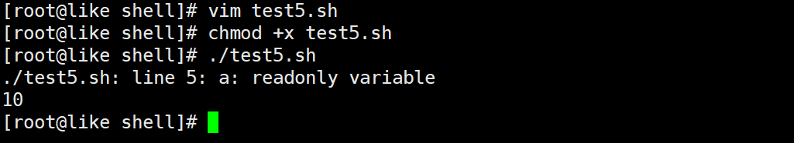
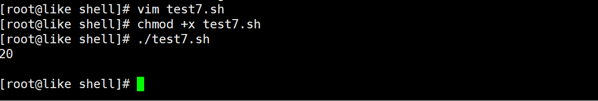

# shell

# shell介绍


什么是shell？


> shell(外壳)是一个用C语言编写的程序，它是用户使用Linux的桥梁。
>
>  
>
> shell既是一种命令语言，又是一种程序设计语言。
>
>  
>
> shell是指一种应用程序，这个应用程序提供了一个界面，用户通过这个界面访问操作系统内核的服务。
>


什么是脚本？


> 脚本简单地说就是一条条的文字命令，这些文字命令是可以看到的(如可以用记事本打开查看、编辑)
>
>  
>
> 常见的脚本：
>
>  
>
> JavaScript、VBScript、ASP、JSP、PHP、SQL、Perl、shell、Python、Ruby、JavaFX、Lua等
>


为什么要使用shell？


> shell属于内置的脚本  
程序开发的效率非常高，依赖于功能强大的命令可以讯速地完成开发任务(批量处理)
>


## 常见shell种类


在Linux中有很多类型的shell，不同的shell具备不同的功能，shell还决定了脚本中函数的语法，


Linux中默认的shell是/bin/bash,


流行的shell有ash、bash、ksh、csh、zsh等，不同的shell都有自己的特点以及用途。


csh


> C shell 使用的是“类C”语法，csh是具有C语言风格的一种shell，其内置命令有52个，较为庞大。
>
>  
>
> 目前使用的并不多，已经被/bin/tcsh所取代
>


ksh


> Korn shell 的语法与Bourne shell相同，同时具备了 C shell的易用特点。
>
>  
>
> 许多安装脚本都使用ksh，ksh有42条内部命令，与bash相比有一定的限制性。
>


tcsh


> tcsh 是 csh的增强版，与C shell完全兼容。
>


sh


> 是一个快捷方式，已经被/bin/bash所取代。
>


nologin


> 指用户不能登录
>
>  
>
> 例：修改用户不能登录 usermod -s选项
>
>  
>
> 		usermod -s /sbin/nologin like
>


zsh


> 目前Linux里最庞大的一种shell：zsh。
>
>  
>
> 它有84个内部命令，使用起来也比较复杂。一般情况下，不会使用该shell。
>


bash


> 大多数Linux系统默认使用的shell，
>
>  
>
> bash shell 是Bourne shell的一个免费版本，它是最早的Unix shell。
>
>  
>
> bash还有一个特点，可以通过help命令来查看帮助。
>
>  
>
> 包含的功能几乎可以涵盖shell所具有的功能，所以一般的shell脚本都会指定它为执行路径。
>


## 编写规范


**代码规范**：


```bash
#!/bin/bash		指定告知系统当前这个脚本要使用的shell解释器

shell相关指令
```


注意：


> 在一般情况下，人们并不区分 Bourne Shell 和 Bourne Again Shell，
>
>  
>
> 所以，像 #!/bin/sh，它同样也可以改为 #!/bin/bash。
>


**文件命名规范**


> 文件名.sh 		.sh 是 Linux下bash shell的默认后缀
>


## 使用流程


1. 创建.sh文件
2. 编写shell代码
3. 执行shell脚本		脚本必须得有执行权限


例：


```bash
vim hello.sh

#!/bin/bash
echo 'hello world'
```


注意：


> 输出的内容如果包含字母和符号，则需要用引号包括起来。
>
>  
>
> 如果是纯数字可以包也可以不包。
>


```bash
#修改权限	
chmod +x hello.sh

#执行：
./hello.sh
```


注意：


> 在运行时一定要写成./hello.sh，而不是hello.sh，运行其他二进制的程序也一样，
>
>  
>
> 直接写hello.sh，Linux系统会去PATH里寻找有没有叫hello.sh的，而只有/bin，/sbin，/usr/bin，/usr/sbin等在PARH里
>
>  
>
> 你的当前目录通常不在PATH里，所以写成hello.sh是会找不到命令的，要用./hello.sh告诉系统说，就在当前目录找。
>

---

脚本执行的另外方式：(了解)  不用赋予脚本+x权限，直接执行即可


```bash
sh hello.sh

bash hello.sh

/bin/sh hello.sh

/bin/bash hello.sh
```


# shell变量


Linux Shell中的变量分为：系统变量和用户自定义变量


系统变量：$ HOME　 $PWD	$shell	$USER等


显示当前shell中所有变量：set


## 变量的定义


变量名的规范：


> 变量名后面的等号左右不能有空格，这可能和你熟悉的所有编程语言都不一样。
>
>  
>
> 命名只能使用英文字母，数字和下划线，首个字符不能以数字开头。
>
>  
>
> 中间不能有空格，可以使用下划线“_”
>
>  
>
> 不能使用标点符号
>
>  
>
> 不能使用bash里的关键字(可用help命令查看保留的关键字)
>


语法：


```plain
定义：class_name="yunwei"

使用：echo $class_name

注意：
	在使用变量的时候一定需要在变量名前面添加一个$符号
```


案例：使用变量来输出helloworld


```plain
vim test3.sh

#!/bin/bash

str="hello world"
echo $str

chmod +x test3.sh

./test3.sh
```


关于单双引号的问题：


> 双引号能够识别变量，双引号能够实现转义
>
>  
>
> 单引号是不能识别变量，只会原样输出，单引号是不能转义的
>


案例2：定义一个变量


```plain
vim test4.sh

#!/bin/bash 

time=`date '+%F %T'`

echo $time

chmod +x test4.sh

./test4.sh
```


注意：


> 反引号，当在脚本中需要执行一些指令并且将指令的结果赋给变量的时候，需要使用反引号
>

---

## 只读变量


语法：readonly 变量名


```plain
vim test5.sh

#!/bin/bash

a=10
readonly a
a=20
echo $a

chmod +x ./test5.sh
```


注意：readonly 变量，不能unset





## 接收控制台输入


语法：read -p 提示信息 变量名


案例：编写一个脚本，要求执行之后提示用户输入文件的名称(路径)，创建该文件


```bash
vim test6.sh

#!/bin/bash  

read -p '请输入需要创建的文件路径：' filepath

touch $filepath

echo '文件创建成功！'

ls -l $filepath


chmod +x test6.sh

./test6.sh
```

---

## 删除变量


语法：unset 变量


案例：定义变量b=20，再输出b的值，随后删除b，最后再输出下b


```bash
vim test7.sh

#!/bin/bash 
b=20
echo $b
unset b
echo $b


chmod +X test7.sh

./test7.sh
```





## 环境变量


语法：


```bash
export 变量名=值	#将shell变量输出为环境变量

source /etc/profile		#让修改后的配置信息立即生效 或重启 

echo $变量名		#查询环境变量的值
```


## 位置参数变量


传递：./test.sh a b c


接收：在脚本中可以用“$1”表示a，"$2"表示b，依此类推


语法：


```bash
$n		#n为数字，$0代表命令本身，$1-$9代表第一到第九个参数，十以上的参数需要用大括号包含，如${10}

$*		#这个变量代表命令行中所有的参数，$*把所有参数看成一个整体

$@		#这个变量也代表命令行中所有的参数，不过$@把每个参数区分对待

$#		#这个变量代表命令行中所有参数的个数
```


例：


```bash
#!/bin/bash

echo "$0 $1 $2"
echo "$*"
echo "$@"
echo "参数个数=$#"
```


案例：创建自定义指令"user"，可以直接执行，要求该指令具备以下语法和功能


+ user -add 用户名     	【添加用户】
+ user -del 用户名          【删除用户及其家目录】


```bash
vim test.sh

#!/bin/bash

if [ $1 = '-add' ]
then
        useradd $2
else
        userdel -r $2
fi


chmod +x ./test.sh

./test.sh


#可以添加个别名，指向该bash文件
vim ~/.bashrc
alias user='/root/shell/test.sh'
```


## 预定义变量


shell设计者事先已经定义好的变量，可以直接在shell脚本中使用


语法：


```bash
$$		#当前进程的进程号(PID)

$!		#后台运行的最后一个进程的进程号(PID)

$?		#最后一次执行的命令的返回状态。如果这个变量的值为0，证明上一个命令正确执行；如果这个变量的值为非0(具体是哪个数，由命令自己来决定)，则证明上一个命令执行不正确
```


```bash
#!/bin/bash

echo "当前的进程号=$$"

#后台的方式运行myShell.sh
./myShell.sh &
echo "最后的进程号=$!"

echo "执行的值=$?"
```


# 运算符


语法：


```bash
"$((运算式))" 或 "$[运算式]"

expr m + n 
expr m - n
expr m \* n
expr m / n
expr m % n
#注意：expr运算符间要有空格
```


例：


```bash
#!/bin/bash

result1=$(((2+3)*4)) 
echo "result1=$result1"

result2=$[(2+3)*4]
echo "result2=$result2"

temp = `expr 2 + 3`
result3=`expr $temp \* 4`
echo "result3=$result3"
```


# 流程控制if


## 单条件


```bash
if condition
then
	command1
	command2
	……

fi
```


单行写法： （一般在命令行中执行的时候）


```bash
if [condition];then command;fi
```


## 双条件


```bash
if condition
then
	command1
	command2
	……

else
	command
fi
```


## 多条件


```bash
if condition1

then
	command1

elif condition2

then
	command2

else
	commandN

fi
```


例：输入的参数，大于等于60，则输出“及格”，如果小于60，则输出“不及格”


```bash
#!/bin/bash

if [ $1 -gt 60 ]
then
	echo "及格"
elif [ $1 -lt 60 ]
then
	echo "不及格"
fi
```


# 流程控制case


```bash
case 值 in
模式1)
    command1
    command2
    ...
    commandN
    ;;
模式2）
    command1
    command2
    ...
    commandN
    ;;
esac
```


例：


```bash
#!/bin/bash

case $1 in
"1")
echo "周一"
;;
"2")
echo "周二"
;;
*)
echo "other"
;;
esac
```


# 流程控制for


语法1：


```bash
for var in item1 item2 ... itemN
do
    command1
    command2
    ...
    commandN
done
```


例：


```bash
#!/bin/bash

for i in "$*"
do
	echo "the num is $i"
done   


for j in "$@"
do
	echo "the num is $j"
done
```


语法2：


```bash
for (( 初始值;循环控制条件;变量变化))
do
    command1
    command2
    ...
    commandN
done
```


例：


```bash
#!/bin/bsh

sum=0
for ((i=1;i<=100;i++))
do
	sum=$[$sum+$i]
done	
echo "sum=$sum"
```


# 流程控制while


语法：


```bash
while condition
do
    command
done
```


例：


```bash
#!/bin/bash

sum=0
i=0

while [ $i -le $1 ]
do
	sum=$[$sum+$i
    i=$[$i+1]
done

echo "sum=$sum"
```


# 系统函数


+ basename	返回完整路径最后/的部分，常用于获取文件名


```bash
#test.txt
basename /home/aaa/test.txt		

#test
basename /home/aaa/test.txt .txt
```


+ dirname	返回完整路径最后/的前面的部分，常用于返回路径部分


```bash
#/home/aaa
dirname /home/aaa/test.txt
```


# 自定义函数


语法：


```bash
[ function ] funname [()]

{

    action;

    [return int;]

}
```


例：


```bash
#!/bin/bash

function getSum(){
	sum=$[ $n1 + $n2 ]
	echo "和是$sum"
}

read -p "请输入第一个数：" n1
read -p "请输入第二个数：" n2

getSum $n1 $n2
```


# 定时维护数据库


需求：


> 每天凌晨2:10备份数据库xktest到/data/backup/db
>
>  
>
> 备份开始和备份结束能够给出相应的提示信息
>
>  
>
> 备份后的文件要求以备份时间为文件名，并打包成.tar.gz的形式
>
>  
>
> 在备份的同时，检查是否有10天前备份的数据库文件，如果有将其删除
>


例：


```bash
cd /usr/sbin/

vim mysql_db_backup.sh
```


+ 编写脚本


```bash
#!/bin/bash

#备份路径
backup='/data/backup/db'
#时间
datetime=`date '+%F_%H%M%S'`
echo '=================开始备份======================'
echo "备份的路径是$backup/$datetime.tar.gz"

host='localhost'
db_user='root'
db_pwd='root'
#备份的数据库名
database='xktest'

#备份的路径文件夹不存在，就创建
[ ! -d "$backup/$datetime" ] && mkdir -p "$backup/$datetime"

#备份
mysqldump -u$db_user -p$db_pwd --host=$host $database | gzip > $backup/$datetime/$datetime.sql.gz

#打包备份文件
cd $backup
tar -zcvf $datetime.tar.gz $datetime

#删除临时目录
rm -rf $backup/$datetime

#删除10天前的备份文件
find $backup -mtime +10 -name "*.tar.gz" -exec rm -rm {} \;

echo '===========备份文件成功=========='
```


+ 计划任务


```bash
crontab -e 

10 2 * * * /usr/sbin/mysql_db_backup.sh
```


> 更新: 2021-06-20 22:31:34  
> 原文: <https://www.yuque.com/like321/gxyk74/yknwzl>