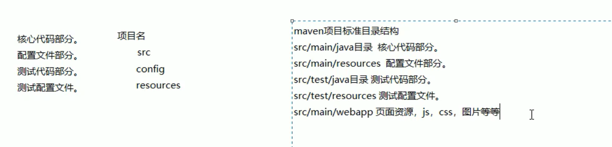
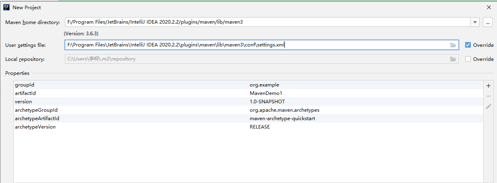

# Maven基础

# 一、Maven初级


Maven 的正确发音是[ˈmevən]


Maven 是一个项目管理工具，它包含了一个**项目对象模型** (**POM**：**Project Object Model**)，一组标准集合，一个项目生命周期(Project Lifecycle)，一个依赖管理系统(Dependency Management System)，和用来运行定义在生命周期阶段(phase)中插件(plugin)目标(goal)的逻辑。


maven 是一个项目管理工具，主要作用是在项目开发阶段对Java项目进行依赖管理和项目构建。


## 1、依赖管理


就是对jar包的管理。通过导入maven坐标，就相当于将仓库中的jar包导入了当前项目中。


## 2、项目一键构建


我们的项目，往往都要经历编译、测试、运行、打包、安装 ，部署等一系列过程。


通过maven的一个命令就可以完成项目从清理、编译、测试、报告、打包，部署整个过程。


什么是构建？


+ 指的是项目从编译、测试、运行、打包、安装 ，部署整个过程都交给 maven 进行管理，这个过程称为构建。
+ 一键构建：指的是整个构建过程，使用 maven 一个命令可以轻松完成整个工作。


Maven 规范化构建流程如下：


## 3、Maven的使用


### maven的安装


[https://maven.apache.org/download.cgi](https://maven.apache.org/download.cgi)


Maven 下载后，将 Maven 解压到一个没有中文没有空格的路径下，


解压后目录结构如下：


bin:存放了 maven 的命令，比如我们前面用到的 mvn tomcat:run


boot:存放了一些 maven 本身的引导程序，如类加载器等


conf:存放了 maven 的一些配置文件，如 setting.xml 文件


lib:存放了 maven 本身运行所需的一些 jar 包


至此我们的 maven 软件就可以使用了，前提是你的电脑上之前已经安装并配置好了 JDK。


### Maven 及 JDK 配置


配置 MAVEN_HOME ，变量值就是你的 maven 安装 的路径（bin 目录之前一级目录）


通过 mvn -v命令检查 maven 是否安装成功，看到 maven 的版本为 3.5.2 及 java 版本为 1.8 即为安装成功。


## 4、Maven仓库类型


maven 的工作需要从仓库下载一些 jar 包，本地的项目 A、项目 B 等都会通过 maven软件从远程仓库（可以理解为互联网上的仓库）下载 jar 包并存在本地仓库，本地仓库 就是本地文件夹，当第二次需要此 jar 包时则不再从远程仓库下载，因为本地仓库已经存在了，可以将本地仓库理解为缓存，有了本地仓库就不用每次从远程仓库下载了。


### 本地仓库 ：


用来存储从远程仓库或中央仓库下载的插件和 jar 包，项目使用一些插件或 jar 包，优先从本地仓库查找


默认本地仓库位置在 $ {user.dir}/.m2/repository， ${user.dir}表示 windows 用户目录


### 远程仓库：


如果本地需要插件或者 jar 包，本地仓库没有，默认去远程仓库下载。


远程仓库可以在互联网内也可以在局域网内。


+ maven私服（公司局域网内的仓库，需要自己搭建）
+ 其他公共远程仓库（例如apache提供的远程仓库，地址：https://repo.maven.apache.org/maven2/）


### 中央仓库 ：


在 maven 软件中内置一个远程仓库地址 [https://repo1.maven.org/maven2/](https://repo1.maven.org/maven2/) ，


它是中央仓库，服务于整个互联网，它是由 Maven 团队自己维护，里面存储了非常全的 jar 包，它包含了世界上大部分流行的开源项目构件。


### 全局 setting 与用户 setting


maven 仓库地址、私服等配置信息需要在 setting.xml 文件中配置，分为全局配置和用户配置。


+ 全局配置：


在 maven 安装目录下的有 conf/setting.xml 文件，此 setting.xml 文件用于 maven 的所有 project项目，它作为 maven 的全局配置。


+ 用户配置：


如需要个性配置则需要在用户配置中设置，用户配置的 setting.xml 文件默认的位置在：$ {user.dir} /.m2/settings.xml 目录中, ${user.dir} 指 windows 中的用户目录。


maven 会先找用户配置，如果找到则以用户配置文件为准，否则使用全局配置文件。


## 5、Maven工程的认识


### maven标准目录结构





### maven工程的运行


进入 maven 工程目录（当前目录有 pom.xml 文件），运行 tomcat:run 命令。


## 6、Maven常用命令


### compile：编译


compile 是 maven 工程的编译命令，作用是将 src/main/java 下的文件编译为 class 文件输出到 target目录下


cmd 进入命令状态，执行 mvn compile，


查看 target 目录，class 文件已生成，编译完成。


### test：测试


test 是 maven 工程的测试命令 mvn test，会执行 src/test/java 下的单元测试类。


cmd 执行 mvn test ,


执行 src/test/java 下单元测试类，运行 1 个测试用例，全部成功。


### clean：清理


clean 是 maven 工程的清理命令，执行 clean 会删除 target 目录及内容。


### package：打包


package 是 maven 工程的打包命令，对于 java 工程执行 package 打成 jar 包，对于 web 工程打成 war包。


### install：安装


install 是 maven 工程的安装命令，执行 install 将 maven 打成 jar 包或 war 包发布到本地仓库。


从运行结果中，可以看出：


当命令执行时，前面的操作过程也都会自动执行，


## 7、Maven指令的生命周期


maven 对项目构建过程分为三套相互独立的生命周期，请注意这里说的是“三套”，而且“相互独立”


### Clean Lifecycle


在进行真正的构建之前进行一些清理工作。


### Default Lifecycle


构建的核心部分，编译，测试，打包，部署等等。


### Site Lifecycle


生成项目报告，站点，发布站点。


## 8、Maven 的概念模型


Maven 包含了一个项目对象模型 (Project Object Model)，一组标准集合，一个项目生命周期(Project Lifecycle)，一个依赖管理系统(Dependency Management System)，和用来运行定义在生命周期阶段(phase)中插件(plugin)目标(goal)的逻辑。


### 项目对象模型 (Project Object Model)


一个 maven 工程都有一个 pom.xml 文件，通过 pom.xml 文件定义项目的坐标、项目依赖、项目信息、插件目标等。


### 依赖管理系统(Dependency Management System)


通过 maven 的依赖管理对项目所依赖的 jar 包进行统一管理。


比如：项目依赖 junit4.9，通过在 pom.xml 中定义 junit4.9 的依赖即使用 junit4.9，如下所示是 junit4.9的依赖定义：


```xml
<!-- 依赖关系 -->
<dependencies>
    <!-- 此项目运行使用 junit，所以此项目依赖 junit -->
    <dependency>
        <!-- junit 的项目名称 -->
        <groupId>junit</groupId>
        <!-- junit 的模块名称 -->
        <artifactId>junit</artifactId>
        <!-- junit 版本 -->
        <version>4.9</version>
        <!-- 依赖范围：单元测试时使用 junit -->
        <scope>test</scope>
    </dependency>
</dependencies>
```


### 一个项目生命周期(Project Lifecycle)


使用 maven 完成项目的构建，项目构建包括：清理、编译、测试、部署等过程，maven 将这些过程规范为一个生命周期，如下所示是生命周期的各个阶段


maven 通过执行一些简单命令即可实现上边生命周期的各个过程，比如执行 mvn compile 执行编译、执行 mvn clean 执行清理。


### 一组标准集合


maven 将整个项目管理过程定义一组标准，比如：通过 maven 构建工程有标准的目录结构，有标准的生命周期阶段、依赖管理有标准的坐标定义等。


### 插件(plugin)目标(goal)


maven 管理项目生命周期过程都是基于插件完成的。


# 二、idea开发Maven项目


## [IDEA集成Maven插件](https://blog.csdn.net/qq_42057154/article/details/106114515#_IDEAMaven_5)


选择本地 maven 安装目录，指定 maven 安装目录下 conf 文件夹中 settings 配置文件。


+ 设置maven在不联网的情况下使用本地插件


一般使用maven为我们提供好的骨架时，是需要联网的，配置这个，可以在没有网路的情况下，我们可以正常创建工程，并从之前已经使用过的工程中找到相应的骨架。


```plain
-DarchetypeCatalog=internal
```


### 配置阿里云镜像


在setting.xml文件中配置


```xml
<!--  配置阿里云  -->
<mirror>
    <id>nexus-aliyun</id>
    <mirrorOf>*</mirrorOf>
    <name>Nexus aliyun</name>
    <url>http://maven.aliyun.com/nexus/content/groups/public</url>
</mirror>
```


### 配置默认JDK版本


在setting.xml文件中配置


```xml
<profile>
    <id>jdk-1.8</id>
    <activation>
        <activeByDefault>true</activeByDefault>
        <jdk>1.8</jdk>
    </activation>
    <properties>
        <maven.compiler.source>1.8</maven.compiler.source>
        <maven.compiler.target>1.8</maven.compiler.target>
        <maven.compiler.compilerVersion>1.8</maven.compiler.compilerVersion>
    </properties>
</profile>
```


## [使用骨架创建Maven的java工程](https://blog.csdn.net/qq_42057154/article/details/106114515#_Mavenjava_62)


1. 选中左侧的Maven，并将Create from archetype选中，在下方选择骨架quickstart，点击Next。


2. 填写项目的名称以及存储的位置。点击下方的Artifact Coordinates，填写项目坐标的基本信息。


3. 确认信息是否正确





4. 目录结构如下：


5. 需要手动将maven文件夹补齐


6. 该文件夹是普通的文件夹，还要将该文件夹设为resource文件夹。


7. 同样，在test文件夹下创建resources文件夹。最后的目录结构如下：


## 不使用骨架创建Maven的java工程


1. 首先，新建一个工程，因为不使用骨架，可直接在Maven下点击Next按钮


2. 填写项目的名称以及存储的位置。点击下方的Artifact Coordinates，填写项目坐标的基本信息。


3. 目录结构


4. 新建的文件没有test文件夹下的resources文件夹，我们需要手动将maven文件夹补齐


5. 最后创建的java工程的目录结构


## 使用骨架创建Maven的java web工程


1. 选中左侧的Maven，并将Create from archetype选中，在下方选择骨架webapp，点击Next。


2. 填写项目的名称以及存储的位置。点击下方的Artifact Coordinates，填写项目坐标的基本信息。


3. 目录结构


4. 下面还要补全创建的目录。


5. 若创建的java文件夹是普通的文件夹，需要右键选择


6. 同理创建test文件夹。最后的目录结构如下：


## 不使用骨架创建Maven的java web工程


1. 新建项目,选择Maven。因为不使用骨架创建Web项目,所以不勾选Create from archetype，直接点击Next


2. 编辑项目名,编辑好后点击Finish


3. 不使用骨架的Web项目已经创建完成了,下面是基本的结构,没有web目录


4. 我们需要手动添加Web目录,我们需要添加web文件夹；File >> Project Structure


5. 按照以下顺序添加web目录。


6. 创建和修改位置,修改好后点击Apply


7. 然后点击Artifacts,加入刚才创建的项目


8.  现在项目基本创建完成,点击OK ，就完成了，下面就有maven的web项目基本目录了 
9.  基本目录就差一个测试工具类，可以把鼠标放在Test上面new。 


## 导入项目依赖的jar包


+ 创建一个servlet，src/java/main 创建了一个 Servlet，但缺少项目依赖而无法导包


要解决问题，就是要将 servlet-api-xxx.jar 包放进来，作为 maven 工程应当添加 servlet 的坐标，从而导入它的 jar包


+ 在 pom.xml 文件添加坐标：直接打开工程的 pom.xml 文件，添加坐标


+  从互联网搜索  
添加依赖需要指定依赖 jar 包的坐标，但是很多情况我们是不知道 jar 包的的坐标，可以通过如下方式查询： 


[https://search.maven.org/](https://search.maven.org/)


[https://mvnrepository.com/](https://mvnrepository.com/)


+ 每个 maven 工程都需要定义本工程的坐标，坐标是 maven 对 jar 包的身份定义


```xml
<!--项目名称，定义为组织名+项目名，类似包名-->
<groupId>com.itheima</groupId>
<!-- 模块名称 -->
<artifactId>hello_maven</artifactId>
<!-- 当前项目版本号，snapshot 为快照版本即非正式版本，release 为正式发布版本 -->
<version>0.0.1-SNAPSHOT</version>
<!-- 打包类型
    jar：执行 package 会打成 jar 包
    war：执行 package 会打成 war 包
    pom ：用于 maven 工程的继承，通常父工程设置为 pom 
-->
<packaging>war</packaging>
<name>第一个maven工程</name>
<description>第一个maven工程</description>
```


## jar包冲突解决


添加 jar 包的坐标时，还可以指定这个 jar 包将来的作用范围。


A 依赖 B，需要在 A 的 pom.xml 文件中添加 B 的坐标，添加坐标时需要指定依赖范围，


### 依赖范围：


+ compile：编译范围，指 A 在编译时依赖 B，此范围为默认依赖范围。编译范围的依赖会用在编译、测试、运行，由于运行时需要所以编译范围的依赖会被打包。
+ provided：provided 依赖只有在当 JDK 或者一个容器已提供该依赖之后才使用， provided 依 赖在编译和测试时需要，在运行时不需要，比如：servlet api 被 tomcat 容器提供。
+ runtime：runtime 依赖在运行和测试系统的时候需要，但在编译的时候不需要。比如：jdbc的驱动包。由于运行时需要所以 runtime 范围的依赖会被打包。
+ test：test 范围依赖 在编译和运行时都不需要，它们只有在测试编译和测试运行阶段可用，比如：junit。由于运行时不需要所以 test范围依赖不会被打包。
+ system：system 范围依赖与 provided 类似，但是你必须显式的提供一个对于本地系统中 JAR文件的路径，需要指定 systemPath 磁盘路径，system依赖不推荐使用。


在 maven-web 工程中测试各个 scop。


测试总结：


+ 默认引入 的 jar 包 ------- compile 【默认范围 可以不写】（编译、测试、运行 都有效 ）
+ servlet-api 、jsp-api ------- provided （编译、测试 有效， 运行时无效 防止和 tomcat 下 jar 冲突）
+ jdbc 驱动 jar 包 ---- runtime （测试、运行 有效 ）
+ junit ----- test （测试有效）
+ 依赖范围由强到弱的顺序是：compile>provided>runtime>test


**项目中添加的坐标**


## Maven工程运行环境修改


### 设置 jdk 编译版本


```xml
<plugin>
  <groupId>org.apache.maven.plugins</groupId>
  <artifactId>maven-compiler-plugin</artifactId>
  <version>3.1</version>
  <configuration>
    <target>1.8</target>
    <source>1.8</source>
    <encoding>UTF-8</encoding>
  </configuration>
</plugin>
```


### 添加 tomcat7 插件


此时点击 idea 最右侧 Maven Projects，


就可以看到我们新添加的 tomcat7 插件


双击 tomcat7插件下 tomcat7:run 命令直接运行项目


```xml
<plugin>
  <groupId>org.apache.tomcat.maven</groupId>
  <artifactId>tomcat7-maven-plugin</artifactId>
  <version>2.2</version>
  <configuration>
    <port>8080</port>
    <path>/</path>
  </configuration>
</plugin>
```


### 配置动态模板


> 更新: 2023-02-10 17:43:06  
> 原文: <https://www.yuque.com/like321/sq6ypl/bmgm6y>