# Maven高级

# 三、Maven高级


## 1.maven基础知识回顾


### 1.1 maven坐标书写规范


```xml
<dependency>
    <groupId>mysql</groupId>
    <artifactId>mysql-connector-java</artifactId>
    <version>5.1.32</version>
</dependency>
```


### 1.2 maven的依赖范围
| 依赖范围 | 对于编译classpath有效 | 对于测试classpath有效 | 对于运行时classpath有效 | 例子 |
| --- | --- | --- | --- | --- |
| compile | Y | Y | Y | spring-core |
| test | - | Y | - | Junit |
| provided | Y | Y | - | servlet-api |
| runtime | - | Y | Y | JDBC驱动 |
| system | Y | Y | - | 本地的，maven仓库之外的类库 |


## 2. maven的依赖传递


### 2.1 什么是依赖传递


在maven中，依赖是可以传递的，假设存在三个项目，分别是项目A，项目B以及项目C。


假设C依赖B，B依赖A，那么我们可以根据maven项目依赖的特征不难推出项目C也依赖A。


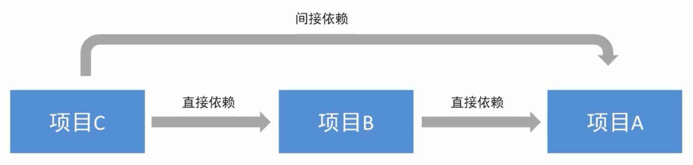


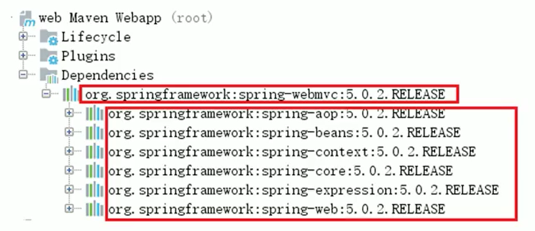


通过上面的图可以看到，我们的web项目直接依赖了spring-webmvc，而spring-webmvc依赖了sping-aop、spring-beans等。


最终的结果就是在我们的web项目中间接依赖了spring-aop、spring-beans等。


### 2.2 什么是依赖冲突


由于依赖传递现象的存在，


spring-webmvc-4.2.4 依赖 spirng-beans-4.2.4，spring-aop-5.0.2 依赖 spring-beans-5.0.2，


但是发现 spirng-beans-4.2.4 加入到了工程中，而我们希望 spring-beans-5.0.2 加入工程。


这就造成了依赖冲突。


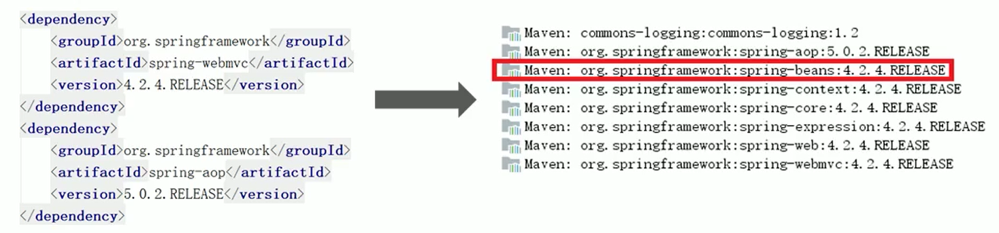


### 2.3 如何解决依赖冲突


#### 使用maven提供的依赖调解原则


+ 第一声明者优先原则


在 pom 文件中定义依赖，以先声明的依赖为准。其实就是根据坐标导入的顺序来确定最终使用哪个传递过来的依赖。


spring-aop和spring-webmvc都传递过来了spring-beans，但是因为spring-aop在前面，所以最终使用的spring-beans是由spring-aop传递过来的，而spring-webmvc传递过来的spring-beans则被忽略了。


+ 路径近者优先原则


在 pom 文件中定义依赖，以路径近者为准。


spring-aop和spring-webmvc都会传递过来spring-beans，那如果直接把spring-beans的依赖直接写到pom文件中，那么项目就不会再使用其他依赖传递来的spring-beans，因为自己直接在pom中定义spring-beans要比其它依赖传递过来的路径要近


#### 排除依赖


可以使用exclusions标签将传递过来的依赖排除出去。


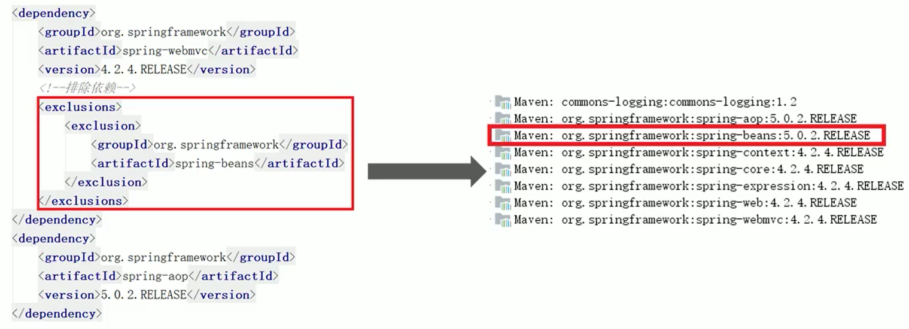


#### 版本锁定


采用直接锁定版本的方法确定依赖jar包的版本，版本锁定后则不考虑依赖的声明顺序或依赖的路径，以锁定的版本为准添加到工程中，此方法在企业开发中经常使用。


版本锁定的使用方式：


1. 在dependencyManagement标签中锁定依赖的版本


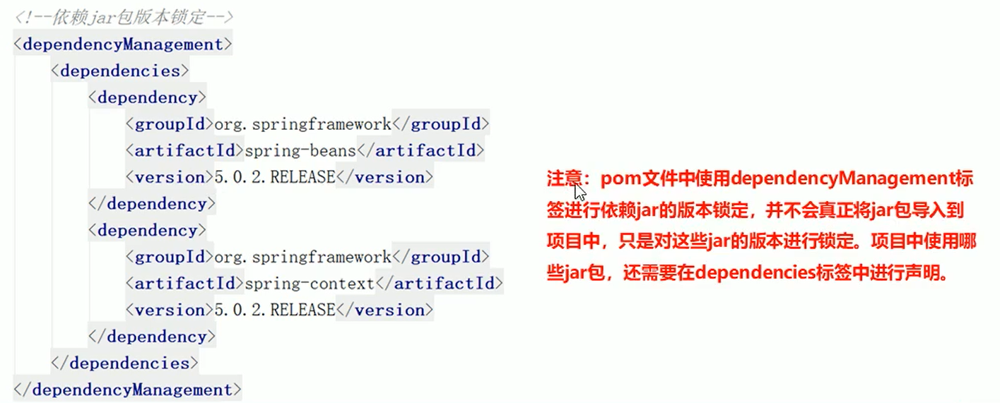


2. 在dependencies标签中声明需要导入的maven坐标


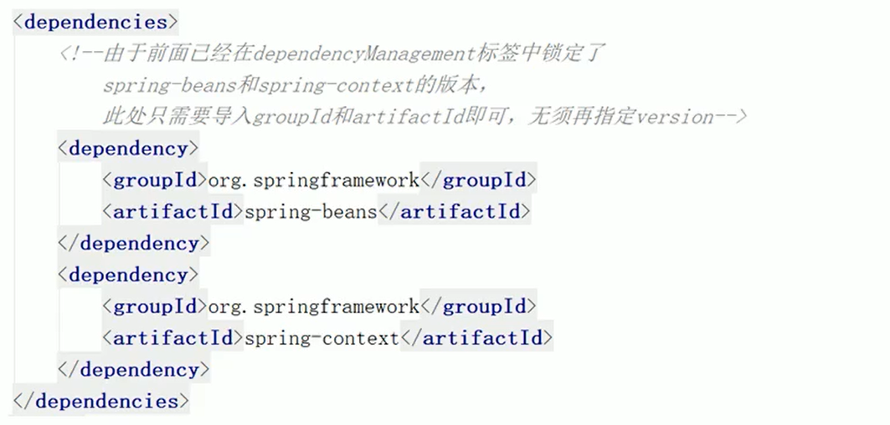


## 3.基于maven构建SSM工程案例


本案例基于maven构建 SSM（Spring+SpringMVC+Mybatis）工程，通过maven坐标进行依赖管理。


最终实现根据 id 查询商品信息的功能。


### 数据库环境搭建


+  创建数据库ssmtest 
+  创建商品表goods 


```sql
CREATE TABLE `goods` (
  `id` int(11) NOT NULL auto_increment,
  `name` varchar(255) default NULL,
  `price` float default NULL,
  `createtime` datetime default NULL,
  `detail` varchar(255) default NULL,
  PRIMARY KEY  (`id`)
) ENGINE=InnoDB DEFAULT CHARSET=utf8
```


### maven项目构建


#### 创建maven web项目


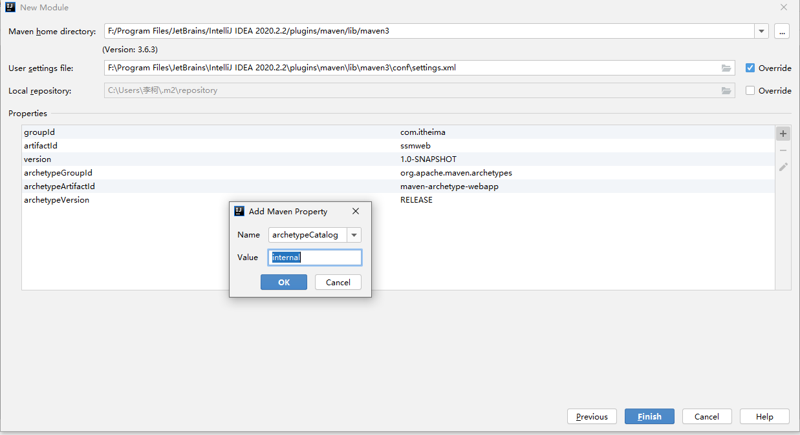


#### 配置pom.xml文件


```xml
<properties>
    <project.build.sourceEncoding>UTF-8</project.build.sourceEncoding>
    <maven.compiler.source>1.8</maven.compiler.source>
    <maven.compiler.target>1.8</maven.compiler.target>
    <spring.version>5.0.5.RELEASE</spring.version>
    <springmvc.version>5.0.5.RELEASE</springmvc.version>
    <mybatis.version>3.4.5</mybatis.version>
</properties>

<!--锁定jar版本-->
<dependencyManagement>
    <dependencies>
        <!-- Mybatis -->
        <dependency>
            <groupId>org.mybatis</groupId>
            <artifactId>mybatis</artifactId>
            <version>${mybatis.version}</version>
        </dependency>
        <!-- springMVC -->
        <dependency>
            <groupId>org.springframework</groupId>
            <artifactId>spring-webmvc</artifactId>
            <version>${springmvc.version}</version>
        </dependency>
        <!-- spring -->
        <dependency>
            <groupId>org.springframework</groupId>
            <artifactId>spring-context</artifactId>
            <version>${spring.version}</version>
        </dependency>
        <dependency>
            <groupId>org.springframework</groupId>
            <artifactId>spring-core</artifactId>
            <version>${spring.version}</version>
        </dependency>
        <dependency>
            <groupId>org.springframework</groupId>
            <artifactId>spring-aop</artifactId>
            <version>${spring.version}</version>
        </dependency>
        <dependency>
            <groupId>org.springframework</groupId>
            <artifactId>spring-web</artifactId>
            <version>${spring.version}</version>
        </dependency>
        <dependency>
            <groupId>org.springframework</groupId>
            <artifactId>spring-expression</artifactId>
            <version>${spring.version}</version>
        </dependency>
        <dependency>
            <groupId>org.springframework</groupId>
            <artifactId>spring-beans</artifactId>
            <version>${spring.version}</version>
        </dependency>
        <dependency>
            <groupId>org.springframework</groupId>
            <artifactId>spring-aspects</artifactId>
            <version>${spring.version}</version>
        </dependency>
        <dependency>
            <groupId>org.springframework</groupId>
            <artifactId>spring-context-support</artifactId>
            <version>${spring.version}</version>
        </dependency>
        <dependency>
            <groupId>org.springframework</groupId>
            <artifactId>spring-test</artifactId>
            <version>${spring.version}</version>
        </dependency>
        <dependency>
            <groupId>org.springframework</groupId>
            <artifactId>spring-jdbc</artifactId>
            <version>${spring.version}</version>
        </dependency>
        <dependency>
            <groupId>org.springframework</groupId>
            <artifactId>spring-tx</artifactId>
            <version>${spring.version}</version>
        </dependency>
    </dependencies>
</dependencyManagement>


<dependencies>
    <!-- mybatis与spring的整合 -->
    <dependency>
        <groupId>org.mybatis</groupId>
        <artifactId>mybatis</artifactId>
    </dependency>
    <dependency>
        <groupId>org.mybatis</groupId>
        <artifactId>mybatis-spring</artifactId>
        <version>1.3.1</version>
    </dependency>
    <!-- MySql驱动 -->
    <dependency>
        <groupId>mysql</groupId>
        <artifactId>mysql-connector-java</artifactId>
        <version>5.1.32</version>
    </dependency>
    <!-- druid数据库连接池 -->
    <dependency>
        <groupId>com.alibaba</groupId>
        <artifactId>druid</artifactId>
        <version>1.0.9</version>
    </dependency>
    <!-- springMVC核心-->
    <dependency>
        <groupId>org.springframework</groupId>
        <artifactId>spring-webmvc</artifactId>
    </dependency>
    <!-- spring相关 -->
    <dependency>
        <groupId>org.springframework</groupId>
        <artifactId>spring-context</artifactId>
    </dependency>
    <dependency>
        <groupId>org.springframework</groupId>
        <artifactId>spring-core</artifactId>
    </dependency>
    <dependency>
        <groupId>org.springframework</groupId>
        <artifactId>spring-aop</artifactId>
    </dependency>
    <dependency>
        <groupId>org.springframework</groupId>
        <artifactId>spring-web</artifactId>
    </dependency>
    <dependency>
        <groupId>org.springframework</groupId>
        <artifactId>spring-expression</artifactId>
    </dependency>
    <dependency>
        <groupId>org.springframework</groupId>
        <artifactId>spring-beans</artifactId>
    </dependency>
    <dependency>
        <groupId>org.springframework</groupId>
        <artifactId>spring-aspects</artifactId>
    </dependency>
    <dependency>
        <groupId>org.springframework</groupId>
        <artifactId>spring-context-support</artifactId>
    </dependency>
    <dependency>
        <groupId>org.springframework</groupId>
        <artifactId>spring-test</artifactId>
    </dependency>
    <dependency>
        <groupId>org.springframework</groupId>
        <artifactId>spring-jdbc</artifactId>
    </dependency>
    <dependency>
        <groupId>org.springframework</groupId>
        <artifactId>spring-tx</artifactId>
    </dependency>
    <!-- junit测试 -->
    <dependency>
        <groupId>junit</groupId>
        <artifactId>junit</artifactId>
        <version>4.12</version>
    </dependency>
    <dependency>
        <groupId>javax.servlet</groupId>
        <artifactId>servlet-api</artifactId>
        <version>2.5</version>
        <scope>provided</scope>
    </dependency>
    <dependency>
        <groupId>javax.servlet</groupId>
        <artifactId>jsp-api</artifactId>
        <version>2.0</version>
        <scope>provided</scope>
    </dependency>
    <!-- jstl -->
    <dependency>
        <groupId>javax.servlet</groupId>
        <artifactId>jstl</artifactId>
        <version>1.2</version>
    </dependency>
</dependencies>


<build>
    <plugins>
        <plugin>
            <groupId>org.apache.maven.plugins</groupId>
            <artifactId>maven-compiler-plugin</artifactId>
            <version>3.1</version>
            <configuration>
                <source>1.8</source>
                <target>1.8</target>
                <encoding>UTF-8</encoding>
            </configuration>
        </plugin>
    </plugins>
</build>
```


#### 实现spring+mybatis整合


+ 创建POJO类


```java
public class Goods {

    private int id;
    private String name;
    private float price;
    private Date createtime;
    private String detail;

    public int getId() {
        return id;
    }

    public void setId(int id) {
        this.id = id;
    }

    public String getName() {
        return name;
    }

    public void setName(String name) {
        this.name = name;
    }

    public float getPrice() {
        return price;
    }

    public void setPrice(float price) {
        this.price = price;
    }

    public Date getCreatetime() {
        return createtime;
    }

    public void setCreatetime(Date createtime) {
        this.createtime = createtime;
    }

    public String getDetail() {
        return detail;
    }

    public void setDetail(String detail) {
        this.detail = detail;
    }
    
}
```


+ 持久层DAO接口编写


```java
public interface GoodsMapper {

    public Goods findById(int id);

}
```


+  Mapper映射文件编写  
GoodsMapper.xml 


```xml
 <?xml version="1.0" encoding="UTF-8" ?>
<!DOCTYPE mapper PUBLIC "-//mybatis.org//DTD Mapper 3.0//EN"
        "http://mybatis.org/dtd/mybatis-3-mapper.dtd">

<mapper namespace="com.itheima.ssm.dao.GoodsMapper">
    <!--                                                  别名            -->
    <select id="findById" parameterType="int" resultType="goods">
        select * from goods where id = #{id}
    </select>
</mapper>
```


+ 业务层Service编写


```java
public interface GoodsService {

    public Goods findById(int id);

}
```


```java
@Service
@Transactional
public class GoodsServiceImpl implements GoodsService {

    @Autowired
    private GoodsMapper goodsMapper;

    @Override
    public Goods findById(int id) {
        return goodsMapper.findById(id);
    }
}
```


+ spring配置文件applicationContext-dao.xml编写


```xml
<?xml version="1.0" encoding="UTF-8"?>
<beans xmlns="http://www.springframework.org/schema/beans"
       xmlns:context="http://www.springframework.org/schema/context"
       xmlns:p="http://www.springframework.org/schema/p"
       xmlns:aop="http://www.springframework.org/schema/aop"
       xmlns:tx="http://www.springframework.org/schema/tx"
       xmlns:xsi="http://www.w3.org/2001/XMLSchema-instance"
       xsi:schemaLocation="http://www.springframework.org/schema/beans
						   http://www.springframework.org/schema/beans/spring-beans.xsd
						   http://www.springframework.org/schema/context
						   http://www.springframework.org/schema/context/spring-context.xsd
						   http://www.springframework.org/schema/aop
						   http://www.springframework.org/schema/aop/spring-aop.xsd
						   http://www.springframework.org/schema/tx
						   http://www.springframework.org/schema/tx/spring-tx.xsd">

    <!--配置数据源信息，使用druid连接池-->
    <bean id="dataSource" class="com.alibaba.druid.pool.DruidDataSource">
        <property name="driverClassName" value="com.mysql.jdbc.Driver"/>
        <property name="url" value="jdbc:mysql://localhost:3306/book"/>
        <property name="username" value="root"/>
        <property name="password" value="root"/>
    </bean>

    <!--配置spring整合mybatis框架的SQLSessionFactoryBean-->
    <bean id="sqlSessionFactory" class="org.mybatis.spring.SqlSessionFactoryBean">
        <property name="dataSource" ref="dataSource"/>
        <!--为指定包下的所有实体类创建别名-->
        <property name="typeAliasesPackage" value="com.itheima.ssm.pojo"/>
    </bean>

    <!--mapper扫描器，用于产生代理对象-->
    <bean class="org.mybatis.spring.mapper.MapperScannerConfigurer">
        <property name="basePackage" value="com.itheima.ssm.dao"/>
    </bean>

</beans>
```


+ spring配置文件applicationContext-service.xml编写


```xml
<?xml version="1.0" encoding="UTF-8"?>
<beans xmlns="http://www.springframework.org/schema/beans"
       xmlns:context="http://www.springframework.org/schema/context"
       xmlns:p="http://www.springframework.org/schema/p"
       xmlns:aop="http://www.springframework.org/schema/aop"
       xmlns:tx="http://www.springframework.org/schema/tx"
       xmlns:xsi="http://www.w3.org/2001/XMLSchema-instance"
       xsi:schemaLocation="http://www.springframework.org/schema/beans
                     http://www.springframework.org/schema/beans/spring-beans.xsd
                     http://www.springframework.org/schema/context
                     http://www.springframework.org/schema/context/spring-context.xsd
                     http://www.springframework.org/schema/aop
                     http://www.springframework.org/schema/aop/spring-aop.xsd
                     http://www.springframework.org/schema/tx
                     http://www.springframework.org/schema/tx/spring-tx.xsd">

    <!--配置扫描器，扫描Service-->
    <context:component-scan base-package="com.itheima.ssm.service"/>

    <!--事务管理器-->
    <bean id="transactionManager" class="org.springframework.jdbc.datasource.DataSourceTransactionManager">
        <property name="dataSource" ref="dataSource"/>
    </bean>

    <!--事物注解驱动-->
    <tx:annotation-driven transaction-manager="transactionManager"/>
</beans>
```


+ junit测试


```java
@RunWith(SpringJUnit4ClassRunner.class)
@ContextConfiguration(locations = {"classpath:applicationContext-service.xml", "classpath:applicationContext-dao.xml"})
public class SpringMybatisTest {

    @Autowired
    private GoodsService goodsService;

    @Test
    public void test1(){
        Goods goods = goodsService.findById(1);
        System.out.println(goods);
    }

}
```


#### 加入springmvc相关配置


+ 表现层Controller编写


```java
@Controller
@RequestMapping("/goods")
public class GoodsController {

    @Autowired
    private GoodsService goodsService;

    @RequestMapping("/showGoods/{id}")
    public ModelAndView findById(@PathVariable("id") int id, ModelAndView modelAndView) {
        Goods goods = goodsService.findById(id);

        modelAndView.addObject("goods", goods);
        modelAndView.setViewName("goods");
        return modelAndView;
    }

}
```


+ springmvc.xml文件编写


```xml
<?xml version="1.0" encoding="UTF-8" ?>
<beans xmlns="http://www.springframework.org/schema/beans"
       xmlns:mvc="http://www.springframework.org/schema/mvc"
       xmlns:context="http://www.springframework.org/schema/context"
       xmlns:xsi="http://www.w3.org/2001/XMLSchema-instance"
       xsi:schemaLocation="http://www.springframework.org/schema/beans
http://www.springframework.org/schema/beans/spring-beans.xsd
http://www.springframework.org/schema/mvc
http://www.springframework.org/schema/mvc/spring-mvc.xsd
http://www.springframework.org/schema/context
http://www.springframework.org/schema/context/spring-context.xsd">


    <!--配置扫描器，扫描Controller-->
    <context:component-scan base-package="com.itheima.ssm.controller"/>

    <!--    配置MVC注解驱动-->
    <mvc:annotation-driven/>

    <!--    配置内部资源视图解析器-->
    <bean id="internalResourceViewResolver" class="org.springframework.web.servlet.view.InternalResourceViewResolver">
        <property name="prefix" value="/WEB-INF/pages/"/>
        <property name="suffix" value=".jsp"/>
    </bean>

    <!--    开放静态资源访问权限-->
    <mvc:default-servlet-handler/>

</beans>
```


+ jsp页面编写


```plain
<%@ page contentType="text/html;charset=UTF-8" isELIgnored="false" language="java" %>
<html>
<head>
    <title>Title</title>
</head>
<body>
${goods}
</body>
</html>
```


+ 配置web.xml文件


```xml
<?xml version="1.0" encoding="UTF-8"?>
<web-app version="2.4"
         xmlns="http://java.sun.com/xml/ns/j2ee"
         xmlns:xsi="http://www.w3.org/2001/XMLSchema-instance"
         xsi:schemaLocation="http://java.sun.com/xml/ns/j2ee http://java.sun.com/xml/ns/j2ee/web-app_2_4.xsd">


    <display-name>Archetype Created Web Application</display-name>

    <!--指定Spring配置文件位置-->
    <context-param>
        <param-name>contextConfigLocation</param-name>
        <param-value>classpath*:applicationContext*.xml</param-value>
    </context-param>
    <!--配置Spring框架启动时使用的监听器-->
    <listener>
        <listener-class>org.springframework.web.context.ContextLoaderListener</listener-class>
    </listener>

    <!--配置SpringMVC的前端控制器-->
    <servlet>
        <servlet-name>dispatcherServlet</servlet-name>
        <servlet-class>org.springframework.web.servlet.DispatcherServlet</servlet-class>
        <!--   指定springMVC配置文件位置-->
        <init-param>
            <param-name>contextConfigLocation</param-name>
            <param-value>classpath:springmvc.xml</param-value>
        </init-param>
        <load-on-startup>1</load-on-startup>
    </servlet>
    <servlet-mapping>
        <servlet-name>dispatcherServlet</servlet-name>
        <url-pattern>/</url-pattern>
    </servlet-mapping>

    <!--  乱码过滤器-->
    <filter>
        <filter-name>CharacterEncodingFilter</filter-name>
        <filter-class>org.springframework.web.filter.CharacterEncodingFilter</filter-class>
        <init-param>
            <param-name>encoding</param-name>
            <param-value>UTF-8</param-value>
        </init-param>
    </filter>
    <filter-mapping>
        <filter-name>CharacterEncodingFilter</filter-name>
        <url-pattern>/*</url-pattern>
    </filter-mapping>


</web-app>
```


## 4.分模块构建maven工程


### 4.1 分模块构建maven工程分析


在现实生活中，汽车厂家进行汽车生产时，由于整个生产过程非常复杂和繁琐，工作量非常大，所以车场都会将整个汽车的部件分开生产，最终再将生产好的部件进行组装，形成一台完整的汽车。


在企业项目开发过程中，由于项目规模庞大，业务复杂，参与的人员比较多，一般会通过合理的模块拆分将一个大型的项目拆分为N多个小模块，分别进行开发。而且拆分出的模块可以非常容易的被其他模块复用。


常见的拆分方式有两种：


#### 按照业务模块进行拆分


每个模块拆分成一个maven工程，例如将一个项目分为用户模块、订单模块、购物车模块等，每个模块对应就是一个maven工程


#### 按照层进行拆分


例如持久层、业务层、表现层等，每个层对应就是一个maven工程


不管是上面哪种拆分方式，通常都会提供一个父工程，将一些公共的代码和配置提取到父工程中进行统一管理和配置


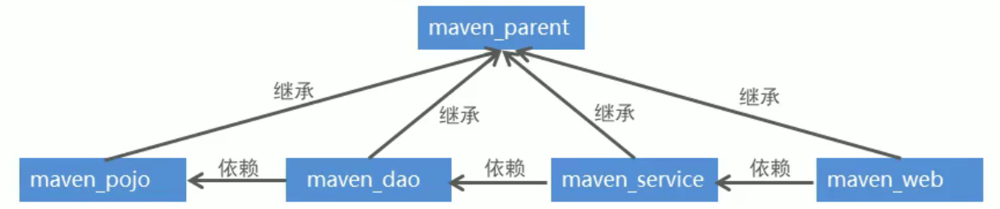


### 4.2 maven工程的继承


在Java语言中，类之间是可以继承的，通过继承，子类就可以引用父类中非private的属性和方法。


同样，在maven工程之间也可以继承，子工程继承父工程后，就可以使用在父工程中引入的依赖。继承的目的是为了消除重复代码。


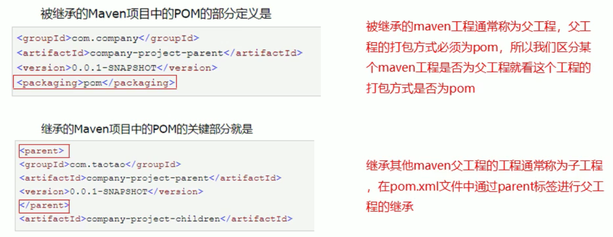


#### 父工程


```xml
<groupId>com.itheima</groupId>
<artifactId>parent</artifactId>
<version>1.0-SNAPSHOT</version>
<modules>
    <module>son</module>
</modules>
<!--    父工程的打包方式必须为pom-->
<packaging>pom</packaging>

<dependencies>
    <dependency>
        <groupId>mysql</groupId>
        <artifactId>mysql-connector-java</artifactId>
        <version>5.1.49</version>
    </dependency>
</dependencies>
```


#### 子工程


```xml
<!--    通过parent标签进行maven工程的继承-->
<parent>
    <artifactId>parent</artifactId>
    <groupId>com.itheima</groupId>
    <version>1.0-SNAPSHOT</version>
</parent>
<modelVersion>4.0.0</modelVersion>

<artifactId>son</artifactId>
```


### 4.3 maven工程的聚合


在maven工程的pom.xml文件中可以使用标签将其他maven工程聚合到一起，聚合的目的是为了进行统一操作。


例如拆分后的maven工程有多个，如果要进行打包，就需要针对每个工程分别执行打包命令，操作起来非常繁琐。


这时就可以使用标签将这些工程统一聚合到maven工程中，需要打包的时候，只需要在此工程中执行一次打包命令，其下被聚合的工程就都会被打包了。


```xml
<groupId>com.itheima</groupId>
<artifactId>parent</artifactId>
<version>1.0-SNAPSHOT</version>

<!--    聚合其他maven工程-->
<modules>
    <module>son</module>
    <!--        聚合跟继承没关系-->
    <module>../mavenDemo</module>
    <module>../ssmweb</module>
</modules>

<!--    父工程的打包方式必须为pom-->
<packaging>pom</packaging>
```


### 4.4 分模块构建maven工程具体实现


#### 父工程maven_parent构建


```xml
<properties>
    <spring.version>5.0.5.RELEASE</spring.version>
    <springmvc.version>5.0.5.RELEASE</springmvc.version>
    <mybatis.version>3.4.5</mybatis.version>
</properties>
<!--锁定jar版本-->
<dependencyManagement>
    <dependencies>
        <!-- Mybatis -->
        <dependency>
            <groupId>org.mybatis</groupId>
            <artifactId>mybatis</artifactId>
            <version>${mybatis.version}</version>
        </dependency>
        <!-- springMVC -->
        <dependency>
            <groupId>org.springframework</groupId>
            <artifactId>spring-webmvc</artifactId>
            <version>${springmvc.version}</version>
        </dependency>
        <!-- spring -->
        <dependency>
            <groupId>org.springframework</groupId>
            <artifactId>spring-context</artifactId>
            <version>${spring.version}</version>
        </dependency>
        <dependency>
            <groupId>org.springframework</groupId>
            <artifactId>spring-core</artifactId>
            <version>${spring.version}</version>
        </dependency>
        <dependency>
            <groupId>org.springframework</groupId>
            <artifactId>spring-aop</artifactId>
            <version>${spring.version}</version>
        </dependency>
        <dependency>
            <groupId>org.springframework</groupId>
            <artifactId>spring-web</artifactId>
            <version>${spring.version}</version>
        </dependency>
        <dependency>
            <groupId>org.springframework</groupId>
            <artifactId>spring-expression</artifactId>
            <version>${spring.version}</version>
        </dependency>
        <dependency>
            <groupId>org.springframework</groupId>
            <artifactId>spring-beans</artifactId>
            <version>${spring.version}</version>
        </dependency>
        <dependency>
            <groupId>org.springframework</groupId>
            <artifactId>spring-aspects</artifactId>
            <version>${spring.version}</version>
        </dependency>
        <dependency>
            <groupId>org.springframework</groupId>
            <artifactId>spring-context-support</artifactId>
            <version>${spring.version}</version>
        </dependency>
        <dependency>
            <groupId>org.springframework</groupId>
            <artifactId>spring-test</artifactId>
            <version>${spring.version}</version>
        </dependency>
        <dependency>
            <groupId>org.springframework</groupId>
            <artifactId>spring-jdbc</artifactId>
            <version>${spring.version}</version>
        </dependency>
        <dependency>
            <groupId>org.springframework</groupId>
            <artifactId>spring-tx</artifactId>
            <version>${spring.version}</version>
        </dependency>
    </dependencies>
</dependencyManagement>

<build>
    <plugins>
        <plugin>
            <groupId>org.apache.maven.plugins</groupId>
            <artifactId>maven-compiler-plugin</artifactId>
            <version>3.1</version>
            <configuration>
                <source>1.8</source>
                <target>1.8</target>
                <encoding>UTF-8</encoding>
            </configuration>
        </plugin>
    </plugins>
</build>
```


#### 子工程maven_pojo构建


+ pom.xml


```xml
<dependencies>
    <dependency>
        <groupId>log4j</groupId>
        <artifactId>log4j</artifactId>
        <version>1.2.12</version>
    </dependency>
</dependencies>
```


+ pojo


```java
package com.itheima.ssm.pojo;

import java.util.Date;

public class Goods {

    private int id;
    private String name;
    private float price;
    private Date createtime;
    private String detail;

    public int getId() {
        return id;
    }

    public void setId(int id) {
        this.id = id;
    }

    public String getName() {
        return name;
    }

    public void setName(String name) {
        this.name = name;
    }

    public float getPrice() {
        return price;
    }

    public void setPrice(float price) {
        this.price = price;
    }

    public Date getCreatetime() {
        return createtime;
    }

    public void setCreatetime(Date createtime) {
        this.createtime = createtime;
    }

    public String getDetail() {
        return detail;
    }

    public void setDetail(String detail) {
        this.detail = detail;
    }

    @Override
    public String toString() {
        return "Goods{" +
                "id=" + id +
                ", name='" + name + '\'' +
                ", price=" + price +
                ", createtime=" + createtime +
                ", detail='" + detail + '\'' +
                '}';
    }
}
```


#### 子工程maven_dao构建


+ 配置maven_dao工程的pom.xml文件


```xml
<dependencies>
    <dependency>
        <groupId>com.itheima</groupId>
        <artifactId>maven_pojo</artifactId>
        <version>1.0-SNAPSHOT</version>
    </dependency>
    <!-- Mybatis和mybatis与spring的整合 -->
    <dependency>
        <groupId>org.mybatis</groupId>
        <artifactId>mybatis</artifactId>
    </dependency>
    <dependency>
        <groupId>org.mybatis</groupId>
        <artifactId>mybatis-spring</artifactId>
        <version>1.3.1</version>
    </dependency>
    <!-- MySql驱动 -->
    <dependency>
        <groupId>mysql</groupId>
        <artifactId>mysql-connector-java</artifactId>
        <version>5.1.32</version>
    </dependency>
    <!-- druid数据库连接池 -->
    <dependency>
        <groupId>com.alibaba</groupId>
        <artifactId>druid</artifactId>
        <version>1.0.9</version>
    </dependency>
    <!-- c3p0数据库连接池 -->
    <dependency>
        <groupId>c3p0</groupId>
        <artifactId>c3p0</artifactId>
        <version>0.9.1.2</version>
    </dependency>
    <!-- spring相关 -->
    <dependency>
        <groupId>org.springframework</groupId>
        <artifactId>spring-context</artifactId>
    </dependency>
    <dependency>
        <groupId>org.springframework</groupId>
        <artifactId>spring-core</artifactId>
    </dependency>
    <dependency>
        <groupId>org.springframework</groupId>
        <artifactId>spring-aop</artifactId>
    </dependency>
    <dependency>
        <groupId>org.springframework</groupId>
        <artifactId>spring-expression</artifactId>
    </dependency>
    <dependency>
        <groupId>org.springframework</groupId>
        <artifactId>spring-beans</artifactId>
    </dependency>
    <dependency>
        <groupId>org.springframework</groupId>
        <artifactId>spring-aspects</artifactId>
    </dependency>
    <dependency>
        <groupId>org.springframework</groupId>
        <artifactId>spring-context-support</artifactId>
    </dependency>
    <dependency>
        <groupId>org.springframework</groupId>
        <artifactId>spring-test</artifactId>
    </dependency>
    <dependency>
        <groupId>org.springframework</groupId>
        <artifactId>spring-jdbc</artifactId>
    </dependency>
    <dependency>
        <groupId>org.springframework</groupId>
        <artifactId>spring-tx</artifactId>
    </dependency>
    <!-- junit测试 -->
    <dependency>
        <groupId>junit</groupId>
        <artifactId>junit</artifactId>
        <version>4.12</version>
    </dependency>
</dependencies>
```


+ 创建DAO接口


```java
package com.itheima.ssm.dao;

import com.itheima.ssm.pojo.Goods;

public interface GoodsMapper {

    public Goods findById(int id);

}
```


+  创建Mapper映射文件  
com.itheima.ssm.dao/GoodsMapper.xml 


```xml
<?xml version="1.0" encoding="UTF-8" ?>
<!DOCTYPE mapper PUBLIC "-//mybatis.org//DTD Mapper 3.0//EN"
        "http://mybatis.org/dtd/mybatis-3-mapper.dtd">

<mapper namespace="com.itheima.ssm.dao.GoodsMapper">
    <!--                                                  别名            -->
    <select id="findById" parameterType="int" resultType="goods">
        select * from goods where id = #{id}
    </select>
</mapper>
```


+ 在resources目录下创建spring配置文件applicationContext-dao.xml


```xml
<?xml version="1.0" encoding="UTF-8"?>
<beans xmlns="http://www.springframework.org/schema/beans"
       xmlns:xsi="http://www.w3.org/2001/XMLSchema-instance"
       xsi:schemaLocation="http://www.springframework.org/schema/beans
						   http://www.springframework.org/schema/beans/spring-beans.xsd">

    <!--配置数据源信息，使用druid连接池-->
    <bean id="dataSource" class="com.alibaba.druid.pool.DruidDataSource">
        <property name="driverClassName" value="com.mysql.jdbc.Driver"/>
        <property name="url" value="jdbc:mysql://localhost:3306/book"/>
        <property name="username" value="root"/>
        <property name="password" value="root"/>
    </bean>

    <!--配置spring整合mybatis框架的SQLSessionFactoryBean-->
    <bean id="sqlSessionFactory" class="org.mybatis.spring.SqlSessionFactoryBean">
        <property name="dataSource" ref="dataSource"/>
        <!--为指定包下的所有实体类创建别名-->
        <property name="typeAliasesPackage" value="com.itheima.ssm.pojo"/>
    </bean>

    <!--mapper扫描器，用于产生代理对象-->
    <bean class="org.mybatis.spring.mapper.MapperScannerConfigurer">
        <property name="basePackage" value="com.itheima.ssm.dao"/>
    </bean>

</beans>
```


#### 子工程maven_service构建


+ 配置maven_service工程的pom.xml文件


```xml
<dependencies>
    <dependency>
        <groupId>com.itheima</groupId>
        <artifactId>maven_dao</artifactId>
        <version>1.0-SNAPSHOT</version>
    </dependency>
</dependencies>
```


+ 创建Service接口和实现类


```java
package com.itheima.ssm.service;

import com.itheima.ssm.pojo.Goods;

public interface GoodsService {

    public Goods findById(int id);

}
```


```java
package com.itheima.ssm.service.impl;

import com.itheima.ssm.dao.GoodsMapper;
import com.itheima.ssm.pojo.Goods;
import com.itheima.ssm.service.GoodsService;
import org.springframework.beans.factory.annotation.Autowired;
import org.springframework.stereotype.Service;
import org.springframework.transaction.annotation.Transactional;

@Service
@Transactional
public class GoodsServiceImpl implements GoodsService {

    @Autowired
    private GoodsMapper goodsMapper;

    @Override
    public Goods findById(int id) {
        return goodsMapper.findById(id);
    }
}
```


+ 创建spring配置文件applicationContext-service.xml


```xml
<?xml version="1.0" encoding="UTF-8"?>
<beans xmlns="http://www.springframework.org/schema/beans"
       xmlns:context="http://www.springframework.org/schema/context"
       xmlns:tx="http://www.springframework.org/schema/tx"
       xmlns:xsi="http://www.w3.org/2001/XMLSchema-instance"
       xsi:schemaLocation="http://www.springframework.org/schema/beans
						   http://www.springframework.org/schema/beans/spring-beans.xsd
						   http://www.springframework.org/schema/context
						   http://www.springframework.org/schema/context/spring-context.xsd
						   http://www.springframework.org/schema/tx
						   http://www.springframework.org/schema/tx/spring-tx.xsd">

    <!--配置扫描器，扫描Service-->
    <context:component-scan base-package="com.itheima.ssm.service"/>

    <!--事务管理器-->
    <bean id="transactionManager" class="org.springframework.jdbc.datasource.DataSourceTransactionManager">
        <property name="dataSource" ref="dataSource"/>
    </bean>

    <!--事物注解驱动-->
    <tx:annotation-driven transaction-manager="transactionManager"/>
</beans>
```


#### 子工程maven_web构建


+  创建maven_web工程，注意打包方式为war 
+  配置maven_web工程的pom.xml文件 


```xml
<?xml version="1.0" encoding="UTF-8"?>
<web-app version="2.4"
         xmlns="http://java.sun.com/xml/ns/j2ee"
         xmlns:xsi="http://www.w3.org/2001/XMLSchema-instance"
         xsi:schemaLocation="http://java.sun.com/xml/ns/j2ee http://java.sun.com/xml/ns/j2ee/web-app_2_4.xsd">


  <display-name>Archetype Created Web Application</display-name>

  <!--指定Spring配置文件位置-->
  <context-param>
    <param-name>contextConfigLocation</param-name>
    <param-value>classpath*:applicationContext*.xml</param-value>
  </context-param>
  <!--配置Spring框架启动时使用的监听器-->
  <listener>
    <listener-class>org.springframework.web.context.ContextLoaderListener</listener-class>
  </listener>

  <!--配置SpringMVC的前端控制器-->
  <servlet>
    <servlet-name>dispatcherServlet</servlet-name>
    <servlet-class>org.springframework.web.servlet.DispatcherServlet</servlet-class>
    <!--   指定springMVC配置文件位置-->
    <init-param>
      <param-name>contextConfigLocation</param-name>
      <param-value>classpath:springmvc.xml</param-value>
    </init-param>
    <load-on-startup>1</load-on-startup>
  </servlet>
  <servlet-mapping>
    <servlet-name>dispatcherServlet</servlet-name>
    <url-pattern>/</url-pattern>
  </servlet-mapping>

  <!--  乱码过滤器-->
  <filter>
    <filter-name>CharacterEncodingFilter</filter-name>
    <filter-class>org.springframework.web.filter.CharacterEncodingFilter</filter-class>
    <init-param>
      <param-name>encoding</param-name>
      <param-value>UTF-8</param-value>
    </init-param>
  </filter>
  <filter-mapping>
    <filter-name>CharacterEncodingFilter</filter-name>
    <url-pattern>/*</url-pattern>
  </filter-mapping>


</web-app>
```


+ 创建Controller


```java
package com.itheima.ssm.controller;

import com.itheima.ssm.pojo.Goods;
import com.itheima.ssm.service.GoodsService;
import org.springframework.beans.factory.annotation.Autowired;
import org.springframework.stereotype.Controller;
import org.springframework.web.bind.annotation.PathVariable;
import org.springframework.web.bind.annotation.RequestMapping;
import org.springframework.web.servlet.ModelAndView;

@Controller
@RequestMapping("/goods")
public class GoodsController {

    @Autowired
    private GoodsService goodsService;

    @RequestMapping("/showGoods/{id}")
    public ModelAndView findById(@PathVariable("id") int id, ModelAndView modelAndView) {
        Goods goods = goodsService.findById(id);

        modelAndView.addObject("goods", goods);
        modelAndView.setViewName("goods");
        return modelAndView;
    }

}
```


+ 创建jsp页面


```plain
<%@ page contentType="text/html;charset=UTF-8" isELIgnored="false" language="java" %>
<html>
<head>
    <title>Title</title>
</head>
<body>
${goods}
</body>
</html>
```


+ 配置web.xml


```xml
  <!--指定Spring配置文件位置-->
  <context-param>
    <param-name>contextConfigLocation</param-name>
    <param-value>classpath*:applicationContext*.xml</param-value>
  </context-param>
  <!--配置Spring框架启动时使用的监听器-->
  <listener>
    <listener-class>org.springframework.web.context.ContextLoaderListener</listener-class>
  </listener>

  <!--配置SpringMVC的前端控制器-->
  <servlet>
    <servlet-name>dispatcherServlet</servlet-name>
    <servlet-class>org.springframework.web.servlet.DispatcherServlet</servlet-class>
    <!--   指定springMVC配置文件位置-->
    <init-param>
      <param-name>contextConfigLocation</param-name>
      <param-value>classpath:springmvc.xml</param-value>
    </init-param>
    <load-on-startup>1</load-on-startup>
  </servlet>
  <servlet-mapping>
    <servlet-name>dispatcherServlet</servlet-name>
    <url-pattern>/</url-pattern>
  </servlet-mapping>

  <!--  乱码过滤器-->
  <filter>
    <filter-name>CharacterEncodingFilter</filter-name>
    <filter-class>org.springframework.web.filter.CharacterEncodingFilter</filter-class>
    <init-param>
      <param-name>encoding</param-name>
      <param-value>UTF-8</param-value>
    </init-param>
  </filter>
  <filter-mapping>
    <filter-name>CharacterEncodingFilter</filter-name>
    <url-pattern>/*</url-pattern>
  </filter-mapping>
```


+ 创建springmvc配置文件springmvc.xml


```xml
<?xml version="1.0" encoding="UTF-8" ?>
<beans xmlns="http://www.springframework.org/schema/beans"
       xmlns:mvc="http://www.springframework.org/schema/mvc"
       xmlns:context="http://www.springframework.org/schema/context"
       xmlns:xsi="http://www.w3.org/2001/XMLSchema-instance"
       xsi:schemaLocation="http://www.springframework.org/schema/beans
http://www.springframework.org/schema/beans/spring-beans.xsd
http://www.springframework.org/schema/mvc
http://www.springframework.org/schema/mvc/spring-mvc.xsd
http://www.springframework.org/schema/context
http://www.springframework.org/schema/context/spring-context.xsd">


    <!--配置扫描器，扫描Controller-->
    <context:component-scan base-package="com.itheima.ssm.controller"/>

    <!--    配置MVC注解驱动-->
    <mvc:annotation-driven/>

    <!--    配置内部资源视图解析器-->
    <bean id="internalResourceViewResolver" class="org.springframework.web.servlet.view.InternalResourceViewResolver">
        <property name="prefix" value="/WEB-INF/pages/"/>
        <property name="suffix" value=".jsp"/>
    </bean>

    <!--    开放静态资源访问权限-->
    <mvc:default-servlet-handler/>

</beans>
```


项目整体结构如下：


1）maven_parent为父工程，其余工程为子工程，都继承父工程maven_parent


2）maven_parent工程将其子工程都进行了聚合


3）子工程之间存在依赖关系，比如maven_dao依赖maven_pojo、maven_service依赖maven_dao、 maven_web依赖maven_service


## 5. maven私服


### 5.1 私服说明


maven仓库分为本地仓库和远程仓库，而远程仓库又分为maven中央仓库、其他远程仓库和私服（私有服务器）。


其中，中央仓库是由maven官方提供的，而私服就需要我们自己搭建了。


maven私服就是公司局域网内的maven远程仓库，每个员工的电脑上安装maven软件并且连接maven私服，程序员可以将自己开发的项目打成jar并发布到私服，其它项目组成员就可以从私服下载所依赖的jar。


私服还充当一个代理服务器的角色，当私服上没有jar包时会从maven中央仓库自动下载。


### 5.2 搭建maven私服


nexus 是一个maven仓库管理器（其实就是一个软件），nexus可以充当maven私服，同时nexus还提供强大的仓库管理、构件搜索等功能。


#### 下载nexus


[https://help.sonatype.com/repomanager2/download/download-archives---repository-manager-oss](https://help.sonatype.com/repomanager2/download/download-archives---repository-manager-oss)


[https://help.sonatype.com/repomanager3/download/download-archives---repository-manager-3](https://help.sonatype.com/repomanager3/download/download-archives---repository-manager-3)


#### 安装nexus


[https://www.cnblogs.com/hujunzheng/p/9807646.html](https://www.cnblogs.com/hujunzheng/p/9807646.html)


将下载的压缩包进行解压，进入bin目录


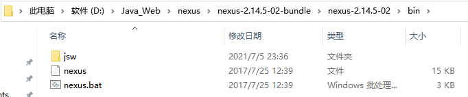


打开cmd窗口并进入上面bin目录下，执行命令安装服务（注意需要以管理员身份运行cmd命令）


```plain
nexus.bat uninstall
nexus.bat install
```


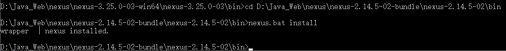


#### 启动nexus


经过前面命令已经完成nexus的安装，可以通过如下两种方式启动nexus服务：


+ 在Windows系统服务中启动nexus


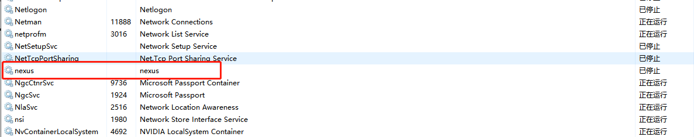


+ 在命令行执行nexus.bat start命令启动nexus


```plain
nexus.bat start <optional-service-name>   //启动nexus服务

nexus.bat stop <optional-service-name>    //停止nexus服务
```


配置文件


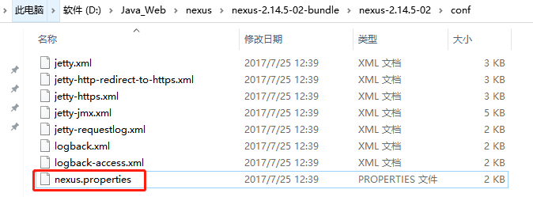


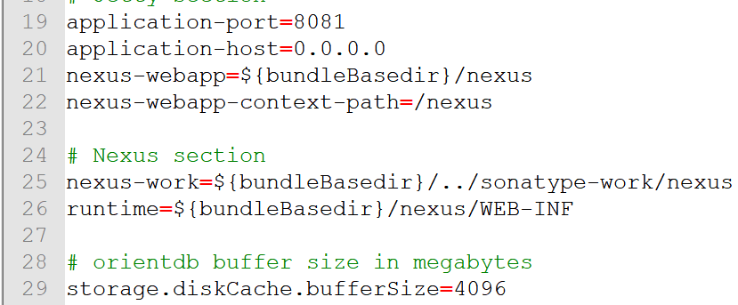


#### 访问nexus


启动nexus服务后，访问http://localhost:8081/nexus


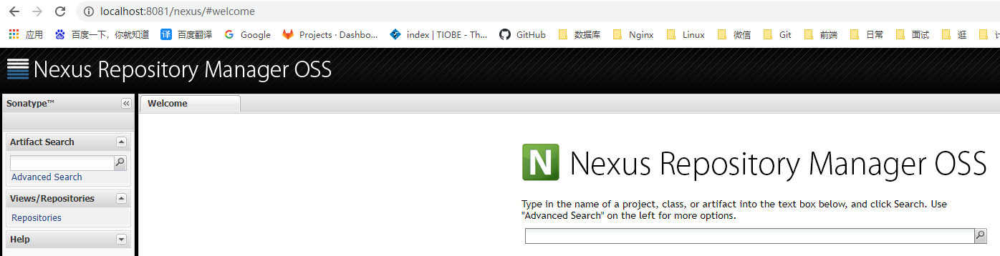


使用默认用户名admin和密码admin123登录系统


登录成功后点击左侧菜单Repositories可以看到nexus内置的仓库列表（如下图）


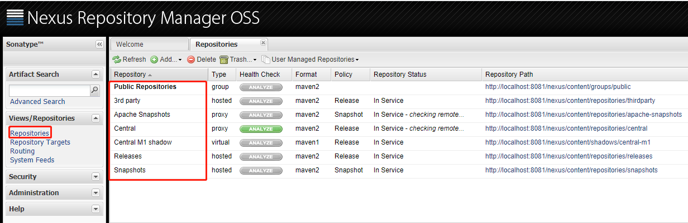


#### nexus仓库类型


通过前面的仓库列表可以看到，nexus默认内置了很多仓库，这些仓库可以划分为4种类型，每种类型的仓库用于存放特定的jar包：


+  hosted，宿主仓库，  
部署自己的jar到这个类型的仓库，包括Releases和Snapshots两部分，Releases为公司内部发布版本仓库、 Snapshots为公司内部测试版本仓库 
+  proxy，代理仓库，  
用于代理远程的公共仓库，如maven中央仓库，用户连接私服，私服自动去中央仓库下载jar包或者插件 
+  group，仓库组，  
用来合并多个hosted/proxy仓库，通常我们配置自己的maven连接仓库组 
+  virtual(虚拟)：兼容Maven1版本的jar或者插件 

| 仓库名 | 作用 |
| --- | --- |
| hosted（宿主仓库库） | 存放本公司开发的jar包（正式版本、测试版本） |
| proxy（代理仓库） | 代理中央仓库、Apache下测试版本的jar包 |
| group（组仓库） | 使用时连接组仓库，包含Hosted（宿主仓库）和Proxy（代理仓库） |
| virtual (虚拟仓库) | 基本用不到，重点关注上面三个仓库的使用 |


nexus仓库类型与安装目录对应关系


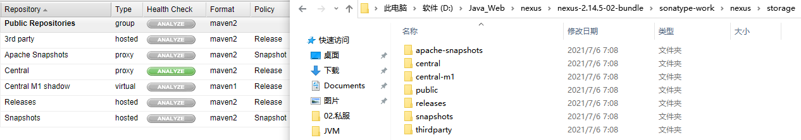


将central的远程地址修改如下（即改为aliyun的镜像，主要是速度快一些）


```plain
http://maven.aliyun.com/nexus/content/groups/public/
```


### 5.3 将项目发布到maven私服


maven私服是搭建在公司局域网内的maven仓库，公司内的所有开发团队都可以使用。


例如技术研发团队开发了一个基础组件，就可以将这个基础组件打成jar包发布到私服，其他团队成员就可以从私服下载这个jar包到本地仓库并在项目中使用。


将项目发布到maven私服操作步骤如下：[https://www.cnblogs.com/luotaoyeah/p/3817465.html](https://www.cnblogs.com/luotaoyeah/p/3817465.html)


#### 配置maven的settings.xml文件


配置maven的settings.xml文件	启用用户


```xml
<!-- 配置用户名密码开始 -->
<server>
    <id>releases</id>
    <username>admin</username>
    <password>admin123</password>
</server>
<server>
    <id>snapshots</id>
    <username>admin</username>
    <password>admin123</password>
</server>
<!-- 配置用户名密码结束 -->
```


注意：一定要在idea工具中引入的maven的settings.xml文件中配置


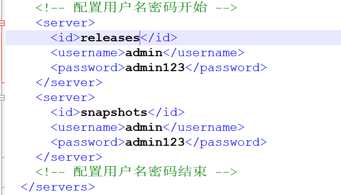


#### 配置项目的pom.xml文件


在pom.xml中分别对Release版本和Snapshot版本配置部署仓库，


其中id唯一，url分别对应私服中Releases和Snapshots仓库的Repository Path：


```xml
<!--添加要上传的项目pom中确定上传路径开始-->
<distributionManagement>
    <repository>
        <id>releases</id>
        <url>http://localhost:8081/nexus/content/repositories/releases/</url>
    </repository>
    <snapshotRepository>
        <id>snapshots</id>
        <url>http://localhost:8081/nexus/content/repositories/snapshots/</url>
    </snapshotRepository>
</distributionManagement>
<!--添加要上传的项目pom中确定上传路径结束-->
```


#### 执行mvn deploy命令


#### 修改私服中仓库的部署策略


Release版本的项目应该发布到Releases仓库中，对应的，Snapshot版本应该发布到Snapshots仓库中。


Maven根据pom.xml文件中版本号节点的属性是否包含-SNAPSHOT，来判断该项目是否是snapshot版本。


如果是snapshot版本，在执行mvn deploy部署命令时，maven会自动将项目发布到Snapshots仓库。


要发布项目，首先需要将Releases仓库和Snapshots仓库的“Deployment Policy”设置为“Allow Redeploy”：


### 5.4 从私服下载jar到本地仓库


前面我们已经完成了将本地项目打成jar包发布到maven私服，下面我们就需要从maven私服下载jar包到本地仓库。


具体操作步骤如下：


1. 为仓库列表配置的下载镜像列表标签下增加下面内容


```xml
<mirror>
    <!--该镜像的唯一标识符。id用来区分不同的mirror元素。  -->
    <id>dev</id>
    <name>internal nexus repository</name>
    <!--镜像采用配置好的组的地址-->
    <!--该镜像的URL。构建系统会优先考虑使用该URL，而非使用默认的服务器URL。  -->
    <url>http://localhost:8081/nexus/content/groups/public/</url>
    <!--此处配置所有的构建均从私有仓库中下载 *代表所有，也可以写central -->
    <mirrorOf>*</mirrorOf>
</mirror>
```


#### 配置下载模板


由于settings.xml文件中没有repositories的配置标签，所以需要使用profile标签来定义仓库。


```xml
<!--配置私服下载jar包的模板 开始-->
<profile>
    <!--profile的id-->
    <id>dev</id>
    <repositories>
        <repository>
            <!-- 仓库id，repositories标签内可以配置多个仓库，但要保证id不重复-->
            <id>nexus</id>
            <!--仓库地址，即nexus仓库组的地址-->
            <url>http://localhost:8081/nexus/content/groups/public/</url>
            <!--是否下载releases构件-->
            <releases>
                <enabled>true</enabled>
            </releases>
            <!--是否下载snapshots构件-->
            <snapshots>
                <enabled>true</enabled>
            </snapshots>
        </repository>
    </repositories>
    <pluginRepositories>
        <!-- 插件仓库，maven的运行依赖插件，也需要从私服下载插件 -->
        <pluginRepository>
            <!-- 插件仓库的id不允许重复，如果重复后边的配置会覆盖前边的配置 -->
            <id>public</id>
            <name>Public Repositories</name>
            <url>http://localhost:8081/nexus/content/groups/public/</url>
        </pluginRepository>
    </pluginRepositories>
</profile>
<!--配置私服下载jar包的模板 结束-->
```


#### 激活下载模板


使用profile标签定义仓库之后，需要激活才可生效，也即需要激活模板。


所以，还需要在settings.xml文件中添加如下配置。


```xml
<!--激活模板 开始-->
<activeProfiles>
    <activeProfile>dev</activeProfile>
</activeProfiles>
<!--激活模板 结束-->
```


## 6. 将第三方jar安装到本地仓库和maven私服


在maven工程的pom.xml文件中配置某个jar包的坐标后，如果本地的maven仓库不存在这个jar包，maven工具会自动到配置的maven私服下载，如果私服中也不存在，maven私服就会从maven中央仓库进行下载。


但是并不是所有的jar包都可以从中央仓库下载到，比如常用的Oracle数据库驱动的jar包在中央仓库就不存在。


此时需要到Oracle的官网下载驱动jar包，然后将此jar包通过maven命令安装到我们本地的maven仓库或者maven私服中，这样在maven项目中就可以使用maven坐标引用到此jar包了。


下载Oracle的jar包（略）


### 6.1 将第三方jar安装到本地仓库


#### mvn install命令进行安装


cd到jar包路径：


```plain
mvn install:install-file -Dfile=ojdbc14-10.2.0.4.0.jar -DgroupId=com.oracle -DartifactId=ojdbc14 –Dversion=10.2.0.4.0 -Dpackaging=jar
```


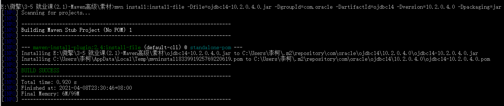


#### 查看本地maven仓库


确认安装是否成功


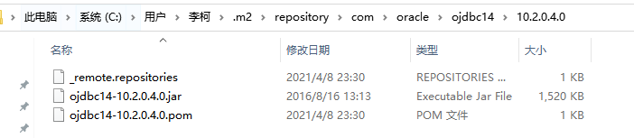


### 6.2 将第三方jar安装到maven私服


#### 配置第三方仓库的server信息


在maven的settings.xml配置文件中配置第三方仓库的server信息


```xml
<server>
  <id>thirdparty</id>
  <username>admin</username>
  <password>admin123</password>
</server>
```


#### 执行mvn deploy


```plain
mvn deploy:deploy-file -Dfile=ojdbc14-10.2.0.4.0.jar -DgroupId=com.oracle -DartifactId=ojdbc14 -Dversion=10.2.0.4.0 -Dpackaging=jar –Durl=http://localhost:8081/nexus/content/repositories/thirdparty/ -DrepositoryId=thirdparty
```


> 更新: 2023-02-10 17:49:44  
> 原文: <https://www.yuque.com/like321/sq6ypl/agwqcd>