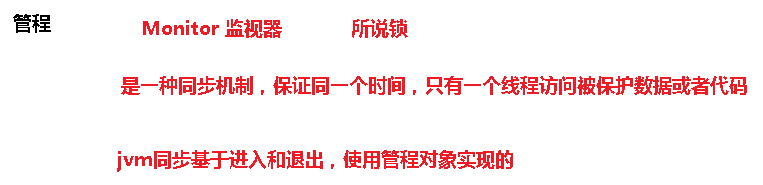
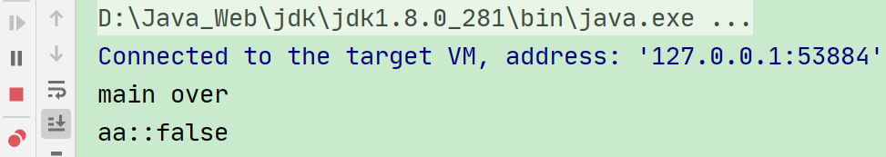
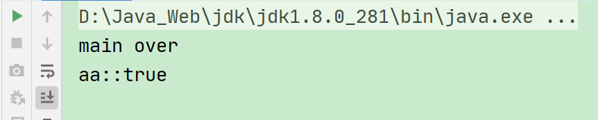

# 一、JUC概述

## 1、什么是JUC


在 Java 中，线程部分是一个重点，本篇文章说的 JUC 也是关于线程的。


JUC就是 java.util .concurrent 工具包的简称。这是一个处理线程的工具包，JDK1.5 开始出现的。


<font style="color:rgb(77, 77, 77);">里面的工具类可以很方便的实现</font>多线程<font style="color:rgb(77, 77, 77);">的开发。</font>


## 2、线程和进程概念


### 2.1、进程与线程


**进程（Process）** 是计算机中的程序关于某数据集合上的一次运行活动，是系统进行资源分配和调度的基本单位，是操作系统结构的基础。


在当代面向线程设计的计算机结构中，<font style="color:#E8323C;">进程是线程的容器</font>。


程序是指令、数据及其组织形式的描述，<font style="color:#E8323C;">进程是程序的实体。</font>

<font style="color:#E8323C;"></font>


**线程（thread） **是操作系统能够<font style="color:#E8323C;">进行运算调度的最小单位</font>。它被包含在进程之中，是进程中的实际运作单位。


一条线程指的是进程中<font style="color:#E8323C;">一个单一顺序的控制流</font>，一个进程中可以并发多个线程，每条线程并行执行不同的任务。


**总结来说:**


进程：指在系统中正在运行的一个应用程序；程序一旦运行就是进程；<font style="color:#E8323C;">进程——资源分配的最小单位。</font>


线程：系统分配处理器时间资源的基本单元，或者说进程之内独立执行的一个单元执行流。<font style="color:#E8323C;">线程——程序执行的最小单位。</font>


### 2.2、线程的状态


```java
public enum State {
    /**
     * 新建
     */
    NEW,

    /**
     * 准备就绪
     */
    RUNNABLE,

    /**
     * 阻塞
     */
    BLOCKED,

    /**
     * 不见不散
     */
    WAITING,

    /**
     * 过时不候
     */
    TIMED_WAITING,

    /**
     * 终结
     */
    TERMINATED;
}
```


### 2.3、wait和sleep的区别


1. sleep 是 Thread 的静态方法，wait 是 Object 的方法，任何对象实例都能调用。


2. sleep 不会释放锁，它也不需要占用锁。<font style="color:#E8323C;">wait 会释放锁</font>，但调用它的前提是当前线程占有锁(即代码要在 synchronized 中)。


3. 它们都可以被 <font style="color:#E8323C;">interrupted </font>方法中断。


### 2.4、并发和并行


#### 2.4.1、串行模式


串行表示所有任务都一一按先后顺序进行。串行意味着必须先装完一车柴才能运送这车柴，只有运送到了，才能卸下这车柴，并且只有完成了这整个三个步骤，才能进行下一个步骤。


**<font style="color:#E8323C;">串行是一次只能取得一个任务，并执行这个任务。</font>**


#### 2.4.2、并行模式


并行意味着可以同时取得多个任务，并同时去执行所取得的这些任务。


并行模式相当于将长长的一条队列，划分成了多条短队列，所以并行缩短了任务队列的长度。


并行的效率从代码层次上强依赖于多进程/多线程代码，从硬件角度上则依赖于多核 CPU。


#### 2.4.3、并发


**并发(concurrent)指的是多个程序可以同时运行的现象，更细化的是多进程可以同时运行或者多指令可以同时运行。**


但这不是重点，在描述并发的时候也不会去扣这种字眼是否精确，并发的重点在于它是一种现象, 并发描述的是多进程同时运行的现象。但实际上，对于单核心 CPU 来说，同一时刻只能运行一个线程。所以，这里的"同时运行"表示的不是真的同一时刻有多个线程运行的现象，这是并行的概念，而是提供一种功能让用户看来多个程序同时运行起来了，但实际上这些程序中的进程不是一直霸占 CPU 的，而是执行一会停一会。


**要解决大并发问题，通常是将大任务分解成多个小任务,** 由于操作系统对进程的调度是随机的，所以切分成多个小任务后，可能会从任一小任务处执行。这可能会出现一些现象：


+ 可能出现一个小任务执行了多次，还没开始下个任务的情况。这时一般会采用队列或类似的数据结构来存放各个小任务的成果


+ 可能出现还没准备好第一步就执行第二步的可能。这时，一般采用多路复用或异步的方式，比如只有准备好产生了事件通知才执行某个任务。


+ 可以多进程/多线程的方式并行执行这些小任务。也可以单进程/单线程执行这些小任务，这时很可能要配合多路复用才能达到较高的效率


#### 2.4.4、小结


**并发：**同一时刻多个线程在访问同一个资源，多个线程对一个点


+ 例子：春运抢票 电商秒杀...


**并行：**多项工作一起执行，之后再汇总


+ 例子：泡方便面，电水壶烧水，一边撕调料倒入桶中


### 2.5、管程(monitor)





**管程(monitor)**是保证了同一时刻只有一个进程在管程内活动，即<font style="color:#E8323C;">管程内定义的操作在同一时刻只被一个进程调用(由编译器实现)。但是这样并不能保证进程以设计的顺序执行</font>


JVM 中<font style="color:#E8323C;">同步</font>是<font style="color:#E8323C;">基于进入和退出管程(monitor)对象实现的</font>，每个<font style="color:#E8323C;">对象</font>都会有一个<font style="color:#E8323C;">管程(monitor)对象</font>，管程(monitor)会<font style="color:#E8323C;">随着 java 对象一同创建和销毁</font>


执行线程首先要<font style="color:#E8323C;">持有管程对象</font>，然后才能执行方法，当方法完成之后会<font style="color:#E8323C;">释放管程</font>，方法在执行时候会持有管程，其他线程无法再获取同一个管程


### 2.6、用户线程和守护线程


**用户线程：**平时用到的普通线程,自定义线程


**守护线程：**运行在后台，是一种特殊的线程，比如垃圾回收


**当主线程结束后,用户线程还在运行,JVM 存活**

```java
public static void main(String[] args) {
    Thread aa = new Thread(() -> {
        System.out.println(Thread.currentThread().getName() + "::" + Thread.currentThread().isDaemon());
        while (true) {
        }
    }, "aa");

    aa.start();

    System.out.println(Thread.currentThread().getName() + " over");
}
```



**如果没有用户线程,都是守护线程,JVM 结束**

```java
public static void main(String[] args) {
    Thread aa = new Thread(() -> {
        System.out.println(Thread.currentThread().getName() + "::" + Thread.currentThread().isDaemon());
        while (true) {
        }
    }, "aa");

    //设置守护线程
    aa.setDaemon(true);

    aa.start();

    System.out.println(Thread.currentThread().getName() + " over");
}
```




> 更新: 2022-08-31 16:15:44  
> 原文: <https://www.yuque.com/like321/vggeaw/ypgxyh>