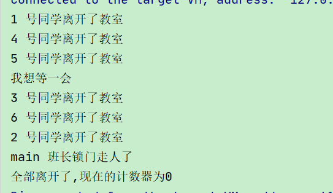
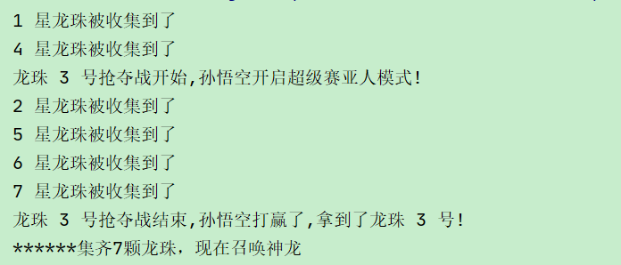
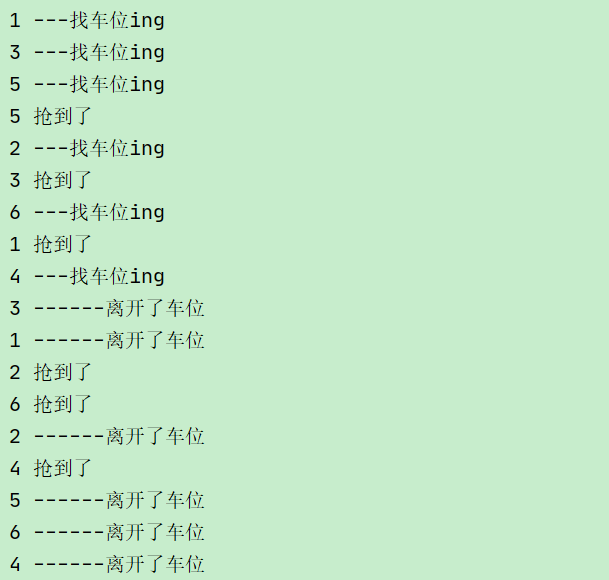

# 七、JUC强大的辅助类

JUC 中提供了三种常用的辅助类，通过这些辅助类可以很好的解决<font style="color:#E8323C;">线程数量过多时 Lock 锁的频繁操作</font>


## 1、减少计数CountDownLatch


CountDownLatch 类可以设置一个计数器，然后通过 countDown 方法来进行减 1 的操作，使用 await 方法等待计数器不大于 0，然后继续执行 await 方法之后的语句。


+ CountDownLatch 主要有两个方法，当一个或多个线程调用 await 方法时，这些线程会阻塞


+ 其它线程调用 countDown 方法会将计数器减 1(调用 countDown 方法的线程不会阻塞)


+ 当计数器的值变为 0 时，因 await 方法阻塞的线程会被唤醒，继续执行


**场景: 6 个同学陆续离开教室后班长才可以关门。**


```java
public class CountDownLatchDemo {
    //6个同学陆续离开教室之后，班长锁门
    public static void main(String[] args) throws Exception {

        //定义一个数值为 6 的计数器
        CountDownLatch countDownLatch = new CountDownLatch(6);

        //6个同学陆续离开教室
        for (int i = 1; i <= 6; i++) {
            new Thread(() -> {
                try {
                    if (Thread.currentThread().getName().equals("2")) {
                        System.out.println("我想等一会");
                        Thread.sleep(1000);
                    }

                    System.out.println(Thread.currentThread().getName() + " 号同学离开了教室");
                    //计数器减一,不会阻塞
                    countDownLatch.countDown();
                } catch (InterruptedException e) {
                    e.printStackTrace();
                }

            }, String.valueOf(i)).start();
        }

        //主线程等待  全部离开后自动唤醒主线程
        countDownLatch.await();

        //班长锁门
        System.out.println(Thread.currentThread().getName() + " 班长锁门走人了");

        System.out.println("全部离开了,现在的计数器为" + countDownLatch.getCount());
    }

}
```





## 2、循环栅栏 CyclicBarrier


CyclicBarrier 看英文单词可以看出大概就是循环阻塞的意思，


在使用中CyclicBarrier 的构造方法第一个参数是目标障碍数，每次执行 CyclicBarrier 一次障碍数会加一，如果达到了目标障碍数，才会执行 cyclicBarrier.await()之后的语句。


可以将 CyclicBarrier 理解为加 1 操作


**场景: 集齐 7 颗龙珠就可以召唤神龙**


```java
public class CyclicBarrierDemo {

    //创建固定值
    private static final int NUMBER = 7;

    //集齐七颗龙珠就可以召唤神龙
    public static void main(String[] args) {
        //定义循环栅栏
        CyclicBarrier cyclicBarrier = new CyclicBarrier(NUMBER, () -> {
            System.out.println("******集齐" + NUMBER + "颗龙珠，现在召唤神龙");
        });

        //定义 7 个线程分别去收集龙珠
        for (int i = 1; i <= 7; i++) {
            new Thread(() -> {
                try {
                    if (Thread.currentThread().getName().equals("3")) {
                        System.out.println("龙珠 3 号抢夺战开始,孙悟空开启超级赛亚人模式!");
                        Thread.sleep(1000);
                        System.out.println("龙珠 3 号抢夺战结束,孙悟空打赢了,拿到了龙珠 3 号!");
                    } else {
                        System.out.println(Thread.currentThread().getName() + " 星龙珠被收集到了");
                    }
                    //等待
                    cyclicBarrier.await();
                } catch (Exception e) {
                    e.printStackTrace();
                }
            }, String.valueOf(i)).start();
        }

    }

}
```





## 3、信号灯 Semaphore


Semaphore 的构造方法中传入的第一个参数是最大信号量（可以看成最大线程池），每个信号量初始化为一个最多只能分发一个许可证。


使用 <font style="color:#E8323C;">acquire </font>方法获得许可证，<font style="color:#E8323C;">release </font>方法释放许可证。


**场景: 抢车位, 6 部汽车 3 个停车位**


```java
public class SemaphoreDemo {

    //6辆汽车，停3个停车位
    public static void main(String[] args) {
        //创建Semaphore，设置许可数量
        Semaphore semaphore = new Semaphore(3);

        //模拟6辆汽车
        for (int i = 1; i <= 6; i++) {
            new Thread(() -> {

                try {
                    //抢占
                    System.out.println(Thread.currentThread().getName() + " ---找车位ing");
                    semaphore.acquire();
                    System.out.println(Thread.currentThread().getName() + " 抢到了");

                    //设置随机停车时间 随机5以内的
                    TimeUnit.SECONDS.sleep(new Random().nextInt(5));

                } catch (InterruptedException e) {
                    e.printStackTrace();
                } finally {
                    System.out.println(Thread.currentThread().getName() + " ------离开了车位");
                    //释放
                    semaphore.release();
                }
            }, String.valueOf(i)).start();
        }
    }

}
```





> 更新: 2022-08-22 18:30:46  
> 原文: <https://www.yuque.com/like321/vggeaw/txddzb>