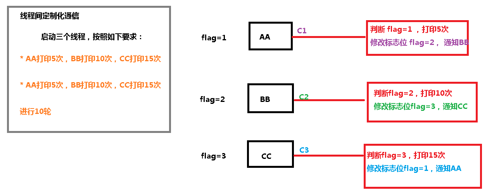

# 三、线程间通信

线程间通信的模型有两种：<font style="color:#E8323C;">共享内存</font>和<font style="color:#E8323C;">消息传递</font>。


以下方式都是基本这两种模型来实现的。我们来一道面试常见的题目来分析


**场景---两个线程，一个线程对当前数值加 1，另一个线程对当前数值减 1,要求用线程间通信**


## 1、Synchronized方案


```java
//第一步 创建资源类，定义属性和操作方法
class Share {
    //初始值
    private int number = 0;

    // +1的方法
    public synchronized void incr() throws InterruptedException {
        //第二步 判断 干活 通知
        if (number != 0) {//判断number值是否是0，如果不是0，等待
            this.wait(); //在哪里睡 就在哪里醒
        }
        //如果number值是0，就+1操作
        number++;
        System.out.println(Thread.currentThread().getName() + " ：：" + number);

        //通知其他线程
        this.notifyAll();
    }

    //-1的方法
    public synchronized void decr() throws InterruptedException {
        //第二步 判断 干活 通知
        if (number != 1) {//判断number值是否是1，如果不是1，等待
            this.wait(); //在哪里睡 就在哪里醒
        }
        //如果number值是1，就-1操作
        number--;
        System.out.println(Thread.currentThread().getName() + " ：：" + number);

        //通知其他线程
        this.notifyAll();
    }
}

/**
 * @author: like
 * @Date: 2021/11/16 23:58
 */
public class ThreadDemo1 {
    //第三步 创建多个线程，调用资源类的操作方法
    public static void main(String[] args) {

        Share share = new Share();

        //创建线程
        new Thread(() -> {
            for (int i = 0; i < 10; i++) {
                try {
                    share.incr();
                } catch (InterruptedException e) {
                    e.printStackTrace();
                }
            }
        }, "AA").start();

        new Thread(() -> {
            for (int i = 0; i < 10; i++) {
                try {
                    share.decr();
                } catch (InterruptedException e) {
                    e.printStackTrace();
                }
            }
        }, "BB").start();

        new Thread(() -> {
            for (int i = 0; i < 10; i++) {
                try {
                    share.incr();
                } catch (InterruptedException e) {
                    e.printStackTrace();
                }
            }
        }, "CC").start();

        new Thread(() -> {
            for (int i = 0; i < 10; i++) {
                try {
                    share.decr();
                } catch (InterruptedException e) {
                    e.printStackTrace();
                }
            }
        }, "DD").start();

    }


}
```


### 虚假唤醒问题


防止虚假唤醒


```java
//第一步 创建资源类，定义属性和操作方法
class Share {
    //初始值
    private int number = 0;

    // +1的方法
    public synchronized void incr() throws InterruptedException {
        //第二步 判断 干活 通知
        while (number != 0) {//判断number值是否是0，如果不是0，等待
            this.wait(); //在哪里睡 就在哪里醒
        }
        //如果number值是0，就+1操作
        number++;
        System.out.println(Thread.currentThread().getName() + " ：：" + number);

        //通知其他线程
        this.notifyAll();
    }

    //-1的方法
    public synchronized void decr() throws InterruptedException {
        //第二步 判断 干活 通知
        while (number != 1) {//判断number值是否是1，如果不是1，等待
            this.wait(); //在哪里睡 就在哪里醒
        }
        //如果number值是1，就-1操作
        number--;
        System.out.println(Thread.currentThread().getName() + " ：：" + number);

        //通知其他线程
        this.notifyAll();
    }
}

/**
 * @author: like
 * @Date: 2021/11/16 23:58
 */
public class ThreadDemo1 {
    //第三步 创建多个线程，调用资源类的操作方法
    public static void main(String[] args) {

        Share share = new Share();

        //创建线程
        new Thread(() -> {
            for (int i = 0; i < 10; i++) {
                try {
                    share.incr();
                } catch (InterruptedException e) {
                    e.printStackTrace();
                }
            }
        }, "AA").start();

        new Thread(() -> {
            for (int i = 0; i < 10; i++) {
                try {
                    share.decr();
                } catch (InterruptedException e) {
                    e.printStackTrace();
                }
            }
        }, "BB").start();

        new Thread(() -> {
            for (int i = 0; i < 10; i++) {
                try {
                    share.incr();
                } catch (InterruptedException e) {
                    e.printStackTrace();
                }
            }
        }, "CC").start();

        new Thread(() -> {
            for (int i = 0; i < 10; i++) {
                try {
                    share.decr();
                } catch (InterruptedException e) {
                    e.printStackTrace();
                }
            }
        }, "DD").start();

    }


}
```


## 2、Lock方案


```java
//第一步 创建资源类，定义属性和操作方法
class Share {
    private int number = 0;

    //创建Lock
    private Lock lock = new ReentrantLock();
    private Condition condition = lock.newCondition();

    //+1
    public void incr() {
        //上锁
        lock.lock();
        try {
            //判断
            while (number != 0) {
                condition.await();
            }
            //干活
            number++;
            System.out.println(Thread.currentThread().getName() + " ：：" + number);
            //通知
            condition.signalAll();
        } catch (InterruptedException e) {
            e.printStackTrace();
        } finally {
            //解锁
            lock.unlock();
        }
    }


    //-1
    public void decr() {
        //上锁
        lock.lock();
        try {
            //判断
            while (number != 1) {
                condition.await();
            }
            //干活
            number--;
            System.out.println(Thread.currentThread().getName() + " ：：" + number);
            //通知
            condition.signalAll();
        } catch (InterruptedException e) {
            e.printStackTrace();
        } finally {
            //解锁
            lock.unlock();
        }
    }
}

public class ThreadDemo2 {

    public static void main(String[] args) {

        Share share = new Share();

        new Thread(()->{
            for (int i = 0; i < 10; i++) {
                share.incr();
            }
        },"AA").start();

        new Thread(()->{
            for (int i = 0; i < 10; i++) {
                share.decr();
            }
        },"BB").start();

        new Thread(()->{
            for (int i = 0; i < 10; i++) {
                share.incr();
            }
        },"CC").start();

        new Thread(()->{
            for (int i = 0; i < 10; i++) {
                share.decr();
            }
        },"DD").start();
    }

}
```


## 3、线程间定制化通信


A 线程打印 5 次 A，B 线程打印 10 次 B，C 线程打印 15 次 C,按照此顺序循环 10 轮





```java
//第一步：创建资源类
class ShareResource {
    //定义标志位
    private int flag = 1; // 1 AA 2 BB 3 CC
    //创建Lock锁
    private Lock lock = new ReentrantLock();
    //创建3个condition
    private Condition c1 = lock.newCondition();
    private Condition c2 = lock.newCondition();
    private Condition c3 = lock.newCondition();

    //打印5次，参数第几轮
    public void print5(int loop) throws InterruptedException {
        //上锁
        lock.lock();
        try {
            //判断
            while (flag != 1) {
                //等待
                c1.await();
            }
            //干活
            for (int i = 1; i <= 5; i++) {
                System.out.println(Thread.currentThread().getName() + " ：：" + i + "：轮数：" + loop);
            }
            //通知
            flag = 2;//修改标志位
            c2.signal();//通知BB线程
        } finally {
            //释放锁
            lock.unlock();
        }
    }

    //打印10次，参数第几轮
    public void print10(int loop) throws InterruptedException {
        //上锁
        lock.lock();
        try {
            //判断
            while (flag != 2) {
                //等待
                c2.await();
            }
            //干活
            for (int i = 1; i <= 10; i++) {
                System.out.println(Thread.currentThread().getName() + " ：：" + i + "：轮数：" + loop);
            }
            //通知
            flag = 3;//修改标志位
            c3.signal();//通知CC线程
        } finally {
            //释放锁
            lock.unlock();
        }
    }

    //打印15次，参数第几轮
    public void print15(int loop) throws InterruptedException {
        //上锁
        lock.lock();
        try {
            //判断
            while (flag != 3) {
                //等待
                c3.await();
            }
            //干活
            for (int i = 1; i <= 15; i++) {
                System.out.println(Thread.currentThread().getName() + " ：：" + i + "：轮数：" + loop);
            }
            //通知
            flag = 1;//修改标志位
            c1.signal();//通知AA线程
        } finally {
            //释放锁
            lock.unlock();
        }
    }

}


public class ThreadDemo3 {

    public static void main(String[] args) {
        ShareResource shareResource = new ShareResource();
        new Thread(() -> {
            for (int i = 1; i <= 10; i++) {
                try {
                    shareResource.print5(i);
                } catch (InterruptedException e) {
                    e.printStackTrace();
                }
            }
        }, "AA").start();
        new Thread(() -> {
            for (int i = 1; i <= 10; i++) {
                try {
                    shareResource.print10(i);
                } catch (InterruptedException e) {
                    e.printStackTrace();
                }
            }
        }, "BB").start();
        new Thread(() -> {
            for (int i = 1; i <= 10; i++) {
                try {
                    shareResource.print15(i);
                } catch (InterruptedException e) {
                    e.printStackTrace();
                }
            }
        }, "CC").start();
    }

}
```


> 更新: 2022-08-22 17:55:47  
> 原文: <https://www.yuque.com/like321/vggeaw/zdepua>