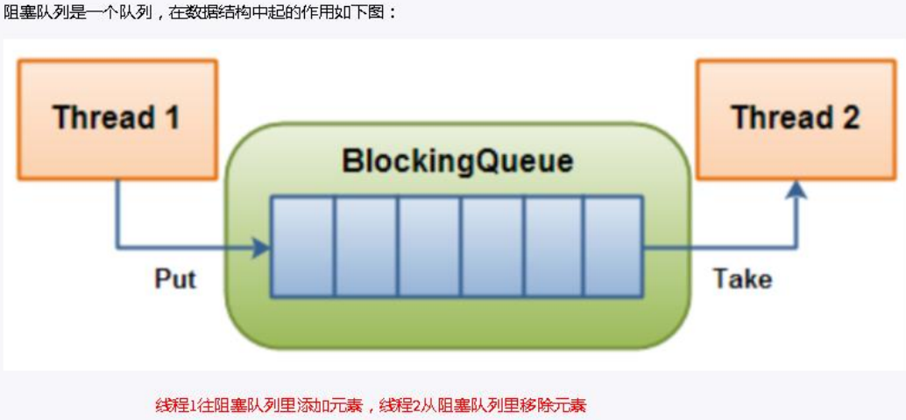

# 九、BlockingQueue阻塞队列


## 1、BlockingQueue简介


<font style="color:rgb(51,51,51);">Concurrent 包中，BlockingQueue 很好的解决了多线程中，如何高效安全“传输”数据的问题。通过这些高效并且线程安全的队列类，为我们快速搭建高质量的多线程程序带来极大的便利。本文详细介绍了 BlockingQueue 家庭中的所有成员，包括他们各自的功能以及常见使用场景。 </font>

<font style="color:rgb(51,51,51);"></font>

<font style="color:rgb(51,51,51);">阻塞队列，顾名思义，首先它是一个队列, 通过一个共享的队列，可以使得数据由队列的一端输入，从另外一端输出；</font>



<font style="color:rgb(51,51,51);"></font>

<font style="color:rgb(51,51,51);">当队列是空的，</font><font style="color:#E8323C;">从队列中获取元素</font><font style="color:rgb(51,51,51);">的操作将会被阻塞 </font>

<font style="color:rgb(51,51,51);"></font>

<font style="color:rgb(51,51,51);">当队列是满的，</font><font style="color:#E8323C;">往队列中添加元素</font><font style="color:rgb(51,51,51);">的操作将会被阻塞 </font>

<font style="color:rgb(51,51,51);"></font>

<font style="color:rgb(51,51,51);">试图从空的队列中获取元素的线程将会被阻塞，直到其他线程往空的队列插入新的元素 </font>

<font style="color:rgb(51,51,51);"></font>

<font style="color:rgb(51,51,51);">试图向已满的队列中添加新元素的线程将会被阻塞，直到其他线程从队列中移除一个或多个元素或者完全清空，使队列变得空闲起来并后续新增</font>

<font style="color:rgb(51,51,51);"></font>

<font style="color:rgb(51,51,51);"></font>

<font style="color:rgb(51,51,51);">常用的队列主要有以下两种：</font>

<font style="color:rgb(51,51,51);"></font>

+ <font style="color:rgb(51,51,51);">先进先出（FIFO）：先插入的队列的元素也最先出队列，类似于排队的功能。 从某种程度上来说这种队列也体现了一种公平性 </font>

<font style="color:rgb(51,51,51);"></font>

+ <font style="color:rgb(51,51,51);">后进先出（LIFO）：后插入队列的元素最先出队列，这种队列优先处理最近发生的事件(栈)</font>


<font style="color:rgb(51,51,51);">在多线程领域：所谓阻塞，在某些情况下会挂起线程（即阻塞），一旦条件满足，被挂起的线程又会自动被唤起 </font>

<font style="color:rgb(51,51,51);"></font>

### <font style="color:rgb(51,51,51);">为什么需要 BlockingQueue </font>
<font style="color:rgb(51,51,51);"></font>

<font style="color:rgb(51,51,51);">好处是我们</font><font style="color:#E8323C;">不需要关心什么时候需要阻塞线程，什么时候需要唤醒线程，因为这一切BlockingQueue 都给你一手包办了 </font>

<font style="color:rgb(51,51,51);"></font>

<font style="color:rgb(51,51,51);">在 concurrent 包发布以前，在多线程环境下，我们每个程序员都必须去自己控制这些细节，尤其还要兼顾效率和线程安全，而这会给我们的程序带来不小的复杂度。</font>

<font style="color:rgb(51,51,51);"></font>

<font style="color:rgb(51,51,51);">多线程环境中，通过队列可以很容易实现数据共享，比如经典的“生产者”和“消费者”模型中，通过队列可以很便利地实现两者之间的数据共享。</font>

<font style="color:rgb(51,51,51);">假设我们有若干生产者线程，另外又有若干个消费者线程。如果生产者线程需要把准备好的数据共享给消费者线程，利用队列的方式来传递数据，就可以很方便地解决他们之间的数据共享问题。但如果生产者和消费者在某个时间段内，万一发生数据处理速度不匹配的情况呢？理想情况下，如果生产者产出数据的速度大于消费者消费的速度，并且当生产出来的数据累积到一定程度的时候，那么生产者必须暂停等待一下（阻塞生产者线程），以便等待消费者线程把累积的数据处理完毕，反之亦然。</font>

<font style="color:rgb(51,51,51);"></font>

+ <font style="color:rgb(51,51,51);">当队列中没有数据的情况下，消费者端的所有线程都会被自动阻塞（挂起），直到有数据放入队列 </font>

<font style="color:rgb(51,51,51);"></font>

+ <font style="color:rgb(51,51,51);">当队列中填满数据的情况下，生产者端的所有线程都会被自动阻塞（挂起），直到队列中有空的位置，线程被自动唤醒</font>

<font style="color:rgb(51,51,51);"></font>

## <font style="color:rgb(51,51,51);">2、BlockingQueue的分类</font>


### <font style="color:rgb(0,0,0);">1 ArrayBlockingQueue(常用) </font>


<font style="color:#E8323C;">基于数组的阻塞队列</font><font style="color:rgb(51,51,51);">实现，在 ArrayBlockingQueue 内部，维护了一个</font><font style="color:#E8323C;">定长数组</font><font style="color:rgb(51,51,51);">，以便缓存队列中的数据对象，这是一个常用的阻塞队列，除了一个定长数组外，ArrayBlockingQueue 内部还保存着两个整形变量，分别标识着队列的</font><font style="color:#E8323C;">头部</font><font style="color:rgb(51,51,51);">和</font><font style="color:#E8323C;">尾部</font><font style="color:rgb(51,51,51);">在数组中的位置。 </font>

<font style="color:rgb(51,51,51);"></font>

<font style="color:rgb(51,51,51);">ArrayBlockingQueue 在生产者放入数据和消费者获取数据，都是共用同一个锁对象，由此也意味着两者无法真正并行运行，这点尤其不同于LinkedBlockingQueue；按照实现原理来分析，ArrayBlockingQueue 完全可以采用分离锁，从而实现生产者和消费者操作的完全并行运行。</font>

<font style="color:rgb(51,51,51);"></font>

<font style="color:rgb(51,51,51);">Doug Lea 之所以没这样去做，也许是因为 ArrayBlockingQueue 的数据写入和获取操作已经足够轻巧，以至于引入独立的锁机制，除了给代码带来额外的复杂性外，其在性能上完全占不到任何便宜。</font>

<font style="color:rgb(51,51,51);"></font>

<font style="color:rgb(51,51,51);">ArrayBlockingQueue 和 LinkedBlockingQueue 间还有一个明显的不同之处在于，前者在插入或删除元素时不会产生或销毁任何额外的对象实例，而后者则会生成一个</font><font style="color:#E8323C;">额外的 Node 对象</font><font style="color:rgb(51,51,51);">。这在长时间内需要高效并发地处理大批量数据的系统中，其对于GC 的影响还是存在一定的区别。而在创建 ArrayBlockingQueue 时，我们还可以控制对象的内部锁是否采用公平锁，默认采用非公平锁。 </font>

<font style="color:rgb(51,51,51);"></font>

**<font style="color:#E8323C;">一句话总结: 由数组结构组成的有界阻塞队列。</font>**

<font style="color:rgb(51,51,51);"></font>

### <font style="color:rgb(51,51,51);">2 LinkedBlockingQueue(常用) </font>


<font style="color:#E8323C;">基于链表的阻塞队列</font><font style="color:rgb(51,51,51);">，同 ArrayListBlockingQueue 类似，其内部也维持着一个数据缓冲队列（该队列由一个链表构成），当生产者往队列中放入一个数据时，队列会从生产者手中获取数据，并缓存在队列内部，而生产者立即返回； </font>

<font style="color:rgb(51,51,51);"></font>

<font style="color:rgb(51,51,51);">只有当队列缓冲区达到最大值缓存容量时（LinkedBlockingQueue 可以通过构造函数指定该值），才会阻塞生产者队列，直到消费者从队列中消费掉一份数据，生产者线程会被唤醒，反之对于消费者这端的处理也基于同样的原理。 </font>

<font style="color:rgb(51,51,51);"></font>

<font style="color:rgb(51,51,51);">而 LinkedBlockingQueue 之所以能够高效的处理并发数据，还因为其对于生产者端和消费者端分别采用了</font><font style="color:#E8323C;">独立的锁</font><font style="color:rgb(51,51,51);">来控制数据同步，这也意味着在高并发的情况下生产者和消费者可以并行地操作队列中的数据，以此来提高整个队列的并发性能。 </font>

<font style="color:rgb(51,51,51);"></font>

**<font style="color:rgb(51,51,51);">ArrayBlockingQueue 和 LinkedBlockingQueue 是两个最普通也是最常用的阻塞队列，一般情况下，在处理多线程间的生产者消费者问题，使用这两个类足以。 </font>**

**<font style="color:rgb(51,51,51);"></font>**

**<font style="color:#E8323C;">一句话总结: 由链表结构组成的有界（但大小默认值为integer.MAX_VALUE）阻塞队列。</font>**

<font style="color:rgb(51,51,51);"></font>

### <font style="color:rgb(51,51,51);">3 DelayQueue </font>


<font style="color:rgb(51,51,51);">DelayQueue 中的元素只有当其指定的</font><font style="color:#E8323C;">延迟时间</font><font style="color:rgb(51,51,51);">到了，才能够从队列中获取到该元素。DelayQueue 是一个没有大小限制的队列，因此往队列中插入数据的操作（生产者）永远不会被阻塞，而只有获取数据的操作（消费者）才会被阻塞。 </font>

<font style="color:rgb(51,51,51);"></font>

**<font style="color:#E8323C;">一句话总结: 使用优先级队列实现的延迟无界阻塞队列。</font>**

<font style="color:rgb(51,51,51);"></font>

### <font style="color:rgb(51,51,51);">4 PriorityBlockingQueue </font>


<font style="color:#E8323C;">基于优先级的阻塞队列</font><font style="color:rgb(51,51,51);">（优先级的判断通过构造函数传入的 Compator 对象来决定），但需要注意的是 PriorityBlockingQueue 并</font>**<font style="color:rgb(51,51,51);">不会阻塞数据生产者，而只会在没有可消费的数据时，阻塞数据的消费者</font>**<font style="color:rgb(51,51,51);">。 </font>

<font style="color:rgb(51,51,51);"></font>

<font style="color:rgb(51,51,51);">因此使用的时候要特别注意，</font>**<font style="color:rgb(51,51,51);">生产者生产数据的速度绝对不能快于消费者消费数据的速度</font>**<font style="color:rgb(51,51,51);">，否则时间一长，会最终耗尽所有的可用堆内存空间。 </font>

<font style="color:rgb(51,51,51);"></font>

<font style="color:rgb(51,51,51);">在实现 PriorityBlockingQueue 时，内部控制线程同步的锁采用的是</font>**<font style="color:rgb(51,51,51);">公平锁</font>**<font style="color:rgb(51,51,51);">。 </font>

<font style="color:rgb(51,51,51);"></font>

**<font style="color:#E8323C;">一句话总结: 支持优先级排序的无界阻塞队列。</font>**

<font style="color:rgb(51,51,51);"></font>

### <font style="color:rgb(51,51,51);">5 SynchronousQueue</font>


<font style="color:rgb(51,51,51);">一种无缓冲的等待队列，类似于无中介的直接交易，有点像原始社会中的生产者和消费者，生产者拿着产品去集市销售给产品的最终消费者，而消费者必须亲自去集市找到所要商品的直接生产者，如果一方没有找到合适的目标，那么对不起，大家都在集市等待。</font>

<font style="color:rgb(51,51,51);"></font>

<font style="color:rgb(51,51,51);">相对于有缓冲的 BlockingQueue 来说，少了一个中间经销商的环节（缓冲区），如果有经销商，生产者直接把产品批发给经销商，而无需在意经销商最终会将这些产品卖给那些消费者，由于经销商可以库存一部分商品，因此相对于直接交易模式，总体来说采用中间经销商的模式会吞吐量高一些（可以批量买卖）；但另一方面，又因为经销商的引入，使得产品从生产者到消费者中间增加了额外的交易环节，单个产品的及时响应性能可能会降低。 </font>

<font style="color:rgb(51,51,51);"></font>

<font style="color:rgb(51,51,51);">声明一个 SynchronousQueue 有两种不同的方式，它们之间有着不太一样的行为。 </font>

<font style="color:rgb(51,51,51);"></font>

**<font style="color:rgb(51,51,51);">公平模式和非公平模式的区别: </font>**

**<font style="color:rgb(51,51,51);"></font>**

+ <font style="color:rgb(51,51,51);">公平模式：SynchronousQueue 会采用公平锁，并配合一个 FIFO 队列来阻塞多余的生产者和消费者，从而体系整体的公平策略； </font>

<font style="color:rgb(51,51,51);"></font>

+ <font style="color:rgb(51,51,51);">非公平模式（SynchronousQueue 默认）：SynchronousQueue 采用非公平锁，同时配合一个 LIFO 队列来管理多余的生产者和消费者，</font>

<font style="color:rgb(51,51,51);"></font>

<font style="color:rgb(51,51,51);">而后一种模式，如果生产者和消费者的处理速度有差距，则很容易出现饥渴的情况，即可能有某些生产者或者是消费者的数据永远都得不到处理。 </font>

<font style="color:rgb(51,51,51);"></font>

**<font style="color:#E8323C;">一句话总结: 不存储元素的阻塞队列，也即单个元素的队列。</font>**

<font style="color:rgb(51,51,51);"></font>

### <font style="color:rgb(51,51,51);">6 LinkedTransferQueue </font>


<font style="color:rgb(51,51,51);">LinkedTransferQueue 是一个由链表结构组成的无界阻塞 TransferQueue 队列。相对于其他阻塞队列，LinkedTransferQueue 多了 tryTransfer 和 transfer 方法。</font>

<font style="color:rgb(51,51,51);"> </font>

<font style="color:rgb(51,51,51);">LinkedTransferQueue 采用一种预占模式。意思就是消费者线程取元素时，如果队列不为空，则直接取走数据，若队列为空，那就生成一个节点（节点元素为 null）入队，然后消费者线程被等待在这个节点上，后面生产者线程入队时发现有一个元素为 null 的节点，生产者线程就不入队了，直接就将元素填充到该节点，并唤醒该节点等待的线程，被唤醒的消费者线程取走元素，从调用的方法返回。 </font>

<font style="color:rgb(51,51,51);"></font>

**<font style="color:#E8323C;">一句话总结: 由链表组成的无界阻塞队列。</font>**

<font style="color:rgb(51,51,51);"></font>

### <font style="color:rgb(51,51,51);">7 LinkedBlockingDeque </font>


<font style="color:rgb(51,51,51);">LinkedBlockingDeque 是一个由链表结构组成的双向阻塞队列，即可以从队列的两端插入和移除元素。 </font>

<font style="color:rgb(51,51,51);">对于一些指定的操作，在插入或者获取队列元素时如果队列状态不允许该操作可能会阻塞住该线程直到队列状态变更为允许操作，这里的阻塞一般有两种情况 </font>

<font style="color:rgb(51,51,51);"></font>

+ <font style="color:rgb(51,51,51);">插入元素时: 如果当前队列已满将会进入阻塞状态，一直等到队列有空的位置时再将该元素插入，该操作可以通过设置超时参数，超时后返回 false 表示操作失败，也可以不设置超时参数一直阻塞，中断后抛出 InterruptedException 异常 </font>

<font style="color:rgb(51,51,51);"></font>

+ <font style="color:rgb(51,51,51);">读取元素时: 如果当前队列为空会阻塞住直到队列不为空然后返回元素，同样可以通过设置超时参数 </font>


**<font style="color:#E8323C;">一句话总结: 由链表组成的双向阻塞队列</font>**

<font style="color:rgb(51,51,51);"></font>

## <font style="color:rgb(51,51,51);">3、BlockingQueue核心方法</font>


| 方法类型 | 抛出异常 | 特殊值 | 阻塞 | 超时 |
| --- | --- | --- | --- | --- |
| 插入 | add(e) | offer(e) | put(e) | offer(e,time,unit) |
| 移除 | remove() | poll() | take() | poll(time,unit) |
| 检查 | element() | peek() | 不可用 | 不可用 |


| 抛出异常 | 当阻塞队列满时,再往队列里add插入元素会抛llegalStateException:Queue full<br/>当阻塞队列空时,再往队列里remove移除元素会抛NoSuchElementException |
| --- | --- |
| 特殊值 | 插入方法,成功ture失败false<br/>移除方法，成功返回出队列的元素，队列里没有就返回null |
| 一直阻塞 | 当阻塞队列满时,生产者线程继续往队列里put元素，队列会一直阻塞生产者线程直到put数据or响应中断退出<br/>当阻塞队列空时,消费者线程试图从队列里take元素，队列会一直阻塞消费者线程直到队列可用 |
| 超时退出 | 当阻塞队列满时 ，队列会阻塞生产者线程 定时间，超过限时后生 产者线程会退出 |


### 1、放入数据


+ <font style="color:rgb(51,51,51);">offer(anObject):表示如果可能的话,将 anObject 加到 BlockingQueue 里,即如果BlockingQueue 可以容纳,则返回 true,否则返回 false.</font>**<font style="color:rgb(51,51,51);">（本方法不阻塞当前执行方法的线程） </font>**

**<font style="color:rgb(51,51,51);"></font>**

+ <font style="color:rgb(51,51,51);">offer(E o, long timeout, TimeUnit unit)：可以设定等待的时间，如果在指定的时间内，还不能往队列中加入 BlockingQueue，则返回失败 </font>

<font style="color:rgb(51,51,51);"></font>

+ <font style="color:rgb(51,51,51);">put(anObject):把 anObject 加到 BlockingQueue 里,如果 BlockQueue 没有空间，则调用此方法的线程被阻断直到 BlockingQueue 里面有空间再继续</font>


### 2、获取数据


+ <font style="color:rgb(51,51,51);">poll(time): 取走 BlockingQueue 里排在首位的对象,若不能立即取出,</font>**<font style="color:rgb(51,51,51);">则可以等 time 参数规定的时间,取不到时返回 null </font>**

**<font style="color:rgb(51,51,51);"></font>**

+ <font style="color:rgb(51,51,51);">poll(long timeout, TimeUnit unit)：从 BlockingQueue 取出一个队首的对象，如果在指定时间内，队列一旦有数据可取，则立即返回队列中的数据。否则直到时间超时还没有数据可取，返回失败。</font>

<font style="color:rgb(51,51,51);"> </font>

+ <font style="color:rgb(51,51,51);">take(): 取走 BlockingQueue 里排在首位的对象,若 BlockingQueue 为空,</font>**<font style="color:rgb(51,51,51);">阻断进入等待状态直到 BlockingQueue 有新的数据被加入</font>**<font style="color:rgb(51,51,51);">; </font>

<font style="color:rgb(51,51,51);"></font>

+ <font style="color:rgb(51,51,51);">drainTo(): 一次性从 BlockingQueue 获取所有可用的数据对象（还可以指定获取数据的个数），通过该方法，可以提升获取数据效率；不需要多次分批加锁或释放锁。</font>

<font style="color:rgb(51,51,51);"></font>

## 4. 入门案例
```java
    int size = priceStrategyNewList.size();
    BlockingQueue<String> blockingQueue = new LinkedBlockingQueue<>(size);
    blockingQueue.addAll(GenerateKeyUtil.getGenerateKey(generateKeyService::generateKey, GenerateKeyType.OSCS_PRICE_SKU_STRATEGY_ID, size));
    
    for (PriceStrategyNew priceStrategyNew : priceStrategyNewList) {
        priceStrategyNew.setId(Long.valueOf(blockingQueue.take()));
        priceStrategyNew.setCreateUser(userName);
        priceStrategyNew.setCreateTime(currentDate);
        priceStrategyNew.setUpdateUser(userName);
        priceStrategyNew.setUpdateTime(currentDate);
    }
```


## 5. 总结


**<font style="color:rgb(51,51,51);">1. 在多线程领域：所谓阻塞，在某些情况下会</font>****<font style="color:#E8323C;">挂起线程</font>****<font style="color:rgb(51,51,51);">（即阻塞），一旦条件满足，被挂起的线程又会自动被唤起 </font>**

**<font style="color:rgb(51,51,51);"></font>**

**<font style="color:rgb(51,51,51);">2. 为什么需要 BlockingQueue? </font>**

**<font style="color:rgb(51,51,51);"></font>**

<font style="color:rgb(51,51,51);">在 concurrent 包发布以前，在多线程环境下， 我们每个程序员都必须去自己控制这些细节，尤其还要兼顾效率和线程安全，而这会给我们的程序带来不小的复杂度。</font>

<font style="color:rgb(51,51,51);"></font>

<font style="color:rgb(51,51,51);">使用后我们</font><font style="color:#E8323C;">不需要关心什么时候需要阻塞线程，什么时候需要唤醒线程</font><font style="color:rgb(51,51,51);">，因为这一切 BlockingQueue 都给你一手包办了</font>


> 更新: 2022-08-31 23:26:29  
> 原文: <https://www.yuque.com/like321/vggeaw/dlx90u>