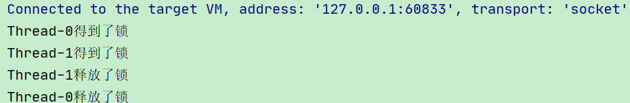

# 二、Lock接口

## 1、复习Synchronized


### 1.1、Synchronized作用范围


synchronized 是 Java 中的关键字，是一种同步锁。


它修饰的对象有以下几种：


1.  修饰一个代码块，被修饰的代码块称为<font style="color:#E8323C;">同步语句块</font>，其作用的范围是大括号{}括起来的代码，作用的对象是调用这个代码块的对象； 


2.  修饰一个方法，被修饰的方法称为同步方法，其作用的范围是整个方法，作用的对象是调用这个方法的对象； 
    - 虽然可以使用 synchronized 来定义方法，但 synchronized 并不属于方法定义的一部分，因此，<font style="color:#E8323C;">synchronized 关键字不能被继承。</font>

如果在父类中的某个方法使用了 synchronized 关键字，而在子类中覆盖了这个方法，在子类中的这个方法默认情况下并不是同步的，而必须显式地在子类的这个方法中加上synchronized 关键字才可以。  
	当然，还可以在子类方法中调用父类中相应的方法，这样虽然子类中的方法不是同步的，但子类调用了父类的同步方法，因此，子类的方法也就相当于同步了。 


3.  修饰一个静态的方法，其作用的范围是整个<font style="color:#E8323C;">静态方法，作用的对象是这个类的所有对象；</font> 


4.  修饰一个类，其作用的范围是 synchronized 后面括号括起来的部分，作用主的对象是这个类的所有对象。 


### 1.2、创建线程的多种方式


+  继承Thread类 
+  实现Runnable接口 
+  实现Callable接口 
+  使用线程池 


### 1.3、synchronized售票案例


```java
/**
 * 第一步 创建资源类，定义属性和操作方法
 */
class Ticket {
    //票数
    private int number = 30;

    //操作方法：卖票
    public synchronized void sale() {
        //判断：是否有票
        if (number > 0) {
            System.out.println(Thread.currentThread().getName() + "卖出第" + (number--) + "张票，剩下：" + number);
        }
    }
}

public class SaleTicket {

    //第二步 创建多个线程，调用资源类的操作方法
    public static void main(String[] args) {
        
        //创建Ticket对象
        Ticket ticket = new Ticket();

        //创建三个线程
        new Thread(() -> {
            //调用卖票方法
            for (int i = 0; i < 40; i++) {
                ticket.sale();
            }
        }, "AA").start();
        new Thread(() -> {
            //调用卖票方法
            for (int i = 0; i < 40; i++) {
                ticket.sale();
            }
        }, "BB").start();
        new Thread(() -> {
            //调用卖票方法
            for (int i = 0; i < 40; i++) {
                ticket.sale();
            }
        }, "CC").start();

    }
}
```


如果一个代码块被 synchronized 修饰了，当一个线程获取了对应的锁，并执行该代码块时，其他线程便只能一直等待，等待获取锁的线程释放锁，


获取锁的线程释放锁只会有两种情况：


1.  获取锁的线程执行完了该代码块，然后线程释放对锁的占有； 


2.  线程执行发生异常，此时 JVM 会让线程自动释放锁。 


那么如果这个获取锁的线程由于要等待 IO 或者其他原因（比如调用 sleep方法）被阻塞了，但是又没有释放锁，其他线程便只能干巴巴地等待，试想一下，这多么影响程序执行效率。


因此就需要有一种机制可以<font style="color:#E8323C;">不让等待的线程一直无期限地等待下去</font>（比如<font style="color:#E8323C;">只等待一定的时间</font>或者能够响应中断），通过 Lock 就可以办到。


## 2、什么是Lock接口


Lock 锁实现提供了比使用同步方法和语句可以获得的更广泛的锁操作。


它们允许更灵活的结构，可能具有非常不同的属性，并且可能支持多个关联的条件对象。Lock 提供了比 synchronized 更多的功能。


**Lock与Synchronized区别**


+  Lock 不是 Java 语言内置的，synchronized 是 Java 语言的关键字，因此是内置特性。Lock 是一个类，通过这个类可以实现同步访问； 


+  Lock 和 synchronized 有一点非常大的不同，采用 synchronized 不需要用户去手动释放锁，当 synchronized 方法或者 synchronized 代码块执行完之后，系统会自动让线程释放对锁的占用；  
而 Lock 则必须要用户去手动释放锁，如果没有主动释放锁，就有可能导致出现死锁现象。 


**Lock接口**


```java
public interface Lock {
 
    void lock();
 
    void lockInterruptibly() throws InterruptedException;

    boolean tryLock();
    
    boolean tryLock(long time, TimeUnit unit) throws InterruptedException;

    void unlock();

    Condition newCondition();
}
```


### 2.1、lock方法


lock()方法是平常使用得最多的一个方法，就是用来获取锁。如果锁已被其他线程获取，则进行等待。


采用 Lock，必须主动去释放锁，并且在<font style="color:#E8323C;">发生异常时，不会自动释放锁。</font>


因此一般来说，使用 Lock 必须在 try{}catch{}块中进行，并且将释放锁的操作放在finally 块中进行，以保证锁一定能被释放，<font style="color:#E8323C;">防止死锁的发生。</font>


通常使用 Lock来进行同步的话，是以下面这种形式去使用的：


```java
Lock lock = new ReentrantLock();

//加锁
lock.lock();

try {
    //处理任务
} catch (Exception ex) {

} finally {
    //释放锁
    lock.unlock();
}
```


### 2.2、newCondition方法


关键字 synchronized 与 wait()/notify()这两个方法一起使用可以实现等待/通知模式， 

Lock 锁的 newContition()方法返回 <font style="color:#E8323C;">Condition </font>对象，Condition 类也可以实现等待/通知模式。


用 notify()通知时，JVM 会随机唤醒某个等待的线程， 使用 <font style="color:#E8323C;">Condition </font>类可以进行选择性通知， Condition 比较常用的两个方法：


+  <font style="color:#E8323C;">await</font>()会使当前线程等待,同时会释放锁,当其他线程调用 <font style="color:#E8323C;">signal</font>()时,线程会重新获得锁并继续执行。 
+  signal()用于<font style="color:#E8323C;">唤醒</font>一个等待的线程。 


注意：在调用 Condition 的 await()/signal()方法前，也需要线程持有相关的 Lock 锁，


调用 await()后线程会释放这个锁，在 singal()调用后会从当前Condition 对象的等待队列中，唤醒 一个线程，唤醒的线程尝试获得锁， 一旦获得锁成功就继续执行。


## 3、ReentrantLock


ReentrantLock，意思是“可重入锁”，关于可重入锁的概念将在后面讲述。


ReentrantLock 是<font style="color:#E8323C;">唯一实现了 Lock 接口的类</font>，并且 ReentrantLock 提供了更多的方法。


下面通过一些实例，具体看一下如何使用：


```java
public class Test {

    private ArrayList<Integer> arrayList = new ArrayList<>();

    public static void main(String[] args) {

        final Test test = new Test();

        new Thread(() -> test.insert(Thread.currentThread())).start();
        new Thread(() -> test.insert(Thread.currentThread())).start();

    }

    public void insert(Thread thread) {

        Lock lock = new ReentrantLock(); //注意这个地方
        lock.lock();
        try {
            System.out.println(thread.getName() + "得到了锁");
            for (int i = 0; i < 5; i++) {
                arrayList.add(i);
            }
        } catch (Exception e) {

        } finally {
            System.out.println(thread.getName() + "释放了锁");
            lock.unlock();
        }
    }

}
```





### 3.1、使用Lock实现卖票例子


```java
/**
 * 第一步 创建资源类，定义属性和操作方法
 */
class Ticket {
    //票数
    private int number = 30;

    //创建可重入锁
    private final ReentrantLock lock = new ReentrantLock(true);

    //操作方法：卖票
    public void sale() {
        //上锁
        lock.lock();

        try {
            //判断：是否有票
            if (number > 0) {
                System.out.println(Thread.currentThread().getName() + "卖出第" + (number--) + "张票，剩下：" + number);
            }
        } finally {
            //解锁
            lock.unlock();
        }
    }

}


public class SaleTicket {

    //第二步 创建多个线程，调用资源类的操作方法
    public static void main(String[] args) {
        //创建Ticket对象
        Ticket ticket = new Ticket();

        //创建三个线程
        new Thread(() -> {
            //调用卖票方法
            for (int i = 0; i < 40; i++) {
                ticket.sale();
            }
        }, "AA").start();
        
        new Thread(() -> {
            //调用卖票方法
            for (int i = 0; i < 40; i++) {
                ticket.sale();
            }
        }, "BB").start();
        
        new Thread(() -> {
            //调用卖票方法
            for (int i = 0; i < 40; i++) {
                ticket.sale();
            }
        }, "CC").start();

    }
}
```


## 4、Lock 和 synchronized 点不同（重点）


Lock 和 synchronized 有以下几点不同：


1.  Lock 是一个<font style="color:#E8323C;">接口</font>，而 synchronized 是 Java 中的<font style="color:#E8323C;">关键字</font>，synchronized 是内置的语言实现； 


2.  synchronized 在发生<font style="color:#E8323C;">异常</font>时，会自动释放线程占有的锁，因此不会导致<font style="color:#E8323C;">死锁现象</font>发生；而 Lock 在发生异常时，如果没有主动通过 unLock()去释放锁，则很可能造成死锁现象，因此使用 Lock 时需要在 finally 块中释放锁； 


3.  Lock 可以<font style="color:#E8323C;">让等待锁的线程响应中断</font>，而 synchronized 却不行，使用synchronized 时，等待的线程会一直等待下去，不能够响应中断； 


4.  通过 Lock 可以知道有没有成功获取锁，而 synchronized 却无法办到。 


5.  Lock 可以提高多个线程进行读操作的效率。  
在性能上来说，如果竞争资源不激烈，两者的性能是差不多的，  
而当竞争资源非常激烈时（即有大量线程同时竞争），此时 Lock 的性能要远远优于synchronized 


> 更新: 2022-08-31 17:27:51  
> 原文: <https://www.yuque.com/like321/vggeaw/eodgeb>