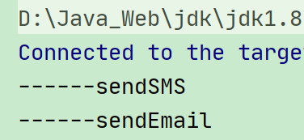

# 五、多线程锁

## 1、锁的八个问题演示


### 1.1、标准访问 先打印短信还是邮件


```java
class Phone {

    public synchronized void sendSMS() throws Exception {
        System.out.println("------sendSMS");
    }

    public synchronized void sendEmail() throws Exception {
        System.out.println("------sendEmail");
    }

    public void getHello() {
        System.out.println("------getHello");
    }
}


public class Lock_8 {

    public static void main(String[] args) throws Exception {
        Phone phone = new Phone();

        new Thread(() -> {
            try {
                phone.sendSMS();
            } catch (Exception e) {
                e.printStackTrace();
            }
        }, "AA").start();

        Thread.sleep(100);

        new Thread(() -> {
            try {
                phone.sendEmail();
            } catch (Exception e) {
                e.printStackTrace();
            }
        }, "BB").start();

    }

}
```


结论：先短信，后邮件



### 1.2、停4秒在短信方法内，先打印短信还是邮件


```java
class Phone {

    public synchronized void sendSMS() throws Exception {
        //停留4秒
        TimeUnit.SECONDS.sleep(4);
        System.out.println("------sendSMS");
    }

    public synchronized void sendEmail() throws Exception {
        System.out.println("------sendEmail");
    }

    public void getHello() {
        System.out.println("------getHello");
    }
}

public class Lock_8 {

    public static void main(String[] args) throws Exception {
        Phone phone = new Phone();

        new Thread(() -> {
            try {
                phone.sendSMS();
            } catch (Exception e) {
                e.printStackTrace();
            }
        }, "AA").start();

        Thread.sleep(100);

        new Thread(() -> {
            try {
                phone.sendEmail();
            } catch (Exception e) {
                e.printStackTrace();
            }
        }, "BB").start();

    }

}
```


结论：等4秒，先短信，后邮件


### 1.3、普通的hello方法，是先打印短信息还是hello


```java
class Phone {

    public synchronized void sendSMS() throws Exception {
        //停留4秒
        TimeUnit.SECONDS.sleep(4);
        System.out.println("------sendSMS");
    }

    public synchronized void sendEmail() throws Exception {
        System.out.println("------sendEmail");
    }

    public void getHello() {
        System.out.println("------getHello");
    }
}

public class Lock_8 {

    public static void main(String[] args) throws Exception {
        Phone phone = new Phone();

        new Thread(() -> {
            try {
                phone.sendSMS();
            } catch (Exception e) {
                e.printStackTrace();
            }
        }, "AA").start();

        Thread.sleep(100);

        new Thread(() -> {
            try {
                phone.getHello();
            } catch (Exception e) {
                e.printStackTrace();
            }
        }, "BB").start();

    }

}
```


结论：

------getHello

等4秒

------sendSMS

### 1.4、现在有两部手机，先打印短信还是邮件


```java
class Phone {

    public synchronized void sendSMS() throws Exception {
        //停留4秒
        TimeUnit.SECONDS.sleep(4);
        System.out.println("------sendSMS");
    }

    public synchronized void sendEmail() throws Exception {
        System.out.println("------sendEmail");
    }

    public void getHello() {
        System.out.println("------getHello");
    }
}


public class Lock_8 {

    public static void main(String[] args) throws Exception {
        Phone phone = new Phone();
        Phone phone2 = new Phone();
        new Thread(() -> {
            try {
                phone.sendSMS();
            } catch (Exception e) {
                e.printStackTrace();
            }
        }, "AA").start();

        Thread.sleep(100);

        new Thread(() -> {
            try {
                phone2.sendEmail();
            } catch (Exception e) {
                e.printStackTrace();
            }
        }, "BB").start();

    }

}
```


结论：

------sendEmail

等4秒

------sendSMS

### 1.5、两个静态同步方法，1部手机，先打印短信还是邮件


```java
class Phone {

    public static synchronized void sendSMS() throws Exception {
        //停留4秒
        TimeUnit.SECONDS.sleep(4);
        System.out.println("------sendSMS");
    }

    public static synchronized void sendEmail() throws Exception {
        System.out.println("------sendEmail");
    }

    public void getHello() {
        System.out.println("------getHello");
    }
}

public class Lock_8 {

    public static void main(String[] args) throws Exception {
        Phone phone = new Phone();

        new Thread(() -> {
            try {
                phone.sendSMS();
            } catch (Exception e) {
                e.printStackTrace();
            }
        }, "AA").start();

        Thread.sleep(100);

        new Thread(() -> {
            try {
                phone.sendEmail();
            } catch (Exception e) {
                e.printStackTrace();
            }
        }, "BB").start();

    }

}
```


结论：

等4秒

------sendSMS  
------sendEmail

### 1.6、两个静态同步方法，2部手机，先打印短信还是邮件


```java
class Phone {

    public static synchronized void sendSMS() throws Exception {
        //停留4秒
        TimeUnit.SECONDS.sleep(4);
        System.out.println("------sendSMS");
    }

    public static synchronized void sendEmail() throws Exception {
        System.out.println("------sendEmail");
    }

    public void getHello() {
        System.out.println("------getHello");
    }
}

public class Lock_8 {

    public static void main(String[] args) throws Exception {
        Phone phone = new Phone();
        Phone phone2 = new Phone();
        new Thread(() -> {
            try {
                phone.sendSMS();
            } catch (Exception e) {
                e.printStackTrace();
            }
        }, "AA").start();

        Thread.sleep(100);

        new Thread(() -> {
            try {
                phone2.sendEmail();
            } catch (Exception e) {
                e.printStackTrace();
            }
        }, "BB").start();

    }

}
```


结论：

等4秒

------sendSMS  
------sendEmail

### 1.7、1个静态同步方法，1个普通同步方法，1部手机，先打印短信还是邮件


```java
class Phone {

    public static synchronized void sendSMS() throws Exception {
        //停留4秒
        TimeUnit.SECONDS.sleep(4);
        System.out.println("------sendSMS");
    }

    public  synchronized void sendEmail() throws Exception {
        System.out.println("------sendEmail");
    }

    public void getHello() {
        System.out.println("------getHello");
    }
}

public class Lock_8 {

    public static void main(String[] args) throws Exception {
        Phone phone = new Phone();

        new Thread(() -> {
            try {
                phone.sendSMS();
            } catch (Exception e) {
                e.printStackTrace();
            }
        }, "AA").start();

        Thread.sleep(100);

        new Thread(() -> {
            try {
                phone.sendEmail();
            } catch (Exception e) {
                e.printStackTrace();
            }
        }, "BB").start();

    }

}
```


结论：

------sendEmail

等4秒

------sendSMS

### 1.8、1个静态同步方法，1个普通同步方法，2部手机，先打印短信还是邮件


```java
class Phone {

    public static synchronized void sendSMS() throws Exception {
        //停留4秒
        TimeUnit.SECONDS.sleep(4);
        System.out.println("------sendSMS");
    }

    public  synchronized void sendEmail() throws Exception {
        System.out.println("------sendEmail");
    }

    public void getHello() {
        System.out.println("------getHello");
    }
}

public class Lock_8 {

    public static void main(String[] args) throws Exception {
        Phone phone = new Phone();
        Phone phone2 = new Phone();
        new Thread(() -> {
            try {
                phone.sendSMS();
            } catch (Exception e) {
                e.printStackTrace();
            }
        }, "AA").start();

        Thread.sleep(100);

        new Thread(() -> {
            try {
                phone2.sendEmail();
            } catch (Exception e) {
                e.printStackTrace();
            }
        }, "BB").start();

    }

}
```


结论：

------sendEmail

等4秒

------sendSMS


### 总结


synchronized 实现同步的基础：Java 中的每一个对象都可以作为锁。**具体表现为以下3种形式。**


**<font style="color:#E8323C;">对于普通同步方法，锁是当前实例对象。</font>**


**<font style="color:#E8323C;">对于静态同步方法，锁是当前类的</font>**<font style="color:#E8323C;"> </font>**<font style="color:#E8323C;">Class</font>**<font style="color:#E8323C;"> </font>**<font style="color:#E8323C;">对象。</font>**


**<font style="color:#E8323C;">对于同步方法块，锁是</font>**<font style="color:#E8323C;"> </font>**<font style="color:#E8323C;">Synchonized</font>**<font style="color:#E8323C;"> </font>**<font style="color:#E8323C;">括号里配置的对象</font>**

**<font style="color:#E8323C;"></font>**


一个对象里面如果有多个 synchronized 方法，某一个时刻内，只要一个线程去调用其中的一个 synchronized 方法了，其它的线程都只能等待，换句话说，<font style="color:#E8323C;">某一个时刻内，只能有唯一一个线程去访问这些synchronized 方法。</font>锁的是当前对象 this，被锁定后，其它的线程都不能进入到当前对象的其它的synchronized 方法


加个普通方法后发现和同步锁无关


换成两个对象后，不是同一把锁了，情况立刻变化。


当一个线程试图访问同步代码块时，它首先必须得到锁，退出或抛出异常时必须释放锁。


也就是说如果一个实例对象的非静态同步方法获取锁后，<font style="color:#E8323C;">该实例对象的其他非静态同步方法必须等待获取锁的方法释放锁后才能获取锁，</font>


可是别的实例对象的非静态同步方法因为跟该实例对象的非静态同步方法用的是<font style="color:#E8323C;">不同的锁</font>，所以毋须等待该实例对象已获取锁的非静态同步方法释放锁就可以获取他们自己的锁。


所有的静态同步方法用的也是同一把锁——<font style="color:#E8323C;">类对象本身</font>，<font style="color:#E8323C;">这两把锁是两个不同的对象，</font>所以<font style="color:#E8323C;">静态同步方法与非静态同步方法之间是不会有竞态条件的。</font>


但是一旦一个静态同步方法获取锁后，其他的静态同步方法都必须等待该方法释放锁后才能获取锁，而不管是同一个实例对象的静态同步方法之间，还是不同的实例对象的静态同步方法之间，只要它们是同一个类的实例对象！


## 2、公平锁和非公平锁


### 2.1、非公平锁


ReentrantLock 默认非公平锁


```java
/**
 * 第一步 创建资源类，定义属性和操作方法
 */
class Ticket {
    //票数
    private int number = 30;

    //创建可重入锁
    private final ReentrantLock lock = new ReentrantLock();

    //操作方法：卖票
    public synchronized void sale() {
        //上锁
        lock.lock();

        try {
            //判断：是否有票
            if (number > 0) {
                System.out.println(Thread.currentThread().getName() + "卖出第" + (number--) + "张票，剩下：" + number);
            }
        } finally {
            //解锁
            lock.unlock();
        }
    }

}


public class SaleTicket {

    //第二步 创建多个线程，调用资源类的操作方法
    public static void main(String[] args) {
        //创建Ticket对象
        Ticket ticket = new Ticket();

        //创建三个线程
        new Thread(() -> {
            //调用卖票方法
            for (int i = 0; i < 40; i++) {
                ticket.sale();
            }
        }, "AA").start();
        
        new Thread(() -> {
            //调用卖票方法
            for (int i = 0; i < 40; i++) {
                ticket.sale();
            }
        }, "BB").start();
        
        new Thread(() -> {
            //调用卖票方法
            for (int i = 0; i < 40; i++) {
                ticket.sale();
            }
        }, "CC").start();

    }
}
```


### 2.2、公平锁


```java
/**
 * 第一步 创建资源类，定义属性和操作方法
 */
class Ticket {
    //票数
    private int number = 30;

    //创建可重入锁
    private final ReentrantLock lock = new ReentrantLock(true);

    //操作方法：卖票
    public synchronized void sale() {
        //上锁
        lock.lock();

        try {
            //判断：是否有票
            if (number > 0) {
                System.out.println(Thread.currentThread().getName() + "卖出第" + (number--) + "张票，剩下：" + number);
            }
        } finally {
            //解锁
            lock.unlock();
        }
    }

}


public class SaleTicket {

    //第二步 创建多个线程，调用资源类的操作方法
    public static void main(String[] args) {
        //创建Ticket对象
        Ticket ticket = new Ticket();

        //创建三个线程
        new Thread(() -> {
            //调用卖票方法
            for (int i = 0; i < 40; i++) {
                ticket.sale();
            }
        }, "AA").start();
        
        new Thread(() -> {
            //调用卖票方法
            for (int i = 0; i < 40; i++) {
                ticket.sale();
            }
        }, "BB").start();
        
        new Thread(() -> {
            //调用卖票方法
            for (int i = 0; i < 40; i++) {
                ticket.sale();
            }
        }, "CC").start();

    }
}
```


## 3、可重入锁


### 3.1、synchronized


#### 同步代码块


```java
//可重入锁
public class SyncLockDemo {

    public static void main(String[] args) {

        Object o = new Object();

        new Thread(() -> {
            synchronized (o) {
                System.out.println(Thread.currentThread().getName() + " 外层");

                synchronized (o) {
                    System.out.println(Thread.currentThread().getName() + " 中层");

                    synchronized (o) {
                        System.out.println(Thread.currentThread().getName() + " 内层");
                    }
                }
            }
        }, "t1").start();


    }

}
```


#### 同步方法


```java
//可重入锁
public class SyncLockDemo {

    public synchronized void add(){
        add();
    }


    public static void main(String[] args) {
        new SyncLockDemo().add();
    }

}
```


### 3.2、Lock


```java
//可重入锁
public class SyncLockDemo {

    public static void main(String[] args) {

        //Lock
        Lock lock = new ReentrantLock();
        //创建线程
        new Thread(() -> {
            try {
                //上锁
                lock.lock();
                System.out.println(Thread.currentThread().getName() + " 外层");
                try {
                    //上锁
                    lock.lock();
                    System.out.println(Thread.currentThread().getName() + " 中层");
                    try {
                        //上锁
                        lock.lock();
                        System.out.println(Thread.currentThread().getName() + " 内层");
                    } finally {
                        //释放锁
                        lock.unlock();
                    }
                } finally {
                    //释放锁
                    lock.unlock();
                }
            } finally {
                //释放锁
                lock.unlock();
            }
        }, "t1").start();

    }

}
```


## 4、死锁
### 4.1、什么是死锁


两个或者两个以上进程在执行过程中，因为争夺资源而造成一种互相等待的现象，如果没有外力干涉，他们无法再执行下去


```java
public class DeadLock {

    //创建两个对象
    static Object a = new Object();
    static Object b = new Object();

    public static void main(String[] args) {

        new Thread(() -> {
            synchronized (a) {
                System.out.println(Thread.currentThread().getName() + " 持有锁a，试图获取锁b");
                try {
                    TimeUnit.SECONDS.sleep(1);
                } catch (InterruptedException e) {
                    e.printStackTrace();
                }
                synchronized (b) {
                    System.out.println(Thread.currentThread().getName() + " 获取锁b");
                }
            }
        }, "A").start();


        new Thread(() -> {
            synchronized (b) {
                System.out.println(Thread.currentThread().getName() + " 持有锁b，试图获取锁a");
                try {
                    TimeUnit.SECONDS.sleep(1);
                } catch (InterruptedException e) {
                    e.printStackTrace();
                }
                synchronized (a) {
                    System.out.println(Thread.currentThread().getName() + " 获取锁a");
                }
            }
        }, "B").start();

    }

}
```


### 4.2、产生死锁原因


1. 系统资源不足


2. 进程运行推进顺序不合适


3. 资源分配不当


### 4.3、验证是否死锁


1. jps -l   类似Linux ps -ef


2. jstack jvm自带堆栈跟踪工具


> 更新: 2022-08-31 18:05:38  
> 原文: <https://www.yuque.com/like321/vggeaw/pvkyh1>