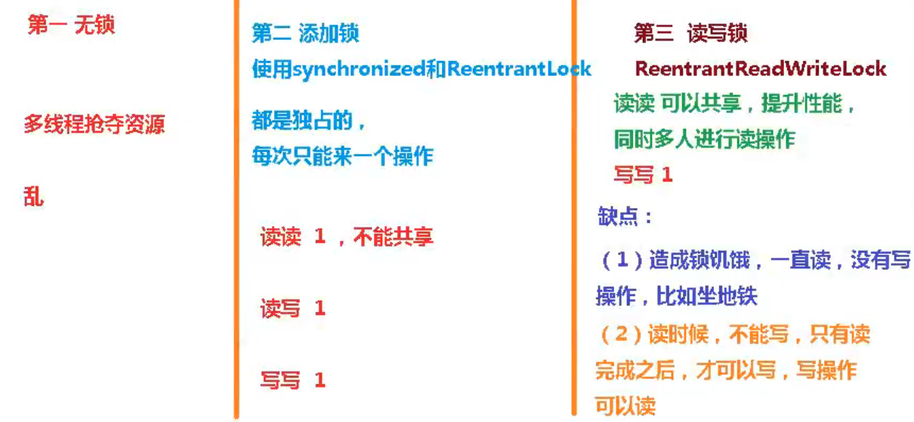
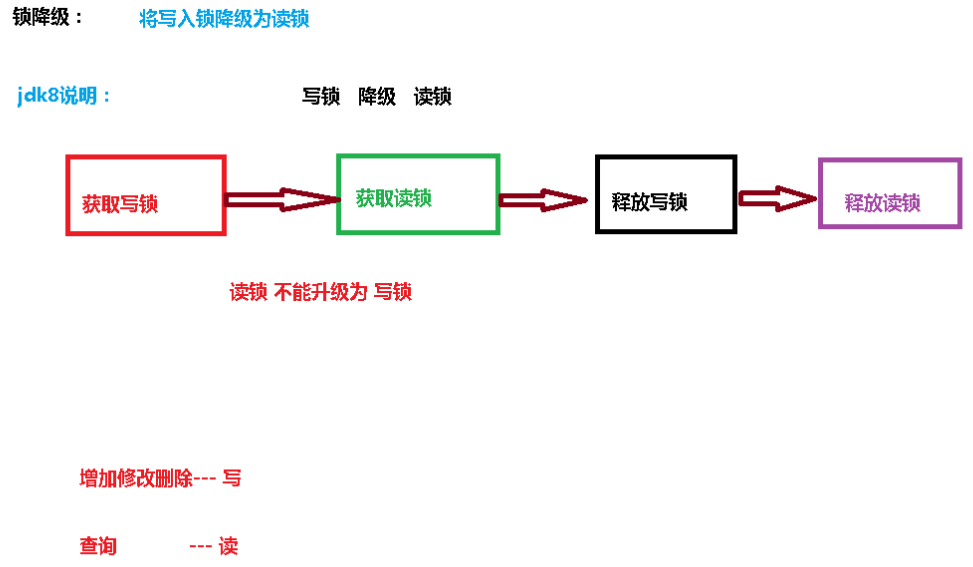
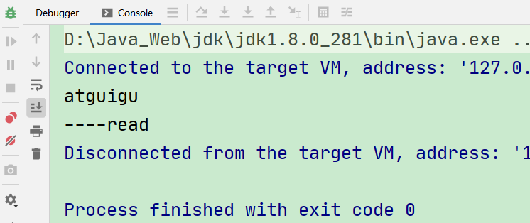
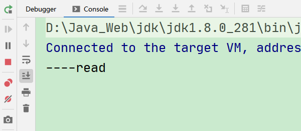

# 八、ReentrantReadWriteLock读写锁

## 1、读写锁介绍


<font style="color:rgb(51,51,51);">现实中有这样一种场景：对共享资源有读和写的操作，且写操作没有读操作那么频繁。</font>

<font style="color:rgb(51,51,51);">在没有写操作的时候，多个线程同时读一个资源没有任何问题，所以应该允许多个线程同时读取共享资源；但是如果一个线程想去写这些共享资源， 就不应该允许其他线程对该资源进行读和写的操作了。 </font>

<font style="color:rgb(51,51,51);"></font>

<font style="color:rgb(51,51,51);">针对这种场景，</font>**<font style="color:rgb(51,51,51);">JAVA 的并发包提供了读写锁ReentrantReadWriteLock， </font>**

**<font style="color:rgb(51,51,51);">它表示两个锁，一个是</font>****<font style="color:#E8323C;">读操作相关</font>****<font style="color:rgb(51,51,51);">的锁，称为</font>****<font style="color:#E8323C;">共享锁</font>****<font style="color:rgb(51,51,51);">；一个是</font>****<font style="color:#E8323C;">写相关</font>****<font style="color:rgb(51,51,51);">的锁，称为</font>****<font style="color:#E8323C;">排他锁</font>**

**<font style="color:rgb(51,51,51);"></font>**

### 线程进入读锁的前提条件：
  
• 没有其他线程的写锁  
• 没有写请求, 或者有写请求，但调用线程和持有锁的线程是同一个(可重入锁)。


### 线程进入写锁的前提条件：
  
• 没有其他线程的读锁  
• 没有其他线程的写锁


### 读写锁有以下三个重要的特性：
  
（1）<font style="color:#E8323C;">公平选择性</font>：支持非公平（默认）和公平的锁获取方式，吞吐量还是非公平优于公平。  
（2）<font style="color:#E8323C;">重进入</font>：读锁和写锁都支持线程重进入。  
（3）<font style="color:#E8323C;">锁降级</font>：遵循获取写锁、获取读锁再释放写锁的次序，写锁能够降级成为读锁。


## 2、 ReadWriteLock接口


ReadWriteLock 也是一个接口，在它里面只定义了两个方法：


一个用来获取读锁，一个用来获取写锁。也就是说将文件的读写操作分开，分成 2 个锁来分配给线程，从而使得多个线程可以同时进行读操作。


```java
public interface ReadWriteLock {
    /**
     * Returns the lock used for reading.
     *
     * @return the lock used for reading
     */
    Lock readLock();

    /**
     * Returns the lock used for writing.
     *
     * @return the lock used for writing
     */
    Lock writeLock();
}
```


### ReentrantReadWriteLock


ReentrantReadWriteLock  实现了 ReadWriteLock 接口。


ReentrantReadWriteLock 里面提供了很多丰富的方法，不过最主要的有两个方法：readLock()和 writeLock()用来获取读锁和写锁。


<font style="color:rgb(51,51,51);">同时其还实现了 Serializable 接口，表示可以进行序列化，在源代码中可以看到 ReentrantReadWriteLock 实现了自己的序列化逻辑。</font>


```java
public class ReentrantReadWriteLock implements ReadWriteLock, java.io.Serializable {
    /**
     * 读锁
     */
    private final ReentrantReadWriteLock.ReadLock readerLock;
    /**
     * 写锁
     */
    private final ReentrantReadWriteLock.WriteLock writerLock;
    /**
     * 执行所有同步机制
     */
    final Sync sync;

    /**
     * 使用默认（非公平）的排序属性创建一个新的
     * ReentrantReadWriteLock
     */
    public ReentrantReadWriteLock() {
        this(false);
    }

    /**
     * 使用给定的公平策略创建一个新的 ReentrantReadWriteLock
     */
    public ReentrantReadWriteLock(boolean fair) {
        sync = fair ? new FairSync() : new NonfairSync();
        readerLock = new ReadLock(this);
        writerLock = new WriteLock(this);
    }

    /**
     * 返回用于写入操作的锁
     */
    public ReentrantReadWriteLock.WriteLock writeLock() {
        return writerLock;
    }

    /**
     * 返回用于读取操作的锁
     */
    public ReentrantReadWriteLock.ReadLock readLock() {
        return readerLock;
    }

    abstract static class Sync extends AbstractQueuedSynchronizer {
    }

    static final class NonfairSync extends Sync {
    }

    static final class FairSync extends Sync {
    }

    public static class ReadLock implements Lock, java.io.Serializable {
    }

    public static class WriteLock implements Lock, java.io.Serializable {
    }
}
```


## 3、入门案例


假如有多个线程要同时进行读操作的话，


先看一下 synchronized 达到的效果：


```java
public class Test {

    public static void main(String[] args) {
        final Test test = new Test();

        new Thread(() -> test.get(Thread.currentThread())).start();

        new Thread(() -> test.get(Thread.currentThread())).start();

    }

    public synchronized void get(Thread thread) {
        long start = System.currentTimeMillis();
        while (System.currentTimeMillis() - start <= 1) {
            System.out.println(thread.getName() + "正在进行读操作");
        }
        System.out.println(thread.getName() + "读操作完毕");
    }
}
```


而改成用读写锁的话：


```java
public class Test {

    private ReentrantReadWriteLock rwl = new ReentrantReadWriteLock();

    public static void main(String[] args) {
        final Test test = new Test();

        new Thread(() -> test.get(Thread.currentThread())).start();

        new Thread(() -> test.get(Thread.currentThread())).start();

    }

    public void get(Thread thread) {
        rwl.readLock().lock();
        try {
            long start = System.currentTimeMillis();
            while (System.currentTimeMillis() - start <= 1) {
                System.out.println(thread.getName() + "正在进行读操作");
            }
            System.out.println(thread.getName() + "读操作完毕");
        } finally {
            rwl.readLock().unlock();
        }
    }

}
```


说明 thread1 和 thread2 在同时进行读操作。这样就大大提升了读操作的效率。


注意：


+  如果有一个线程已经占用了读锁，则此时其他线程如果要申请写锁，则申请写锁的线程会一直等待释放读锁。 


+  如果有一个线程已经占用了写锁，则此时其他线程如果申请写锁或者读锁，则申请的线程会一直等待释放写锁。 


## 4、入门案例


**<font style="color:rgb(51,51,51);">场景: 使用 ReentrantReadWriteLock 对一个 hashmap 进行读和写操作</font>**

**<font style="color:rgb(51,51,51);"></font>**

```java
//资源类
class MyCache {

    //创建map集合
    private volatile Map<String, Object> map = new HashMap<>();

    //创建读写锁对象
    private ReadWriteLock rwLock = new ReentrantReadWriteLock();

    //放数据
    public void put(String key, Object value) {
        //添加写锁
        rwLock.writeLock().lock();
        try {
            System.out.println(Thread.currentThread().getName() + " 正在写操作" + key);
            //暂停一会
            TimeUnit.MICROSECONDS.sleep((300));
            //放数据
            map.put(key, value);
            System.out.println(Thread.currentThread().getName() + " 写完了" + key);
        } catch (InterruptedException e) {
            e.printStackTrace();
        } finally {
            //释放写锁
            rwLock.writeLock().unlock();
        }
    }

    //取数据
    public Object get(String key) {
        //添加读锁
        rwLock.readLock().lock();
        Object result = null;
        try {
            System.out.println(Thread.currentThread().getName() + " 正在读取操作" + key);
            //暂停一会
            TimeUnit.MICROSECONDS.sleep((300));
            result = map.get(key);
            System.out.println(Thread.currentThread().getName() + " 取完了" + key);
        } catch (InterruptedException e) {
            e.printStackTrace();
        } finally {
            //释放读锁
            rwLock.readLock().unlock();
        }

        return result;
    }
}


public class ReadWriteLockDemo {

    public static void main(String[] args) {
        MyCache myCache = new MyCache();
        //创建线程放数据
        for (int i = 0; i <= 5; i++) {
            final int num = i;
            new Thread(() -> {
                myCache.put(num + "", num);
            }, String.valueOf(i)).start();
        }
        //创建线程取数据
        for (int i = 0; i <= 5; i++) {
            final int num = i;
            new Thread(() -> {
                myCache.get(num + "");
            }, String.valueOf(i)).start();
        }
    }

}
```


**<font style="color:rgb(51,51,51);"></font>**

## <font style="color:rgb(51,51,51);">5、读写锁的演变</font>


读写锁：一个资源可以被多个读线程访问，或者可以被一个写线程访问，但是不能同时存在读写线程，读写互斥，读读共享的




## 6、读写锁的降级





```java
    public static void main(String[] args) {
        //可重入读写锁对象
        ReentrantReadWriteLock rwLock = new ReentrantReadWriteLock();
        //读锁
        ReentrantReadWriteLock.ReadLock readLock = rwLock.readLock();
        //写锁
        ReentrantReadWriteLock.WriteLock writeLock = rwLock.writeLock();

        //锁降级
        //1 获取写锁
        writeLock.lock();
        System.out.println("atguigu");

        //2 获取读锁
        readLock.lock();
        System.out.println("----read");

        //3 释放写锁
        writeLock.unlock();

        //4 释放读锁
        readLock.unlock();
    }
```




```java
    public static void main(String[] args) {
        //可重入读写锁对象
        ReentrantReadWriteLock rwLock = new ReentrantReadWriteLock();
        //读锁
        ReentrantReadWriteLock.ReadLock readLock = rwLock.readLock();
        //写锁
        ReentrantReadWriteLock.WriteLock writeLock = rwLock.writeLock();

        //锁降级
        //2 获取读锁
        readLock.lock();
        System.out.println("----read");

        //1 获取写锁
        writeLock.lock();
        System.out.println("atguigu");

        //3 释放写锁
        writeLock.unlock();

        //4 释放读锁
        readLock.unlock();
    }
```




## 7、小结


+ <font style="color:rgb(51,51,51);">在线程持有读锁的情况下，该线程不能取得写锁（因为获取写锁的时候，如果发现当前的读锁被占用，就马上获取失败，</font><font style="color:#E8323C;">不管读锁是不是被当前线程持有</font><font style="color:rgb(51,51,51);">）。</font>

<font style="color:rgb(51,51,51);"></font>

+ <font style="color:rgb(51,51,51);">在线程持有写锁的情况下，该线程可以继续获取读锁（获取读锁时如果发现写锁被占用，只有写锁没有被当前线程占用的情况才会获取失败）。 </font>

<font style="color:rgb(51,51,51);"></font>

<font style="color:rgb(51,51,51);">原因: </font>

<font style="color:rgb(51,51,51);"></font>

<font style="color:rgb(51,51,51);">当线程获取读锁的时候，可能有其他线程同时也在持有读锁，因此不能把获取读锁的线程“升级”为写锁；</font>

<font style="color:rgb(51,51,51);"></font>

<font style="color:rgb(51,51,51);">而对于获得写锁的线程，它</font><font style="color:#E8323C;">一定独占了读写锁</font><font style="color:rgb(51,51,51);">，因此可以继续让它获取读锁，当它同时获取了写锁和读锁后，</font><font style="color:#E8323C;">还可以先释放写锁继续持有读锁，这样一个写锁就“降级”为了读锁。</font>


> 更新: 2022-08-31 23:08:41  
> 原文: <https://www.yuque.com/like321/vggeaw/gwn6ka>