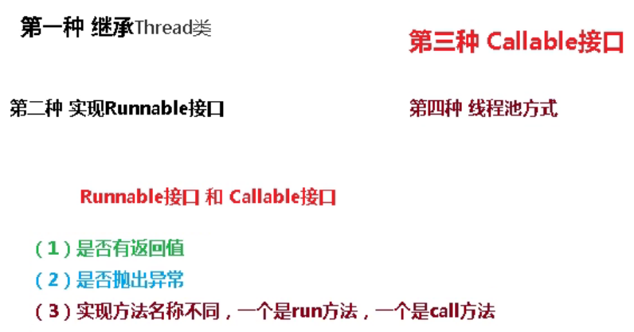
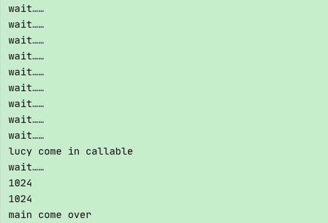

# 六、Callable接口

## 1、Callable接口


目前我们学习了有两种创建线程的方法：一种是通过创建 Thread 类，另一种是通过使用 Runnable 创建线程。


但是，<font style="color:#DF2A3F;">Runnable 缺少的一项功能是，当线程终止时（即 run（）完成时），我们无法使线程返回结果。</font>


为了支持此功能，Java 中提供了 Callable 接口。





```java
//实现Runnable接口
class MyThread1 implements Runnable {
    @Override
    public void run() {

    }
}

//实现callable接口
class MyThread2 implements Callable {
    @Override
    public Integer call() throws Exception {
        return 200;
    }
}
```


### Callable 接口的特点


+  为了实现 Runnable，需要实现不返回任何内容的 run（）方法，而对于Callable，需要实现在完成时<font style="color:#E8323C;">返回结果</font>的 call（）方法。 


+  call（）方法可以<font style="color:#E8323C;">引发异常</font>，而 run（）则不能。 


+  为实现 Callable 而必须重写 <font style="color:#DF2A3F;">call（）</font> 方法 


+  不能直接替换 runnable，因为 Thread 类的构造方法根本没有 Callable 


## 2、Future接口


当call（）方法完成时，结果必须存储在主线程已知的对象中，以便主线程可以知道该线程返回的结果。


为此，可以使用<font style="color:#DF2A3F;">Future对象</font>。


将 Future 视为保存结果的对象——它可能暂时不保存结果，但将来会保存（一旦Callable 返回）。


Future 基本上是主线程可以跟踪进度以及其他线程的结果的一种方式。


要实现此接口，必须重写 5 种方法，这里列出了重要的方法:


### cancel


```java
public boolean cancel（boolean mayInterrupt）//用于停止任务。
```


如果尚未启动，它将停止任务。如果已启动，则仅在 mayInterrupt 为 true时才会中断任务。


### get


```java
public Object get（）// 抛出 InterruptedException，ExecutionException：用于获取任务的结果。
```


如果任务完成，它将立即返回结果，否则将等待任务完成，然后返回结果。


### isDone


```java
public boolean isDone（）//如果任务完成，则返回 true，否则返回 false
```


可以看到 Callable 和 Future 做两件事—Callable 与 Runnable 类似，因为它封装了要在另一个线程上运行的任务，而 <font style="color:#E8323C;">Future 用于存储从另一个线程获得的结果</font>。


实际上，future 也可以与 Runnable 一起使用。要创建线程，需要 Runnable。<font style="color:#E8323C;">为了获得结果，需要 future。</font>


## 3、FutureTask


Java 库具有具体的 **<font style="color:#E8323C;">FutureTask </font>**类型，该类型实现**<font style="color:#E8323C;">Runnable接口</font>**和**<font style="color:#E8323C;">Future接口</font>**，并方便地将两种功能组合在一起。


可以通过为其<font style="color:#E8323C;">构造函数提供 Callable 来创建FutureTask。</font>


然后，<font style="color:#E8323C;">将 FutureTask 对象提供给 Thread 的构造函数</font>以创建Thread 对象。


因此，间接地使用 Callable 创建线程。


```java
//实现callable接口
class MyThread2 implements Callable {

    @Override
    public Integer call() throws Exception {
        return 200;
    }
}

public class CallableDemo {

    public static void main(String[] args) {
 
        //Callable接口
        Callable callable = new MyThread2();
        //FutureTask
        FutureTask<Integer> futureTask1 = new FutureTask<>(callable);

    }

}
```


### 核心原理


在主线程中需要执行比较耗时的操作时，但又不想阻塞主线程时，可以把这些作业交给 Future 对象在后台完成


+ 当主线程将来需要时，就可以通过 Future 对象获得后台作业的计算结果或者执行状态


+ 一般 <font style="color:#E8323C;">FutureTask </font>多用于耗时的计算，主线程可以在完成自己的任务后，再去获取结果。


+ 仅在计算完成时才能检索结果；如果计算尚未完成，则阻塞 get 方法


+ 一旦计算完成，就不能再重新开始或取消计算


+ get 方法而获取结果只有在计算完成时获取，否则会一直阻塞直到任务转入完成状态，然后会返回结果或者抛出异常


+ get <font style="color:#E8323C;">只计算一次，</font>因此 get 方法放到最后


## 4、使用Callable和Future创建线程


```java
public class CallableDemo {

    public static void main(String[] args) throws ExecutionException, InterruptedException {

        //lambda表达式
        FutureTask<Integer> futureTask2 = new FutureTask<>(() -> {
            System.out.println(Thread.currentThread().getName() + " come in callable");
            return 1024;
        });

        //创建一个线程
        new Thread(futureTask2, "lucy").start();


        while (!futureTask2.isDone()) {
            System.out.println("wait……");
        }

        //调用FutureTask的get方法
        System.out.println(futureTask2.get());
        System.out.println(futureTask2.get());

        System.out.println(Thread.currentThread().getName() + " come over");
    }

}
```





## 5、小结


+  在主线程中需要执行比较耗时的操作时，但又不想阻塞主线程时，可以把这些作业交给 Future 对象在后台完成, 当主线程将来需要时，就可以通过 Future对象获得后台作业的计算结果或者执行状态 


+  一般 FutureTask 多用于耗时的计算，主线程可以在完成自己的任务后，再去获取结果 


+  仅在计算完成时才能检索结果；如果计算尚未完成，则阻塞 get 方法。一旦计算完成，就不能再重新开始或取消计算。  
get 方法而获取结果只有在计算完成时获取，否则会一直阻塞直到任务转入完成状态，然后会返回结果或者抛出异常。 


+  <font style="color:#DF2A3F;">只计算一次</font> 


> 更新: 2023-01-30 15:27:07  
> 原文: <https://www.yuque.com/like321/vggeaw/nzv9xk>