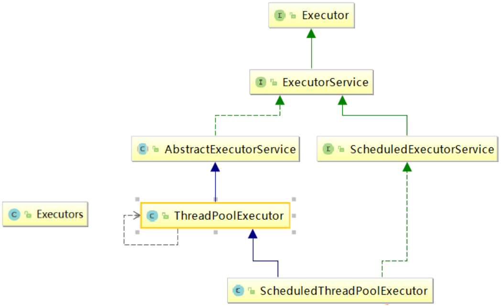

# 十、ThreadPool线程池

## 1、线程池概述


<font style="color:rgb(51,51,51);">线程池（英语：thread pool）：一种线程使用模式。</font>

<font style="color:rgb(51,51,51);">线程过多会带来调度开销，进而影响缓存局部性和整体性能。而线程池维护着多个线程，等待着监督管理者分配可并发执行的任务。这避免了在处理短时间任务时创建与销毁线程的代价。线程池不仅能够保证内核的充分利用，还能防止过分调度</font>

<font style="color:rgb(51,51,51);"></font>

<font style="color:rgb(51,51,51);">例子： </font>

<font style="color:rgb(51,51,51);">10 年前</font><font style="color:#E8323C;">单核 CPU </font><font style="color:rgb(51,51,51);">电脑，假的多线程，像马戏团小丑玩多个球，CPU 需要来回切换。 </font>

<font style="color:rgb(51,51,51);">现在是</font><font style="color:#E8323C;">多核</font><font style="color:rgb(51,51,51);">电脑，多个线程各自跑在</font><font style="color:#E8323C;">独立的 CPU </font><font style="color:rgb(51,51,51);">上，不用切换效率高。</font>

<font style="color:rgb(51,51,51);"></font>

### <font style="color:rgb(51,51,51);">线程池的优势： </font>
<font style="color:rgb(51,51,51);"></font>

<font style="color:rgb(51,51,51);">线程池做的工作主要是控制运行的线程数量，处理过程中将任务放入队列，然后在线程创建后启动这些任务，如果线程数量超过了最大数量，超出数量的线程排队等候，等其他线程执行完毕，再从队列中取出任务来执行。</font>

<font style="color:rgb(51,51,51);"></font>

### <font style="color:rgb(51,51,51);">它的主要特点为： </font>
**<font style="color:rgb(51,51,51);"></font>**

<font style="color:rgb(51,51,51);">• </font><font style="color:#E8323C;">降低资源消耗</font><font style="color:rgb(51,51,51);">: 通过重复利用已创建的线程降低线程创建和销毁造成的销耗。 </font>


<font style="color:rgb(51,51,51);">• </font><font style="color:#E8323C;">提高响应速度</font><font style="color:rgb(51,51,51);">: 当任务到达时，任务可以不需要等待线程创建就能立即执行。 </font>

<font style="color:rgb(51,51,51);"></font>

<font style="color:rgb(51,51,51);">• </font><font style="color:#E8323C;">提高线程的可管理性:</font><font style="color:rgb(51,51,51);"> 线程是稀缺资源，如果无限制的创建，不仅会销耗系统资源，还会降低系统的稳定性，使用线程池可以进行统一的分配，调优和监控。</font>

<font style="color:rgb(51,51,51);"></font>

## <font style="color:rgb(51,51,51);">2、线程池架构</font>


**<font style="color:rgb(0,0,0);">Java </font>****<font style="color:rgb(0,0,0);">中的线程池是通过 </font>****<font style="color:rgb(0,0,0);">Executor </font>****<font style="color:rgb(0,0,0);">框架实现的，该框架中用到了 </font>****<font style="color:rgb(0,0,0);">Executor</font>****<font style="color:rgb(0,0,0);">，</font>****<font style="color:rgb(0,0,0);">Executors</font>****<font style="color:rgb(0,0,0);">， </font>**

**<font style="color:rgb(0,0,0);">ExecutorService，ThreadPoolExecutor 这几个类</font>**

**<font style="color:rgb(0,0,0);"></font>**




## <font style="color:rgb(77, 77, 77);">线程池的状态</font>


1. <font style="color:#E8323C;">RUNNING</font>：<font style="color:#E8323C;">运行状态</font>，线程池创建好之后就会进入此状态，如果不手动调用关闭方法，那么线程池在整个程序运行期间都是此状态。


2. <font style="color:#E8323C;">SHUTDOWN</font>：<font style="color:#E8323C;">关闭状态</font>，不再接受新任务提交，但是会将已保存在任务队列中的任务处理完。


3. <font style="color:#E8323C;">STOP</font>：<font style="color:#E8323C;">停止状态</font>，不再接受新任务提交，并且会<font style="color:#E8323C;">中断当前正在执行的任务</font>、放弃任务队列中已有的任务。


4. <font style="color:#E8323C;">TIDYING</font>：<font style="color:#E8323C;">整理状态</font>，所有的任务都执行完毕后（也包括任务队列中的任务执行完），当前线程池中的活动线程数降为 0 时的状态。到此状态之后，会调用线程池的 terminated() 方法。


5. <font style="color:#E8323C;">TERMINATED</font>：<font style="color:#E8323C;">销毁状态</font>，当执行完线程池的 terminated() 方法之后就会变为此状态。

 

<font style="color:rgb(77, 77, 77);">这 5 种状态可以在 ThreadPoolExecutor 源码中找到，如下图所示：</font>


<font style="color:rgb(77, 77, 77);"></font>

### <font style="color:rgb(79, 79, 79);">线程池状态转移</font>


线程池的状态转移有两条路径：


1. 当调用 shutdown() 方法时，线程池的状态会从 <font style="color:#E8323C;">RUNNING 运行</font> 到 <font style="color:#E8323C;">SHUTDOWN 关闭</font>，再到 <font style="color:#E8323C;">TIDYING 整理</font>，最后到 <font style="color:#E8323C;">TERMINATED 销毁</font>状态。


2. 当调用 shutdownNow() 方法时，线程池的状态会从 <font style="color:#E8323C;">RUNNING 运行</font> 到 <font style="color:#E8323C;">STOP 停止</font>，再到 <font style="color:#E8323C;">TIDYING</font> <font style="color:#E8323C;">整理</font>，最后到<font style="color:#E8323C;"> TERMINATED 销毁</font>状态。


线程状态转换的流程如下图所示：


### <font style="color:rgb(79, 79, 79);">terminated方法</font>
<font style="color:rgb(77, 77, 77);">线程池中的 terminated() 方法，也就是线程池从 </font><font style="color:#E8323C;">TIDYING 整理</font><font style="color:rgb(77, 77, 77);"> 转换到 </font><font style="color:#E8323C;">TERMINATED 销毁</font> <font style="color:rgb(77, 77, 77);">状态时调用的方法，默认是空的，它的源码如下</font>


<font style="color:rgb(77, 77, 77);">我们可以在创建线程池的时候重写 terminated() 方法，具体实现代码如下：</font>

```java
import java.util.concurrent.LinkedBlockingQueue;
import java.util.concurrent.ThreadPoolExecutor;
import java.util.concurrent.TimeUnit;
 
public class ThreadPoolStateTransition {
    public static void main(String[] args) throws InterruptedException {
        // 创建线程池
        ThreadPoolExecutor threadPool = new ThreadPoolExecutor(10, 10, 0L,
                TimeUnit.SECONDS, new LinkedBlockingQueue<>(100)) {
            @Override
            protected void terminated() {
                super.terminated();
                System.out.println("执行 terminated() 方法");
            }
        };
        // 关闭线程池
        threadPool.shutdown();
        // 等待线程池执行完再退出
        while (!threadPool.awaitTermination(1, TimeUnit.SECONDS)) {
            System.out.println("线程池正在运行中");
        }
    }
}
```

### 总结


线程池的状态总共有 5 种：RUNNING：运行状态、SHUTDOWN：关闭状态、STOP：停止状态、TIDYING：整理状态和 TERMINATED：销毁状态。


默认情况下，如果不调用关闭方法，线程池会一直处于<font style="color:#E8323C;"> RUNNING 状态，</font>


而线程池状态的转移有两个路径：


当调用 shutdown() 方法时，线程池的状态会从 RUNNING 到 SHUTDOWN，再到 TIDYING，最后到 TERMINATED 销毁状态；


当调用 shutdownNow() 方法时，线程池的状态会从 RUNNING 到 STOP，再到 TIDYING，最后到 TERMINATED 销毁状态。


## 3、线程池参数说明
### 常用参数


<font style="color:rgb(51,51,51);">• corePoolSize 线程池的</font><font style="color:#E8323C;">核心线程数 </font>

<font style="color:rgb(51,51,51);"></font>

<font style="color:rgb(51,51,51);">• maximumPoolSize 能容纳的</font><font style="color:#E8323C;">最大线程数 </font>

<font style="color:rgb(51,51,51);"></font>

<font style="color:rgb(51,51,51);">• keepAliveTime 空闲线程</font><font style="color:#E8323C;">存活时间 </font>

<font style="color:rgb(51,51,51);"></font>

<font style="color:rgb(51,51,51);">• unit </font><font style="color:#E8323C;">存活的时间单位 </font>

<font style="color:#E8323C;"></font>

<font style="color:rgb(51,51,51);">• workQueue 存放提交但未执行任务的</font><font style="color:#E8323C;">队列 </font>

<font style="color:rgb(51,51,51);"></font>

<font style="color:rgb(51,51,51);">• threadFactory 创建</font><font style="color:#E8323C;">线程的工厂类 </font>

<font style="color:rgb(51,51,51);"></font>

<font style="color:rgb(51,51,51);">• handler 等待队列满后的</font><font style="color:#E8323C;">拒绝策略</font>

<font style="color:rgb(51,51,51);"></font>

<font style="color:rgb(51,51,51);">线程池中，有三个重要的参数，决定影响了拒绝策略：</font>

<font style="color:#E8323C;">corePoolSize </font><font style="color:rgb(51,51,51);">- 核心线程数，也即</font><font style="color:#E8323C;">最小的线程数。</font>

<font style="color:#E8323C;">workQueue </font><font style="color:rgb(51,51,51);">- </font><font style="color:#E8323C;">阻塞队列</font><font style="color:rgb(51,51,51);"> 。 </font>

<font style="color:#E8323C;">maximumPoolSize </font><font style="color:rgb(51,51,51);">- </font><font style="color:#E8323C;">最大线程数 </font>

<font style="color:rgb(51,51,51);"></font>

<font style="color:rgb(51,51,51);">当提交任务数大于 corePoolSize 的时候，会优先将任务放到 workQueue 阻塞队列中。当阻塞队列饱和后，会扩充线程池中线程数，直到达到maximumPoolSize 最大线程数配置。此时，再多余的任务，则会触发线程池的拒绝策略了。</font>

<font style="color:rgb(51,51,51);"> </font>

<font style="color:rgb(51,51,51);">总结起来，也就是一句话，</font>**<font style="color:rgb(51,51,51);">当提交的任务数大于（workQueue.size() + maximumPoolSize ），就会触发线程池的拒绝策略</font>**<font style="color:rgb(51,51,51);">。 </font>

<font style="color:rgb(51,51,51);"></font>

### **<font style="color:rgb(51,51,51);">拒绝策略</font>**


**<font style="color:rgb(51,51,51);">CallerRunsPolicy</font>**<font style="color:rgb(51,51,51);">: 当触发拒绝策略，只要线程池没有关闭的话，则使用调用线程直接运行任务。一般并发比较小，性能要求不高，不允许失败。但是，由于</font><font style="color:#E8323C;">调用者自己运行任务</font><font style="color:rgb(51,51,51);">，如果任务提交速度过快，可能导致程序阻塞，性能效率上必然的损失较大 </font>

<font style="color:rgb(51,51,51);"></font>

**<font style="color:rgb(51,51,51);">AbortPolicy</font>**<font style="color:rgb(51,51,51);">: </font><font style="color:#E8323C;">丢弃任务</font><font style="color:rgb(51,51,51);">，并抛出拒绝执行 RejectedExecutionException </font><font style="color:#E8323C;">异常</font><font style="color:rgb(51,51,51);">信息。线程池</font><font style="color:#E8323C;">默认</font><font style="color:rgb(51,51,51);">的拒绝策略。必须处理好抛出的异常，否则会打断当前的执行流程，影响后续的任务执行。 </font>

<font style="color:rgb(51,51,51);"></font>

**<font style="color:rgb(51,51,51);">DiscardPolicy</font>**<font style="color:rgb(51,51,51);">:</font><font style="color:#E8323C;"> 直接丢弃，</font><font style="color:rgb(51,51,51);">其他啥都没有 </font>

<font style="color:rgb(51,51,51);"></font>

**<font style="color:rgb(51,51,51);">DiscardOldestPolicy</font>**<font style="color:rgb(51,51,51);">: 当触发拒绝策略，只要线程池没有关闭的话，</font><font style="color:#E8323C;">丢弃</font><font style="color:rgb(51,51,51);">阻塞队列 workQueue 中</font><font style="color:#E8323C;">最老的</font><font style="color:rgb(51,51,51);">一个任务，并将新任务加入</font>

<font style="color:rgb(51,51,51);"></font>

## 4、线程池的种类与创建


### <font style="color:rgb(51,51,51);">newCachedThreadPool</font>


<font style="color:rgb(51,51,51);">作用：</font>

<font style="color:rgb(51,51,51);"></font>

<font style="color:rgb(51,51,51);">创建一个可缓存线程池，如果线程池长度超过处理需要，可灵活回收空闲线程，若无可回收，则新建线程. </font>

<font style="color:rgb(51,51,51);"></font>

<font style="color:rgb(51,51,51);">特点: </font>

<font style="color:rgb(51,51,51);"></font>

<font style="color:rgb(51,51,51);">• 线程池中</font><font style="color:#E8323C;">最大数量没有固定，可达到最大值</font><font style="color:rgb(51,51,51);">（Interger. MAX_VALUE） </font>

<font style="color:rgb(51,51,51);">• </font><font style="color:rgb(51,51,51);">线程池中的线程可进行缓存重复利用和回收（回收默认时间为 1 分钟） </font>

<font style="color:rgb(51,51,51);">• 当线程池中，没有可用线程，会重新创建一个线程</font>


<font style="color:rgb(51,51,51);">创建方式：</font>

```java
/**
 * 可缓存线程池
 *
 * @return
 */
public static ExecutorService newCachedThreadPool() {
    /**
     * corePoolSize 线程池的核心线程数
     * maximumPoolSize 能容纳的最大线程数
     * keepAliveTime 空闲线程存活时间
     * unit 存活的时间单位
     * workQueue 存放提交但未执行任务的队列
     * threadFactory 创建线程的工厂类:可以省略
     * handler 等待队列满后的拒绝策略:可以省略
     */
    return new ThreadPoolExecutor(0,
            Integer.MAX_VALUE,
            60L,
            TimeUnit.SECONDS,
            new SynchronousQueue<>(),
            Executors.defaultThreadFactory(),
            new ThreadPoolExecutor.AbortPolicy());
}
```


<font style="color:rgb(51,51,51);">场景: </font>

<font style="color:rgb(51,51,51);"></font>

<font style="color:rgb(51,51,51);">适用于创建一个可无限扩大的线程池，服务器负载压力较轻，执行时间较短，任务多的场景 </font>

<font style="color:rgb(51,51,51);"></font>

<font style="color:#000000;">线程池根据需求创建线程，可扩容：</font>Executors.newCachedThreadPool()


```java
//一池可扩容线程
ExecutorService threadPool3 = Executors.newCachedThreadPool();
try {
    for (int i = 0; i < 10; i++) {
        threadPool3.execute(()->{
            System.out.println(Thread.currentThread().getName()+" 办理业务");
        });
    }
} finally {
    threadPool3.shutdown();
}
```


### **<font style="color:rgb(51,51,51);">newFixedThreadPool</font>**


<font style="color:rgb(51,51,51);">作用：</font>

<font style="color:rgb(51,51,51);"></font>

<font style="color:rgb(51,51,51);">创建一个可重用</font><font style="color:#E8323C;">固定线程数</font><font style="color:rgb(51,51,51);">的线程池，以共享的无界队列方式来运行这些线程。</font>

<font style="color:rgb(51,51,51);">在任意点，在大多数线程会处于处理任务的活动状态。如果在所有线程处于活动状态时提交附加任务，则在有可用线程之前，附加任务将在队列中等待。如果在关闭前的执行期间由于失败而导致任何线程终止，那么一个新线程将代替它执行后续的任务（如果需要）。在某个线程被显式地关闭之前，池中的线程将一直存在。</font>

<font style="color:rgb(51,51,51);"></font>

<font style="color:rgb(51,51,51);">特征： </font>

**<font style="color:rgb(51,51,51);"></font>**

<font style="color:rgb(51,51,51);">• </font><font style="color:rgb(51,51,51);">线程池中的线程处于一定的量，可以很好的控制线程的并发量 </font>

<font style="color:rgb(51,51,51);">• </font><font style="color:rgb(51,51,51);">线程可以重复被使用，在显示关闭之前，都将一直存在 </font>

<font style="color:rgb(51,51,51);">• </font><font style="color:rgb(51,51,51);">超出一定量的线程被提交时候需在队列中等待 </font>

<font style="color:rgb(51,51,51);"></font>

<font style="color:rgb(51,51,51);">创建方式：</font>

```java
/**
 * 固定长度线程池
 *
 * @return
 */
public static ExecutorService newFixedThreadPool() {
    /**
     * corePoolSize 线程池的核心线程数
     * maximumPoolSize 能容纳的最大线程数
     * keepAliveTime 空闲线程存活时间
     * unit 存活的时间单位
     * workQueue 存放提交但未执行任务的队列
     * threadFactory 创建线程的工厂类:可以省略
     * handler 等待队列满后的拒绝策略:可以省略
     */
    return new ThreadPoolExecutor(10,
            10,
            0L,
            TimeUnit.SECONDS,
            new LinkedBlockingQueue<>(),
            Executors.defaultThreadFactory(),
            new ThreadPoolExecutor.AbortPolicy());
}
```

<font style="color:rgb(51,51,51);">场景: </font>

<font style="color:rgb(51,51,51);"></font>

<font style="color:rgb(51,51,51);">适用于可以预测线程数量的业务中，或者服务器负载较重，对线程数有严格限制的场景</font>

<font style="color:rgb(51,51,51);"></font>

<font style="color:#000000;">一池n线程：</font>Executors.newFixedThreadPool(int)


```java
//一池五线程
ExecutorService threadPool1 = Executors.newFixedThreadPool(5);

try {
    //10个顾客请求
    for (int i = 0; i < 10; i++) {
        //执行
        threadPool1.execute(()->{
            System.out.println(Thread.currentThread().getName()+" 办理业务");
        });
    }
} finally {
    threadPool1.shutdown();
}
```


###  **<font style="color:rgb(51,51,51);">newSingleThreadExecutor</font>**


**<font style="color:rgb(51,51,51);">作用</font>**<font style="color:rgb(51,51,51);">：</font>

<font style="color:rgb(51,51,51);">创建一个使用</font><font style="color:#E8323C;">单个 worker 线程的 Executor</font><font style="color:rgb(51,51,51);">，以无界队列方式来运行该线程。（注意，如果因为在关闭前的执行期间出现失败而终止了此单个线程，那么如果需要，一个新线程将代替它执行后续的任务）。</font>

<font style="color:rgb(51,51,51);">可保证顺序地执行各个任务，并且在任意给定的时间不会有多个线程是活动的。与其他等效的newFixedThreadPool 不同，可保证无需重新配置此方法所返回的执行程序即可使用其他的线程。 </font>

<font style="color:rgb(51,51,51);"></font>

**<font style="color:rgb(51,51,51);">特征： </font>**<font style="color:rgb(51,51,51);">线程池中最多执行 1 个线程，之后提交的线程活动将会排在队列中以此执行 </font>

<font style="color:rgb(51,51,51);"></font>

**<font style="color:rgb(51,51,51);">创建方式：</font>**

```java
/**
 * 单一线程池
 *
 * @return
 */
public static ExecutorService newSingleThreadExecutor() {
    /**
     * corePoolSize 线程池的核心线程数
     * maximumPoolSize 能容纳的最大线程数
     * keepAliveTime 空闲线程存活时间
     * unit 存活的时间单位
     * workQueue 存放提交但未执行任务的队列
     * threadFactory 创建线程的工厂类:可以省略
     * handler 等待队列满后的拒绝策略:可以省略
     */
    return new ThreadPoolExecutor(1,
            1,
            0L,
            TimeUnit.SECONDS,
            new LinkedBlockingQueue<>(),
            Executors.defaultThreadFactory(),
            new ThreadPoolExecutor.AbortPolicy());
}
```

**<font style="color:rgb(51,51,51);">场景: </font>**<font style="color:rgb(51,51,51);">适用于需要保证顺序执行各个任务，并且在任意时间点，不会同时有多个线程的场景</font>

**<font style="color:rgb(51,51,51);"></font>**

<font style="color:#000000;">一个任务一个任务执行，一池一线程：</font>Executors.newSingleThreadExecutor()

```java
//一池一线程
ExecutorService threadPool2  = Executors.newSingleThreadExecutor();

try {
    for (int i = 0; i < 10; i++) {
        threadPool2.execute(()->{
            System.out.println(Thread.currentThread().getName()+" 办理业务");
        });
    }
} finally {
    threadPool2.shutdown();
}
```


### <font style="color:rgb(51,51,51);">newScheduleThreadPool(了解) </font>


**<font style="color:rgb(51,51,51);">作用: </font>**<font style="color:rgb(51,51,51);">线程池支持</font><font style="color:#E8323C;">定时以及周期性执行任务</font><font style="color:rgb(51,51,51);">，创建一个 corePoolSize 为传入参数，</font><font style="color:#E8323C;">最大线程数为</font><font style="color:#E8323C;">Integer.MAX_VALUE</font><font style="color:rgb(51,51,51);">的线程池</font>

<font style="color:rgb(51,51,51);"></font>

**<font style="color:rgb(51,51,51);">特征: </font>**

+ <font style="color:rgb(51,51,51);">线程池中具有指定数量的线程，即便是空线程也将保留</font>
+ <font style="color:rgb(51,51,51);">可定时或者延迟执行线程活动 </font>


**<font style="color:rgb(51,51,51);">创建方式:</font>**

```java
public static ScheduledExecutorService newScheduledThreadPool(
        int corePoolSize, ThreadFactory threadFactory) {
    return new ScheduledThreadPoolExecutor(corePoolSize, threadFactory);
}
```

**<font style="color:rgb(51,51,51);">场景: </font>**<font style="color:rgb(51,51,51);">适用于需要多个后台线程执行周期任务的场景</font>


### **<font style="color:rgb(51,51,51);"> newWorkStealingPool</font>**


<font style="color:rgb(51,51,51);">jdk1.8 提供的线程池，底层使用的是 </font><font style="color:#E8323C;">ForkJoinPool </font><font style="color:rgb(51,51,51);">实现，创建一个拥有多个任务队列的线程池，可以减少连接数，创建当前可用 cpu 核数的线程来并行执行任务 </font>

<font style="color:rgb(51,51,51);"></font>

**<font style="color:rgb(51,51,51);">创建方式:</font>**

```java
public static ExecutorService newWorkStealingPool(int parallelism) {
    /**
     * parallelism：并行级别，通常默认为 JVM 可用的处理器个数
     * factory：用于创建 ForkJoinPool 中使用的线程。
     * handler：用于处理工作线程未处理的异常，默认为 null
     * asyncMode：用于控制 WorkQueue 的工作模式:队列---反队列
     */
    return new ForkJoinPool
        (parallelism,
         ForkJoinPool.defaultForkJoinWorkerThreadFactory, 
         null,
         true);
}
```

**<font style="color:rgb(51,51,51);">场景: </font>**<font style="color:rgb(51,51,51);">适用于大耗时，可并行执行的场景 </font>


## 5、线程池工作流程


1. 在创建了线程池后，线程池中的线程数为零


2. 当调用 execute()方法添加一个请求任务时，线程池会做出如下判断： 
+ 2.1 如果正在运行的线程数量小于 corePoolSize，那么<font style="color:#E8323C;">马上创建线程运行</font>这个任务；
+ 2.2 如果正在运行的线程数量大于或等于 corePoolSize，那么将这个任务<font style="color:#E8323C;">放入阻塞队列</font>； 
+ 2.3 如果这个时候队列满了且正在运行的线程数量还<font style="color:#E8323C;">小于maximumPoolSize</font>，那么还是要<font style="color:#E8323C;">创建非核心线程</font>立刻运行这个任务； 
+ 2.4 如果队列满了且正在运行的线程数量大于或等于 maximumPoolSize，那么线程池会启动饱和<font style="color:#E8323C;">拒绝策略</font>来执行。


3. 当一个线程完成任务时，它会从队列中取下一个任务来执行


4. 当一个线程<font style="color:#E8323C;">无事可做超过一定的时间</font>（keepAliveTime）时，线程会判断：
+ 4.1 如果当前运行的线程数<font style="color:#E8323C;">大于 corePoolSize</font>，那么这个线程就被停掉。
+ 4.2 所以线程池的所有任务完成后，它最终会<font style="color:#E8323C;">收缩到 corePoolSize 的大小。</font>


## 6、自定义线程池


<font style="color:rgb(51,51,51);">项目中创建多线程时，使用常见的三种线程池创建方式，单一、可变、定长都有一定问题，</font>

<font style="color:rgb(51,51,51);">原因是 FixedThreadPool 和 SingleThreadExecutor 底层都是用LinkedBlockingQueue 实现的</font><font style="color:#E8323C;">，这个队列最大长度为 Integer.MAX_VALUE</font><font style="color:rgb(51,51,51);">，容易导致 OOM。</font>

<font style="color:rgb(51,51,51);"></font>

<font style="color:rgb(51,51,51);">所以实际生产一般自己通过 ThreadPoolExecutor 的 7 个参数，自定义线程池</font>

```java
public static void main(String[] args) {
    ThreadPoolExecutor threadPool = new ThreadPoolExecutor(
            2,
            5,
            2L,
            TimeUnit.SECONDS,
            new ArrayBlockingQueue<>(3),
            Executors.defaultThreadFactory(),
            new ThreadPoolExecutor.CallerRunsPolicy()
    );

    try {
        for (int i = 0; i < 10; i++) {
            threadPool.execute(() -> {
                System.out.println(Thread.currentThread().getName() + " 办理业务");
            });
        }
    } finally {
        threadPool.shutdown();
    }

}
```

说明：Executors返回的线程池对象的弊端如下:


+ FixedThreadPool 和 SingleThreadPool:
    - 允许的**<font style="color:#DF2A3F;">请求</font>****<font style="color:#E8323C;">队列长度</font>**<font style="color:#E8323C;">为Integer.MAX_VALUE，可能会堆积大量的请求，</font>从而导致OOM。


+ CachedThreadPool 和ScheduledThreadPool:
    - 允许的**<font style="color:#E8323C;">创建线程数量</font>**<font style="color:#E8323C;">为Integer.MAX_VALUE，可能会创建大量的线程，</font>从而导致OOM。


> 更新: 2023-01-30 15:59:02  
> 原文: <https://www.yuque.com/like321/vggeaw/lgqlun>