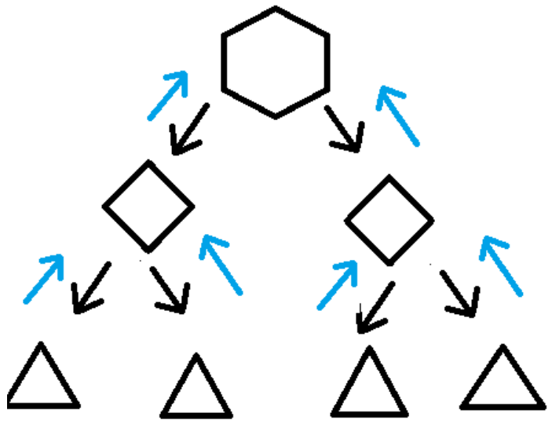
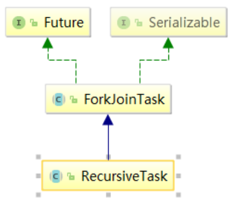
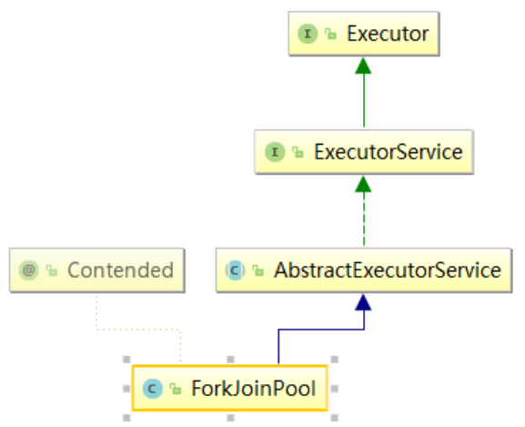

# 十一、Fork和Join分支合并框架

## **<font style="color:rgb(51,51,51);">1、Fork/Join 框架简介</font>**


<font style="color:rgb(51,51,51);">Fork/Join 它可以将一个大的任务拆分成多个子任务进行并行处理，最后将子任务结果合并成最后的计算结果，并进行输出。</font>

<font style="color:rgb(51,51,51);"></font>

### <font style="color:rgb(51,51,51);">完成两件事情：</font>
<font style="color:rgb(0,0,0);"></font>

<font style="color:rgb(0,0,0);">Fork：把一个复杂任务进行分拆，大事化小 </font>

<font style="color:rgb(0,0,0);"></font>

<font style="color:rgb(0,0,0);">Join：把分拆任务的结果进行合并</font>



<font style="color:rgb(51,51,51);">1. </font>**<font style="color:rgb(51,51,51);">任务分割</font>**<font style="color:rgb(51,51,51);">：首先 Fork/Join 框架需要把大的任务分割成足够小的子任务，如果子任务比较大的话还要对子任务进行继续分割 </font>

<font style="color:rgb(51,51,51);"></font>

<font style="color:rgb(51,51,51);">2. </font>**<font style="color:rgb(51,51,51);">执行任务并合并结果</font>**<font style="color:rgb(51,51,51);">：分割的子任务分别</font><font style="color:#E8323C;">放到双端队列</font><font style="color:rgb(51,51,51);">里，然后几个启动线程分别从双端队列里获取任务执行。</font>

<font style="color:rgb(51,51,51);">子任务执行完的结果都放在</font><font style="color:#E8323C;">另外一个队列</font><font style="color:rgb(51,51,51);">里，启动一个线程从队列里取数据，然后</font><font style="color:#E8323C;">合并这些数据。 </font>

<font style="color:rgb(51,51,51);"></font>

<font style="color:rgb(51,51,51);"></font>

<font style="color:rgb(51,51,51);">在 Java 的 Fork/Join 框架中，使用两个类完成上述操作</font>

<font style="color:rgb(51,51,51);"></font>

+ **<font style="color:#E8323C;">ForkJoinTask</font>**<font style="color:rgb(51,51,51);">：我们要使用 Fork/Join 框架，首先需要创建一个 ForkJoin 任务。 </font>

<font style="color:rgb(51,51,51);">该类提供了在任务中执行 fork 和 join 的机制。通常情况下我们不需要直接集成ForkJoinTask 类，只需要继承它的子类，Fork/Join 框架提供了两个子类： </font>

    - **<font style="color:#E8323C;">RecursiveAction</font>**<font style="color:rgb(51,51,51);">：用于没有返回结果的任务 </font>
    - **<font style="color:#E8323C;">RecursiveTask</font>**<font style="color:rgb(51,51,51);">：用于有返回结果的任务 </font>

<font style="color:rgb(51,51,51);"></font>

+ **<font style="color:#E8323C;">ForkJoinPool</font>**<font style="color:rgb(51,51,51);">：ForkJoinTask 需要通过 ForkJoinPool 来执行 </font>

<font style="color:rgb(51,51,51);"></font>

<font style="color:rgb(51,51,51);"></font>

### <font style="color:rgb(51,51,51);">RecursiveTask（递归任务）：</font>
<font style="color:rgb(51,51,51);"></font>

<font style="color:rgb(51,51,51);">继承后可以实现</font><font style="color:#E8323C;">递归调用</font><font style="color:rgb(51,51,51);">的任务</font>



### <font style="color:rgb(51,51,51);">分支合并池：</font>
<font style="color:rgb(51,51,51);"></font>

<font style="color:rgb(51,51,51);">类比线程池</font>



## <font style="color:rgb(51,51,51);">2、Fork方法</font>


**<font style="color:rgb(51,51,51);">Fork 方法的实现原理： </font>**<font style="color:rgb(51,51,51);">当我们调用 ForkJoinTask 的 fork 方法时，程序会把任务放在 ForkJoinWorkerThread 的 pushTask 的 </font>**<font style="color:#E8323C;">workQueue </font>**<font style="color:rgb(51,51,51);">中，异步地执行这个任务，然后立即返回结果</font>

```java
public final ForkJoinTask<V> fork() {
    Thread t;
    if ((t = Thread.currentThread()) instanceof ForkJoinWorkerThread)
        ((ForkJoinWorkerThread) t).workQueue.push(this);
    else
        ForkJoinPool.common.externalPush(this);
    return this;
}
```

<font style="color:rgb(51,51,51);">pushTask 方法把当前任务存放在 ForkJoinTask 数组队列里。然后再调用ForkJoinPool 的 signalWork()方法唤醒或创建一个工作线程来执行任务。</font>

```java
final void push(ForkJoinTask<?> task) {
    ForkJoinTask<?>[] a;
    ForkJoinPool p;
    int b = base, s = top, n;
    if ((a = array) != null) { // ignore if queue removed
        int m = a.length - 1; // fenced write for task visibility
        U.putOrderedObject(a, ((m & s) << ASHIFT) + ABASE, task);
        U.putOrderedInt(this, QTOP, s + 1);
        if ((n = s - b) <= 1) {
            if ((p = pool) != null) p.signalWork(p.workQueues, this);//执行
        } else if (n >= m)
            growArray();
    }
}
```

## 3、Join方法


<font style="color:rgb(51,51,51);">Join 方法的主要作用是</font><font style="color:#E8323C;">阻塞当前线程并等待获取结果。</font>

<font style="color:rgb(51,51,51);"></font>

<font style="color:rgb(51,51,51);">让我们一起看看ForkJoinTask 的 join 方法的实现，代码如下：</font>

```java
public final V join() {
    int s;
    if ((s = doJoin() & DONE_MASK) != NORMAL)
        reportException(s);
    return getRawResult();
}
```

<font style="color:rgb(51,51,51);">它首先调用 doJoin 方法，通过 doJoin()方法得到当前任务的状态来判断返回什么结果，任务状态有 4 种：</font>

**<font style="color:rgb(51,51,51);"></font>**

**<font style="color:rgb(51,51,51);">已完成（NORMAL）、被取消（CANCELLED）、信号（SIGNAL）、出现异常（EXCEPTIONAL）</font>**

**<font style="color:rgb(51,51,51);"></font>**

<font style="color:rgb(51,51,51);">• 如果任务状态是已完成，则直接返回任务结果。 </font>

<font style="color:rgb(51,51,51);">• 如果任务状态是被取消，则直接抛出 CancellationException </font>

<font style="color:rgb(51,51,51);">• 如果任务状态是抛出异常，则直接抛出对应的异常</font>

<font style="color:rgb(51,51,51);"></font>

<font style="color:rgb(51,51,51);">让我们分析一下 doJoin 方法的实现</font>

```java
private int doJoin() {
    int s;
    Thread t;
    ForkJoinWorkerThread wt;
    ForkJoinPool.WorkQueue w;
    return (s = status) < 0 ? s :
            ((t = Thread.currentThread()) instanceof ForkJoinWorkerThread) ? (w = (wt = (ForkJoinWorkerThread) t).workQueue).
                    tryUnpush(this) && (s = doExec()) < 0 ? s :
                    wt.pool.awaitJoin(w, this, 0L) :
                    externalAwaitDone();
}

final int doExec() {
    int s;
    boolean completed;
    if ((s = status) >= 0) {
        try {
            completed = exec();
        } catch (Throwable rex) {
            return setExceptionalCompletion(rex);
        }
        if (completed) s = setCompletion(NORMAL);
    }
    return s;
}
```

### 在 doJoin()方法流程如下:


1. 首先通过查看任务的状态，看任务是否已经执行完成，如果执行完成，则直接返回任务状态；


2. 如果没有执行完，则从任务数组里取出任务并执行。


3. 如果任务顺利执行完成，则设置任务状态为 NORMAL，如果出现异常，则记录异常，并将任务状态设置为 EXCEPTIONAL。


## 4、**<font style="color:rgb(51,51,51);">Fork/Join 框架的异常处理</font>**


<font style="color:rgb(51,51,51);">ForkJoinTask 在执行的时候可能会抛出异常，但是我们没办法在主线程里直接捕获异常，所以 ForkJoinTask 提供了 isCompletedAbnormally()方法来检查任务是否已经抛出异常或已经被取消了，并且可以通过 ForkJoinTask 的getException 方法获取异常。 </font>

<font style="color:rgb(51,51,51);"></font>

<font style="color:rgb(51,51,51);">getException 方法返回 Throwable 对象，如果任务被取消了则返回CancellationException。如果任务没有完成或者没有抛出异常则返回 null。</font>

<font style="color:rgb(51,51,51);"></font>

## <font style="color:rgb(51,51,51);">5、入门案例</font>
```java
class MyTask extends RecursiveTask<Integer> {

    //拆分差值不能超过10，计算10以内运算
    private static final Integer VALUE = 10;
    //拆分开始值
    private int begin;
    //拆分结束值
    private int end;
    //返回结果
    private int result;

    //创建有参构造
    public MyTask(int begin, int end) {
        this.begin = begin;
        this.end = end;
    }

    //拆分和合并过程
    @Override
    protected Integer compute() {
        //判断相加俩个数值是否大于10
        if ((end - begin) <= VALUE) {
            //相加操作
            for (int i = begin; i <= end; i++) {
                result = result + i;
            }
        } else {//进一步拆分
            //获取中间值
            int middle = (begin + end) / 2;
            //拆分左边
            MyTask task1 = new MyTask(begin, middle);
            //拆分右边
            MyTask task2 = new MyTask(middle + 1, end);
            //调用方法拆分
            task1.fork();
            task2.fork();
            //合并结果
            result = task1.join() + task2.join();
        }
        return result;
    }
}

public class ForkJoinDemo {

    public static void main(String[] args) {
        //创建MyTask对象
        MyTask myTask = new MyTask(1, 100);
        //创建分支合并池对象
        ForkJoinPool forkJoinPool = new ForkJoinPool();
        ForkJoinTask<Integer> forkJoinTask = forkJoinPool.submit(myTask);

        try {
            //获取最终合并之后结果
            Integer result = forkJoinTask.get();
            System.out.println(result);
        } catch (Exception e) {
            e.printStackTrace();
        } finally {
            //关闭池对象
            forkJoinPool.shutdown();
        }

    }

}
```


## 6、Fork/Join 框架的实现原理


<font style="color:rgb(51,51,51);">ForkJoinPool 由 </font><font style="color:#E8323C;">ForkJoinTask</font><font style="color:rgb(51,51,51);"> 数组 和 </font><font style="color:#E8323C;">ForkJoinWorkerThread </font><font style="color:rgb(51,51,51);">数组组成，</font>

<font style="color:rgb(51,51,51);"></font>

<font style="color:rgb(51,51,51);">ForkJoinTask 数组负责将存放以及将程序提交给 ForkJoinPool，</font>

<font style="color:rgb(51,51,51);"></font>

<font style="color:rgb(51,51,51);">而ForkJoinWorkerThread 负责执行这些任务。</font>


> 更新: 2022-09-22 10:10:18  
> 原文: <https://www.yuque.com/like321/vggeaw/giiqxq>