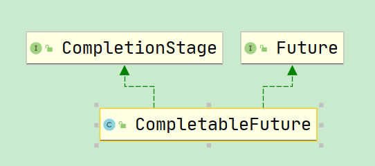
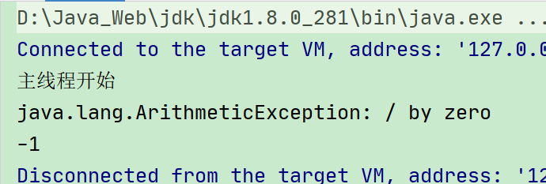
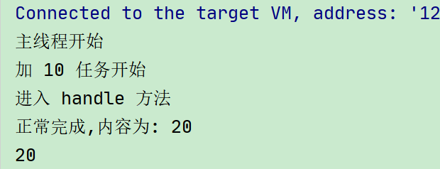
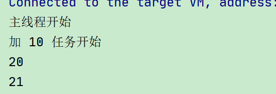
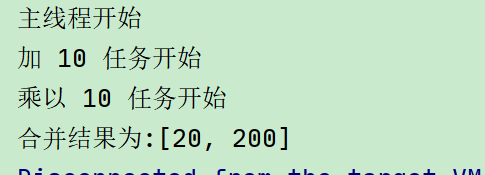

# 十二、CompletableFuture异步回调

## 1、**<font style="color:rgb(51,51,51);"> 简介</font>**


<font style="color:rgb(51,51,51);">CompletableFuture 在 Java 里面被用于异步编程，</font><font style="color:#E8323C;">异步通常意味着非阻塞</font><font style="color:rgb(51,51,51);">，可以使得我们的任务单独运行在与主线程分离的其他线程中，并且通过回调可以在主线程中得到异步任务的执行状态，是否完成，和是否异常等信息。 </font>

<font style="color:rgb(51,51,51);"></font>

<font style="color:rgb(51,51,51);">CompletableFuture 实现了 Future, CompletionStage 接口，实现了 Future 接口就可以兼容现有线程池框架，而 </font><font style="color:#E8323C;">CompletionStage </font><font style="color:rgb(51,51,51);">接口才是异步编程的接口抽象，里面定义多种异步方法，通过这两者集合，从而打造出了强大的 CompletableFuture 类。</font>

<font style="color:rgb(51,51,51);"></font>




## 2、**<font style="color:rgb(51,51,51);">Future 与 CompletableFuture</font>**


<font style="color:rgb(51,51,51);">Futrue 在 Java 里面，通常用来表示一个异步任务的引用，比如我们将任务提交到线程池里面，然后我们会得到一个 Futrue，在 Future 里面有 isDone 方法来判断任务是否处理结束，还有 get 方法可以一直阻塞直到任务结束然后获取结果，但整体来说这种方式，还是</font><font style="color:#E8323C;">同步</font><font style="color:rgb(51,51,51);">的，因为需要客户端不断阻塞等待或者不断轮询才能知道任务是否完成。</font>


**<font style="color:rgb(51,51,51);">Future 的主要缺点如下：</font>**

**<font style="color:rgb(51,51,51);"></font>**

1. <font style="color:#E8323C;">不支持手动完成 </font>

<font style="color:rgb(51,51,51);">我提交了一个任务，但是执行太慢了，我通过其他路径已经获取到了任务结果，现在没法把这个任务结果通知到正在执行的线程，所以必须主动取消或者一直等待它执行完成 </font>

<font style="color:rgb(51,51,51);"></font>

2. <font style="color:#E8323C;">不支持进一步的非阻塞调用 </font>

<font style="color:rgb(51,51,51);">通过 Future 的 get 方法会一直阻塞到任务完成，但是想在获取任务之后执行额外的任务，因为 Future 不支持回调函数，所以无法实现这个功能 </font>

<font style="color:rgb(51,51,51);"></font>

3. <font style="color:#E8323C;">不支持链式调用 </font>

<font style="color:rgb(51,51,51);">对于 Future 的执行结果，我们想继续传到下一个 Future 处理使用，从而形成一个链式的 pipline 调用，这在 Future 中是没法实现的。 </font>

<font style="color:rgb(51,51,51);"></font>

4. <font style="color:#E8323C;">不支持多个 Future 合并</font>

<font style="color:rgb(51,51,51);">比如我们有 10 个 Future 并行执行，我们想在所有的 Future 运行完毕之后，执行某些函数，是没法通过 Future 实现的。 </font>

<font style="color:rgb(51,51,51);"></font>

5. <font style="color:#E8323C;">不支持异常处理 </font>

<font style="color:rgb(51,51,51);">Future 的 API 没有任何的异常处理的 api，所以在异步运行时，如果出了问题是不好定位的</font>

**<font style="color:rgb(51,51,51);"></font>**

## <font style="color:rgb(51,51,51);">3、</font>**<font style="color:rgb(51,51,51);">入门</font>**


### **<font style="color:rgb(51,51,51);">3.1、使用 CompletableFuture</font>**


```java
/**
 * 主线程里面创建一个 CompletableFuture，然后主线程调用 get 方法会阻塞，
 * 最后我们在一个子线程中使其终止。
 *
 * @param args
 */
public static void main(String[] args) throws Exception {

    CompletableFuture<String> future = new CompletableFuture<>();

    new Thread(() -> {
        try {
            System.out.println(Thread.currentThread().getName() + "子线程开始干活");
            //子线程睡 5 秒
            Thread.sleep(5000);
            //在子线程中完成主线程
            future.complete("success");
        } catch (Exception e) {
            e.printStackTrace();
        }
    }, "A").start();

    //主线程调用 get 方法阻塞
    System.out.println("主线程调用 get 方法获取结果为: " + future.get());
    System.out.println("主线程完成,阻塞结束!!!!!!");
}
```


### **<font style="color:rgb(51,51,51);">3.2、没有返回值的异步任务 </font>**runAsync
```java
/**
 * 没有返回值的异步任务
 *
 * @param args
 */
public static void main(String[] args) throws Exception {
    System.out.println("主线程开始");

    //运行一个没有返回值的异步任务
    CompletableFuture<Void> future = CompletableFuture.runAsync(() -> {
        try {
            System.out.println("子线程启动干活");
            Thread.sleep(5000);
            System.out.println("子线程完成");
        } catch (Exception e) {
            e.printStackTrace();
        }
    });

    //主线程阻塞
    future.get();
    System.out.println("主线程结束");
}
```


### **<font style="color:rgb(51,51,51);"> 3.3、有返回值的异步任务 </font>**supplyAsync
```java
/**
 * 有返回值的异步任务
 *
 * @param args
 */
public static void main(String[] args) throws Exception {
    System.out.println("主线程开始");

    //运行一个有返回值的异步任务
    CompletableFuture<String> future = CompletableFuture.supplyAsync(() -> {
        try {
            System.out.println("子线程开始任务");
            Thread.sleep(5000);
        } catch (Exception e) {
            e.printStackTrace();
        }
        return "子线程完成了!";
    });

    //主线程阻塞
    String s = future.get();
    System.out.println("主线程结束, 子线程的结果为:" + s);
}
```


### **<font style="color:rgb(51,51,51);">3.4 线程依赖 </font>**<font style="color:rgb(51,51,51);">thenApply </font>


<font style="color:rgb(51,51,51);">当一个线程依赖另一个线程时，可以使用 thenApply 方法来把这两个线程串行化。</font>

```java

private static Integer num = 10;

/**
 * 先对一个数加 10,然后取平方
 *
 * @param args
 */
public static void main(String[] args) throws Exception {
    System.out.println("主线程开始");

    CompletableFuture<Integer> future = CompletableFuture.supplyAsync(() -> {
        try {
            System.out.println("加 10 任务开始");
            num += 10;
        } catch (Exception e) {
            e.printStackTrace();
        }
        return num;
    }).thenApply(integer -> {
        return num * num;
    });

    Integer integer = future.get();
    System.out.println("主线程结束, 子线程的结果为:" + integer);//400
}
```


### **<font style="color:rgb(51,51,51);">3.5 消费处理结果 </font>**<font style="color:rgb(51,51,51);">thenAccept </font>


<font style="color:rgb(51,51,51);">thenAccept 消费处理结果, 接收任务的处理结果，并消费处理，无返回结果。</font>

```java
private static Integer num = 10;

public static void main(String[] args) throws Exception {
    System.out.println("主线程开始");

    CompletableFuture.supplyAsync(() -> {
        try {
            System.out.println("加 10 任务开始");
            num += 10;
        } catch (Exception e) {
            e.printStackTrace();
        }
        return num;
    }).thenApply(integer -> {
        return num * num;
    }).thenAccept((integer) -> {
        System.out.println("子线程全部处理完成,最后调用了 accept,结果为:" + integer);//400
    });
}
```


###   **<font style="color:rgb(51,51,51);">3.6 异常处理</font>**


#### <font style="color:rgb(51,51,51);">exceptionally </font>
<font style="color:rgb(51,51,51);"></font>

<font style="color:rgb(51,51,51);">异常处理，出现异常时触发</font>

```java
private static Integer num = 10;

public static void main(String[] args) throws Exception {
    System.out.println("主线程开始");

    CompletableFuture<Integer> future = CompletableFuture.supplyAsync(() -> {
        int i = 1 / 0;
        System.out.println("加 10 任务开始");
        num += 10;
        return num;
    }).exceptionally(ex -> {
        System.out.println(ex.getMessage());
        return -1;
    });

    System.out.println(future.get());
}
```




#### <font style="color:rgb(51,51,51);">handle </font>
<font style="color:rgb(51,51,51);"></font>

<font style="color:rgb(51,51,51);">类似于 thenAccept/thenRun 方法，是最后一步的处理调用，但是同时可以处理异常</font>

```java
private static Integer num = 10;

public static void main(String[] args) throws Exception {
    System.out.println("主线程开始");

    CompletableFuture<Integer> future = CompletableFuture.supplyAsync(() -> {
        System.out.println("加 10 任务开始");
        num += 10;
        return num;
    }).handle((i, ex) -> {
        System.out.println("进入 handle 方法");
        if (ex != null) {
            System.out.println("发生了异常,内容为:" + ex.getMessage());
            return -1;
        } else {
            System.out.println("正常完成,内容为: " + i);
            return i;
        }
    });

    System.out.println(future.get());
}
```




### **<font style="color:rgb(51,51,51);">3.7 结果合并</font>**


#### <font style="color:rgb(51,51,51);">thenCompose </font>
<font style="color:rgb(51,51,51);"></font>

<font style="color:rgb(51,51,51);">合并两个有依赖关系的 CompletableFutures 的执行结果</font>

```java
private static Integer num = 10;

public static void main(String[] args) throws Exception {
    System.out.println("主线程开始");

    //第一步加 10
    CompletableFuture<Integer> future = CompletableFuture.supplyAsync(() -> {
        System.out.println("加 10 任务开始");
        num += 10;
        return num;
    });

    //合并
    CompletableFuture<Integer> future1 = future.thenCompose(i ->
            //再来一个 CompletableFuture
            CompletableFuture.supplyAsync(() -> {
                return i + 1;
            }));

    System.out.println(future.get());
    System.out.println(future1.get());
}
```




#### <font style="color:rgb(51,51,51);">thenCombine </font>
<font style="color:rgb(51,51,51);"></font>

<font style="color:rgb(51,51,51);">合并两个没有依赖关系的 CompletableFutures 任务</font>

```java
private static Integer num = 10;

public static void main(String[] args) throws Exception {
    System.out.println("主线程开始");

    CompletableFuture<Integer> job1 = CompletableFuture.supplyAsync(() -> {
        System.out.println("加 10 任务开始");
        num += 10;
        return num;
    });

    CompletableFuture<Integer> job2 = CompletableFuture.supplyAsync(() -> {
        System.out.println("乘以 10 任务开始");
        num = num * 10;
        return num;
    });

    //合并两个结果
    CompletableFuture<Object> future = job1.thenCombine(job2, new
            BiFunction<Integer, Integer, List<Integer>>() {
                @Override
                public List<Integer> apply(Integer a, Integer b) {
                    List<Integer> list = new ArrayList<>();
                    list.add(a);
                    list.add(b);
                    return list;
                }
            });

    System.out.println("合并结果为:" + future.get());
}
```




### <font style="color:rgb(51,51,51);">3.8、合并多个任务的结果</font>
**<font style="color:rgb(51,51,51);"></font>**

#### <font style="color:rgb(51,51,51);">allOf: </font>
<font style="color:rgb(51,51,51);"></font>

<font style="color:rgb(51,51,51);">一系列独立的 future 任务，等其所有的任务执行完后做一些事情</font>

```java
    private static Integer num = 10;

    /**
     * 先对一个数加 10,然后取平方
     *
     * @param args
     */
    public static void main(String[] args) throws Exception {
        System.out.println("主线程开始");
        List<CompletableFuture<Integer>> list = new ArrayList<>();

        CompletableFuture<Integer> job1 = CompletableFuture.supplyAsync(() -> {
            System.out.println("加 10 任务开始");
            num += 10;
            return num;
        });
        list.add(job1);

        CompletableFuture<Integer> job2 = CompletableFuture.supplyAsync(() -> {
            System.out.println("乘以 10 任务开始");
            num *= 10;
            return num;
        });
        list.add(job2);

        CompletableFuture<Integer> job3 = CompletableFuture.supplyAsync(() -> {
            System.out.println("减以 10 任务开始");
            num -= 10;
            return num;
        });
        list.add(job3);

        CompletableFuture<Integer> job4 = CompletableFuture.supplyAsync(() -> {
            System.out.println("除以 10 任务开始");
            num /= 10;
            return num;
        });
        list.add(job4);

        //多任务合并
        List<Integer> collect = list.stream().map(CompletableFuture::join).collect(Collectors.toList());
        System.out.println(collect);


//        CompletableFuture<Void> allCompletableFuture = CompletableFuture.allOf(list.toArray(new CompletableFuture[list.size()]));
//        List<Integer> integers = allCompletableFuture.thenApply(e -> list.stream().map(CompletableFuture::join).collect(Collectors.toList())).get();
//        System.out.println(integers);
    }
```


#### <font style="color:rgb(51,51,51);">anyOf: </font>
<font style="color:rgb(51,51,51);"></font>

<font style="color:rgb(51,51,51);">只要在多个 future 里面有一个返回，整个任务就可以结束，而不需要等到每一个future 结束</font>

```java
private static Integer num = 10;

/**
 * 先对一个数加 10,然后取平方
 *
 * @param args
 */
public static void main(String[] args) throws Exception {
    System.out.println("主线程开始");

    List<CompletableFuture<Integer>> list = new ArrayList<>();


    CompletableFuture<Integer> job1 = CompletableFuture.supplyAsync(() -> {
        try {
            Thread.sleep(5000);
            System.out.println("加 10 任务开始");
            num += 10;
            return num;
        } catch (Exception e) {
            return 0;
        }
    });
    list.add(job1);

    CompletableFuture<Integer> job2 = CompletableFuture.supplyAsync(() -> {
        try {
            Thread.sleep(2000);
            System.out.println("乘以 10 任务开始");
            num *= 10;
            return num;
        } catch (Exception e) {
            return 1;
        }
    });
    list.add(job2);

    CompletableFuture<Integer> job3 = CompletableFuture.supplyAsync(() -> {
        try {
            Thread.sleep(3000);
            System.out.println("减以 10 任务开始");
            num -= 10;
            return num;
        } catch (Exception e) {
            return 2;
        }
    });
    list.add(job3);

    CompletableFuture<Integer> job4 = CompletableFuture.supplyAsync(() -> {
        try {
            Thread.sleep(4000);
            System.out.println("除以 10 任务开始");
            num /= 10;
            return num;
        } catch (Exception e) {
            return 3;
        }
    });
    list.add(job4);


    CompletableFuture<Integer>[] futures = list.toArray(new CompletableFuture[list.size()]);
    CompletableFuture<Object> future = CompletableFuture.anyOf(futures);
    System.out.println(future.get());
}
```


> 更新: 2023-11-15 18:29:30  
> 原文: <https://www.yuque.com/like321/vggeaw/ddnbgb>