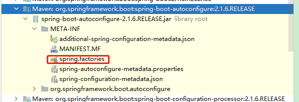

# 一、Spring Boot概述


尚硅谷：[https://www.yuque.com/atguigu/springboot/na3pfd](https://www.yuque.com/atguigu/springboot/na3pfd)


## 1. Spring Boot是什么


SpringBoot是对Spring的进一步封装


Spring Boot是一个便捷搭建 基于spring工程的脚手架；


### 作用


帮助开发人员快速搭建大型的spring 项目。


### 优势


+  简化配置  
SpringBoot是对Spring的进一步封装，基于注解开发，舍弃笨重的XML，确实需要配置的使用yml或properties进行简要配置即可。 


+  产品级独立运行  
每一个工程都可以打成一个jar包，其中内置了Tomcat或其他Servlet容器，可以独立运行，这是和微服务理念最为契合的一点。 


+  强大的场景启动器  
每一个特定场景下的需求都封装成了一个Starter，只要导入这个Starter就有了这个场景所需要的一切。其中包括针对这个场景的自动化配置、依赖信息。 


### 一个springBoot工程的主要组成部分


在使用SpringBoot时，我们可以通过starter引入各个特定功能所需要的自动配置类和所需依赖；


+ 通过@EnableXxx注解启用某种功能；


+ 通过yml或properties文件进行配置。


每一个SpringBoot都必须提供一个主启动类。


## 
## 


## 2. 相关注解


### Spring的注解


+ @Configuration注解


使用@Configuration注解标记一个类后，这个类成为配置类，加载这个类中的配置可以取代以前的XML配置文件。


```java
@Configuration
public class SpringAnnotationConfig{

}
```


基于注解类而不是XML配置文件创建IOC容器对象的代码如下：


```java
ApplicationContext iocContainer = new AnnotationConfigApplicationContext(SpringAnnotationConfig.class);
```


+ @Bean注解


相当于XML配置文件中的bean标签。用于把一个类的对象加入IOC容器。


```java
@Configuration
public class SpringAnnotationConfig{

	@Bean
	public EmployeeService getEmployeeService(){
		return new EmployeeService();
	}

}
```


+ @Import注解


相对于@Bean注解，使用@Import注解可以更便捷的将一个类加入IOC容器。


```java
@Configuration
@Import(EmployeeHandler.class)
public class SpringAnnotationConfig{
    
}
```


+  @Conditional注解  
一个类在满足特定条件时才加入IOC容器 


+  @ComponentScan注解  
指定IOC容器扫描的包。相当于在XML中配置context:component-scan 


```java
@ComponentScan(
	value="com.atguigu.spring.annotation.component",
    useDefaultFilters = false,
    includeFilters = {
        @Filter(type=FilterType.ANNOTATION,classes=Controller.class)
    },
    excludeFilters = {
        @Filter(type=FilterType.ANNOTATION,classes=Service.class)
    }
)
```


### SpringBoot的注解


+  @SpringBootConfiguration注解

  
@Configuration注解的SpringBoot版 


```java
@Target({ElementType.TYPE})
@Retention(RetentionPolicy.RUNTIME)
@Documented
@Configuration
public @interface SpringBootConfiguration {
}
```


+ @EnableAutoCOnfiguration注解


启用自动化配置功能


```java
@Target({ElementType.TYPE})
@Retention(RetentionPolicy.RUNTIME)
@Documented
@Inherited
@AutoConfigurationPackage
@Import({AutoConfigurationImportSelector.class})
public @interface EnableAutoConfiguration {
    String ENABLED_OVERRIDE_PROPERTY = "spring.boot.enableautoconfiguration";

    Class<?>[] exclude() default {};

    String[] excludeName() default {};
}
```


SpringBoot在这里通过@Import注解中的AutoConfigurationImportSelector.class将所需要导入的组件以全类名的方式返回。


这些组件将会被添加到容器中，给容器中导入非常多的自动配置类(XxxAutoConfiguration)。


这样就给容器中导入了这个场景需要的所有组件，并配置好这些组件。


而这些组件以前是需要我们手动在XML中配置才能加入IOC容器。


+  @AutoConfigurationPackage注解

  
指定自动化配置的包 


```java
@Target({ElementType.TYPE})
@Retention(RetentionPolicy.RUNTIME)
@Documented
@Inherited
@Import({Registrar.class})
public @interface AutoConfigurationPackage {
}
```


SpringBoot在这里通过@Import注解中的AutoConfigurationPackage.Registrar.class将主启动类所在包和它的子包中的所有组件扫描到IOC容器。


+ @SpringBootApplication注解


表示当前应用是一个SpringBoot应用。包含@SpringBootConfiguration、@EnableAutoConfiguration、@ComponentScan注解。


## 3. SpringBoot工作原理


+  读取Spring.factories文件  
SpringBoot启动时会读取spring-boot-autoconfigure-2.1.6.RELEASE.jar包下的`META-INF\spring.factories`文件（定义了很多自动配置类）。  
  
读取org.springframework.boot.autoconfigure.EnableAutoConfiguration属性的值加载自动配置类。  
 
+  加载XxxProperties类  
根据自动配置类中指定的XxxProperties类设置自动配置的属性值，  
开发者也可以根据XxxProperties类中指定的属性在yml配置文件中修改自动配置。  
  
  
 
+  根据@ConditionalXxx注解决定加载哪些组件  
SpringBoot通过@ConditionalXxx注解指定特定组件加入IOC容器时所需要具备的特定条件。  
这个组件会在满足条件时加入IOC容器。  
 


可以根据在pom.xml文件中添加的 启动器依赖自动配置组件


通过如下流程可以去修改application配置文件，改变自动配置的组件默认参数


> 更新: 2022-08-19 15:06:56  
> 原文: <https://www.yuque.com/like321/mdsi9b/lk75c9>