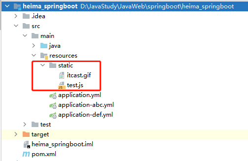

# 七、整合-SpringMVC端口和静态资源

**目标**：可以修改tomcat的端口和访问项目中的静态资源


### 修改tomcat端口


查询**Properties，设置配置项（前缀+类变量名）到application配置文件中


```plain
#tomcat端口
server:
  port: 80
```


### 访问项目中的静态资源


+  在spring boot项目中静态资源可以放置在如下目录：  
 


+ 放置静态资源并访问这些资源





> 更新: 2022-08-19 14:32:29  
> 原文: <https://www.yuque.com/like321/mdsi9b/uzul0z>