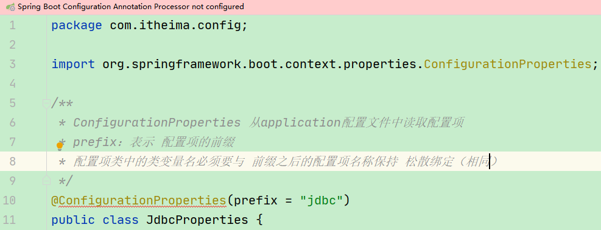

# 三、Spring Boot属性注入方式


**目标**：能够使用@ConfigurationProperties实现Spring Boot配置文件配置项读取和应用


需求：将配置文件中的配置项读取到一个对象中；


实现：可以使用Spring Boot提供的注解@ConfigurationProperties，该注解可以<font style="color:#E8323C;">将Spring Boot的配置文件（默认必须为application.properties或application.yml）中的配置项读取到一个对象中。</font>


### 创建配置项类JdbcProperties类


在该类名上面添加@ConfigurationProperties


使用@ConfigurationProperties编写配置项类将配置文件中的配置项设置到对象中


```java
package com.itheima.config;

import org.springframework.boot.context.properties.ConfigurationProperties;

/**
 * ConfigurationProperties 从application配置文件中读取配置项
 * prefix：表示 配置项的前缀
 * 配置项类中的类变量名必须要与 前缀之后的配置项名称保持 松散绑定（相同）
 */
@ConfigurationProperties(prefix = "jdbc")
public class JdbcProperties {

    private String url;
    private String driverClassname;
    private String username;
    private String password;

    public String getUrl() {
        return url;
    }

    public void setUrl(String url) {
        this.url = url;
    }

    public String getDriverClassname() {
        return driverClassname;
    }

    public void setDriverClassname(String driverClassname) {
        this.driverClassname = driverClassname;
    }

    public String getUsername() {
        return username;
    }

    public void setUsername(String username) {
        this.username = username;
    }

    public String getPassword() {
        return password;
    }

    public void setPassword(String password) {
        this.password = password;
    }
}
```


注意：出现这种情况





```xml
<dependency>
    <groupId>org.springframework.boot</groupId>
    <artifactId>spring-boot-configuration-processor</artifactId>
    <!--不传递依赖-->
    <optional>true</optional>
</dependency>
```


### 创建application.properties


```properties
jdbc.driverClassName=com.mysql.jdbc.Driver
jdbc.url=jdbc:mysql://127.0.0.1:3306/springboot_test
jdbc.username=root
jdbc.password=root
```


### 将JdbcProperties对象注入到JdbcConfig


```java
package com.itheima.config;

import com.alibaba.druid.pool.DruidDataSource;
import org.springframework.boot.context.properties.EnableConfigurationProperties;
import org.springframework.context.annotation.Bean;
import org.springframework.context.annotation.Configuration;

import javax.sql.DataSource;

@Configuration
@EnableConfigurationProperties(JdbcProperties.class)
public class JdbcConfig {


    @Bean
    public DataSource dataSource(JdbcProperties jdbcProperties) {
        DruidDataSource dataSource = new DruidDataSource();
        dataSource.setDriverClassName(jdbcProperties.getDriverClassname());
        dataSource.setUrl(jdbcProperties.getUrl());
        dataSource.setUsername(jdbcProperties.getUsername());
        dataSource.setPassword(jdbcProperties.getPassword());
        return dataSource;
    }

}
```


### 处理器类注入数据源并使用


```java
package com.itheima.controller;

import org.springframework.beans.factory.annotation.Autowired;
import org.springframework.web.bind.annotation.GetMapping;
import org.springframework.web.bind.annotation.RestController;

import javax.sql.DataSource;

@RestController
public class HelloController {

    @Autowired
    private DataSource dataSource;

    @GetMapping("hello")
    public String hello() {
        System.out.println("dataSource = " + dataSource);
        return "hello Spring Boot";
    }

}
```


### 更优雅的注入


事实上，如果一段属性只有一个Bean需要使用，我们无需将其注入到一个类（JdbcProperties）中。


而是直接在需要的地方声明即可；


+ 使用@ConfigurationProperties在JdbcConfig类方法上面使用


```java
package com.itheima.config;

import com.alibaba.druid.pool.DruidDataSource;
import org.springframework.boot.context.properties.ConfigurationProperties;
import org.springframework.context.annotation.Bean;
import org.springframework.context.annotation.Configuration;

import javax.sql.DataSource;

@Configuration
public class JdbcConfig {

    @Bean
    @ConfigurationProperties(prefix = "jdbc")
    public DataSource dataSource() {
        return new DruidDataSource();
    }

}
```


> 更新: 2024-01-25 13:50:55  
> 原文: <https://www.yuque.com/like321/mdsi9b/yb5dho>