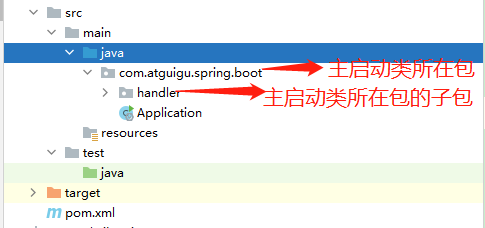

# 二、Spring Boot入门

## 2. Spring Boot入门


创建工程：


+  方式一：Maven工程  
先创建Maven工程，然后引入SpringBoot环境。 


+  方式二：Spring starter project  
使用Spring插件创建工程，主启动类、测试类、pom.xml都会自动给我们创建好，但是创建过程必须联网。 


需求：可以在浏览器中访问http://localhost:8080/hello输出一串字符


### Maven创建工程


### 添加依赖


（启动器依赖，spring-boot-starter-web）


```xml
<!-- 继承SpringBoot官方指定的父工程-->
<parent>
    <groupId>org.springframework.boot</groupId>
    <artifactId>spring-boot-starter-parent</artifactId>
    <version>2.1.6.RELEASE</version>
</parent>

<properties>
    <java.version>1.8</java.version>
</properties>

<dependencies>
    <!-- 加入Web开发所需要的场景启动器-->
    <dependency>
        <!-- 指定groupId和artifactId即可，版本已在父工程中定义-->
        <groupId>org.springframework.boot</groupId>
        <artifactId>spring-boot-starter-web</artifactId>
    </dependency>
</dependencies>

<!-- Maven构建过程相关配置-->
<build>
    <!--  构建过程中所需要用到的插件-->
    <plugins>
        <!-- 这个插件将SpringBoot应用打包成一个可执行的jar包-->
        <plugin>
            <groupId>org.springframework.boot</groupId>
            <artifactId>spring-boot-maven-plugin</artifactId>
            <version>2.3.4.RELEASE</version>
        </plugin>
    </plugins>
</build>
```


### 创建主启动类


```java
package com.atguigu.spring.boot;

import org.springframework.boot.SpringApplication;
import org.springframework.boot.autoconfigure.SpringBootApplication;

/**
 * spring boot工程都有一个启动引导类，这是工程的入口类
 * 并在引导类上添加@SpringBootApplication
 */
@SpringBootApplication
public class Application {

    public static void main(String[] args) {
        SpringApplication.run(Application.class, args);
    }

}
```


### 创建处理器Controller


```java
package com.atguigu.spring.boot.handler;

import org.springframework.web.bind.annotation.RequestMapping;
import org.springframework.web.bind.annotation.RestController;

@RestController
public class HelloHandler {

    @RequestMapping("/hello")
    public String hello() {
        return "hello Spring Boot";
    }

}
```


### 测试


**小结**：


Spring Boot工程可以通过添加启动器依赖和创建启动引导类实现快速创建web工程。


> spring-boot-starter-web默认的应用服务器端口是8080
>


### 解读


+  @SpringBootApplication  
标记在一个主程序类上，说明这是一个SpringBoot应用。  
那么这个类中的main()方法就是整个SpringBoot应用的入口，也就是说要通过运行这个main()方法启动SpringBoot应用。 


+  SpringApplication.run(...)  
启动SpringBoot应用，后续要加载很多内置配置文件，根据自动化配置加载很多组件到IOC容器。 


+  包扫描方式：按照约定规则自动扫描  
在SpringBoot环境下，**<font style="color:#E8323C;">主启动类所在包、主启动类所在包的子包</font>**会被自动扫描。 





+  包扫描方式：手动指定  
在主启动类上使用@ComponentScan注解可以指定扫描的包，但是此时**<font style="color:#E8323C;">约定规则会失效</font>**<font style="color:#E8323C;">。 </font>


```java
/**
 * spring boot工程都有一个启动引导类，这是工程的入口类
 * 并在引导类上添加@SpringBootApplication
 */
@SpringBootApplication
//手动指定扫描的包，此时SpringBoot约定的默认扫描规则将会失效。
@ComponentScan("com.atguigu.spring.boot.other")
public class Application {

    public static void main(String[] args) {
        SpringApplication.run(Application.class, args);
    }

}
```


+  父工程  
我们的工程继承了spring-boot-starter-parent工程，而spring-boot-starter-parent继承的是spring-boot-dependencies工程。  
<font style="color:#E8323C;">spring-boot-dependencies工程中管理的是SpringBoot环境所需要使用的依赖。</font> 


+  场景启动器  
SpringBoot根据行业多年积累，将典型应用场景抽取出来，每个场景封装成一个starter。  
导入一个场景的starter，就能够导入这个场景所需要的全部jar包，非常方便。  
对于开发者来说，需要使用什么场景，就导入对应的starter即可。 


## 3. Java代码方式配置


**目标**：可以使用@Value获取配置文件配置项并结合@Bean注册组件到Spring


需求：使用Java代码配置数据库连接池，并可以在处理器中注入并使用


### 添加依赖


```xml
<dependency>
    <groupId>com.alibaba</groupId>
    <artifactId>druid</artifactId>
    <version>1.1.10</version>
</dependency>
```


### 创建数据库


### 创建配置文件jdbc.properties


```properties
jdbc.driverClassName=com.mysql.jdbc.Driver
jdbc.url=jdbc:mysql://127.0.0.1:3306/springboot_test
jdbc.username=root
jdbc.password=root
```


### 创建配置类


```java
package com.itheima.config;

import com.alibaba.druid.pool.DruidDataSource;
import org.springframework.beans.factory.annotation.Value;
import org.springframework.context.annotation.Bean;
import org.springframework.context.annotation.Configuration;
import org.springframework.context.annotation.PropertySource;

import javax.sql.DataSource;

@Configuration
@PropertySource("classpath:jdbc.properties")
public class JdbcConfig {

    @Value("${jdbc.driverClassName}")
    String driverClassName;

    @Value("${jdbc.url}")
    String url;

    @Value("${jdbc.username}")
    String username;

    @Value("${jdbc.password}")
    String password;

    @Bean
    public DataSource dataSource() {
        DruidDataSource dataSource = new DruidDataSource();
        dataSource.setDriverClassName(driverClassName);
        dataSource.setUrl(url);
        dataSource.setUsername(username);
        dataSource.setPassword(password);
        return dataSource;
    }
    
}
```


### 改造处理器类注入数据源并使用


```java
package com.itheima.controller;

import org.springframework.beans.factory.annotation.Autowired;
import org.springframework.web.bind.annotation.GetMapping;
import org.springframework.web.bind.annotation.RestController;

import javax.sql.DataSource;

@RestController
public class HelloController {

    @Autowired
    private DataSource dataSource;

    @GetMapping("hello")
    public String hello() {
        System.out.println("dataSource = " + dataSource);
        return "hello Spring Boot";
    }

}
```


> 更新: 2022-08-19 14:14:11  
> 原文: <https://www.yuque.com/like321/mdsi9b/ncp684>