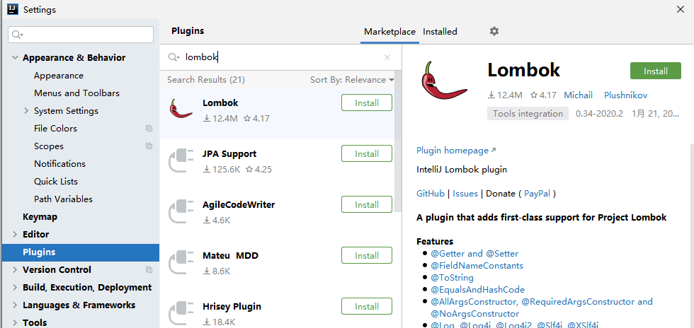

# 六、整合lombok应用

**目标**：使用lombok的注解实现pojo类的简化


使用Spring Boot整合SSM工程；需要使用到数据库数据。


+  将数据库表数据导入到数据库中（springboot_test）； 
+  编写数据库表对应的实体类；一般情况下需要编写get/set/toString等这些方法会耗时并且会让实体类看起来比较臃肿。可以使用lombok插件对实体类进行简化。  
lombok是一个插件工具类包；提供了一些注解@Data、@Getter等这些注解去简化实体类中的构造方法、get/set等方法的编写。 


### 在IDEA中安装lombok插件





### 添加lombok对应的依赖到项目pom.xml文件


```xml
<dependency>
    <groupId>org.projectlombok</groupId>
    <artifactId>lombok</artifactId>
</dependency>
```


### 实体类使用lombok注解


```java
package com.itheima.pojo;

import lombok.Data;
import lombok.extern.slf4j.Slf4j;

import java.util.Date;

//在编译阶段会根据注解自动生成对应的方法 data包含get/set/hashCode/equals/toString等方法
@Data
@Slf4j
public class User {

    private Long id;
    private String userName;
    private String password;
    private String name;
    private Integer age;
    private Integer sex;
    private Date birthday;
    private String note;
    private Date created;
    private Date updated;

}
```


**小结**：


在Bean上使用：  
@Data  ：自动提供getter和setter、hashCode、equals、toString等方法   
@Getter：自动提供getter方法  
@Setter：自动提供setter方法  
@Slf4j：自动在bean中提供log变量，其实用的是slf4j的日志功能。


> 更新: 2022-08-19 14:31:14  
> 原文: <https://www.yuque.com/like321/mdsi9b/xrfd07>