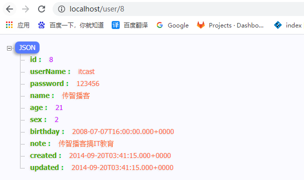

# 十一、整合-通用Mapper

**目标**：配置通用Mapper组件到Spring Boot项目中并使用Mapper接口


通用Mapper：可以实现自动拼接sql语句；


所有的mapper都不需要编写任何方法，也就是不用编写sql语句。可以提高开发效率。


### 添加启动器依赖


通用Mapper的作者也为自己的插件编写了启动器，我们直接引入即可。


在项目的 pom.xml 文件中加入如下依赖：


```xml
<!-- 通用mapper -->
<dependency>
    <groupId>tk.mybatis</groupId>
    <artifactId>mapper-spring-boot-starter</artifactId>
    <version>2.1.5</version>
</dependency>
```


注意：一旦引入了通用Mapper的启动器，会覆盖Mybatis官方启动器的功能，因此需要移除对官方Mybatis启动器的依赖。


### 改造UserMapper继承Mapper


```java
package com.itheima.mapper;

import com.itheima.pojo.User;
import tk.mybatis.mapper.common.Mapper;

public interface UserMapper extends Mapper<User> {


}
```


### 修改启动引导类Application中的Mapper扫描注解


```java
package com.itheima;

import org.springframework.boot.SpringApplication;
import org.springframework.boot.autoconfigure.SpringBootApplication;
import tk.mybatis.spring.annotation.MapperScan;

/**
 * spring boot工程都有一个启动引导类，这是工程的入口类
 * 并在引导类上添加@SpringBootApplication
 */
@SpringBootApplication
//MapperScan 扫描mybatis所有的mapper接口
@MapperScan("com.itheima.mapper")
public class Application {

    public static void main(String[] args) {
        SpringApplication.run(Application.class, args);
    }

}
```


### 修改User实体类添加jpa注解


```java
package com.itheima.pojo;

import lombok.Data;
import tk.mybatis.mapper.annotation.KeySql;

import javax.persistence.Column;
import javax.persistence.Id;
import javax.persistence.Table;
import java.util.Date;

//在编译阶段会根据注解自动生成对应的方法 data包含get/set/hashCode/equals/toString等方法
@Data
@Table(name = "tb_user")
public class User {

    @Id
    //主键回填
    @KeySql(useGeneratedKeys = true)
    private Long id;

    //@Column user_name ---> userName
    private String userName;
    private String password;
    private String name;
    private Integer age;
    private Integer sex;
    private Date birthday;
    private String note;
    private Date created;
    private Date updated;


}
```


### 改造UserService实现业务功能


```java
package com.itheima.service;

import com.itheima.mapper.UserMapper;
import com.itheima.pojo.User;
import org.springframework.beans.factory.annotation.Autowired;
import org.springframework.stereotype.Service;
import org.springframework.transaction.annotation.Transactional;

@Service
public class UserService {

    @Autowired
    private UserMapper userMapper;

    //根据id查询
    public User queryById(Long id){
        return userMapper.selectByPrimaryKey(id);
    }


    //新增保存用户
    @Transactional
    public void saveUser(User user){
        System.out.println("新增用户");
        //选择性新增  如果属性为空，则该属性不会出现在insert语句上
        userMapper.insertSelective(user);
    }

}
```


**小结**：


> 在启动引导类上面的mapper扫描注解 一定要修改为 通用mapper的扫描注解
>


### 测试


可以访问处理器对应路径将数据库中的数据根据id查询


+ 修改HelloController：注入UserService利用其方法实现查询；


```java
package com.itheima.controller;

import com.itheima.pojo.User;
import com.itheima.service.UserService;
import org.springframework.beans.factory.annotation.Autowired;
import org.springframework.web.bind.annotation.GetMapping;
import org.springframework.web.bind.annotation.PathVariable;
import org.springframework.web.bind.annotation.RestController;


@RestController
public class HelloController {

    @Autowired
    private UserService userService;

    @GetMapping("/user/{id}")
    public User queryById(@PathVariable Long id){
        User user = userService.queryById(id);
        return user;
    }

}
```





> 更新: 2022-08-19 14:38:36  
> 原文: <https://www.yuque.com/like321/mdsi9b/ob1w26>