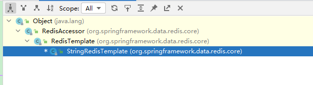

# 十三、整合-redis

**目标**：在Spring Boot项目中使用Junit测试RedisTemplate的使用


### 添加启动器依赖:


spring-boot-starter-data-redis


```xml
<dependency>
    <groupId>org.springframework.boot</groupId>
    <artifactId>spring-boot-starter-data-redis</artifactId>
</dependency>
```


### 配置redis的连接参数


application.yml中修改


```yaml
spring:
  mvc:
    view:
      prefix: /WEB-INF/
      suffix: .jsp
  datasource:
    driver-class-name: com.mysql.jdbc.Driver
    url: jdbc:mysql://127.0.0.1:3306/springboot_test?useSSL=false
    username: root
    password: root
  redis:
    host: localhost
    port: 6379
    password: 321612
```


### 编写测试类


应用RedisTemplate操作redis中的5种数据类型（string/hash/list/set/sorted set）


```java
@RunWith(SpringRunner.class)
@SpringBootTest
public class RedisTest {

    @Autowired
    private StringRedisTemplate stringRedisTemplate;

    @Test
    public void testRealStringRedisTemplate(){
        // 1、获取ValueOperations对象
        ValueOperations<String, String> operations = stringRedisTemplate.opsForValue();

        //2、借助ValueOperations对象存入数据
        String key = "age";
        operations.set(key,"23");

        //3、读取数据
        String readValue = operations.get(key);
        System.out.println(readValue);
    }


    @Autowired
    private RedisTemplate<String,String> myStringRedisTemplate;

    @Test
    public void testMyStringRedisTemplate(){

        //1、获取用来操作String类型数据的ValueOperations对象
        ValueOperations<String, String> operations = myStringRedisTemplate.opsForValue();

        //2、借助ValueOperations对象存入数据
        String key = "name";
        operations.set(key,"zhangsan");

        //3、读取数据
        String readValue = operations.get(key);
        System.out.println(readValue);

    }

}
```


### RedisTemplate和StringRedisTemplate的关系





```java
@RunWith(SpringRunner.class)
@SpringBootTest
public class RedisTest {

    @Autowired
    private RedisTemplate redisTemplate;

    @Test
    public void test() {
        // string 字符串
//        redisTemplate.opsForValue().set("username","heima");
        redisTemplate.boundValueOps("username").set("heima ");
//        System.out.println(redisTemplate.opsForValue().get("username"));
        System.out.println(redisTemplate.boundValueOps("username").get());
    }

}
```


```java
@RunWith(SpringRunner.class)
@SpringBootTest
public class RedisTest {

    @Autowired
    private RedisTemplate redisTemplate;

    @Test
    public void test() {

        // hash 散列
        redisTemplate.boundHashOps("h_key").put("name", "heima");
        redisTemplate.boundHashOps("h_key").put("age", "34");
        //获取所有域
        Set keys = redisTemplate.boundHashOps("h_key").keys();
        System.out.println("hash散列的所有域：" + keys);
        //获取所有值
        List values = redisTemplate.boundHashOps("h_key").values();
        System.out.println("hash散列的所有值：" + values);

    }

}
```


```java
@RunWith(SpringRunner.class)
@SpringBootTest
public class RedisTest {

    @Autowired
    private RedisTemplate redisTemplate;

    @Test
    public void test() {

        // list 列表
        redisTemplate.boundListOps("l_key").leftPush("c");
        redisTemplate.boundListOps("l_key").leftPush("b");
        redisTemplate.boundListOps("l_key").leftPush("a");
        //获取全部元素
        List list = redisTemplate.boundListOps("l_key").range(0, -1);
        System.out.println("list列表中的所有元素：" + list);

    }

}


@RunWith(SpringRunner.class)
@SpringBootTest
public class RedisTest {

    @Autowired
    private StringRedisTemplate stringRedisTemplate;


    @Test
    public void testListOperation(){
        ListOperations<String, String> opsForList = stringRedisTemplate.opsForList();

        opsForList.leftPush("fruit","apple");
        opsForList.leftPush("fruit","banana");
        opsForList.leftPush("fruit","orange");

        List<String> fruit = opsForList.range("fruit", 0, -1);

        System.out.println(fruit);

    }

}
```


```java
@RunWith(SpringRunner.class)
@SpringBootTest
public class RedisTest {

    @Autowired
    private RedisTemplate redisTemplate;

    @Test
    public void test() {

        // set集合
        redisTemplate.boundSetOps("s_key").add("a", "b", "c");
        Set s_key = redisTemplate.boundSetOps("s_key").members();
        System.out.println("set集合中的所有元素：" + s_key);

    }

}
```


```java
@RunWith(SpringRunner.class)
@SpringBootTest
public class RedisTest {

    @Autowired
    private RedisTemplate redisTemplate;

    @Test
    public void test() {

        // sorted set 有序集合
        redisTemplate.boundZSetOps("z_key").add("a", 30);
        redisTemplate.boundZSetOps("z_key").add("b", 20);
        redisTemplate.boundZSetOps("z_key").add("c", 10);

        Set z_key = redisTemplate.boundZSetOps("z_key").range(0, -1);
        System.out.println("zset有序集合中的所有元素：" + z_key);

    }

}
```


> 更新: 2022-08-19 14:42:17  
> 原文: <https://www.yuque.com/like321/mdsi9b/yfbwn2>