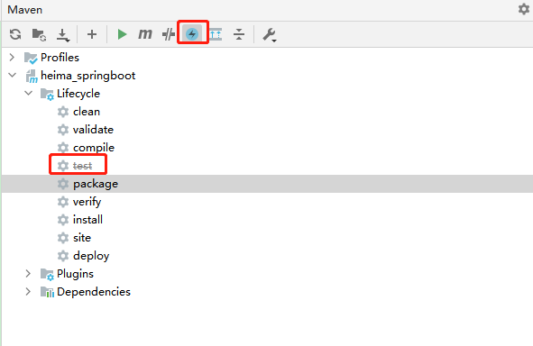
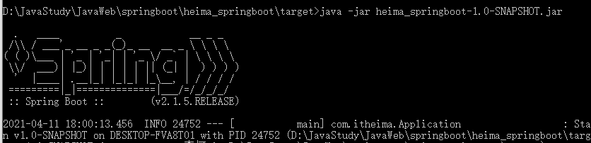

# 十五、Spring Boot项目部署

**目标**：将Spring Boot项目使用maven指令打成jar包并运行测试

### 添加打包组件


需要添加打包组件将项目中的资源、配置、依赖包打到一个jar包中；


```xml
<build>
    <plugins>
        <!-- 打jar包时如果不配置该插件，打出来的jar包没有清单文件 -->
        <plugin>
            <groupId>org.springframework.boot</groupId>
            <artifactId>spring-boot-maven-plugin</artifactId>
            <version>2.3.4.RELEASE</version>
        </plugin>
    </plugins>
</build>
```


### 打包


可以使用maven的`package`；





### 部署运行


```shell
java -jar 包名
```





> 更新: 2022-08-19 15:09:23  
> 原文: <https://www.yuque.com/like321/mdsi9b/maqm1x>