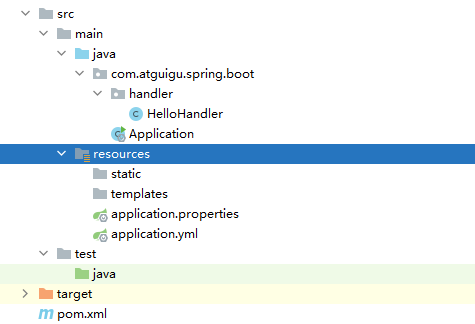
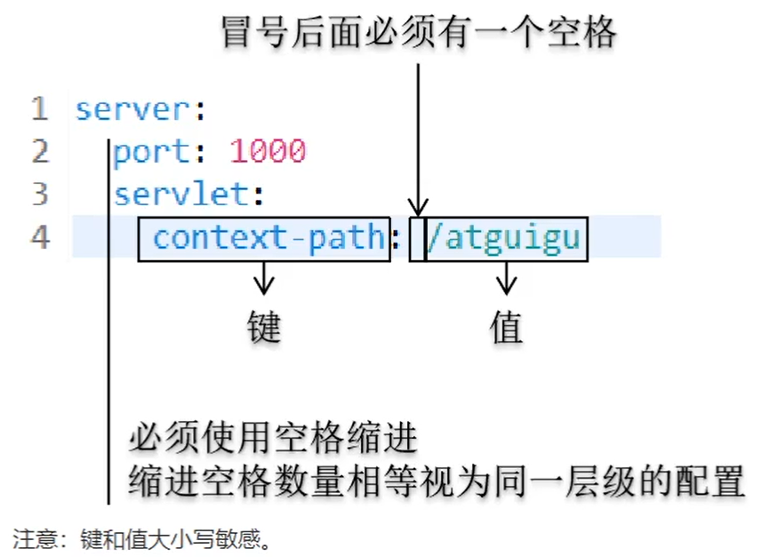

# 四、SpringBoot配置文件

SpringBoot配置文件有两种，分别是properties属性文件和yml文件。


SpringBoot配置文件需要注意以下几点：


+  文件保存位置是main/resources目录 
+  文件名是application.properties或application.yml 
+  properties文件和yml文件二选一。  
我们所做的配置可以分开放在这两个配置文件中也可以只使用其中一个。如果同一个配置项在两个配置文件中有不同配置  
比如：server.port在properties文件里设置了1000，在yml文件里设置了2000  
那么<font style="color:#E8323C;">以properties文件为准</font>，但说实话，这么干挺无聊的。  
 
+  SpringBoot本身已经有自动配置了，**配置文件是对自动配置的调整和修改**。 


### YAML简介


application.yml使用的是YAML语法，YAML的意思是：YAML is not markup language。


它强调自己不是XML、HTML这样的标记语言，不使用标签。


它以数据为中心，比JSON、XML更适合做配置文件。





### 值的类型


+  字面量  
普通的字符串、数值、布尔类型  
注意：设置数据库密码的时候如果是0开头的一串数字会被SpringBoot按照8进制数据解析，从而导致连接数据库时密码错误。加上引号即可。 


+  对象、Map  
常规写法 

```yaml
student:
  sut-id: 15
  stu-name: tom
  subject: java
```

  
行内写法  

+  数组  
使用“-”表示数组中的元素，“-”后面同样需要一个空格。  
常规写法 

```yaml
student:
  sut-id: 15
  stu-name: tom
  subject: 
  - java
  - php
  - mysql
```

  
行内写法：  


### 配置文件中注入JavaBean


+ pom.xml引入依赖


```xml
<dependency>
    <groupId>org.springframework.boot</groupId>
    <artifactId>spring-boot-configuration-processor</artifactId>
    <!--不传递依赖-->
    <optional>true</optional>
</dependency>
<dependency>
    <groupId>org.springframework.boot</groupId>
    <artifactId>spring-boot-starter-test</artifactId>
</dependency>
```


测试


```java
package com.atguigu.spring.boot.test;

import org.junit.Test;
import org.slf4j.Logger;
import org.slf4j.LoggerFactory;
import org.springframework.boot.test.context.SpringBootTest;

@SpringBootTest
@RunWith(SpringRunner.class)
public class MySpringBootTest {

    Logger logger = LoggerFactory.getLogger(MySpringBootTest.class);

    @Test
    public void testReadYaml() {
        logger.debug("test……");
    }

}
```


+ 创建Student


```java
package com.atguigu.spring.boot.entity;

public class Address {

    private String province;
    private String city;
    private String street;

    public Address() {
    }

    public Address(String province, String city, String street) {
        this.province = province;
        this.city = city;
        this.street = street;
    }

    @Override
    public String toString() {
        return "Address{" +
                "province='" + province + '\'' +
                ", city='" + city + '\'' +
                ", street='" + street + '\'' +
                '}';
    }

    public String getProvince() {
        return province;
    }

    public void setProvince(String province) {
        this.province = province;
    }

    public String getCity() {
        return city;
    }

    public void setCity(String city) {
        this.city = city;
    }

    public String getStreet() {
        return street;
    }

    public void setStreet(String street) {
        this.street = street;
    }
}
```


```java
package com.atguigu.spring.boot.entity;

import org.springframework.boot.context.properties.ConfigurationProperties;
import org.springframework.format.annotation.DateTimeFormat;
import org.springframework.stereotype.Component;

import java.util.Arrays;
import java.util.Date;
import java.util.Map;

// 当前类存放读取yml配置文件的数据，要求当前类也在IOC容器中
@Component
//@ConfigurationProperties表示和yml配置文件对应，读取其中数据
//prefix属性表示和yml配置文件中以“student”开头的配置项对应
@ConfigurationProperties(prefix = "student")
public class Student {

    private Integer stuId;
    private String stuName;
    private Boolean graduated;
    private String[] subject;
    //如果不使用@DateTimeFormat指定日期时间格式，那么必须使用默认格式“1990/10/12”
    //如果不使用默认格式就必须使用@DateTimeFormat注解的pattern指定日期时间格式
    @DateTimeFormat(pattern = "yyyy-MM-dd HH:mm:ss")
    private Date birthday;
    private Map<String,String> teachers;
    private Address address;

    public Student() {
    }

    public Student(Integer stuId, String stuName, Boolean graduated, String[] subject, Date birthday, Map<String, String> teachers, Address address) {
        this.stuId = stuId;
        this.stuName = stuName;
        this.graduated = graduated;
        this.subject = subject;
        this.birthday = birthday;
        this.teachers = teachers;
        this.address = address;
    }

    @Override
    public String toString() {
        return "Student{" +
                "stuId=" + stuId +
                ", stuName='" + stuName + '\'' +
                ", graduated=" + graduated +
                ", subject=" + Arrays.toString(subject) +
                ", birthday=" + birthday +
                ", teachers=" + teachers +
                ", address=" + address +
                '}';
    }

    public Integer getStuId() {
        return stuId;
    }

    public void setStuId(Integer stuId) {
        this.stuId = stuId;
    }

    public String getStuName() {
        return stuName;
    }

    public void setStuName(String stuName) {
        this.stuName = stuName;
    }

    public Boolean getGraduated() {
        return graduated;
    }

    public void setGraduated(Boolean graduated) {
        this.graduated = graduated;
    }

    public String[] getSubject() {
        return subject;
    }

    public void setSubject(String[] subject) {
        this.subject = subject;
    }

    public Date getBirthday() {
        return birthday;
    }

    public void setBirthday(Date birthday) {
        this.birthday = birthday;
    }

    public Map<String, String> getTeachers() {
        return teachers;
    }

    public void setTeachers(Map<String, String> teachers) {
        this.teachers = teachers;
    }

    public Address getAddress() {
        return address;
    }

    public void setAddress(Address address) {
        this.address = address;
    }
}
```


+ 读取yml测试


```yaml
student:
  stu-id: 5
  stu-name: jerry
  graduated: false
  subject:
    - java
    - php
    - mysql
  birthday: 1996-05-30 20:34:23
  teachers:
    java: tom
    mysql: tony
    web: lucy
  address:
    province: 广东
    city: 深圳
    street: 宝安大道
```


```java
package com.atguigu.spring.boot.test;

import com.atguigu.spring.boot.entity.Student;
import org.junit.Test;
import org.junit.runner.RunWith;
import org.slf4j.Logger;
import org.slf4j.LoggerFactory;
import org.springframework.beans.factory.annotation.Autowired;
import org.springframework.boot.test.context.SpringBootTest;
import org.springframework.test.context.junit4.SpringRunner;

@SpringBootTest
@RunWith(SpringRunner.class)
public class MySpringBootTest {

    Logger logger = LoggerFactory.getLogger(MySpringBootTest.class);

    @Autowired
    private Student student;

    @Test
    public void testReadYaml() {
        logger.info(student.toString());
    }

}
```


### 使用@Value注解读取配置文件


使用@Value注解能够以更简单的方式读取配置文件中的值，但是<font style="color:#E8323C;">仅限于简单类型。</font>


+ 配置文件


```yaml
atguigu.best.wishes: "圣诞快乐！"
```


+ 测试


```java
@SpringBootTest
@RunWith(SpringRunner.class)
public class MySpringBootTest {

    Logger logger = LoggerFactory.getLogger(MySpringBootTest.class);

    @Value("${atguigu.best.wishes}")
    private String wishes;

    @Test
    public void testReadSimpleValue() {
        logger.info(wishes);
    }

}
```


### yml文件配置


yaml与properties配置文件除了展示形式不相同以外，其它功能和作用都是一样的；在项目中原路的读取方式不需要改变。


+ yml配置文件的特征： 
    - 树状层级结构展示配置项；
    - 配置项之间如果有关系的话需要分行空两格；
    - 配置项如果有值的话，那么需要在 `:`之后空一格再写配置项值；


将application.properties配置文件修改为application.yml的话：


```yaml
jdbc:
  driverClassName: com.mysql.jdbc.Driver
  url: jdbc:mysql://127.0.0.1:3306/heima
  username: root
  password: root
```


### 多个yml文件配置


+ 多个yml配置文件；在spring boot中是被允许的。


这些配置文件的名称必须为application-***.yml，并且这些配置文件必须要在application.yml配置文件中激活之后才可以使用。


application-abc.yml


```yaml
itcast:
  url: http://www.itcast.cn
```


application-def.yml


```yaml
itheima:
  url: http://www.itheima.com
```


application.yml中激活


```yaml
jdbc:
  driverClassName: com.mysql.jdbc.Driver
  url: jdbc:mysql://127.0.0.1:3306/heima
  username: root
  password: root

#激活配置文件：需要指定其他的配置文件名称
spring:
  profiles:
    active: abc,def
```


测试：


```java
package com.itheima.controller;

import org.springframework.beans.factory.annotation.Autowired;
import org.springframework.beans.factory.annotation.Value;
import org.springframework.web.bind.annotation.GetMapping;
import org.springframework.web.bind.annotation.RestController;

import javax.sql.DataSource;

@RestController
public class HelloController {

    @Autowired
    private DataSource dataSource;

    @Value("${itcast.url}")
    private String itcastUrl;

    @Value("${itheima.url}")
    private String itheimaUrl;

    @GetMapping("hello")
    public String hello() {
        System.out.println("itcastUrl = " + itcastUrl);
        System.out.println("itheimaUrl = " + itheimaUrl);
        System.out.println("dataSource = " + dataSource);
        return "hello Spring Boot";
    }

}
```


+ 如果properties和yml配置文件同时存在在spring boot项目中；


那么这两类配置文件都有效。


在两个配置文件中如果存在同名的配置项的话会以properties文件的为主。


> 更新: 2024-01-25 13:52:09  
> 原文: <https://www.yuque.com/like321/mdsi9b/czzolz>