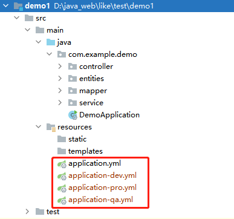
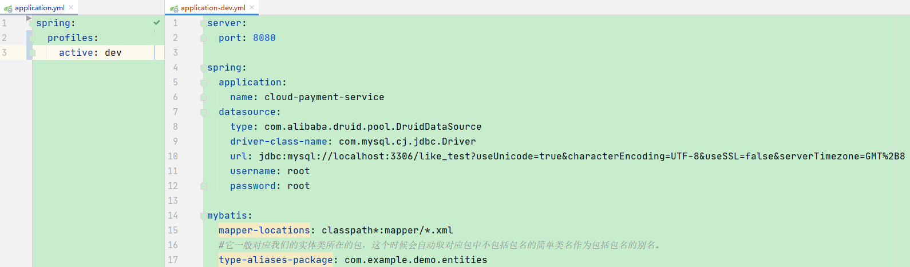
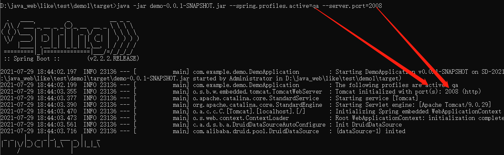
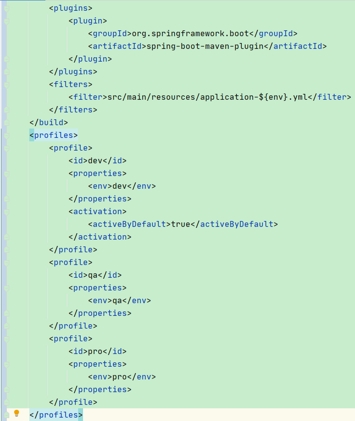
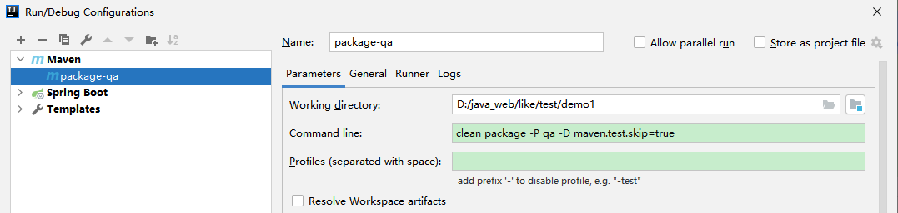
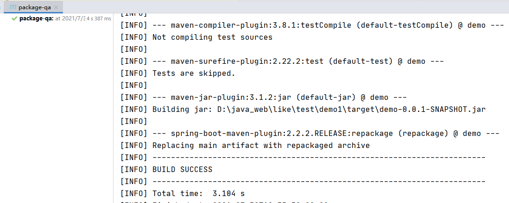
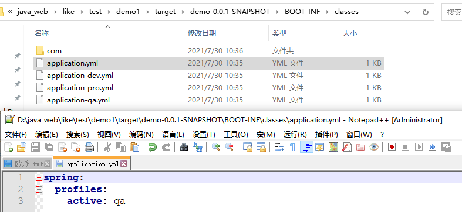
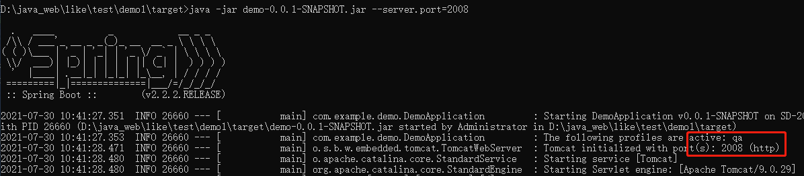

# 实现多个环境自动切换配置

# 一、环境介绍


正常来讲，一个软件的开发上线的流程大部分都是分为三个环境，依次是开发、测试、上线。


+  开发环境（dev)：  
开发环境是指的是咱们本地跑的环境。 
+  测试环境(qa)：  
一般是克隆一份生产环境的配置，qa即test。 
+  生产环境（prod）  
正式提供对外服务的，即是真实环境。 


# 二、部署时切换


## 新增yml文件


在application.yml文件的同级目录依次创建application-dev.yml，application-qa.yml，application-pro.yml这三个配置文件





## 配置各个yml文件


+  在application.yml中添加配置切换选项  
例如切换到dev环境的配置为： 

```yaml
spring:
  profiles:
    active: dev
```

 

+  依次在application-dev.yml，application-qa.yml，application-pro.yml配置相关信息。  
 


## 部署测试环境


部署测试环境，部署时切换到qa环境。


```plain
java -jar demo-0.0.1-SNAPSHOT.jar --spring.profiles.active=qa --server.port=2008
```





可以看到日志中显示的内容与预期一致，spring.profiles.active设置为qa, 端口设置为2008。


# 三、Maven控制打包时切换


## 设置项目对象模型pom.xml


+ 添加profiles到pom.xml中，profiles节点是和build同级的。


```xml
<profiles>
    <profile>
        <id>dev</id>
        <properties>
            <env>dev</env>
        </properties>
        <activation>
            <activeByDefault>true</activeByDefault>
        </activation>
    </profile>
    <profile>
        <id>qa</id>
        <properties>
            <env>qa</env>
        </properties>
    </profile>
    <profile>
        <id>pro</id>
        <properties>
            <env>pro</env>
        </properties>
    </profile>
</profiles>
```


`activation`表示的是可以用这样的命令来触发profile，`true`表示dev是默认的profile, 这样本地直接ide启动项目的时候就是连接的dev环境。


+  添加filters节点 

```xml
<filters>
    <filter>src/main/resources/application-${env}.yml</filter>
</filters>
```

 





## 更新application.yml


```yaml
spring:
  profiles:
    active: @env@
```


注意@env@中的env可以理解为一个变量,需要与pom.xml中设置的${env}对应上


## 添加Maven打包命令


```plain
clean package -P qa -D maven.test.skip=true
```





`-D maven.test.skip=true`不执行测试用例，也不编译测试用例类。


## 执行Maven命令





查看jar包的application.yml文件的spring.profiles.active，看Maven命令是否生效。





## 部署Tomcat


Maven打包时已经设置了qa环境，部署命令中不需要再指明qa环境。





> 更新: 2021-07-30 10:49:53  
> 原文: <https://www.yuque.com/like321/mdsi9b/aksunz>