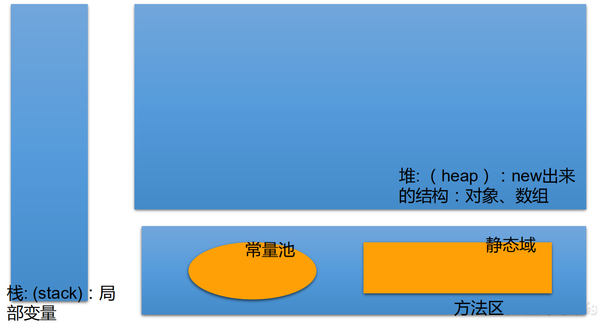
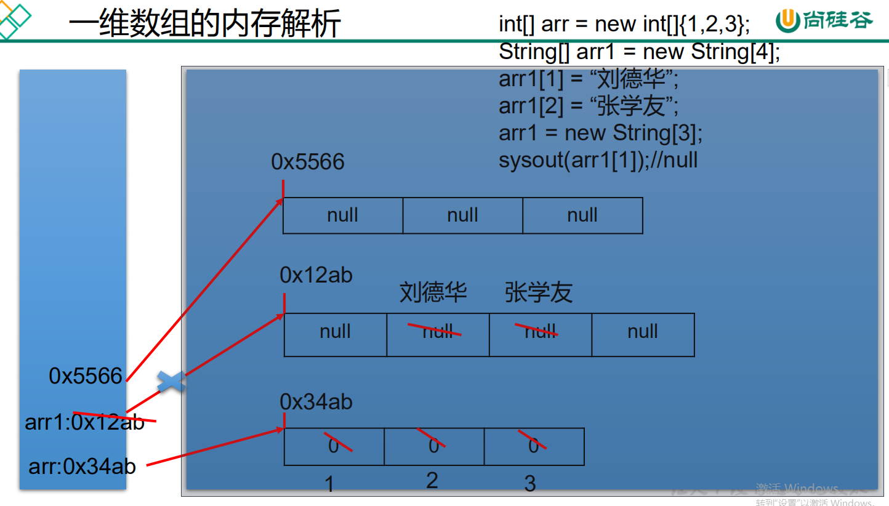
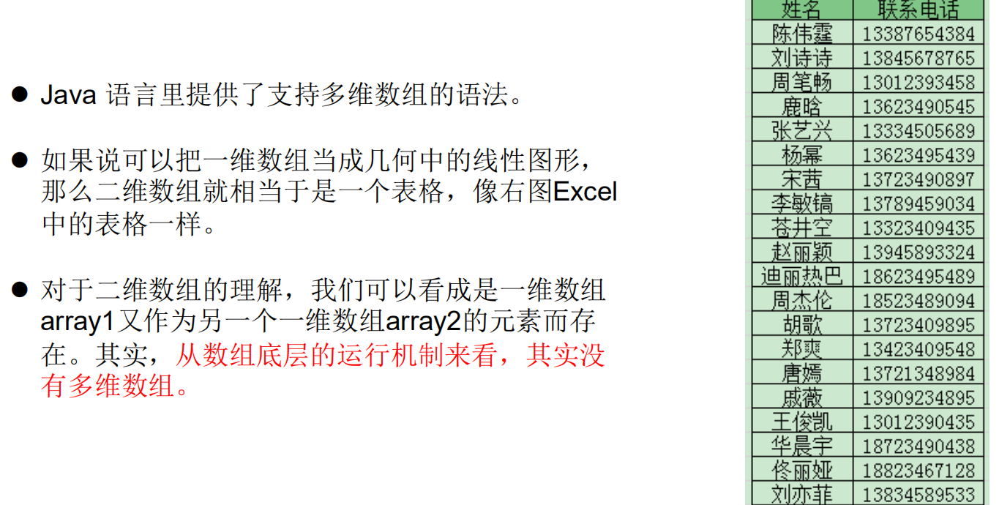
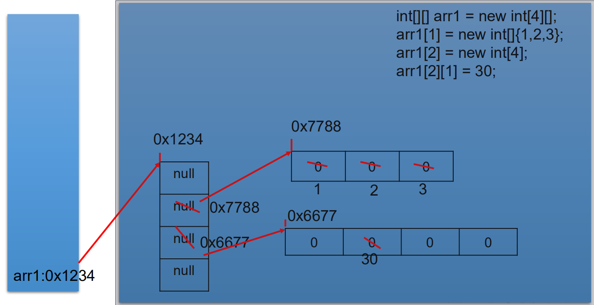
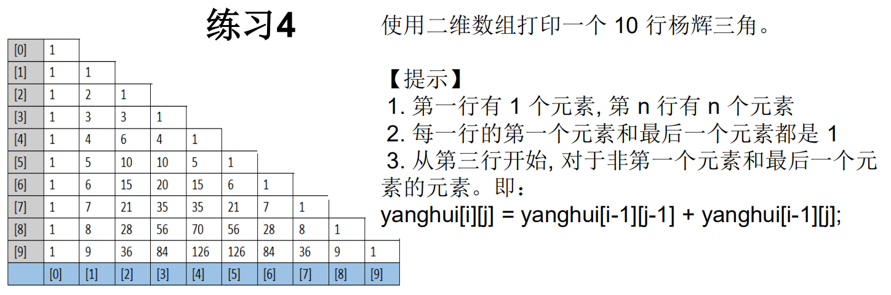
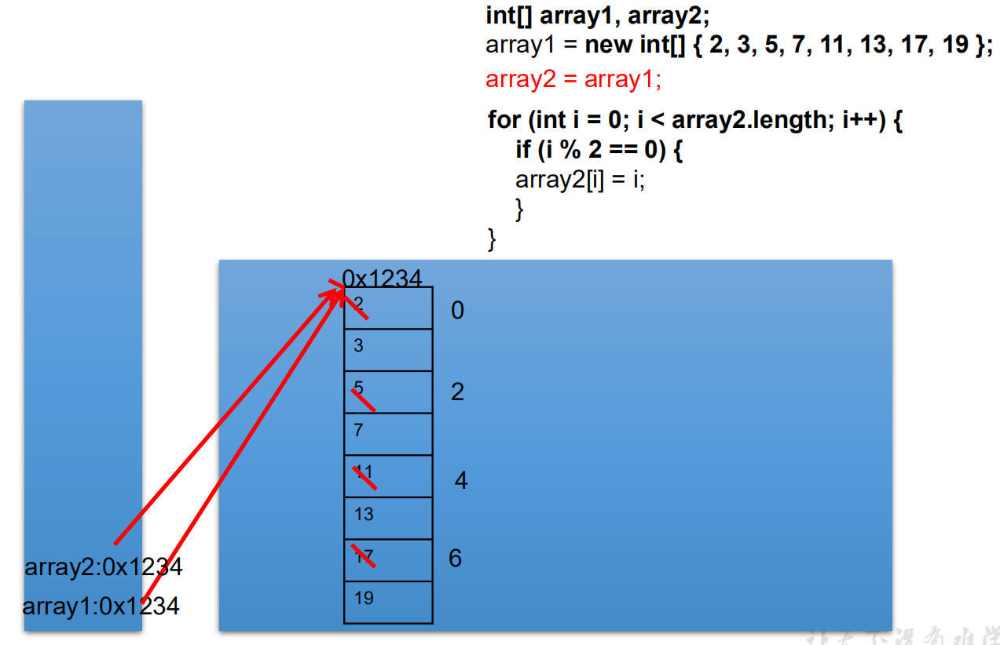
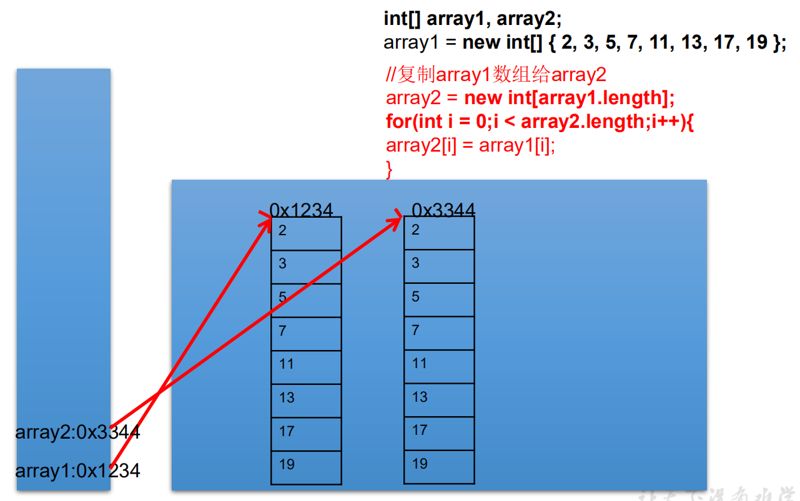
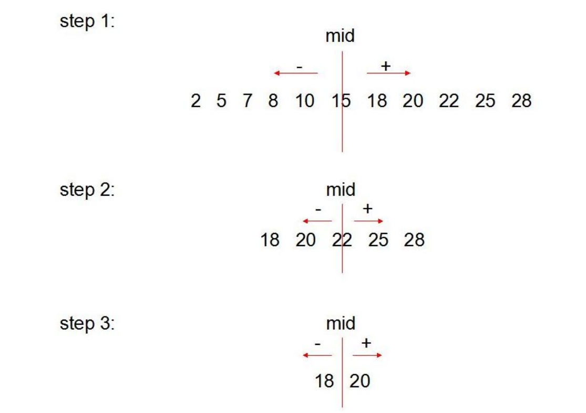
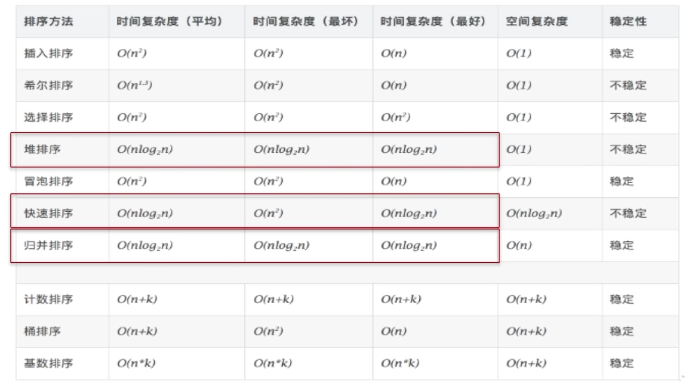

# 一、数组

# 一、数组


## 1、数组的概述


数组(Array)，是多个相同类型数据按一定顺序排列的集合，并使用一个名字命名，并通过编号的方式对这些数据进行统一管理。


常见概念：


> 数组名
>
>  
>
> 下标(或索引)
>
>  
>
> 元素
>
>  
>
> 数组的长度
>

---

+  数组本身是引用数据类型，而数组中的元素可以是**任何数据类型**，包括：基本数据类型和引用数据类型。 
+  创建数组对象会在内存中开辟一整块**连续的空间**，而数组名中引用的是 这块连续空间的首地址。 
+  数组的**长度一旦确定，就不能修改。** 
+  我们可以直接通过下标(或索引)的方式调用指定位置的元素，速度很快。 
+  数组的分类： 
    -  按照维度： 
        * 一维数组、
        * 二维数组、
        * 三维数组、…
    -  按照元素的数据类型分： 
        * 基本数据类型元素的数组、
        * 引用数据类型元素的数组（即对象数组）


## 2、一维数组


### 1、声明


+ 声明


```java
type var[] 
    或 
type[] var
```


例如：


```java
int a[];
int[] a1;
double b[];
String[] c; //引用类型变量数组
```


注意：


> Java语言中声明数组时不能指定其长度(数组中元素的数)， 例如： int a[5]; //非法
>


### 2、初始化


+ 静态初始化：	在定义数组的同时就为数组元素分配空间并赋值。


```java
int arr[] = new int[]{ 3, 9, 8};
或
int[] arr = {3,9,8};


String names[] = { “李四光”,“茅以升”,“华罗庚” }
```


+ 动态初始化：	数组声明且为数组元素分配空间与赋值的操作分开进行


```java
int[] arr = new int[3];

arr[0] = 3;
arr[1] = 9;
arr[2] = 8; 


String names[];
names = new String[3];
names[0] = “钱学森”;
names[1] = “邓稼先”;
names[2] = “袁隆平”;
```


### 3、引用


+  定义并用运算符**new**为之分配空间后，才可以引用数组中的每个元素 
+  数组元素的引用方式：数组名[数组元素下标] 
    -  数组元素下标可以是整型常量或整型表达式。如a[3] , b[i] , c[6*i]; 
    -  数组元素下标从0开始；长度为n的数组合法下标取值范围: 0 —>n-1；  
如int a[]=new int[3]; 可引用的数组元素为a[0]、a[1]、a[2] 
+  每个数组都有一个属性**length**指明它的长度，例如：a.length 指明数组**a**的长度(元素个数) 
    - 数组一旦初始化，其长度是不可变的


### 4、默认初始化值
| 数组元素类型 | 元素默认初始值 |
| --- | --- |
| byte | 0 |
| short | 0 |
| int | 0 |
| long | 0L |
| float | 0.0F |
| double | 0.0 |
| char | 0或写为：'\u0000'  （表现为空） |
| boolean | false |
| 引用类型 | null |


### 5、内存的简化结构





### 6、一维数组的内存解析





## 3、多维数组





### 1、声明和初始化


+ 动态初始化：格式一：


```java
int[][] arr = new int[3][2];
```


定义了名称为arr的二维数组


二维数组中有3个一维数组


每一个一维数组中有2个元素


一维数组的名称分别为arr[0], arr[1], arr[2]


给第一个一维数组1脚标位赋值为78写法是：


```java
arr[0][1] = 78;
```


+ 动态初始化：格式二：


```java
int[][] arr = new int[3][];
```


二维数组中有3个一维数组。


每个一维数组都是默认初始化值null (注意：区别于格式1）


可以对这个三个一维数组分别进行初始化


```java
arr[0] = new int[3];
arr[1] = new int[1];
arr[2] = new int[2]
```


+ 格式3（静态初始化）：


```java
int[][] arr = new int[][]{{3,8,2},{2,7},{9,0,1,6}};
```


定义一个名称为arr的二维数组，二维数组中有三个一维数组


每一个一维数组中具体元素也都已初始化


第一个一维数组 arr[0] = {3,8,2};


第二个一维数组 arr[1] = {2,7};


第三个一维数组 arr[2] = {9,0,1,6};


第三个一维数组的长度表示方式：arr[2].length;


> 注意特殊写法情况：int[] x,y[]; x是一维数组，y是二维数组。
>


> Java中多维数组不必都是规则矩阵形式
>


### 2、默认初始化值


+ 针对于初始化方式一：


```java
int[][] arr = new int[4][3];
```


> 外层元素的初始化值：地址值
>
>  
>
> 内层元素的初始化值：与一维数组初始化情况相同
>


+ 针对于初始化方式二：


```java
int[][] arr = new int[4][];
```


> 外层元素的初始化值：null（因为引用类型默认初始化值为null）
>
>  
>
> 内层元素的初始化值：空指针异常
>


### 3、二维数组的内存解析





!


```java
//1、声明并初始化二维数组
int[][] yangHui = new int[10][];

//2、给数组元素赋值
for(int i=0;i<yangHui.length;i++) {
    yangHui[i] = new int[i+1];
    //给首末元素赋值
    yangHui[i][0]=1;
    yangHui[i][i]=1;

    //给每行的非首末元素赋值
    //			if(i>1) {
    for(int j=1;j<yangHui[i].length-1;j++) {
        yangHui[i][j] = yangHui[i-1][j-1]+yangHui[i-1][j];
    }
    //			}
}
//3、遍历二维数组
for(int i=0;i<yangHui.length;i++) {
    for(int j=0;j<yangHui[i].length;j++) {
        System.out.print(yangHui[i][j]+" ");
    }
    System.out.println();
}
```


## 4、数组中涉及到的常见算法


1.  数组元素的赋值(杨辉三角、回形数等) 
2.  求数值型数组中元素的最大值、最小值、平均数、总和等 
3.  数组的复制、反转、查找(线性查找、二分法查找) 
4.  数组元素的排序算法 


### 1、数值型数组元素的操作


定义一个int型的一维数组，包含10个元素，分别赋一些随机整数，然后求出所有元素的最大值，最小值，和值，平均值，并输出出来。  
要求：**所有随机数都是两位数。**


```plain
[0,1) * 90 --> [0,90) + 10 --> [10,100) --> [10,99]
(int)(Math.random() * 90 + 10)
```


```java
int[] arr = new int[10];
for (int i = 0; i < arr.length; i++) {
    arr[i] = (int) (Math.random() * (99 - 10 + 1) + 10);
}

//求数组元素的最大值
int maxValue = arr[0];
for(int i =1;i<arr.length;i++) {
    if(maxValue<arr[i]) {
        maxValue = arr[i];
    }
}
System.out.println("最大值为："+maxValue);

//求数组元素的最小值
int minValue=arr[0];
for(int i=1;i<arr.length;i++) {
    if(minValue>arr[i]) {
        minValue = arr[i];
    }
}
System.out.println("最小值为："+minValue);

//求数组元素的总和
int sum = 0;
for(int i=0;i<arr.length;i++) {
    sum+=arr[i];
}
System.out.println("总和为："+sum);

//求数组元素的平均数
int avgValue =sum/arr.length;
```


### 2、数组的复制


+ 赋值


(1)创建一个名为ArrayTest的类，在main()方法中声明array1和array2两个变量，他们是int[]类型的数组。  
(2)使用大括号{}，把array1初始化为8个素数：2,3,5,7,11,13,17,19。  
(3)显示array1的内容。  
(4)赋值array2变量等于array1，修改array2中的偶索引元素，使其等于索引值(如array[0]=0,array[2]=2)。打印出array1。


```java
int[] arr1 ,arr2;

arr1 = new int[]{2,3,5,7,11,13,17,19};

for(int i=0;i<arr1.length;i++) {
    System.out.print(arr1[i]+"\t");
}

arr2 = arr1;
for(int i =0;i<arr2.length;i++) {
    if(i%2==0) {
        arr2[i]=i;
    }
}

System.out.println();
for(int i=0;i<arr1.length;i++) {
    System.out.print(arr1[i]+"\t");
}
```





+ 复制


```java
int[] arr1 ,arr2;

arr1 = new int[]{2,3,5,7,11,13,17,19};
for(int i=0;i<arr1.length;i++) {
    System.out.print(arr1[i]+"\t");
}

//区别于数组的赋值
arr2 = new int[arr1.length];
for(int i=0;i<arr2.length;i++) {
    arr2[i]=arr1[i];
}

for(int i =0;i<arr2.length;i++) {
    if(i%2==0) {
        arr2[i]=i;
    }
}
System.out.println();
for(int i=0;i<arr1.length;i++) {
    System.out.print(arr1[i]+"\t");
}
```





### 3、数组的反转


```java
String[] arr = new String[] { "JJ", "DD", "MM", "BB", "GG", "AA" };

// 方法一：
//		for(int i=0;i<arr.length/2;i++) {
//			String temp = arr[i];
//			arr[i] = arr[arr.length-i-1];
//			arr[arr.length-i-1] = temp;
//		}
//		

// 方法二：
for (int i = 0, j = arr.length - 1; i < j; i++, j--) {
    String temp = arr[i];
    arr[i] = arr[j];
    arr[j] = temp;
}

for (int i = 0; i < arr.length; i++) {
    System.out.print(arr[i] + "\t");
}
```


### 4、查找算法


+ 线性查找


```java
String[] arr = new String[] { "JJ", "DD", "MM", "BB", "GG", "AA" };

// 线性查找
String dest = "CC";
boolean isFlag = true;

for (int i = 0; i < arr.length; i++) {
    if (dest.equals(arr[i])) {
        System.out.println("找到了指定的元素，位置为：" + i);
        isFlag = false;
        break;
    }
}

if (isFlag) {
    System.out.print("没有找到");
}
```


+ 二分查找





```java
//二分法查找：所要查找的数组必须有序。
int[] arr = new int[] {-98,-34,2,34,54,66,79,105,210,333};

int dest = -38;
int head =0 ;//初始首索引
int end = arr.length-1;//初始末索引
boolean flag = true;

while(head<=end) {
    int middle = (head + end)/2;
    if(dest==arr[middle]) {
        System.out.println("找到了，索引位置为"+middle);
        flag = false;
        break;
    }else if(arr[middle]>dest){
        end = middle-1;
    }else {
        head = middle+1;
    }
}

if(flag) {
    System.out.println("没有找到");
}
```


## 5、排序算法


+ 排序：


假设含有n个记录的序列为{R1，R2，...,Rn},其相应的关键字序列为{K1，K2，...,Kn}。


将这些记录重新排序为{Ri1,Ri2,...,Rin},使得相应的关键字值满足条Ki1<=Ki2<=...<=Kin,这样的一种操作称为排序。


**通常来说，排序的目的是快速查找**


+ 衡量排序算法的优劣：


1. 时间复杂度：分析关键字的比较次数和记录的移动次数
2. 空间复杂度：分析排序算法中需要多少辅助内存
3. 稳定性：若两个记录A和B的关键字值相等，但排序后A、B的先后次序保持不变，则称这种排序算法是稳定的。


+ 排序算法分类：


内部排序：整个排序过程不需要借助于外部存储器（如磁盘等），所有排序操作都在内存中完成。


外部排序：参与排序的数据非常多，数据量非常大，计算机无法把整个排序过程放在内存中完成，必须借助于外部存储器（如磁盘）。


外部排序最常见的是多路归并排序。可以认为外部排序是由多次内部排序组成。


### 十大内部排序算法


+  选择排序 
    - 直接选择排序、
    - **堆排序**
+  交换排序 
+  **冒泡排序、** 
+  **快速排序** 
+  插入排序 
+  直接插入排序、 
+  折半插入排序、 
+  Shell排序（希尔） 
+  **归并排序** 
+  桶式排序 
+  基数排序 


### 算法的五大特征
| 输入（Input） | 有0个或多个输入数据，这些输入必须有清楚的描述和定义 |
| --- | --- |
| 输出（Output） | 至少有1个或多个输出结果，不可以没有输出结果 |
| 有穷性（有限性，Finiteness） | 算法在有限的步骤之后会自动结束而不会无限循环，并且每一个步骤可以在可接受的时间内完成 |
| 确定性（明确性，Definiteness） | 算法中的每一步都有确定的含义，不会出现二义性 |
| 可行性（有效性，Effectiveness） | 算法的每一步都是清楚且可行的，能让用户用纸笔计算而求出答案 |


说明：


满足确定性的算法也称为：确定性算法。


现在人们也关注更广泛的概念，例如考虑各种非确定性的算法，如并行算法、概率算法等。另外，人们也关注并不要求终止的计算描述，这种描述有时被称为过程（procedure）。


### 冒泡排序


介绍：


冒泡排序的原理非常简单，它重复地走访过要排序的数列，一次比较两个元素，如果他们的顺序错误就把他们交换过来。


排序思想：


1.  比较相邻的元素。如果第一个比第二个大（升序），就交换他们两个。 
2.  对每一对相邻元素作同样的工作，从开始第一对到结尾的最后一对。这步做完后，最后的元素会是最大的数。 
3.  针对所有的元素重复以上的步骤，除了最后一个。 
4.  持续每次对越来越少的元素重复上面的步骤，直到没有任何一对数字需要比较为止。 


```java
int[] arr = new int[] { 43, 32, 76, -98, 0, 64, 33, -21, 32, 99 };

for (int i = 0; i < arr.length - 1; i++) {

    for (int j = 0; j < arr.length - 1 - i; j++) {
        if (arr[j] > arr[j + 1]) {
            int temp = arr[j];
            arr[j] = arr[j + 1];
            arr[j + 1] = temp;
        }

    }

}

for (int i = 0; i < arr.length; i++) {
    System.out.print(arr[i]+"\t");
}
```


### 排序算法性能对比





+ 各种内部排序方法性能比较


1.  **从平均时间而言**：  
快速排序最佳。  
但在最坏情况下时间性能不如堆排序和归并排序。 
2.  **从算法简单性看**：  
由于直接选择排序、直接插入排序和冒泡排序的算法比较简单，将其认为是简单算法。  
对于Shell排序、堆排序、快速排序和归并排序算法，其算法比较复杂，认为是复杂排序。 
3.  **从稳定性看**：  
直接插入排序、冒泡排序和归并排序是稳定的；  
而直接选择排序、快速排序、 Shell排序和堆排序是不稳定排序 
4.  **从待排序的记录数n的大小看**，  
n较小时，宜采用简单排序；  
而n较大时宜采用改进排序 


+  **排序算法的选择** 
    1.  若n较小(如n≤50)，可采用**直接插入**或**直接选择排序**。  
当记录规模较小时，直接插入排序较好；  
否则因为直接选择移动的记录数少于直接插入，应选直接选择排序为宜。 
    2.  若文件初始状态基本有序(指正序)，  
则应选用**直接插入**、**冒泡**或随机的**快速排序**为宜； 
    3.  若n较大，则应采用时间复杂度为O(nlgn)的排序方法：  
**快速排序**、**堆排序**或**归并排序**。 


## 6、Arrays工具类


java.util.Arrays类即为操作数组的工具类，包含了用来操作数组（比如排序和搜索）的各种方法。

| boolean equals(int[] a,int[] b) | 判断两个数组是否相等 |
| --- | --- |
| String toString(int[] a) | 输出数组信息 |
| void fill(int[] a,int val) | 将指定值填充到数组之中 |
| void sort(int[] a) | 对数组进行排序 |
| int binarySearch(int[] a,int key) | 对排序后的数组进行二分法检索指定的值 |


### 数组排序


java.util.Arrays类的sort()方法提供了数组元素排序功能：


```java
int[] arr = new int[] {1,3,2,4};

Arrays.sort(arr);

System.out.println(Arrays.toString(arr));
```


## 7、数组常见异常


### 数组脚标越界异常(ArrayIndexOutOfBoundsException)


访问到了数组中的不存在的脚标时发生


```java
int[] arr = new int[] { 1, 2, 3, 4, 5 };

for (int i = 0; i <= arr.length; i++) {
    System.out.println(arr[i]);
}
```


### 空指针异常：NullPointerException


arr引用没有指向实体，却在操作实体中的元素时


```java
// 情况一：
int[] arr1 = new int[] { 1, 2, 3 };
arr1 = null;
System.out.println(arr1[0]);

// 情况二：
int[][] arr2 = new int[4][];
System.out.println(arr2[0][0]);

// 情况三：
String[] arr3 = new String[] { "AA", "BB", "CC" };
arr3[0] = null;
System.out.println(arr3[0].toString());
```


> 更新: 2022-08-04 16:07:32  
> 原文: <https://www.yuque.com/like321/javase/py29gq>