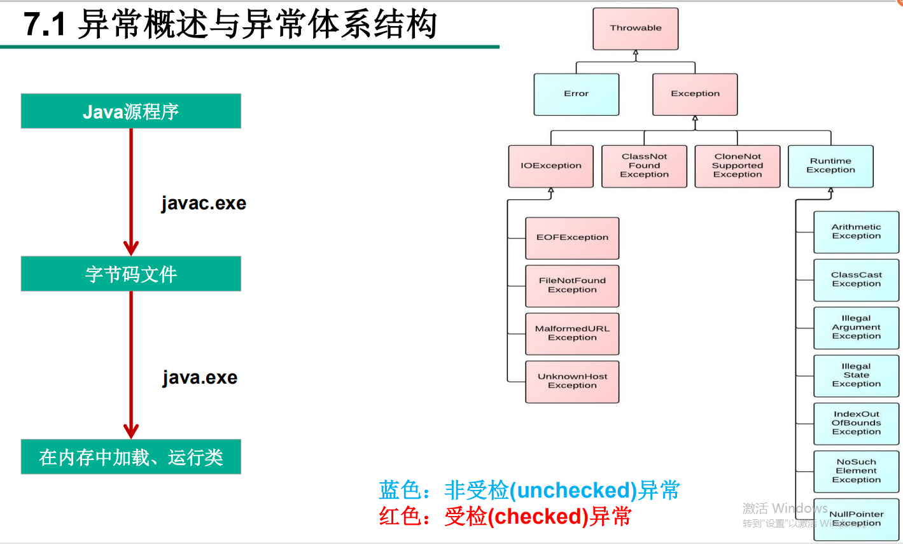
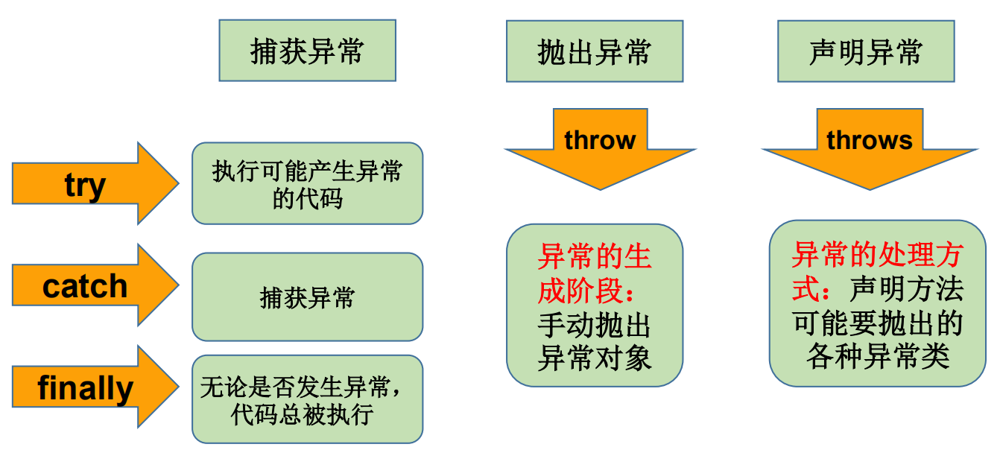

# 三、异常

# 一、异常


+  异常：在Java语言中，将程序执行中发生的不正常情况称为“异常”。 (开发过程中的语法错误和逻辑错误不是异常) 
+  Java程序在执行过程中所发生的异常事件可分为两类： 
    -  Error：Java虚拟机无法解决的严重问题。如：JVM系统内部错误、资源耗尽等严重情况。比如：StackOverflowError和OOM。一般不编写针对性的代码进行处理。 
    -  Exception: 其它因编程错误或偶然的外在因素导致的一般性问题，可以使用针对性的代码进行处理。  
例如：  
空指针访问  
试图读取不存在的文件  
网络连接中断  
数组角标越界 
+  对于这些错误，一般有两种解决方法： 
    - 一是遇到错误就终止程序的运行。
    - 另一种方法是由程序员在编写程序时，就考虑到错误的检测、错误消息的提示，以及错误的处理。


## 异常分类


+ 捕获错误最理想的是 
    - 在编译期间，
    - 但有的错误只有在运行时才会发生。  
比如：除数为0，数组下标越界等





### 编译时异常


+  是指编译器要求必须处置的异常。即程序在运行时由于外界因素造成的一般性异常。  
编译器要求Java程序必须捕获或声明所有编译时异常。 
+  对于这类异常，如果程序不处理，可能会带来意想不到的结果。 


### 运行时异常


+ 是指编译器不要求强制处置的异常。一般是指编程时的逻辑错误，是程序员应该积极避免其出现的异常。java.lang.RuntimeException类及它的子类都是运行时异常。
+ 对于这类异常，可以不作处理，因为这类异常很普遍，若全处理可能会对程序的可读性和运行效率产生影响。
+ java.lang.RuntimeException
+ ClassCastException
+ ArrayIndexOutOfBoundsException
+ NullPointerException
+ ArithmeticException
+ NumberFormatException
+ InputMismatchException


ArrayIndexOutOfBoundsException


```java
public class IndexOutExp {
	public static void main(String[] args) {
		String friends[] = { "lisa", "bily", "kessy" };
		for (int i = 0; i < 5; i++) {
			System.out.println(friends[i]); // friends[4]?
		}
		System.out.println("\nthis is the end");
	}
}
```


NullPointerException


```java
public class NullRef {
	int i = 1;

	public static void main(String[] args) {
		NullRef t = new NullRef();
		t = null;
		System.out.println(t.i);
	}
}
```


ArithmeticException


```java
public class DivideZero {
	int x;

	public static void main(String[] args) {
		int y;
		DivideZero c = new DivideZero();
		y = 3 / c.x;
		System.out.println("program ends ok!");
	}
}
```


ClassCastException


```java
public class Order {
	public static void main(String[] args) {
		Object obj = new Date();
		Order order = (Order) obj;
		System.out.println(order);
	}
}
```


## 异常处理机制


在编写程序时，经常要在可能出现错误的地方加上检测的代码，


如进行x/y运算时，要检测分母为0，数据为空，输入的不是数据而是字符等。


过多的if-else分支会导致程序的代码加长、臃肿，可读性差。因此采用异常处理机制。


+  Java异常处理  
Java采用的异常处理机制，是将异常处理的程序代码集中在一起，与正常的程序代码分开，使得程序简洁、优雅，并易于维护。 


### 机制一：try-catch-finally


+  Java提供的是异常处理的**抓抛模型。 ** 
+  Java程序的执行过程中如出现异常，会生成一个**异常类对象**，该异常对象将被提交给Java运行时系统，这个过程称为**抛出(throw)异常**。 
+  异常对象的生成 
    - 由虚拟机自动生成：程序运行过程中，虚拟机检测到程序发生了问题，如果在当前代码中没有找到相应的处理程序，就会在后台自动创建一个对应异常类的实例对象并抛出——自动抛出
    - 由开发人员**手动创建**：Exception exception = new ClassCastException();——创建好的异常对象不抛出对程序没有任何影响，和创建一个普通对象一样
+  如果一个方法内抛出异常，该异常对象会被抛给调用者方法中处理。如果异常没有在调用者方法中处理，它继续被抛给这个调用方法的上层方法。这个过程将一直继续下去，直到异常被处理。  
这一过程称为**捕获(catch)异常**。  
+  如果一个异常回到main()方法，并且main()也不处理，则程序运行终止。 
+  程序员通常只能处理Exception，而对Error无能为力。 


```java
try{
    ...... //可能产生异常的代码
}
catch( ExceptionName1 e ){
    ...... //当产生ExceptionName1型异常时的处置措施
}
catch( ExceptionName2 e ){
    ...... //当产生ExceptionName2型异常时的处置措施
}[ finally{
    ...... //无论是否发生异常，都无条件执行的语句
} ]
```


+  try  
捕获异常的第一步是用try{…}语句块选定捕获异常的范围，将可能出现异常的代码放在try语句块中。 
+  catch (Exceptiontype e)  
在catch语句块中是对异常对象进行处理的代码。每个try语句块可以伴随一个或多个catch语句，用于处理可能产生的不同类型的异常对象。 
    - 捕获异常的有关信息：与其它对象一样，可以访问一个异常对象的成员变量或调用它的方法 
        * getMessage() 获取异常信息，返回字符串
        * printStackTrace() 获取异常类名和异常信息，以及异常出现在程序中的位置。返回值void。
+  finally 
    - 捕获异常的最后一步是通过finally语句为异常处理提供一个统一的出口，使得在控制流转到程序的其它部分以前，能够对程序的状态作统一的管理。
    - 不论在try代码块中是否发生了异常事件，catch语句是否执行，catch语句是否有异常，catch语句中是否有return，  
finally块中的语句都会被执行。
    - finally语句和catch语句是任选的


```java
public static void main(String[] args) {
    String friends[] = { "lisa", "bily", "kessy" };
    try {
        for (int i = 0; i < 5; i++) {
            System.out.println(friends[i]);
        }
    } catch (ArrayIndexOutOfBoundsException e) {
        System.out.println("index err");
    }
    System.out.println("\nthis is the end");
}
```


### 编译时异常和运行时异常的不同处理


+  前面使用的异常都是RuntimeException类或是它的子类，  
这些类的异常的特点是：即使没有使用try和catch捕获，Java自己也能捕获，并且编译通过( 但运行时会发生异常使得程序运行终止 )。 
+  如果抛出的异常是IOException等类型的非运行时异常，则必须捕获，否则编译错误。  
也就是说，我们必须处理编译时异常，将异常进行捕捉，转化为运行时异常 


### 机制二：throws+异常类型


+ 声明抛出异常是Java中处理异常的第二种方式 
    - 如果一个方法(中的语句执行时)可能生成某种异常，但是并不能确定如何处理这种异常，则此方法应**显式地**声明抛出异常，表明该方法将不对这些异常进行处理，而由该方法的**调用者**负责处理。
    - 在方法声明中用**throws**语句可以声明抛出异常的列表，throws后面的异常类型可以是方法中产生的异常类型，也可以是它的父类。


```java
public void readFile(String file) throws FileNotFoundException {
    ……
        // 读文件的操作可能产生FileNotFoundException类型的异常
        FileInputStream fis = new FileInputStream(file);
    ……
}
```


### 重写方法声明抛出异常的原则


+  子类重写的方法抛出的异常类型不大于父类被重写的方法抛出的异常类型  
在多态的情况下， 对method()方法的调用---异常的捕获按父类声明的异常处理。 


```java
public class OverrideTest {

	public static void main(String[] args) {
		OverrideTest test = new OverrideTest();
		test.display(new subclass());
	}

	public void display(SuperClass s) {
		try {
			s.method();
		} catch (IOException e) {
			// TODO Auto-generated catch block
			e.printStackTrace();
		}
	}
}

class SuperClass {
	public void method() throws IOException {

	}
}

class subclass extends SuperClass {
	public void method() throws FileNotFoundException {

	}
}
```


### 开发中选择哪种方式处理异常


+  如果父类中被重写的方法没有throws方式处理异常，则子类重写的方法也不能使用throws，  
意味着子类重写的方法有异常，必须使用try-catch-finally方式处理 
+  执行的方法a中，先后又调用了另外的几个方法，这几个方法是递进关系执行的。  
建议这几个方法使用throws的方式进行处理。  
而执行的方法a可以考虑使用try-catch-finally方式进行处理 


### 手动抛出异常 throw


+ Java异常类对象除在程序执行过程中出现异常时由系统自动生成并抛出，也可根据需要使用人工创建并抛出。 
    -  首先要生成异常类对象，然后通过throw语句实现抛出操作(提交给Java运行环境)。  
IOException e = new IOException();  
throw e; 
    -  可以抛出的异常必须是Throwable或其子类的实例。下面的语句在编译时将会产生语法错误：  
throw new String("want to throw"); 


```java
public class StudentTest {

    public static void main(String[] args) {
        try {
            Student s = new Student();
            s.regist(-1001);
            System.out.println(s);
        }catch(Exception e) {
            System.out.println(e.getMessage());
        }
    }

}


class Student{

    private int id;

    public void regist(int id) {
        if(id>0) {
            this.id = id;
        }else {
            //手动抛出异常对象
            throw new RuntimeException("您输入的数据非法！");
        }
    } 

}
```


### 用户自定义异常类


1、用户自己的异常类**必须继承**于现有的异常结构：RuntimeException、Exception


2、提供全局常量：serialVersionUID


3、提供重载构造器


用户自定义异常类MyException，用于描述数据取值范围错误信息。


```java
public class MyException extends RuntimeException {

	static final long serialVersionUID = 13465653435L;
    
	private int idnumber;

	public MyException(String message, int id) {
		super(message);
		this.idnumber = id;
	}

	public int getId() {
		return idnumber;
	}
}
```


## 异常处理5个关键字





> 更新: 2022-08-31 08:47:32  
> 原文: <https://www.yuque.com/like321/javase/zspmlu>