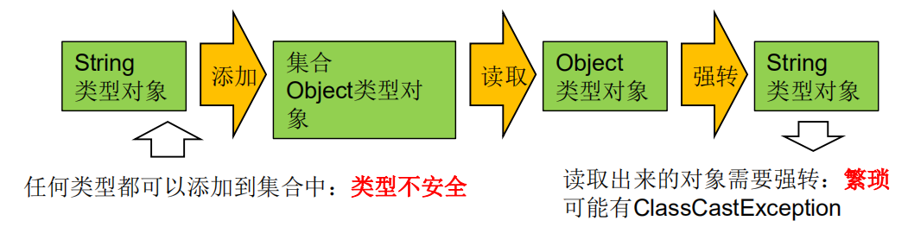
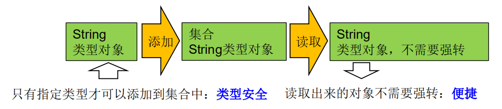

# 九、泛型

# 一、为什么要有泛型


## 泛型的设计背景


集合容器类在设计阶段/声明阶段不能确定这个容器到底实际存的是什么类型的对象，所以<font style="color:#DF2A3F;">在JDK1.5之前只能把元素类型设计为Object，JDK1.5之后使用泛型来解决。</font>


因为这个时候除了元素的类型不确定，其他的部分是确定的，例如关于这个元素如何保存，如何管理等是确定的，因此此时<font style="color:#DF2A3F;">把元素的类型设计成一个参数，这个类型参数叫做泛型。</font>Collection<E>，List<E>，ArrayList<E> 这个<E>就是类型参数，即泛型。


## <font style="color:rgb(0,0,0);">泛型的概念</font>
+ <font style="color:#DF2A3F;">所谓泛型，就是允许在定义类、接口时通过一个标识表示类中某个属性的类型或者是某个方法的返回值及参数类型。这个类型参数将在使用时（例如，继承或实现这个接口，用这个类型声明变量、创建对象时）确定（即传入实际的类型参数，也称为类型实参）。 </font>
+ 从JDK1.5以后，Java引入了“参数化类型（Parameterized type）”的概念，允许我们在创建集合时再指定集合元素的类型，正如：List<String>，这表明该List只能保存字符串类型的对象。 
+ JDK1.5改写了集合框架中的全部接口和类，为这些接口、类增加了泛型支持，从而可以在声明集合变量、创建集合对象时传入类型实参。 


## 在集合中没有泛型时





```java
//在集合中使用泛型之前的情况：
@Test
public void test1(){
    ArrayList list = new ArrayList();
    //需求：存放学生的成绩
    list.add(78);
    list.add(76);
    list.add(89);
    list.add(88);

    //问题一：类型不安全
    list.add("Tom");


    for (Object score : list) {
        //问题二：强转时，可能出现classCashException
        int stuScore = (int) score;
        System.out.println(stuScore);
    }
}
```


## 在集合中有泛型时


Java泛型可以保证如果程序在编译时没有发出警告，运行时就不会产生ClassCastException异常。同时，代码更加简洁、健壮。




<font style="color:#DF2A3F;">Java泛型可以保证如果程序在编译时没有发出警告，运行时就不会产生ClassCastException异常。同时，代码更加简洁、健壮。</font>


# 二、在集合中使用泛型


+ 集合接口和集合类在jdk5.0时都修改为带泛型的结构。
+ 在实例化集合类时，可以指明具体的泛型类型
+ 指明完以后，在集合类或接口中凡是定义类或接口时，内部结构（比如：方法、构造器、属性等）使用到类的泛型的位置，都指定为实例化时的泛型类型。 
    - 比如：add(E e) ---> 实例化以后：add(Integer e)
+ 注意点：泛型的类型必须是类，不能是基本数据类型。需要用到基本数据类型的位置，拿包装类替换
+  

```plain
 如果实例化时，没有指明泛型的类型，默认类型为java.lang.Object类型。
```

 


## 以ArrayList为例


```java
    @Test
    public void test2() {
        ArrayList<Integer> list = new ArrayList<>();

        list.add(78);
        list.add(76);
        list.add(89);
        list.add(88);

        //编译时，就会进行类型检查，保证数据的安全
//        list.add("Tom");

        //方式一：
//        for (Integer score : list) {
//            //避免了强转操作
//            System.out.println(score);
//        }

        //方式二：
        Iterator<Integer> iterator = list.iterator();
        while (iterator.hasNext()) {
            Integer next = iterator.next();
            System.out.println(next);
        }

    }
```


## 以HashMap为例


```java
    @Test
    public void test3() {
        Map<String, Integer> map = new HashMap<>();

        map.put("Tom", 87);
        map.put("Jerry", 55);
        map.put("jack", 67);

//        map.put(123,"abc");

        //泛型的嵌套
        Set<Map.Entry<String, Integer>> entries = map.entrySet();

        Iterator<Map.Entry<String, Integer>> iterator = entries.iterator();
        while (iterator.hasNext()) {
            Map.Entry<String, Integer> next = iterator.next();
            String key = next.getKey();
            Integer value = next.getValue();
            System.out.println(key + "---" + value);
        }

    }
```


# 三、自定义泛型结构


## 自定义泛型类


1.  泛型类可能有多个参数，此时应将多个参数一起放在尖括号内。比如：<E1,E2,E3> 
2.  泛型类的构造器如下：public GenericClass(){}。  
而下面是错误的：public GenericClass<E>(){} 
3.  实例化后，操作原来泛型位置的结构必须与指定的泛型类型一致。 
4.  泛型不同的引用不能相互赋值。 
    1. 尽管在编译时ArrayList<String>和ArrayList<Integer>是两种类型，但是，在运行时只有 一个ArrayList被加载到JVM中。
5. 泛型如果不指定，将被擦除，泛型对应的类型均按照Object处理，但不等价于Object。
    1. 经验：泛型要使用一路都用。要不用，一路都不要用。
6.  如果泛型结构是一个接口或抽象类，则不可创建泛型类的对象。 
7.  jdk1.7，泛型的简化操作：ArrayList<Fruit> flist = new ArrayList<>(); 
8.  泛型的指定中不能使用基本数据类型，可以使用包装类替换。 
9.  在类/接口上声明的泛型，在本类或本接口中即代表某种类型，可以作为非静态属性的类型、非静态方法的参数类型、非静态方法的返回值类型。 但在<font style="color:#DF2A3F;">静态方法中不能使用类的泛型。</font>
10.  异常类不能是泛型的 
11.  不能使用new E[]。  
但是可以：E[] elements = (E[])new Object[capacity];  
参考：ArrayList源码中声明：Object[] elementData，而非泛型参数类型数组。 

12.父类有泛型，子类可以选择保留泛型也可以选择指定泛型类型：

+ 子类不保留父类的泛型：按需实现 
    - 没有类型 擦除
    - 具体类型
+ 子类保留父类的泛型：泛型子类 
    - 全部保留
    - 部分保留
+ <font style="color:rgb(0,0,0);">结论：子类必须是“富二代”，子类除了指定或保留父类的泛型，还可以增加自己的泛型</font>


```java
public class Order<T> {

    String orderName;
    int orderId;

    //类的内部结构就可以使用类的泛型
    T orderT;

    public Order() {

    }

    public Order(String orderName, int orderId, T orderT) {
        this.orderName = orderName;
        this.orderId = orderId;
        this.orderT = orderT;
    }

    public T getOrderT() {
        return orderT;
    }

    public void setOrderT(T orderT) {
        this.orderT = orderT;
    }

    @Override
    public String toString() {
        return "Order{" +
                "orderName='" + orderName + '\'' +
                ", orderId=" + orderId +
                ", orderT=" + orderT +
                '}';
    }
}
```


```java
@Test
public void test1() {
    //如果定义了泛型类，实例化没有指明类的泛型，则认为此泛型类型为Object类型
    //要求：如果大家定义类类是带泛型的，建议在实例化时要指明类的泛型。
    Order order = new Order();
    order.setOrderT(123);
    order.setOrderT("ABC");

    //建议：实例化时指明类的泛型
    Order<String> order1 = new Order<>("orderAA", 1001, "order:AA");
    order1.setOrderT("AA:hello");
}
```


情况一：


```java
public class SubOrder extends Order<Integer>{ //SubOrder：不是泛型类

}
```


情况二：


```java
public class SubOrder1<T> extends Order<T>{ //SubOrder1<T>：仍然是泛型类

}
```


```java
@Test
public void test2(){
    SubOrder sub1 = new SubOrder();
    //由于子类在继承带泛型的父类时，指明了泛型类型。则实例化子类对象时，不再需要指明泛型。
    sub1.setOrderT(1212);
    
    ////////////////////////////////////

    SubOrder1<String> sub2 = new SubOrder1<>();
    sub2.setOrderT("order2...");
}
```


## 自定义泛型接口


## 自定义泛型方法


+  方法，也可以被泛型化，不管此时定义在其中的类是不是泛型类。在泛型方法中可以定义泛型参数，此时，参数的类型就是传入数据的类型。 
+  泛型方法的格式： 

```plain
[访问权限] <泛型> 返回类型 方法名([泛型标识 参数名称]) 抛出的异常
```

 

+  泛型方法声明泛型时也可以指定上限 


```java
//泛型方法：在方法中出现了泛型的结构，泛型参数与类的泛型参数没有任何关系。
//换句话说，泛型方法所属的类是不是泛型类都没有关系
//泛型方法，可以声明为静态的。原因：泛型参数是在调用方法时确定的。并非在实例化类时确定。
public <E> List<E> copyFromArrayToList(E[] arr) {
    ArrayList<E> list = new ArrayList<>();
    for (E e : list) {
        list.add(e);
    }
    return list;
}
```


```java
//测试泛型方法
@Test
public void test4() {
    Order<String> order = new Order<>();
    Integer[] arr = new Integer[]{1, 2, 3, 4};
    //泛型方法在调用时，指明泛型参数的类型
    List<Integer> integers = order.copyFromArrayToList(arr);

    System.out.println(integers);
}
```


# 四、泛型在继承上的体现


类A是类B的父类，G 和 G** 二者不具备子父类关系，二者是并列关系。**


```java
	@Test
    public void test1() {

        Object obj = null;
        String str = null;

        obj = str;

        Object[] arr1 = null;
        String[] arr2 = null;
        arr1 = arr2;

        List<Object> list1 = null;
        List<String> list2 = new ArrayList<>();
        // 此时的list1和list2的类型不具有子父类关系
        //编译不通过
//        list1 = list2;

        /**
         * 反证法：
         * 假设list1 = list2;
         * list1.add(123); 导致list2混入非String的数据。出错
         */
    }
```


类A是类B的父类，A 和 B 的父类


```java
public void test2() {
    List<String> list1 = null;
    ArrayList<String> list2 = null;

    list1 = list2;
}
```


# 五、通配符的使用


1.  使用类型**<font style="color:#DF2A3F;">通配符：？</font>**  
比如：List<?>，Map<?,?>  
List<?>是List<String>、List<Object><font style="color:rgb(0,0,0);">等各种泛型List的父类。</font> 
2.  **<font style="color:#DF2A3F;">读取</font>**List<?>的对象list中的元素时，永远是安全的，因为不管list的真实类型是什么，它包含的都是Object。 
3. <font style="color:#DF2A3F;"> </font>**<font style="color:#DF2A3F;">写入</font>**list中的元素时，不行。因为我们不知道c的元素类型，我们不能向其中添加对象。 
    - 唯一的例外是null，它是所有类型的成员。


```java
  //类A是类B的父类，G<A>和G<B>是没有关系的，二者共同的父类是：G<?>
    @Test
    public void test3() {
        List<Object> list1 = null;
        List<String> list2 = null;

        List<?> list = null;
        list = list1;
        list = list2;

        print(list1);
        print(list2);


        List<String> list3 = new ArrayList<>();
        list3.add("AA");
        list3.add("BB");
        list3.add("CC");
        list = list3;
        //添加(写入)：对于List<?>就不能向其内部添加数据。
        //除了添加null之外
//        list.add("DD");
//        list.add('?');
        list.add(null);


        //获取(读取)：允许读取数据，读取的数据类型为Object。
        Object o = list.get(0);
        System.out.println(o);


    }
```


```java
public void print(List<?> list) {
    Iterator<?> iterator = list.iterator();
    while (iterator.hasNext()) {
        Object next = iterator.next();
        System.out.println(next);
    }
}
```


## 有限制的通配符


+  **<?>** 
    - 允许所有泛型的引用调用
+  通配符指定上限 
    - 上限extends：使用时指定的类型必须是继承某个类，或者实现某个接口，即<=
+  通配符指定下限 
    - 下限super：使用时指定的类型不能小于操作的类，即>=
+  举例： 
    - **<? extends Number> (****无穷小** **, Number]**		只允许泛型为Number及Number子类的引用调用
    - **<? super Number> [Number ,** **无穷大****)**            只允许泛型为Number及Number父类的引用调用
    - **<? extends Comparable>**    只允许泛型为实现Comparable接口的实现类的引用调用


```java
    /**
     * 有限制条件的通配符的使用：
     *  ? extends A :
     *      G<? extends A> 可以作为G<A>和G<B>的父类，其中B是A的子类
     *
     *  ? super A :
     *      G<? super A> 可以作为G<A>和G<B>的父类，其中B是A的父类
     */
    @Test
    public void test4(){
        List<? extends Person> list1 = null;
        List<? super Person> list2 = null;

        List<Student> list3 = null;
        List<Person> list4 = null;
        List<Object> list5 = null;

        list1 = list3;
        list1 = list4;
//        list1 = list5;

//        list2 = list3;
        list2 = list4;
        list2 = list5;

    }
```


> 更新: 2023-06-12 15:46:50  
> 原文: <https://www.yuque.com/like321/javase/gw8k2o>