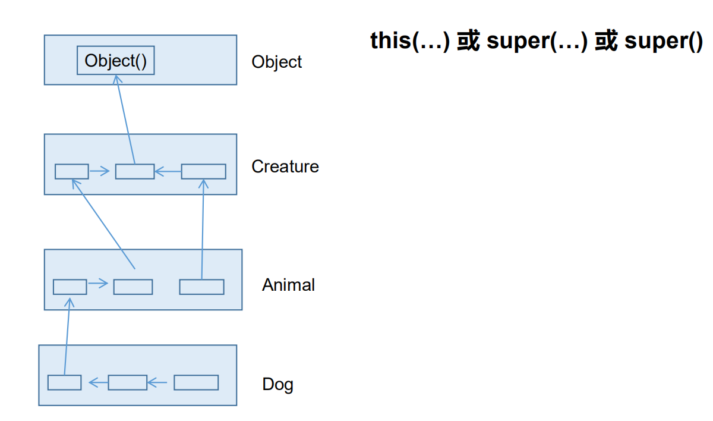
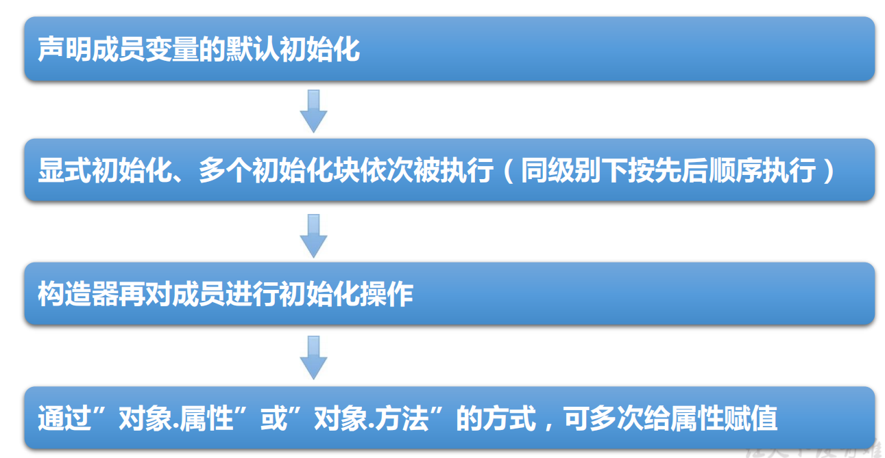
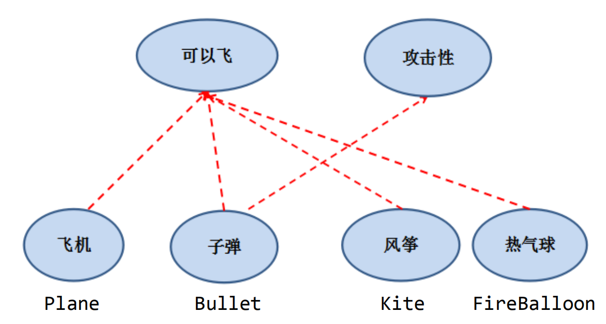

# 二、对象

# 一、面向过程与面向对象


面向对象：Object Oriented Programming  
面向过程：Procedure Oriented Programming


+  面向过程(POP) 与 面向对象(OOP) 

> 二者都是一种思想，面向对象是相对于面向过程而言的。
>
>  
>
>  
>

> 面向过程，**强调的是功能行为，以函数为最小单位，考虑怎么做。**
>
>  
>
> 面向对象，将功能封装进对象，**强调具备了功能的对象，以类/对象为最小单位，考虑谁来做。**
>

  

+  面向对象的三大特征 


> 封装 (Encapsulation)
>
>  
>
> 继承 (Inheritance)
>
>  
>
> 多态 (Polymorphism)
>


## 1、思想概述


+  程序员从面向过程的**执行者**转化成了面向对象的**指挥者** 
+  面向对象分析方法分析问题的思路和步骤： 
    - 根据问题需要，选择问题所针对的**现实世界中的实体。**
    - 从实体中寻找解决问题相关的属性和功能，这些属性和功能就形成了**概念世界中的类。**
    - 把抽象的实体用计算机语言进行描述，**形成计算机世界中类的定义。**即借助某种程序语言，把类构造成计算机能够识别和处理的数据结构。
    - 将**类实例化成计算机世界中的对象。**对象是计算机世界中解决问题的最终工具。


## 2、类和对象


+ 类(Class)和对象(Object)是面向对象的核心概念。 
    - 类是对一类事物的描述，是**抽象的**、概念上的定义
    - 对象是**实际存在**的该类事物的每个个体，因而也称为**实例**(instance)。
+ “万事万物皆对象”


### 属性和方法


```java
class Person{
	
	//属性
	String name;
	int age;
	boolean isMale;
	
	//方法
	public void eat() {
		System.out.println("人可以吃饭");
	}
	
	public void sleep() {
		System.out.println("人可以睡觉");
	}
	
	public void talk(String language) {
		System.out.println("人可以说话，使用的是"+language);
	}
	
}
```


## 3、对象的创建和使用


```java
//创建Person类的对象
Person p1 = new Person();

//调用属性：“对象.属性”
p1.name = "Tom";
p1.isMale = true;
System.out.println(p1.name);

//调用方法：“对象.方法”
p1.eat();
p1.sleep();
p1.talk("chinese");
```


### 1、类的多个对象的关系


如果创建了一个类的多个对象，则每个对象都独立的拥有一套类的属性。（非static的）


意味着：如果修改一个对象的属性a，则不影响另外一个对象属性a的值


```java
//创建Person类的对象
Person p1 = new Person();

//调用属性：“对象.属性”
p1.name = "Tom";
p1.isMale = true;
System.out.println(p1.name);


Person p2 = new Person();
System.out.println(p2.name); //null
System.out.println(p2.isMale); //false
```


### 2、内存解析


对象的内存解析：


## 4、属性


### 格式


```plain
修饰符 数据类型 属性名 = 初始化值 ;
```


**修饰符**


> 常用的权限修饰符有：private、缺省、protected、public
>
>  
>
> 其他修饰符：static、final
>


**数据类型**


> 任何基本数据类型(如int、Boolean)
>


**属性名**


> 属于标识符，符合命名规则和规范即可
>
>  
>
> 或 任何引用数据类型。
>


```java
public class Person{
    private int age; //声明private变量 age
    public String name = “Lila”; //声明public变量 name
}
```


### 变量分类


**成员变量（属性）和局部变量的区别？**

| | 成员变量 | 局部变量 |
| --- | --- | --- |
| 声明的位置 | 直接声明在类中 | 方法形参或内部、代码块内、构造器内等 |
| 修饰符 | private/public/static/final等 | 不能用权限修饰符修饰，可以用final修饰 |
| 初始化值 | 有默认初始值 | 没有默认初始化值，必须显式赋值，方可使用 |
| 内存加载位置 | 堆空间、静态域内 | 栈空间内 |


### 默认初始化赋值


当一个对象被创建时，会对其中各种类型的成员变量自动进行初始化赋值。


除了基本数据类型之外的变量类型都是引用类型，如上面的Person及前面讲过的数组。

| 成员变量类型 | 初始值 |
| --- | --- |
| byte | 0 |
| short | 0 |
| int | 0 |
| long | 0L |
| float | 0.0F |
| double | 0.0 |
| char | 0或写为'\u0000' |
| boolean | false |
| 引用类型 | null |


## 5、方法


什么是方法(method、函数)：


方法是类或对象行为特征的抽象，用来完成某个功能操作。在某些语言中也称为函数或过程。


将功能封装为方法的目的是，可以实现代码重用，简化代码


Java里的方法不能独立存在，所有的方法必须定义在类里。


### 格式


```java
修饰符 返回值类型 方法名（参数类型 形参1, 参数类型 形参2, ….）｛
    方法体程序代码
    return 返回值; 
｝
```


修饰符：public,缺省,private, protected等


返回值类型：


> 没有返回值：void。
>
>  
>
> 有返回值，声明出返回值的类型。与方法体中“return 返回值”搭配使用
>


方法名：属于标识符，命名时遵循标识符命名规则和规范，“见名知意”


形参列表：可以包含零个，一个或多个参数。多个参数时，中间用“,”隔开


返回值：方法在执行完毕后返还给调用它的程序的数据。


### 方法分类


按照是否有形参及返回值

| | 无返回值 | 有返回值 |
| --- | --- | --- |
| 无形参 | void 方法名(){} | 返回值的类型 方法名(){} |
| 有形参 | void 方法名(形参列表){} | 返回值的类型 方法名(形参列表){} |


### 方法调用


方法通过方法名被调用，且只有被调用才会执行。


+ 方法调用的过程分析


注 意：


+ 方法被调用一次，就会执行一次
+ 没有具体返回值的情况，返回值类型用关键字void表示，那么方法体中可以不必使用return语句。如果使用，仅用来结束方法。
+ 定义方法时，方法的结果应该返回给调用者，交由调用者处理。
+ 方法中只能调用方法或属性，不可以在方法内部定义方法。


## 6、对象数组


定义类Student，包含三个属性：学号number(int)，年级state(int)，成绩score(int)。 创建20个学生对象，学号为1到20，年级和成绩都由随机数确定。


问题一：打印出3年级(state值为3）的学生信息。


问题二：使用冒泡排序按学生成绩排序，并遍历所有学生信息


提示：


1.  生成随机数：Math.random()，返回值类型double; 
2.  四舍五入取整：Math.round(double d)，返回值类型long 


```java
class Student {
	int number;
	int state;
	int score;
	
	//显示学生信息的方法
	public String info() {
		return "学号："+number+",年纪："+state+",成绩："+score;
	}
}
```


```java
	public static void main(String[] args) {

		// 声明Student类型的数组
		Student[] stus = new Student[20];
		for (int i = 0; i < stus.length; i++) {
			// 给数组元素赋值
			stus[i] = new Student();
			// 给Student对象的属性赋值
			stus[i].number = i + 1;
			// 年纪 [1,6]
			stus[i].state = (int) (Math.random() * (6 - 1 + 1) + 1);
			// 成绩 [0,100]
			stus[i].score = (int) (Math.random() * (100 - 0 + 1));
		}
		
		//使用冒泡排序，按学生成绩排序
		for(int i=0;i<stus.length-1;i++) {
			for(int j=0;j<stus.length-1-i;j++) {
				if(stus[j].score>stus[j+1].score) {
					Student temp = stus[j];
					stus[j] = stus[j+1];
					stus[j+1] = temp;
				}
			}
		}
		
		for(int i=0;i<stus.length;i++) {
			System.out.println(stus[i].info());
		}
		
	}
```


### 对象数组内存解析


## 7、方法的重载


在同一个类中，允许存在一个以上的同名方法，只要它们的参数个数或者参数类型不同即可。


重载的特点：


与返回值类型无关，只看参数列表，且参数列表必须不同。(参数个数或参数类型)。


调用时，根据方法参数列表的不同来区别。


两同一不同：


+  同一个类、相同方法名 
+  参数列表不同： 
    - 参数个数不同、
    - 参数类型不同


判断是否是重载


+ 跟方法的权限修饰符、返回值类型、形参变量名、方法体都没有关系


在通过对象调用方法时，如何确定某一个指定的方法：


+ 方法名-----》参数列表


```java
public void getSum(int i, int j) {
	System.out.println(i + j);
}

public void getSum(double d1, double d2) {

}

public void getSum(String s, int i) {

}

public void getSum(int i, String s) {

}
```


## 8、可变形参的方法


JavaSE 5.0 中提供了Varargs(variable number of arguments)机制，允许直接定义能和多个实参相匹配的形参。从而，可以用一种更简单的方式，来传递个数可变的实参。


```java
//JDK 5.0以前：采用数组形参来定义方法，传入多个同一类型变量
public static void test(int a ,String[] books);

//JDK5.0：采用可变个数形参来定义方法，传入多个同一类型变量
public static void test(int a ,String…books);
```


说明：


1. 声明格式：方法名(参数的类型名 ...参数名)
2. 可变参数：方法参数部分指定类型的参数个数是可变多个：0个，1个或多个
3. 可变个数形参的方法与同名的方法之间，彼此构成重载
4. 可变个数形参的方法与本类中方法名相同，形参类型也相同的数组之间不构成重载。两者不能共存
5. 方法的参数部分有可变形参，需要放在形参声明的最后
6. 在一个方法的形参位置，最多只能声明一个可变个数形参


```java
public class MethodArgsTest {
	
	public static void main(String[] args) {
		MethodArgsTest test = new MethodArgsTest();
		test.show(12);
		test.show("hello");
		test.show("hello","world");
		test.show("hello","world","java");
	}
	
	public void show(int i) {
		System.out.println(i);
	}

	public void show(String s) {
		System.out.println(1111);
	}
	
	public void show(String ...strs) {
		for(int i=0;i<strs.length;i++) {
			System.out.println(strs[i]);
		}
	}
	
//	public void show(String[] args) {
//		
//	}
}
```


## 9、方法参数的---值传递机制


**方法，必须由其所在类或对象调用才有意义。若方法含有参数：**


**形参**：方法声明时的参数


**实参：**方法调用时实际传给形参的参数值


+ **Java的实参值如何传入方法呢？**


**Java里方法的参数传递方式只有一种：值传递。**即将实际参数值的副本（复制品）传入方法内，而参数本身不受影响。


> 形参是基本数据类型：将实参基本数据类型变量的“数据值”传递给形参
>


> 形参是引用数据类型：将实参引用数据类型变量的“地址值”传递给形参
>


### 基本数据类型的参数传递


```java
public class TransferTest1 {
	public void swap(int a, int b) {
		int tmp = a;
		a = b;
		b = tmp;
		System.out.println("swap方法里，a的值是" + a + "；b的值是" + b);
	}

	public static void main(String[] args) {
		TransferTest1 test = new TransferTest1();
		int a = 5;
		int b = 10;
		test.swap(a, b);
		System.out.println("交换结束后，变量a的值是" + a + "；变量b的值是" + b);
	}
}
```


### 引用数据类型的参数传递


## 10、递归方法


**递归方法：一个方法体内调用它自身。**


方法递归包含了一种隐式的循环，它会重复执行某段代码，但这种重复执行无须循环控制。


递归一定要向已知方向递归，否则这种递归就变成了无穷递归，类似于死循环


例：


已知有一个数列：f(0) = 1,f(1) = 4,f(n+2)=2*f(n+1) + f(n),其中n是大于0的整数，求f(10)的值。


```java
public int f(int n) {
	if (n == 0) {
		return 1;
	} else if (n == 1) {
		return 4;
	} else {
       // return f(n + 2) - 2 * f(n + 1);  错误的
		return 2 * f(n - 1) + f(n - 2);
	}
}
```


# 二、封装与隐藏


+  我们程序设计追求“高内聚，低耦合”。 
    -  高内聚 ：类的内部数据操作细节自己完成，不允许外部干涉； 
    -  低耦合 ：仅对外暴露少量的方法用于使用。 
+  隐藏对象内部的复杂性，只对外公开简单的接口。便于外界调用，从而提高系统的可扩展性、可维护性。  
通俗的说，把该隐藏的隐藏起来，该暴露的暴露出来。这就是封装性的设计思想。 

---

使用者对类内部定义的属性（对象的成员变量）的直接操作会导致数据的错误、混乱或安全性问题。


## 信息的封装和隐藏


Java中通过将数据声明为私有的(private)，再提供公共的（public）方法：getXxx()和setXxx()实现对该属性的操作，以实现下述目的：


+ 隐藏一个类中不需要对外提供的实现细节；
+ 使用者只能通过事先定制好的方法来访问数据，可以方便地加入控制逻辑，限制对属性的不合理操作；
+ 便于修改，增强代码的可维护性；


```java
class Animal {
	private int legs;// 将属性legs定义为private，只能被Animal类内部访问

	public void setLegs(int i) {
		if (i != 0 && i != 2 && i != 4) {
			System.out.println("Wrong number of legs!");
			return;
		}
		legs = i;
	}

	public int getLegs() {
		return legs;
	}
}

public class Zoo {
	public static void main(String args[]) {
		Animal xb = new Animal();
		xb.setLegs(4); // xb.setLegs(-1000);
		//xb.legs = -1000; // 非法
		System.out.println(xb.getLegs());
	}
}
```


## 四种访问权限修饰符


Java权限修饰符**public**、**protected**、**缺省**、**private**置于类的成员定义前，用来限定对象对该类成员的访问权限。

| 修饰符 | 类内部 | 同一个包 | 不同包的子类 | 同一个工程 |
| --- | --- | --- | --- | --- |
| private | yes | | | |
| 缺省 | yes | yes | | |
| protected | yes | yes | yes | |
| public | yes | yes | yes | yes |


对于class的权限修饰符只可以用public和default（缺省）


+ public类可以在任意地方被访问
+ default类只可以被同一个包内部的类访问


## 构造器


构造器的特征


+ 它具有与类相同的名称
+ 它不声明返回值类型。（与声明为void不同）
+ 不能被static、final、synchronized、abstract、native修饰，不能有return语句返回值


构造器的作用：


+ 创建对象；给对象进行初始化


语法格式：


```plain
修饰符 类名 (参数列表) {
	初始化语句；
}
```


### 两类构造器


+ 根据参数不同，构造器可以分为如下两类： 
    - 隐式无参构造器（系统默认提供）
    - 显式定义一个或多个构造器（无参、有参）


注 意：


> Java语言中，每个类都至少有一个构造器
>
>  
>
> 默认构造器的修饰符与所属类的修饰符一致
>
>  
>
> 一旦显式定义了构造器，则系统不再提供默认构造器
>
>  
>
> 一个类可以创建多个重载的构造器
>
>  
>
> 父类的构造器不可被子类继承
>


### 构造器重载


+ 构造器一般用来创建对象的同时初始化对象。


```java
class Person{
    String name;
    int age;
    
    public Person(String n , int a){ 
        name=n; 
        age=a;
    }
}
```


+ 构造器重载使得对象的创建更加灵活，方便创建各种不同的对象。


```java
public class Person{
    public Person(String name, int age, Date d) {this(name,age);…}
    public Person(String name, int age) {…}
    public Person(String name, Date d) {…}
    public Person(){…}
}
```


+ 构造器重载，参数列表**必须**不同


### 属性赋值过程


+  赋值的位置： 
    - 默认初始化
    - 显式初始化
    - 构造器中初始化
    - 通过“对象.属性“或“对象.方法”的方式赋值
+  赋值的先后顺序：  
① - ② - ③ - ④ 


```java
public class UserTest {
	public static void main(String[] args) {
		User user = new User();
		System.out.println(user.age);

		User user2 = new User(2);
		user2.setAge(3);
		System.out.println(user2.age);
	}
}

class User {

	String name;
	int age = 1;

	public User() {

	}

	public User(int a) {
		age = a;
	}

	public void setAge(int a) {
		age = a;
	}
}
```


## JavaBean


+  JavaBean是一种Java语言写成的可重用组件。 
+  所谓javaBean，是指符合如下标准的Java类： 
    - 类是公共的
    - 有一个无参的公共的构造器
    - 有属性，且有对应的get、set方法
+  用户可以使用JavaBean将功能、处理、值、数据库访问和其他任何可以用Java代码创造的对象进行打包，并且其他的开发者可以通过内部的JSP页面、Servlet、其他JavaBean、applet程序或者应用来使用这些对象。  
用户可以认为JavaBean提供了一种随时随地的复制和粘贴的功能，而不用关心任何改变。 


## this的使用


+ 在Java中，this关键字比较难理解，它的作用和其词义很接近。 
    - 它在方法内部使用，即这个方法所属对象的引用；
    - 它在构造器内部使用，表示该构造器正在初始化的对象。
+ this 可以调用类的属性、方法和构造器
+ 什么时候使用this关键字呢？ 
    - 当在方法内需要用到调用该方法的对象时，就用this。  
具体的：我们可以用this来区分属性和局部变量。  
比如：this.name = name;


### 使用this调用属性和方法


1.  在任意方法或构造器内，如果使用当前类的成员变量或成员方法可以在其前面添加this，增强程序的阅读性。不过，通常我们都习惯省略this。 
2.  当形参与成员变量同名时，如果在方法内或构造器内需要使用成员变量，必须添加this来表明该变量是类的成员变量 
3.  使用this访问属性和方法时，如果在本类中未找到，会从父类中查找 


```java
class Person { // 定义Person类
	private String name;
	private int age;

	public Person(String name, int age) {
		this.name = name;
		this.age = age;
	}

	public void getInfo() {
		System.out.println("姓名：" + name);
		this.speak();
	}

	public void speak() {
		System.out.println("年龄：" + this.age);
	}
}
```


### 使用this调用本类的构造器


4. this可以作为一个类中构造器相互调用的特殊格式


```java
class Person { // 定义Person类
	private String name;
	private int age;

	public Person() { // 无参构造器
		System.out.println("新对象实例化");
	}

	public Person(String name) {
		this(); // 调用本类中的无参构造器
		this.name = name;
	}

	public Person(String name, int age) {
		this(name); // 调用有一个参数的构造器
		this.age = age;
	}

	public String getInfo() {
		return "姓名：" + name + "，年龄：" + age;
	}
}
```


**注意：**


+ 可以在类的构造器中使用"this(形参列表)"的方式，调用本类中重载的其他的构造器！
+ 明确：构造器中不能通过"this(形参列表)"的方式调用自身构造器
+ 如果一个类中声明了n个构造器，则最多有 n - 1个构造器中使用了"this(形参列表)"
+ "this(形参列表)"必须声明在类的构造器的首行！
+ 在类的一个构造器中，最多只能声明一个"this(形参列表)"


## package


+  package语句作为Java源文件的第一条语句，指明该文件中定义的类所在的包。(若缺省该语句，则指定为无名包)。  
格式：package 顶层包名.子包名 ; 

```java
package pack1.pack2; //指定类PackageTest属于包pack1.pack2

public class PackageTest{
    public void display(){
        System.out.println("in method display()");
    } 
}
```

 

+  包对应于文件系统的目录，package语句中，用 “.” 来指明包(目录)的层次； 
+  包通常用小写单词标识。通常使用所在公司域名的倒置：com.atguigu.xxx 


包的作用：


+ 包帮助管理大型软件系统：将功能相近的类划分到同一个包中。比如：MVC的设计模式
+ 包可以包含类和子包，划分项目层次，便于管理
+ 解决类命名冲突的问题
+ 控制访问权限


## import


+  为使用定义在不同包中的Java类，需用import语句来引入指定包层次下所需要的类或全部类(.)_。_import语句告诉编译器到哪里去寻找类。 
+  格式：import 包名. 类名; 

```java
import pack1.pack2.Test; //import pack1.pack2.*;表示引入pack1.pack2包中的所有结构

public class PackTest{
    public static void main(String args[]){
        Test t = new Test(); //Test类在pack1.pack2包中定义
        t.display();
    } 
}
```

 


**注意：**


1.  在源文件中使用import显式的导入指定包下的类或接口 
2.  声明在包的声明和类的声明之间。 
3.  如果需要导入多个类或接口，那么就并列显式多个import语句即可 
4.  举例：可以使用java.util.*的方式，一次性导入util包下所有的类或接口。 
5.  如果导入的类或接口是java.lang包下的，或者是当前包下的，则可以省略此import语句。 
6.  如果在代码中使用不同包下的同名的类。那么就需要使用类的全类名的方式指明调用的是哪个类。 
7.  如果已经导入java.a包下的类。那么如果需要使用a包的子包下的类的话，仍然需要导入。 
8.  import static组合的使用：调用指定类或接口下的静态的属性或方法 


# 三、继承性


**为什么要有继承？**


+ 多个类中存在相同属性和行为时，将这些内容抽取到单独一个类中，那么多个类无需再定义这些属性和行为，只要继承那个类即可。


此处的多个类称为子类(派生类)，


单独的这个类称为父类(基类 或超类)。


可以理解为:“子类 is a 父类”


类继承语法规则:


```java
class Subclass extends SuperClass{}
```


**作用：**


+ 继承的出现减少了代码冗余，提高了代码的复用性。
+ 继承的出现，更有利于功能的扩展。
+ 继承的出现让类与类之间产生了关系，提供了多态的前提。


注意：**不要仅为了获取其他类中某个功能而去继承**


## 继承性的使用


+ 子类继承了父类，就继承了父类中声明的所有的方法和属性。
+ 在子类中，可以使用父类中定义的方法和属性，也可以创建新的数据和方法。 
    - 特别的，父类中声明为private的属性或方法，子类继承父类以后，仍然认为获取了父类中私有的结构。
    - 只是因为封装性的影响，使得子类不能直接调用父类的结构而已
+ 在Java 中，继承的关键字用的是“extends”，即子类不是父类的子集，而是对父类的“扩展”。


## 单继承


+ Java只支持单继承和多层继承，不允许多重继承 
    - 一个子类只能有一个父类
    - 一个父类可以派生出多个子类


## 方法的重写


在子类中可以根据需要对从父类中继承来的方法进行改造，也称为方法的重置、覆盖。在程序执行时，子类的方法将覆盖父类的方法。


### 重写要求


+ 子类重写的方法必须和父类被重写的方法具有相同的方法名称、参数列表
+ 子类重写的方法使用的访问权限不能小于父类被重写的方法的访问权限 
    - 子类不能重写父类中声明为private权限的方法
+ 子类重写的方法的返回值类型不能大于父类被重写的方法的返回值类型 
    - 父类被重写的方法的返回值类型是void，则子类重写的方法的返回值类型只能是void
    - 父类被重些的方法的返回值类型是A类型，则子类重写的方法的返回值类型可以是A类或A类的子类
    - 父类被重些的方法的返回值类型是基本数据类型，则子类重写的方法的返回值类型必须是相同的基本数据类型
+ 子类方法抛出的异常不能大于父类被重写方法的异常


**注意：**


+ 子类与父类中同名同参数的方法
+ 必须同时声明为非static的(即为重写)，
+ 或者同时声明为static的（不是重写）。因为static方法是属于类的，子类无法覆盖父类的方法。


## super


+ 在Java类中使用super来调用父类中的指定操作： 
    - super可用于访问父类中定义的属性
    - super可用于调用父类中定义的成员方法
    - super可用于在子类构造器中调用父类的构造器


**注意：**


尤其当子父类出现同名成员时，可以用super表明调用的是父类中的成员


super的追溯不仅限于直接父类


super和this的用法相像，this代表本类对象的引用，super代表父类的内存空间的标识


### super调用属性和方法


```java
class Person {
	protected String name = "张三";
	protected int age;

	public String getInfo() {
		return "Name: " + name + "\nage: " + age;
	}
}

class Student extends Person {
	protected String name = "李四";
	private String school = "New Oriental";

	public String getSchool() {
		return school;
	}

	public String getInfo() {
		return super.getInfo() + "\nschool: " + school;
	}
}

public class StudentTest {
	public static void main(String[] args) {
		Student st = new Student();
		System.out.println(st.getInfo());
	}
}
```


### super调用父类构造器


+  子类中所有的构造器默认都会访问父类中空参数的构造器 
+  当父类中没有空参数的构造器时，子类的构造器必须通过this(参数列表)或者super(参数列表)语句指定调用本类或者父类中相应的  
构造器。  
同时，只能”二选一”，且必须放在构造器的首行 
+  如果子类构造器中既未显式调用父类或本类的构造器，则默认调用的是父类中空参的构造器  
若父类中又没有无参的构造器，则编译出错 


```java
public class Person {
	private String name;
	private int age;
	private Date birthDate;

	public Person(String name, int age, Date d) {
		this.name = name;
		this.age = age;
		this.birthDate = d;
	}

	public Person(String name, int age) {
		this(name, age, null);
	}

	public Person(String name, Date d) {
		this(name, 30, d);
	}

	public Person(String name) {
		this(name, 30);
	}
}
```


```java
public class Student extends Person {
	private String school;

	public Student(String name, int age, String s) {
		super(name, age);
		school = s;
	}

	public Student(String name, String s) {
		super(name);
		school = s;
	}

// 编译出错: no super(),系统将调用父类无参数的构造器。
	public Student(String s) {
		school = s;
	}
}
```


### this和super的区别
| 区别点 | this | super |
| --- | --- | --- |
| 访问属性 | 访问本类中的属性，如果本类没有此属性则从父类中继续查找 | 直接访问父类中的属性 |
| 调用方法 | 访问本类中的方法，如果本类没有此方法则从父类中继续查找 | 直接访问父类中的方法 |
| 调用构造器 | 调用本类构造器，必须放在构造器的首行 | 调用父类构造器，必须放在子类构造器的首行 |


## 子类对象实例化过程


1.  从结果上看：（继承性） 
    1. 子类继承父类以后，就获取了父类中声明的属性或方法
    2. 创建子类的对象，在堆空间中，就会加载所有父类中声明的属性
2.  从过程上看：  
当我们通过子类的构造器创建子类对象时，我们一定会直接或间接的调用其父类的构造器，进而调用父类的父类的构造器，直到调用了java.lang.Object类中空参的构造器为止。  
正因为加载过所有的父类的结构，所以才可以看到内存中有父类中的结构，子类对象才可以考虑进行调用。 


**注意：**


虽然创建子类对象时，调用了父类的构造器，但是自始至终就创建过一个对象，即为new的子类对象





# 四、多态性


+  理解多态性：可以理解为一个事务的多种形态 
+  何为多态性：  
对象的多态性：父类的引用指向子类的对象  
可以直接应用在抽象类和接口上 
+  多态的使用：虚拟方法调用 
+  有了对象的多态性以后，在编译期，只能调用父类中声明的方法，但在运行期，我们实际执行的是子类重写父类的方法 
+  Java引用变量有两个类型：编译时类型和运行时类型。 
    - 编译时类型由声明该变量时使用的类型决定，运行时类型由实际赋给该变量的对象决定。简称：编译时，看左边；运行时，看右边。
    - 若编译时类型和运行时类型不一致，就出现了对象的多态性(Polymorphism)
    - 多态情况下，“看左边”：看的是父类的引用（父类中不具备子类特有的方法）
    - “看右边”：看的是子类的对象（实际运行的是子类重写父类的方法）
+  多态性的使用前提： 
    - 类的继承关系
    - 方法的重写

---

**方法声明的形参类型为父类类型，可以使用子类的对象作为实参调用该方法**


```java
public class Test {
    public void method(Person e) {
        // ……
        e.getInfo();
    }
    public static void main(Stirng args[]) {
        Test t = new Test();
        Student m = new Student();
        t.method(m); // 子类的对象m传送给父类类型的参数e 
    }
}
```

---

**一个引用类型变量如果声明为父类的类型，但实际引用的是子类对象，那么该变量就不能再访问子类中添加的属性和方法**


```java
Student m = new Student();
m.school = “pku”; //合法,Student类有school成员变量

Person e = new Student(); 
e.school = “pku”; //非法,Person类没有school成员变量
```


属性是在编译时确定的，编译时e为Person类型，没有school成员变量，因而编译错误。


## 向上转型


+ 对象的多态 —在Java中,子类的对象可以替代父类的对象使用 
    - 一个变量只能有一种确定的数据类型
    - 一个引用类型变量可能指向(引用)多种不同类型的对象


```java
Person p = new Student();

Object o = new Person();//Object类型的变量o，指向Person类型的对象
o = new Student(); //Object类型的变量o，指向Student类型的对象
```


+ 子类可看做是特殊的父类，所以父类类型的引用可以指向子类的对象：向上转型(upcasting)。


## 虚拟方法调用


虚拟方法调用(Virtual Method Invocation)


+ 正常的方法调用


```java
Person e = new Person();
e.getInfo();

Student e = new Student();
e.getInfo();
```


+  虚拟方法调用(多态情况下)  
子类中定义了与父类同名同参数的方法，在多态情况下，将此时父类的方法称为虚拟方法，父类根据赋给它的不同子类对象，动态调用属于子类的该方法。  
这样的方法调用在编译期是无法确定的。 


```java
Person e = new Student();
e.getInfo(); //调用Student类的getInfo()方法
```


+  编译时类型和运行时类型  
编译时e为Person类型，而方法的调用是在运行时确定的，所以调用的是Student类 的getInfo()方法。——**动态绑定** 


## 方法的重载与重写


1.  二者的定义细节：略 
2.  从编译和运行的角度看： 


重载，是指允许存在多个同名方法，而这些方法的参数不同。


编译器根据方法不同的参数列表，对同名方法的名称做修饰。


对于编译器而言，这些同名方法就成了不同的方法。


它们的调用地址在编译期就绑定了。


Java的重载是可以包括父类和子类的，即子类可以重载父类的同名不同参数的方法。


所以：对于重载而言，在方法调用之前，编译器就已经确定了所要调用的方法，这称为“早绑定”或“静态绑定”；


而对于多态，只有等到方法调用的那一刻，解释运行器才会确定所要调用的具体方法，这称为“晚绑定”或“动态绑定”。


引用一句Bruce Eckel的话：“不要犯傻，如果它不是晚绑定，它就不是多态。”


## 多态小结


+ 多态作用： 
    - 提高了代码的通用性，常称作接口重用
+ 前提： 
    - 需要存在继承或者实现关系
    - 有方法的重写
+ 成员方法： 
    - 编译时：要查看**引用变量所声明的类**中是否有所调用的方法。
    - 运行时：调用实际**new的对象所属的类**中的重写方法。
+ 成员变量： 
    - 不具备多态性，只看引用变量所声明的类。


## instanceof操作符


x instanceof A：检验x是否为类A的对象，返回值为boolean型。


+ 要求x所属的类与类A必须是子类和父类的关系，否则编译错误。
+ 如果x属于类A的子类B，x instanceof A值也为true。

---

有了对象的多态性以后，内存中实际上是加载了子类特有的属性和方法的，但是由于变量声明为父类类型，导致编译时，只能调用父类中声明的属性和方法。


子类特有的属性和方法不能调用


如何才能调用子类特有的属性和方法？**强制类型转换**


```java
public class Test {
    
	public void method(Person e) { // 设Person类中没有getschool() 方法
		
        if (e instanceof Student) {
            
			Student me = (Student) e; // 将e强制转换为Student类型
			
            System.out.pritnln(me.getschool());
		}
        
	}

	public static void main(String[] args) {
		Test t = new Test();
		Student m = new Student();
		t.method(m);
	}
}
```


# 五、Object类


+  Object类是所有Java类的根父类 
+  如果在类的声明中未使用extends关键字指明其父类，则默认父类 为java.lang.Object类 

```java
public class Person {
	...
}

等价于：
    
public class Person extends Object {
	...
}
```

 

+  例： 


```java
method(Object obj){…} //可以接收任何类作为其参数

Person o=new Person();
method(o);
```


## 主要结构
| 方法名称 | 类型 | 描述 |
| --- | --- | --- |
| public Object() | 构造 | 构造器 |
| public boolean equals(Object obj) | 普通 | 对象比较 |
| public int hashCode() | 普通 | 取得Hash码 |
| public String toString() | 普通 | 对象打印时调用 |


## ==操作符


+ 基本类型比较值:只要两个变量的值相等，即为true。


```java
int a=5; if(a==6){…}
```


+ 引用类型比较引用(是否指向同一个对象)：只有指向同一个对象时，==才返回true。


```java
Person p1=new Person();
Person p2=new Person();

if (p1==p2){…}  //用“==”进行比较时，符号两边的数据类型必须兼容(可自动转换的基本数据类型除外)，否则编译出错
```


## equals


+ equals()：所有类都继承了Object，也就获得了equals()方法。还可以重写。 
    - 只能比较引用类型，其作用与“==”相同,比较是否指向同一个对象。
    - 格式:obj1.equals(obj2)
+ 特例：当用equals()方法进行比较时，对类File、String、Date及包装类（Wrapper Class）来说，是比较类型及内容而不考虑引用的是否是同一个对象； 
    - 原因：在这些类中重写了Object类的equals()方法。
+ 当自定义使用equals()时，可以重写。用于比较两个对象的“内容”是否都相等


## 重写equals方法的原则


+  对称性：如果x.equals(y)返回是“true”，那么y.equals(x)也应该返回是“true”。 
+  自反性：x.equals(x)必须返回是“true”。 
+  传递性：如果x.equals(y)返回是“true”，而且y.equals(z)返回是“true”，那么z.equals(x)也应该返回是“true”。 
+  一致性：如果x.equals(y)返回是“true”，只要x和y内容一直不变，不管你重复x.equals(y)多少次，返回都是“true”。 
+  任何情况下，x.equals(null)，永远返回是“false”； x.equals(和x不同类型的对象)永远返回是“false”。 


## ==和equals的区别


1. == 既可以比较基本类型也可以比较引用类型。对于基本类型就是比较值，对于引用类型就是比较内存地址
2. equals的话，它是属于java.lang.Object类里面的方法，如果该方法没有被重写过默认也是==;我们可以看到String等类的equals方法是被重写过的，而且String类在日常开发中用的比较多，久而久之，形成了equals是比较值的错误观点。
3. 具体要看自定义类里有没有重写Object的equals方法来判断。
4. 通常情况下，重写equals方法，会比较类中的相应属性是否都相等。


## toString


+ toString()方法在Object类中定义，其返回值是String类型，返回类名和它的引用地址。
+ 在进行String与其它类型数据的连接操作时，自动调用toString()方法


```java
Date now=new Date();

System.out.println(“now=”+now); 
	//相当于
System.out.println(“now=”+now.toString());
```


+  可以根据需要在用户自定义类型中重写toString()方法  
如String 类重写了toString()方法，返回字符串的值。 

```java
s1=“hello”;

System.out.println(s1);	//相当于System.out.println(s1.toString());
```

 

+  基本类型数据转换为String类型时，调用了对应包装类的toString()方法 
    - int a=10; System.out.println(“a=”+a);


# 六、包装类（Wrapper）


针对八种基本数据类型定义相应的引用类型—包装类（封装类）


有了类的特点，就可以调用类中的方法，Java才是真正的面向对象


## 基本数据类型转换成包装类


+  通过包装类的构造器实现： 

```java
int i = 500; 
Integer t = new Integer(i);
```

 

+  还可以通过字符串参数构造包装类对象： 


```java
Float f = new Float(“4.56”);
```


## 包装类对象转换成基本类型


调用包装类的.xxxValue()方法


```java
Integer in1 = new Integer(12);
int i1 = in1.intValue();
System.out.println(i1+1);

Float f1 = new Float(12.3);
float f2 = f1.floatValue();
System.out.println(f2+1);
```


## 自动装箱、拆箱


JDK1.5之后，支持自动装箱，自动拆箱。但类型必须匹配。


```java
int num2 = 10;
Integer in1 = num2;	//自动装箱

boolean b1 = true;
Boolean b2 = b1; //自动装箱

int num3 = in1; //自动拆箱
```


## 基本数据类型、包装类转换String类型


```java
int num1 = 10;
// 方式一：
String str1 = num1 + "";
// 方式二：调用String的valueOf(Xxx xxx)
float f1 = 12.3f;
String str2 = String.valueOf(f1);
System.out.println(str2);

Double d1 = new Double(12.4);
String str3 = String.valueOf(d1);
System.out.println(str3);
```


## String类型转换基本数据类型


```java
String str1 = "123";
int num2 = Integer.parseInt(str1);
System.out.println(num2 + 1);

String str2 = "true";
boolean b1 = Boolean.parseBoolean(str2);
System.out.println(b1);
```


# 七、static关键字


有时候希望无论是否产生了对象或无论产生了多少对象的情况下，某些特定的数据在内存空间里只有一份，


例如所有的中国人都有个国家名称，每一个中国人都共享这个国家名称，不必在每一个中国人的实例对象中都单独分配一个用于代表国家名称的变量。


**类属性、类方法的设计思想**


+  类属性作为该类各个对象之间共享的变量。在设计类时,分析哪些属性不因对象的不同而改变，将这些属性设置为类属性。相应  
的方法设置为类方法。 
+  如果方法与调用者无关，则这样的方法通常被声明为类方法，由于不需要创建对象就可以调用类方法，从而简化了方法的调用。 
+  使用范围： 
    - 在Java类中，可用static修饰属性、方法、代码块、内部类
+  被修饰后的成员具备以下特点： 
    - 随着类的加载而加载
    - 优先于对象存在
    - 修饰的成员，被所有对象所共享
    - 访问权限允许时，可不创建对象，直接被类调用


## 类变量


+ 类变量（类属性）由该类的所有实例共享


```java
class Person {
	private int id;
	public static int total = 0;

	public Person() {
		total++;
		id = total;
	}

	public static void main(String args[]) {
		Person Tom = new Person();
		Tom.id = 0;
		total = 100; // 不用创建对象就可以访问静态成员
	}
}

public class StaticDemo {
	public static void main(String args[]) {
		Person.total = 100; // 不用创建对象就可以访问静态成员
//访问方式：类名.类属性，类名.类方法
		System.out.println(Person.total);
		Person c = new Person();
		System.out.println(c.total); // 输出101
	}
}
```


## 类变量 vs 实例变量内存解析


## 静态方法


+ 没有对象的实例时，可以用类名.方法名()的形式访问由static修饰的类方法。
+ <font style="color:#E8323C;">在static方法内部只能访问类的static修饰的属性或方法，不能访问类的非static的结构</font>。


```java
class Person {
	private int id;
	private static int total = 0;

	public static int getTotalPerson() {
		//id++; //非法
		return total;
	}

	public Person() {
		total++;
		id = total;
	}
}

public class PersonTest {
	public static void main(String[] args) {
		System.out.println("Number of total is " + Person.getTotalPerson());
		//没有创建对象也可以访问静态方法
		Person p1 = new Person();
		System.out.println("Number of total is " + Person.getTotalPerson());
	}
}
```


+ 因为不需要实例就可以访问static方法，因此static方法内部不能有this。(也不能有super ? YES!)


```java
class Person {
	private int id;
	private static int total = 0;

	public static void setTotalPerson(int total) {
		this.total = total; // 非法，在static方法中不能有this，也不能有super
	}

	public Person() {
		total++;
		id = total;
	}
}

public class PersonTest {
	public static void main(String[] args) {
		Person.setTotalPerson(3);
	}
}
```


+ static修饰的方法不能被重写


## 单例设计模式


+  设计模式**是在大量的实践中总结和理论化之后优选的代码结构、编程风格、以及解决问题的思考方式**。设计模免去我们自己再思考和摸索。就像是经典的棋谱，不同的棋局，我们用不同的棋谱。”套路” 
+  所谓类的单例设计模式，就是采取一定的方法保证在整个的软件系统中，对某个类**只能存在一个对象实例**，并且该类只提供一个取得其对象实例的方法。  
如果我们要让类在一个虚拟机中只能产生一个对象，我们首先必须将类的**构造器的访问权限设置为private**，这样，就不能用new操作符在类的外部产生类的对象了，但在类内部仍可以产生该类的对象。  
因为在类的外部开始还无法得到类的对象，只能**调用该类的某个静态方法**以返回类内部创建的对象，静态方法只能访问类中的静态成员变量，所以，指向类内部产生的**该类对象的变量也必须定义成静态的。** 


### 饿汉式


```java
class Bank{
	// 1、私有化构造器
	private Bank() {
		
	}
	
	// 2、内部提供一个当前类的实例
	// 4、此实例也必须静态化
	private static Bank instance = new Bank();
	
	// 3、提供公共的静态的方法，返回当前类的对象
	public static Bank getInstance() {
		return instance;
	}
}
```


### 懒汉式


```java
class Order {
    //1、私有化类的构造器
    private Order() {

    }

    //2、声明当前类对象，没有初始化
    // 4、此实例也必须静态化
    private static Order instance = null;

    //3、声明public、static的返回当前类对象的方法
    public static Order getInstance() {
        //方式一：效率稍差
//        synchronized (Order.class) {
//            if(instance == null) {
//                instance = new Order();
//            }
//            return instance;
//        }

        //方式二：双端检索 效率更高
        if (instance == null) {
            synchronized (Order.class) {
                if (instance == null) {
                    instance = new Order();
                }
            }
        }
        return instance;
    }
}
```


### 懒饿对比


饿汉式：


	坏处：对象加载时间过长


	好吃：饿汉式天然是线程安全的


懒汉式：


	好处：延迟对象的创建


	坏处：考虑线程安全问题


### 单例优点


由于单例模式只生成一个实例，**减少了系统性能开销**，当一个对象的产生需要比较多的资源时，如读取配置、产生其他依赖对象时，则可  
以通过在应用启动时直接产生一个单例对象，然后永久驻留内存的方式来解决。


+ 应用场景 
    - 网站的计数器，一般也是单例模式实现，否则难以同步。
    - 应用程序的日志应用，一般都使用单例模式实现，这一般是由于共享的日志文件一直处于打开状态，因为只能有一个实例去操作，否则内容不好追加。
    - 数据库连接池的设计一般也是采用单例模式，因为数据库连接是一种数据库资源。
    - 项目中，读取配置文件的类，一般也只有一个对象。没有必要每次使用配置文件数据，都生成一个对象去读取。 
    - Application 也是单例的典型应用
    - Windows的Task Manager (任务管理器)就是很典型的单例模式
    - Windows的Recycle Bin (回收站)也是典型的单例应用。在整个系统运行过程中，回收站一直维护着仅有的一个实例。


# 八、类成员之四：代码块


## 代码块(或初始化块)的作用： 
+ 对Java类或对象进行初始化

## 代码块(或初始化块)的分类： 
1. 一个类中代码块若有修饰符，则只能被static修饰，称为静态代码块(static block)，
2. 没有使用static修饰的，为非静态代码块。


+ static代码块通常用于初始化static的属性


```java
class Person {
	public static int total;

    static {
		total = 100;//为total赋初值
	}
    
    …… // 其它属性或方法声明
        
}
```


+ 静态代码块：用static 修饰的代码块


1. 可以有输出语句。
2. 可以对类的属性、类的声明进行初始化操作。
3. 不可以对非静态的属性初始化。即：不可以调用非静态的属性和方法。
4. 若有多个静态的代码块，那么按照从上到下的顺序依次执行。
5. 静态代码块的执行要先于非静态代码块。
6. 静态代码块随着类的加载而加载，且只执行一次。


+ 非静态代码块：没有static修饰的代码块


1. 可以有输出语句。
2. 可以对类的属性、类的声明进行初始化操作。
3. 除了调用非静态的结构外，还可以调用静态的变量或方法。
4. 若有多个非静态的代码块，那么按照从上到下的顺序依次执行。
5. 每次创建对象的时候，都会执行一次。且先于构造器执行。


```java
class Person {
	public static int total;
	static {
		total = 100;
		System.out.println("in static block!");
	}
}

public class PersonTest {
	public static void main(String[] args) {
		System.out.println("total = " + Person.total);
	}
}
```


## 成员变量赋值的执行顺序





# 九、final关键字


+ 在Java中声明类、变量和方法时，可使用关键字final来修饰,表示“最终的”。 
    - final标记的类不能被继承。提高安全性，提高程序的可读性。 
        * String类、System类、StringBuffer类
    - final标记的方法不能被子类重写。 
        * 比如：Object类中的getClass()。
    - final标记的变量(成员变量或局部变量)即称为常量。名称大写，且只能被赋值一次。 
        * final标记的成员变量必须在声明时或在每个构造器中或代码块中显式赋值，然后才能使用。
        * final double MY_PI = 3.14;


## final修饰类


```java
final class A{
}

class B extends A{ //错误，不能被继承。
}
```


## final修饰方法


```java
class A {
    public final void print() {
        System.out.println("A");
    } 
}

class B extends A {
    public void print() { // 错误，不能被重写。
        System.out.println("尚硅谷");
    } 
}
```


## final修饰变量


final用来修饰属性：此时就称为是一个常量


final修饰属性：可以考虑赋值的位置有：显式初始化、代码块中初始化、构造器中初始化


常量名要大写，内容不可修改。


+ **static final：全局常量**


```java
public final class Test {
    
    public static int totalNumber = 5;
    public final int ID;
    
    public Test() {
        ID = ++totalNumber; // 可在构造器中给final修饰的“变量”赋值
    }
    
    public static void main(String[] args) {
        Test t = new Test();
        System.out.println(t.ID);
        
        final int I = 10;
        final int J; 
        J = 20;
        J = 30; // 非法
    }
}
```


# 十、抽象类与抽象方法


随着继承层次中一个个新子类的定义，类变得越来越具体，而父类则更一般，更通用。类的设计应该保证父类和子类能够共享特征。


有时将一个父类设计得非常抽象，以至于它没有具体的实例，这样的类叫做抽象类。

---

+ 用abstract关键字来修饰一个类，这个类叫做抽象类。
+ 用abstract来修饰一个方法，该方法叫做抽象方法。 
    - 抽象方法：只有方法的声明，没有方法的实现。以分号结束：  
比如：public abstract void talk();
+ 含有抽象方法的类必须被声明为抽象类。
+ 抽象类不能被实例化。抽象类是用来被继承的，抽象类的子类必须重写父类的抽象方法，并提供方法体。若没有重写全部的抽象方法，仍  
为抽象类。
+ **不能用abstract修饰变量、代码块、构造器；**
+ **不能用abstract修饰私有方法、静态方法、final的方法、final的类。**


```java
abstract class A {
    abstract void m1();
    public void m2() {
        System.out.println("A类中定义的m2方法");
    } 
}

class B extends A {
    void m1() {
        System.out.println("B类中定义的m1方法");
    } 
}

public class Test {
    public static void main(String args[]) {
        A a = new B();
        a.m1();
        a.m2();
    } 
}
```


## 抽象类的匿名子类对象


```java
public class PersonTest {

	public static void main(String[] args) {
		
		method(new Person() {

			@Override
			public void eat() {
				// TODO Auto-generated method stub
				
			}
			
		});
	}

	public static void method(Person p) {
		
	}
}


abstract class Person{
	public abstract void eat();
}
```


## 模板方法设计模式（TemplateMethod）


抽象类体现的就是一种模板模式的设计，抽象类作为多个子类的通用模板，子类在抽象类的基础上进行扩展、改造，但子类总体上会保留抽象类的行为方式。


**解决的问题**：


+  当功能内部一部分实现是确定的，一部分实现是不确定的。这时可以把不确定的部分暴露出去，让子类去实现。 
+  换句话说，在软件开发中实现一个算法时，整体步骤很固定、通用，这些步骤已经在父类中写好了。但是某些部分易变，易变部分可以抽象出来，供不同子类实现。这就是一种模板模式。


```java
public class TemplateTest {
    public static void main(String[] args) {
        Template t = new SubTemplate();
        t.spendTime();
    }
}


abstract class Template{

    //计算某段代码执行所需要花费的时间
    public void spendTime() {
        long start = System.currentTimeMillis();

        code();  //不确定的部分、易变的部分

        long end = System.currentTimeMillis();

        System.out.println("花费的时间为："+(end-start));
    }

    public abstract void code();
}


class SubTemplate extends Template{
    @Override
    public void code() {
        for(int i =2;i<=1000;i++) {
            boolean isFlag = true;
            for(int j=2;j<=Math.sqrt(i);j++) {
                if(i%j==0) {
                    isFlag = false;
                    break;
                }
            }
            if(isFlag) {
                System.out.println(i);
            }
        }
    }
}
```


模板方法设计模式是编程中经常用得到的模式。各个框架、类库中都有他的影子，比如常见的有：


+  数据库访问的封装 
+  Junit单元测试 
+  JavaWeb的Servlet中关于doGet/doPost方法调用 
+  Hibernate中模板程序 
+  Spring中JDBCTemlate、HibernateTemplate等 


# 十一、interface接口


+  一方面，有时必须从几个类中派生出一个子类，继承它们所有的属性和方法。但是，Java不支持多重继承。有了接口，就可以得到多重继承的效果。 
+  另一方面，有时必须从几个类中抽取出一些共同的行为特征，而它们之间又没有is-a的关系，仅仅是具有相同的行为特征而已。  
例如：鼠标、键盘、打印机、扫描仪、摄像头、充电器、MP3机、手机、数码相机、移动硬盘等都支持USB连接。 
+  接口就是规范，定义的是一组规则，体现了现实世界中“如果你是/要...则必须能...”的思想。  
继承是一个"是不是"的关系，而接口实现则是 "能不能"的关系。 
+  接口的本质是契约，标准，规范，就像我们的法律一样。制定好后大家都要遵守。 





+ 接口(interface)是抽象方法和常量值定义的集合。
+ 接口的特点： 
    - 用interface来定义。
    - 接口中的所有成员变量都默认是由public static final修饰的。
    - 接口中的所有抽象方法都默认是由public abstract修饰的。
    - JDK8：除了定义全局常量和抽象方法之外，还可以定义静态方法、默认方法


```java
interface Flyable{
    //全局常量
    public static final int MAX_SPEED = 7900;
    int MIN_SPEED = 1; //省略了public static final
    
    
    //抽象方法
    public abstract void fly();
    
   void stop(); // 省略 publci abstract 
}
```


+ 接口中没有构造器。 意味着接口不可以实例化
+ 接口采用多继承机制。
+ 接口通过让类去实现（implements）的方式来使用。 
    - 如果实现类覆盖了接口中的所有抽象方法，则此实现类就可以实例化
    - 如果实现类没有覆盖接口中所有的抽象方法，则此实现类仍为一个抽象类


```java
class Plane implements Flyable {
    
    public void fly(){
        System.out.println("通过引擎起飞")
    }
    
    public void stop(){
        System.out.println("驾驶员减速停止")
    }
}
```


## 接口的多实现与接口的继承性


+  定义Java类的语法格式：先写extends，后写implements 

```java
class SubClass extends SuperClass implements InterfaceA{ }
```

 

+  一个类可以实现多个接口 


```java
interface Attackable{
	void attack();
}


class Bullet implements Flyable,Attackable{
    public void fly(){
      
    }
    
    public void stop(){
       
    }
    
    public void stop(){
        
    }
}
```


+ 接口也可以继承其它接口，而且可以多继承


```java
interface AA{
	void method1();
}

interface BB{
	void method2();
}

interface CC extends AA,BB{
    
}
```


+ 实现接口的类中必须提供接口中所有方法的具体实现内容，方可实例化。否则，仍为抽象类。
+ 接口的主要用途就是被实现类实现。（面向接口编程）
+ 与继承关系类似，接口与实现类之间存在多态性
+ 接口和类是并列关系，或者可以理解为一种特殊的类。从本质上讲，接口是一种特殊的抽象类


## 接口是一种规范


```java
public class USBTest {
	public static void main(String[] args) {
		Computer com = new Computer();
		Flash flash = new Flash();
		com.transferData(flash);
	}
}

interface USB {

	// 常量：定义了长、宽、最大最小的传输速度等

	void start();

	void stop();
}

class Flash implements USB {

	@Override
	public void start() {
		System.out.println("u盘开始工作");
	}

	@Override
	public void stop() {
		System.out.println("U盘结束工作");
	}

}

class Printer implements USB {

	@Override
	public void start() {
		System.out.println("打印机开始工作");
	}

	@Override
	public void stop() {
		System.out.println("打印机结束工作");
	}

}

class Computer {
	public void transferData(USB usb) { // USB usb = new Flash();
		usb.start();

		System.out.println("具体传输数据的细节");

		usb.stop();
	}
}
```


## 接口匿名实现类对象


```java
public class USBTest {
	public static void main(String[] args) {
		Computer com = new Computer();
		 
		com.transferData(new USB() {

			@Override
			public void start() {
				System.out.println("mp3开始工作");
			}

			@Override
			public void stop() {
				System.out.println("mp3结束工作");
			}
			
		});
		
	}
}

interface USB {

	// 常量：定义了长、宽、最大最小的传输速度等

	void start();

	void stop();
}


class Computer {
	public void transferData(USB usb) { // USB usb = new Flash();
		usb.start();

		System.out.println("具体传输数据的细节");

		usb.stop();
	}
}
```


## 代理模式(Proxy)


代理模式是Java开发中使用较多的一种设计模式。代理设计就是为其他对象提供一种代理以控制对这个对象的访问。


```java
public class NetWorkTest {

	public static void main(String[] args) {
		Server server = new Server();
		ProxyServer proxyServer = new ProxyServer(server);
		proxyServer.browse();
	}

}

interface NetWork {
	public void browse();
}

//被代理类
class Server implements NetWork {

	@Override
	public void browse() {
		System.out.println("真实的服务器访问网络");
	}

}

//代理类
class ProxyServer implements NetWork {

	private NetWork work;

	public ProxyServer(NetWork work) {
		this.work = work;
	}

	public void check() {
		System.out.println("联网之前的一些检查工作");
	}

	@Override
	public void browse() {
		check();
		work.browse();
	}

}
```


+ 应用场景： 
    - 安全代理：屏蔽对真实角色的直接访问。 
    - 远程代理：通过代理类处理远程方法调用（RMI）
    - 延迟加载：先加载轻量级的代理对象，真正需要再加载真实对象  
比如你要开发一个大文档查看软件，大文档中有大的图片，有可能一个图片有100MB，在打开文件时，不可能将所有的图片都显示出来，这样就可以使用代理模式，当需要查看图片时，用proxy来进行大图片的打开。
+ 分类 
    - 静态代理（静态定义代理类）
    - 动态代理（动态生成代理类） 
        * JDK自带的动态代理，需要反射等知识


## 工厂模式


## 接口和抽象类之间的对比


在开发中，常看到一个类不是去继承一个已经实现好的类，而是要么继承抽象类，要么实现接口。


## Java 8中关于接口的改进


<font style="color:#E8323C;">Java 8中，你可以为接口添加静态方法和默认方法</font>。从技术角度来说，这是完全合法的，只是它看起来违反了接口作为一个抽象定义的理念。


静态方法：


使用 static 关键字修饰。可以通过接口直接调用静态方法，并执行其方法体。我们经常在相互一起使用的类中使用静态方法。你可以在标准库中  
找到像Collection/Collections或者Path/Paths这样成对的接口和类。


默认方法：


默认方法使用 default 关键字修饰。可以通过实现类对象来调用。我们在已有的接口中提供新方法的同时，还保持了与旧版本代码的兼容性。  
比如：java 8 API中对Collection、List、Comparator等接口提供了丰富的默认方法。


```java
public interface AA {
	double PI = 3.14;

	public default void method() {
		System.out.println("北京");
	}

	default String method1() {
		return "上海";
	}

	public static void method2() {
		System.out.println("hello lambda!");
	}
}
```


## 注意


+  接口中定义的静态方法：只能通过接口来调用 
+  通过实现类的对象，可以调用接口中的默认方法。如果实现类重写了接口中的默认方法，调用时，仍然调用的是重写以后的方法 
+  如果子类（或实现类）继承的父类和实现的接口中声明了同名同参数的方法，那么子类在没有重写此方法的情况下，默认调用的是父类中的同名同参数的方法。----》类优先原则 
+  如果实现类实现了多个接口，而这多个接口中定义了同名同参数的默认方法，那么在实现类没有重写此方法的情况下，报错------》接口冲突 


这就需要我们必须在实现类中重写此方法


+ 如何在子类（或实现类）的方法中调用父类、接口中被重写的方法


## 接口冲突的解决方式


接口名.super.默认方法


```java
interface Filial {// 孝顺的
	default void help() {
		System.out.println("老妈，我来救你了");
	}
}

interface Spoony {// 痴情的
	default void help() {
		System.out.println("媳妇，别怕，我来了");
	}
}

class Man implements Filial, Spoony {
	@Override
	public void help() {
		System.out.println("我该怎么办呢？");
		Filial.super.help();
		Spoony.super.help();
	}
}
```


# 十二、类成员之五：内部类


+  当一个事物的内部，还有一个部分需要一个完整的结构进行描述，而这个内部的完整的结构又只为外部事物提供服务，那么整个内部的完整结构最好使用内部类。 


+  在Java中，允许一个类的定义位于另一个类的内部，前者称为内部类，后者称为外部类。 


+  Inner class一般用在定义它的类或语句块之内，在外部引用它时必须给出完整的名称。 
    - Inner class的名字不能与包含它的外部类类名相同；


+  分类 
    - 成员内部类（static成员内部类和非static成员内部类）
    - 局部内部类（不谈修饰符）、匿名内部类


## 成员内部类


<font style="color:#E8323C;">静态、非静态</font>


+  成员内部类作为类的成员的角色： 
    - 和外部类不同，Inner class还可以声明为private或protected；
    - 可以调用外部类的结构
    - Inner class 可以声明为static的，但此时就不能再使用外层类的非static的成员变量
+  成员内部类作为类的角色： 
    - 可以在内部定义属性、方法、构造器等结构
    - 可以声明为abstract类 ，因此可以被其它的内部类继承
    - 可以声明为final的
    - 编译以后生成OuterClass$InnerClass.class字节码文件（也适用于局部内部类）


```java
public class Person{
    
    String name;
    int age;
    
    public void eat(){
        System.out.println("人，吃饭");
    }
    
    //静态成员内部类
    static class Dog{
        String name;
        int age;
        
        public void show(){
            System.out.println("是条狗")
        }
    }
    
    //非静态成员内部类
    class Bird{
        String name;
        
        public Bird(){
            
        }
        
        public void sing(){
            System.out.println("我是一只小小鸟");
            Person.this.eat();//调用外部类的非静态属性
            System.out.println();//没有重名，没有冲突
        }
        
        public void display(String name ){
            System.out.println(name);//形参
            System.out.println(this.name);//Bird内部类 
            System.out.println(Person.this.name);//Person外部类 
        }
        
    }
    
}
```


【注意】


1. 非static的成员内部类中的成员不能声明为static的，只有在外部类或static的成员内部类中才可声明static成员。
2. 外部类访问成员内部类的成员，需要“内部类.成员”或“内部类对象.成员”的方式
3. 成员内部类可以直接使用外部类的所有成员，包括私有的数据
4. 当想要在外部类的静态成员部分使用内部类时，可以考虑内部类声明为静态的


### 如何实例化成员内部类


```java
public class InnerClassTest{
    public static void main(String[] args){
        //创建Dog实例（静态的成员内部类）：
		Person.Dog dog = new Person.Dog();
        dog.show();
        
        //创建Bird实例（非静态的成员内部类）：
        Person p = new Person();
        Person.Bird bird = p.new Bird();
        bird.sing();
    }
}
```


## 局部内部类


<font style="color:rgb(51,51,51);">定义在实例方法中的局部类可以访问外部类的所有变量和方法，定义在静态方法中的局部类只能访问外部类的静态变量和方法。</font>

<font style="color:rgb(51,51,51);"></font>

<font style="color:#E8323C;">方法内、代码块内、构造器内</font>


```java
public class Person{
    
    /**
    * 在局部内部类的方法（show）中,如果调用局部内部类所声明的方法（method）中的局部变量的话，
    * 要求此局部变量（num）声明为final的
    */
    public void method(){
        //局部变量
        int num = 10;
         
        //局部内部类
        class AA{
            public void show(){
                System.out.println(num);
            }
        }
    }
    
    {
        //局部内部类
        class BB{
            
        }
    }
    
    public Person(){
        //局部内部类
        class CC{
            
        }
    }
    
}
```


## 匿名内部类


<font style="color:rgb(51,51,51);">匿名内部类就是没有名字的内部类，日常开发中使用的比较多。</font>

```java
public class Outer {

    private void test(final int i) {
        new Service() {
            @Override
            public void method() {
                for (int j = 0; j < i; j++) {
                    System.out.println("匿名内部类");
                }
            }
        }.method();
    }

}

//匿名内部类必须继承或实现一个已有的接口
interface Service {
    void method();
}
```

<font style="color:rgb(51,51,51);">除了没有名字，匿名内部类还有以下特点： </font>

+ <font style="color:rgb(51,51,51);">匿名内部类必须继承一个抽象类或者实现一个接口。 </font>
+ <font style="color:rgb(51,51,51);">匿名内部类不能定义任何静态成员和静态方法。 </font>
+ <font style="color:rgb(51,51,51);">当所在的方法的形参需要被匿名内部类使用时，必须声明为 fifinal。 </font>
+ <font style="color:rgb(51,51,51);">匿名内部类不能是抽象的，它必须要实现继承的类或者实现的接口的所有抽象方法。</font>

<font style="color:rgb(51,51,51);"></font>

## <font style="color:rgb(51,51,51);">内部类的优点</font>


+ 一个内部类对象可以访问创建它的外部类对象的内容，包括私有数据！
+ 内部类不为同一包的其他类所见，具有很好的封装性；
+ 内部类有效实现了<font style="color:#F5222D;">"多重继承"</font>，优化 java 单继承的缺陷。
+ 匿名内部类可以很方便的定义回调。


## 内部类有哪些应用场景


<font style="color:rgb(51,51,51);">1. </font><font style="color:rgb(51,51,51);">一些多算法场合 </font>

<font style="color:rgb(51,51,51);">2. </font><font style="color:rgb(51,51,51);">解决一些非面向对象的语句块。 </font>

<font style="color:rgb(51,51,51);">3. </font><font style="color:rgb(51,51,51);">适当使用内部类，使得代码更加灵活和富有扩展性。 </font>

<font style="color:rgb(51,51,51);">4. 当某个类除了它的外部类，不再被其他的类使用时。</font>

<font style="color:rgb(51,51,51);"></font>

## <font style="color:rgb(51,51,51);">局部内部类和匿名内部类访问局部变量的时候，为什么变量必须要加上final？</font>


<font style="color:rgb(51,51,51);">它内部原理是什么呢？先看这段代码：</font>

```java
public class Outer {
    void outMethod() {
        final int a = 10;
        class Inner {
            void innerMethod() {
                System.out.println(a);
            }
        }
    }
}
```

<font style="color:rgb(51,51,51);">以上例子，为什么要加</font><font style="color:rgb(51,51,51);">fifinal</font><font style="color:rgb(51,51,51);">呢？</font>

<font style="color:rgb(51,51,51);">是因为</font>**<font style="color:rgb(51,51,51);">生命周期不一致</font>**<font style="color:rgb(51,51,51);">， 局部变量直接存储在栈中，当方法执行结束后，非final的局部变量就被销毁。</font>

<font style="color:rgb(51,51,51);">而局部内部类对局部变量的引用依然存在，如果局部内部类要调用局部变量时，就会出错。加了final，可以确保局部内部类使用的变量与外层的局部变量区分开，解决了这个问题。</font>


> 更新: 2022-08-31 08:42:33  
> 原文: <https://www.yuque.com/like321/javase/gr2wut>