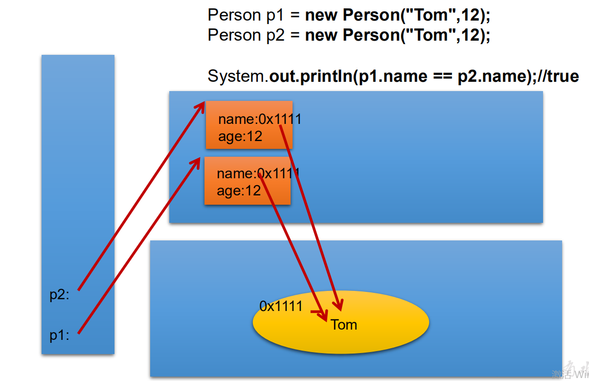

# 五、常用类

# 一、字符串相关


## String


+  String类：代表字符串。	Java 程序中的所有字符串字面值（如"abc" ）都作为此类的实例实现。 
+  String是一个final类，代表不可变的字符序列。 
+  字符串是常量，用双引号引起来表示。           它们的值在创建之后不能更改。 
+  String对象的字符内容是存储在一个字符数组value[]中的。 
+  String实现了Serializable接口：表示字符串是支持序列化的 
+  实现了Comparable接口：表示String可以比较大小 


## String的不可变性


+ String：代表不可变的字符序列。简称：不可变性 
    - 当对字符串重新赋值时，需要重新指定内存区域赋值，不能使用原有的value进行赋值
    - 当对现有的字符串进行连接操作时，也需要重新指定内存区域赋值，不能使用原有的value进行赋值
    - 当调用String的replace()方法修改指定字符或字符串时，也需要重新指定内存区域赋值，不能使用原有的value进行赋值

 

+ 通过字面量的方式(区别于new)给一个字符串赋值，此时的字符串值声明在字符串常量池中
+ 字符串常量池中是不会存储相同内容的字符串的


```java
@Test
public void test1() {

    String s1 = "abc";  //字面量的定义方式
    String s2 = "abc";

    System.out.println(s1 == s2); //比较s1和s2的地址值 true

    s1 = "hello";
    System.out.println(s1); //hello
    System.out.println(s2); //abc

    System.out.println("*******************");

    String s3 = "abc";
    s3 += "def";
    System.out.println(s3); //abcdef
    System.out.println(s2); //abc

    System.out.println("*******************");

    String s4 = "abc";
    String s5 = s4.replace('a', 'm');
    System.out.println(s4); //abc
    System.out.println(s5); //mbc

}
```


## String不同实例化方式的对比


+ 方式一：通过字面量定义的方式
+ 方式二：通过new+构造器的方式


```java
@Test
public void test2() {
    //此时的s1和s2的数据javaEE声明在方法区中的字符串常量池中
    String s1 = "javaEE";
    String s2 = "javaEE";

    //通过new + 构造器的方式：此时的s3和s4保存的地址值，是数据在堆空间中开辟空间以后对应的地址值
    String s3 = new String("javaEE");
    String s4 = new String("javaEE");

    System.out.println(s1 == s2);//true
    System.out.println(s1 == s3);//false
    System.out.println(s1 == s4);//false
    System.out.println(s3 == s4);//false
}
```


**字符串对象是如何存储的**





## 面试题：


+ String str1 = “abc”;**与**String str2 = new String(“abc”);的区别？


+ String s = new String("abc");方式创建对象，在内存中创建了几个对象？


```plain
两个：
	一个是堆空间中new结构，
	另一个是char[]对应的常量池中的数据：“abc"
```


## String不同拼接操作的对比


+ 常量与常量的拼接结果在常量池。且常量池中不会存在相同内容的常量。
+ 只要其中有一个是变量，结果就在堆中
+ 如果拼接的结果调用intern()方法，返回值就在常量池中


```java
@Test
public void test3() {

    String s1 = "javaEE";
    String s2 = "hadoop";

    String s3 = "javaEEhadoop";
    String s4 = "javaEE" + "hadoop";

    String s5 = s1 + "hadoop";
    String s6 = "javaEE" + s2;
    String s7 = s1 + s2;

    System.out.println(s3 == s4);//true
    System.out.println(s3 == s5);//false
    System.out.println(s3 == s6);//false
    System.out.println(s3 == s7);//false
    System.out.println(s5 == s6);//false
    System.out.println(s5 == s7);//false
    System.out.println(s6 == s7);//false

    String s8 = s5.intern();//返回值得到的s8使用的常量池中已经存在的“javaEEhadoop”
    System.out.println(s3==s8); //true
}
```


## 面试题


```java
public class StringTest {

    String str = new String("good");
    char[] ch = {'t', 'e', 's', 't'};

    public void change(String str, char ch[]) {
        str = "test ok";
        ch[0] = 'b';
    }

    public static void main(String[] args) {
        StringTest ex = new StringTest();
        ex.change(ex.str, ex.ch);
        System.out.print(ex.str + " and ");// good and 
        System.out.println(ex.ch);//best
    }
}
```


## String常用方法


+ int length()：返回字符串的长度： return value.length
+ char charAt(int index)： 返回某索引处的字符return value[index]
+ boolean isEmpty()：判断是否是空字符串：return value.length == 0
+ String toLowerCase()：使用默认语言环境，将 String 中的所有字符转换为小写
+ String toUpperCase()：使用默认语言环境，将 String 中的所有字符转换为大写
+ String trim()：返回字符串的副本，忽略前导空白和尾部空白


```java
@Test
public void test1() {
    String s1 = "HelloWorld";

    System.out.println(s1.length());

    System.out.println(s1.charAt(0));

    System.out.println(s1.isEmpty());

    String s2 = s1.toLowerCase();
    System.out.println(s1);// s1不可变的，仍然为原来的字符串
    System.out.println(s2);// 改成小写以后的字符串


    String s3 = "  he  llo world  ";
    String s4 = s3.trim();
    System.out.println("----" + s3 + "----");
    System.out.println("----" + s4 + "----");
}
```


+ boolean equals(Object obj)：比较字符串的内容是否相同
+ boolean equalsIgnoreCase(String anotherString)：与equals方法类似，忽略大小写
+ String concat(String str)：将指定字符串连接到此字符串的结尾。 等价于用“+”
+ int compareTo(String anotherString)：比较两个字符串的大小
+ String substring(int beginIndex)：返回一个新的字符串，它是此字符串的从beginIndex开始截取到最后的一个子字符串。
+ String substring(int beginIndex, int endIndex) ：返回一个新字符串，它是此字符串从beginIndex开始截取到endIndex(不包含)的一个子字符串。


```java
@Test
public void test2() {
    String s1 = "HelloWorld";
    String s2 = "helloworld";
    System.out.println(s1.equals(s2)); //false
    System.out.println(s1.equalsIgnoreCase(s2)); //true

    String s3 = "abc";
    String s4 = s3.concat("def");
    System.out.println(s4);

    String s5 = "abc";
    String s6 = new String("abe");
    System.out.println(s5.compareTo(s6)); //涉及到字符串排序

    String s7 = "北京尚硅谷教育";
    String s8 = s7.substring(2);
    System.out.println(s7);
    System.out.println(s8);

    String s9 = s7.substring(2,5);
    System.out.println(s9);
}
```


+  boolean endsWith(String suffix)：测试此字符串是否以指定的后缀结束 
+  boolean startsWith(String prefix)：测试此字符串是否以指定的前缀开始 
+  boolean startsWith(String prefix, int offset)：测试此字符串从指定索引开始的子字符串是否以指定前缀开始 
+  boolean contains(CharSequence s)：当且仅当此字符串包含指定的 char 值序列时，返回 true 
+  int indexOf(String str)：返回指定子字符串在此字符串中第一次出现处的索引 
+  int indexOf(String str, int fromIndex)：返回指定子字符串在此字符串中第一次出现处的索引，从指定的索引开始 
+  int lastIndexOf(String str)：返回指定子字符串在此字符串中最右边出现处的索引 
+  int lastIndexOf(String str, int fromIndex)：返回指定子字符串在此字符串中最后一次出现处的索引，从指定的索引开始反向搜索 


注：indexOf和lastIndexOf方法如果未找到都是返回-1


```java
@Test
public void test3() {
    String str1 = "helloworld";

    boolean b1 = str1.endsWith("ld"); //true
    System.out.println(b1);

    boolean b2 = str1.startsWith("He");
    System.out.println(b2); //false

    boolean b3 = str1.startsWith("ll", 2);
    System.out.println(b3); //true

    String str2 = "wo";
    System.out.println(str1.contains(str2)); //true

    System.out.println(str1.indexOf("lo")); //3

    System.out.println(str1.indexOf("lo", 5));//-1


    String str3 = "hellorworld";
    System.out.println(str3.lastIndexOf("or")); //7
    System.out.println(str3.lastIndexOf("or", 6)); //4

    //什么情况下，indexof(str)和lastindexof(str)返回值相同
    // 情况一：str中存在唯一的一个字符    情况二：str中不存在这个字符，返回-1

}
```


+ String replace(char oldChar, char newChar)：返回一个新的字符串，它是通过用 newChar 替换此字符串中出现的所有 oldChar 得到的。
+ String replace(CharSequence target, CharSequence replacement)：使用指定的字面值替换序列替换此字符串所有匹配字面值目标序列的子字符串。


```java
@Test
public void test4() {

    String str1 = "北京尚硅谷教育北京";
    String str2 = str1.replace('北', '东');
    System.out.println(str1);
    System.out.println(str2);

    String str3 = str1.replace("北京", "上海");
    System.out.println(str3);

}
```


+ String replaceAll(String regex, String replacement) ： 使 用 给 定 的replacement 替换此字符串所有匹配给定的正则表达式的子字符串。
+ String replaceFirst(String regex, String replacement) ： 使 用 给 定 的replacement 替换此字符串匹配给定的正则表达式的第一个子字符串。


```java
String str = "12hello34world5java7891mysql456";

//把字符串中的数字替换成,，如果结果中开头和结尾有，的话去掉
String string = str.replaceAll("\\d+", ",").replaceAll("^,|,$", "");

System.out.println(string);
```


+ boolean matches(String regex)：告知此字符串是否匹配给定的正则表达式。


```java
String str = "12345";
//判断str字符串中是否全部有数字组成，即有1-n个数字组成
boolean matches = str.matches("\\d+");
System.out.println(matches);

String tel = "0571-4534289";
//判断这是否是一个杭州的固定电话
boolean result = tel.matches("0571-\\d{7,8}");
System.out.println(result);
```


+ String[] split(String regex)：根据给定正则表达式的匹配拆分此字符串。
+ String[] split(String regex, int limit)：根据匹配给定的正则表达式来拆分此字符串，最多不超过limit个，如果超过了，剩下的全部都放到最后一个元素中。


```java
String str = "hello|world|java";
String[] strs = str.split("\\|");
for (int i = 0; i < strs.length; i++) {
    System.out.println(strs[i]);
}

String str2 = "hello.world.java";
String[] strs2 = str2.split("\\.");
for (int i = 0; i < strs2.length; i++) {
    System.out.println(strs2[i]);
}
```


## String与基本数据类型转换


+ 字符串 ---》基本数据类型、包装类 
    - Integer包装类的public static int parseInt(String s)：可以将由“数字”字符组成的字符串转换为整型。
    - 类似地,使用java.lang包中的Byte、Short、Long、Float、Double类调相应的类方法可以将由“数字”字符组成的字符串，转化为相应的基本数据类型。

 

+ 基本数据类型、包装类 ---》 字符串 
    - 调用String类的public String valueOf(int n)可将int型转换为字符串
    - 相应的valueOf(byte b)、valueOf(long l)、valueOf(float f)、valueOf(doubled)、valueOf(boolean b)可由参数的相应类型到字符串的转换

 

```java
@Test
public void test5() {

    String str1 = "123";
    int num = Integer.parseInt(str1);
    System.out.println(num);

    String str2 = String.valueOf(num);
    System.out.println(str2);

    String str3 = num + ""; // 有变量参与 则 在堆里
    System.out.println(str1 == str3); //false
}
```


## String与字符数组转换


+ 字符数组 ---》 字符串 
    - String 类的构造器：String(char[]) 和 String(char[]，int offset，int length) 分别用字符数组中的全部字符和部分字符创建字符串对象。

 

+ 字符串 ---》字符数组 
    - public char[] toCharArray()：将字符串中的全部字符存放在一个字符数组中的方法。
    - public void getChars(int srcBegin, int srcEnd, char[] dst, int dstBegin)：提供了将指定索引范围内的字符串存放到数组中的方法。

 

```java
@Test
public void test6() {
    String str1 = "abc123";
    char[] chars = str1.toCharArray();
    for (int i = 0; i < chars.length; i++) {
        System.out.println(chars[i]);
    }


    char[] arr = new char[]{'h', 'e', 'l', 'l', 'o'};
    String str2 = new String(arr);
    System.out.println(str2);
}
```


## String与字节数组转换


+ 字节数组 ---》 字符串 
    - String(byte[])：通过使用平台的默认字符集解码指定的 byte 数组，构造一个新的 String。
    - String(byte[]，int offset，int length) ：用指定的字节数组的一部分，即从数组起始位置offset开始取length个字节构造一个字符串对象。

 

+ 字符串 ---》 字节数组
+ public byte[] getBytes() ：使用平台的默认字符集将此 String 编码为byte 序列，并将结果存储到一个新的 byte 数组中。
+ public byte[] getBytes(String charsetName) ：使用指定的字符集将 此 String 编码到 byte 序列，并将结果存储到新的 byte 数组。


```java
@Test
public void test7() throws UnsupportedEncodingException {
    String str1 = "abc123中国";
    byte[] bytes = str1.getBytes(); //使用默认的字符集，进行编码
    System.out.println(Arrays.toString(bytes));

    byte[] gbks = str1.getBytes("gbk"); //使用gbk字符集进行编码
    System.out.println(Arrays.toString(gbks));


    System.out.println("*************************");

    String str2 = new String(bytes); //使用默认的字符集，进行解码
    System.out.println(str2);

    String str3 = new String(gbks);
    System.out.println(str3); //乱码

    String str4 = new String(gbks, "gbk");
    System.out.println(str4);
}
```


## StringBuffer类


+ java.lang.StringBuffer代表可变的字符序列，JDK1.0中声明，可以对字符串内容进行增删，此时不会产生新的对象。
+ 很多方法与String相同。
+ 作为参数传递时，方法内部可以改变值。


+ StringBuffer类不同于String，其对象必须使用构造器生成。有三个构造器： 
    - StringBuffer()：初始容量为16的字符串缓冲区
    - StringBuffer(int size)：构造指定容量的字符串缓冲区
    - StringBuffer(String str)：将内容初始化为指定字符串内容

 

### 常用方法


+ StringBuffer append(xxx)：提供了很多的append()方法，用于进行字符串拼接
+ StringBuffer delete(int start,int end)：删除指定位置的内容
+ StringBuffer replace(int start, int end, String str)：把[start,end)位置替换为str
+ StringBuffer insert(int offset, xxx)：在指定位置插入xxx
+ StringBuffer reverse() ：把当前字符序列逆转 
    - 当append和insert时，如果原来value数组长度不够，可扩容。
    - 如上这些方法支持方法链操作。

 

```java
@Test
public void test2(){
    StringBuffer s1 = new StringBuffer("abc");
    s1.append(1);
    s1.append('1');
    System.out.println(s1);

//        s1.delete(2,4);

//        s1.replace(2,4,"hello");

//        s1.insert(2,false);


//        s1.reverse();

    String s2 = s1.substring(1, 3);
    System.out.println(s1);
    System.out.println(s2);
}
```


**此外，还定义了如下的方法：**


+  public int indexOf(String str) 
+  public String substring(int start,int end) 
+  public int length() 
+  public char charAt(int n ) 
+  public void setCharAt(int n ,char ch) 


## 面试题 String、StringBuffer、StringBuilder三者的异同


+ String（JDK1.0）：不可变的字符序列；底层结构使用char[]存储
+ StringBuffer（JDK1.0）：可变的字符序列；线程安全的，效率低；底层结构使用char[]存储
+ StringBuilder（JDK5.0）：可变的字符序列；jdk5.0新增的，线程不安全的，效率高；底层结构使用char[]存储


注意：作为参数传递的话，方法内部String不会改变其值，StringBuffer和StringBuilder会改变其值。


+  扩容问题：如果要添加的数据，底层数组盛不下了，那就需要扩容底层的数组。 
+  默认情况下，扩容为原来容量的2倍+2，同时将原有数组中的元素复制到新的数组中。 
+  指导意义：开发中建议使用：StringBuffer(int size) 或 StringBuilder(int size) 


## String、StringBuffer、StringBuilder效率对比


```java
@Test
public void test3() {

    //初始设置
    long startTime = 0L;
    long endTime = 0L;
    String text = "";
    StringBuffer buffer = new StringBuffer("");
    StringBuilder builder = new StringBuilder("");

    //开始对比
    startTime = System.currentTimeMillis();
    for (int i = 0; i < 20000; i++) {
        buffer.append(String.valueOf(i));
    }
    endTime = System.currentTimeMillis();
    System.out.println("StringBuffer的执行时间：" + (endTime - startTime));

    startTime = System.currentTimeMillis();
    for (int i = 0; i < 20000; i++) {
        builder.append(String.valueOf(i));
    }
    endTime = System.currentTimeMillis();
    System.out.println("StringBuilder的执行时间：" + (endTime - startTime));

    startTime = System.currentTimeMillis();
    for (int i = 0; i < 20000; i++) {
        text = text + i;
    }
    endTime = System.currentTimeMillis();
    System.out.println("String的执行时间：" + (endTime - startTime));

}
```


## 算法题：


+ 将一个字符串进行反转。将字符串中指定的部分进行反转。比如“abcdefg"反转为"abfedcg"


```java
/**
 * 方式一：转换为char[]
 *
 * @param str
 */
public String reverse(String str, int startIndex, int endIndex) {
    if (str != null) {
        char[] chars = str.toCharArray();
        for (int x = startIndex, y = endIndex; x < y; x++, y--) {
            char temp = chars[x];
            chars[x] = chars[y];
            chars[y] = temp;
        }
        return new String(chars);
    }
    return null;
}


//方式二：使用String的拼接
public String reverse2(String str, int startIndex, int endIndex) {
    if (str != null) {
        //第一部分
        String reverseStr = str.substring(0, startIndex);
        //第二部分
        for (int i = endIndex; i >= startIndex; i--) {
            reverseStr += str.charAt(i);
        }
        //第三部分
        reverseStr += str.substring(endIndex + 1);

        return reverseStr;
    }
    return null;
}


//方式三：使用StringBuffer/StringBuilder替换String
public String reverse3(String str, int startIndex, int endIndex) {
    if (str != null) {
        StringBuilder builder = new StringBuilder(str.length());
        //第一部分
        builder.append(str.substring(0, startIndex));
        //第二部分
        for (int i = endIndex; i >= startIndex; i--) {
            builder.append(str.charAt(i));
        }
        //第三部分
        builder.append(str.substring(endIndex + 1));

        return builder.toString();
    }
    return null;
}
```


+ 获取一个字符串在另一个字符串中出现的次数。比如：获取“ ab”在 “abkkcadkabkebfkabkskab” 中出现的次数


```java
public int getCount(String mainStr, String subStr) {
    int mainLength = mainStr.length();
    int subLength = subStr.length();
    int count = 0;
    int index;
    if (mainLength >= subLength) {
        //方式一
        while ((index = mainStr.indexOf(subStr)) != -1) {
            count++;
            mainStr = mainStr.substring(index + subStr.length());
        }

        return count;
    }
    return count;
}

public int getCount2(String mainStr, String subStr) {
    int mainLength = mainStr.length();
    int subLength = subStr.length();
    int count = 0;
    int index = 0;
    if (mainLength >= subLength) {

        //方式二：对方式一的改进
        while ((index = mainStr.indexOf(subStr, index)) != -1) {
            count++;
            index += subLength;
        }

        return count;
    }
    return count;
}
```


+ 获取两个字符串中最大相同子串。比如：str1 = "abcwerthelloyuiodef“;str2 = "cvhellobnm" 
    - 提示：将短的那个串进行长度依次递减的子串与较长的串比较。

 

```java
public String getMaxSameString(String str1, String str2) {

    if (str1 != null && str2 != null) {
        String maxStr = (str1.length() >= str2.length()) ? str1 : str2;
        String minStr = (str1.length() < str2.length()) ? str1 : str2;
        int length = minStr.length();

        for (int i = 0; i < length; i++) {
            for (int x = 0, y = length - i; y <= length; x++, y++) {
                String subStr = minStr.substring(x, y);
                if (maxStr.contains(subStr)) {
                    return subStr;
                }
            }
        }
    }

    return null;
}
```


# 二、8之前的日期


## java.lang.System类


System类提供的public static long currentTimeMillis()用来返回当前时间与1970年1月1日0时0分0秒之间以毫秒为单位的时间差。


+ 此方法适于计算时间差。
+ 计算世界时间的主要标准有： 
    - UTC(Coordinated Universal Time)
    - GMT(Greenwich Mean Time)
    - CST(Central Standard Time)

 

```java
@Test
public void test1(){

    //返回当前时间与1970年1月1日0时0分0秒之间以毫秒为单位的时间差
    long tiem = System.currentTimeMillis();
    System.out.println(tiem);
}
```


## java.util.Date类


表示特定的瞬间，精确到毫秒


+  构造器： 
    - Date()：使用无参构造器创建的对象可以获取本地当前时间。
    - Date(long date)

 

+  常用方法 
    -  getTime():返回自 1970 年 1 月 1 日 00:00:00 GMT 以来此 Date 对象表示的毫秒数。 
    -  toString():把此 Date 对象转换为以下形式的 String： dow mon dd hh:mm:ss zzz yyyy  
其中： dow 是一周中的某一天 (Sun, Mon, Tue, Wed, Thu, Fri, Sat)，zzz是时间标准。 
    -  其它很多方法都过时了 

 

```java
@Test
public void test2() {

    //构造器一：创建一个对应当前时间的Date对象
    Date date1 = new Date();
    System.out.println(date1.toString());//Thu Apr 01 13:33:31 CST 2021
    //毫秒数
    System.out.println(date1.getTime());//1617254897825

    //构造器二：创建指定毫秒数的Date对象
    Date date2 = new Date(1617254897825L);
    System.out.println(date2.toString());//Thu Apr 01 13:28:17 CST 2021


    //创建java.sql.Date对象
    java.sql.Date date3 = new java.sql.Date(1617254897825L);
    System.out.println(date3.toString()); //2021-04-01


    //如何将java.util.Date对象转换为java.sql.Date对象
    //情况一：
    //        Date date4 = new java.sql.Date(1617254897825L);
    //        java.sql.Date date5 = (java.sql.Date) date4;

    Date date6 = new Date();
    java.sql.Date date7 = new java.sql.Date(date6.getTime());

}
```


## java.text.SimpleDateFormat类


+ java.text.SimpleDateFormat类是一个不与语言环境有关的方式来格式化和解析日期的具体类。
+ 它允许进行  格式化：日期--->文本、解析：文本--->日期
+ 格式化： 
    - SimpleDateFormat() ：默认的模式和语言环境创建对象
    - public SimpleDateFormat(String pattern)：该构造方法可以用参数pattern指定的格式创建一个对象，该对象调用：
    - public String format(Date date)：方法格式化时间对象date

 

+ 解析： 
    - public Date parse(String source)：从给定字符串的开始解析文本，以生成一个日期。

 

```java
@Test
public void Test() throws ParseException {
    
    SimpleDateFormat simpleDateFormat = new SimpleDateFormat();
    //格式化：日期--->字符串
    Date date = new Date();
    String format = simpleDateFormat.format(date);
    System.out.println(format);//21-4-3 上午9:20

    //解析：格式化的逆过程，字符串--->日期
    String str = "21-4-3 上午9:12";
    Date date1 = simpleDateFormat.parse(str);
    System.out.println(date1);//Sat Apr 03 09:12:00 CST 2021

    //***************指定方式格式化和解析**********************

    SimpleDateFormat simpleDateFormat1 = new SimpleDateFormat("yyyy-MM-dd hh:mm:ss");
    //格式化
    String format1 = simpleDateFormat1.format(date);
    System.out.println(format1); //2021-04-03 09:20:47
    //解析
    Date date2 = simpleDateFormat1.parse("2021-04-03 09:20:47");
    System.out.println(date2); //Sat Apr 03 09:20:47 CST 2021

}
```


## java.util.Calendar(日历)类


+ Calendar是一个抽象基类，主用用于完成日期字段之间相互操作的功能。
+ 获取Calendar实例的方法 
    - 使用Calendar.getInstance()方法
    - 调用它的子类GregorianCalendar的构造器。

 

+ 一个Calendar的实例是系统时间的抽象表示，通过get(int field)方法来取得想要的时间信息。比如YEAR、MONTH、DAY_OF_WEEK、HOUR_OF_DAY 、MINUTE、SECOND 
    - public void set(int field,int value)
    - public void add(int field,int amount)
    - public final Date getTime()
    - public final void setTime(Date date)

 

+ 注意: 
    - 获取月份时：一月是0，二月是1，以此类推，12月是11
    - 获取星期时：周日是1，周二是2 ， 。。。。周六是7

 

```java
@Test
public void testCalendar() {
    //1、实例化
    //方式一：创建其子类（GregorianCalendar）的对象
    //方式二：调用其静态方法getInstance()
    Calendar calendar = Calendar.getInstance();

    //2、get()
    int day = calendar.get(Calendar.DAY_OF_MONTH);
    System.out.println(day); //3

    //3、set()
    calendar.set(Calendar.DAY_OF_MONTH, 22);
    day = calendar.get(Calendar.DAY_OF_MONTH);
    System.out.println(day); //22

    //4、add()
    calendar.add(Calendar.DAY_OF_MONTH, 3);
    day = calendar.get(Calendar.DAY_OF_MONTH);
    System.out.println(day); //25
    calendar.add(Calendar.DAY_OF_MONTH, -5);
    day = calendar.get(Calendar.DAY_OF_MONTH);
    System.out.println(day);//20

    //5、getTime()：日历类 ---> Date
    Date date = calendar.getTime();
    System.out.println(date); //Tue Apr 20 10:05:24 CST 2021

    //6、setTime()：Date ---> 日历类
    Date date1 = new Date();
    calendar.setTime(date1);
    day = calendar.get(Calendar.DAY_OF_MONTH);
    System.out.println(day); //3

}
```


# 三、8之后的日期


## 新日期时间API出现的背景


如果我们可以跟别人说：“我们在1502643933071见面，别晚了！”那么就再简单不过了。但是我们希望时间与昼夜和四季有关，于是事情就变复杂了。


JDK 1.0中包含了一个java.util.Date类，但是它的大多数方法已经在JDK 1.1引入Calendar类之后被弃用了。而Calendar并不比Date好多少。


它们面临的问题是：


+ 可变性：像日期和时间这样的类应该是不可变的。
+ 偏移性：Date中的年份是从1900开始的，而月份都从0开始。
+ 格式化：格式化只对Date有用，Calendar则不行。
+ 此外，它们也不是线程安全的；不能处理闰秒等。


总结：对日期和时间的操作一直是Java程序员最痛苦的地方之一。


## 新时间日期API


+  第三次引入的API是成功的，并且Java 8中引入的java.time API 已经纠正了过去的缺陷，将来很长一段时间内它都会为我们服务。 
+  Java 8 吸收了 Joda-Time 的精华，以一个新的开始为 Java 创建优秀的 API。  
新的 java.time 中包含了所有关于本地日期（LocalDate）、本地时间（LocalTime）、本地日期时间（LocalDateTime）、时区（ZonedDateTime）和持续时间（Duration）的类。  
历史悠久的 Date 类新增了 toInstant() 方法，用于把 Date 转换成新的表示形式。  
这些新增的本地化时间日期 API 大大简化了日期时间和本地化的管理。 
+  java.time – 包含值对象的基础包 
+  java.time.chrono – 提供对不同的日历系统的访问 
+  java.time.format – 格式化和解析时间和日期 
+  java.time.temporal – 包括底层框架和扩展特性 
+  java.time.zone – 包含时区支持的类 


## LocalDate、LocalTime、LocalDateTime


+ LocalDate、LocalTime、LocalDateTime 类是其中较重要的几个类，它们的实例是不可变的对象，分别表示使用 ISO-8601日历系统的日期、时间、日期和时间。  
它们提供了简单的本地日期或时间，并不包含当前的时间信息，也不包含与时区相关的信息。 
    - LocalDate代表IOS格式（yyyy-MM-dd）的日期,可以存储 生日、纪念日等日期
    - LocalTime表示一个时间，而不是日期。
    - LocalDateTime是用来表示日期和时间的，这是一个最常用的类之一。

 


```java
@Test
public void test1(){
    //now()：获取当前的日期、时间、日期+时间
    LocalDate localDate = LocalDate.now();
    LocalTime localTime = LocalTime.now();
    LocalDateTime localDateTime = LocalDateTime.now();

    System.out.println(localDate);
    System.out.println(localTime);
    System.out.println(localDateTime);

    //of()：设置指定的年月日时分秒。没有偏移量
    LocalDateTime localDateTime1 = LocalDateTime.of(2020, 10, 6, 13, 23, 43);
    System.out.println(localDateTime1);

    //getXxx()
    System.out.println(localDateTime.getDayOfMonth());
    System.out.println(localDateTime.getDayOfWeek());
    System.out.println(localDateTime.getMonth());
    System.out.println(localDateTime.getMonthValue());
    System.out.println(localDateTime.getMinute());

    //体现不可变性
    //withXxx：设置相关的属性
    LocalDate localDate1 = localDate.withDayOfMonth(22);
    System.out.println(localDate);
    System.out.println(localDate1);

    LocalDateTime localDateTime2 = localDateTime.withHour(4);
    System.out.println(localDateTime);
    System.out.println(localDateTime2);


    LocalDateTime localDateTime3 = localDateTime.plusMonths(3);
    System.out.println(localDateTime);
    System.out.println(localDateTime3);

    LocalDateTime localDateTime4 = localDateTime.minusDays(6);
    System.out.println(localDateTime);
    System.out.println(localDateTime4);
}
```


## 瞬时：Instant


+ Instant：时间线上的一个瞬时点。 这可能被用来记录应用程序中的事件时间戳。
+ 在处理时间和日期的时候，我们通常会想到年,月,日,时,分,秒。然而，这只是时间的一个模型，是面向人类的。第二种通用模型是面向机器的，或者说是连续的。在此模型中，时间线中的一个点表示为一个很大的数，这有利于计算机处理。在UNIX中，这个数从1970年开始，以秒为的单位；同样的，在Java中，也是从1970年开始，但以毫秒为单位。
+ java.time包通过值类型Instant提供机器视图，不提供处理人类意义上的时间单位。Instant表示时间线上的一点，而不需要任何上下文信息，例如，时区。概念上讲，它只是简单的表示自1970年1月1日0时0分0秒（UTC）开始的秒数。因为java.time包是基于纳秒计算的，所以Instant的精度可以达到纳秒级。
+ (1 ns = 10-9 s) 1秒 = 1000毫秒 =10<sup>6微秒=10</sup>9纳秒


```java
@Test
public void test2(){
    //now()：获取本初子午线对应的标准时间
    Instant instant = Instant.now();
    System.out.println(instant); //2021-04-03T03:10:43.694Z

    //添加时间的偏移量
    OffsetDateTime offsetDateTime = instant.atOffset(ZoneOffset.ofHours(8));
    System.out.println(offsetDateTime);//2021-04-03T11:12:56.269+08:00

    //1970-01-01 00:00:00到当前时间的毫秒数，即为时间戳
    long milli = instant.toEpochMilli();
    System.out.println(milli);

    //通过给定的毫秒数，获取Instant实例 ---> Date(Long millis)
    Instant instant1 = Instant.ofEpochMilli(1617419824546L);
    System.out.println(instant1);
}
```


## DateTimeFormatter 格式化与解析日期或时间


java.time.format.DateTimeFormatter 类：该类提供了三种格式化方法：


+ 预定义的标准格式。如：ISO_LOCAL_DATE_TIME;ISO_LOCAL_DATE;ISO_LOCAL_TIME
+ 本地化相关的格式。如：ofLocalizedDateTime(FormatStyle.LONG)
+ 自定义的格式。如：ofPattern(“yyyy-MM-dd hh:mm:ss”)


```java
@Test
public void test3() {

    //方式一：预定义的标准格式。
    // 如：ISO_LOCAL_DATE_TIME;ISO_LOCAL_DATE;ISO_LOCAL_TIME
    DateTimeFormatter formatter = DateTimeFormatter.ISO_LOCAL_DATE_TIME;
    //格式化：日期--->字符串
    String format = formatter.format(LocalDateTime.now());
    System.out.println(format);

    //解析：字符串--->日期
    TemporalAccessor parse = formatter.parse("2021-04-03T11:33:28.557");
    System.out.println(parse);

    //方式二：
    // 本地化相关的格式。如：ofLocalizedDateTime()
    //FormatStyle.LONG/FormatStyle.MEDIUM/FormatStyle.SHORT 适用于LocalDateTime
    DateTimeFormatter formatter1 = DateTimeFormatter.ofLocalizedDateTime(FormatStyle.LONG);

    //格式化
    String format1 = formatter1.format(LocalDateTime.now());
    System.out.println(format1);

    // 本地化相关的格式。如：ofLocalizedDate()
    //FormatStyle.FULL/FormatStyle.LONG/FormatStyle.MEDIUM/FormatStyle.SHORT 适用于LocalDate
    DateTimeFormatter formatter2 = DateTimeFormatter.ofLocalizedDate(FormatStyle.MEDIUM);
    //格式化
    String format2 = formatter2.format(LocalDate.now());
    System.out.println(format2);

    //方式三： 自定义的格式。如：ofPattern(“yyyy-MM-dd hh:mm:ss”)
    DateTimeFormatter formatter3 = DateTimeFormatter.ofPattern("yyyy-MM-dd hh:mm:ss");
    //格式化
    String format3 = formatter3.format(LocalDateTime.now());
    System.out.println(format3);
    //解析：
    TemporalAccessor parse1 = formatter3.parse("2021-04-03 11:48:59");
    System.out.println(parse1);
}
```


# 四、java比较器


+ 在Java中经常会涉及到对象数组的排序问题，那么就涉及到对象之间的比较问题。
+ Java实现对象排序的方式有两种：
+ 自然排序：java.lang.Comparable
+ 定制排序：java.util.Comparator


## 自然排序：java.lang.Comparable


+  Comparable接口强行对实现它的每个类的对象进行整体排序。  
这种排序被称为类的自然排序。 
+  实现 Comparable 的类必须实现 compareTo(Object obj) 方法，两个对象即通过 compareTo(Object obj) 方法的返回值来比较大小。 
    - 如果当前对象this大于形参对象obj，则返回正整数，
    - 如果当前对象this小于形参对象obj，则返回负整数，
    - 如果当前对象this等于形参对象obj，则返回零。

 

+  实现Comparable接口的对象列表（和数组）可以通过 Collections.sort 或Arrays.sort进行自动排序。  
实现此接口的对象可以用作有序映射中的键或有序集合中的元素，无需指定比较器。 
+  对于类 C 的每一个 e1 和 e2 来说，当且仅当 e1.compareTo(e2) == 0 与e1.equals(e2) 具有相同的 boolean 值时，类 C 的自然排序才叫做与 equals一致。  
建议（虽然不是必需的）最好使自然排序与 equals 一致。 


### Comparable 的典型实现：(默认都是从小到大)


+ String：按照字符串中字符的Unicode值进行比较
+ Character：按照字符的Unicode值来进行比较
+ 数值类型对应的包装类以及BigInteger、BigDecimal：按照它们对应的数值大小进行比较
+ Boolean：true 对应的包装类实例大于 false 对应的包装类实例
+ Date、Time等：后面的日期时间比前面的日期时间大


```java
@Test
public void test1(){
    String[] arr = new String[]{"AA","CC","KK","MM","GG","JJ","DD"};
    Arrays.sort(arr);
    System.out.println(Arrays.toString(arr));
}
```


### 自定义类


对于自定义类来说，如果需要排序，我们可以让自定义类实现Comparable接口，重写compareTo(obj)方法，在compareTo(obj)方法中指明如何排序


```java
public class Goods  implements Comparable{

    private String name;
    private double price;

    public Goods() {
    }

    public Goods(String name, double price) {
        this.name = name;
        this.price = price;
    }

    public String getName() {
        return name;
    }

    public void setName(String name) {
        this.name = name;
    }

    public double getPrice() {
        return price;
    }

    public void setPrice(double price) {
        this.price = price;
    }

    @Override
    public String toString() {
        return "Goods{" +
                "name='" + name + '\'' +
                ", price=" + price +
                '}';
    }

    //指明商品比较大小的方式：安照价格从低到高排序
    @Override
    public int compareTo(Object o) {
        if(o instanceof Goods){
            Goods goods = (Goods) o;
            //方式一：
            if(this.price>goods.price){
                return 1;
            }else if(this.price<goods.price){
                return -1;
            }else {
                return 0;
            }
            //方式二：
//            return Double.compare(this.price,goods.price);
        }
        throw new RuntimeException("传入的数据类型不一致~！");
    }
}
```


```java
@Test
public void test2(){
    Goods[] goods = new Goods[4];
    goods[0] = new Goods("lenovoMouse",34);
    goods[1] = new Goods("dellMouse",43);
    goods[2] = new Goods("xiaomiMouse",12);
    goods[3] = new Goods("huaweiMouse",65);

    Arrays.sort(goods);
    System.out.println(Arrays.toString(goods));
}
```


## 定制排序：java.util.Comparator


+ 当元素的类型没有实现java.lang.Comparable接口而又不方便修改代码，或者实现了java.lang.Comparable接口的排序规则不适合当前的操作，那么可以考虑使用 Comparator 的对象来排序，强行对多个对象进行整体排序的比较。
+ 重写compare(Object o1,Object o2)方法，比较o1和o2的大小： 
    - 如果方法返回正整数，则表示o1大于o2；
    - 如果返回0，表示相等；
    - 返回负整数，表示o1小于o2。

 

+ 可以将 Comparator 传递给 sort 方法（如 Collections.sort 或 Arrays.sort），从而允许在排序顺序上实现精确控制。


```java
@Test
public void test3() {
    String[] arr = new String[]{"AA", "CC", "KK", "MM", "GG", "JJ", "DD"};
    //按照字符串从大到小的顺序排序
    Arrays.sort(arr, new Comparator<String>() {
        @Override
        public int compare(String o1, String o2) {
            return -o1.compareTo(o2);
        }
    });

    System.out.println(Arrays.toString(arr));
}
```


+ 还可以使用 Comparator 来控制某些数据结构（如有序 set或有序映射）的顺序，或者为那些没有自然顺序的对象 collection 提供排序。


```java
@Test
public void test4() {
    Goods[] goods = new Goods[4];
    goods[0] = new Goods("lenovoMouse", 34);
    goods[1] = new Goods("dellMouse", 43);
    goods[2] = new Goods("xiaomiMouse", 12);
    goods[3] = new Goods("huaweiMouse", 65);

    Arrays.sort(goods, new Comparator<Goods>() {
        //指明商品比较大小的方式：按照产品名称从低到高排序，再按照价格从高到低排序
        @Override
        public int compare(Goods o1, Goods o2) {
            if (o1.getName().equals(o2.getName())) {
                return -Double.compare(o1.getPrice(), o2.getPrice());
            } else {
                return o1.getName().compareTo(o2.getName());
            }
        }
    });
    System.out.println(Arrays.toString(goods));
}
```


## Comparable接口与Comparator的使用对比


+ Comparable接口的方式一旦指定，保证Comparable接口实现类的对象在任何位置都可以比较大小
+ Comparator接口属于临时性的比较。


# 五、System类


+  System类代表系统，系统级的很多属性和控制方法都放置在该类的内部。该类位于java.lang包。 
+  由于该类的构造器是private的，所以无法创建该类的对象，也就是无法实例化该类。  
其内部的成员变量和成员方法都是static的，所以也可以很方便的进行调用。 
+  成员变量 
    - System类内部包含in、out和err三个成员变量，分别代表标准输入流(键盘输入)，标准输出流(显示器)和标准错误输出流(显示器)。

 

+  成员方法 
    -  native long currentTimeMillis()： 该方法的作用是返回当前的计算机时间，时间的表达格式为当前计算机时间和GMT时间(格林威治时间)1970年1月1号0时0分0秒所差的毫秒数。 
    -  void exit(int status)： 该方法的作用是退出程序。其中status的值为0代表正常退出，非零代表异常退出。使用该方法可以在图形界面编程中实现程序的退出功能等。 
    -  void gc()： 该方法的作用是请求系统进行垃圾回收。至于系统是否立刻回收，则取决于系统中垃圾回收算法的实现以及系统执行时的情况。 
    -  String getProperty(String key)： 该方法的作用是获得系统中属性名为key的属性对应的值。  
系统中常见的属性名以及属性的作用如下所示：  

```java
@Test
public void test1() {
    //java运行时环境版本
    String javaVersion = System.getProperty("java.version");
    System.out.println("java的version:" + javaVersion);
    //java安装目录
    String javaHome = System.getProperty("java.home");
    System.out.println("java的home:" + javaHome);
    //操作系统的名称
    String osName = System.getProperty("os.name");
    System.out.println("os的name:" + osName);
    //操作系统的版本
    String osVersion = System.getProperty("os.version");
    System.out.println("os的version:" + osVersion);
    //用户的账户名称
    String userName = System.getProperty("user.name");
    System.out.println("user的name:" + userName);
    //用户的主目录
    String userHome = System.getProperty("user.home");
    System.out.println("user的home:" + userHome);
    //用户的当前工作目录
    String userDir = System.getProperty("user.dir");
    System.out.println("user的dir:" + userDir);
}
```

 

# 六、Math类


java.lang.Math提供了一系列静态方法用于科学计算。其方法的参数和返回值类型一般为double型。


+ abs 绝对值
+ acos,asin,atan,cos,sin,tan 三角函数
+ sqrt 平方根
+ pow(double a,doble b) a的b次幂
+ log 自然对数
+ exp e为底指数
+ max(double a,double b)
+ min(double a,double b)
+ random() 返回0.0到1.0的随机数
+ long round(double a) double型数据a转换为long型（四舍五入）
+ toDegrees(double angrad) 弧度—>角度
+ toRadians(double angdeg) 角度—>弧度


# 七、BigInteger


+  Integer类作为int的包装类，能存储的最大整型值为2<sup>31-1，Long类也是有限的，最大为2</sup>63-1。  
如果要表示再大的整数，不管是基本数据类型还是他们的包装类都无能为力，更不用说进行运算了。 
+  java.math包的BigInteger可以表示不可变的任意精度的整数。  
BigInteger 提供所有 Java 的基本整数操作符的对应物，并提供 java.lang.Math 的所有相关方法。  
另外，BigInteger 还提供以下运算：模算术、GCD 计算、质数测试、素数生成、位操作以及一些其他操作。 
+  构造器 
+  BigInteger(String val)：根据字符串构建BigInteger对象 
+  常用方法 
    - public BigInteger abs()：返回此 BigInteger 的绝对值的 BigInteger。
    - BigInteger add(BigInteger val) ：返回其值为 (this + val) 的 BigInteger
    - BigInteger subtract(BigInteger val) ：返回其值为 (this - val) 的 BigInteger
    - BigInteger multiply(BigInteger val) ：返回其值为 (this * val) 的 BigInteger
    - BigInteger divide(BigInteger val) ：返回其值为 (this / val) 的 BigInteger。整数相除只保留整数部分。
    - BigInteger remainder(BigInteger val) ：返回其值为 (this % val) 的 BigInteger。
    - BigInteger[] divideAndRemainder(BigInteger val)：返回包含 (this / val) 后跟(this % val) 的两个 BigInteger 的数组。
    - BigInteger pow(int exponent) ：返回其值为 (thise^xponent) 的 BigInteger。

 

# 八、BigDecimal


+ 一般的Float类和Double类可以用来做科学计算或工程计算，但在商业计算中，要求数字精度比较高，故用到java.math.BigDecimal类。
+ BigDecimal类支持不可变的、任意精度的有符号十进制定点数。
+ 构造器 
    - public BigDecimal(double val)
    - public BigDecimal(String val)

 

+ 常用方法 
    - public BigDecimal add(BigDecimal augend)
    - public BigDecimal subtract(BigDecimal subtrahend)
    - public BigDecimal multiply(BigDecimal multiplicand)
    - public BigDecimal divide(BigDecimal divisor, int scale, int roundingMode)

 

```java
@Test
public void test2() {
    BigInteger bi = new BigInteger("12433241123");
    System.out.println(bi);

    BigDecimal bd = new BigDecimal("12435.351");
    BigDecimal bd2 = new BigDecimal("11");

    // System.out.println(bd.divide(bd2));
    System.out.println(bd.divide(bd2, BigDecimal.ROUND_HALF_UP));
    System.out.println(bd.divide(bd2, 15, BigDecimal.ROUND_HALF_UP));
}
```


> 更新: 2023-06-12 11:52:58  
> 原文: <https://www.yuque.com/like321/javase/syfqa9>