# 八、集合

# 一、Java集合框架概述


1、集合、数组都是对多个数据进行存储操作的结构，简称java容器


2、数组在存储多个数据方面的特点：


+  一旦初始化以后，其<font style="color:#E8323C;">长度就确定</font>了 
+  数组一旦定义好，其<font style="color:#E8323C;">元素的类型也就确定</font>了。我们也就只能操作指定类型的数据。  
比如：String[] arr;int[] arr1;Object[] arr2; 


3、数组在存储多个数据方面的缺点：


+ 一旦初始化以后，其<font style="color:#E8323C;">长度就不可修改</font>
+ 数组中提供的方法非常有限，对于添加、删除、插入数据等操作，非常不便，同时效率不高
+ 获取数组中实际元素的个数的需求，数组没有现成的属性或方法可用
+ 数组存储数据的特点：有序、可重复。<font style="color:#E8323C;">对于无序、不可重复的需求，不能满足</font>


## 集合的使用场景


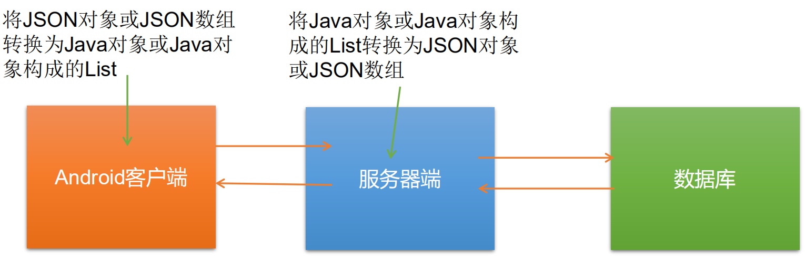


## 集合涉及到的API


Java 集合可分为 Collection 和 Map 两种体系


+ Collection接口：单列数据，定义了存取一组对象的方法的集合 
    - List：元素有序、可重复的集合
    - Set：元素无序、不可重复的集合
+ Map接口：双列数据，保存具有映射关系“key-value对”的集合


## Collection接口继承树


+  List接口：存储有序的、可重复的数据。----》动态数组 
    - ArrayList
    - LinkedList
    - Vector
+  Set接口：存储无序的、不可重复的数据 
    - HashSet
    - LinkedHashSet
    - TreeSet


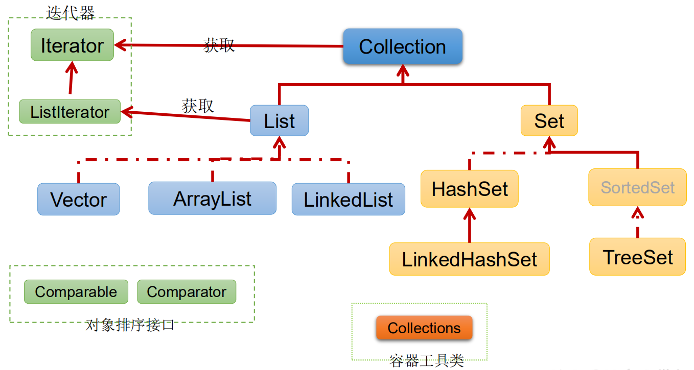


## Map接口继承树


+ HashMap
+ LinkedHashMap
+ TreeMap
+ Hashtable
+ Properties


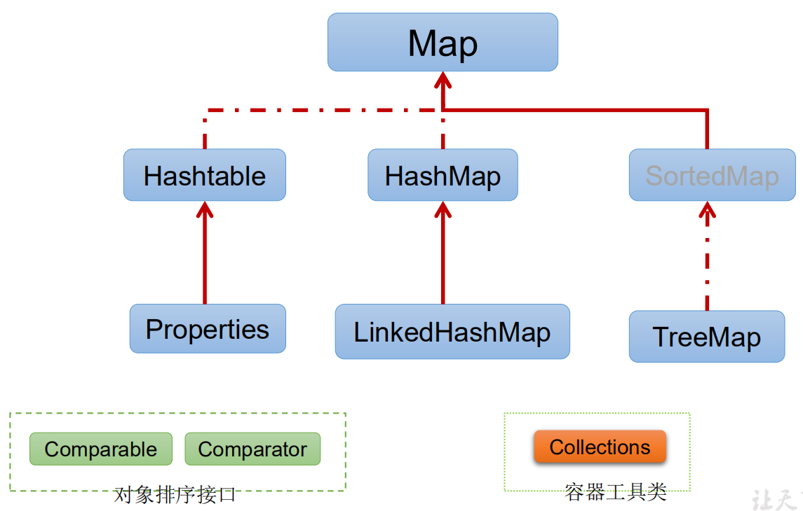


# 二、Collection接口方法


+ Collection 接口是 List、Set 和 Queue 接口的父接口，该接口里定义的方法既可用于操作 Set 集合，也可用于操作 List 和 Queue 集合。
+ JDK不提供此接口的任何直接实现，而是提供更具体的子接口(如：Set和List)实现。
+ 在 Java5 之前，Java 集合会丢失容器中所有对象的数据类型，把所有对象都当成 Object 类型处理；从 JDK 5.0 增加了泛型以后，Java 集合可以记住容器中对象的数据类型。


## 1、添加


+ add(Object obj)
+ addAll(Collection coll)


## 2、获取有效元素的个数


+ int size()


## 3、清空集合


+ void clear()


## 4、是否是空集合


+ boolean isEmpty()


```java
@Test
public void test1() {

    Collection<Object> collection = new ArrayList<>();

    //add()
    collection.add("AA");
    collection.add("BB");
    collection.add(123); //自动装箱
    collection.add(new Date());

    //size()
    System.out.println(collection.size()); //4

    //addAll()
    Collection<Object> collection2 = new ArrayList<>();
    collection.add("CC");
    collection.add(456); //自动装箱
    collection.addAll(collection2);

    System.out.println(collection.size()); //6

    //clear()
    collection.clear();

    //isEmpty()
    System.out.println(collection.isEmpty()); //true
}
```


## 5、是否包含某个元素


+ boolean contains(Object obj)：是通过元素的equals方法来判断是否是同一个对象
+ boolean containsAll(Collection c)：也是调用元素的equals方法来比较的。拿两个集合的元素挨个比较。


```java
@Test
public void test2() {

    Collection<Object> collection = new ArrayList<>();

    collection.add(123);
    collection.add(456);
    collection.add(new String("Tom"));
    collection.add(false);

    //        Person p =new Person("jerry", 20);
    //        collection.add(p);

    collection.add(new Person("jerry", 20));


    //contains(Object j)：判断当前集合中是否包含object，在判断时会调用object对象所在类的equals()
    System.out.println(collection.contains(123)); //true
    System.out.println(collection.contains(new String("Tom"))); //true

    //        System.out.println(collection.contains(p)); //true

    System.out.println(collection.contains(new Person("jerry", 20))); //true 重写了Person的equals

    //containsAll(Collection coll)：判断形参coll中的所有元素是否都存在于当前集合中
    Collection collection1 = Arrays.asList(123, 456);
    System.out.println(collection.containsAll(collection1)); //true
}
```


## 6、删除


+ boolean remove(Object obj) ：通过元素的equals方法判断是否是要删除的那个元素。只会删除找到的第一个元素
+ boolean removeAll(Collection coll)：取当前集合的差集


```java
@Test
public void test3() {

    Collection<Object> collection = new ArrayList<>();

    collection.add(123);
    collection.add(456);
    collection.add(new Person("Jerry", 20));
    collection.add(new String("Tom"));
    collection.add(false);

    //remove(Object obj)
    collection.remove(123);
    System.out.println(collection);

    collection.remove(new Person("Jerry", 20));
    System.out.println(collection);

    //removeAll(Collection coll)
    Collection collection1 = Arrays.asList("123","4567");
    collection.removeAll(collection1);
    System.out.println(collection);
}
```


## 7、取两个集合的交集


+ boolean retainAll(Collection c)：把交集的结果存在当前集合中，不影响c


## 8、集合是否相等


+ boolean equals(Object obj)


```java
@Test
public void test4() {

    Collection<Object> collection = new ArrayList<>();

    collection.add(123);
    collection.add(456);
    collection.add(new Person("Jerry", 20));
    collection.add(new String("Tom"));
    collection.add(false);

    //retainAll(Collection coll)
    //        Collection collection1 = Arrays.asList(123, 456, 789);
    //        collection.retainAll(collection1);
    //
    //        System.out.println(collection);

    //equals(Object obj)    顺序，元素都相同
    Collection<Object> collection1 = new ArrayList<>();

    collection1.add(123);
    collection1.add(456);
    collection1.add(new Person("Jerry", 20));
    collection1.add(new String("Tom"));
    collection1.add(false);
    System.out.println(collection.equals(collection1));//true
}
```


## 9、转成对象数组


+ Object[] toArray()


## 10、获取集合对象的哈希值


+ hashCode()


```java
@Test
public void test5() {

    Collection<Object> collection = new ArrayList<>();

    collection.add(123);
    collection.add(456);
    collection.add(new Person("Jerry", 20));
    collection.add(new String("Tom"));
    collection.add(false);

    //hashCode()：返回当前对象的哈希值
    System.out.println(collection.hashCode());

    //toArray：集合 ----》数组
    Object[] objects = collection.toArray();
    for (int i = 0; i < objects.length; i++) {
        System.out.println(objects[i]);
    }

    //拓展：数组 ---》集合
    List<String> strings = Arrays.asList(new String[]{"AA", "BB", "CC"});
    System.out.println(strings);

    List<int[]> ints = Arrays.asList(new int[]{123, 456});
    System.out.println(ints.size());    //1

    List<Integer> integers = Arrays.asList(new Integer[]{123, 456});
    System.out.println(integers.size());    //2
    
}
```


## 11、遍历


+ iterator()：返回迭代器对象，用于集合遍历


# 三、Iterator 迭代器接口


+ Iterator对象称为迭代器(设计模式的一种)，主要用于遍历 Collection 集合中的元素。
+ GOF给迭代器模式的定义为：提供一种方法访问一个容器(container)对象中各个元素，而又不需暴露该对象的内部细节。迭代器模式，就是为容器而生。
+ Collection接口继承了java.lang.Iterable接口，该接口有一个iterator()方法，那么所有实现了Collection接口的集合类都有一个iterator()方法，用以返回一个实现了Iterator接口的对象。
+ Iterator 仅用于遍历集合，Iterator 本身并不提供承装对象的能力。如果需要创建Iterator 对象，则必须有一个被迭代的集合。
+ 集合对象每次调用iterator()方法都得到一个全新的迭代器对象，默认游标都在集合的第一个元素之前。


## hasNext()、netx()


```java
@Test
public void test() {

    Collection<Object> collection = new ArrayList<>();

    collection.add(123);
    collection.add(456);
    collection.add(new Person("Jerry", 20));
    collection.add(new String("Tom"));
    collection.add(false);

    Iterator<Object> iterator = collection.iterator();
    while (iterator.hasNext()) {
        System.out.println(iterator.next());
    }

}
```


注意：在调用it.next()方法之前必须要调用it.hasNext()进行检测。


若不调用，且下一条记录无效，直接调用it.next()会抛出NoSuchElementException异常


## 执行原理


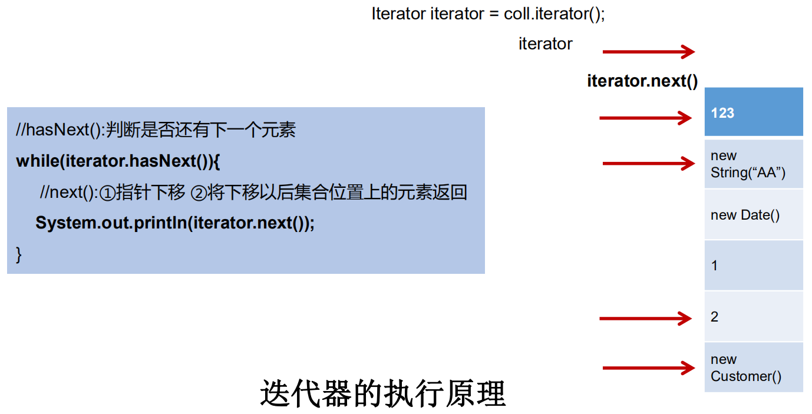


## remove()


```java
@Test
public void test2() {

    Collection<Object> collection = new ArrayList<>();

    collection.add(123);
    collection.add(456);
    collection.add(new Person("Jerry", 20));
    collection.add(new String("Tom"));
    collection.add(false);

    Iterator<Object> iterator = collection.iterator();
    while (iterator.hasNext()) {
        Object next = iterator.next();
        if("Tom".equals(next)){
            iterator.remove();
        }
        System.out.println(next);
    }

    System.out.println("*****************************");

    Iterator<Object> iterator2 = collection.iterator();
    while (iterator2.hasNext()){
        System.out.println(iterator2.next());
    }
}
```


+ 注意： 
    - Iterator可以删除集合的元素，但是是遍历过程中通过迭代器对象的remove方法，不是集合对象的remove方法。
    - 如果还未调用next()或在上一次调用 next 方法之后已经调用了 remove 方法，再调用remove都会报IllegalStateException。


## foreach


+ Java 5.0 提供了 foreach 循环迭代访问 Collection和数组。
+ 遍历操作不需获取Collection或数组的长度，无需使用索引访问元素。
+ 遍历集合的底层调用Iterator完成操作。
+ foreach还可以用来遍历数组。


```java
@Test
public void test3() {

    Collection<Object> collection = new ArrayList<>();

    collection.add(123);
    collection.add(456);
    collection.add(new Person("Jerry", 20));
    collection.add(new String("Tom"));
    collection.add(false);

    //for(集合元素的类型  局部变量 :  集合对象)
    //内部仍然调用了迭代器
    for (Object o : collection) {
        System.out.println(o);
    }

}
```


```java
@Test
public void test4() {
    int[] arr = new int[]{1, 2, 33, 45, 66};
    //for(数组元素的类型  局部变量 :  数组对象)
    for (int i : arr) {
        System.out.println(i);
    }
}
```


## 面试题


```java
@Test
public void test5() {
    
    String[] arr = new String[]{"MM", "MM", "MM"};

    //        方式一：普通for赋值
    //        for (int i = 0; i < arr.length; i++) {
    //            arr[i] = "GG";
    //        }


    //        方式二：增强for循环
    for (String s : arr) {  //s = arr[i] 修改s 跟 arr[i]没关系
        s = "GG";
    }


    for (int i = 0; i < arr.length; i++) {
        System.out.println(arr[i]);
    }
}
```


# 四、Collection子接口一：List


+ 鉴于Java中数组用来存储数据的局限性，我们通常使用List替代数组
+ List集合类中元素有序、且可重复，集合中的每个元素都有其对应的顺序索引。
+ List容器中的元素都对应一个整数型的序号记载其在容器中的位置，可以根据 序号存取容器中的元素。
+ JDK API中List接口的实现类常用的有：ArrayList、LinkedList和Vector。


## 接口方法


List除了从Collection集合继承的方法外，List 集合里添加了一些根据索引来操作集合元素的方法。


+ void add(int index, Object ele):在index位置插入ele元素
+ boolean addAll(int index, Collection eles):从index位置开始将eles中的所有元素添加进来
+ Object get(int index):获取指定index位置的元素


```java
@Test
public void test1() {
    ArrayList list = new ArrayList();
    list.add(123);
    list.add(456);
    list.add("AA");
    list.add(new Person("Tom", 12));
    list.add(456);

    System.out.println(list);
    //void add(int index, Object ele):在index位置插入ele元素
    list.add(1, "BB");
    System.out.println(list);

    //boolean addAll(int index, Collection eles):从index位置开始将eles中的所有元素添加进来
    List<Integer> integers = Arrays.asList(1, 2, 3);
    list.addAll(integers);
    System.out.println(list);


    //Object get(int index):获取指定index位置的元素
    Object o = list.get(0);
    System.out.println(o);
}
```


+ int indexOf(Object obj):返回obj在集合中首次出现的位置
+ int lastIndexOf(Object obj):返回obj在当前集合中末次出现的位置
+ Object remove(int index):移除指定index位置的元素，并返回此元素
+ Object set(int index, Object ele):设置指定index位置的元素为ele
+ List subList(int fromIndex, int toIndex):返回从fromIndex到toIndex位置的子集合


```java
@Test
public void test2(){

    ArrayList list = new ArrayList();
    list.add(123);
    list.add(456);
    list.add("AA");
    list.add(new Person("Tom", 12));
    list.add(456);

    //int indexOf(Object obj):返回obj在集合中首次出现的位置
    int index = list.indexOf(456);
    System.out.println(index);

    //int lastIndexOf(Object obj):返回obj在当前集合中末次出现的位置
    int index2 = list.lastIndexOf(456);
    System.out.println(index2);

    //Object remove(int index):移除指定index位置的元素，并返回此元素
    Object remove = list.remove(0);
    System.out.println(remove);
    System.out.println(list);

    //Object set(int index, Object ele):设置指定index位置的元素为ele
    list.set(1,"CC");
    System.out.println(list);

    //List subList(int fromIndex, int toIndex):返回从fromIndex到toIndex位置的子集合
    List list1 = list.subList(2, 4);
    System.out.println(list1);
    System.out.println(list);
}
```


### 常用方法


+ 增：add(Object obj)
+ 删：remove(int index) / remove(Object obj)
+ 改：set(int index,Object ele)
+ 查：get(int index)
+ 插：add(int index,Object ele)
+ 长度：size()
+ 遍历：Iterator迭代器  增强for    普通for循环（有索引）


## 面试题


```java
    /**
     * 区分List中remove(int index)和remove(Object obj)
     */
    @Test
    public void testListRemove() {
        List list = new ArrayList();
        list.add(1);
        list.add(2);
        list.add(3);
        updateList(list);
        System.out.println(list);//
    }

    private void updateList(List list) {
//        list.remove(2); //index
        list.remove(Integer.valueOf(2));
    }
```


## 面试：ArrayList、LinkedList、Vector三者的异同


+ 同：三个类都是实现了List接口，存储数据的特点相同：存储有序的、可重复的数据
+ 不同： 
    - ArrayList：作为List接口的主要实现类，线程不安全的，效率高；底层使用Object[]存储
    - LinkedList：对于频繁的插入、删除操作，使用此类效率比ArrayList高；底层使用双向链表存储
    - Vector：作为List接口的古老实现类，线程安全的，效率低；底层使用Object[]存储


## ArrayList


+  ArrayList 是 List 接口的典型实现类、主要实现类 
+  本质上，ArrayList是对象引用的一个”变长”数组 
+  ArrayList的JDK1.8之前与之后的实现区别？ 
    - JDK1.7：ArrayList像饿汉式，直接创建一个初始容量为10的数组
    - JDK1.8：ArrayList像懒汉式，一开始创建一个长度为0的数组，当添加第一个元素时再创建一个始容量为10的数组
+  <font style="color:#E8323C;">Arrays.asList(…) 方法返回的 List 集合，既不是 ArrayList 实例，也不是Vector 实例。</font>  
Arrays.asList(…) 返回值是一个<font style="color:#E8323C;">固定长度</font>的 List 集合 


### 原理


```java
*  jdk7情况下：
*  ArrayList list = new ArrayList(); //底层创建了长度是10的Object[]数组 elementData
*  list.add(123); // elementData[0] = new Integer(123);
*  ...
*  list.add(11); //如果此次的添加导致底层elementData数组容量不够，则扩容。
*  默认情况下，扩容为原来的容量的1.5倍，同时需要将原有数组中的数据复制到新的数组中。
*  结论：建议开发中使用带参的构造器：ArrayList list = new ArrayList(int capacity)
*
*
*  jdk8的情况下：
*  ArrayList list = new ArrayList();//底层Object[] elementData初始化为{}，并没有创建长度为10的数组
*  list.add(123); // 第一次调用add()时，底层才创建了长度10的数组，并将数组123添加到 elementData[0]
*  ...
*  后续的添加和扩容操作与jdk7无异

   小结：jdk7中的ArrayList的对象的创建类似于单例的饿汉式，而jdk8中的ArrayList的对象的创建类似于单例的懒汉式，延迟了数组的创建，节省内存
```


## LinkedList


对于**频繁的插入或删除元素**的操作，建议使用LinkedList类，效率较高


+  LinkedList：双向链表，内部没有声明数组，而是定义了Node类型的first和last，用于记录<font style="color:#E8323C;">首末元素</font>。  
同时，定义内部类Node，作为LinkedList中保存数据的基本结构。  
Node除了保存数据，还定义了两个变量： 
    - prev变量记录前一个元素的位置
    - next变量记录下一个元素的位置


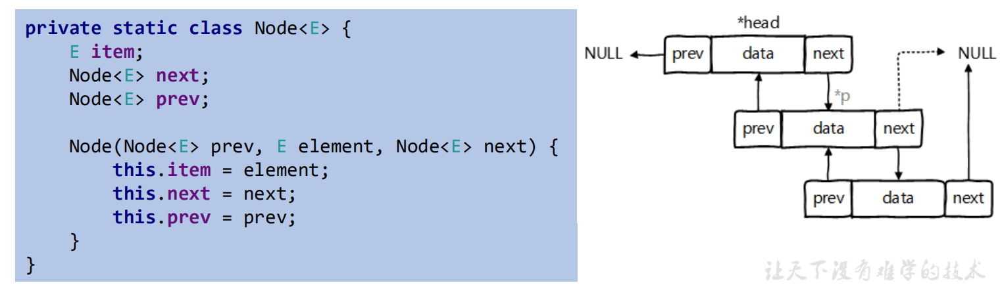


### 原理


```plain
 *  LinkedList list = new LinkedList(); 内部声明了Node类型的first和last属性，属性值为null
 *  list.add(123); //将123封装到Node中，创建了Node对象
```


### 新增方法


+ void addFirst(Object obj)
+ void addLast(Object obj)
+ Object getFirst()
+ Object getLast()
+ Object removeFirst()
+ Object removeLast()


## Vector


+  Vector 是一个古老的集合，JDK1.0就有了。大多数操作与ArrayList相同，区别之处在于Vector是线程安全的。 
+  在各种list中，最好把ArrayList作为缺省选择。当插入、删除频繁时，使用LinkedList；  
Vector总是比ArrayList慢，所以尽量避免使用。 


### 原理


```plain
 *  Vector：jdk7和jdk8中通过Vector()构造器创建对象时，底层都创建了长度为10的数组
 *  在扩容方面，默认扩容为原来的数组长度的2倍
```


### 新增方法


+ void addElement(Object obj)
+ void insertElementAt(Object obj,int index)
+ void setElementAt(Object obj,int index)
+ void removeElement(Object obj)
+ void removeAllElements()


## 面试


请问ArrayList/LinkedList/Vector的异同？谈谈你的理解？ArrayList底层是什么？扩容机制？Vector和ArrayList的最大区别?


+ **ArrayList和LinkedList的异同**


二者都线程不安全，相对线程安全的Vector，执行效率高。


此外，ArrayList是实现了基于<font style="color:#E8323C;">动态数组</font>的数据结构，LinkedList基于<font style="color:#E8323C;">链表</font>的数据结构。


对于<font style="color:#E8323C;">随机访问get和set</font>，ArrayList绝对优于LinkedList，因为LinkedList<font style="color:#E8323C;">要移动指针</font>。


对于<font style="color:#E8323C;">新增和删除操作</font>add(特指插入)和remove，LinkedList比较占优势，因为ArrayList<font style="color:#E8323C;">要移动数据</font>。


+ **ArrayList和Vector的区别**


Vector和ArrayList几乎是完全相同的,唯一的区别在于Vector是同步类(synchronized)，属于强同步类。


因此开销就比ArrayList要大，访问要慢。


正常情况下,大多数的Java程序员使用ArrayList而不是Vector,因为同步完全可以由程序员自己来控制。


Vector每次扩容请求其大<font style="color:#E8323C;">小的2倍空间</font>，而<font style="color:#E8323C;">ArrayList是1.5倍。</font>


Vector还有一个子类Stack。


# 五、Collection子接口二：Set


+ Set接口是Collection的子接口，set接口没有提供额外的方法
+ Set 集合不允许包含相同的元素，如果试把两个相同的元素加入同一个Set 集合中，则添加操作失败。
+ Set 判断两个对象是否相同不是使用 == 运算符，而是根据 equals() 方法


## set接口实现类的对比


+ HashSet：作为Set接口的主要实现类；线程不安全的；可以存储null值
+ LinkedHashSet：作为HashSet的子类；遍历其内部数据时，可以按照添加的顺序遍历
+ TreeSet：可以按照添加对象的指定属性，进行排序


## set的无序性(哈希值决定)与不可重复性


```java
public class SetTest {

    /**
      一、存储无序的、不可重复的数据
      以HashSet为例说明：
      1、无序性：不等于随机性。存储的数据在底层数组中并非按照数组索引的顺序添加，而是根据数据的哈希值决定的

      2、不可重复性：保证添加的元素按照equals()判断时，不能返回true。即：相同的元素只能添加一个
     */
    @Test
    public void test1(){
        Set<Object> set  = new HashSet<>();
        set.add(456);
        set.add(123);
        set.add(123);
        set.add("AA");
        set.add("CC");
        set.add(new User("Tom",23));
        set.add(new User("Tom",23));
        set.add(129);

        Iterator<Object> iterator = set.iterator();
        while (iterator.hasNext()){
            System.out.println(iterator.next());
        }
    }

}
```


## HashSet


#### 元素的添加过程


```java
public class SetTest {

    /**
     二、添加元素的过程：以HashSet为例
        向HashSet中添加元素a，首先调用元素a所在类的hashCode()方法，计算元素a的哈希值，
        此哈希值接着通过某种算法计算出在HashSet底层数组中的存放位置（即为：索引位置），
        判断数组此位置上是否已经有元素：
            如果此位置上没有其他元素，则元素a添加成功。  ---》情况1
            如果此位置上有其他元素b（或以链表形式存在的多个元素）,则比较元素a与元素b的hash值：
                如果hash值不相同，则元素a添加成功。    ---》情况2
                如果hash值相同，进而需要调用元素a所在类的equals()方法：
                    equals()返回true，元素a添加失败
                    equals()返回false，则元素a添加成功。 ---》情况3

            对于添加成功的情况2和情况3而言：元素a 与已经存在指定索引位置上的数据 以链表的方式存储
            jdk7：新的元素a放到数组中，指向原来的元素。
            jdk8：原来的元素在数组中，指向元素a
            总结：七上八下

            HashSet底层：数组+链表的结构

     */
    @Test
    public void test1(){
        Set<Object> set  = new HashSet<>();
        set.add(456);
        set.add(123);
        set.add(123);
        set.add("AA");
        set.add("CC");
        set.add(new User("Tom",23));
        set.add(new User("Tom",23));
        set.add(129);

        Iterator<Object> iterator = set.iterator();
        while (iterator.hasNext()){
            System.out.println(iterator.next());
        }
    }

}
```


#### 关于hashcode()和equals()的重写


+ 重写 hashCode() 方法的基本原则 
    - 在程序运行时，同一个对象多次调用 hashCode() 方法应该返回相同的值。
    - 当两个对象的 equals() 方法比较返回 true 时，这两个对象的 hashCode()方法的返回值也应相等。
    - 对象中用作 equals() 方法比较的 Field，都应该用来计算 hashCode 值。


**重写** **equals()** **方法的基本原则**


以自定义的Customer类为例，何时需要重写equals()？


+  当一个类有自己特有的“逻辑相等”概念,当改写equals()的时候，总是要改写hashCode()，根据一个类的equals方法（改写后），两个截然不同的实例有可能在逻辑上是相等的，但是，根据Object.hashCode()方法，它们仅仅是两个对象。 
+  因此，违反了“相等的对象必须具有相等的散列码”。 
+  结论：复写equals方法的时候一般都需要同时复写hashCode方法。**通常参与计算hashCode的对象的属性也应该参与到equals()中进行计算。** 


#### Eclipse/IDEA工具里hashCode()的重写


以Eclipse/IDEA为例，在自定义类中可以调用工具自动重写equals和hashCode。


问题：为什么用Eclipse/IDEA复写hashCode方法，有31这个数字？


+  选择系数的时候要选择尽量大的系数。因为如果计算出来的hash地址越大，所谓的“冲突”就越少，查找起来效率也会提高。（减少冲突） 
+  并且31只占用5bits,相乘造成数据溢出的概率较小。 
+  31可以 由i*31== (i<<5)-1来表示,现在很多虚拟机里面都有做相关优化。（提高算法效率） 
+  31是一个素数，素数作用就是如果我用一个数字来乘以这个素数，那么最终出来的结果只能被素数本身和被乘数还有1来整除！(减少冲突) 


## LinkedHashSet


+ LinkedHashSet 是 HashSet 的子类
+ LinkedHashSet 根据元素的 hashCode 值来决定元素的存储位置，但它同时使用双向链表维护元素的次序，这使得元素看起来是以插入顺序保存的。
+ LinkedHashSet插入性能略低于 HashSet，但在迭代访问 Set 里的全部元素时有很好的性能。
+ LinkedHashSet 不允许集合元素重复。


```java
//LinkedHashSet作为HashSet的子类，在添加数据的同时，每个数据还维护了两个引用，记录此数据前一个数据和后一个数据。
//优点：对于频繁的遍历操作，LinkedHashSet效率高于HashSet
@Test
public void test2() {
    Set<Object> set = new LinkedHashSet<>();
    set.add(456);
    set.add(123);
    set.add(123);
    set.add("AA");
    set.add("CC");
    set.add(new User("Tom", 23));
    set.add(new User("Tom", 23));
    set.add(129);

    Iterator<Object> iterator = set.iterator();
    while (iterator.hasNext()) {
        System.out.println(iterator.next());
    }
}
```


## TreeSet


+ TreeSet 是 SortedSet 接口的实现类，TreeSet 可以确保集合元素处于排序状态。
+ TreeSet底层使用红黑树结构存储数据
+ 新增的方法如下： (了解) 
    - Comparator comparator()
    - Object first()
    - Object last()
    - Object lower(Object e)
    - Object higher(Object e)
    - SortedSet subSet(fromElement, toElement)
    - SortedSet headSet(toElement)
    - SortedSet tailSet(fromElement)
+ TreeSet 两种排序方法：自然排序和定制排序。默认情况下，TreeSet 采用自然排序。


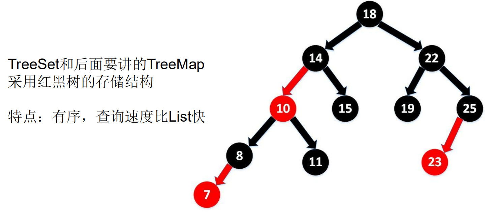


### 自然排序


+  自然排序：TreeSet 会调用集合元素的 compareTo(Object obj) 方法来比较元素之间的大小关系，然后将集合元素按升序(默认情况)排列 
+  如果试图把一个对象添加到 TreeSet 时，则该对象的类必须实现 Comparable接口。 
    - 实现 Comparable 的类必须实现 compareTo(Object obj) 方法，两个对象即通过compareTo(Object obj) 方法的返回值来比较大小。
+  Comparable 的典型实现： 
    - BigDecimal、BigInteger 以及所有的数值型对应的包装类：按它们对应的数值大小进行比较
    - Character：按字符的 unicode值来进行比较
    - Boolean：true 对应的包装类实例大于 false 对应的包装类实例
    - String：按字符串中字符的 unicode 值进行比较
    - Date、Time：后边的时间、日期比前面的时间、日期大
+  向 TreeSet 中添加元素时，只有第一个元素无须比较compareTo()方法，后面添加的所有元素都会调用compareTo()方法进行比较。 
+  因为只有相同类的两个实例才会比较大小，所以向 TreeSet 中添加的应该是同一个类的对象。 
+  对于 TreeSet 集合而言，它判断两个对象是否相等的唯一标准是：两个对象通过 compareTo(Object obj) 方法比较返回值。 
+  当需要把一个对象放入 TreeSet 中，重写该对象对应的 equals() 方法时，应保证该方法与 compareTo(Object obj) 方法有一致的结果：如果两个对象通过equals() 方法比较返回 true，则通过 compareTo(Object obj) 方法比较应返回0。  
否则，让人难以理解。 


```java
    /**
     * 1、向TreeSet中添加的数据，要求是相同类的对象
     * 2、两种排序方式：自然排序（实现Comparable接口）和定制排序（Comparator）
     * 3、自然排序中，比较两个对象是否相同的标准为：compareTo()返回0，不再是equals()
     */
    @Test
    public void test3(){
        TreeSet<Object> set = new TreeSet<>();

        //失败：不能添加不同类的对象
//        set.add(123);
//        set.add(456);
//        set.add("AA");
//        set.add(new User("Tom",12));

        //排序：举例一：
//        set.add(34);
//        set.add(-34);
//        set.add(43);
//        set.add(11);
//        set.add(8);


        set.add(new User("Tom",12));
        set.add(new User("Jerry",32));
        set.add(new User("Jim",2));
        set.add(new User("Mike",65));
        set.add(new User("Jack",33));
        set.add(new User("Jack",56));

        Iterator<Object> iterator = set.iterator();
        while (iterator.hasNext()) {
            System.out.println(iterator.next());
        }
    }
```


### 定制排序


+  TreeSet的自然排序要求元素所属的类实现Comparable接口，如果元素所属的类没有实现Comparable接口，或不希望按照升序(默认情况)的方式排列元素或希望按照其它属性大小进行排序，则考虑使用定制排序。  
定制排序，通过Comparator接口来实现。需要重写compare(T o1,T o2)方法。 
+  利用int compare(T o1,T o2)方法，比较o1和o2的大小：如果方法返回正整数，则表示o1大于o2；如果返回0，表示相等；返回负整数，表示o1小于o2。 
+  要实现定制排序，需要将实现Comparator接口的实例作为形参传递给TreeSet的构造器。 
+  此时，仍然只能向TreeSet中添加类型相同的对象。否则发生ClassCastException异常。 
+  使用定制排序判断两个元素相等的标准是：通过Comparator比较两个元素返回了0。 


```java
/**
 * 4、定制排序中，比较两个对象是否相同的标准为：compare()返回0，不再是equals()
 */
@Test
public void test4() {

    Comparator<User> comparator = new Comparator<User>() {
        @Override
        public int compare(User o1, User o2) {
            return Integer.compare(o1.getAge(), o2.getAge());
        }
    };

    TreeSet<User> set = new TreeSet<>(comparator);
    set.add(new User("Tom", 12));
    set.add(new User("Jerry", 32));
    set.add(new User("Jim", 2));
    set.add(new User("Mike", 65));
    set.add(new User("Jack", 33));
    set.add(new User("Mary", 33));
    set.add(new User("Jack", 56));

    Iterator<User> iterator = set.iterator();
    while (iterator.hasNext()) {
        System.out.println(iterator.next());
    }

}
```


## 面试


+ 在List内去除重复数字值，要求尽量简单


```java
public static void main(String[] args) {
    List list = new ArrayList();
    
    list.add(new Integer(1));
    list.add(new Integer(2));
    list.add(new Integer(2));
    list.add(new Integer(4));
    list.add(new Integer(4));
    
    List list2 = duplicateList(list);
    
    for (Object integer : list2) {
        System.out.println(integer);
    }
}

public static List duplicateList(List list) {
    HashSet set = new HashSet();
    set.addAll(list);
    return new ArrayList(set);
}
```


+ 其中Person类中重写了hashCode()和equals()方法


```java
@Test
public void test(){
    HashSet set = new HashSet();

    Person p1 = new Person(1001,"AA");
    Person p2 = new Person(1002,"BB");
    set.add(p1);
    set.add(p2);

    System.out.println(set); //[Person{id=1002, name='BB'}, Person{id=1001, name='AA'}]

    p1.setName("CC");
    set.remove(p1);
    System.out.println(set); //[Person{id=1002, name='BB'}, Person{id=1001, name='CC'}]

    set.add(new Person(1001,"CC"));
    System.out.println(set); //[Person{id=1002, name='BB'}, Person{id=1001, name='CC'}, Person{id=1001, name='CC'}]

    set.add(new Person(1001,"AA"));
    System.out.println(set); //[Person{id=1002, name='BB'}, Person{id=1001, name='CC'}, Person{id=1001, name='CC'}, Person{id=1001, name='AA'}]
}
```


# 六、Map接口


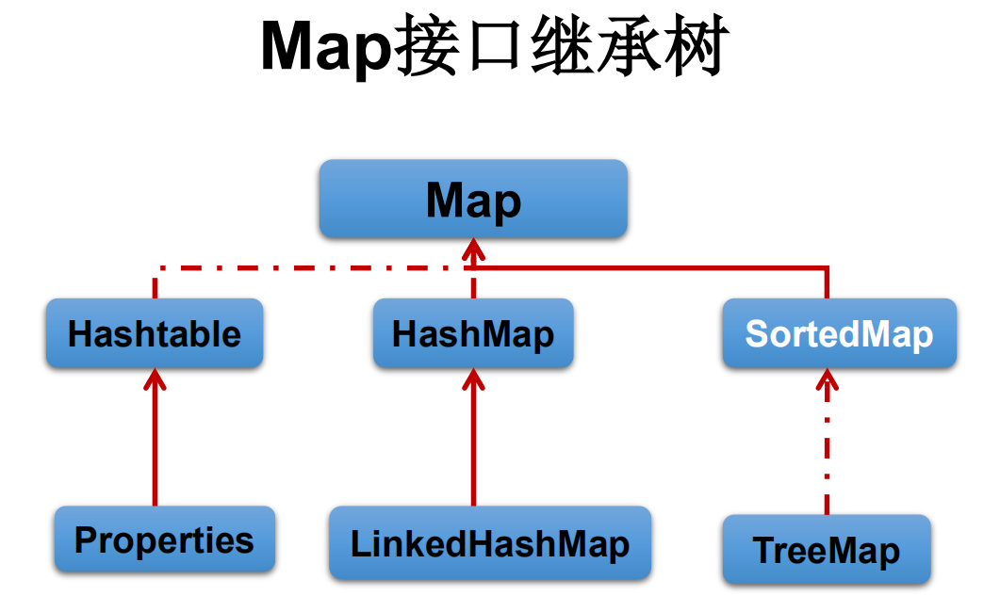


## 概述


+  Map与Collection并列存在。用于保存具有映射关系的数据:key-value 
+  Map 中的 key 和 value 都可以是任何引用类型的数据 
+  Map 中的 <font style="color:#E8323C;">key 用Set来存放，不允许重复</font>，即同一个 Map 对象所对应的类，须重写hashCode()和equals()方法 
+  常用String类作为Map的“键” 
+  key 和 value 之间存在单向一对一关系，即通过指定的 key 总能找到唯一的、确定的 value 
+  Map接口的常用实现类：HashMap、TreeMap、LinkedHashMap和Properties。  
其中，HashMap是 Map 接口使用频率最高的实现类 


## 多个实现类的对比


```java
/***
 *  Map：双列数据，存储key-value对的数据
 *      HashMap：作为Map的主要实现类；线程不安全的，效率高；存储null的key和value
 *          LinkedHashMap：保证在遍历map元素时，可以按照添加的顺序实现遍历。
 *                  原因：在原有的HashMap底层结构基础上，添加了一对指针，指向前一个和后一个元素。
 *                  对于频繁的遍历操作，此类执行效率高于HashMap。
 *      TreeMap：保证按照添加的key-value对进行排序，实现排序遍历。此时考虑key的自然排序或定制排序
 *              底层使用红黑树
 *      Hashtable：作为古老的实现类；线程安全的，效率低；不能存储null的key和value
 *          Properties：常用来处理配置文件。key和value都是String类型
 *
 *      HaspMap的底层：数组+链表（jdk7及以前）
 *      数组+链表+红黑树（jdk8）
 *
 */
public class MapTest {

    @Test
    public void test1() {
        Map map = new HashMap();
//        map = new Hashtable();
        map.put(null, 123);
        map.put(null, null);

    }
}
```


## Map中存储的key-value的特点


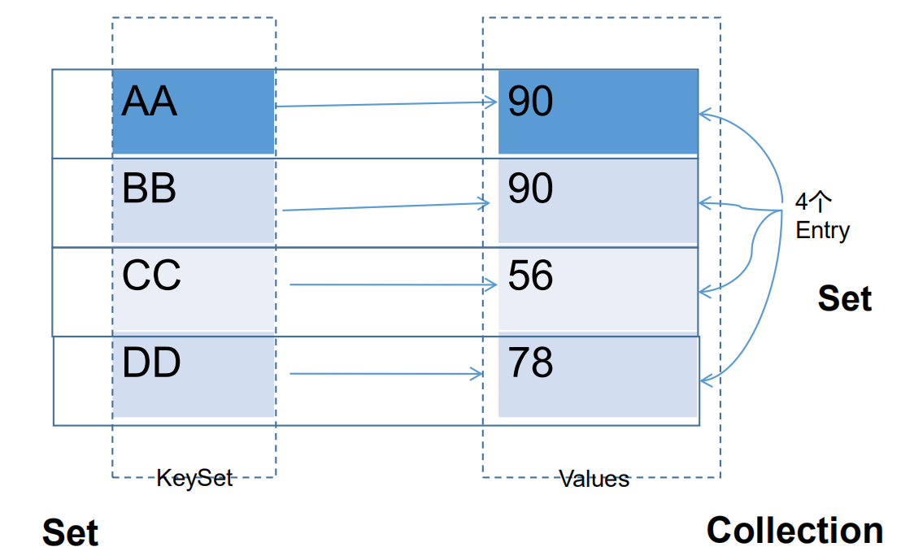


+ Map中的key：<font style="color:#E8323C;">无序的、不可重复的，使用Set存储所有的key</font> ---》 key所在的类要重写equals()和hashCode()（以HashMap为例）
+ Map中的value：<font style="color:#E8323C;">无序的、可重复的，使用Collection存储所有的value</font> ---》 value所在的类要重写equals()
+ 一个键值对：<font style="color:#E8323C;">key-value构成了一个Entry对象</font>。
+ Map中的entry：<font style="color:#E8323C;">无序的、不可重复的，使用Set存储所有的entry。</font>


## Map常用方法


### 添加、删除、修改操作：


+ Object put(Object key,Object value)：将指定key-value添加到(或修改)当前map对象中
+ void putAll(Map m):将m中的所有key-value对存放到当前map中
+ Object remove(Object key)：移除指定key的key-value对，并返回value
+ void clear()：清空当前map中的所有数据


```java
@Test
public void test3() {
    Map map = new HashMap();

    //添加
    map.put("AA", 123);
    map.put(45, 123);
    map.put("BB", 56);
    //修改
    map.put("AA", 87);

    System.out.println(map);


    Map map1 = new HashMap();
    map1.put("CC",123);
    map1.put("DD",123);
    map.putAll(map1);
    System.out.println(map);

    Object cc = map.remove("CC");
    System.out.println(cc);
    System.out.println(map);

    map.clear(); //与map=null操作不同
    System.out.println(map.size());
}
```


### 元素查询的操作：


+ Object get(Object key)：获取指定key对应的value
+ boolean containsKey(Object key)：是否包含指定的key
+ boolean containsValue(Object value)：是否包含指定的value
+ int size()：返回map中key-value对的个数
+ boolean isEmpty()：判断当前map是否为空
+ boolean equals(Object obj)：判断当前map和参数对象obj是否相等


```java
@Test
public void test4() {
    Map map = new HashMap();

    map.put("AA", 123);
    map.put(45, 123);
    map.put("BB", 56);

    System.out.println(map.get("BB")); //56

    boolean isExist = map.containsKey("BB");
    System.out.println(isExist); //true

    boolean b = map.containsValue(123);
    System.out.println(b); //true

    map.clear();
    System.out.println(map.isEmpty());//true
}
```


### 元视图操作的方法：


+ Set keySet()：返回所有key构成的Set集合
+ Collection values()：返回所有value构成的Collection集合
+ Set entrySet()：返回所有key-value对构成的Set集合


```java
@Test
public void test5() {
    Map map = new HashMap();

    map.put("AA", 123);
    map.put(45, 1234);
    map.put("BB", 56);

    //遍历所有的key集：
    Set set = map.keySet();
    Iterator iterator = set.iterator();
    while (iterator.hasNext()) {
        System.out.println(iterator.next());
    }

    System.out.println();

    //遍历所有的value集：
    Collection values = map.values();
    for (Object value : values) {
        System.out.println(value);
    }

    System.out.println();

    //遍历所有的key-value
    //方式一：entrySet()
    Set entrySet = map.entrySet();
    Iterator iterator1 = entrySet.iterator();
    while (iterator1.hasNext()) {
        Object obj = iterator1.next();
        //entrySet集合中的元素都是entry
        Map.Entry entry = (Map.Entry) obj;
        System.out.println(entry.getKey() + "--->" + entry.getValue());
    }


    System.out.println();

    //方式二：
    Set keySet = map.keySet();
    Iterator iterator2 = keySet.iterator();
    while (iterator2.hasNext()) {
        Object key = iterator2.next();
        Object value = map.get(key);
        System.out.println(key + "====" + value);
    }
}
```


## Map实现类之一：HashMap


+ HashMap是 Map 接口使用频率最高的实现类。
+ 允许使用null键和null值，与HashSet一样，不保证映射的顺序。
+ 所有的key构成的集合是Set:无序的、不可重复的。所以，key所在的类要重写：equals()和hashCode()
+ 所有的value构成的集合是Collection:无序的、可以重复的。所以，value所在的类要重写：equals()
+ 一个key-value构成一个entry
+ 所有的entry构成的集合是Set:无序的、不可重复的
+ HashMap 判断两个 key 相等的标准是：两个 key 通过 equals() 方法返回 true，hashCode 值也相等。
+ HashMap 判断两个 value相等的标准是：两个 value 通过 equals() 方法返回 true。


### HashMap在jdk7的底层实现


```plain
*      HashMap map = new HashMap():
*      在实例化以后，底层创建了长度是16的一维数组Entry[] table。
*      …可能已经执行过多次put…
*      map.put(key1,value1)：
*      首先，调用key1所在类的hashCode()计算key1哈希值，此哈希值经过某种算法计算以后，得到在Entry数组中的存放位置。
*      如果此位置上的数据为空，此时的key1-value1添加成功。 ---> 情况1
*      如果此位置上的数据不为空，（意味着此位置上存在一个或多个数据(以链表形式存在)），比较key1和已经存在的一个或多个数据的哈希值：
*      如果key1的哈希值与已经存在的数据的哈希值都不相同，此时key1-value1添加成功。 ---》情况2
*      如果key1的哈希值与已经存在的某一个的数据(key2-value2)的哈希值相同，继续比较：调用key1所在类的equals()方法，比较：
*          如果equals()返回false：此时key1-value1添加成功。 ---》情况3
*          如果equals()返回true：使用value1替换value2。
*
*      补充：关于情况2和情况3：此时key1-value1和原来的数据以链表的方式存储
*
*      在不断的添加过程中，会涉及到扩容问题，当超出临界值(且要存放的位置非空)时，扩容。
       默认的扩容方式：扩容为原来容量的2倍，并将原有的数据复制过来
```


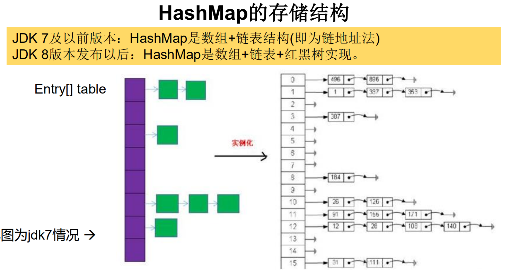


### HashMap在jdk8的底层实现


```plain
*      jdk8 相较于 jdk7 在底层实现方面的不同：
*      1、new HashMap()：底层没有创建一个长度为16的 数组
*      2、jdk8 底层的数组是：Node[]，而非Entry[]
*      3、首次调用put()方法时，底层创建长度为16的数组
*      4、jdk7底层结构只有：数组+链表。jdk8中底层结构：数组+链表+红黑树
*          当数组的某一个索引位置上的元素以链表形式存在的数据个数 > 8且当前数组的长度>64时，
*          此时此索引位置上的所有数据改为使用红黑树存储
```


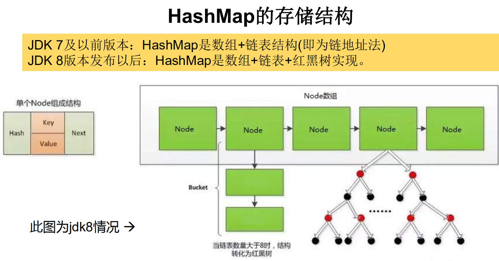


### HashMap源码中的重要常量


+ DEFAULT_INITIAL_CAPACITY : HashMap的默认容量，16
+ MAXIMUM_CAPACITY ： HashMap的最大支持容量，2^30
+ DEFAULT_LOAD_FACTOR：HashMap的默认加载因子，<font style="color:#1750eb;">0.75f</font>
+ REEIFY_THRESHOLD：Bucket中链表长度大于该默认值，转化为红黑树，<font style="color:#1750eb;">8</font>
+ UNTREEIFY_THRESHOLD：Bucket中红黑树存储的Node小于该默认值，转化为链表，<font style="color:#1750eb;">6</font>
+ MIN_TREEIFY_CAPACITY：桶中的Node被树化时最小的hash表容量。（当桶中Node的数量大到需要变红黑树时，若hash表容量小于MIN_TREEIFY_CAPACITY时，此时应执行resize扩容操作这个MIN_TREEIFY_CAPACITY的值至少是TREEIFY_THRESHOLD的4倍。）<font style="color:#1750eb;">64</font>
+ table：存储元素的数组，总是2的n次幂
+ entrySet：存储具体元素的集
+ size：HashMap中存储的键值对的数量
+ modCount：HashMap扩容和结构改变的次数。
+ threshold：扩容的临界值，= 容量*填充因子
+ loadFactor：填充因子，<font style="color:#0033b3;">this</font>.<font style="color:#871094;">loadFactor </font>= <font style="color:#871094;">DEFAULT_LOAD_FACTOR</font>


### HashMap的存储结构：JDK 1.8之前


#### **数组和链表的结合**


当实例化一个HashMap时，系统会创建一个长度为Capacity的Entry数组，这个长度在哈希表中被称为容量(Capacity)，在这个数组中可以存放元素的位置我们称之为“桶”(bucket)，每个bucket都有自己的索引，系统可以根据索引快速的查找bucket中的元素。


+ 每个bucket中存储一个元素，即一个Entry对象，但每一个Entry对象可以带一个引用变量，用于指向下一个元素，因此，在一个桶中，就有可能生成一个Entry链。<font style="color:#E8323C;">而且新添加的元素作为链表的head</font>。


#### 添加元素的过程


向HashMap中添加entry1(key，value)，需要首先计算entry1中key的哈希值(根据key所在类的hashCode()计算得到)，此哈希值经过处理以后，得到在底层Entry[]数组中要存储的位置i。


如果位置i上没有元素，则entry1直接添加成功。如果位置i上已经存在entry2(或还有链表存在的entry3，entry4)，则需要通过循环的方法，依次比较entry1中key和其他的entry。


如果彼此hash值不同，则直接添加成功。


如果hash值不同，继续比较二者是否equals。


如果返回值为true，则使用entry1的value去替换equals为true的entry的value。


如果遍历一遍以后，发现所有的equals返回都为false，则entry1仍可添加成功。<font style="color:#E8323C;">entry1指向原有的entry元素。</font>


#### HashMap的扩容


当HashMap中的元素越来越多的时候，hash冲突的几率也就越来越高，因为数组的长度是固定的。

所以为了提高查询的效率，就要对HashMap的数组进行扩容，而在HashMap数组扩容之后，最消耗性能的点就出现了：<font style="color:#E8323C;">原数组中的数据必须重新计算其在新数组中的位置，并放进去，这就是resize。</font>


#### HashMap什么时候进行扩容呢


当HashMap中的元素个数超过数组大小(数组总大小length，不是数组中个数size)*loadFactor 时 ， 就 会 进 行 数 组 扩 容 ， loadFactor 的默认 值(DEFAULT_LOAD_FACTOR)为0.75，这是一个折中的取值。


也就是说，默认情况下，数组大小(DEFAULT_INITIAL_CAPACITY)为16，那么当HashMap中元素个数超 16*0.75=12（这个值就是代码中的<font style="color:#E8323C;">threshold</font>值，也叫做临界值）的时候，就把数组的大小扩展为 2*16=32，即扩大一倍，然后重新计算每个元素在数组中的位置，


而这是一个非常消耗性能的操作，所以如果我们已经预知HashMap中元素的个数，那么预设元素的个数能够有效的提高HashMap的性能。


### HashMap的存储结构：JDK 1.8


+ HashMap的内部存储结构其实是**数组+链表+树的结合**。


当实例化一个HashMap时，会初始化<font style="color:#E8323C;">initialCapacity</font>和<font style="color:#E8323C;">loadFactor</font>，在put第一对映射关系时，系统会创建一个长度为initialCapacity的Node数组，这个长度在哈希表中被称为容量(Capacity)，在这个数组中可以存放元素的位置我们称之为“桶”(bucket)，每个bucket都有自己的索引，系统可以根据索引快速的查找bucket中的元素。


+ 每个bucket中存储一个元素，即一个Node对象，


但每一个Node对象可以带一个引用变量next，用于指向下一个元素，因此，在一个桶中，就有可能生成一个Node链。

也可能是一个一个TreeNode对象，每一个TreeNode对象可以有两个叶子结点left和right，因此，在一个桶中，就有可能生成一个TreeNode树。

<font style="color:#E8323C;">而新添加的元素作为链表的last，或树的叶子结点。</font>


#### HashMap什么时候进行扩容和树形化呢？


当HashMap中的元素个数超过数组大小(数组总大小length,不是数组中个数size)*loadFactor 时 ， 就会进行数组扩容 ， loadFactor 的默认值(DEFAULT_LOAD_FACTOR)为0.75，这是一个折中的取值。


也就是说，默认情况下，数组大小(DEFAULT_INITIAL_CAPACITY)为16，那么当HashMap中元素个数超过16*0.75=12（这个值就是代码中的threshold值，也叫做临界值）的时候，就把数组的大小扩展为 2*16=32，<font style="color:#E8323C;">即扩大一倍，然后重新计算每个元素在数组中的位置，</font>


而这是一个非常消耗性能的操作，所以如果我们已经预知HashMap中元素的个数，那么预设元素的个数能够有效的提高HashMap的性能。


<font style="color:#E8323C;">当HashMap中的其中一个链的对象个数如果达到了8个，此时如果capacity没有达到64，那么HashMap会先扩容解决</font>，如果已经达到了64，那么这个链会变成树，结点类型由Node变成TreeNode类型。当然，如果当映射关系被移除后，下次<font style="color:#E8323C;">resize</font>方法时判断树的结点个数低于6个，也会把树再转为链表。


#### 关于映射关系的key是否可以修改？


answer：不要修改


映射关系存储到HashMap中会存储key的hash值，这样就不用在每次查找时重新计算每一个Entry或Node（TreeNode）的hash值了，因此如果已经put到Map中的映射关系，再修改key的属性，而这个属性又参与hashcode值的计算，那么会导致匹配不上。


### 总结：JDK1.8相较于之前的变化：


1.  HashMap map = new HashMap();//默认情况下，先不创建长度为16的数组 
2.  当首次调用map.put()时，再创建长度为16的数组 
3.  数组为Node类型，在jdk7中称为Entry类型 
4.  形成链表结构时，<font style="color:#E8323C;">新添加的key-value对在链表的尾部（七上八下） </font>
5.  当数组指定索引位置的链表长度>8时，且map中的数组的长度> 64时，此索引位置上的所有key-value对使用红黑树进行存储。 


### 面试题：


**负载因子值的大小，对HashMap有什么影响**


+ 负载因子的大小决定了HashMap的数据密度。
+ 负载因子<font style="color:#E8323C;">越大密度越大，发生碰撞的几率越高</font>，数组中的链表越容易长,造成查询或插入时的比较次数增多，<font style="color:#E8323C;">性能会下降。</font>
+ 负载因子越小，<font style="color:#E8323C;">就越容易触发扩容，数据密度也越小</font>，意味着发生碰撞的几率越小，数组中的链表也就越短，查询和插入时比较的次数也越小，性能会更高。但是<font style="color:#E8323C;">会浪费一定的内容空间</font>。而且经常扩容也会影响性能，建议初始化预设大一点的空间。
+ <font style="color:#E8323C;">按照其他语言的参考及研究经验，会考虑将负载因子设置为0.7~0.75</font>，此时平均检索长度接近于常数


## Map实现类之二：LinkedHashMap


+  LinkedHashMap 是 HashMap 的子类 
+  在HashMap存储结构的基础上，使用了一对双向链表来记录添加元素的顺序 
+  与LinkedHashSet类似，LinkedHashMap 可以维护 Map 的迭代顺序：迭代顺序与 Key-Value 对的插入顺序一致 


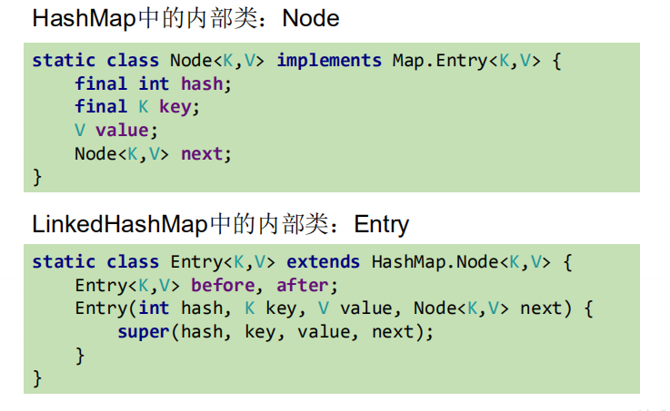


```java
@Test
public void test2(){
    Map map = new HashMap();

    map = new LinkedHashMap();

    map.put(123,"AA");
    map.put(345,"BB");
    map.put(12,"CC");

    System.out.println(map);
}
```


## Map实现类之三：TreeMap


+ TreeMap存储 Key-Value 对时，需要根据 key-value 对进行排序。TreeMap 可以保证所有的 Key-Value 对处于有序状态。
+ TreeSet底层使用红黑树结构存储数据
+ TreeMap 的 Key 的排序： 
    - 自然排序：TreeMap 的所有的 Key 必须实现 Comparable 接口，而且所有的 Key 应该是同一个类的对象，否则将会抛出 ClasssCastException
    - 定制排序：创建 TreeMap 时，传入一个 Comparator 对象，该对象负责对TreeMap 中的所有 key 进行排序。此时不需要 Map 的 Key 实现Comparable 接口
+ TreeMap判断两个key相等的标准：两个key通过compareTo()方法或者compare()方法返回0。


```java
//自然排序
@Test
public void test6() {
    TreeMap<Object, Object> map = new TreeMap<>();

    User u1 = new User("Tom", 23);
    User u2 = new User("Jerry", 32);
    User u3 = new User("Jack", 20);
    User u4 = new User("Rose", 18);

    map.put(u1, 98);
    map.put(u2, 89);
    map.put(u3, 76);
    map.put(u4, 100);

    Set<Map.Entry<Object, Object>> entrySet = map.entrySet();
    Iterator<Map.Entry<Object, Object>> iterator = entrySet.iterator();
    while (iterator.hasNext()){
        Map.Entry<Object, Object> entry = iterator.next();
        System.out.println(entry.getKey()+"--->"+entry.getValue());
    }

}


//定制排序
@Test
public void test7(){
    TreeMap<Object, Object> map = new TreeMap<>(new Comparator<Object>() {
        @Override
        public int compare(Object o1, Object o2) {
            if(o1 instanceof User && o2 instanceof User){
                User u1 = (User) o1;
                User u2 = (User) o2;
                return Integer.compare(u1.getAge(),u2.getAge());
            }
            throw new RuntimeException("传入的数据类型不正确");
        }
    });

    User u1 = new User("Tom", 23);
    User u2 = new User("Jerry", 32);
    User u3 = new User("Jack", 20);
    User u4 = new User("Rose", 18);

    map.put(u1, 98);
    map.put(u2, 89);
    map.put(u3, 76);
    map.put(u4, 100);

    Set<Map.Entry<Object, Object>> entrySet = map.entrySet();
    Iterator<Map.Entry<Object, Object>> iterator = entrySet.iterator();
    while (iterator.hasNext()){
        Map.Entry<Object, Object> entry = iterator.next();
        System.out.println(entry.getKey()+"--->"+entry.getValue());
    }
}
```


## Map实现类之四：Hashtable


+ Hashtable是个古老的 Map 实现类，JDK1.0就提供了。不同于HashMap，Hashtable是线程安全的。
+ Hashtable实现原理和HashMap相同，功能相同。底层都使用哈希表结构，查询速度快，很多情况下可以互用。
+ 与HashMap不同，Hashtable 不允许使用 null 作为 key 和 value
+ 与HashMap一样，Hashtable 也不能保证其中 Key-Value 对的顺序
+ Hashtable判断两个key相等、两个value相等的标准，与HashMap一致。


## Map实现类之五：Properties


+ Properties 类是 Hashtable 的子类，该对象用于处理属性文件
+ 由于属性文件里的 key、value 都是字符串类型，所以 Properties 里的 key和 value 都是字符串类型
+ 存取数据时，建议使用setProperty(String key,String value)方法和getProperty(String key)方法


```java
@Test
public void test() {

    FileInputStream fis = null;
    try {

        Properties properties = new Properties();
        fis = new FileInputStream("jdbc.properties");
        properties.load(fis);

        String name = properties.getProperty("name");
        String password = properties.getProperty("password");
        System.out.println(name);
        System.out.println(password);

    } catch (IOException e) {
        e.printStackTrace();
    } finally {
        if (fis != null) {
            try {
                fis.close();
            } catch (IOException e) {
                e.printStackTrace();
            }
        }
    }
}
```


# 七、Collections工具类


+ Collections 是一个操作 Set、List 和 Map 等集合的工具类
+ Collections 中提供了一系列静态的方法对集合元素进行排序、查询和修改等操作，还提供了对集合对象设置不可变、对集合对象实现同步控制等方法


## 排序操作：（均为static方法）


+ reverse(List)：反转 List 中元素的顺序
+ shuffle(List)：对 List 集合元素进行随机排序
+ sort(List)：根据元素的自然顺序对指定 List 集合元素按升序排序
+ sort(List，Comparator)：根据指定的 Comparator 产生的顺序对 List 集合元素进行排序
+ swap(List，int， int)：将指定 list 集合中的 i 处元素和 j 处元素进行交换


```java
    @Test
    public void test1() {

        List list = new ArrayList();
        list.add(123);
        list.add(43);
        list.add(765);
        list.add(-97);
        list.add(0);

        System.out.println(list);

//        Collections.reverse(list);

//        Collections.shuffle(list);

//        Collections.sort(list);

        Collections.swap(list, 1, 2);
        System.out.println(list);
    }
```


## 查找、替换


+ Object max(Collection)：根据元素的自然顺序，返回给定集合中的最大元素
+ Object max(Collection，Comparator)：根据 Comparator 指定的顺序，返回给定集合中的最大元素
+ Object min(Collection)
+ Object min(Collection，Comparator)
+ int frequency(Collection，Object)：返回指定集合中指定元素的出现次数
+ void copy(List dest,List src)：将src中的内容复制到dest中
+ boolean replaceAll(List list，Object oldVal，Object newVal)：使用新值替换List 对象的所有旧值


```java
    @Test
    public void test2() {
        List list = new ArrayList();
        list.add(123);
        list.add(43);
        list.add(765);
        list.add(765);
        list.add(765);
        list.add(-97);
        list.add(0);


        System.out.println(list);

        int frequency = Collections.frequency(list, 765);
        System.out.println(frequency);

        //报异常 Source does not fit in dest
//        List dest = new ArrayList();
//        Collections.copy(dest, list);

        List dest = Arrays.asList(new Object[list.size()]);
        System.out.println(dest.size()); //list.size();
        Collections.copy(dest, list);

        System.out.println(dest);

    }
```


## 同步控制


Collections 类中提供了多个 synchronizedXxx() 方法，


该方法可使将指定集合包装成线程同步的集合，从而可以解决多线程并发访问集合时的线程安全问题


```java
@Test
public void test2() {
    List list = new ArrayList();
    list.add(123);
    list.add(43);
    list.add(765);
    list.add(-97);
    list.add(0);

    //返回的list1即为线程安全的List
    List list1 = Collections.synchronizedList(list);

}
```


> 更新: 2024-11-12 15:08:11  
> 原文: <https://www.yuque.com/like321/javase/qphd2r>