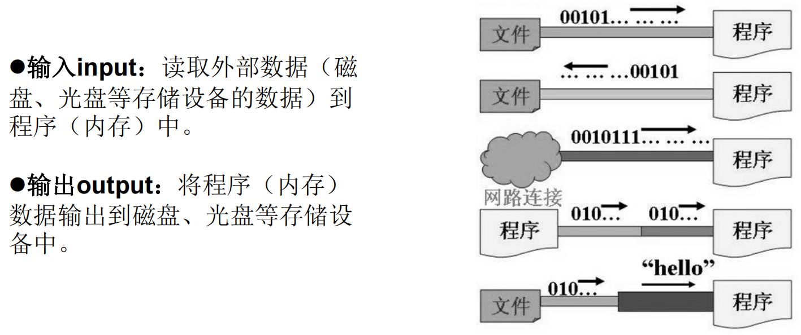
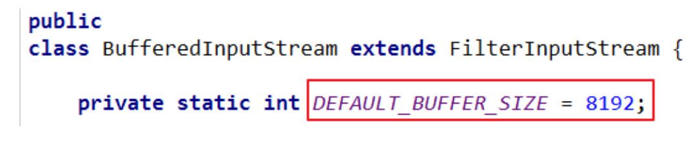

# 十、IO流

# 一、File类的使用


+  java.io.File类：文件和文件目录路径的抽象表示形式，与平台无关 
+  File 能新建、删除、重命名文件和目录，但 File 不能访问文件内容本身。  
如果需要访问文件内容本身，则需要使用输入/输出流。 
+  想要在Java程序中表示一个真实存在的文件或目录，那么必须有一个File对 象，  
但是Java程序中的一个File对象，可能没有一个真实存在的文件或目录。 
+  File对象可以作为参数传递给流的构造器 


## 常用构造器


+  public File(String pathname) 以pathname为路径创建File对象，可以是绝对路径或者相对路径 
    - 绝对路径：是一个固定的路径,从盘符开始
    - 相对路径：是相对于某个位置开始

```java
File file1 = new File("hello.txt");//hello.txt
File file2 = new File("D:\\java_study\\day08\\he.txt");//D:\java_study\day08\he.txt

System.out.println(file1);
System.out.println(file2);
```

+  public File(String parent,String child)       以parent为父路径，child为子路径创建File对象。 


```java
  File file3 = new File("D:\\java_study","day08");
  System.out.println(file3);//D:\java_study\day08
```


+  public File(File parent,String child)           根据一个父File对象和子文件路径创建File对象 

```java
File file4 = new File(file3,"hi.txt");
System.out.println(file4);//D:\java_study\day08\hi.txt
```

 


## 路径分隔符


+  路径中的每级目录之间用一个路径分隔符隔开。 
+  路径分隔符和系统有关： 
    - windows和DOS系统默认使用“\”来表示
    - UNIX和URL使用“/”来表示
+  Java程序支持跨平台运行，因此路径分隔符要慎用。 
+  为了解决这个隐患，File类提供了一个常量： 

```java
public static final String separator  //根据操作系统，动态的提供分隔符
```

 

+  举例： 

```java
File file1 = new File("d:\\atguigu\\info.txt");

File file2 = new File("d:" + File.separator + "atguigu" + File.separator + "info.txt");

File file3 = new File("d:/atguigu");
```

 


## 常用方法


### File类的获取功能


+  

```plain
public String getAbsolutePath()：获取绝对路径
```

 

+  

```plain
public String getPath() ：获取路径
```

 

+  

```plain
public String getName() ：获取名称
```

 

+  

```plain
public String getParent()：获取上层文件目录路径。若无，返回null
```

 

+  

```plain
public long length() ：获取文件长度（即：字节数）。不能获取目录的长度。
```

 

+  

```plain
public long lastModified() ：获取最后一次的修改时间，毫秒值
```

 


```java
@Test
public void test2(){
    File file1 = new File("hello.txt");
    File file2 = new File("d:\\io\\hi.txt");

    System.out.println(file1.getAbsolutePath());
    System.out.println(file1.getPath());
    System.out.println(file1.getName());
    System.out.println(file1.getParent());
    System.out.println(file1.length());
    System.out.println(file1.lastModified());


    System.out.println();

    System.out.println(file2.getAbsolutePath());
    System.out.println(file2.getPath());
    System.out.println(file2.getName());
    System.out.println(file2.getParent());
    System.out.println(file2.length());
    System.out.println(file2.lastModified());

}
```


+  

```plain
public String[] list() ：获取指定目录下的所有文件或者文件目录的名称数组
```

 

+  

```plain
public File[] listFiles() ：获取指定目录下的所有文件或者文件目录的File数组
```

 


```java
@Test
public void test3(){
    File file = new File("D:\\java_study");

    String[] list = file.list();
    for (String s : list) {
        System.out.println(s);
    }

    File[] files = file.listFiles();
    for (File file1 : files) {
        System.out.println(file1);
    }
}
```


### File类的重命名功能


```java
/**
 * 要想保证返回true，需要file1在硬盘中是存在的，且file2不能在硬盘中存在
 */
@Test
public void test4(){

    File file1 = new File("hello.txt");
    File file2 = new File("D:\\io\\hi.txt");

    boolean b = file1.renameTo(file2);
    System.out.println(b);

}
```


### File类的判断功能


+ public boolean isDirectory()：判断是否是文件目录
+ public boolean isFile() ：判断是否是文件
+ public boolean exists() ：判断是否存在
+ public boolean canRead() ：判断是否可读
+ public boolean canWrite() ：判断是否可写
+ public boolean isHidden() ：判断是否隐藏


```java
@Test
public void test5() {
    File file1 = new File("hello1.txt");
    System.out.println(file1.isDirectory()); //false
    System.out.println(file1.isFile()); //true
    System.out.println(file1.exists()); //true
    System.out.println(file1.canRead()); //true
    System.out.println(file1.canWrite()); //true
    System.out.println(file1.isHidden()); //false

    System.out.println();

    File file2 = new File("d:\\io");
    System.out.println(file2.isDirectory()); //true
    System.out.println(file2.isFile()); //false
    System.out.println(file2.exists()); //true
    System.out.println(file2.canRead()); //true
    System.out.println(file2.canWrite()); //true
    System.out.println(file2.isHidden()); //false
}
```


### File类的创建功能


+  public boolean createNewFile() ：创建文件。  
若文件存在，则不创建，返回false 
+  public boolean mkdir() ：创建文件目录。  
如果此文件目录存在，就不创建了。  
如果此文件目录的上层目录不存在，也不创建。 
+  public boolean mkdirs() ：创建文件目录。  
如果上层文件目录不存在，一并创建 
+  注意事项：  
如果你创建文件或者文件目录没有写盘符路径，那么，默认在项目路径下。 


```java
@Test
public void test6() throws IOException {
    File file = new File("hi.txt");

    if (!file.exists()) {
        boolean newFile = file.createNewFile();
        System.out.println("创建：" + newFile);
    } else {
        boolean delete = file.delete();
        System.out.println("删除：" + delete);
    }

}
```


```java
@Test
public void test7() {

    File file = new File("d:\\io\\io1\\io3");
    boolean mkdir = file.mkdir();
    System.out.println("创建1：" + mkdir);

    File file2 = new File("d:\\io\\io2\\io4");
    boolean mkdir2 = file2.mkdirs();
    System.out.println("创建2：" + mkdir2);

}
```


### File类的删除功能


+  public boolean delete()：删除文件或者文件夹 
+  删除注意事项：  
要删除一个文件目录，请注意该文件目录内不能包含文件或者文件目录 


# 二、IO流原理及流的分类


## IO原理


+  I/O是Input/Output的缩写， I/O技术是非常实用的技术，用于处理设备之间的数据传输。  
如读/写文件，网络通讯等。 
+  Java程序中，对于数据的输入/输出操作以“流(stream)” 的方式进行。 
+  java.io包下提供了各种“流”类和接口，用以获取不同种类的数据，并通过标准的方法输入或输出数据。 





## IO流的分类


+ 按操作数据单位不同分为：字节流(8 bit)，字符流(16 bit)
+ 按数据流的流向不同分为：输入流，输出流
+ 按流的角色的不同分为：节点流（文件流），处理流


1. Java的IO流共涉及40多个类，实际上非常规则，都是从如下4个抽象基类派生的。
2. 由这四个类派生出来的子类名称都是以其父类名作为子类名后缀。

| 抽象基类 | 字节流 | 字符流 |
| --- | --- | --- |
| 输入流 | InputStream | Reader |
| 输出流 | OutputStream | Writer |


## IO流的体系结构


```java
/**
 * 一、流的分类：
 *  1、操作数据单位：字节流、字符流
 *  2、数据的流向：输入流、输出流
 *  3、流的角色：节点流、处理流
 *
 *  二、流的体系结构
 *  抽象基类                         节点流(或文件流)                  缓冲流(处理流的一种)
 *  InputStream                     FileInputStream                  BufferedInputStream
 *  OutputStream                    FileOutputStream                 BufferedOutputStream
 *  Reader                          FileReader                       BufferedReader
 *  Writer                          FileWriter                       BufferedWriter
 */
```


## 节点流和处理流


+  节点流：直接从数据源或目的地读写数据  
 
+  处理流：不直接连接到数据源或目的地，而是“连接”在已存在的流（节点流或处理流）之上，通过对数据的处理为程序提供更为强大的读写功能。 


# 三、节点流（或文件流）


## 读取文件（字符）


1.  建立一个流对象，将已存在的一个文件加载进流。  
**FileReader fr = new FileReader(new File("Test.txt"));** 
2.  创建一个临时存放数据的数组。  
**char[] ch = new char[1024];** 
3.  调用流对象的读取方法将流中的数据读入到数组中。  
**fr.read(ch);** 
4.  关闭资源。  
**fr.close();** 


```java
/**
 * 1、read()的理解：返回读入的一个字符。如果达到文件末尾，返回-1
 * 2、异常的处理：为了保证流资源一定可以执行关闭操作。需要使用try-catch-finally处理
 * 3、读入的文件一定要存在，否则就会报FileNotFoundException
 */
@Test
public void testFileReader1() {

    FileReader fileReader = null;

    try {
        //1、实例化File类的对象，指明要操作的文件
        File file = new File("hello.txt"); //相较于当前Module

        //2、提供具体的流
        fileReader = new FileReader(file);

        //3、数据的读入 read()：返回读入的一个字符。如果达到文件末尾，返回-1
//        int read = fileReader.read();
//        while (read != -1) {
//            System.out.println((char) read);
//            read = fileReader.read();
//        }

        //语法上的修改
        int read;
        while ((read = fileReader.read()) != -1) {
            System.out.println((char) read);
        }
    } catch (IOException e) {
        e.printStackTrace();
    } finally {
        //4、流的关闭操作
        if (fileReader != null) {
            try {
                fileReader.close();
            } catch (IOException e) {
                e.printStackTrace();
            }
        }
    }

}
```


```java
/**
 * 对read()操作升级：使用read的重载方法
 */
@Test
public void testFileReader2(){
    FileReader fileReader = null;
    try {
        //1、File类的实例化
        File file = new File("hello.txt");

        //2、流的实例化
        fileReader = new FileReader(file);

        //3、读入的操作 read(char[] cbuf)：返回每次读入cbuf数组中的字符的个数。如果达到文件末尾，返回-1
        char[] cbuf = new char[1024];
        int len;
        while ((len = fileReader.read(cbuf)) != -1) {
//                for (int i = 0; i < len; i++) {
//                    System.out.println(cbuf[i]);
//                }
            String str = new String(cbuf, 0, len);
            System.out.println(str);
        }
    } catch (IOException e) {
        e.printStackTrace();
    } finally {
        if (fileReader != null) {
            //4、资源的关闭
            try {
                fileReader.close();
            } catch (IOException e) {
                e.printStackTrace();
            }
        }
    }
}
```


## 写入文件（字符）


```java
/**
 * 从内存中写出数据到硬盘的文件里
 * 1、输出操作，对应的File可以不存在的。并不会报异常
 * 
 * 2、
 *    File对应的硬盘中的文件如果不存在，在输出的过程中，会自动创建此文件。
 *    File对应的硬盘中的文件如果存在：
 *          如果流使用的构造器是：FileWriter(file,false)/FileWriter(file)：对原有文件的覆盖
 *          如果流使用的构造器是：FileWriter(file,true)：不会对原有文件覆盖，而是在原有文件基础上追加内容
 */
@Test
public void testFileWriter() {
    FileWriter fw = null;

    try {
        //1、提供File类的对象，指明写出到的文件
        File file = new File("hello1.txt");

        //2、提供FileWriter的对象，用于数据的写出
        fw = new FileWriter(file);

        //3、写出的操作
        fw.write("I have a dream!\n");
        fw.write("you need to have a dream!");
    } catch (IOException e) {
        e.printStackTrace();
    } finally {
        if (fw != null) {
            //4、流资源的关闭
            try {
                fw.close();
            } catch (IOException e) {
                e.printStackTrace();
            }
        }
    }

}
```


## 文本文件的复制


```java
@Test
public void testFileReaderFileWriter() {
    FileReader fr = null;
    FileWriter fw = null;

    try {
        //1、创建File类的对象，指明读入和写出的文件
        File srcFile = new File("hello.txt");
        File destFile = new File("hello2.txt");

        //2、创建输入流和输出流的对象
        fr = new FileReader(srcFile);
        fw = new FileWriter(destFile);

        //3、数据的读入和写出操作
        char[] cbuf = new char[1024];
        int len;//记录每次读入到cbuf数组中的字符的个数
        while ((len = fr.read(cbuf)) != -1) {
            //每次写出len个字符
            fw.write(cbuf, 0, len);
        }
    } catch (IOException e) {
        e.printStackTrace();
    } finally {
        //4、关闭流资源
        if (fr != null) {
            try {
                fr.close();
            } catch (IOException e) {
                e.printStackTrace();
            }
        }
        if (fw != null) {
            try {
                fw.close();
            } catch (IOException e) {
                e.printStackTrace();
            }
        }
    }

}
```


## 读取文件（字节）


+  对于文本文件(.txt，.java，.c)，使用字符流处理 
+  对于非文本文件（.jpg，.mp3，.mp4，.avi，.doc，.ppt），使用字节流处理 
+  FileInputStream 操作文本文件，可能会出现乱码 


```java
@Test
public void testFileInputStream() {

    FileInputStream fis = null;
    try {
        File file = new File("hello.txt");

        fis = new FileInputStream(file);

        byte[] buffer = new byte[1024];
        int len;
        while ((len = fis.read(buffer)) != -1) {
            String str = new String(buffer, 0, len);
            System.out.println(str);
        }
    } catch (IOException e) {
        e.printStackTrace();
    } finally {
        if (fis != null) {
            try {
                fis.close();
            } catch (IOException e) {
                e.printStackTrace();
            }
        }
    }

}
```


## 图片的复制


```java
@Test
public void testFileInputOutputStream() {

    FileInputStream fis = null;
    FileOutputStream fos = null;

    try {
        File srcFile = new File("1.jpg");
        File destFile = new File("2.jpg");

        fis = new FileInputStream(srcFile);
        fos = new FileOutputStream(destFile);

        //复制的过程
        byte[] buffer = new byte[1024];
        int len;
        while ((len = fis.read(buffer)) != -1) {
            fos.write(buffer, 0, len);
        }
    } catch (IOException e) {
        e.printStackTrace();
    } finally {
        if (fis != null) {
            try {
                fis.close();
            } catch (IOException e) {
                e.printStackTrace();
            }
        }
        if (fos != null) {
            try {
                fos.close();
            } catch (IOException e) {
                e.printStackTrace();
            }
        }
    }

}
```


# 四、处理流之一：缓冲流


+ 为了提高数据读写的速度，Java API提供了带缓冲功能的流类，在使用这些流类时，会创建一个内部缓冲区数组，缺省使用8192个字节(8Kb)的缓冲区。





+  缓冲流要“套接”在相应的节点流之上，根据数据操作单位可以把缓冲流分为： 
+  BufferedInputStream 和 BufferedOutputStream 
+  BufferedReader 和 BufferedWriter 
+  当读取数据时，数据按块读入缓冲区，其后的读操作则直接访问缓冲区 
+  当使用BufferedInputStream读取字节文件时，BufferedInputStream会一次性从文件中读取8192个(8Kb)，存在缓冲区中，直到缓冲区装满了，才重新从文件中读取下一个8192个字节数组。 
+  向流中写入字节时，不会直接写到文件，先写到缓冲区中直到缓冲区写满，BufferedOutputStream才会把缓冲区中的数据一次性写到文件里。  
使用方法flush()可以强制将缓冲区的内容全部写入输出流 
+  关闭流的顺序和打开流的顺序相反。  
只要关闭最外层流即可，关闭最外层流也会相应关闭内层节点流 
+  flush()方法的使用：手动将buffer中内容写入文件 
+  如果是带缓冲区的流对象的close()方法，不但会关闭流，还会在关闭流之前刷新缓冲区，关闭后不能再写出 


## 字节型


非文本文件的复制


```java
/**
 * 作用：提高流的读取、写入的速度
 *      提高读写速度的原因：内部提供了一个缓冲区
 *
 * 处理流：就是“套接”在已有的流的基础上
 */
@Test
public void BufferedStreamTest() {

    BufferedInputStream bis = null;
    BufferedOutputStream bos = null;

    try {
        File srcFile = new File("1.jpg");
        File destFile = new File("4.jpg");

        FileInputStream fis = new FileInputStream(srcFile);
        FileOutputStream fos = new FileOutputStream(destFile);

        //缓冲流
        bis = new BufferedInputStream(fis);
        bos = new BufferedOutputStream(fos);

        //复制：读取、写入
        byte[] buffer = new byte[1024];
        int len;
        while ((len = bis.read(buffer)) != -1) {
            bos.write(buffer, 0, len);
        }
    } catch (IOException e) {
        e.printStackTrace();
    } finally {
        if (bos != null) {
            try {
                bos.close();
            } catch (IOException e) {
                e.printStackTrace();
            }
        }
        if (bis != null) {
            try {
                bis.close();
            } catch (IOException e) {
                e.printStackTrace();
            }
        }
    }

    //资源关闭
    //要求：先关闭外层的流，再关闭内层的流
    // 说明：关闭外层流的同时，内层流也会自动的进行关闭。所以关于内层流的关闭，可以省略。

    //        fis.close();
    //        fos.close();

}
```


## 字符型


文本文件的复制


+ readLine()


```java
@Test
public void testBufferedReaderBufferWriter() {
    BufferedReader br = null;
    BufferedWriter bw = null;

    try {
        //创建文件和相应的流
        br = new BufferedReader(new FileReader(new File("hello.txt")));
        bw = new BufferedWriter(new FileWriter(new File("hello3.txt")));
        //读写操作
        // 方式一：使用char[]
//            char[] cbuf = new char[1024];
//            int len;
//            while ((len = br.read(cbuf)) != -1) {
//                bw.write(cbuf, 0, len);
//            }

        //方式二：使用String
        String data;
        while ((data = br.readLine()) != null) {
            // 方法一：
//                bw.write(data + "\n"); //data中不包含换行符
            // 方法二：
            bw.write(data);
            bw.newLine(); //提供换行的操作
        }

    } catch (IOException e) {
        e.printStackTrace();
    } finally {
        if (bw != null) {
            //关闭资源
            try {
                bw.close();
            } catch (IOException e) {
                e.printStackTrace();
            }
        }
        if (br != null) {
            try {
                br.close();
            } catch (IOException e) {
                e.printStackTrace();
            }
        }
    }
}
```


## 练习：图片加解密


```java
public class PicTest {

    //图片的加密
    @Test
    public void test1() {

        FileInputStream fis = null;
        FileOutputStream fos = null;

        try {
//        FileInputStream fis = new FileInputStream(new File("1.jpg"));
            fis = new FileInputStream("1.jpg");
            fos = new FileOutputStream("secret.jpg");

            byte[] buffer = new byte[1024];
            int len;
            while ((len = fis.read(buffer)) != -1) {

                //字节数组进行修改
                for (int i = 0; i < len; i++) {
                    buffer[i] = (byte) (buffer[i] ^ 5);
                }

                fos.write(buffer, 0, len);
            }
        } catch (IOException e) {
            e.printStackTrace();
        } finally {
            if (fos != null) {
                try {
                    fos.close();
                } catch (IOException e) {
                    e.printStackTrace();
                }
            }
            if (fis != null) {
                try {
                    fis.close();
                } catch (IOException e) {
                    e.printStackTrace();
                }
            }
        }

    }


    //图片的解密
    @Test
    public void test2() {

        FileInputStream fis = null;
        FileOutputStream fos = null;

        try {
//        FileInputStream fis = new FileInputStream(new File("secret.jpg"));
            fis = new FileInputStream("secret.jpg");
            fos = new FileOutputStream("5.jpg");

            byte[] buffer = new byte[1024];
            int len;
            while ((len = fis.read(buffer)) != -1) {

                //字节数组进行修改
                for (int i = 0; i < len; i++) {
                    buffer[i] = (byte) (buffer[i] ^ 5);
                }

                fos.write(buffer, 0, len);
            }
        } catch (IOException e) {
            e.printStackTrace();
        } finally {
            if (fos != null) {
                try {
                    fos.close();
                } catch (IOException e) {
                    e.printStackTrace();
                }
            }
            if (fis != null) {
                try {
                    fis.close();
                } catch (IOException e) {
                    e.printStackTrace();
                }
            }
        }

    }

}
```


# 五、处理流之二：转换流


+ 转换流提供了在字节流和字符流之间的转换
+ Java API提供了两个转换流： 
    - InputStreamReader：将InputStream转换为Reader
    - OutputStreamWriter：将Writer转换为OutputStream
+ 字节流中的数据都是字符时，转成字符流操作更高效。
+ 很多时候我们使用转换流来处理文件乱码问题。实现编码和解码的功能


## InputStreamReader


+  实现将字节的输入流按指定字符集转换为字符的输入流。 
+  需要和InputStream“套接”。 
+  构造器 
    -  public InputStreamReader(InputStream in) 
    -  public InputSreamReader(InputStream in,String charsetName) 

```java
如： Reader isr = new InputStreamReader(System.in,"gbk");
```

 


```java
/**
 * 处理流之二：转换流
 * 1、转换流：属于字符流
 * InputStreamReader：将一个字节的输入流转换为字符的输入流
 * OutputStreamWriter：将一个字符的输出流转换为字节的输出流
 * <p>
 * 2、作用：提供字节流与字符流之间的转换
 * <p>
 * 3、解码：字节、字节数组  ---》 字符数组、字符串
 * 编码：字符数组、字符串 ---》字节、字节数组
 * <p>
 * 4、字符集
 */
public class InputStreamReaderTest {

    /**
     * InputStreamReader的使用，实现字节的输入流到字符的输入流的转换
     */
    @Test
    public void test1() {
        InputStreamReader isr = null;
        try {
            //字节流
            FileInputStream fis = new FileInputStream("hello.txt");

            //字节转字符
//        InputStreamReader isr = new InputStreamReader(fis);//使用系统默认的字符集
            //参数2：指明字符集，具体使用哪个字符集，取决于文件hello.txt保存时，使用的字符集
            isr = new InputStreamReader(fis, "UTF-8");

            char[] cbuf = new char[1024];
            int len;
            while ((len = isr.read(cbuf)) != -1) {
                String str = new String(cbuf, 0, len);
                System.out.println(str);
            }

        } catch (IOException e) {
            e.printStackTrace();
        } finally {
            if (isr != null) {
                try {
                    isr.close();
                } catch (IOException e) {
                    e.printStackTrace();
                }
            }
        }

    }

}
```


## OutputStreamWriter


+ 实现将字符的输出流按指定字符集转换为字节的输出流。
+ 需要和OutputStream“套接”。
+ 构造器 
    - public OutputStreamWriter(OutputStream out)
    - public OutputSreamWriter(OutputStream out, String charsetName)


```java
@Test
public void test2() {
    
    InputStreamReader isr = null;
    OutputStreamWriter osw = null;
    
    try {
        //1、造文件、造流
        File file1 = new File("hello.txt");
        File file2 = new File("hello_gbk.txt");

        FileInputStream fis = new FileInputStream(file1);
        FileOutputStream fos = new FileOutputStream(file2);

        isr = new InputStreamReader(fis, "utf-8");
        osw = new OutputStreamWriter(fos, "gbk");

        //2、读写过程
        char[] cbuf = new char[1024];
        int len;
        while ((len = isr.read(cbuf)) != -1) {
            osw.write(cbuf, 0, len);
        }
    } catch (IOException e) {
        e.printStackTrace();
    } finally {
        if (isr != null) {
            //3、关闭资源
            try {
                isr.close();
            } catch (IOException e) {
                e.printStackTrace();
            }
        }
        if (osw != null) {
            try {
                osw.close();
            } catch (IOException e) {
                e.printStackTrace();
            }
        }
    }
}
```


## 转换流实现文件的读入和写出


```java
public void testMyInput() throws Exception {

    FileInputStream fis = new FileInputStream("dbcp.txt");
    FileOutputStream fos = new FileOutputStream("dbcp5.txt");

    InputStreamReader isr = new InputStreamReader(fis, "GBK");
    OutputStreamWriter osw = new OutputStreamWriter(fos, "GBK");

    BufferedReader br = new BufferedReader(isr);
    BufferedWriter bw = new BufferedWriter(osw);
    
    String str = null;
    while ((str = br.readLine()) != null) {
        bw.write(str);
        bw.newLine();
        bw.flush();
    }
    
    bw.close();
    br.close();
}
```


# 六、处理流之三：标准输入、输出流


+  System.in和System.out分别代表了系统标准的输入和输出设备 
+  默认输入设备是：键盘，  
输出设备是：显示器 
+  System.in的类型是InputStream 
+  System.out的类型是PrintStream，其是OutputStream的子类  
    FilterOutputStream 的子类 
+  重定向：通过System类的setIn，setOut方法对默认设备进行改变。 
    - public static void setIn(InputStream in)
    - public static void setOut(PrintStream out)


```java
/**
 * 1、标准的输入、输出流
 * System.in：标准的输入流，默认从键盘输入
 * System.out：标准的输出流，默认从控制台输出
 * <p>
 * System类的setIn(InputStream is) / setOut(PrintStream ps) 方式重新指定输入和输出的流
 */
public static void main(String[] args) {

    //从键盘输入字符串，要求将读取到的整行字符串转成大写输出。
    // 然后继续进行输入操作，直至当输入“e”或者“exit”时，退出程序。

//        方法一：使用Scanner实现，调用next()返回一个字符串

//        方法二：使用System.in实现。System.in ---》转换流 ---》BufferedReader的readLine()
    BufferedReader br = null;
    try {
        //转换流
        InputStreamReader isr = new InputStreamReader(System.in);
        //字符流
        br = new BufferedReader(isr);

        while (true) {

            System.out.println("请输入字符串：");

            String data = br.readLine();
            if ("e".equalsIgnoreCase(data) || "exit".equalsIgnoreCase(data)) {
                System.out.println("程序结束");
                break;
            }

            String toUpperCase = data.toUpperCase();
            System.out.println(toUpperCase);
        }
    } catch (IOException e) {
        e.printStackTrace();
    } finally {
        if (br != null) {
            try {
                br.close();
            } catch (IOException e) {
                e.printStackTrace();
            }
        }
    }

}
```


# 七、处理流之四：打印流


+  实现将基本数据类型的数据格式转化为字符串输出 
+  打印流：PrintStream和PrintWriter 
    - 提供了一系列重载的print()和println()方法，用于多种数据类型的输出
    - PrintStream和PrintWriter的输出不会抛出IOException异常
    - PrintStream和PrintWriter有自动flush功能
    - PrintStream 打印的所有字符都使用平台的默认字符编码转换为字节。  
在需要写入字符而不是写入字节的情况下，应该使用 PrintWriter 类。
    - System.out返回的是PrintStream的实例


```java
/**
 * 打印流：PrintStream 和 PrintWriter
 * <p>
 * 提供了一系列重载的print() 和 println()
 */
@Test
public void test() {
    
    PrintStream ps = null;

    try {

        FileOutputStream fos = new FileOutputStream(new File("D:\\IO\\text.txt"));

        // 创建打印输出流,设置为自动刷新模式(写入换行符或字节 '\n' 时都会刷新输出缓冲区)
        ps = new PrintStream(fos, true);
        if (ps != null) {
            // 把标准输出流(控制台输出)改成文件
            System.setOut(ps);
        }
        
        for (int i = 0; i <= 255; i++) { // 输出ASCII字符
            System.out.print((char) i);
            if (i % 50 == 0) { // 每50个数据一行
                System.out.println(); // 换行
            }
        }
        
    } catch (FileNotFoundException e) {
        e.printStackTrace();
    } finally {
        if (ps != null) {
            ps.close();
        }
    }

}
```


# 八、处理流之五：数据流


+  为了方便地操作Java语言的基本数据类型和String的数据，可以使用数据流。 
+  数据流有两个类：(用于读取和写出基本数据类型、String类的数据） 
    - DataInputStream 和 DataOutputStream
    - 分别“套接”在 InputStream 和 OutputStream 子类的流上
+  DataInputStream中的方法 
    -     boolean readBoolean()	 byte readByte()
    -     char readChar()                  float readFloat()
    -     double readDouble()         short readShort()
    -     long readLong()                  int readInt()
    -     String readUTF()                 void readFully(byte[] b)
+  DataOutputStream中的方法 
    - 将上述的方法的read改为相应的write即可。


```java
/**
 * 将内存中的字符串、基本数据类型的变量写出到文件中。
 */
@Test
public void test3() {

    DataOutputStream dos = null;
    try {
        dos = new DataOutputStream(new FileOutputStream("data.txt"));

        dos.writeUTF("张三");
        dos.flush(); //刷新操作，将内存中的数据写入文件
        dos.writeInt(23);
        dos.flush();
        dos.writeBoolean(true);
        dos.flush();
    } catch (IOException e) {
        e.printStackTrace();
    } finally {
        if (dos != null) {
            try {
                dos.close();
            } catch (IOException e) {
                e.printStackTrace();
            }
        }
    }

}


/**
 * 将文件中存储的基本数据类型变量和字符串读取到内存中
 * <p>
 * 注意：读取不同类型的数据的顺序要与当初写入文件时，保存的数据的顺序一致！
 */
@Test
public void test4() {

    DataInputStream dis = null;
    try {
        dis = new DataInputStream(new FileInputStream("data.txt"));

        String name = dis.readUTF();
        int age = dis.readInt();
        boolean isMale = dis.readBoolean();

        System.out.println(name);
        System.out.println(age);
        System.out.println(isMale);
    } catch (IOException e) {
        e.printStackTrace();
    } finally {
        if (dis != null) {
            try {
                dis.close();
            } catch (IOException e) {
                e.printStackTrace();
            }
        }
    }

}
```


# 九、处理流之六：对象流


+  ObjectInputStream和OjbectOutputSteam 
    -  用于存储和读取基本数据类型数据或对象的处理流。  
它的强大之处就是可以把Java中的对象写入到数据源中，也能把对象从数据源中还原回来。 
+  序列化：用ObjectOutputStream类保存基本类型数据或对象的机制 
+  反序列化：用ObjectInputStream类读取基本类型数据或对象的机制 
+  ObjectOutputStream和ObjectInputStream不能序列化static和transient修饰的成员变量 


## 对象的序列化


+  **对象序列化机制**允许把内存中的Java对象转换成平台无关的二进制流，从而允许把这种二进制流持久地保存在磁盘上，或通过网络将这种二进制流传输到另一个网络节点。//当其它程序获取了这种二进制流，就可以恢复成原来的Java对象 
+  序列化的好处在于可将任何实现了Serializable接口的对象转化为**字节数据**，使其在保存和传输时可被还原 
+  序列化是 RMI（Remote Method Invoke – 远程方法调用）过程的参数和返回值都必须实现的机制，而 RMI 是 JavaEE 的基础。  
因此序列化机制是JavaEE 平台的基础 
+  如果需要让某个对象支持序列化机制，则必须让对象所属的类及其属性是可序列化的，为了让某个类是可序列化的，该类必须实现如下两个接口之一。  
否则，会抛出NotSerializableException异常 
    - **Serializable**
    - Externalizable


## 使用对象流序列化对象


+  若某个类实现了 Serializable 接口，该类的对象就是可序列化的： 
    - **创建一个** **ObjectOutputStream**
    - **调用** **ObjectOutputStream** **对象的** **writeObject(对象) **方法输出可序列化对象
    - **注意写出一次，操作flush()一次**
+  反序列化 
    - **创建一个** **ObjectInputStream**
    - **调用** **readObject()** **方法读取流中的对象**
+  **强调：**如果某个类的属性不是基本数据类型或 String 类型，而是另一个引用类型，  
那么这个引用类型必须是可序列化的，否则拥有该类型的Field 的类也不能序列化 


```java
/**
 * 对象流的使用
 * 1、ObjectInputStream 和 ObjectOutputStream
 * 2、作用：用于存储和读取基本数据类型数据或对象的处理流。
 * 它的强大之处就是可以把Java中的对象写入到数据源中，也能把对象从数据源中还原回来。
 */
public class ObjectInputOutputStreamTest {

    /**
     * 序列化过程：将内存中的java对象保存到磁盘中或通过网络传输出去
     * 使用ObjectOutputStream实现
     */
    @Test
    public void testObjectOutputStream() {
        ObjectOutputStream oos = null;

        try {
            // 1、造流
            oos = new ObjectOutputStream(new FileOutputStream("object.dat"));
            // 2、写出
            oos.writeObject(new String("我爱北京天安门"));
            oos.flush();//刷新操作
        } catch (IOException e) {
            e.printStackTrace();
        } finally {
            if (oos != null) {
                // 3、关闭
                try {
                    oos.close();
                } catch (IOException e) {
                    e.printStackTrace();
                }
            }
        }

    }


    /**
     * 反序列化
     */
    @Test
    public void testObjectInputStream(){
        ObjectInputStream ois = null;

        try {
            //1、造流
            ois = new ObjectInputStream(new FileInputStream("object.dat"));

            // 2、读文件
            Object object = ois.readObject();
            String str = (String) object;
            System.out.println(str);
        } catch (IOException e) {
            e.printStackTrace();
        } catch (ClassNotFoundException e) {
            e.printStackTrace();
        } finally {
            try {
                ois.close();
            } catch (IOException e) {
                e.printStackTrace();
            }
        }


    }

}
```


## 自定义类实现序列化和反序列化


+  凡是实现Serializable接口的类都有一个表示序列化版本标识符的静态变量： 
    -  **private static final long serialVersionUID;** 
    -  serialVersionUID用来表明类的不同版本间的兼容性。简言之，其目的是以序列化对象进行版本控制，有关各版本反序列化时是否兼容。 
    -  如果类没有显示定义这个静态常量，它的值是Java运行时环境根据类的内部细节自动生成的。  
若类的实例变量做了修改，serialVersionUID 可能发生变化。故建议，显式声明。 
+  简单来说，Java的序列化机制是通过在运行时判断类的serialVersionUID来验证版本一致性的。  
在进行反序列化时，JVM会把传来的字节流中的serialVersionUID与本地相应实体类的serialVersionUID进行比较，如果相同就认为是一致的，可以进行反序列化，否则就会出现序列化版本不一致的异常。(InvalidCastException) 


```java
/**
 * Person类需要满足如下要求：
 *
 * 1、需要实现接口：Serializable
 *
 * 2、当前类提供一个全局常量：serialVersionUID
 *
 * 3、除了当前Person类需要实现Serializable接口之外，还必须保证其内部所有属性也必须是可序列化的。（默认情况下，基本数据类型可序列化）
 *
 */
public class Person implements Serializable {

    public static final long serialVersionUID = 4235546452L;

    private String name;
    private int age;

    public Person() {
    }

    public Person(String name, int age) {
        this.name = name;
        this.age = age;
    }

    public String getName() {
        return name;
    }

    public void setName(String name) {
        this.name = name;
    }

    public int getAge() {
        return age;
    }

    public void setAge(int age) {
        this.age = age;
    }

    @Override
    public String toString() {
        return "Person{" +
                "name='" + name + '\'' +
                ", age=" + age +
                '}';
    }

}
```


```java
/**
 * 对象流的使用
 * 1、ObjectInputStream 和 ObjectOutputStream
 * 2、作用：用于存储和读取基本数据类型数据或对象的处理流。
 * 它的强大之处就是可以把Java中的对象写入到数据源中，也能把对象从数据源中还原回来。
 *
 * 3、要想一个java对象是可序列化的，需要满足相应的要求。见Person类
 */
public class ObjectInputOutputStreamTest {

    /**
     * 序列化过程：将内存中的java对象保存到磁盘中或通过网络传输出去
     * 使用ObjectOutputStream实现
     */
    @Test
    public void testObjectOutputStream() {
        ObjectOutputStream oos = null;

        try {
            // 1、造流
            oos = new ObjectOutputStream(new FileOutputStream("object.dat"));
            // 2、写出
            oos.writeObject(new Person("张三",23));
            oos.flush();//刷新操作
        } catch (IOException e) {
            e.printStackTrace();
        } finally {
            if (oos != null) {
                // 3、关闭
                try {
                    oos.close();
                } catch (IOException e) {
                    e.printStackTrace();
                }
            }
        }

    }


    /**
     * 反序列化
     */
    @Test
    public void testObjectInputStream(){
        ObjectInputStream ois = null;

        try {
            //1、造流
            ois = new ObjectInputStream(new FileInputStream("object.dat"));

            // 2、读文件
            Object object = ois.readObject();
            Person person = (Person) object;
            System.out.println(person);
        } catch (IOException e) {
            e.printStackTrace();
        } catch (ClassNotFoundException e) {
            e.printStackTrace();
        } finally {
            try {
                ois.close();
            } catch (IOException e) {
                e.printStackTrace();
            }
        }


    }

}
```


# 十、随机存取文件流


+  RandomAccessFile 声明在java.io包下，但直接继承于java.lang.Object类。  
并且它实现了DataInput、DataOutput这两个接口，也就意味着这个类既可以读也可以写。 
+  RandomAccessFile 类支持 “随机访问” 的方式，程序可以直接跳到文件的任意地方来**读、写文件** 
    - 支持只访问文件的部分内容
    - 可以向已存在的文件后追加内容
+  RandomAccessFile 对象包含一个记录指针，用以标示当前读写处的位置。  
RandomAccessFile 类对象可以自由移动记录指针： 
    - long getFilePointer()：获取文件记录指针的当前位置
    - void seek(long pos)：将文件记录指针定位到 pos 位置
+  构造器 
    - public RandomAccessFile(File file, String mode)
    - public RandomAccessFile(String name, String mode)
+  创建 RandomAccessFile 类实例需要指定一个 mode 参数，该参数指定 RandomAccessFile 的访问模式： 
    - r: 以只读方式打开
    - rw：打开以便读取和写入
    - rwd：打开以便读取和写入；同步文件内容的更新
    - rws：打开以便读取和写入；同步文件内容和元数据的更新
+  如果模式为只读r。则不会创建文件，而是会去读取一个已经存在的文件，如果读取的文件不存在则会出现异常。  
如果模式为rw读写。如果文件不存在则会去创建文件，如果存在则不会创建。 


## 读写操作


```java
/**
 * RandomAccessFile的使用：
 * 1、RandomAccessFile直接继承于java.lang.Object类，实现了DataInput和DataOutput接口
 * 2、RandomAccessFile既可以作为一个输入流，又可以作为一个输出流
 */
@Test
public void test1() {

    RandomAccessFile raf1 = null;
    RandomAccessFile raf2 = null;
    try {
        //1、
        raf1 = new RandomAccessFile(new File("1.jpg"), "r");
        raf2 = new RandomAccessFile(new File("11.jpg"), "rw");

        //2、
        byte[] buffer = new byte[1024];
        int len;
        while ((len = raf1.read(buffer)) != -1) {
            raf2.write(buffer, 0, len);
        }
    } catch (IOException e) {
        e.printStackTrace();
    } finally {
        //3、
        if (raf1 != null) {
            try {
                raf1.close();
            } catch (IOException e) {
                e.printStackTrace();
            }
        }
        if (raf2 != null) {
            try {
                raf2.close();
            } catch (IOException e) {
                e.printStackTrace();
            }
        }
    }

}
```


```java
/**
 * 3、如果RandomAccessFile作为输出流时，写出到的文件如果不存在，则在执行过程中自动创建
 * 如果写出到的文件存在，则会对原有文件内容进行覆盖。（默认情况下，从头覆盖）
 */
@Test
public void test2() {

    RandomAccessFile raf1 = null;
    try {
        raf1 = new RandomAccessFile("hello.txt", "rw");

        raf1.write("xyz".getBytes());
    } catch (IOException e) {
        e.printStackTrace();
    } finally {
        if (raf1 != null) {
            try {
                raf1.close();
            } catch (IOException e) {
                e.printStackTrace();
            }
        }
    }

}
```


## 实现数据的插入


```java
/**
 * 可以通过相关的操作，实现RandomAccessFile实现数据的“插入”效果
 */
@Test
public void test3() {

    RandomAccessFile raf1 = null;

    try {
        raf1 = new RandomAccessFile("hello.txt", "rw");
        raf1.seek(3); //将指针调到角标为3的位置

        //保存指针3后面的所有数据到StringBuilder中
        long length = new File("hello.txt").length();
        StringBuilder sb = new StringBuilder((int) length);

        byte[] buffer = new byte[1024];
        int len;
        while ((len = raf1.read(buffer)) != -1) {
            sb.append(new String(buffer, 0, len));
        }

        //调回指针，写入"xyz"
        raf1.seek(3);
        raf1.write("xyz".getBytes());

        //将StringBuilder中的数据写入到文件中
        raf1.write(sb.toString().getBytes());
    } catch (IOException e) {
        e.printStackTrace();
    } finally {
        if (raf1 != null) {
            try {
                raf1.close();
            } catch (IOException e) {
                e.printStackTrace();
            }
        }
    }

}
```


我们可以用RandomAccessFile这个类，来实现一个多线程断点下载的功能，


用过下载工具的朋友们都知道，下载前都会建立两个临时文件，


一个是与被下载文件大小相同的空文件，另一个是记录文件指针的位置文件，


每次暂停的时候，都会保存上一次的指针，然后断点下载的时候，会继续从上一次的地方下载，从而实现断点下载或上传的功能，


有兴趣的朋友们可以自己实现下。


# 十一、NIO.2中Path、Paths、Files类的使用


## java NIO概述


+  Java NIO (New IO，Non-Blocking IO)是从Java 1.4版本开始引入的一套新 的IO API，可以替代标准的Java IO API。  
NIO与原来的IO有同样的作用和目的，但是使用的方式完全不同，  
NIO支持面向缓冲区的(IO是面向流的)、基于通道的IO操作。  
NIO将以更加高效的方式进行文件的读写操作。 
+  Java API中提供了两套NIO，一套是针对标准输入输出NIO，另一套就是网络编程NIO。 
+  |-----java.nio.channels.Channel 
    - |-----FileChannel：处理本地文件
    - |-----SocketChannel：TCP网络编程的客户端的Channel
    - |-----ServerSocketChanne：TCP网络编程的服务器端的Channel
    - |-----DatagramChannel：UDP网络编程中发送端和接收端的Channel


## NIO.2


随着 JDK 7 的发布，Java对NIO进行了极大的扩展，增强了对文件处理和文件系统特性的支持，以至于我们称他们为 NIO.2。


因为 NIO 提供的一些功能，NIO已经成为文件处理中越来越重要的部分。


## NIO.2中Path、Paths、Files类的使用


+  早期的Java只提供了一个File类来访问文件系统，但File类的功能比较有限，所提供的方法性能也不高。而且，大多数方法在出错时仅返回失败，并不会提供异常信息。 
+  NIO. 2为了弥补这种不足，引入了Path接口，代表一个平台无关的平台路径，描述了目录结构中文件的位置。Path可以看成是File类的升级版本，实际引用的资源也可以不存在。 
+  在以前IO操作都是这样写的: 

```java
import java.io.File;

File file = new File("index.html");
```

 

+  但在Java7 中，我们可以这样写： 

```java
import java.nio.file.Path; 

import java.nio.file.Paths; 

Path path = Paths.get("index.html");
```

 

+  同时，NIO.2在java.nio.file包下还提供了Files、Paths工具类，Files包含了大量静态的工具方法来操作文件；Paths则包含了两个返回Path的静态工厂方法。 
+  Paths 类提供的静态 get() 方法用来获取 Path 对象： 
    - static Path get(String first, String … more) : 用于将多个字符串串连成路径
    - static Path get(URI uri): 返回指定uri对应的Path路径


## Path接口


Path 常用方法：


+ String toString() ： 返回调用 Path 对象的字符串表示形式
+ boolean startsWith(String path) : 判断是否以 path 路径开始
+ boolean endsWith(String path) : 判断是否以 path 路径结束
+ boolean isAbsolute() : 判断是否是绝对路径
+ Path getParent() ：返回Path对象包含整个路径，不包含 Path 对象指定的文件路径
+ Path getRoot() ：返回调用 Path 对象的根路径
+ Path getFileName() : 返回与调用 Path 对象关联的文件名
+ int getNameCount() : 返回Path 根目录后面元素的数量
+ Path getName(int idx) : 返回指定索引位置 idx 的路径名称
+ Path toAbsolutePath() : 作为绝对路径返回调用 Path 对象
+ Path resolve(Path p) :合并两个路径，返回合并后的路径对应的Path对象
+ File toFile(): 将Path转化为File类的对象


## Files类


java.nio.file.Files 用于操作文件或目录的工具类。


**Files常用方法：**


+ Path copy(Path src, Path dest, CopyOption … how) : 文件的复制
+ Path createDirectory(Path path, FileAttribute<?> … attr) : 创建一个目录
+ Path createFile(Path path, FileAttribute<?> … arr) : 创建一个文件
+ void delete(Path path) : 删除一个文件/目录，如果不存在，执行报错
+ void deleteIfExists(Path path) : Path对应的文件/目录如果存在，执行删除
+ Path move(Path src, Path dest, CopyOption…how) : 将 src 移动到 dest 位置
+ long size(Path path) : 返回 path 指定文件的大小


**用于判断**


+ boolean exists(Path path, LinkOption … opts) : 判断文件是否存在
+ boolean isDirectory(Path path, LinkOption … opts) : 判断是否是目录
+ boolean isRegularFile(Path path, LinkOption … opts) : 判断是否是文件
+ boolean isHidden(Path path) : 判断是否是隐藏文件
+ boolean isReadable(Path path) : 判断文件是否可读
+ boolean isWritable(Path path) : 判断文件是否可写
+ boolean notExists(Path path, LinkOption … opts) : 判断文件是否不存在


**用于操作内容**


+ SeekableByteChannel newByteChannel(Path path, OpenOption…how) : 获取与指定文件的连接，how 指定打开方式。
+ DirectoryStream newDirectoryStream(Path path) : 打开 path 指定的目录
+ InputStream newInputStream(Path path, OpenOption…how):获取 InputStream 对象
+ OutputStream newOutputStream(Path path, OpenOption…how) : 获取 OutputStream 对象


> 更新: 2023-06-12 14:04:02  
> 原文: <https://www.yuque.com/like321/javase/nk5mn9>