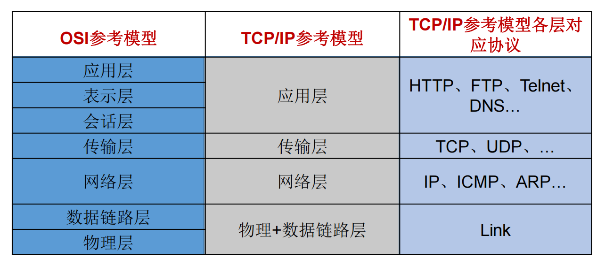
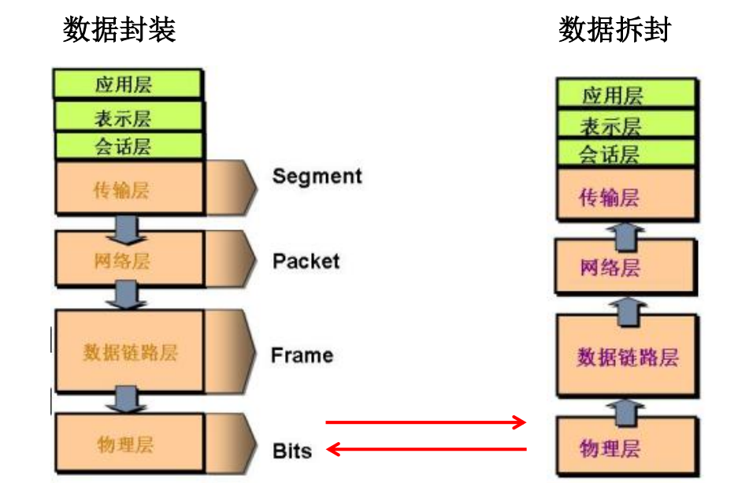
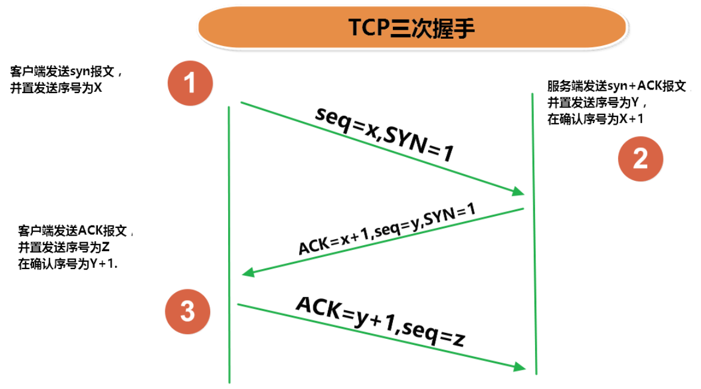
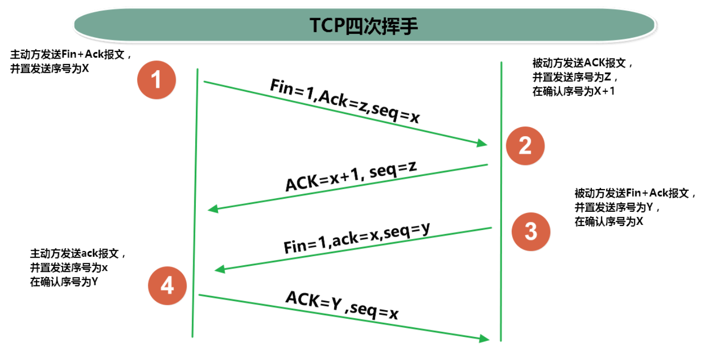
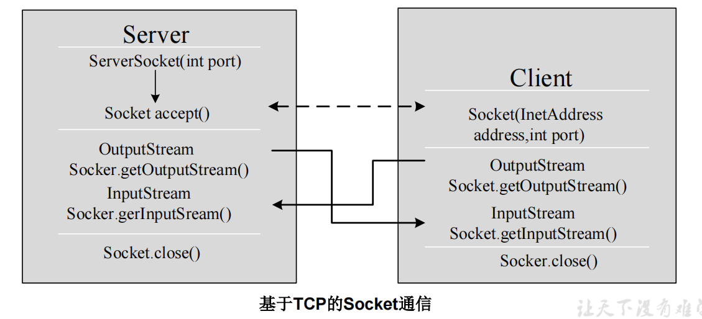
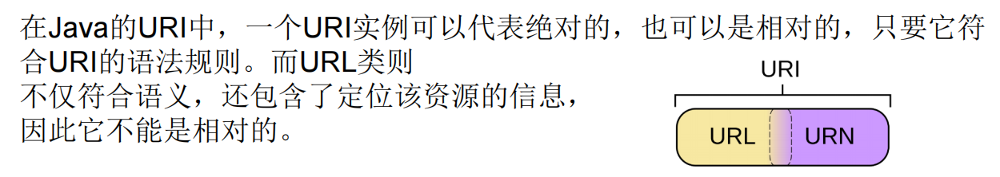

# 十一、网络编程

# 一、网络编程概述


+  Java是 Internet 上的语言，它从语言级上提供了对网络应用程序的支持，程序员能够很容易开发常见的网络应用程序。 
+  Java提供的网络类库，可以实现无痛的网络连接，联网的底层细节被隐藏在 Java 的本机安装系统里，由 JVM 进行控制。  
并且 Java 实现了一个跨平台的网络库，程序员面对的是一个统一的网络编程环境。 


# 二、网络通信要素概述


+ IP和端口号
+ 网络通信协议


## 如何实现网络中的主机互相通信


+ 通信双方地址 
    - IP
    - 端口号
+ 一定的规则（即：网络通信协议。有两套参考模型）
    - OSI参考模型：模型过于理想化，未能在因特网上进行广泛推广
    - TCP/IP参考模型(或TCP/IP协议)：事实上的国际标准。


## 网络通信协议








# 三、通信要素1：IP和端口号


## IP 地址：InetAddress


+  唯一的标识 Internet 上的计算机（通信实体） 
+  本地回环地址(hostAddress)：127.0.0.1     主机名(hostName)：localhost 
+  IP地址分类方式1：IPV4 和 IPV6 
    -  IPV4：4个字节组成，4个0-255。大概42亿，30亿都在北美，亚洲4亿。  
2011年初已经用尽。  
以点分十进制表示，如192.168.0.1 
    -  IPV6：128位（16个字节），写成8个无符号整数，每个整数用四个十六进制位表示，数之间用冒号（：）分开，  
如：3ffe:3201:1401:1280:c8ff:fe4d:db39:1984 
+  IP地址分类方式2：公网地址(万维网使用)和私有地址(局域网使用)。  
192.168.开头的就是私有址址，范围即为192.168.0.0--192.168.255.255，专门为组织机构内部使用 
+  特点：不易记忆 


## 端口号标识正在计算机上运行的进程（程序）


+  不同的进程有不同的端口号 
+  被规定为一个 16 位的整数 0~65535。 
+  端口分类： 
    - 公认端口：0~1023。被预先定义的服务通信占用（如：HTTP占用端口80，FTP占用端口21，Telnet占用端口23）
    - 注册端口：1024~49151。分配给用户进程或应用程序。（如：Tomcat占用端口8080，MySQL占用端口3306，Oracle占用端口1521等）。
    - 动态/私有端口：49152~65535。
+  端口号与IP地址的组合得出一个网络套接字：Socket。 


## InetAddress类


+  Internet上的主机有两种方式表示地址： 
    - 域名(hostName)：www.atguigu.com
    - IP 地址(hostAddress)：202.108.35.210
+  InetAddress类主要表示IP地址，两个子类： 
    -  Inet4Address、 
    -  Inet6Address。 
+  InetAddress 类 对 象 含 有 一 个 Internet 主 机 地 址 的 域 名 和 IP 地 址 ：  
www.atguigu.com 和 202.108.35.210。 
+  域名容易记忆，当在连接网络时输入一个主机的域名后，域名服务器(DNS)负责将域名转化成IP地址，这样才能和主机建立连接。 **-----域名解析** 
+  InetAddress类没有提供公共的构造器，而是提供了如下几个静态方法来获取InetAddress实例 
    - public static InetAddress getLocalHost()
    - public static InetAddress getByName(String host)
+  InetAddress提供了如下几个常用的方法 
    - public String getHostAddress()：返回 IP 地址字符串（以文本表现形式）。
    - public String getHostName()：获取此 IP 地址的主机名
    - public boolean isReachable(int timeout)：测试是否可以达到该地址


```java
/**
 * 1、IP：唯一的表示Internet上的计算机（通信实体）
 * 2、在Java中使用InetAddress类代表IP
 * 3、IP分类：IPv4 和 IPv6;  万维网 和 局域网
 * 4、域名：www.baidu.com www.mi.com
 *
 * 5、本地回路地址： 127.0.0.1 对应着  localhost
 *
 * 6、如何实例化InetAddress：两个方法：getByName(String host)、getLocalHost()
 *
 * 两个常用方法：getHostName() / getHostAddress()
 *
 */
public static void main(String[] args) {

    try {
        InetAddress inet1 = InetAddress.getByName("192.168.10.14");
        System.out.println(inet1);

        InetAddress inet2 = InetAddress.getByName("www.atguigu.com");
        System.out.println(inet2);

        InetAddress inet3 = InetAddress.getByName("127.0.0.1");
        System.out.println(inet3);

        //获取本地IP
        InetAddress localHost = InetAddress.getLocalHost();
        System.out.println(localHost);


        //getHostName()
        System.out.println(inet2.getHostName());

        //getHostAddress()
        System.out.println(inet2.getHostAddress());

    } catch (UnknownHostException e) {
        e.printStackTrace();
    }

}
```


# 四、通信要素2：网络协议


+  **网络通信协议**  
计算机网络中实现通信必须有一些约定，即通信协议，  
对速率、传输代码、代码结构、传输控制步骤、出错控制等制定标准。 
+  **问题：网络协议太复杂** 


计算机网络通信涉及内容很多，比如指定源地址和目标地址，加密解密，压缩解压缩，差错控制，流量控制，路由控制，如何实现如此复杂的网络协议呢？


+  **通信协议分层的思想**  
在制定协议时，把复杂成份分解成一些简单的成份，再将它们复合起来。  
最常用的复合方式是层次方式，即同层间可以通信、上一层可以调用下一层，而与再下一层不发生关系。  
各层互不影响，利于系统的开发和扩展。 


## TCP/IP协议簇


+  传输层协议中有两个非常重要的协议： 
    - 传输控制协议TCP(Transmission Control Protocol)
    - 用户数据报协议UDP(User Datagram Protocol)。
+  TCP/IP 以其两个主要协议：  
传输控制协议(TCP)和网络互联协议(IP)而得名，  
实际上是一组协议，包括多个具有不同功能且互为关联的协议。 
+  IP(Internet Protocol)协议是网络层的主要协议，支持网间互连的数据通信。 
+  TCP/IP协议模型从更实用的角度出发，形成了高效的四层体系结构，  
即物理链路层、IP层、传输层和应用层。 


## TCP 和 UDP


### TCP协议：


+ 使用TCP协议前，须先建立TCP连接，形成传输数据通道
+ 传输前，采用“三次握手”方式，点对点通信，是可靠的
+ TCP协议进行通信的两个应用进程：客户端、服务端。
+ 在连接中可进行大数据量的传输
+ 传输完毕，需释放已建立的连接，效率低


### UDP协议：


+ 将数据、源、目的地封装成数据包，不需要建立连接
+ 每个数据报的大小限制在64K内
+ 发送不管对方是否准备好，接收方收到也不确认，故是不可靠的
+ 可以广播发送
+ 发送数据结束时无需释放资源，开销小，速度快








## Socket


+ 利用套接字（Socket）开发网络应用程序早已被广泛的采用，以至于成为事实上的标准。
+ 网络上具有唯一标识的IP地址和端口号组合在一起才能构成唯一能识别的标识符套接字。
+ 通信的两端都要有Socket，是两台机器间通信的端点。
+ 网络通信其实就是Socket间的通信。
+ Socket允许程序把网络连接当成一个流，数据在两个Socket间通过IO传输。
+ 一般主动发起通信的应用程序属客户端，等待通信请求的为服务端。
+ Socket分类： 
    - 流套接字（stream socket）：使用TCP提供可依赖的字节流服务
    - 数据报套接字（datagram socket）：使用UDP提供“尽力而为”的数据报服务


### Socket类的常用构造器：


```java
public Socket(InetAddress address,int port)		//创建一个流套接字并将其连接到指定 IP 地址的指定端口号。 

public Socket(String host,int port)				//创建一个流套接字并将其连接到指定主机上的指定端口号。
```


### Socket类的常用方法：


```java
public InputStream getInputStream()		//返回此套接字的输入流。可以用于接收网络消息

public OutputStream getOutputStream()	//返回此套接字的输出流。可以用于发送网络消息
    
public InetAddress getInetAddress()		//此套接字连接到的远程 IP 地址；如果套接字是未连接的，则返回 null。 
    
public InetAddress getLocalAddress()	//获取套接字绑定的本地地址。 即本端的IP地址
    
public int getPort()					//此套接字连接到的远程端口号；如果尚未连接套接字，则返回 0。 
    
public int getLocalPort()				//返回此套接字绑定到的本地端口。 如果尚未绑定套接字，则返回 -1。即本端的端口号。 
    
public void close()						//关闭此套接字。套接字被关闭后，便不可在以后的网络连接中使用（即无法重新连接或重新绑定）。需要创建新的套接字对象。 关闭此套接字也将会关闭该套接字的 InputStream 和 OutputStream。 
           
public void shutdownInput()				//如果在套接字上调用 shutdownInput() 后从套接字输入流读取内容，则流将返回 EOF（文件结束符）。 即不能在从此套接字的输入流中接收任何数据。 
    
public void shutdownOutput()			//禁用此套接字的输出流。对于 TCP 套接字，任何以前写入的数据都将被发送，并且后跟 TCP 的正常连接终止序列。 如果在套接字上调用 shutdownOutput() 后写入套接字输出流，则该流将抛出 IOException。 即不能通过此套接字的输出流发送任何数据。
```


# 五、TCP网络编程


## 基于Socket的TCP编程


Java语言的基于套接字编程分为服务端编程和客户端编程，其通信模型如图所示：





## 客户端创建Socket对象


+  客户端程序可以使用Socket类创建对象，创建的同时会自动向服务器方发起连接。  
Socket的构造器是： 
    - Socket(String host,int port) throws UnknownHostException,IOException：向服务器(域名是host。端口号为port)发起TCP连接，若成功，则创建Socket对象，否则抛出异常。
    - Socket(InetAddress address,int port)throws IOException：根据InetAddress对象所表示的IP地址以及端口号port发起连接。
+  客户端建立socketAtClient对象的过程就是向服务器发出套接字连接请求 


### 四个基本的步骤：


+  创建 Socket：  
根据指定服务端的 IP 地址或端口号构造Socket类对象。若服务器端响应，则建立客户端到服务器的通信线路。  
若连接失败，会出现异常。 
+  打开连接到 Socket 的输入/出流： 进行数据传输  
使用 getInputStream()方法获得输入流，  
使用getOutputStream()方法获得输出流， 
+  按照一定的协议对 Socket 进行读/写操作：  
通过输入流读取服务器放入线路的信息（但不能读取自己放入线路的信息），通过输出流将信息写入线程。 
+  关闭 Socket：断开客户端到服务器的连接，释放线路 


## 服务器建立 ServerSocket 对象


+  ServerSocket 对象负责等待客户端请求建立套接字连接，类似邮局某个窗口中的业务员。  
也就是说，服务器必须事先建立一个等待客户请求建立套接字连接的ServerSocket对象。 
+  所谓“接收”客户的套接字请求，就是accept()方法会返回一个 Socket 对象 


### 四个基本的步骤：


+ 调用 ServerSocket(int port) ：创建一个服务器端套接字，并绑定到指定端口上。用于监听客户端的请求。
+ 调用 accept()：监听连接请求，如果客户端请求连接，则接受连接，返回通信套接字对象。
+ 调用 该Socket类对象的 getOutputStream() 和 getInputStream ()：获取输出流和输入流，开始网络数据的发送和接收。
+ 关闭ServerSocket和Socket对象：客户端访问结束，关闭通信套接字。


## 案例


+ 客户端发送内容给服务端，服务端将内容打印到控制台上。


```java
/**
 * 实现TCP的网络编程
 * 
 */
public class TcpTest {


    @Test
    public void client() {
        Socket socket = null;
        OutputStream os = null;
        try {
            //1、创建Socket对象，指明服务器端的IP和端口号
            InetAddress inetAddress = InetAddress.getByName("127.0.0.1");
            socket = new Socket(inetAddress, 8899);
            //2、获取一个输出流，用于输出数据
            os = socket.getOutputStream();
            //3、写出数据
            os.write("你好，我是客户端".getBytes());
        } catch (IOException e) {
            e.printStackTrace();
        } finally {
            //4、资源的关闭
            if (os != null) {
                try {
                    os.close();
                } catch (IOException e) {
                    e.printStackTrace();
                }
            }
            if (socket != null) {
                try {
                    socket.close();
                } catch (IOException e) {
                    e.printStackTrace();
                }
            }
        }


    }

    @Test
    public void server() {

        ServerSocket serverSocket = null;
        Socket accept = null;
        InputStream is = null;
        ByteArrayOutputStream baos = null;

        try {
            //1、创建服务器端的socket对象，指明自己的端口号
            serverSocket = new ServerSocket(8899);
            //2、调用accept()方法表示接收来自于客户端的socket
            accept = serverSocket.accept();
            //3、获取输入流
            is = accept.getInputStream();

            //不建议这样写，可能会有乱码
//        byte[] buffer = new byte[1024];
//        int len;
//        while ((len = is.read(buffer)) != -1) {
//            String str = new String(buffer, 0, len);
//            System.out.print(str);
//        }

            //4、读取输入流中的数据
            baos = new ByteArrayOutputStream();
            byte[] buffer = new byte[1024];
            int len;
            while ((len = is.read(buffer)) != -1) {
                baos.write(buffer, 0, len);
            }

            System.out.println(baos.toString());

            //获取客户端信息
            InetAddress inetAddress = accept.getInetAddress();
            System.out.println("收到来自于："+inetAddress.getHostAddress()+"的数据");

        } catch (IOException e) {
            e.printStackTrace();
        } finally {
            //5、资源关闭
            if (baos != null) {
                try {
                    baos.close();
                } catch (IOException e) {
                    e.printStackTrace();
                }
            }
            if (is != null) {
                try {
                    is.close();
                } catch (IOException e) {
                    e.printStackTrace();
                }
            }
            if (accept != null) {
                try {
                    accept.close();
                } catch (IOException e) {
                    e.printStackTrace();
                }
            }
            if (serverSocket != null) {
                try {
                    serverSocket.close();
                } catch (IOException e) {
                    e.printStackTrace();
                }
            }
        }


    }

}
```


+ 客户端发送文件给服务端，服务端将文件保存在本地。


```java
/**
 * 实现TCP的网络编程
 * 
 */
public class TcpTest {


    @Test
    public void client() {

        Socket socket = null;
        OutputStream os = null;
        FileInputStream fis = null;

        try {
            //1、创建Socket对象，指明服务器端的IP和端口号
            InetAddress inetAddress = InetAddress.getByName("127.0.0.1");
            socket = new Socket(inetAddress, 9090);

            //2、获取一个输出流，用于输出数据
            os = socket.getOutputStream();

            //3、读取图片
            fis = new FileInputStream(new File("1.jpg"));

            //4、写出数据
            byte[] buffer = new byte[1024];
            int len;
            while ((len = fis.read(buffer)) != -1) {
                os.write(buffer, 0, len);
            }

        } catch (IOException e) {
            e.printStackTrace();
        } finally {
            //5、资源的关闭
            if (fis != null) {
                try {
                    fis.close();
                } catch (IOException e) {
                    e.printStackTrace();
                }
            }
            if (os != null) {
                try {
                    os.close();
                } catch (IOException e) {
                    e.printStackTrace();
                }
            }
            if (socket != null) {
                try {
                    socket.close();
                } catch (IOException e) {
                    e.printStackTrace();
                }
            }
        }

    }

    @Test
    public void server() {

        ServerSocket serverSocket = null;
        Socket accept = null;
        InputStream is = null;
        FileOutputStream fos = null;


        try {
            //1、创建服务器端的socket对象，指明自己的端口号
            serverSocket = new ServerSocket(9090);
            //2、调用accept()方法表示接收来自于客户端的socket
            accept = serverSocket.accept();
            //3、获取输入流
            is = accept.getInputStream();
            //4、
            fos = new FileOutputStream(new File("111.jpg"));


            //5、读取输入流中的数据
            byte[] buffer = new byte[1024];
            int len;
            while ((len = is.read(buffer)) != -1) {
                fos.write(buffer, 0, len);
            }

        } catch (IOException e) {
            e.printStackTrace();
        } finally {
            //6、资源关闭
            if (fos != null) {
                try {
                    fos.close();
                } catch (IOException e) {
                    e.printStackTrace();
                }
            }
            if (is != null) {
                try {
                    is.close();
                } catch (IOException e) {
                    e.printStackTrace();
                }
            }
            if (accept != null) {
                try {
                    accept.close();
                } catch (IOException e) {
                    e.printStackTrace();
                }
            }
            if (serverSocket != null) {
                try {
                    serverSocket.close();
                } catch (IOException e) {
                    e.printStackTrace();
                }
            }
        }

    }


}
```


+ 从客户端发送文件给服务端，服务端保存到本地。	并返回“发送成功”给客户端。	并关闭相应的连接。


```java
/**
 * 实现TCP的网络编程
 */
public class TcpTest {


    @Test
    public void client() {

        Socket socket = null;
        OutputStream os = null;
        FileInputStream fis = null;
        ByteArrayOutputStream baos = null;
        InputStream is = null;
        try {
            //1、创建Socket对象，指明服务器端的IP和端口号
            InetAddress inetAddress = InetAddress.getByName("127.0.0.1");
            socket = new Socket(inetAddress, 9090);

            //2、获取一个输出流，用于输出数据
            os = socket.getOutputStream();

            //3、读取图片
            fis = new FileInputStream(new File("1.jpg"));

            //4、写出数据
            byte[] buffer = new byte[1024];
            int len;
            while ((len = fis.read(buffer)) != -1) {
                os.write(buffer, 0, len);
            }
            //关闭数据的输出
            socket.shutdownOutput();


            //5、接收来自服务器端的数据，并显示到控制台上
            is = socket.getInputStream();
            baos = new ByteArrayOutputStream();
            byte[] buffers = new byte[1024];
            int len2;
            while ((len2 = is.read(buffers)) != -1) {
                baos.write(buffers, 0, len2);
            }
            System.out.println(baos.toString());


        } catch (IOException e) {
            e.printStackTrace();
        } finally {
            //5、资源的关闭
            if (is != null) {
                try {
                    is.close();
                } catch (IOException e) {
                    e.printStackTrace();
                }
            }
            if (baos != null) {
                try {
                    baos.close();
                } catch (IOException e) {
                    e.printStackTrace();
                }
            }
            if (fis != null) {
                try {
                    fis.close();
                } catch (IOException e) {
                    e.printStackTrace();
                }
            }
            if (os != null) {
                try {
                    os.close();
                } catch (IOException e) {
                    e.printStackTrace();
                }
            }
            if (socket != null) {
                try {
                    socket.close();
                } catch (IOException e) {
                    e.printStackTrace();
                }
            }
        }

    }

    @Test
    public void server() {

        ServerSocket serverSocket = null;
        Socket accept = null;
        InputStream is = null;
        FileOutputStream fos = null;
        OutputStream os = null;

        try {
            //1、创建服务器端的socket对象，指明自己的端口号
            serverSocket = new ServerSocket(9090);
            //2、调用accept()方法表示接收来自于客户端的socket
            accept = serverSocket.accept();
            //3、获取输入流
            is = accept.getInputStream();
            //4、
            fos = new FileOutputStream(new File("222.jpg"));


            //5、读取输入流中的数据
            byte[] buffer = new byte[1024];
            int len;
            while ((len = is.read(buffer)) != -1) {
                fos.write(buffer, 0, len);
            }


            // 6、服务器端给予客户端反馈
            os = accept.getOutputStream();
            os.write("你好，美女，照片我已收到，非常漂亮".getBytes());

        } catch (IOException e) {
            e.printStackTrace();
        } finally {
            //6、资源关闭
            if (os != null) {
                try {
                    os.close();
                } catch (IOException e) {
                    e.printStackTrace();
                }
            }
            if (fos != null) {
                try {
                    fos.close();
                } catch (IOException e) {
                    e.printStackTrace();
                }
            }
            if (is != null) {
                try {
                    is.close();
                } catch (IOException e) {
                    e.printStackTrace();
                }
            }
            if (accept != null) {
                try {
                    accept.close();
                } catch (IOException e) {
                    e.printStackTrace();
                }
            }
            if (serverSocket != null) {
                try {
                    serverSocket.close();
                } catch (IOException e) {
                    e.printStackTrace();
                }
            }
        }

    }


}
```


# 六、UDP网络编程


## UDP网络通信


+  类 DatagramSocket 和 DatagramPacket 实现了基于 UDP 协议网络程序。 
+  UDP数据报通过数据报套接字 DatagramSocket 发送和接收，  
系统不保证UDP数据报一定能够安全送到目的地，也不能确定什么时候可以抵达。 
+  DatagramPacket 对象封装了UDP数据报，在数据报中包含了发送端的IP地址和端口号以及接收端的IP地址和端口号。 
+  UDP协议中每个数据报都给出了完整的地址信息，因此无须建立发送方和接收方的连接。如同发快递包裹一样。 


流 程：


1. DatagramSocket与DatagramPacket
2. 建立发送端，接收端
3. 建立数据包
4. 调用Socket的发送、接收方法
5. 关闭Socket


发送端与接收端是两个独立的运行程序


```java
/**
 * UDP协议的网络编程
 */
public class UDPTest {


    @Test
    public void send() {
        DatagramSocket datagramSocket = null;
        try {
            datagramSocket = new DatagramSocket();

            String str = "我是UDP方式发送的导弹";
            byte[] bytes = str.getBytes();
            InetAddress inetAddress = InetAddress.getLocalHost();
            DatagramPacket datagramPacket = new DatagramPacket(bytes, 0, bytes.length, inetAddress, 9090);

            datagramSocket.send(datagramPacket);
        } catch (IOException e) {
            e.printStackTrace();
        } finally {
            if (datagramSocket != null) {
                datagramSocket.close();
            }
        }
    }

    @Test
    public void receive() {

        DatagramSocket datagramSocket = null;
        try {
            datagramSocket = new DatagramSocket(9090);

            byte[] buffer = new byte[1024];
            DatagramPacket datagramPacket = new DatagramPacket(buffer, 0, buffer.length);

            datagramSocket.receive(datagramPacket);

            System.out.println(new String(datagramPacket.getData(), 0, datagramPacket.getLength()));
        } catch (IOException e) {
            e.printStackTrace();
        } finally {
            if (datagramSocket != null) {
                datagramSocket.close();
            }
        }
    }

}
```


# 七、URL编程


+  URL(Uniform Resource Locator)：统一资源定位符，它表示 Internet 上某一资源的地址。 
+  它是一种具体的URI，即URL可以用来标识一个资源，而且还指明了如何locate这个资源。 
+  通过 URL 我们可以访问 Internet 上的各种网络资源，比如最常见的 www，ftp站点。浏览器通过解析给定的 URL 可以在网络上查找相应的文件或其他资源。 
+  URL的基本结构由5部分组成： <传输协议>://<主机名>:<端口号>/<文件名>#片段名?参数列表 
    - 例如:[http://192.168.1.100:8080/helloworld/index.jsp#a?username=shkstart&password=123](http://192.168.1.100:8080/helloworld/index.jsp#a?username=shkstart&password=123)
    - #片段名：即锚点，例如看小说，直接定位到章节
    - 参数列表格式：参数名=参数值&参数名=参数值....


## URL类构造器


为了表示URL，java.net 中实现了类 URL。我们可以通过下面的构造器来初始化一个 URL 对象：


+  public URL (String spec)：通过一个表示URL地址的字符串可以构造一个URL对象。  
例如：URL url = new URL ("[http://www](http://www). atguigu.com/"); 
+  public URL(URL context, String spec)：通过基 URL 和相对 URL 构造一个 URL 对象。  
例如：URL downloadUrl = new URL(url, “download.html") 
+  public URL(String protocol, String host, String file);  
例如：new URL("http","www.atguigu.com", “download. html"); 
+  public URL(String protocol, String host, int port, String file); 


例如: URL gamelan = new URL("http", "www.atguigu.com", 80, “download.html");


**URL类的构造器都声明抛出非运行时异常，必须要对这一异常进行处理，通常是用 try-catch 语句进行捕获。**


## URL类常用方法


一个URL对象生成后，其属性是不能被改变的，但可以通过它给定的方法来获取这些属性：


+ public String getProtocol( ) 获取该URL的协议名
+ public String getHost( ) 获取该URL的主机名
+ public String getPort( ) 获取该URL的端口号
+ public String getPath( ) 获取该URL的文件路径
+ public String getFile( ) 获取该URL的文件名
+ public String getQuery( ) 获取该URL的查询名


```java
public class URLTest {


    public static void main(String[] args) {

        try {
            URL url = new URL("http://192.168.1.100:8080/helloworld/index.jsp?username=shkstart&password=123");

            System.out.println("getProtocol() :"+url.getProtocol());

            System.out.println("getHost() :"+url.getHost());

            System.out.println("getPort() :"+url.getPort());

            System.out.println("getPath() :"+url.getPath());

            System.out.println("getFile() :"+url.getFile());

            System.out.println("getQuery() :"+url.getQuery());

        } catch (MalformedURLException e) {
            e.printStackTrace();
        }

    }

}
```


## URLConnection类


+  URL的方法 openStream()：能从网络上读取数据 
+  若希望输出数据，  
例如向服务器端的 CGI （公共网关接口-Common GatewayInterface-的简称，是用户浏览器和服务器端的应用程序进行连接的接口）程序发送一些数据，  
则必须先与URL建立连接，然后才能对其进行读写，此时需要使用URLConnection 。 
+  URLConnection：表示到URL所引用的远程对象的连接。  
当与一个URL建立连接时，首先要在一个 URL 对象上通过方法 openConnection() 生成对应的 URLConnection对象。如果连接过程失败，将产生IOException. 

```java
URL netchinaren = new URL ("http://www.atguigu.com/index.shtml");
URLConnectonn u = netchinaren.openConnection( );
```

 

+  通过URLConnection对象获取的输入流和输出流，即可以与现有的CGI程序进行交互。 
    - public Object getContent( ) throws IOException
    - public int getContentLength( )
    - public String getContentType( )
    - public long getDate( )
    - public long getLastModified( )
    - public InputStream getInputStream( )throws IOException
    - public OutputSteram getOutputStream( )throws IOException


```java
public class URLTest {

    public static void main(String[] args) {

        HttpURLConnection urlConnection = null;
        InputStream is = null;
        FileOutputStream fos = null;

        try {
            URL url = new URL("http://localhost:8080/examples/1.jpg");

            //URLConnection urlConnection = url.openConnection();
            urlConnection = (HttpURLConnection) url.openConnection();

            urlConnection.connect();
            is = urlConnection.getInputStream();
            fos = new FileOutputStream("1111.jpg");

            byte[] bytes = new byte[1024];
            int len;
            while ((len = is.read(bytes)) != -1) {
                fos.write(bytes, 0, len);
            }
            System.out.println("下载完成");
        } catch (IOException e) {
            e.printStackTrace();
        } finally {
            if (fos != null) {
                try {
                    fos.close();
                } catch (IOException e) {
                    e.printStackTrace();
                }
            }
            if (is != null) {
                try {
                    is.close();
                } catch (IOException e) {
                    e.printStackTrace();
                }
            }
            if (urlConnection != null) {
                urlConnection.disconnect();
            }
        }

    }

}
```


## URI、URL和URN的区别


URI，是uniform resource identifier，统一资源标识符，用来唯一的标识一个资源。


而URL是uniform resource locator，统一资源定位符，它是一种具体的URI，即URL可以用来标识一个资源，而且还指明了如何locate这个资源。


而URN，uniform resource name，统一资源命名，是通过名字来标识资源，比如mailto:java-net@java.sun.com。


也就是说，URI是以一种抽象的，高层次概念定义统一资源标识，而URL和URN则是具体的资源标识的方式。


URL和URN都是一种URI。





> 更新: 2023-06-12 14:13:40  
> 原文: <https://www.yuque.com/like321/javase/ftvtia>