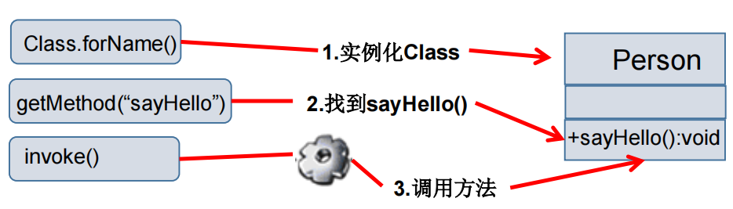

# 十二、反射

# 一、Java反射机制概述


## Java Reflection


+  Reflection（反射）是被视为动态语言的关键，反射机制允许程序在<font style="color:#E8323C;">执行期借助于Reflection API</font>取得任何类的内部信息，并能直接操作任意对象的内部属性及方法。 
+  加载完类之后，在堆内存的方法区中就产生了一个Class类型的对象（一个类只有一个Class对象），这个对象就包含了完整的类的结构信息。  
我们可以通过这个对象看到类的结构。  
这个对象就像一面镜子，透过这个镜子看到类的结构，所以，我们形象的称之为：**反射**。 


## Java反射机制提供的功能


+ 在运行时<font style="color:#E8323C;">判断任意一个对象所属的类</font>
+ 在运行时<font style="color:#E8323C;">构造任意一个类的对象</font>
+ 在运行时<font style="color:#E8323C;">判断任意一个类所具有的成员变量和方法</font>
+ 在运行时<font style="color:#E8323C;">获取泛型信息</font>
+ 在运行时<font style="color:#E8323C;">调用任意一个对象的成员变量和方法</font>
+ 在运行时<font style="color:#E8323C;">处理注解</font>
+ <font style="color:#E8323C;">生成动态代理</font>


```java
public class Person {


    private String name;
    public int age;

    public Person() {
    }

    public Person(String name, int age) {
        this.name = name;
        this.age = age;
    }

    private Person(String name) {
        this.name = name;
    }

    public String getName() {
        return name;
    }

    public void setName(String name) {
        this.name = name;
    }

    public int getAge() {
        return age;
    }

    public void setAge(int age) {
        this.age = age;
    }


    public void show() {
        System.out.println("你好");
    }


    private String showNation(String nation) {
        System.out.println("国籍是：" + nation);
        return nation;
    }

    @Override
    public String toString() {
        return "Person{" +
                "name='" + name + '\'' +
                ", age=" + age +
                '}';
    }

}


public class ReflectionTest {


    //反射之后，对于Person的操作
    @Test
    public void test2() throws NoSuchMethodException, IllegalAccessException, InvocationTargetException, InstantiationException, NoSuchFieldException {
        Class<Person> clazz = Person.class;
        //1、通过反射创建Person类的对象
        Constructor<Person> constructor = clazz.getConstructor(String.class, int.class);
        Person person = constructor.newInstance("tom", 12);
        System.out.println(person.toString());

        //2、通过反射，调用对象指定的属性、方法
        Field age = clazz.getDeclaredField("age");
        age.set(person, 10);
        System.out.println(person.toString());

        Method show = clazz.getDeclaredMethod("show");
        show.invoke(person);


        //通过反射，可以调用Person类的私有结构的。比如：私有的构造器、方法、属性、
        //私有构造器
        Constructor<Person> constructor1 = clazz.getDeclaredConstructor(String.class);
        constructor1.setAccessible(true);
        Person person1 = constructor1.newInstance("jerry");
        System.out.println(person1);

        //调用私有的属性
        Field name = clazz.getDeclaredField("name");
        name.setAccessible(true);
        name.set(person1,"张三");
        System.out.println(person1);

        //调用私有的方法
        Method showNation = clazz.getDeclaredMethod("showNation", String.class);
        showNation.setAccessible(true);
        Object nation = showNation.invoke(person1, "中国");//相当于person1.showNation("中国")
        System.out.println(nation);

    }

}
```


## 反射相关的主要API


+ java.lang.Class：代表一个类
+ java.lang.reflect.Method：代表类的方法
+ java.lang.reflect.Field：代表类的成员变量
+ java.lang.reflect.Constructor：代表类的构造器


# 二、理解Class类并获取Class实例


## class类


+ 对象照镜子后可以得到的信息：某个类的属性、方法和构造器、某个类到底实现了哪些接口。对于每个类而言，JRE 都为其保留一个不变的 Class 类型的对象。一个 Class 对象包含了特定某个结构(class/interface/enum/annotation/primitive type/void/[])的有关信息。 
    - Class本身也是一个类
    - Class 对象只能由系统建立对象
    - 一个加载的类在 JVM 中只会有一个Class实例
    - 一个Class对象对应的是一个加载到JVM中的一个.class文件
    - 每个类的实例都会记得自己是由哪个 Class 实例所生成
    - 通过Class可以完整地得到一个类中的所有被加载的结构
    - Class类是Reflection的根源，针对任何你想动态加载、运行的类，唯有先获得相应的Class对象


## Class类的常用方法


## 获取Class类的实例（四种方法）


+  前提：<font style="color:#E8323C;">若已知具体的类，通过类的class属性获取</font>，该方法最为安全可靠，程序性能最高 

```java
实例：Class clazz = Person.class;
```

 

+  前提：<font style="color:#E8323C;">已知某个类的实例，调用该实例的getClass()方法</font>获取Class对象 

```java
   	 Person person = new Person();
实例：Class clazz = person.getClass();
```

 

+  前提：<font style="color:#E8323C;">已知一个类的全类名，且该类在类路径下，可通过Class类的静态方法forName()获取</font>，可能抛出ClassNotFoundException 

```java
实例：Class clazz = Class.forName("com.atguigu.java.Person");
```

 

+  其他方式(不做要求) 

```java
ClassLoader cl = this.getClass().getClassLoader();

Class clazz4 = cl.loadClass("com.atguigu.java.Person");
```

 


```java
/**
 * 关于java.lang.Class类的理解
 * 1、类的加载过程：
 *  程序经过javac.exe命令以后，会生成一个或多个字节码文件(.class结尾)。
 *  接着我们使用java.exe命令对某个字节码文件进行解释运行。相当于将某个字节码文件加载到内存中。此过程就称为类的加载。
 *  加载到内存中的类，我们就称为运行时类，此运行时类，就作为Class的实例。
 *
 *  2、换句话说，Class的实例就对应着一个运行时类。
 *
 *  3、加载到内存中的运行时类，会缓存一定的时间。在此时间之内，我们可以通过不同的方式来获取此运行时类。
 */
@Test
public void test3() throws ClassNotFoundException {

    //方式一：调用运行时类的属性：.class
    Class<Person> clazz1 = Person.class;
    System.out.println(clazz1);

    //方式二：通过运行时类的对象
    Person p1 = new Person();
    Class<? extends Person> clazz2 = p1.getClass();
    System.out.println(clazz2);

    //方式三：
    //调用Class的静态方法：forName(String classPath)
    Class<?> clazz3 = Class.forName("com.atguigu.java.Person");
    System.out.println(clazz3);


    System.out.println(clazz1==clazz2);
    System.out.println(clazz1==clazz3);

    //方式四：使用类的加载器：ClassLoader
    ClassLoader classLoader = ReflectionTest.class.getClassLoader();
    Class<?> clazz4  = classLoader.loadClass("com.atguigu.java.Person");
    System.out.println(clazz1==clazz4);

}
```


## 哪些类型可以有Class对象


+ class： 外部类，成员(成员内部类，静态内部类)，局部内部类，匿名内部类
+ interface：接口
+ []：数组
+ enum：枚举
+ annotation：注解[@interface ](/interface ) 
+ primitive type：基本数据类型
+ void


```java
@Test
public void test4() {

    Class c1 = Object.class;
    Class c2 = Comparable.class;
    Class c3 = String[].class;
    Class c4 = int[][].class;
    Class c5 = ElementType.class;
    Class c6 = Override.class;
    Class c7 = int.class;
    Class c8 = void.class;
    Class c9 = Class.class;


    int[] a = new int[10];
    int[] b = new int[100];
    Class c10 = a.getClass();
    Class c11 = b.getClass();

    // 只要元素类型与维度一样，就是同一个Class
    System.out.println(c10 == c11); //true
}
```


# 三、类的加载与ClassLoader的理解


## 类的加载过程


当程序主动使用某个类时，如果该类还未被加载到内存中，则系统会通过如下三个步骤来对该类进行初始化。


**加载：**


<font style="color:#E8323C;">将class文件字节码内容加载到内存中，并将这些静态数据转换成方法区的运行时数据结构，然后生成一个代表这个类的java.lang.Class对象，作为方法区中类数据的访问入口（即引用地址）。</font>


所有需要访问和使用类数据只能通过这个Class对象。


这个加载的过程需要类加载器参与。


**链接：**


将Java类的二进制代码合并到JVM的运行状态之中的过程。


+ 验证：确保加载的类信息<font style="color:#E8323C;">符合JVM规范</font>，例如：以cafe开头，没有安全方面的问题
+ 准备：正式为类变量（static）<font style="color:#E8323C;">分配内存并</font>**<font style="color:#E8323C;">设置类变量默认初始值</font>**<font style="color:#E8323C;">的阶段</font>，这些内存都将在方法区中进行分配。
+ 解析：虚拟机常量池内的<font style="color:#E8323C;">符号引用（常量名）替换为直接引用（地址）的过程</font>。


**初始化：**


+  <font style="color:#E8323C;">执行类构造器clinit()方法的过程。</font>  
类构造器clinit()方法是由编译期自动收集类中所有类变量的赋值动作和静态代码块中的语句合并产生的。（类构造器是<font style="color:#E8323C;">构造类信息的</font>，不是构造该类对象的构造器）。 
+  当初始化一个类的时候，如果发现其父类还没有进行初始化，则需要<font style="color:#E8323C;">先触发其父类的初始化。 </font>
+  虚拟机会保证一个类的clinit()方法在多线程环境中被<font style="color:#E8323C;">正确加锁和同步。 </font>


```java
class A {
    static { 
        m = 300;
    }
    static int m = 100;
}
//第二步：链接结束后m=0
//第三步：初始化后，m的值由<clinit>()方法执行决定
// 这个A的类构造器<clinit>()方法由类变量的赋值和静态代码块中的语句按照顺序合并产生，类似于
// <clinit>(){
//	 m = 300;
//	 m = 100;
// }
```


## 什么时候会发生类初始化？


### 类的主动引用（一定会发生类的初始化）


+ 当虚拟机启动，<font style="color:#E8323C;">先初始化main方法所在的类</font>
+ <font style="color:#E8323C;">new一个类的对象</font>
+ 调用类的静态成员（除了final常量）和静态方法
+ 使用java.lang.reflect包的方法对类进行<font style="color:#E8323C;">反射调用</font>
+ 当初始化一个类，如果其父类没有被初始化，则先会初<font style="color:#E8323C;">始化它的父类</font>


### 类的被动引用（不会发生类的初始化）


+ 当访问一个静态域时，只有真正声明这个域的类才会被初始化
+ 当通过子类引用父类的静态变量，不会导致子类初始化
+ 通过数组定义类引用，不会触发此类的初始化
+ 引用常量不会触发此类的初始化（常量在链接阶段就存入调用类的常量池中了）


**类加载器的作用：**


+  **类加载的作用：**<font style="color:#E8323C;">将class文件字节码内容加载到内存中，并将这些静态数据转换成方法区的运行时数据结构，然后在堆中生成一个代表</font>  
这个类的java.lang.Class对象，作为方法区中类数据的访问入口。 
+  **类缓存：**标准的JavaSE类加载器可以按要求查找类，但一旦某个类被加载到类加载器中，它将维持加载（缓存）一段时间。  
不过JVM垃圾回收机制可以回收这些Class对象。 


## ClassLoader


类加载器作用是用来把类(class)装载进内存的。JVM 规范定义了如下类型的类的加载器。


```java
//1.获取一个系统类加载器
ClassLoader classloader = ClassLoader.getSystemClassLoader();
System.out.println(classloader);

//2.获取系统类加载器的父类加载器，即扩展类加载器
classloader = classloader.getParent();
System.out.println(classloader);

//3.获取扩展类加载器的父类加载器，即引导类加载器
classloader = classloader.getParent();
System.out.println(classloader);

//4.测试当前类由哪个类加载器进行加载
classloader = Class.forName("exer2.ClassloaderDemo").getClassLoader();
System.out.println(classloader);
```


```java
@Test
public void test1(){
    
    //对于自定义类，使用系统类加载器进行加载
    ClassLoader classLoader = ClassLoaderTest.class.getClassLoader();
    System.out.println(classLoader);

    //调用系统类加载器的getParent(): 获取扩展类加载器
    ClassLoader classLoader1 = classLoader.getParent();
    System.out.println(classLoader1);
    
    //调用扩展类加载器的getParent(): 无法获取引导类加载器
    //引导类加载器主要负责加载java的核心类库，无法加载自定义类的。
    ClassLoader classLoader2 = classLoader1.getParent();
    System.out.println(classLoader2);

    ClassLoader classLoader3 = String.class.getClassLoader();
    System.out.println(classLoader3);

}
```


### 使用ClassLoader加载配置文件


```java
    /**
     * Properties：用来读取配置文件
     */
    @Test
    public void test2() throws IOException {

        Properties pros = new Properties();

        //此时的文件默认在当前的module下。
        //读取配置文件的方式一：
//        FileInputStream fis = new FileInputStream("jdbc.properties");
//        pros.load(fis);

        //读取配置文件的方式二：使用ClassLoader
        //配置文件默认识别为，当前module的src下
        ClassLoader classLoader = ClassLoaderTest.class.getClassLoader();
        InputStream resourceAsStream = classLoader.getResourceAsStream("jdbc.properties");
        pros.load(resourceAsStream);


        String user = pros.getProperty("user");
        String password = pros.getProperty("password");


    }
```


# 四、创建运行时类的对象


## 有了Class对象，能做什么？


**创建类的对象：**调用Class对象的newInstance()方法


要 求：


1.  类必须有一个无参数的构造器。 
2.  类的构造器的访问权限需要足够。 


```java
@Test
public void test1() throws NoSuchMethodException, IllegalAccessException, InvocationTargetException, InstantiationException {

        //1.获取对应的Class对象
        Class<Person> clazz = Person.class;

        /**
         * newInstance():
         * 调用此方法，创建对应的运行时类的对象。
         * 内部调用了运行时类的空参的构造器。
         *
         *  要想此方法正常的创建运行时类的对象，要求：
         *  1、运行时类必须提供空参的构造器
         *  2、空参的构造器的访问权限得够。通常，设置为public。
         *
         *  在javabean中要求提供一个public的空参构造器。原因：
         *  1、便于通过反射，创建运行时类的对象
         *  2、便于子类继承此运行时类时，默认调用super()时，保证父类有此构造器
         */
        Person person = clazz.getDeclaredConstructor().newInstance();

        System.out.println(person);

}
```


**难道没有无参的构造器就不能创建对象了吗？**


不是！只要在操作的时候明确的调用类中的构造器，并将参数传递进去之后，才可以实例化操作。


步骤如下：


1.  通过Class类的**getDeclaredConstructor(Class … parameterTypes)**取得本类的指定形参类型的构造器 
2.  向构造器的形参中传递一个对象数组进去，里面包含了构造器中所需的各个参数。 
3.  通过Constructor实例化对象。 


```java
    @Test
    public void test1() throws NoSuchMethodException, IllegalAccessException, InvocationTargetException, InstantiationException, ClassNotFoundException {

        //1.根据全类名获取对应的Class对象
        Class<?> clazz = Class.forName("com.atguigu.java.Person");

        //2.调用指定参数结构的构造器，生成Constructor的实例
        Constructor<?> constructor = clazz.getDeclaredConstructor(String.class, Integer.class);

        //3.通过Constructor的实例创建对应类的对象，并初始化类属性
        Person person = (Person) constructor.newInstance("Peter", 20);
        System.out.println(person);

    }
```


以上是反射机制应用最多的地方。


## 体会反射的动态特性


```java
/**
 * 体会反射的动态性
 * @throws InvocationTargetException
 * @throws NoSuchMethodException
 * @throws ClassNotFoundException
 * @throws InstantiationException
 * @throws IllegalAccessException
 */
@Test
public void test2() throws InvocationTargetException, NoSuchMethodException, ClassNotFoundException, InstantiationException, IllegalAccessException {
    int num = new Random().nextInt(3);

    String classPath = "";

    switch (num){
        case 0:
            classPath = "java.util.Date";
            break;
        case 1:
            classPath = "java.lang.Object";
            break;
        case 2:
            classPath = "com.atguigu.java.Person";
            break;
    }

    Object instance = getInstance(classPath);
    System.out.println(instance);

}

/**
 * 创建一个指定类的对象
 *
 * classPath：指定类的全类名
 *
 * @param classPath
 * @return
 * @throws NoSuchMethodException
 * @throws IllegalAccessException
 * @throws InvocationTargetException
 * @throws InstantiationException
 * @throws ClassNotFoundException
 */
public Object getInstance(String classPath) throws NoSuchMethodException, IllegalAccessException, InvocationTargetException, InstantiationException, ClassNotFoundException {
    Class<?> clazz = Class.forName(classPath);

    return clazz.getDeclaredConstructor().newInstance();

}
```


# 五、获取运行时类的完整结构


**通过反射获取运行时类的完整结构**


Field、Method、Constructor、Superclass、Interface、Annotation


+  实现的<font style="color:#E8323C;">全部接口 </font>
+  <font style="color:#E8323C;">所继承的父类 </font>
+  全部的<font style="color:#E8323C;">构造器 </font>
+  全部的<font style="color:#E8323C;">方法 </font>
+  全部的<font style="color:#E8323C;">Field </font>


## 准备


```java
public class Creature<T> implements Serializable {

    private char gender;
    public double weight;

    private void breath(){
        System.out.println("生物呼吸");
    }

    public void eat(){
        System.out.println("生物吃东西");
    }
}
```


```java
public interface MyInterface {

    void info();

}
```


```java
@Target({ElementType.TYPE, ElementType.FIELD, ElementType.METHOD, ElementType.PARAMETER, ElementType.CONSTRUCTOR, ElementType.LOCAL_VARIABLE})
@Retention(RetentionPolicy.RUNTIME)
public @interface MyAnnotation {

    String value() default "hello";

}
```


```java
@MyAnnotation(value = "hi")
public class Person extends Creature<String> implements Comparable<String>, MyInterface {

    private String name;
    int age;
    public int id;

    public Person() {
    }

    @MyAnnotation(value = "abc")
    private Person(String name) {
        this.name = name;
    }

    Person(String name, int age) {
        this.name = name;
        this.age = age;
    }


    @MyAnnotation
    private String show(String nation) {
        System.out.println("我的国籍是：" + nation);
        return nation;
    }

    public String display(String interests) {
        return interests;
    }

    @Override
    public int compareTo(String o) {
        return 0;
    }

    @Override
    public void info() {
        System.out.println("我是一个人");
    }
}
```


## 全部的Field


+  public Field[] getFields()                            返回此Class对象所表示的类或接口的public的Field。 
+  public Field[] getDeclaredFields()            返回此Class对象所表示的类或接口的全部Field。 
+  Field方法中： 
    - public int getModifiers()            以整数形式返回此Field的修饰符
    - public Class<?> getType()          得到Field的属性类型
    - public String getName()             返回Field的名称。


```java
/**
 * 获取当前运行时类的属性结构
 */
public class FieldTest {


    @Test
    public void test1() {

        Class<Person> clazz = Person.class;

        //获取属性结构
        //getFields()：获取当前运行时类及其父类中声明为public访问权限的属性
        Field[] fields = clazz.getFields();
        for (Field field : fields) {
            System.out.println(field);
        }

        System.out.println();


        //getDeclaredFields()：获取当前运行时类中声明的所有属性。（不包含父类中声明的属性）
        Field[] declaredFields = clazz.getDeclaredFields();
        for (Field declaredField : declaredFields) {
            System.out.println(declaredField);
        }

    }

    //权限修饰符 数据类型 变量名
    @Test
    public void test2() {

        Class<Person> clazz = Person.class;

        Field[] declaredFields = clazz.getDeclaredFields();
        for (Field declaredField : declaredFields) {
            //1、权限修饰符
            int modifiers = declaredField.getModifiers();
            System.out.print(Modifier.toString(modifiers) + "\t");
            //2、数据类型
            Class<?> type = declaredField.getType();
            System.out.print(type + "\t");
            //3、变量名
            String name = declaredField.getName();
            System.out.println(name);
        }
    }


}
```


## 全部的方法


+  public Method[] getDeclaredMethods()		返回此Class对象所表示的类或接口的全部方法 
+  public Method[] getMethods()                        返回此Class对象所表示的类或接口的public的方法 
+  Method类中： 
    - public Class<?> getReturnType()                  取得全部的返回值
    - public Class<?>[] getParameterTypes()       取得全部的参数
    - public int getModifiers()                                 取得修饰符
    - public Class<?>[] getExceptionTypes()         取得异常信息


```java
/**
 * 获取运行时类的方法结构
 */
public class MethodTest {

    @Test
    public void test1() {
        Class<Person> clazz = Person.class;

        //getMethods()：获取当前运行时类及其所有父类中声明为public权限的方法
        Method[] methods = clazz.getMethods();
        for (Method method : methods) {
            System.out.println(method);
        }

        //getDeclaredMethods()：获取当前运行时类中声明的所有方法。（不包含父类中声明的方法）
        Method[] declaredMethods = clazz.getDeclaredMethods();
        for (Method declaredMethod : declaredMethods) {
            System.out.println(declaredMethod);
        }
    }

    /**
     * @Xxx 权限修饰符 返回值类型 方法名(参数类型1 形参名1, ...) throws XxxException{}
     */
    @Test
    public void test2() {

        Class<Person> clazz = Person.class;

        Method[] declaredMethods = clazz.getDeclaredMethods();
        for (Method method : declaredMethods) {
            //1、获取方法声明的注解
            Annotation[] annotations = method.getAnnotations();
            for (Annotation annotation : annotations) {
                System.out.println(annotation);
            }

            //2、权限修饰符
            System.out.print(Modifier.toString(method.getModifiers()) + "\t");


            //3、返回值类型
            System.out.print(method.getReturnType().getName() + "\t");

            //4、方法名
            System.out.print(method.getName() + "\t");

            System.out.print("(");

            //5、形参列表
            Class<?>[] parameterTypes = method.getParameterTypes();
            if (!(parameterTypes == null && parameterTypes.length == 0)) {
                for (int i = 0; i < parameterTypes.length; i++) {
                    if (i == parameterTypes.length - 1) {
                        System.out.print(parameterTypes[i].getName() + " args_" + i);
                        break;
                    }
                    System.out.print(parameterTypes[i].getName() + " args_" + i + ",");
                }
            }

            System.out.print(")");

            //6、抛出的异常
            Class<?>[] exceptionTypes = method.getExceptionTypes();
            if (exceptionTypes.length > 0) {
                System.out.print("throws ");
                for (int i = 0; i < exceptionTypes.length; i++) {
                    if (i == exceptionTypes.length - 1) {
                        System.out.print(exceptionTypes[i].getName());
                        break;
                    }
                    System.out.print(exceptionTypes[i].getName() + ",");
                }
            }


            System.out.println();
        }

    }


}
```


## 全部的构造器


+  public Constructor[] getConstructors()		返回此 Class 对象所表示的类的所有public构造方法。 
+  public Constructor[] getDeclaredConstructors()     返回此 Class 对象表示的类声明的所有构造方法。 
+  Constructor类中： 
    - 取得修饰符: public int getModifiers();
    - 取得方法名称: public String getName();
    - 取得参数的类型：public Class<?>[] getParameterTypes();


```java
public class OtherTest {

    @Test
    public void test1(){
        Class<Person> clazz = Person.class;

        //getConstructors：获取当前运行时类中声明为public的构造器
        Constructor<?>[] constructors = clazz.getConstructors();
        for (Constructor<?> constructor : constructors) {
            System.out.println(constructor);
        }

        System.out.println();

        //getConstructors：获取当前运行时类中声明的所有的构造器
        Constructor<?>[] declaredConstructors = clazz.getDeclaredConstructors();
        for (Constructor<?> declaredConstructor : declaredConstructors) {
            System.out.println(declaredConstructor);
        }

    }

}
```


## 所继承的父类


+ public Class<? Super T> getSuperclass()		返回表示此 Class 所表示的实体（类、接口、基本类型）的父类的Class。


```java
/**
 * 获取运行时类的父类
 */
@Test
public void test2(){

    Class<Person> clazz = Person.class;

    Class<? super Person> superclass = clazz.getSuperclass();
    System.out.println(superclass);

}
```


## 泛型相关


+ 获取父类泛型类型：Type getGenericSuperclass()
+ 泛型类型：ParameterizedType
+ 获取实际的泛型类型参数数组：getActualTypeArguments()


```java
    /**
     * 获取运行时类的带泛型的父类
     */
    @Test
    public void test3(){

        Class<Person> clazz = Person.class;

        Type genericSuperclass = clazz.getGenericSuperclass();
        System.out.println(genericSuperclass);

    }


    /**
     * 获取运行时类的带泛型的父类的泛型
     */
    @Test
    public void test4(){

        Class<Person> clazz = Person.class;

        Type genericSuperclass = clazz.getGenericSuperclass();
        ParameterizedType parameterizedType = (ParameterizedType) genericSuperclass;

        //获取泛型类型
        Type[] actualTypeArguments = parameterizedType.getActualTypeArguments();

//        System.out.println(actualTypeArguments[0].getTypeName());

        System.out.println(((Class)actualTypeArguments[0]).getName());
    }
```


## 实现的全部接口


+ public Class<?>[] getInterfaces()		确定此对象所表示的类或接口实现的接口。


```java
/**
 * 获取运行时类实现的接口
 *
 */
@Test
public void test5(){
    Class<Person> clazz = Person.class;

    Class<?>[] interfaces = clazz.getInterfaces();
    for (Class<?> anInterface : interfaces) {
        System.out.println(anInterface);
    }

    System.out.println();

    //获取运行时类的父类实现的接口
    Class<?>[] interfaces1 = clazz.getSuperclass().getInterfaces();
    for (Class<?> aClass : interfaces1) {
        System.out.println(aClass);
    }

}
```


## 类所在的包


Package getPackage()


```java
/**
 * 获取运行时类所在的包
 */
@Test
public void test6(){

    Class<Person> clazz = Person.class;

    Package aPackage = clazz.getPackage();
    System.out.println(aPackage);

}
```


## Annotation相关


+ getAnnotation(Class annotationClass)
+ getDeclaredAnnotations()


```java
/**
 * 获取运行时类声明的注解
 */
@Test
public void test7(){

    Class<Person> clazz = Person.class;

    Annotation[] annotations = clazz.getAnnotations();
    for (Annotation annotation : annotations) {
        System.out.println(annotation);
    }

}
```


# 六、调用运行时类的指定结构


## 调用指定属性


在反射机制中，可以直接通过Field类操作类中的属性，通过Field类提供的set()和get()方法就可以完成设置和取得属性内容的操作。


+  public Field getField(String name)                     返回此Class对象表示的类或接口的指定的public的Field。 
+  public Field getDeclaredField(String name)       返回此Class对象表示的类或接口的指定的Field。 
+  在Field中： 
    - public Object get(Object obj)                      取得指定对象obj上此Field的属性内容
    - public void set(Object obj,Object value)     设置指定对象obj上此Field的属性内容


```java
@Test
public void testField() throws NoSuchFieldException, IllegalAccessException, NoSuchMethodException, InvocationTargetException, InstantiationException {
    Class<Person> clazz  = Person.class;

    //创建运行时类的对象
    Person person = clazz.getDeclaredConstructor().newInstance();

    // 获取指定的属性：要求运行时类中属性声明为public
    Field id = clazz.getField("age");

    /**
     * set()：设置当前属性的值
     *      参数1：指明设置哪个对象的属性
     *      参数2：将此属性值设置为多少
     */
    id.set(person,1001);

    /**
     * get()：获取当前属性的值
     *      参数1：获取哪个对象的当前属性值
     */
    Object oid = id.get(person);
    System.out.println(oid);
}


@Test
public void testField1() throws NoSuchFieldException, IllegalAccessException, NoSuchMethodException, InvocationTargetException, InstantiationException {
    Class<Person> clazz  = Person.class;

    //创建运行时类的对象
    Person person = clazz.getDeclaredConstructor().newInstance();

    // 获取运行时类中指定变量名的属性
    Field name = clazz.getDeclaredField("name");
    //保证当前属性是可访问的
    name.setAccessible(true);

    /**
     * set()：设置当前属性的值
     *      参数1：指明设置哪个对象的属性
     *      参数2：将此属性值设置为多少
     */
    name.set(person,"Tom");

    /**
     * get()：获取当前属性的值
     *      参数1：获取哪个对象的当前属性值
     */
    Object oname = name.get(person);
    System.out.println(oname);
}
```


## 调用指定方法


通过反射，调用类中的方法，通过Method类完成。步骤：


1.  通过Class类的**getMethod(String name, Class…parameterTypes)**方法取得一个Method对象，并设置此方法操作时所需要的参数类型。 
2.  之后使用**Object invoke(Object obj, Object[] args)**进行调用，并向方法中传递要设置的obj对象的参数信息。 
    1.  Object 对应原方法的返回值，若原方法无返回值，此时返回null 
    2.  若原方法若为静态方法，此时形参Object obj可为null 
    3.  若原方法形参列表为空，则Object[] args为null 
    4.  若原方法声明为private,   则需要在调用此invoke()方法前，显式调用方法对象的setAccessible(true)方法，将可访问private的方法。 





```java
    @Test
    public void testMethod() throws NoSuchFieldException, IllegalAccessException, NoSuchMethodException, InvocationTargetException, InstantiationException {
        Class<Person> clazz  = Person.class;

        //创建运行时类的对象
        Person person = clazz.getDeclaredConstructor().newInstance();

        // 获取运行时类中指定的某个方法
        Method show = clazz.getDeclaredMethod("show", String.class);
        show.setAccessible(true);

        /**
         * invoke：参数1：方法的调用者 参数2：给方法形参赋值的实参
         *
         * invoke()的返回值即为对应类中调用的方法的返回值
         */
        Object china = show.invoke(person, "China");

        System.out.println(china);


        // private static void showDesc()
        Method showDesc = clazz.getDeclaredMethod("showDesc");
        showDesc.setAccessible(true);
        //如果调用的运行时类中的方法没有返回值，则此invoke()返回null
//        Object invoke = showDesc.invoke(Person.class);
        Object invoke = showDesc.invoke(null);
        System.out.println(invoke);

    }
```


## 调用指定构造器


```java
/**
 * 调用运行时类中的指定的构造器
 */
@Test
public void testConstructor() throws NoSuchMethodException, IllegalAccessException, InvocationTargetException, InstantiationException {
    Class<Person> clazz = Person.class;

    /**
     * 1、获取指定类的构造器
     *     getDeclaredConstructor()：参数：指明构造器的参数列表
     */
    Constructor<Person> constructor = clazz.getDeclaredConstructor(String.class);

    //2、保证此构造器是可访问的
    constructor.setAccessible(true);

    //3、调用此构造器创建运行时类的对象
    Person person = constructor.newInstance("Tome");
    System.out.println(person);

}
```


## setAccessible方法的使用


+ Method和Field、Constructor对象都有setAccessible()方法。
+ setAccessible启动和禁用访问安全检查的开关。
+ 参数值为true则指示反射的对象在使用时应该取消Java语言访问检查。 
    - 提高反射的效率。如果代码中必须用反射，而该句代码需要频繁的被调用，那么请设置为true。
    - 使得原本无法访问的私有成员也可以访问
+ 参数值为false则指示反射的对象应该实施Java语言访问检查。


# 七、反射的应用：动态代理


**<font style="color:#E8323C;">代理设计模式的原理</font>**


使用一个代理将对象包装起来, 然后用该代理对象取代原始对象。任何对原始对象的调用都要通过代理。代理对象决定是否以及何时将方法调用转到原始对象上。


+ 之前为大家讲解过代理机制的操作，属于静态代理，特征是代理类和目标对象的类都是在编译期间确定下来，不利于程序的扩展。同时，每一个代理类只能为一个接口服务，这样一来程序开发中必然产生过多的代理。**最好可以通过一个代理类完成全部的代理功能。**


```java
/**
 * 静态代理举例
 * 特点：代理类和被代理类在编译期间，就确定下来了。
 */

interface ClothFactory {
    void produceCloth();
}


//代理类
class ProxyClothFactory implements ClothFactory {

    private ClothFactory factory; //用被代理类进行实例化

    public ProxyClothFactory(ClothFactory factory) {
        this.factory = factory;
    }

    @Override
    public void produceCloth() {
        System.out.println("代理工厂做一些准备工作");

        factory.produceCloth();

        System.out.println("代理工厂做一些后续的收尾工作");

    }
}


//被代理类
class NickClothFactory implements ClothFactory {

    @Override
    public void produceCloth() {
        System.out.println("Nike工厂生产一批运动服");
    }
}


//测试
public class StaticProxyTest {

    public static void main(String[] args) {
        //创建被代理类的对象
        NickClothFactory nick = new NickClothFactory();

        //创建代理类的对象
        ProxyClothFactory proxyClothFactory = new ProxyClothFactory(nick);

        proxyClothFactory.produceCloth();
    }

}
```


+ 动态代理是指客户通过代理类来调用其它对象的方法，并且是在程序运行时根据需要动态创建目标类的代理对象。


```java
/**
 * 动态代理的举例
 */

interface Human {
    String getBelief();

    void eat(String food);
}


//被代理类
class SuperMan implements Human {

    @Override
    public String getBelief() {
        return "I believe I can fly!";
    }

    @Override
    public void eat(String food) {
        System.out.println("我喜欢吃" + food);
    }
}

/**
 * 要想实现动态代理，需要解决的问题？
 * 问题一：如何根据加载到内存中的被代理类，动态的创建一个代理类及其对象
 * 
 * 问题二：当通过代理类的对象调用方法时，如何动态的去调用被代理类中的同名方法。
 */
class ProxyFactory {
    //调用此方法，返回一个代理类的对象。解决问题一
    public static Object getProxyInstance(Object obj) {//obj：被代理类的对象

        MyInvocationHandler invocationHandler = new MyInvocationHandler();
        invocationHandler.bind(obj);

        return Proxy.newProxyInstance(obj.getClass().getClassLoader(), obj.getClass().getInterfaces(), invocationHandler);
    }
}

class MyInvocationHandler implements InvocationHandler {

    private Object obj; //需要使用被代理类的对象进行赋值

    public void bind(Object obj) {
        this.obj = obj;
    }

    //当我们通过代理类的对象，调用方法a时，就会自动的调用如下的方法：invoke()
    //将被代理类要执行的方法a的功能就声明在invoke()中
    @Override
    public Object invoke(Object proxy, Method method, Object[] args) throws Throwable {
        //method：即为代理类对象调用的方法，此方法也就作为了被代理类对象要调用的方法
        //obj：被代理类的对象
        Object returnValue = method.invoke(obj, args);
        //上述方法的返回值就作为当前类中的invoke()的返回值
        return returnValue;
    }
}


//测试
public class ProxyText {

    public static void main(String[] args) {
        
        SuperMan superMan = new SuperMan();
        // proxyInstance：代理类的对象
        Human proxyInstance = (Human) ProxyFactory.getProxyInstance(superMan);
        //当通过代理类对象调用方法时，会自动的调用被代理类中同名的方法
        String belief = proxyInstance.getBelief();
        System.out.println(belief);
        proxyInstance.eat("四川麻辣烫");


        System.out.println("**************");

        NickClothFactory nickClothFactory = new NickClothFactory();
        ClothFactory proxyInstance1 = (ClothFactory) ProxyFactory.getProxyInstance(nickClothFactory);
        proxyInstance1.produceCloth();

    }
}
```


+  动态代理使用场合: 
    - 调试
    - 远程方法调用
+  **动态代理相比于静态代理的优点：**  
抽象角色中（接口）声明的所有方法都被转移到调用处理器一个集中的方法中处理，这样，我们可以更加灵活和统一的处理众多的方法。 


## Java动态代理相关API


+  **Proxy** ：<font style="color:#E8323C;">专门完成代理的操作类</font>，是所有动态代理类的父类。通过此类为一个或多个接口动态地生成实现类。 
+  提供用于创建动态代理类和动态代理对象的静态方法  
 


## 动态代理步骤


1. 创建一个<font style="color:#E8323C;">实现接口</font>**<font style="color:#E8323C;">InvocationHandler</font>**<font style="color:#E8323C;">的类</font>，它必须实现<font style="color:#E8323C;">invoke</font>方法，以完成代理的具体操作。


2. 创建<font style="color:#E8323C;">被代理的类以及接口</font>


3.  通过Proxy的静态方法	newProxyInstance(ClassLoader loader, Class[] interfaces, InvocationHandler h) 

```java
//创建一个Subject接口代理
RealSubject target = new RealSubject();
// 创建一个代理来包装原始实现
DebugProxy proxy = new DebugProxy(target);
// 通过Subject接口获取对代理的引用
Subject sub = (Subject) Proxy.newProxyInstance(
    Subject.class.getClassLoader(),
    new Class[] { Subject.class }, 
    proxy
);
```

 

4.  通过 Subject代理调用RealSubject实现类的方法 

```java
String info = sub.say("Peter", 24);
System.out.println(info);
```

 


## 动态代理与AOP（Aspect Orient Programming)


前面介绍的Proxy和InvocationHandler，很难看出这种动态代理的优势，下面介绍一种更实用的动态代理机制


改进后的说明：代码段1、代码段2、代码段3和深色代码段分离开了，但代码段1、2、3又和一个特定的方法A耦合了！


最理想的效果是：代码块1、2、3既可以执行方法A，又无须在程序中以硬编码的方式直接调用深色代码的方法


+  使用Proxy生成一个动态代理时，往往并不会凭空产生一个动态代理，这样没有太大的意义。通常都是为指定的目标对象生成动态代理 
+  这种动态代理在AOP中被称为AOP代理，AOP代理可代替目标对象，AOP代理包含了目标对象的全部方法。但AOP代理中的方法与目标对象的方法存在差异：  
**AOP代理里的方法可以在执行目标方法之前、之后插入一些通用处理** 


```java
interface Human {
    String getBelief();

    void eat(String food);
}


//被代理类
class SuperMan implements Human {

    @Override
    public String getBelief() {
        return "I believe I can fly!";
    }

    @Override
    public void eat(String food) {
        System.out.println("我喜欢吃" + food);
    }
}

//AOP
class HumanUtil{
    public void method1(){
        System.out.println("=======通用方法一======");
    }
    public void method2(){
        System.out.println("=======通用方法二======");
    }
}

/**
 * 要想实现动态代理，需要解决的问题？
 * 问题一：如何根据加载到内存中的被代理类，动态的创建一个代理类及其对象
 *
 * 问题二：当通过代理类的对象调用方法时，如何动态的去调用被代理类中的同名方法。
 */
class ProxyFactory {
    //调用此方法，返回一个代理类的对象。解决问题一
    public static Object getProxyInstance(Object obj) {//obj：被代理类的对象

        MyInvocationHandler invocationHandler = new MyInvocationHandler();
        invocationHandler.bind(obj);

        return Proxy.newProxyInstance(obj.getClass().getClassLoader(), obj.getClass().getInterfaces(), invocationHandler);
    }
}

class MyInvocationHandler implements InvocationHandler {

    private Object obj; //需要使用被代理类的对象进行赋值

    public void bind(Object obj) {
        this.obj = obj;
    }

    //当我们通过代理类的对象，调用方法a时，就会自动的调用如下的方法：invoke()
    //将被代理类要执行的方法a的功能就声明在invoke()中
    @Override
    public Object invoke(Object proxy, Method method, Object[] args) throws Throwable {

        HumanUtil util = new HumanUtil();
        util.method1();

        //method：即为代理类对象调用的方法，此方法也就作为了被代理类对象要调用的方法
        //obj：被代理类的对象
        Object returnValue = method.invoke(obj, args);

        util.method2();

        //上述方法的返回值就作为当前类中的invoke()的返回值
        return returnValue;
    }
}


//测试
public class ProxyText {

    public static void main(String[] args) {

        SuperMan superMan = new SuperMan();
        // proxyInstance：代理类的对象
        Human proxyInstance = (Human) ProxyFactory.getProxyInstance(superMan);
        //当通过代理类对象调用方法时，会自动的调用被代理类中同名的方法
        String belief = proxyInstance.getBelief();
        System.out.println(belief);
        proxyInstance.eat("四川麻辣烫");


        System.out.println("**************");

        NickClothFactory nickClothFactory = new NickClothFactory();
        ClothFactory proxyInstance1 = (ClothFactory) ProxyFactory.getProxyInstance(nickClothFactory);
        proxyInstance1.produceCloth();

    }
}
```


> 更新: 2023-06-12 15:25:34  
> 原文: <https://www.yuque.com/like321/javase/scaewd>