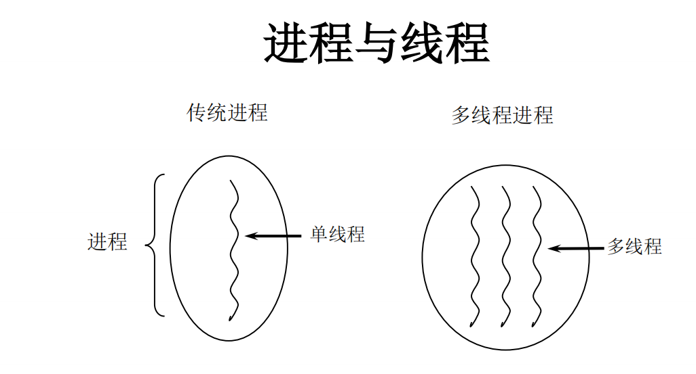
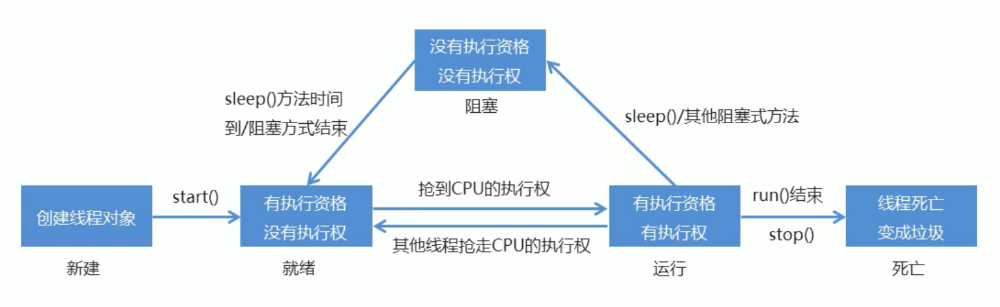
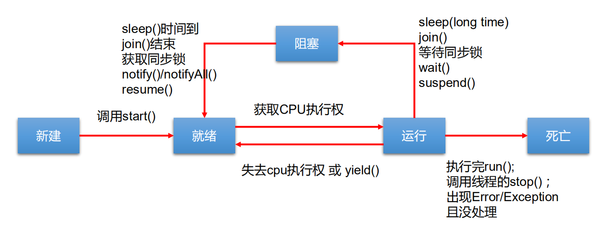

# 四、多线程

# 一、程序、进程、线程


## 1、程序（program）


是为完成特定任务、用某种语音编写的一组指令的集合。即指**一段静态的代码**，静态对象。


## 2、进程（process）


进程：是程序的一次执行过程，或是**正在运行的一个程序**。


+ 是系统进行资源分配和调用的独立单位
+ 每一个进程都有它自己的内存空间和系统资源


举例：


		运行中的QQ，运行中的MP3播放器


## 3、线程（thread）


线程：进程可进一步细化为线程，是进程中的单个顺序控制流，是一条执行路径


+ 单线程：一个进程如果只有一条执行路径，则称为单线程程序
+ 多线程：一个进程如果有多条执行路径，则称为多线程程序





举例：


		扫雷程序


## 4、线程调度


线程有两种调度模型


+ 分时调度模型：所有线程轮流使用CPU的使用权，平均分配每个线程占用CPU的时间片
+ 抢占式调度模型：优先让优先级高的线程使用CPU，如果线程的优先级相同，那么会随机选择一个，优先级高的线程获取的CPU时间片相对多一些


java使用的是抢占式调度模型


假如计算机只有一个CPU，那么CPU在某一个时刻只能执行一条指令，线程只有得到CPU时间片，也就是使用权，才可以执行指令。


所以说多线程程序的执行是有**随机性**，因为谁抢到CPU的使用权是不一定的。


## 使用多线程的优点


**背景：**以单核CPU为例，只使用单个线程先后完成多个任务（调用多个方法），肯定比用多个线程来完成用的时间更短，为何仍需多线程呢？


多线程程序的优点：


1.  提高应用程序的响应。对图形化界面更有意义，可增强用户体验。 
2.  提高计算机系统CPU的利用率 
3.  改善程序结构。将既长又复杂的进程分为多个线程，独立运行，利于理解和修改 


## 何时使用多线程


+ 程序需要同时执行两个或多个任务。
+ 程序需要实现一些需要等待的任务时，如用户输入、文件读写操作、网络操作、搜索等。
+ 需要一些后台运行的程序时。


## 线程的分类


Java中的线程分为两类：一种是守护线程，一种是用户线程。


+ 它们在几乎每个方面都是相同的，唯一的区别是判断JVM何时离开。
+ 守护线程是用来服务用户线程的，通过在start()方法前调用thread.setDaemon(true)可以把一个用户线程变成一个守护线程。
+ Java垃圾回收就是一个典型的守护线程。
+ 若JVM中都是守护线程，当前JVM将退出。


# 二、线程的创建和使用


Java语言的JVM允许程序运行多个线程，它通过java.lang.Thread类来体现。


+  Thread类的特性 
    - 每个线程都是通过某个特定Thread对象的run()方法来完成操作的，经常把run()方法的主体称为线程体
    - 通过该Thread对象的start()方法来启动这个线程，而非直接调用run()Thread
+  Thread构造器 


Thread()：创建新的Thread对象


Thread(String threadname)：创建线程并指定线程实例名


Thread(Runnable target)：指定创建线程的目标对象，它实现了Runnable接口中的run方法


Thread(Runnable target, String name)：创建新的Thread对象


## 方式一：继承Thread类


+ 1、创建一个继承于Thread类的子类
+ 2、重写Thread类的run()---->将此线程执行的操作声明在run()中
+ 3、创建Thread类的子类的对象，即创建了线程对象。
+ 4、通过此对象调用start()：启动线程，调用run方法。


```java
public class ThreadTest {

    public static void main(String[] args) {
//        3、创建Thread类的子类的对象
        MyThread myThread = new MyThread();
//        4、通过此对象调用start()
        myThread.start();

        //如下操作仍然是在main线程中执行的
        for (int i = 0; i < 100; i++) {
            if (i % 2 != 0) {
                System.out.println("hello");
            }
        }

    }

}

//1、创建一个继承于Thread类的子类
class MyThread extends Thread {
    //    2、重写Thread类的run()
    @Override
    public void run() {
        for (int i = 0; i < 100; i++) {
            if (i % 2 == 0) {
                System.out.println(i);
            }
        }
    }
}
```


注意：


1. 如果自己手动调用run()方法，那么就只是普通方法，没有启动多线程模式。
2. run()方法由JVM调用，什么时候调用，执行的过程控制都有操作系统的CPU调度决定。
3. 想要启动多线程，必须调用start方法。
4. 一个线程对象只能调用一次start()方法启动，如果重复调用了，则将抛出异常“IllegalThreadStateException”。


```java
public static void main(String[] args) throws InterruptedException {
    new Thread(){
        @Override
        public void run() {
            for (int i = 0; i < 100; i++) {
                if (i % 2 == 0) {
                    System.out.println(i);
                }
            }
        }
    }.start();
}
```


## 线程的常用方法


+ 1、start()：启动当前线程：调用当前线程的run()
+ 2、run()：通常需要重写Thread类中的此方法，将创建的线程要执行的操作声明在此方法中
+ 3、currentThread()：静态方法，返回 执行当前代码的线程
+ 4、getName()：获取当前线程的名字
+ 5、setName()：设置当前线程的名字
+ 6、yield()：释放当前cpu的执行权
+ 7、join：在线程a中调用线程b的join()，此时线程a进入阻塞状态，直到线程b完全执行完以后，线程a才结束阻塞状态
+ 9、sleep(long millitime)：让当前线程“睡眠”指定的millitime毫秒数
+ 10、isAlive()：判断当前线程是否存活


```java
public class ThreadMethodTest {
    public static void main(String[] args) {
        HelloThread h1 = new HelloThread("线程一");

        h1.start();

        //给主线程命名
        Thread.currentThread().setName("主线程");
        for (int i = 0; i < 100; i++) {
            if (i % 2 == 0) {
                System.out.println(Thread.currentThread().getName() + ":" + i);
            }
            if (i == 20) {
                try {
                    h1.join();
                } catch (InterruptedException e) {
                    e.printStackTrace();
                }
            }

        }

        System.out.println(h1.isAlive());
    }
}


class HelloThread extends Thread {
    @Override
    public void run() {
        for (int i = 0; i < 100; i++) {
            if (i % 2 == 0) {
                try {
                    sleep(1);
                } catch (InterruptedException e) {
                    e.printStackTrace();
                }
                System.out.println(Thread.currentThread().getName() + ":" + i);
            }

//            if (i % 20 == 0) {
//                yield();
//            }
        }
    }

    public HelloThread(String name) {
        super(name);
    }

}
```


## 线程优先级设置


+ 线程的优先级等级 
    - MAX_PRIORITY：10
    - MIN _PRIORITY：1
    - NORM_PRIORITY：5
+ 涉及的方法 
    - getPriority() ：返回线程优先值
    - setPriority(int newPriority) ：改变线程的优先级
+ 说明
+ 线程创建时继承父线程的优先级
+ 低优先级只是获得调度的概率低，并非一定是在高优先级线程之后才被调用


```java
/
* 线程的优先级：
 * 1、
 * MAX_PRIORITY：10
 * MIN_PRIOrITY：1
 * NORM_PRIORITY：5 默认
 * 2、如何获取和设置当前线程的优先级
 * getPriority()：获取线程的优先级
 * setPriority(int p)：设置线程的优先级
 *
 * 说明：高优先级的线程要抢占低优先级线程CPU的执行权。但是只是从概率上讲，高优先级的线程高概率的情况下被执行。并不意味着只有当高优先级的线程执行完之后，低优先级的线程才执行
 *
 */
public class ThreadMethodTest {

    public static void main(String[] args) {

        HelloThread h1 = new HelloThread("线程一");

        //设置线程的优先级
        h1.setPriority(Thread.MAX_PRIORITY);
        h1.start();

        //给主线程命名
        Thread.currentThread().setName("主线程");
        Thread.currentThread().setPriority(Thread.MIN_PRIORITY);
        for (int i = 0; i < 100; i++) {
            if (i % 2 == 0) {
                System.out.println(Thread.currentThread().getName() + ":" + Thread.currentThread().getPriority() + ":" + i);
            }
        }

    }

}


class HelloThread extends Thread {
    @Override
    public void run() {
        for (int i = 0; i < 100; i++) {
            if (i % 2 == 0) {
                System.out.println(Thread.currentThread().getName() + ":" + Thread.currentThread().getPriority() + ":" + i);
            }

        }
    }

    public HelloThread(String name) {
        super(name);
    }

}
```


## 方式二：实现Runnable接口


+ 1、创建一个实现了Runnable接口的类
+ 2、实现类去实现Runnable中的抽象方法：run()
+ 3、创建实现类的对象
+ 4、将此对象作为参数传递到Thread类的构造器中，创建Thread类的对象
+ 5、通过Thread类的对象调用start()


```java
public class ThreadTest2 {
    public static void main(String[] args) {
        //3、创建实现类的对象
        MyThread myThread = new MyThread();

//        4、将此对象作为参数传递到Thread类的构造器中，创建Thread类的对象
        Thread thread = new Thread(myThread);
//        5、通过Thread类的对象调用start()
        //1启动线程 2、调用当前线程的run()--->调用了Runnable类型的target的run()
        thread.start();

        //再启动一个线程
        Thread thread1 = new Thread(myThread);
        thread1.start();
    }
}

//1、创建一个实现了Runnable接口的类
class MyThread implements Runnable {
    //2、实现类去实现Runnable中的抽象方法：run()
    @Override
    public void run() {
        for (int i = 0; i < 100; i++) {
            if (i % 2 == 0) {
                System.out.println(Thread.currentThread().getName() + "：" + i);
            }
        }
    }
}
```


### 继承方式和实现方式的联系与区别


```java
public class Thread extends Object implements Runnable
```


+ 区别 
    - 继承Thread：线程代码存放Thread子类run方法中。
    - 实现Runnable：线程代码存在接口的子类的run方法。
+ 实现方式的好处
+ 避免了单继承的局限性
+ 多个线程可以共享同一个接口实现类的对象，非常适合多个相同线程来处理同一份资源。


## 新增方式一：实现Callable接口


+  与使用Runnable相比， Callable功能更强大些 
    - 相比run()方法，可以有返回值
    - 方法可以抛出异常
    - 支持泛型的返回值
    - 需要借助FutureTask类，比如获取返回结果
+  Future接口 
    -  可以对具体Runnable、Callable任务的执行结果进行取消、查询是否完成、获取结果等。 
    -  FutrueTask是Futrue接口的唯一的实现类 
    -  FutureTask 同时实现了Runnable, Future接口。  
它既可以作为Runnable被线程执行，又可以作为Future得到Callable的返回值 


```java
//1、创建一个实现Callable接口的实现类
class NumThread implements Callable<Integer> {
    //2、实现call方法，将此线程需要执行的操作声明在call()中
    @Override
    public Integer call() throws Exception {
        int sum = 0;
        for (int i = 0; i <= 100; i++) {
            if (i % 2 == 0) {
                sum += i;
            }
        }
        return sum;
    }
}
```


```java
public class ThreadNew {

    public static void main(String[] args) {
        //3、创建Callable接口实现类的对象
        NumThread numThread = new NumThread();
        //4、将此Callable接口实现类的对象作为参数传递到FutureTask构造器中，创建FutureTask的对象
        FutureTask<Integer> futureTask = new FutureTask<Integer>(numThread);
        //5、将FutureTask的对象作为参数传递到Thread类的构造器中，创建Thread对象，并调用start()
        new Thread(futureTask).start();

        try {
            //6、若需要，获取Callable中call方法的返回值
            Integer sum = futureTask.get();//get()返回值即为FutureTask构造器参数Callable实现类重写的call()的返回值
            System.out.println(sum);
        } catch (InterruptedException e) {
            e.printStackTrace();
        } catch (ExecutionException e) {
            e.printStackTrace();
        }
    }

}
```


### 实现Callable接口比实现Runnable接口强大


+ 1、call()可以有<font style="color:#E8323C;">返回值</font>
+ 2、call()可以<font style="color:#E8323C;">抛出异常</font>，被外面的操作捕获，获取异常的信息
+ 3、Callable是<font style="color:#E8323C;">支持泛型的</font>


## 新增方式二：使用线程池


+ 背景：经常创建和销毁、使用量特别大的资源，比如并发情况下的线程，对性能影响很大。
+ 思路：提前创建好多个线程，放入线程池中，使用时直接获取，使用完放回池中。可以避免频繁创建销毁、实现重复利用。类似生活中的公共交通工具。
+ 好处： 
    - 提高响应速度（减少了创建新线程的时间）
    - 降低资源消耗（重复利用线程池中线程，不需要每次都创建）
    - 便于线程管理 
        * corePoolSize：核心池的大小
        * maximumPoolSize：最大线程数
        * keepAliveTime：线程没有任务时最多保持多长时间后会终止


### 线程池相关API


+ JDK 5.0起提供了线程池相关API：ExecutorService 和 Executors
+ ExecutorService：真正的线程池接口。常见子类ThreadPoolExecutor 
    - void execute(Runnable command) ：执行任务/命令，没有返回值，一般用来执行Runnable
    -  Future submit(Callable task)：执行任务，有返回值，一般又来执行Callable
    - void shutdown() ：关闭连接池
+ Executors：工具类、线程池的工厂类，用于创建并返回不同类型的线程池 
    - Executors.newCachedThreadPool()：创建一个可根据需要创建新线程的线程池
    - Executors.newFixedThreadPool(n); 创建一个可重用固定线程数的线程池
    - Executors.newSingleThreadExecutor() ：创建一个只有一个线程的线程池
    - Executors.newScheduledThreadPool(n)：创建一个线程池，它可安排在给定延迟后运行命令或者定期地执行。


```java
//实现Runnable接口
class NumberThread implements Runnable {
    @Override
    public void run() {
        for (int i = 0; i <= 100; i++) {
            if (i % 2 == 0) {
                System.out.println(Thread.currentThread().getName() + "：" + i);
            }
        }
    }
}


public class ThreadPool {

    public static void main(String[] args) {
        //1、提供指定线程数量的线程池
        ExecutorService service = Executors.newFixedThreadPool(10);

        //设置线程池的属性
        //        ThreadPoolExecutor service1 = (ThreadPoolExecutor) service;
        //        service1.setCorePoolSize(15);
        //        service1.setKeepAliveTime( );

        //2、执行指定的线程的操作。需要提供实现Runnable接口或Callable接口实现类的对象
        service.execute(new NumberThread()); //适合使用于Runnable
        //        service.submit(Callable callable);  //适合使用于Callable

        //3、关闭连接池
        service.shutdown();
    }

}
```


# 三、线程的生命周期


JDK中用**Thread.State**类定义了线程的几种状态


要想实现多线程，必须在主线程中创建新的线程对象。Java语言使用Thread类及其子类的对象来表示线程，


在它的一个完整的生命周期中通常要经历如下的**五种状态**：

## <font style="color:#871094;">NEW</font>
**新建：** 当一个Thread类或其子类的对象被声明并创建时，新生的线程对象处于新建状态


## <font style="color:#871094;">RUNNABLE</font>
**运行：**当就绪的线程被调度并获得CPU资源时，便进入运行状态， run()方法定义了线程的操作和功能


## <font style="color:#871094;">BLOCKED</font>


**阻塞：**在某种特殊情况下，被人为挂起或执行输入输出操作时，让出 CPU 并临时中止自己的执行，进入阻塞状态


<font style="color:rgb(0,0,0);">表示线程阻塞，等待获取锁，如碰到 synchronized、lock 等关键字等</font><font style="color:rgb(0,0,0);">占用临界区的情况，一旦获取到锁就进行 RUNNABLE 状态继续运行。</font>

<font style="color:rgb(0,0,0);"></font>

## <font style="color:#871094;">WAITING</font><font style="color:rgb(77, 77, 77);">：</font>
<font style="color:rgb(77, 77, 77);"></font>

<font style="color:rgb(0,0,0);">表示线程处于无限制等待状态，等待一个特殊的事件来重新唤醒，</font>

<font style="color:rgb(0,0,0);"></font>

<font style="color:rgb(0,0,0);">如通过wait()方法进行等待的线程等待一个 notify()或者 notifyAll()方法，</font>

<font style="color:rgb(0,0,0);">通过 join()方法进行等待的线程等待目标线程运行结束而唤醒，一旦通过相关事件唤醒线程，线程就进入了 RUNNABLE 状态继续运行。</font>

<font style="color:rgb(0,0,0);"></font>

## <font style="color:#871094;">TIMED_WAITING</font>


<font style="color:rgb(0,0,0);">表示线程进入了一个有时限的等待，如 sleep(3000)，等待 3 秒后线程重新进行 RUNNABLE 状态继续运行。</font>


## <font style="color:#871094;">TERMINATED</font>
**结束：**线程完成了它的全部工作或线程被提前强制性地中止或出现异常导致结束








# 四、线程同步


## 安全问题


```java
class Window1 implements Runnable {
    private int ticket = 100;

    @Override
    public void run() {
        while (true) {
            if (ticket > 0) {
                System.out.println(Thread.currentThread().getName() + "：卖票，票号为：" + ticket);
                ticket--;
            } else {
                break;
            }
        }
    }
}

public class WindowTest1 {
    public static void main(String[] args) {
        Window1 w = new Window1();

        Thread t1 = new Thread(w);
        Thread t2 = new Thread(w);
        Thread t3 = new Thread(w);

        t1.setName("窗口一");
        t2.setName("窗口二");
        t3.setName("窗口三");

        t1.start();
        t2.start();
        t3.start();
    }
}
```


为什么出现问题？（这也是我们判断多线程程序是否会有数据安全问题的标准）


+ 是否是多线程环境
+ 是否有共享数据
+ 是否有多条语句操作共享数据


如何解决多线程安全问题呢？


+ 基本思想：让程序没有安全问题的环境


怎么实现呢？


+ 把多条语句操作共享数据的代码给锁起来，让任意时刻只能有一个线程执行即可
+ java提供了同步代码块的方式来解决


## 安全问题的解决


+ Java对于多线程的安全问题提供了专业的解决方式：同步机制


### 方式一：同步代码块


```java
synchronized(同步监视器){

	//需要被同步的代码

}
```


+ 操作共享数据的代码，即为需要被同步的代码
+ 共享数据：多个线程共同操作的变量。比如：ticket就是共享数据
+ 同步监视器，俗称：锁。任何一个类的对象，都可以充当锁。 
    - 要求：多个线程必须要共用同一把锁


**同步代码块处理实现Runnable的线程安全问题**


```java
class Window1 implements Runnable {
    private int ticket = 100;

    @Override
    public void run() {
        while (true) {
            synchronized (this) {
                if (ticket > 0) {
                    System.out.println(Thread.currentThread().getName() + "：卖票，票号为：" + ticket);
                    ticket--;
                } else {
                    break;
                }
            }
        }
    }
}

public class WindowTest1 {
    public static void main(String[] args) {
        Window1 w = new Window1();

        Thread t1 = new Thread(w);
        Thread t2 = new Thread(w);
        Thread t3 = new Thread(w);

        t1.setName("窗口一");
        t2.setName("窗口二");
        t3.setName("窗口三");

        t1.start();
        t2.start();
        t3.start();
    }
}
```


**同步代码块处理继承Thread类的线程安全问题**


```java
class Window extends Thread {
    private static int ticket = 100;

    @Override
    public void run() {
        while (true) {
            synchronized (Window.class) {
                if (ticket > 0) {
                    System.out.println(getName() + "：卖票，票号为：" + ticket);
                    ticket--;
                } else {
                    break;
                }
            }
        }
    }
}

public class WindowTest {
    public static void main(String[] args) {
        Window w1 = new Window();
        Window w2 = new Window();
        Window w3 = new Window();

        w1.setName("窗口一");
        w2.setName("窗口二");
        w3.setName("窗口三");

        w1.start();
        w2.start();
        w3.start();
    }
}
```


### 方式二：同步方法


如果操作共享数据的代码完整的声明在一个方法中，可以将此方法声明为同步的。


**同步方法处理实现Runnable的线程安全问题**


```java
class Window1 implements Runnable {

    private int ticket = 100;

    @Override
    public void run() {
        while (true) {
            show();
        }
    }

    private synchronized void show() { //同步监视器：this
        if (ticket > 0) {
            System.out.println(Thread.currentThread().getName() + "：卖票，票号为：" + ticket);
            ticket--;
        }
    }

}

public class WindowTest1 {
    public static void main(String[] args) {
        Window1 w = new Window1();

        Thread t1 = new Thread(w);
        Thread t2 = new Thread(w);
        Thread t3 = new Thread(w);

        t1.setName("窗口一");
        t2.setName("窗口二");
        t3.setName("窗口三");

        t1.start();
        t2.start();
        t3.start();
    }
}
```


**同步方法处理继承Thread类的线程安全问题**


```java
class Window extends Thread {
    private static int ticket = 100;

    @Override
    public void run() {
        while (true) {
            show();
        }
    }

    private static synchronized void show() { //同步监视器 Window.class
        if (ticket > 0) {
            System.out.println(Thread.currentThread().getName() + "：卖票，票号为：" + ticket);
            ticket--;
        }
    }

}

public class WindowTest {
    public static void main(String[] args) {
        Window w1 = new Window();
        Window w2 = new Window();
        Window w3 = new Window();

        w1.setName("窗口一");
        w2.setName("窗口二");
        w3.setName("窗口三");

        w1.start();
        w2.start();
        w3.start();
    }
}
```


总结：


+ 同步方法仍然涉及到同步监视器，只是不需要我们显式的声明
+ 非静态的同步方法，同步监视器是：this
+ 静态的同步方法，同步监视器是：当前类本身


### 方式三：Lock(锁)


+  从JDK 5.0开始，Java提供了更强大的线程同步机制——通过显式定义同步锁对象来实现同步。同步锁使用Lock对象充当。 
+  java.util.concurrent.locks.Lock接口是控制多个线程对共享资源进行访问的工具。锁提供了对共享资源的独占访问，每次只能有一个线程对Lock对象加锁，线程开始访问共享资源之前应先获得Lock对象。 
+  ReentrantLock 类实现了 Lock ，它拥有与 synchronized 相同的并发性和内存语义，在实现线程安全的控制中，比较常用的是ReentrantLock，可以显式加锁、释放锁。 


```java
class Window2 implements Runnable {

    private int ticket = 100;
    //1、实例化ReentrantLock
    private final ReentrantLock lock = new ReentrantLock();

    @Override
    public void run() {
        while (true) {
           try{
               //2、调用锁定方法：lock()
               lock.lock();

               if (ticket > 0) {
                   System.out.println(Thread.currentThread().getName() + "：售票，票号为：" + ticket);
                   ticket--;
               }else {
                   break;
               }
           }finally {
                //3、调用解锁方法：unlock()
               lock.unlock();
           }
        }
    }
}


public class LockTest {

    public static void main(String[] args) {
        Window2 w = new Window2();

        Thread t1 = new Thread(w);
        Thread t2 = new Thread(w);
        Thread t3 = new Thread(w);

        t1.setName("窗口一");
        t2.setName("窗口二");
        t3.setName("窗口三");

        t1.start();
        t2.start();
        t3.start();

    }

}
```


## synchronized 与 Lock 的对比


1.  Lock是显式锁（手动开启和关闭锁，别忘记关闭锁），synchronized是隐式锁，出了作用域自动释放 
2.  Lock只有代码块锁，synchronized有代码块锁和方法锁 
3.  使用Lock锁，JVM将花费较少的时间来调度线程，性能更好。并且具有更好的扩展性（提供更多的子类） 


**优先使用顺序：**


Lock ---》同步代码块（已经进入了方法体，分配了相应资源） ---》 同步方法（在方法体之外）


## 线程的死锁问题


+ 死锁 
    - 不同的线程分别占用对方需要的同步资源不放弃，都在等待对方放弃自己需要的同步资源，就形成了线程的死锁
    - 出现死锁后，不会出现异常，不会出现提示，只是所有的线程都处于阻塞状态，无法继续
+ 解决方法 
    - 专门的算法、原则
    - 尽量减少同步资源的定义
    - 尽量避免嵌套同步


# 五、线程的通信


+ wait()：一旦执行此方法，当前线程就进入阻塞状态，并释放同步监视器。
+ notify()：一旦执行此方法，就会唤醒被wait的一个线程。如果有多个线程被wait，就唤醒优先级高的那个
+ notifyAll()：一旦执行此方法，就会唤醒所有被wait的线程


注意：


+  这三个方法只有在synchronized方法或synchronized代码块中才能使用，否则会报java.lang.IllegalMonitorStateException异常。 
+  因为这三个方法必须有锁对象调用，而任意对象都可以作为synchronized的同步锁，因此这三个方法只能在Object类中声明。 


```java
class Number implements Runnable {

    private int number = 1;

    @Override
    public void run() {
        while (true) {
            synchronized (this) {

                notify();

                if (number <= 100) {
                    System.out.println(Thread.currentThread().getName() + "：" + number);
                    number++;
                    try {
                        //使得调用如下wait()方法的线程进入阻塞状态
                        wait();
                    } catch (InterruptedException e) {
                        e.printStackTrace();
                    }
                } else {
                    break;
                }
            }
        }
    }
}


public class CommunicationTest {
    public static void main(String[] args) {
        Number number = new Number();

        Thread t1 = new Thread(number);
        Thread t2 = new Thread(number);

        t1.setName("线程1");
        t2.setName("线程2");

        t1.start();
        t2.start();
    }
}
```


## 面试：sleep()和wait()的异同


相同：


+ 一旦执行方法，都可以使得当前的线程进入阻塞状态


不同：


+  两个方法声明的位置不同：Thread类中声明sleep()，Object类中声明wait() 
+  调用的要求不同：sleep()可以在任何需要的场景下调用。wait()必须使用在同步代码块或同步方法中 
+  关于是否释放同步监视器：如果两个方法都使用在同步代码块或同步方法中，sleep()不会释放锁，wait()会释放锁。 


## 生产者消费者


生产者消费者模式是一个十分经典的多线程协作的模式，弄懂生产者消费者问题能够让我们对多线程编程的理解更加深刻


所谓生产者消费者问题，实际上主要是包含了两类线程：


+ 一类是生产者线程用于生产数据
+ 一类是消费者线程用于消费数据


为了解耦生产者和消费者的关系，通常会采用共享的数据区域，就像是一个仓库


+ 生产者生产数据之后直接放置在共享数据区中，并不需要关心消费者的行为
+ 消费者只需要从共享数据区中去获取数据，并不需要关心生产者的行为


**经典例题：生产者/消费者问题**


+  生产者(Productor)将产品交给店员(Clerk)，而消费者(Customer)从店员处取走产品，店员一次只能持有固定数量的产品(比如:20），如果生产者试图生产更多的产品，店员会叫生产者停一下，如果店中有空位放产品了再通知生产者继续生产；如果店中没有产品了，店员会告诉消费者等一下，如果店中有产品了再通知消费者来取走产品。 
+  这里可能出现两个问题： 
    - 生产者比消费者快时，消费者会漏掉一些数据没有取到。
    - 消费者比生产者快时，消费者会取相同的数据。


店员


```java
class Clerk {

    private int productCount = 0;

    //生产产品
    public synchronized void produceProduct() {
        if (productCount < 20) {
            productCount++;
            System.out.println(Thread.currentThread().getName() + "：开始生产第" + productCount + "个产品");
            notify();
        } else {
            //等待
            try {
                wait();
            } catch (InterruptedException e) {
                e.printStackTrace();
            }
        }
    }

    //消费产品
    public synchronized void consumeProduct() {
        if (productCount > 0) {
            System.out.println(Thread.currentThread().getName() + "：开始消费第" + productCount + "个产品");
            productCount--;
            notify();
        }else {
            //等待
            try {
                wait();
            } catch (InterruptedException e) {
                e.printStackTrace();
            }
        }
    }
}
```


生产者


```java
class Producer extends Thread {
    private Clerk clerk;

    public Producer(Clerk clerk) {
        this.clerk = clerk;
    }

    @Override
    public void run() {
        System.out.println(getName() + "：开始生产产品");

        while (true) {
            clerk.produceProduct();
        }

    }
}
```


消费者


```java
class Consumer extends Thread {
    private Clerk clerk;

    public Consumer(Clerk clerk) {
        this.clerk = clerk;
    }

    @Override
    public void run() {
        System.out.println(getName() + "：开始消费产品");

        while (true) {
            clerk.consumeProduct();
        }

    }
}
```


效果


```java
public class ProductTest {

    public static void main(String[] args) {
        Clerk clerk = new Clerk();

        Producer p1 = new Producer(clerk);
        p1.setName("生产者1");

        Consumer c1 = new Consumer(clerk);
        c1.setName("消费者1");

        p1.start();
        c1.start();
    }

}
```


> 更新: 2022-08-30 16:45:49  
> 原文: <https://www.yuque.com/like321/javase/by6cb3>