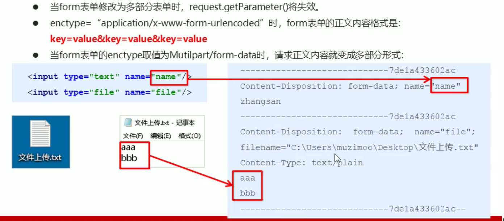

# 七、SpringMVC的文件上传

## 1、文件上传的原理





## 2、单文件上传


### 客户端表单实现


文件上传客户端表单需要满足：

+ 表单项type="file"
+ 表单的提交方式是post
+ 表单的enctype属性是多部分表单形式，即enctype="multipart/form-data"


```plain
<form action="${pageContext.request.contextPath}/user/quick22" method="post" enctype="multipart/form-data">
    名称：<input type="text" name="username"><br/>
    文件：<input type="file" name="file"><br>
    <input type="submit" value="提交">
</form>
```


### pom.xml添加依赖


```xml
<dependency>
    <groupId>commons-fileupload</groupId>
    <artifactId>commons-fileupload</artifactId>
    <version>1.3.1</version>
</dependency>
<dependency>
    <groupId>commons-io</groupId>
    <artifactId>commons-io</artifactId>
    <version>2.3</version>
</dependency>
```


### spring-mvc.xml 配置多媒体解析器


```xml
<!--    配置文件上传的解析器-->
<bean id="multipartResolver" class="org.springframework.web.multipart.commons.CommonsMultipartResolver">
    <property name="defaultEncoding" value="UTF-8"></property>
    <property name="maxUploadSize" value="500000"/>
</bean>
```


### 完成文件上传


```java
@Autowired
private ServletContext servletContext;

@RequestMapping(value = "/quick22")
@ResponseBody
public void save22(String username, MultipartFile file) throws IOException {
    
    System.out.println(username);
    System.out.println(file);

    //获得上传文件的名称
    String originalFilename = file.getOriginalFilename();

    String webRootPath=servletContext.getRealPath("");
    System.out.println(webRootPath);
    //移动文件
    file.transferTo(new File(webRootPath + "\\upload\\" + originalFilename));
}
```


## 3、多文件上传(应用)


### 将页面修改为多个文件上传项


```plain
<form action="${pageContext.request.contextPath}/user/quick23" method="post" enctype="multipart/form-data">
    名称：<input type="text" name="username"><br/>
    文件：<input type="file" name="file"><br>
    文件：<input type="file" name="file"><br>
    <input type="submit" value="提交">
</form>
```


### 将方法参数MultipartFile类型修改为MultipartFile[]


```java
@Autowired
private ServletContext servletContext;

@RequestMapping(value = "/quick23")
@ResponseBody
public void save23(String username, MultipartFile[] file) throws IOException {
    System.out.println(username);

    String webRootPath = servletContext.getRealPath("");

    for (MultipartFile multipartFile : file) {
        //获得上传文件的名称
        String originalFilename = multipartFile.getOriginalFilename();
        //移动文件
        multipartFile.transferTo(new File(webRootPath + "\\upload\\" + originalFilename));
    }

}
```


> 更新: 2023-06-13 15:36:50  
> 原文: <https://www.yuque.com/like321/nrum0k/nzqb6l>