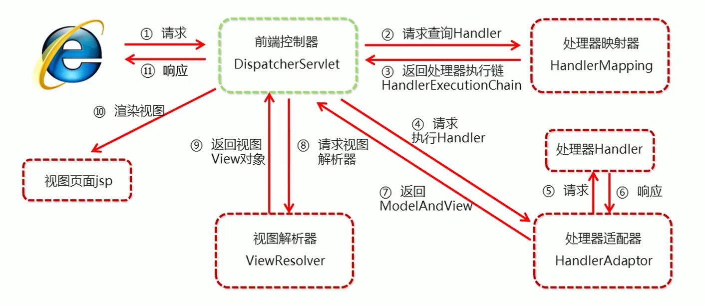

# 三、SpringMVC的组件解析

## 1、SpringMVC的执行流程





①用户发送请求至前端控制器DispatcherServlet。

②DispatcherServlet收到请求调用HandlerMapping处理器映射器。

③处理器映射器找到具体的处理器(可以根据xml配置、注解进行查找)，生成处理器对象及处理器拦截器(如果有则生成)一并返回给DispatcherServlet。

④DispatcherServlet调用HandlerAdapter处理器适配器。

⑤HandlerAdapter经过适配调用具体的处理器(Controller，也叫后端控制器)。

⑥Controller执行完成返回ModelAndView。

⑦HandlerAdapter将controller执行结果ModelAndView返回给DispatcherServlet。

⑧DispatcherServlet将ModelAndView传给ViewReslover视图解析器进行解析。

⑨ViewReslover解析后返回具体View。

⑩DispatcherServlet根据View进行渲染视图（即将模型数据填充至视图中）。

11DispatcherServlet响应用户。


## 2、SpringMVC组件解析


### 前端控制器：DispatcherServlet


用户请求到达前端控制器，它就相当于 MVC 模式中的 C，DispatcherServlet 是整个流程控制的中心，由它调用其它组件处理用户的请求，DispatcherServlet 的存在降低了组件之间的耦合性。


### 处理器映射器：HandlerMapping


    HandlerMapping 负责根据用户请求找到 Handler 即处理器，SpringMVC 提供了不同的映射器实现不同的映射方式，

	例如：配置文件方式，实现接口方式，注解方式等。


### 处理器适配器：HandlerAdapter


    通过 HandlerAdapter 对处理器进行执行，这是适配器模式的应用，通过扩展适配器可以对更多类型的处理器进行执行。


### 处理器：Handler


它就是我们开发中要编写的具体业务控制器。

由 DispatcherServlet 把用户请求转发到 Handler。

由Handler 对具体的用户请求进行处理。


### 视图解析器：View Resolver


    View Resolver 负责将处理结果生成 View 视图，View Resolver 首先根据逻辑视图名解析成物理视图名，即具体的页面地址，

	再生成 View 视图对象，最后对 View 进行渲染将处理结果通过页面展示给用户。


### 视图：View


    SpringMVC 框架提供了很多的 View 视图类型的支持，包括：jstlView、freemarkerView、pdfView等。最常用的视图就是 jsp。

	一般情况下需要通过页面标签或页面模版技术将模型数据通过页面展示给用户，需要由程序员根据业务需求开发具体的页面


## 3、@RequestMapping  


从注解名称上可以看到，@RequestMapping注解的作用就是<font style="color:#E8323C;">将请求和处理请求的控制器方法关联起来，建立映射关系。</font>


SpringMVC 接收到指定的请求，就会来找到在映射关系中对应的控制器方法来处理这个请求。


**<font style="color:#DF2A3F;">位置：</font>**

+ 类上，请求URL 的第一级访问目录。此处不写的话，就相当于应用的根目录
+ 方法上，请求 URL 的第二级访问目录，与类上的使用@ReqquestMapping标注的一级目录一起组成访问虚拟路径


```java
@Controller
@RequestMapping("/user")
public class UserController {

    @RequestMapping("/quick")
    public String save() {
        System.out.println("controller save running……");
        return "user/success.jsp";
    }

}
```


**<font style="color:#DF2A3F;">属性：</font>**

      value：用于指定请求的URL。它和path属性的作用是一样的

      method：用于指定请求的方式

      params：用于指定限制请求参数的条件。它支持简单的表达式。要求请求参数的key和value必须和配置的一模一样


例如：

> params = {"accountName"}，表示请求参数必须有accountName
>
> params = {"money!100"}，表示请求参数中money不能是100
>


```java
@Controller
@RequestMapping("/user")
public class UserController {

    @RequestMapping(value = "/quick", method = RequestMethod.POST, params = {"username"})
    public String save() {
        System.out.println("controller save running……");
        return "success.jsp";
    }

}
```


1. spring-mvc.xml 引入mvc命名空间


```xml
<!--    命名空间：-->
xmlns:mvc="http://www.springframework.org/schema/mvc" 
xmlns:context="http://www.springframework.org/schema/context"

<!--    约束地址：-->
http://www.springframework.org/schema/mvc 
http://www.springframework.org/schema/mvc/spring-mvc.xsd
http://www.springframework.org/schema/context
http://www.springframework.org/schema/context/spring-context.xsd
```


2. spring-mvc.xml 开启 组件扫描


SpringMVC基于Spring容器，所以在进行SpringMVC操作时，需要将Controller存储到Spring容器中，

如果使用@Controller注解标注的话，就需要使用组件扫描。

```xml
<?xml version="1.0" encoding="UTF-8" ?>
<beans 
       xmlns="http://www.springframework.org/schema/beans"
       xmlns:mvc="http://www.springframework.org/schema/mvc"
       xmlns:context="http://www.springframework.org/schema/context"
       xmlns:xsi="http://www.w3.org/2001/XMLSchema-instance"
       xsi:schemaLocation="http://www.springframework.org/schema/beans
                           http://www.springframework.org/schema/beans/spring-beans.xsd
                           http://www.springframework.org/schema/mvc
                           http://www.springframework.org/schema/mvc/spring-mvc.xsd
                           http://www.springframework.org/schema/context
                           http://www.springframework.org/schema/context/spring-context.xsd">
    
    <!--    组件扫描 扫描controller-->
    <context:component-scan base-package="com.itheima.controller"/>

</beans>
```


## 4、SpringMVC的XML配置视图解析器


SpringMVC有默认组件配置，默认组件都是DispatcherServlet.properties配置文件中配置的，


该配置文件地址org/springframework/web/servlet/DispatcherServlet.properties，

该文件中配置了默认的视图解析器，如下：

```properties
org.springframework.web.servlet.ViewResolver=org.springframework.web.servlet.view.InternalResourceViewResolver
```


翻看该解析器源码，可以看到该解析器的默认设置，如下：

```properties
REDIRECT_URL_PREFIX = "redirect:"  --重定向前缀
FORWARD_URL_PREFIX = "forward:"    --转发前缀（默认值）
prefix = "";     --视图名称前缀
suffix = "";     --视图名称后缀
```


### 配置视图解析器


spring-mvc.xml 修改视图的前后缀

```xml
<!--    配置内部资源视图解析器-->
<bean id="resourceViewResolver" class="org.springframework.web.servlet.view.InternalResourceViewResolver">
    <property name="prefix" value="/WEB-INF/pages/"></property>
    <property name="suffix" value=".jsp"></property>
</bean>
```


> 更新: 2023-06-13 15:32:19  
> 原文: <https://www.yuque.com/like321/nrum0k/xeq1o6>