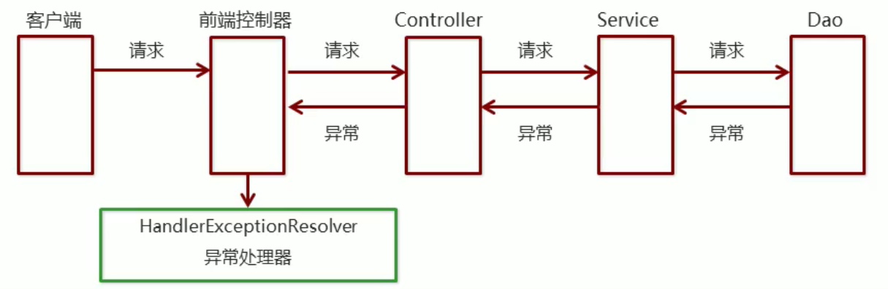

# 九、SpringMVC异常处理机制

## 1、异常处理的思路


系统中异常包括两类：编译时异常和运行时异常RuntimeException，


前者通过捕获异常从而获取异常信息，后者主要通过规范代码开发、测试等手段减少运行时异常的发生。


系统的Dao、Service、Controller出现都通过throws Exception向上抛出，最后由SpringMVC前端控制器交由异常处理器进行异常处理，如下图：





## 2、异常处理两种方式
### SimpleMappingExceptionResolver 
+  使用Spring MVC提供的简单异常处理器	

### 自定义自己的异常处理器 
+  实现Spring的异常处理接口HandlerExceptionResolver 


## 3、简单异常处理器


SpringMVC已经定义好了该类型转换器，在使用时可以根据项目情况进行相应异常与视图的映射配置


spring-mvc.xml


```xml
<!--    配置异常处理器-->
<bean class="org.springframework.web.servlet.handler.SimpleMappingExceptionResolver">
    <!--    默认错误视图-->
    <property name="defaultErrorView" value="error"/>
    <property name="exceptionMappings">
        <map>
            <!--    异常类型-->							<!--    错误视图-->
            <entry key="java.lang.ClassCastException" value="error1"></entry>
            <entry key="com.itheima.exception.MyException" value="error2"></entry>
        </map>
    </property>
</bean>
```


### 1、基于配置


SpringMVC提供了自定义的异常处理器SimpleMappingExceptionResolver，使用方式：


```xml
<!-- 配置异常处理 -->
<bean class="org.springframework.web.servlet.handler.SimpleMappingExceptionResolver">
    <property name="exceptionMappings">
        <props>
        	<!--
        		键表示处理器方法执行过程中出现的异常
        		值表示若出现指定异常时，设置一个新的视图名称，跳转到指定页面
        	-->
            <prop key="java.lang.ArithmeticException">error</prop>
        </props>
    </property>
    
    <!-- exceptionAttribute属性设置一个属性名，将出现的异常信息在请求域中进行共享 -->	
    <property name="exceptionAttribute" value="ex"></property>
</bean>
```


### 2、基于注解


```java
//@ControllerAdvice将当前类标识为异常处理的组件
@ControllerAdvice
public class ExceptionController {

    //@ExceptionHandler用于设置所标识方法处理的异常
    @ExceptionHandler(ArithmeticException.class)
    public String handleArithmeticException(Exception ex, Model model){
        //ex表示当前请求处理中出现的异常对象
        model.addAttribute("ex", ex);
        return "error";
    }

}
```


## 4、自定义异常处理


步骤：

1.  创建异常处理器类实现HandlerExceptionResolver 
2.  配置异常处理器 
3.  编写异常页面 
4.  测试异常跳转 


### 创建异常处理器类实现HandlerExceptionResolver


```java
public class MyExceptionResolver implements HandlerExceptionResolver {

    /*
        参数Exception：异常对象
        返回值ModelAndView：跳转到错误视图信息
     */
    public ModelAndView resolveException(HttpServletRequest httpServletRequest, HttpServletResponse httpServletResponse, Object o, Exception e) {

        ModelAndView modelAndView = new ModelAndView();

        if (e instanceof MyException) {
            modelAndView.addObject("info", "自定义异常");
        } else if (e instanceof ClassCastException) {
            modelAndView.addObject("info", "类转换异常");
        }

        modelAndView.setViewName("error");

        return modelAndView;
    }

}
```


### 配置异常处理器


```xml
<bean id="exceptionResolver" class="com.itheima.exception.MyExceptionResolver"/>
```


### 编写异常页面


```html
<%@ page contentType="text/html;charset=UTF-8" language="java" %>
<html>
<head>
	<title>Title</title>
</head>
<body>
	这是一个最终异常的显示页面
</body>
</html>
```


### 测试异常跳转


```java
@RequestMapping("/quick22")
@ResponseBody
public void quickMethod22() throws IOException, ParseException {
    SimpleDateFormat simpleDateFormat = new SimpleDateFormat("yyyy-MM-dd"); 
    simpleDateFormat.parse("abcde");
}
```


> 更新: 2022-08-18 23:30:50  
> 原文: <https://www.yuque.com/like321/nrum0k/lvhr1z>