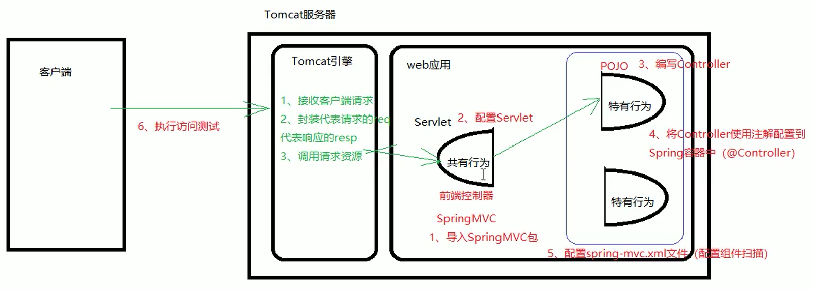
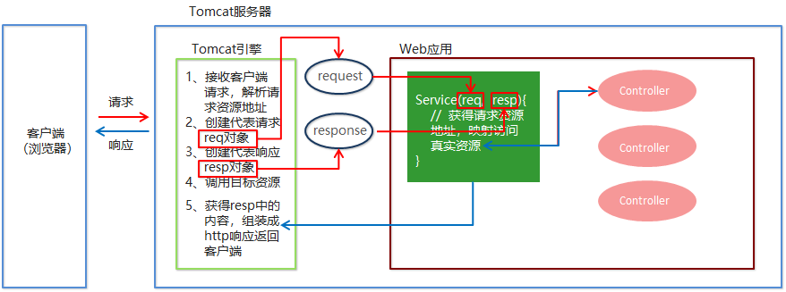

# 二、SpringMVC的简介

## 1、概述


SpringMVC 是一种基于 Java 的实现 MVC 设计模型的请求驱动类型的轻量级 Web 框架，属于SpringFrameWork 的后续产品，已经融合在 Spring Web Flow 中。


SpringMVC 已经成为目前最主流的MVC框架之一，并且随着Spring3.0 的发布，全面超越 Struts2，成为最优秀的 MVC 框架。


它通过一套注解，让一个简单的 Java 类成为处理请求的控制器，而无须实现任何接口。


同时它还支持 RESTful 编程风格的请求。





## 2、快速入门


需求：客户端发起请求，服务器端接收请求，执行逻辑并进行视图跳转。


①导入SpringMVC相关坐标

②配置SpringMVC核心控制器DispathcerServlet

③创建Controller类和视图页面

④使用注解配置Controller类中业务方法的映射地址

⑤配置SpringMVC核心文件 spring-mvc.xml

⑥客户端发起请求测试

### 2.1 导入坐标


添加web模块

打包方式：war

```xml
<!--Spring坐标-->
<dependency>
    <groupId>org.springframework</groupId>
    <artifactId>spring-context</artifactId>
    <version>5.0.5.RELEASE</version>
</dependency>
<!--SpringMVC坐标-->
<dependency>
    <groupId>org.springframework</groupId>
    <artifactId>spring-webmvc</artifactId>
    <version>5.0.5.RELEASE</version>
</dependency>
<!--Servlet坐标-->
<dependency>
    <groupId>javax.servlet</groupId>
    <artifactId>servlet-api</artifactId>
    <version>2.5</version>
</dependency>
<!--Jsp坐标-->
<dependency>
    <groupId>javax.servlet.jsp</groupId>
    <artifactId>jsp-api</artifactId>
    <version>2.0</version>
</dependency>
```


### 2.2 web.xml配置SpringMVC的核心控制器


注册SpringMVC的前端控制器DispatcherServlet


**<font style="color:#DF2A3F;">默认配置方式</font>**

此配置作用下，SpringMVC的配置文件默认位于WEB-INF下，默认名称为<servlet-name>-servlet.xml，

例如，以下配置所对应SpringMVC的配置文件位于WEB-INF下，文件名为DispatcherServlet-servlet.xml

```xml
<!-- 配置SpringMVC的前端控制器，对浏览器发送的请求进行统一处理 -->
<servlet>
    <servlet-name>DispatcherServlet</servlet-name>
    <servlet-class>org.springframework.web.servlet.DispatcherServlet</servlet-class>
</servlet>

<servlet-mapping>
    <servlet-name>DispatcherServlet</servlet-name>
    <!--
        设置springMVC的核心控制器所能处理的请求的请求路径
        /所匹配的请求可以是/login或.html或.js或.css方式的请求路径
        但是/不能匹配.jsp请求路径的请求
    -->
    <url-pattern>/</url-pattern>
</servlet-mapping>
```


**<font style="color:#DF2A3F;">扩展配置</font>**

通过init-param标签设置SpringMVC配置文件的位置和名称，

通过load-on-startup标签设置SpringMVC前端控制器DispatcherServlet的初始化时间

```xml
<!-- 配置SpringMVC的前端控制器，对浏览器发送的请求统一进行处理 -->
<servlet>
    <servlet-name>DispatcherServlet</servlet-name>
    <servlet-class>org.springframework.web.servlet.DispatcherServlet</servlet-class>
  
    <!-- 通过初始化参数指定SpringMVC配置文件的位置和名称 -->
    <init-param>
        <!-- contextConfigLocation为固定值 -->
        <param-name>contextConfigLocation</param-name>
        <!-- 使用classpath:表示从类路径查找配置文件，例如maven工程中的src/main/resources -->
        <param-value>classpath:spring-mvc.xml</param-value>
    </init-param>
    <!-- 
      作为框架的核心组件，在启动过程中有大量的初始化操作要做
      而这些操作放在第一次请求时才执行会严重影响访问速度
      因此需要通过此标签将启动控制DispatcherServlet的初始化时间提前到服务器启动时
    -->
    <load-on-startup>1</load-on-startup>
</servlet>

<servlet-mapping>
    <servlet-name>DispatcherServlet</servlet-name>
    <!--
        设置springMVC的核心控制器所能处理的请求的请求路径
        /所匹配的请求可以是/login或.html或.js或.css方式的请求路径
        但是/不能匹配.jsp请求路径的请求
    -->
    <url-pattern>/</url-pattern>
</servlet-mapping>
```


#### <url-pattern>标签中使用/和/*的区别：


/所匹配的请求可以是/login或.html或.js或.css方式的请求路径，但是<font style="color:#E8323C;">/不能匹配.jsp请求路径的请求</font>因此就可以避免在访问jsp页面时，该请求被DispatcherServlet处理，从而找不到相应的页面


/*则能够匹配所有请求，例如在使用<font style="color:#E8323C;">过滤器</font>时，若需要对所有请求进行过滤，就需要使用/*的写法


### 2.3 创建Controller类和视图页面


由于前端控制器对浏览器发送的请求进行了统一的处理，但是具体的请求有不同的处理过程，因此需要创建处理具体请求的类，即请求控制器


请求控制器中每一个处理请求的方法成为控制器方法


```java
public class UserController {

    public String save(){
        System.out.println("controller save running……");

        return "success.jsp";
    }

}
```


创建视图页面index.jsp


```html
<html>
  <body>
    <h2>Hello SpringMVC!</h2>
  </body>
</html>
```


### 2.4 配置注解


因为SpringMVC的控制器由一个POJO（普通的Java类）担任，因此需要通过@Controller注解将其标识为一个控制层组件，交给Spring的IOC容器管理，此时SpringMVC才能够识别控制器的存在


```java
@Controller
public class UserController {

    @RequestMapping("/quick")
    public String save(){
        System.out.println("controller save running……");

        return "success.jsp";
    }

}
```


### 2.5 创建spring-mvc.xml


```xml
<beans xmlns="http://www.springframework.org/schema/beans"  
    xmlns:mvc="http://www.springframework.org/schema/mvc"
    xmlns:context="http://www.springframework.org/schema/context" 
    xmlns:xsi="http://www.w3.org/2001/XMLSchema-instance"
    xsi:schemaLocation="http://www.springframework.org/schema/beans 
    http://www.springframework.org/schema/beans/spring-beans.xsd 
    http://www.springframework.org/schema/mvc   
    http://www.springframework.org/schema/mvc/spring-mvc.xsd  
    http://www.springframework.org/schema/context   
    http://www.springframework.org/schema/context/spring-context.xsd">
    
    <!--    Controller的组件扫描-->
    <context:component-scan base-package="com.itheima.controller"></context:component-scan>
    
    <!--
       处理静态资源，例如html、js、css、jpg
      若只设置该标签，则只能访问静态资源，其他请求则无法访问
      此时必须设置<mvc:annotation-driven/>解决问题
     -->
    <mvc:default-servlet-handler/>
    
    
    <!-- 开启mvc注解驱动 -->
    <mvc:annotation-driven>
        <mvc:message-converters>
            <!-- 处理响应中文内容乱码 -->
            <bean class="org.springframework.http.converter.StringHttpMessageConverter">
                <property name="defaultCharset" value="UTF-8"/>
                <property name="supportedMediaTypes">
                    <list>
                        <value>text/html</value>
                        <value>application/json</value>
                    </list>
                </property>
            </bean>
        </mvc:message-converters>
    </mvc:annotation-driven>
    
</beans>
```


### 2.6 访问测试地址


```plain
http://localhost:8080/itheima_spring_mvc_war_exploded/quick
```


## 3、SpringMVC流程图示





> 更新: 2023-06-13 15:24:17  
> 原文: <https://www.yuque.com/like321/nrum0k/rlg9i0>