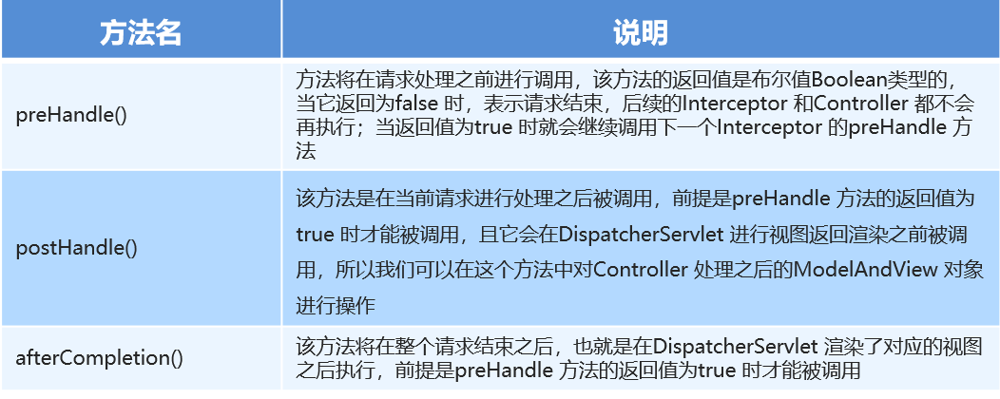

# 八、SpringMVC的拦截器

## 1、拦截器的作用


Spring MVC 的拦截器<font style="color:#E8323C;">类似于 Servlet  开发中的过滤器 Filter，用于对处理器进行预处理和后处理。</font>


将拦截器按一定的顺序联结成一条链，这条链称为<font style="color:#E8323C;">拦截器链（InterceptorChain）。</font>


在访问被拦截的方法或字段时，拦截器链中的拦截器就会按其之前定义的顺序被调用。


拦截器也是<font style="color:#E8323C;">AOP</font>思想的具体实现。


拦截器中的方法说明如下：





## 2、interceptor和filter区别


关于interceptor和filter的区别，如图所示：


## 3、快速入门


自定义拦截器很简单，只有如下三步：


①创建拦截器类实现HandlerInterceptor接口


②配置拦截器


③测试拦截器的拦截效果


### 编写拦截器：


```java
public class MyInterceptor1 implements HandlerInterceptor {

    //在目标方法执行之前
    @Override
    public boolean preHandle(HttpServletRequest request, HttpServletResponse response, Object handler) throws Exception {
        System.out.println("preHandle");
        return true;
    }

    //在目标方法执行之后，视图对象返回之前执行
    @Override
    public void postHandle(HttpServletRequest request, HttpServletResponse response, Object handler, ModelAndView modelAndView) throws Exception {
        System.out.println("postHandle");
    }

    //在流程都执行完毕后 执行
    @Override
    public void afterCompletion(HttpServletRequest request, HttpServletResponse response, Object handler, Exception ex) throws Exception {
        System.out.println("afterCompletion");
    }
}
```


### 在SpringMVC的配置文件中配置


```xml
<!--    配置拦截器-->
<mvc:interceptors>
    <mvc:interceptor>
        <!--            对哪些资源执行拦截操作-->
        <mvc:mapping path="/**"/>
        <!--            配置哪些资源排除拦截操作-->
        <mvc:exclude-mapping path="/user/login"/>
        <bean class="com.itheima.interceptor.MyInterceptor1"/>
    </mvc:interceptor>
</mvc:interceptors>
```


### 测试：


编写Controller,发请求到controller，跳转页面


```java
@Controller
public class TargetController {

    @RequestMapping("/target")
    public ModelAndView show() {
        System.out.println("目标资源执行……");

        ModelAndView modelAndView = new ModelAndView();
        modelAndView.addObject("name", "itcast");
        modelAndView.setViewName("index");

        return modelAndView;
    }

}
```


页面


```plain
<html>
<body>
<h2>Hello World! ${name}</h2>
</body>
</html>
```


## 4、快速入门详解


### 拦截器在预处理后什么情况下会执行目标资源，什么情况下不执行目标资源，


```java
public class MyInterceptor1 implements HandlerInterceptor {

    //在目标方法执行之前
    @Override
    public boolean preHandle(HttpServletRequest request, HttpServletResponse response, Object handler) throws Exception {
        System.out.println("preHandle");
        String param = request.getParameter("param");
        if ("yes".equals(param)) {
            return true;
        } else {
            request.getRequestDispatcher("/user/error.jsp").forward(request, response);
            return false;
        }
    }

    //在目标方法执行之后，视图对象返回之前执行
    @Override
    public void postHandle(HttpServletRequest request, HttpServletResponse response, Object handler, ModelAndView modelAndView) throws Exception {

        modelAndView.addObject("name", "itheima");
        System.out.println("postHandle");
    }

    //在流程都执行完毕后 执行
    @Override
    public void afterCompletion(HttpServletRequest request, HttpServletResponse response, Object handler, Exception ex) throws Exception {
        System.out.println("afterCompletion");
    }
}
```


结论：


当拦截器的<font style="color:#E8323C;">preHandle方法返回true则会执行目标资源，如果返回false则不执行目标资源</font>


### 多个拦截器的执行顺序是什么


再编写一个拦截器2，


```java
public class MyInterceptor2 implements HandlerInterceptor {
    //在目标方法执行之前 执行
    public boolean preHandle(HttpServletRequest request, HttpServletResponse response, Object handler) throws ServletException, IOException {
        System.out.println("preHandle22222.....");
        return true;
    }

    //在目标方法执行之后 视图对象返回之前执行
    public void postHandle(HttpServletRequest request, HttpServletResponse response, Object handler, ModelAndView modelAndView) {
        System.out.println("postHandle2222...");
    }

    //在流程都执行完毕后 执行
    public void afterCompletion(HttpServletRequest request, HttpServletResponse response, Object handler, Exception ex) {
        System.out.println("afterCompletion2222....");
    }
}
```


配置拦截器2


```xml
<!--配置拦截器-->
<mvc:interceptors>
    <mvc:interceptor>
        <!--对哪些资源执行拦截操作-->
        <mvc:mapping path="/**"/>
        <bean class="com.itheima.interceptor.MyInterceptor2"/>
    </mvc:interceptor>
    <mvc:interceptor>
        <!--对哪些资源执行拦截操作-->
        <mvc:mapping path="/**"/>
        <bean class="com.itheima.interceptor.MyInterceptor1"/>
    </mvc:interceptor>
</mvc:interceptors>
```


结论：


多个拦截器情况下，<font style="color:#E8323C;">配置在前的先执行，配置在后的后执行</font>


拦截器中的方法执行顺序是：preHandler-------目标资源----postHandle---- afterCompletion


+  若每个拦截器的preHandle()都返回true 
    - 此时多个拦截器的执行顺序和拦截器在SpringMVC的配置文件的配置顺序有关：
    - preHandle()会按照配置的顺序执行，而postHandle()和afterComplation()会按照配置的反序执行
+  若某个拦截器的preHandle()返回了false 
    - preHandle()返回false和它之前的拦截器的preHandle()都会执行，
    - postHandle()都不执行，返回false的拦截器之前的拦截器的afterComplation()会执行


## 5、用户登录权限控制


**分析**


用户没有登录的情况下，不能对后台菜单进行访问操作，点击菜单跳转到登录页面，只有用户登录成功后才能进行后台功能的操作


### 1：判断用户是否登录


本质：判断session中有没有user，如果没有登陆则先去登陆，如果已经登陆则直接放行访问目标资源


1. 编写拦截器如下：


```java
public class PrivilegeInterceptor implements HandlerInterceptor {
    
    public boolean preHandle(HttpServletRequest request, HttpServletResponse response, Object handler) throws IOException {
        //逻辑：判断用户是否登录  本质：判断session中有没有user
        HttpSession session = request.getSession();
        User user = (User) session.getAttribute("user");
        
        if(user==null){
            //没有登录
            response.sendRedirect(request.getContextPath()+"/login.jsp");
            return false;
        }
        
        //放行  访问目标资源
        return true;
    }
    
}
```


2. 然后配置该拦截器：


spring-mvc.xml，添加如下配置：


```xml
<!--配置权限拦截器-->
<mvc:interceptors>
    <mvc:interceptor>
        <!--配置对哪些资源执行拦截操作-->
        <mvc:mapping path="/**"/>
        <bean class="com.itheima.interceptor.PrivilegeInterceptor"/>
    </mvc:interceptor>
</mvc:interceptors>
```


### 2：通过用户名密码进行查询


在登陆页面输入用户名密码，点击登陆，通过用户名密码进行查询，


如果登陆成功，则将用户信息实体存入session，然后跳转到首页，


如果登陆失败则继续回到登陆页面


+ 在UserController中编写登陆逻辑


```java
@RequestMapping("/login")
public String login(String username,String password,HttpSession session){
    
    User user = userService.login(username,password);
    
    if(user!=null){
        //登录成功  将user存储到session
        session.setAttribute("user",user);
        return "redirect:/index.jsp";
    }
    
    return "redirect:/login.jsp";
}
```


+ service层代码如下：


```java
//service层
public User login(String username, String password) {
    User user = userDao.findByUsernameAndPassword(username,password);
    return user;
}
```


+ dao层代码如下：


```java
//dao层
public User findByUsernameAndPassword(String username, String password) throws EmptyResultDataAccessException{
    
    User user = jdbcTemplate.queryForObject("select * from sys_user where username=? and password=?", new BeanPropertyRowMapper<User>(User.class), username, password);
    
    return user;
}
```


+ 此时仍然登陆不上，因为我们需要将登陆请求url让拦截器放行,添加资源排除的配置


```xml
<!--配置权限拦截器-->
<mvc:interceptors>
    <mvc:interceptor>
        <!--配置对哪些资源执行拦截操作-->
        <mvc:mapping path="/**"/>
        <!--配置哪些资源排除拦截操作-->
        <mvc:exclude-mapping path="/user/login"/>
        <bean class="com.itheima.interceptor.PrivilegeInterceptor"/>
    </mvc:interceptor>
</mvc:interceptors>
```


### 3：service层添加异常的控制


JdbcTemplate.queryForObject对象如果查询不到数据会抛异常，导致程序无法达到预期效果，如何来解决该问题？


在业务层处理来自dao层的异常，如果出现异常service层返回null，而不是将异常抛给controller


因此改造登陆的业务层代码,添加异常的控制


```java
public User login(String username, String password) {
    try {
        User user = userDao.findByUsernameAndPassword(username,password);
        return user;
    }catch (EmptyResultDataAccessException e){
        return null;
    }
}
```


> 更新: 2023-02-20 14:45:43  
> 原文: <https://www.yuque.com/like321/nrum0k/oqxl38>