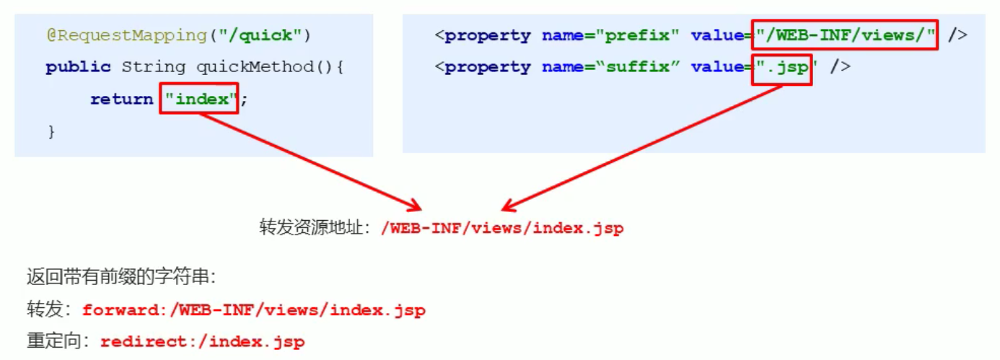

# 四、SpringMVC的数据响应

## 1、页面跳转


### 1.1 返回字符串形式


直接返回字符串：此种方式会将返回的字符串与视图解析器的前后缀拼接后跳转。





### 1.2 返回ModelAndView形式1


在Controller中方法返回ModelAndView对象，并且设置视图名称


```java
    @RequestMapping(value = "/quick2", method = RequestMethod.GET)
    public ModelAndView save2() {
        /**
         * model：模型 作用封装数据
         * view：视图 作用展示数据
         */
        ModelAndView modelAndView = new ModelAndView();
        //设置模型数据
        modelAndView.addObject("username", "itcast");
        //设置视图名称
        modelAndView.setViewName("success");
        return modelAndView;
    }
```


### 1.3 返回ModelAndView形式2


在Controller中方法形参上直接声明ModelAndView，无需在方法中自己创建，在方法中直接使用该对象设置视图，同样可以跳转页面


```java
@RequestMapping(value = "/quick3", method = RequestMethod.GET)
public ModelAndView save3(ModelAndView modelAndView) {
    //设置模型数据
    modelAndView.addObject("username", "itheima");
    //设置视图名称
    modelAndView.setViewName("success");
    return modelAndView;
}

@RequestMapping(value = "/quick4", method = RequestMethod.GET)
public String save4(Model model) {
    //设置模型数据
    model.addAttribute("username", "博学谷");

    return "success";
}
```


### 1.4 返回ModelAndView形式3


在Controller方法的形参上可以直接使用原生的HttpServeltRequest对象，只需声明即可


```java
@RequestMapping(value = "/quick5", method = RequestMethod.GET)
public String save5(HttpServletRequest request) {
    
    request.setAttribute("username", "张三");

    return "success";
}
```


## 2、回写数据


### 2.1 直接回写字符串


通过SpringMVC框架注入的response对象，使用response.getWriter().print(“hello world”) 回写数据，此时不需要视图跳转，业务方法返回值为void


```java
@RequestMapping(value = "/quick6", method = RequestMethod.GET)
public void save6(HttpServletResponse response) throws IOException {
    response.getWriter().print("hello world");
}
```


将需要回写的字符串直接返回，但此时需要通过@ResponseBody注解告知SpringMVC框架，方法返回的字符串不是跳转是直接在http响应体中返回


```java
@RequestMapping(value = "/quick7", method = RequestMethod.GET)
@ResponseBody //告知SpringMVC框架 不进行视图跳转 直接进行数据响应
public String save7() {
    return "hello world";
}
```


### 2.2 直接回写json格式字符串


```java
@RequestMapping(value="/quick8")
@ResponseBody
public String save8() throws IOException {
    return "{\"username\":\"zhangsan\",\"age\":18}";
}
```


手动拼接json格式字符串的方式很麻烦，开发中往往要将复杂的java对象转换成json格式的字符串，


我们可以使用web阶段学习过的json转换工具jackson进行转换,通过jackson转换json格式字符串，回写字符串


```java
@RequestMapping(value = "/quick8", method = RequestMethod.GET)
@ResponseBody
public String save8() throws JsonProcessingException {

    User user = new User();
    user.setUsername("张三");
    user.setAge(30);

    //使用json的转换工具将对象转换成json格式字符串再返回
    ObjectMapper objectMapper = new ObjectMapper();
    String string = objectMapper.writeValueAsString(user);

    return string;
}
```


### 2.3 返回对象或集合


通过SpringMVC帮助我们对对象或集合进行json字符串的转换并回写，为处理器适配器配置消息转换参数，指定使用jackson进行对象或集合的转换


在spring-mvc.xml中进行如下配置：


```xml
<!--        配置处理器映射器-->
<bean class="org.springframework.web.servlet.mvc.method.annotation.RequestMappingHandlerAdapter">
    <property name="messageConverters">
        <list>
            <bean class="org.springframework.http.converter.json.MappingJackson2HttpMessageConverter"/>
        </list>
    </property>
</bean>
```


```java
@RequestMapping(value = "/quick9", method = RequestMethod.GET)
@ResponseBody
//期望SpringMVC自动将User转换成json格式的字符串
public User save9(){

    User user = new User();
    user.setUsername("李四");
    user.setAge(30);

    return user;
}
```


### 2.4 返回对象或集合2


在方法上添加@ResponseBody就可以返回json格式的字符串，但是这样配置比较麻烦，配置的代码比较多，因此，我们可以使用mvc的注解驱动代替上述配置


#### 注解驱动 <mvc:annotation-driven/>


在spring-mvc.xml中进行如下配置：


```xml
<!--    配置MVC注解驱动-->
<mvc:annotation-driven/>
```


在 SpringMVC 的各个组件中，处理器映射器、处理器适配器、视图解析器称为 SpringMVC 的三大组件。


+  使用`<mvc:annotation-driven />`自动加载 RequestMappingHandlerMapping（处理映射器）和 RequestMappingHandlerAdapter（ 处 理 适 配 器 ） 
+  可以使用`<mvc:annotation-driven />`替代注解处理器和适配器的配置。 
+  同时使用`<mvc:annotation-driven />`默认底层就会集成jackson进行对象或集合的json格式字符串的转换 


> 更新: 2023-06-13 15:34:42  
> 原文: <https://www.yuque.com/like321/nrum0k/tcwhpm>