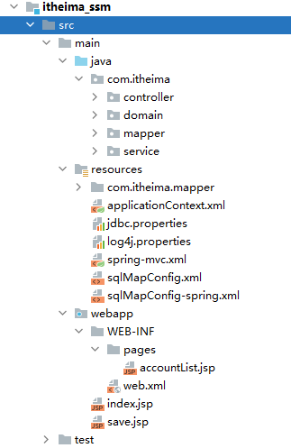
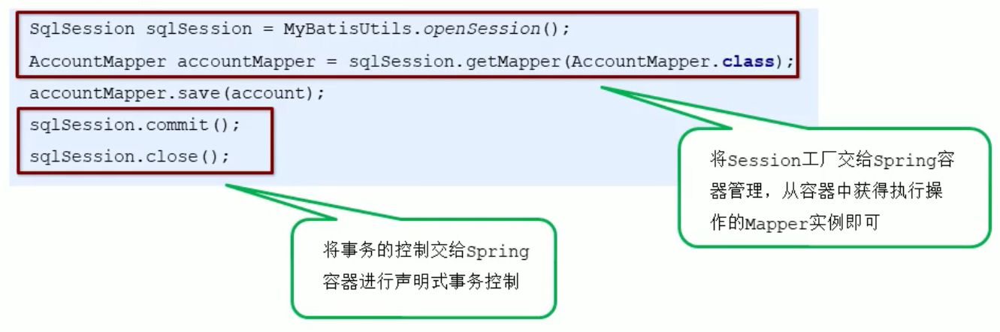

# SSM框架整合

# 一、原始方式整合


## 1.创建数据表


```sql
create table account(
	id int primary key auto_increment,
	name varchar(100),
	money double(7,2)
);
```


## 2.创建Maven工程





## 3.导入Maven坐标


```xml
<!--spring相关-->
<dependency>
    <groupId>org.springframework</groupId>
    <artifactId>spring-context</artifactId>
    <version>5.0.5.RELEASE</version>
</dependency>
<dependency>
    <groupId>org.aspectj</groupId>
    <artifactId>aspectjweaver</artifactId>
    <version>1.8.7</version>
</dependency>
<dependency>
    <groupId>org.springframework</groupId>
    <artifactId>spring-jdbc</artifactId>
    <version>5.0.5.RELEASE</version>
</dependency>
<dependency>
    <groupId>org.springframework</groupId>
    <artifactId>spring-tx</artifactId>
    <version>5.0.5.RELEASE</version>
</dependency>
<dependency>
    <groupId>org.springframework</groupId>
    <artifactId>spring-test</artifactId>
    <version>5.0.5.RELEASE</version>
</dependency>
<dependency>
    <groupId>org.springframework</groupId>
    <artifactId>spring-webmvc</artifactId>
    <version>5.0.5.RELEASE</version>
</dependency>

<!--servlet和jsp-->
<dependency>
    <groupId>javax.servlet</groupId>
    <artifactId>servlet-api</artifactId>
    <version>2.5</version>
</dependency>
<dependency>
    <groupId>javax.servlet.jsp</groupId>
    <artifactId>jsp-api</artifactId>
    <version>2.0</version>
</dependency>

<!--mybatis相关-->
<dependency>
    <groupId>org.mybatis</groupId>
    <artifactId>mybatis</artifactId>
    <version>3.4.5</version>
</dependency>
<dependency>
    <groupId>org.mybatis</groupId>
    <artifactId>mybatis-spring</artifactId>
    <version>1.3.1</version>
</dependency>
<dependency>
    <groupId>mysql</groupId>
    <artifactId>mysql-connector-java</artifactId>
    <version>5.1.6</version>
</dependency>
<dependency>
    <groupId>c3p0</groupId>
    <artifactId>c3p0</artifactId>
    <version>0.9.1.2</version>
</dependency>

<dependency>
    <groupId>junit</groupId>
    <artifactId>junit</artifactId>
    <version>4.12</version>
</dependency>
<dependency>
    <groupId>jstl</groupId>
    <artifactId>jstl</artifactId>
    <version>1.2</version>
</dependency>
```


## 4.编写实体类


```java
public class Account {

    private Integer id;
    private String name;
    private Double money;

    public Integer getId() {
        return id;
    }

    public void setId(Integer id) {
        this.id = id;
    }

    public String getName() {
        return name;
    }

    public void setName(String name) {
        this.name = name;
    }

    public Double getMoney() {
        return money;
    }

    public void setMoney(Double money) {
        this.money = money;
    }

}
```


## 5.编写Mapper接口


```java
public interface AccountMapper {

    //保存账户数据
    public void save(Account account);

    //查询账户数据
    public List<Account> findAll();

}
```


## 6.编写Service接口


```java
public interface AccountService {

    //保存账户数据
    public void save(Account account);

    //查询账户数据
    public List<Account> findAll();

}
```


## 7.编写Service接口实现


```java
@Service("accountService")
public class AccountServiceImpl implements AccountService {

    @Override
    public void save(Account account) {
        try {
            InputStream resourceAsStream = Resources.getResourceAsStream("sqlMapConfig.xml");
            SqlSessionFactory sqlSessionFactory = new SqlSessionFactoryBuilder().build(resourceAsStream);
            SqlSession sqlSession = sqlSessionFactory.openSession();

            AccountMapper mapper = sqlSession.getMapper(AccountMapper.class);
            mapper.save(account);

            sqlSession.commit();
            sqlSession.close();

        } catch (IOException e) {
            e.printStackTrace();
        }
    }

    @Override
    public List<Account> findAll() {
        try {
            InputStream resourceAsStream = Resources.getResourceAsStream("sqlMapConfig.xml");
            SqlSessionFactory sqlSessionFactory = new SqlSessionFactoryBuilder().build(resourceAsStream);
            SqlSession sqlSession = sqlSessionFactory.openSession();

            AccountMapper mapper = sqlSession.getMapper(AccountMapper.class);
            List<Account> accountList = mapper.findAll();

            sqlSession.close();

            return accountList;

        } catch (IOException e) {
            e.printStackTrace();
        }
        return null;
    }
}
```


## 8.编写Controller


```java
@Controller
@RequestMapping("/account")
public class AccountController {

    @Autowired
    private AccountService accountService;

    @RequestMapping(value = "/save",produces = "text/html;charset=UTF-8")
    @ResponseBody
    public String save(Account account) {

        accountService.save(account);

        return "保存成功";
    }


    @RequestMapping("/list")
    public ModelAndView findAll() {
        List<Account> accountList = accountService.findAll();

        ModelAndView modelAndView = new ModelAndView();
        modelAndView.addObject("accountList",accountList);
        modelAndView.setViewName("accountList");

        return modelAndView;
    }

}
```


## 9.编写页面


### 添加页面


```html
<%@ page contentType="text/html;charset=UTF-8" language="java" %>
<html>
<head>
    <title>Title</title>
</head>
<body>
    <h1>保存账户信息表单</h1>

    <form action="${pageContext.request.contextPath}/account/save" method="post">
        用户名称<input type="text" name="name"><br/>
        账户金额<input type="text" name="money"><br/>
        <input type="submit" value="保存"><br/>
    </form>
</body>
</html>
```


### 列表页面


```html
<%@ page contentType="text/html;charset=UTF-8" language="java" %>
<%@taglib prefix="c" uri="http://java.sun.com/jsp/jstl/core" %>
<html>
<head>
    <title>Title</title>
</head>
<body>
<h1>展示账户数据列表</h1>

<table border="1">
    <tr>
        <th>账户id</th>
        <th>账户名称</th>
        <th>账户金额</th>
    </tr>
    <c:forEach items="${accountList}" var="account">
        <tr>
            <td>${account.id}</td>
            <td>${account.name}</td>
            <td>${account.money}</td>
        </tr>
    </c:forEach>
</table>

</body>
</html>
```


## 10.编写相应配置文件


### 日志文件：log4j.properties


```properties
### direct log messages to stdout ###
log4j.appender.stdout=org.apache.log4j.ConsoleAppender
log4j.appender.stdout.Target=System.err
log4j.appender.stdout.layout=org.apache.log4j.PatternLayout
log4j.appender.stdout.layout.ConversionPattern=%d{ABSOLUTE} %5p %c{1}:%L - %m%n

### direct messages to file hibernate.log ###
#log4j.appender.file=org.apache.log4j.FileAppender
#log4j.appender.file.File=hibernate.log
#log4j.appender.file.layout=org.apache.log4j.PatternLayout
#log4j.appender.file.layout.ConversionPattern=%d{ABSOLUTE} %5p %c{1}:%L - %m%n

### set log levels - for more verbose logging change 'info' to 'debug' ###

log4j.rootLogger=all, stdout
```


### 数据库连接信息文件：jdbc.properties


```properties
jdbc.driver=com.mysql.jdbc.Driver
jdbc.url=jdbc:mysql://localhost:3306/test
jdbc.username=root
jdbc.password=root
```


### MyBatis核心文件：sqlMapConfig.xml


```xml
<?xml version="1.0" encoding="UTF-8" ?>
<!DOCTYPE configuration
        PUBLIC "-//mybatis.org//DTD Config 3.0//EN"
        "http://mybatis.org/dtd/mybatis-3-config.dtd">

<configuration>

    <!--    加载properties文件-->
    <properties resource="jdbc.properties"/>


    <!--定义别名-->
    <typeAliases>
        <!--        <typeAlias type="com.itheima.domain.Account" alias="account"></typeAlias>-->
        <package name="com.itheima.domain"/>
    </typeAliases>

    <!--    环境-->
    <environments default="development">
        <environment id="development">
            <transactionManager type="JDBC"></transactionManager>
            <dataSource type="POOLED">
                <property name="driver" value="${jdbc.driver}"/>
                <property name="url" value="${jdbc.url}"/>
                <property name="username" value="${jdbc.username}"/>
                <property name="password" value="${jdbc.password}"/>
            </dataSource>
        </environment>
    </environments>


    <!--    加载映射-->
    <mappers>
        <!--        <mapper resource="com/itheima/mapper/AccountMapper.xml"></mapper>-->
        <package name="com.itheima.mapper"/>
    </mappers>
</configuration>
```


### MyBatis映射文件：AccountMapper.xml


```xml
<?xml version="1.0" encoding="UTF-8" ?>
<!DOCTYPE mapper
        PUBLIC "-//mybatis.org//DTD Mapper 3.0//EN"
        "http://mybatis.org/dtd/mybatis-3-mapper.dtd">


<mapper namespace="com.itheima.mapper.AccountMapper">
    <insert id="save" parameterType="account">
        insert into account values (#{id},#{name},#{money})
    </insert>
    <select id="findAll" resultType="account">
        select * from account
    </select>
</mapper>
```


### SprngMVC配置文件：spring-mvc.xml


```xml
<?xml version="1.0" encoding="UTF-8" ?>
<beans xmlns="http://www.springframework.org/schema/beans"
       xmlns:mvc="http://www.springframework.org/schema/mvc"
       xmlns:context="http://www.springframework.org/schema/context"
       xmlns:xsi="http://www.w3.org/2001/XMLSchema-instance"
       xsi:schemaLocation="http://www.springframework.org/schema/beans
http://www.springframework.org/schema/beans/spring-beans.xsd
http://www.springframework.org/schema/mvc
http://www.springframework.org/schema/mvc/spring-mvc.xsd
http://www.springframework.org/schema/context
http://www.springframework.org/schema/context/spring-context.xsd">

    <!--    组件扫描 扫描controller-->
    <context:component-scan base-package="com.itheima.controller"/>

    <!--    配置MVC注解驱动-->
    <mvc:annotation-driven/>

    <!--    配置内部资源视图解析器-->
    <bean id="internalResourceViewResolver" class="org.springframework.web.servlet.view.InternalResourceViewResolver">
        <property name="prefix" value="/WEB-INF/pages/"></property>
        <property name="suffix" value=".jsp"></property>
    </bean>

    <!--    开放静态资源访问权限-->
    <mvc:default-servlet-handler/>
</beans>
```


### Spring配置文件：applicationContext.xml


```xml
<?xml version="1.0" encoding="UTF-8" ?>
<beans xmlns="http://www.springframework.org/schema/beans"
       xmlns:xsi="http://www.w3.org/2001/XMLSchema-instance"
       xmlns:aop="http://www.springframework.org/schema/aop"
       xmlns:tx="http://www.springframework.org/schema/tx"
       xmlns:context="http://www.springframework.org/schema/context"
       xsi:schemaLocation="http://www.springframework.org/schema/beans
http://www.springframework.org/schema/beans/spring-beans.xsd
http://www.springframework.org/schema/tx
http://www.springframework.org/schema/tx/spring-tx.xsd
http://www.springframework.org/schema/aop
http://www.springframework.org/schema/aop/spring-aop.xsd
http://www.springframework.org/schema/context
http://www.springframework.org/schema/context/spring-context.xsd">

    <!--    组件扫描 扫描service和mapper-->
    <context:component-scan base-package="com.itheima">
        <!--     排除controller的扫描-->
        <context:exclude-filter type="annotation" expression="org.springframework.stereotype.Controller"/>
    </context:component-scan>


</beans>
```


### Web.xml


```xml
<?xml version="1.0" encoding="UTF-8"?>
<web-app version="2.4"
         xmlns="http://java.sun.com/xml/ns/j2ee"
         xmlns:xsi="http://www.w3.org/2001/XMLSchema-instance"
         xsi:schemaLocation="http://java.sun.com/xml/ns/j2ee http://java.sun.com/xml/ns/j2ee/web-app_2_4.xsd">


    <!--  spring监听器-->
    <context-param>
        <param-name>contextConfigLocation</param-name>
        <param-value>classpath:applicationContext.xml</param-value>
    </context-param>
    <listener>
        <listener-class>org.springframework.web.context.ContextLoaderListener</listener-class>
    </listener>


    <!--    springmvc的前端控制器-->
    <servlet>
        <servlet-name>DispatcherServlet</servlet-name>
        <servlet-class>org.springframework.web.servlet.DispatcherServlet</servlet-class>
        <init-param>
            <param-name>contextConfigLocation</param-name>
            <param-value>classpath:spring-mvc.xml</param-value>
        </init-param>
        <load-on-startup>1</load-on-startup>
    </servlet>
    <servlet-mapping>
        <servlet-name>DispatcherServlet</servlet-name>
        <url-pattern>/</url-pattern>
    </servlet-mapping>


    <!--  乱码过滤器-->
    <filter>
        <filter-name>CharacterEncodingFilter</filter-name>
        <filter-class>org.springframework.web.filter.CharacterEncodingFilter</filter-class>
        <init-param>
            <param-name>encoding</param-name>
            <param-value>UTF-8</param-value>
        </init-param>
    </filter>
    <filter-mapping>
        <filter-name>CharacterEncodingFilter</filter-name>
        <url-pattern>/*</url-pattern>
    </filter-mapping>
</web-app>
```


# 二、Spring整合MyBatis


## 1.整合思路





## 2. 修改MyBatis核心文件：


sqlMapConfig.xml	---》	splMapConfig-spring.xml


```xml
<?xml version="1.0" encoding="UTF-8" ?>
<!DOCTYPE configuration
        PUBLIC "-//mybatis.org//DTD Config 3.0//EN"
        "http://mybatis.org/dtd/mybatis-3-config.dtd">

<configuration>

    <!--定义别名-->
    <typeAliases>
        <!--        <typeAlias type="com.itheima.domain.Account" alias="account"></typeAlias>-->
        <package name="com.itheima.domain"/>
    </typeAliases>


</configuration>
```


## 3. 修改Spring配置文件：applicationContext.xml


### 1.将SqlSessionFactory配置到Spring容器中


```xml
<!--	加载jdbc.properties-->
<context:property-placeholder location="classpath:jdbc.properties"/>

<!--    配置数据源-->
<bean id="dataSource" class="com.mchange.v2.c3p0.ComboPooledDataSource">
    <property name="driverClass" value="${jdbc.driver}"></property>
    <property name="jdbcUrl" value="${jdbc.url}"></property>
    <property name="user" value="${jdbc.username}"></property>
    <property name="password" value="${jdbc.password}"></property>
</bean>

<!--	配置MyBatis的SqlSessionFactory-->
<bean id="sqlSessionFactory" class="org.mybatis.spring.SqlSessionFactoryBean">
    <property name="dataSource" ref="dataSource" />
    <!--        加载mybatis核心文件-->
    <property name="configLocation" value="classpath:sqlMapConfig-spring.xml" />
</bean>
```


### 2.扫描Mapper，让Spring容器产生Mapper实现类


```xml
<!--    加载映射 扫描mapper所在的包 为mapper创建实现类-->
<bean class="org.mybatis.spring.mapper.MapperScannerConfigurer">
    <property name="basePackage" value="com.itheima.mapper"/>
</bean>
```


### 3.配置声明式事务控制


```xml
<!--    平台事务管理器-->
<bean id="transactionManager" class="org.springframework.jdbc.datasource.DataSourceTransactionManager">
    <property name="dataSource" ref="dataSource"/>
</bean>

<!--    配置事务增强-->
<tx:advice id="txAdvice" transaction-manager="transacionManager">
    <tx:attributes>
        <tx:method name="*"/>
    </tx:attributes>
</tx:advice>

<!--    事务的AOP织入-->
<aop:config>
    <aop:pointcut id="txPointcut" expression="execution(* com.itheima.service.impl.*.*(..))"/>
    <aop:advisor advice-ref="txAdvice" pointcut-ref="txPointcut"/>
    <!--  <aop:advisor advice-ref="txAdvice" pointcut="execution(* com.itheima.service.impl.*.*(..))"/>-->
</aop:config>
```


## 4.修改Service实现类代码


```java
@Service("accountService")
public class AccountServiceImpl implements AccountService {

    @Autowired
    private AccountMapper accountMapper;

    @Override
    public void save(Account account) {
        accountMapper.save(account);
    }

    @Override
    public List<Account> findAll() {
        return accountMapper.findAll();
    }
}
```


> 更新: 2022-10-01 14:08:23  
> 原文: <https://www.yuque.com/like321/ua3lgh/wozgeu>