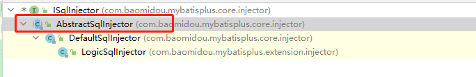
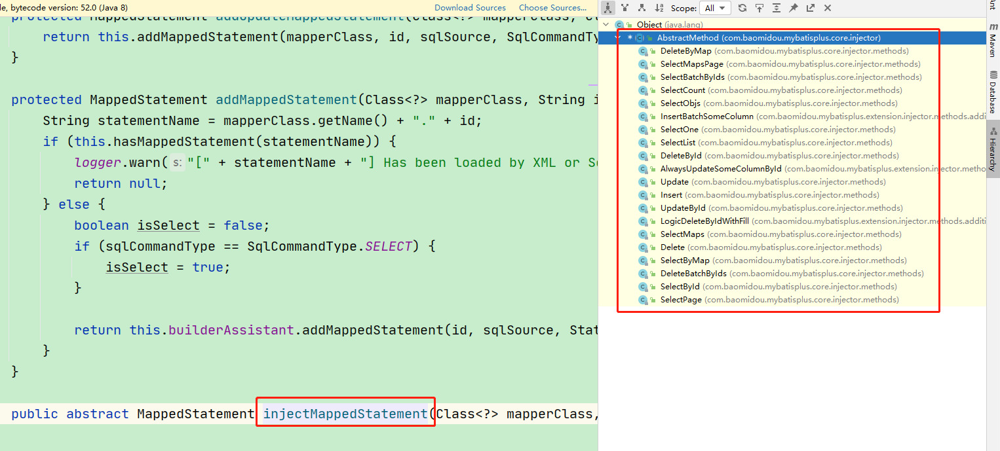
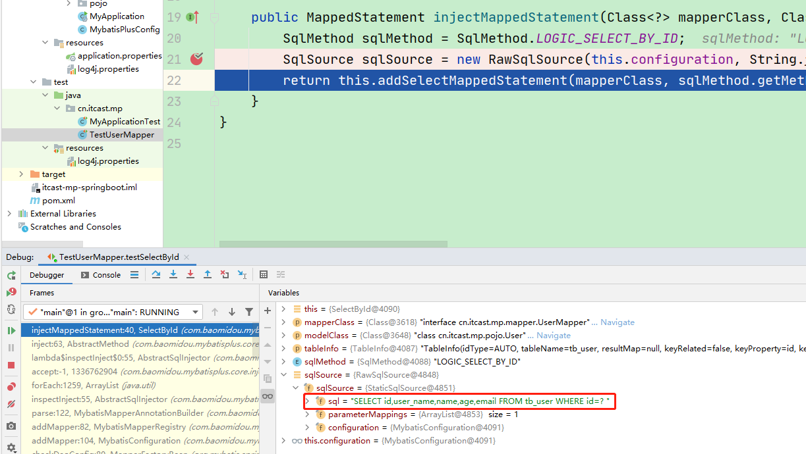

# 三、通用CRUD

通过前面的学习，我们了解到通过继承BaseMapper就可以获取到各种各样的单表操作，接下来我们将详细讲解这些操作。


## 3.1、插入操作


### 方法定义


```java
/**
* 插入一条记录
*
* @param entity 实体对象
*/
int insert(T entity);
```


### 测试用例


```java
package cn.itcast.mp;

import cn.itcast.mp.mapper.UserMapper;
import cn.itcast.mp.pojo.User;
import org.junit.Test;
import org.junit.runner.RunWith;
import org.springframework.beans.factory.annotation.Autowired;
import org.springframework.boot.test.context.SpringBootTest;
import org.springframework.test.context.junit4.SpringRunner;

@RunWith(SpringRunner.class)
@SpringBootTest
public class TestUserMapper {

    @Autowired
    private UserMapper userMapper;

    @Test
    public void testInsert(){
        User user = new User();
        user.setEmail("sdf@s.com");
        user.setAge(30);
        user.setUserName("caocao");
        user.setName("曹操");
        user.setPassword("123456");

        int insert = userMapper.insert(user);//数据库受影响的行数
        System.out.println(insert);

        //获取自增长后的id值，自增长后的id值会回填到user对象中
        System.out.println(user.getId());
    }

}
```


可以看到，数据已经写入到了数据库，但是，id的值不正确，我们期望的是数据库自增长，实际是MP生成了id的值写入到了数据库。


如何设置id的生成策略呢？


### MP支持的id策略：


```java
package com.baomidou.mybatisplus.annotation;
import lombok.Getter;
/**
* 生成ID类型枚举类
*
* @author hubin
* @since 2015-11-10
*/
@Getter
public enum IdType {
    /**
  * 数据库ID自增
  */
    AUTO(0),
    /**
  * 该类型为未设置主键类型
  */
    NONE(1),
    /**
  * 用户输入ID
  * <p>该类型可以通过自己注册自动填充插件进行填充</p>
  */
    INPUT(2),
    /* 以下3种类型、只有当插入对象ID 为空，才自动填充。 */
    /**
  * 全局唯一ID (idWorker)
  */
    ID_WORKER(3),
    /**
  * 全局唯一ID (UUID)
  */
    UUID(4),
    /**
  * 字符串全局唯一ID (idWorker 的字符串表示)
  */
    ID_WORKER_STR(5);
    private final int key;
    IdType(int key) {
        this.key = key;
    }
}
```


### 指定id类型为自增长


```java
package cn.itcast.mp.pojo;

import com.baomidou.mybatisplus.annotation.IdType;
import com.baomidou.mybatisplus.annotation.TableId;
import com.baomidou.mybatisplus.annotation.TableName;
import lombok.AllArgsConstructor;
import lombok.Data;
import lombok.NoArgsConstructor;

@Data
@NoArgsConstructor
@AllArgsConstructor
@TableName("tb_user")
public class User {

    @TableId(type = IdType.AUTO) //指定id类型为自增长
    private Long id;
    private String userName;
    private String password;
    private String name;
    private Integer age;
    private String email;

}
```


### @TableField  


在MP中通过@TableField注解可以指定字段的一些属性，常常解决的问题有 2 个：


1 、对象中的属性名和字段名不一致的问题（非驼峰）


2 、对象中的属性字段在表中不存在的问题


```java
@Data
@NoArgsConstructor
@AllArgsConstructor
@TableName("tb_user")
public class User {

    @TableId(type = IdType.AUTO)
    private Long id;
    private String userName;

    @TableField(select = false) //查询时不返回该字段的值
    private String password;

    private String name;
    private Integer age;

    @TableField(value = "email") //指定数据表中的字段名
    private String email;

    @TableField(exist = false)
    private String address; //在数据表中是不存在的
}
```


其他用法，如字段不加入查询字段：


## 3.2、更新操作


在MP中，更新操作有 2 种，一种是根据id更新，另一种是根据条件更新。


### 根据id更新


#### 方法定义：


```java
 /**
  * 根据 ID 修改
  *
  * @param entity 实体对象
  */
  int updateById(@Param(Constants.ENTITY) T entity);
```


#### 测试：


```java
@RunWith(SpringRunner.class)
@SpringBootTest
public class TestUserMapper {

    @Autowired
    private UserMapper userMapper;

    @Test
    public void testUpdateById(){
        User user = new User();
        //更新的条件
        user.setId(1L);	
        //更新的字段
        user.setEmail("sdf@s.com");
        user.setAge(45);
        user.setPassword("666");

        int i = userMapper.updateById(user);
        System.out.println(i);
    }

}
```


### 根据条件更新


#### 方法定义：


```java
   /**
  * 根据 whereEntity 条件，更新记录
  *
  * @param entity    实体对象 (set 条件值,可以为 null)
  * @param updateWrapper 实体对象封装操作类（可以为 null,里面的 entity 用于生成 where 语句）
  */
  int update(@Param(Constants.ENTITY) T entity, @Param(Constants.WRAPPER) Wrapper<T>
updateWrapper);
```


#### 测试用例：


```java
@RunWith(SpringRunner.class)
@SpringBootTest
public class TestUserMapper {

    @Autowired
    private UserMapper userMapper;

    @Test
    public void testUpdate() {

        User user = new User();
        //更新的字段
        user.setAge(20);
        user.setPassword("8888");
        //更新的条件
        QueryWrapper<User> wrapper = new QueryWrapper<>();
        wrapper.eq("user_name", "zhangsan");

        int update = userMapper.update(user, wrapper);
        System.out.println(update);

    }

}
```


或者，通过UpdateWrapper进行更新：均可达到更新的效果。


```java

@RunWith(SpringRunner.class)
@SpringBootTest
public class TestUserMapper {

    @Autowired
    private UserMapper userMapper;

    @Test
    public void testUpdate2() {

        UpdateWrapper<User> wrapper = new UpdateWrapper<>();
        wrapper.eq("user_name", "zhangsan")//更新的条件
            .set("age",21).set("password","999999"); //更新的字段

        int update = userMapper.update(null, wrapper);
        System.out.println(update);

    }

}
```


关于wrapper更多的用法后面会详细讲解。


## 3.3、删除操作


### deleteById


#### 方法定义：


```java
/**
* 根据 ID 删除
*
* @param id 主键ID
*/
int deleteById(Serializable id);
```


#### 测试用例：


```java
@RunWith(SpringRunner.class)
@SpringBootTest
public class TestUserMapper {

    @Autowired
    private UserMapper userMapper;

    @Test
    public void testDeleteById(){
        //根据id删除数据
        int i = userMapper.deleteById(6L);
        System.out.println(i);

    }

}
```


### deleteByMap


#### 方法定义：


```java
  /**
  * 根据 columnMap 条件，删除记录
  *
  * @param columnMap 表字段 map 对象
  */
  int deleteByMap(@Param(Constants.COLUMN_MAP) Map<String, Object> columnMap);
```


#### 测试用例：


```java
@RunWith(SpringRunner.class)
@SpringBootTest
public class TestUserMapper {

    @Autowired
    private UserMapper userMapper;

    @Test
    public void testDeleteByMap(){

        Map<String,Object> map = new HashMap<>();
        map.put("user_name","zhangsan");
        map.put("password","123");

        //根据map删除数据，多条件之间是and关系
        int i = userMapper.deleteByMap(map);
        System.out.println(i);
    }

}
```


### delete


#### 方法定义：


```java
/**
* 根据 entity 条件，删除记录
*
* @param wrapper 实体对象封装操作类（可以为 null）
*/
int delete(@Param(Constants.WRAPPER) Wrapper<T> wrapper);
```


#### 测试用例：


```java
@RunWith(SpringRunner.class)
@SpringBootTest
public class TestUserMapper {

    @Autowired
    private UserMapper userMapper;

    @Test
    public void testDelete() {

//        用法一：
//        QueryWrapper<User> wrapper = new QueryWrapper<>();
//        wrapper.eq("user_name","caocao1")
//                .eq("password","123456");

        //用法二:
        User user = new User();
        user.setPassword("123456");
        user.setUserName("caocao");
        QueryWrapper<User> wrapper = new QueryWrapper<>(user);

        //根据包装条件做删除
        int delete = userMapper.delete(wrapper);
        System.out.println(delete);
    }

}
```


### deleteBatchIds


#### 方法定义：


```java
 /**
  * 删除（根据ID 批量删除）
  *
  * @param idList 主键ID列表(不能为 null 以及 empty)
  */
  int deleteBatchIds(@Param(Constants.COLLECTION) Collection<? extends Serializable>
idList);
```


#### 测试用例：


```java
@RunWith(SpringRunner.class)
@SpringBootTest
public class TestUserMapper {

    @Autowired
    private UserMapper userMapper;

    @Test
    public void testDeleteBatchIds(){

        //根据id集合批量删除
        int i = userMapper.deleteBatchIds(Arrays.asList(7L, 8L));
        System.out.println(i);

    }

}
```


## 3.4、查询操作


MP提供了多种查询操作，包括根据id查询、批量查询、查询单条数据、查询列表、分页查询等操作。


### selectById


#### 方法定义：


```java
 /**
  * 根据 ID 查询
  *
  * @param id 主键ID
  */
  T selectById(Serializable id);
```


#### 测试用例：


```java
@RunWith(SpringRunner.class)
@SpringBootTest
public class TestUserMapper {

    @Autowired
    private UserMapper userMapper;

   @Test
    public void testSelectById() {
        User user = userMapper.selectById(1L);
        System.out.println(user);
    }

}
```


### selectBatchIds


#### 方法定义：


```java
/**
* 查询（根据ID 批量查询）
*
* @param idList 主键ID列表(不能为 null 以及 empty)
*/
List<T> selectBatchIds(@Param(Constants.COLLECTION) Collection<? extends Serializable>
idList);
```


#### 测试用例：


```java
@RunWith(SpringRunner.class)
@SpringBootTest
public class TestUserMapper {

    @Autowired
    private UserMapper userMapper;

    @Test
    public void testSelectBatchIds(){
        List<User> users = userMapper.selectBatchIds(Arrays.asList(2L, 3L, 4L));
        for (User user : users) {
            System.out.println(user);
        }
    }

}
```


### selectOne


#### 方法定义：


```java
/**
* 根据 entity 条件，查询一条记录
*
* @param queryWrapper 实体对象封装操作类（可以为 null）
*/
T selectOne(@Param(Constants.WRAPPER) Wrapper<T> queryWrapper);
```


#### 测试用例：


```java

@RunWith(SpringRunner.class)
@SpringBootTest
public class TestUserMapper {

    @Autowired
    private UserMapper userMapper;

    @Test
    public void testSelectOne(){
        QueryWrapper<User> wrapper = new QueryWrapper<>();
        //查询条件
        wrapper.eq("user_name","lisi");

        //查询的数据超过一条时，会抛出异常
        User user = userMapper.selectOne(wrapper);
        System.out.println(user);
    }

}
```


### selectCount


#### 方法定义：


```java
/**
* 根据 Wrapper 条件，查询总记录数
*
* @param queryWrapper 实体对象封装操作类（可以为 null）
*/
Integer selectCount(@Param(Constants.WRAPPER) Wrapper<T> queryWrapper);
```


#### 测试用例：


```java
@RunWith(SpringRunner.class)
@SpringBootTest
public class TestUserMapper {

    @Autowired
    private UserMapper userMapper;

    @Test
    public void testSelectCount() {

        QueryWrapper<User> wrapper = new QueryWrapper<>();
        wrapper.gt("age", 20);//年龄大于20
        
        //根据条件查询数据条数
        Integer count = userMapper.selectCount(wrapper);
        System.out.println(count);
    }


}
```


### selectList


#### 方法定义：


```java
/**
* 根据 entity 条件，查询全部记录
*
* @param queryWrapper 实体对象封装操作类（可以为 null）
*/
List<T> selectList(@Param(Constants.WRAPPER) Wrapper<T> queryWrapper);
```


#### 测试用例：


```java
@RunWith(SpringRunner.class)
@SpringBootTest
public class TestUserMapper {

    @Autowired
    private UserMapper userMapper;

    @Test
    public void testSelectList() {
        QueryWrapper<User> wrapper = new QueryWrapper<>();

        //设置查询条件
        wrapper.like("email","itcast");

        List<User> users = userMapper.selectList(wrapper);
        for (User user : users) {
            System.out.println(user);
        }
    }

}
```


### selectPage


#### 方法定义：


```java
/**
* 根据 entity 条件，查询全部记录（并翻页）
*
* @param page     分页查询条件（可以为 RowBounds.DEFAULT）
* @param queryWrapper 实体对象封装操作类（可以为 null）
*/
IPage<T> selectPage(IPage<T> page, @Param(Constants.WRAPPER) Wrapper<T> queryWrapper);
```


#### 配置分页插件：


```java
package cn.itcast.mp;

import com.baomidou.mybatisplus.extension.plugins.PaginationInterceptor;
import org.mybatis.spring.annotation.MapperScan;
import org.springframework.context.annotation.Bean;
import org.springframework.context.annotation.Configuration;

@Configuration
@MapperScan("cn.itcast.mp.mapper")//设置mapper接口的扫描包
public class MybatisPlusConfig {


    @Bean   //配置分页插件
    public PaginationInterceptor paginationInterceptor() {
        return new PaginationInterceptor();
    }

}
```


#### 测试用例：


```java
@RunWith(SpringRunner.class)
@SpringBootTest
public class TestUserMapper {

    @Autowired
    private UserMapper userMapper;

    @Test
    public void testSelectPage() {

        Page<User> page = new Page<>(1, 1); //查询第一页，查询1条数据

        QueryWrapper<User> wrapper = new QueryWrapper<>();
        wrapper.like("email", "itcast");

        IPage<User> userIPage = userMapper.selectPage(page, wrapper);
        System.out.println("数据总条数：" + userIPage.getTotal());
        System.out.println("数据总页数：" + userIPage.getPages());
        System.out.println("当前页数：" + userIPage.getCurrent());

        List<User> records = userIPage.getRecords();
        for (User record : records) {
            System.out.println(record);
        }

    }

}
```


## 3.5、SQL注入的原理


前面我们已经知道，MP在启动后会将BaseMapper中的一系列的方法注册到meppedStatements中，那么究竟是如何注入的呢？流程又是怎么样的？下面我们将一起来分析下。


在MP中，ISqlInjector负责SQL的注入工作，它是一个接口，AbstractSqlInjector是它的实现类，实现关系如下：





在AbstractSqlInjector中，主要是由inspectInject()方法进行注入的，如下：


```java
public void inspectInject(MapperBuilderAssistant builderAssistant, Class<?> mapperClass) {
    Class<?> modelClass = this.extractModelClass(mapperClass);
    if (modelClass != null) {
        String className = mapperClass.toString();
        Set<String> mapperRegistryCache = GlobalConfigUtils.getMapperRegistryCache(builderAssistant.getConfiguration());
        if (!mapperRegistryCache.contains(className)) {
            List<AbstractMethod> methodList = this.getMethodList();
            if (CollectionUtils.isNotEmpty(methodList)) {
                TableInfo tableInfo = TableInfoHelper.initTableInfo(builderAssistant, modelClass);
                // 循环注入自定义方法
                methodList.forEach((m) -> {
                    m.inject(builderAssistant, mapperClass, modelClass, tableInfo);
                });
            } else {
                logger.debug(mapperClass.toString() + ", No effective injection method was found.");
            }

            mapperRegistryCache.add(className);
        }
    }

}
```


在实现方法中，methodList.forEach(m - > m.inject(builderAssistant, mapperClass, modelClass,tableInfo));是关键，循环遍历方法，进行注入。


最终调用抽象方法injectMappedStatement进行真正的注入：


```java
/**
 * 注入自定义 MappedStatement
 *
 * @param mapperClass mapper 接口
 * @param modelClass mapper 泛型
 * @param tableInfo 数据库表反射信息
 * @return MappedStatement
 */
public abstract MappedStatement injectMappedStatement(Class<?> mapperClass, Class<?> modelClass, TableInfo tableInfo);
```


查看该方法的实现：





以SelectById为例查看：


```java
public class SelectById extends AbstractMethod {
    public SelectById() {
    }

    public MappedStatement injectMappedStatement(Class<?> mapperClass, Class<?> modelClass, TableInfo tableInfo) {
        SqlMethod sqlMethod = SqlMethod.LOGIC_SELECT_BY_ID;
        SqlSource sqlSource = new RawSqlSource(this.configuration, String.format(sqlMethod.getSql(), this.sqlSelectColumns(tableInfo, false), tableInfo.getTableName(), tableInfo.getKeyColumn(), tableInfo.getKeyProperty(), tableInfo.getLogicDeleteSql(true, false)), Object.class);
        return this.addSelectMappedStatement(mapperClass, sqlMethod.getMethod(), sqlSource, modelClass, tableInfo);
    }
}
```


可以看到，生成了SqlSource对象，再将SQL通过addSelectMappedStatement方法添加到meppedStatements中。





> 更新: 2022-08-19 08:59:30  
> 原文: <https://www.yuque.com/like321/he07pe/glwlym>