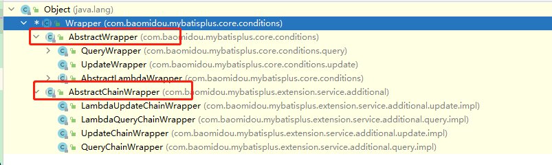

# 五、条件构造器

在MP中，Wrapper接口的实现类关系如下：





可以看到，AbstractWrapper和AbstractChainWrapper是重点实现，接下来我们重点学习AbstractWrapper以及其  
子类。


说明:


> QueryWrapper(LambdaQueryWrapper) 和 UpdateWrapper(LambdaUpdateWrapper) 的父类
>
>  
>
> 用于生成 sql的 where 条件, entity 属性也用于生成 sql 的 where 条件
>
>  
>
> 注意:
>
>  
>
>  
>

> entity 生成的 where 条件与 使用各个 api 生成的 where 条件没有任何关联行为
>


官网文档地址：[https://mybatis.plus/guide/wrapper.html](https://mybatis.plus/guide/wrapper.html)


## 5.1、allEq


说明


```java
allEq(Map<R, V> params)
allEq(Map<R, V> params, boolean null2IsNull)
allEq(boolean condition, Map<R, V> params, boolean null2IsNull)
```


+ 全部eq(或个别isNull)


个别参数说明:


> params : key为数据库字段名,value为字段值
>
>  
>
> null2IsNull : 为true则在map的value为null时调用 isNull 方法,为false时则忽略value为null的
>
>  
>
>  
>

> 例1: allEq({id: 1 ,name:"老王",age:null})	--->	id = 1 and name = '老王' and age is null
>
>  
>
> 例2: allEq({id: 1 ,name:"老王",age:null}, false)	--->	id = 1 and name = '老王'
>


```plain
allEq(BiPredicate<R, V> filter, Map<R, V> params)
allEq(BiPredicate<R, V> filter, Map<R, V> params, boolean null2IsNull)
allEq(boolean condition, BiPredicate<R, V> filter, Map<R, V> params, boolean null2IsNull)
```


个别参数说明:


> filter : 过滤函数,是否允许字段传入比对条件中 params 与null2IsNull : 同上
>
>  
>
>  
>

> 例1: allEq((k,v) - > k.indexOf("a") > 0 , {id: 1 ,name:"老王",age:null})	--->	name = '老王' and age is null  
例2: allEq((k,v) - > k.indexOf("a") > 0 , {id: 1 ,name:"老王",age:null}, false)	--->	name = '老王'
>


测试用例


```java
@RunWith(SpringRunner.class)
@SpringBootTest
public class TestUserMapper {

    @Autowired
    private UserMapper userMapper;

    @Test
    public void testAllEq() {

        QueryWrapper<User> wrapper = new QueryWrapper<>();

        //设置条件
        Map<String, Object> params = new HashMap<>();
        params.put("name", "曹操");
        params.put("age", "20");
        params.put("password", null);

        wrapper.allEq(params);//SELECT * FROM tb_user WHERE password IS NULL AND name = ?AND age = ?

        wrapper.allEq(params, false); //SELECT * FROM tb_user WHERE name = ? AND age = ?

        wrapper.allEq((k, v) -> (k.equals("name") || k.equals("age")), params);//SELECT * FROM tb_user WHERE name = ? AND age = ?
        List<User> users = this.userMapper.selectList(wrapper);
        for (User user : users) {
            System.out.println(user);
        }
    }

}
```


## 5.2、基本比较操作


+ eq	等于 =
+ ne   不等于 <>
+ gt    大于 >
+ ge   大于等于 >=
+ lt    小于 <
+ le   小于等于 <=
+ between  BETWEEN 值1 AND 值 2
+ notBetween  NOT BETWEEN 值1 AND 值 2
+ in  字段 IN (value.get(0), value.get(1), ...)


测试用例：


```java
@RunWith(SpringRunner.class)
@SpringBootTest
public class TestUserMapper {

    @Autowired
    private UserMapper userMapper;

    @Test
    public void testEq() {
        QueryWrapper<User> wrapper = new QueryWrapper<>();

        //SELECT id,user_name,password,name,age,email FROM tb_user WHERE password = ? AND age >= ?AND name IN( ?,?,?)
        wrapper.eq("password", "123456")
                .ge("age", 20)
                .in("name", "李四", "王五", "赵六");

        List<User> users = userMapper.selectList(wrapper);
        for (User user : users) {
            System.out.println(user);
        }

    }

}
```


## 5.3、模糊查询


+  like 
    - LIKE '%值%'
    - 例: like("name", "王")--->name like '%王%'
+  notLike 
    - NOT LIKE '%值%'
    - 例: notLike("name", "王")--->name not like '%王%'
+  likeLeft 
    - LIKE '%值'
    - 例: likeLeft("name", "王")--->name like '%王'
+  likeRight 
    - LIKE '值%'
    - 例: likeRight("name", "王")--->name like '王%'


测试用例：


```java
@RunWith(SpringRunner.class)
@SpringBootTest
public class TestUserMapper {

    @Autowired
    private UserMapper userMapper;

    @Test
    public void testLike(){

        QueryWrapper<User> wrapper = new QueryWrapper<>();

        wrapper.likeLeft("name","五");

        List<User> users = userMapper.selectList(wrapper);
        for (User user : users) {
            System.out.println(user);
        }
    }

}
```


## 5.4、排序


+ orderBy 
    - 排序：ORDER BY 字段, ...
    - 例: orderBy(true, true, "id", "name")--->order by id ASC,name ASC
+ orderByAsc 
    - 排序：ORDER BY 字段, ... ASC
    - 例: orderByAsc("id", "name")--->order by id ASC,name ASC
+ orderByDesc 
    - 排序：ORDER BY 字段, ... DESC
    - 例: orderByDesc("id", "name")--->order by id DESC,name DESC


测试用例：


```java
@RunWith(SpringRunner.class)
@SpringBootTest
public class TestUserMapper {

    @Autowired
    private UserMapper userMapper;

    @Test
    public void testOrderBy(){

        QueryWrapper<User> wrapper = new QueryWrapper<>();
        //按照年龄倒序排序
        wrapper.orderByDesc("age");//SELECT id,user_name,password,name,age,email FROM tb_user ORDER BY age DESC

        List<User> users = userMapper.selectList(wrapper);
        for (User user : users) {
            System.out.println(user);
        }

    }

}
```


## 5.5、逻辑查询


+  or 
    - 拼接 OR
    - 主动调用or表示紧接着下一个方法不是用and连接!(不调用or则默认为使用and连接)
+  and 
    - AND 嵌套
    - 例: and(i - > i.eq("name", "李白").ne("status", "活着"))--->and (name = '李白' and status <> '活着')


测试用例：


```java
@RunWith(SpringRunner.class)
@SpringBootTest
public class TestUserMapper {

    @Autowired
    private UserMapper userMapper;

    @Test
    public void testOr() {
        QueryWrapper<User> wrapper = new QueryWrapper<>();

        //SELECT id,user_name,password,name,age,email FROM tb_user WHERE name = ? OR age = ?
        wrapper.eq("name", "王五").or().eq("age", 21);

        List<User> users = userMapper.selectList(wrapper);
        for (User user : users) {
            System.out.println(user);
        }

    }

}
```


## 5.6、select


在MP查询中，默认查询所有的字段，如果有需要也可以通过select方法进行指定字段。


```java
@RunWith(SpringRunner.class)
@SpringBootTest
public class TestUserMapper {

    @Autowired
    private UserMapper userMapper;

    @Test
    public void testSelect(){
        QueryWrapper<User> wrapper = new QueryWrapper<>();

        //SELECT id,name,age FROM tb_user WHERE name = ? OR age = ?
        wrapper.eq("name","王五")
                .or()
                .eq("age",21)
                .select("id","name","age");//指定查询的字段

        List<User> users = userMapper.selectList(wrapper);
        for (User user : users) {
            System.out.println(user);
        }
    }

}
```


> 更新: 2022-08-19 09:01:21  
> 原文: <https://www.yuque.com/like321/he07pe/tvghla>