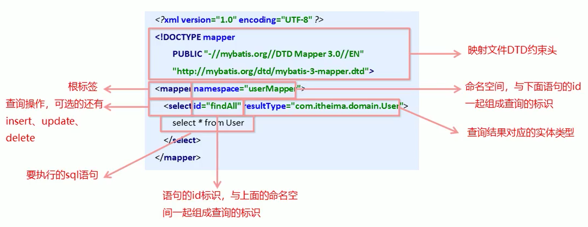
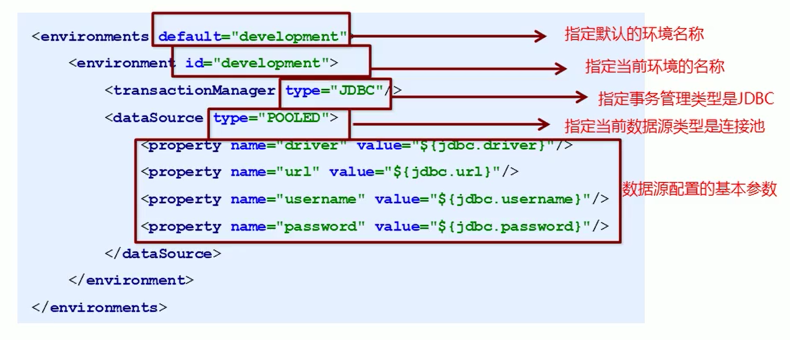
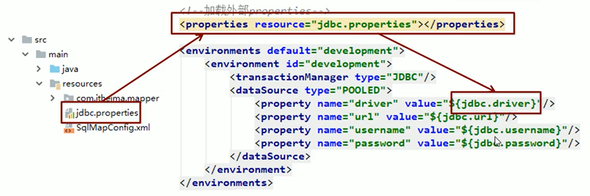
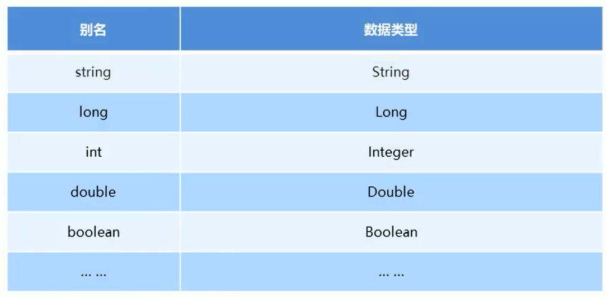
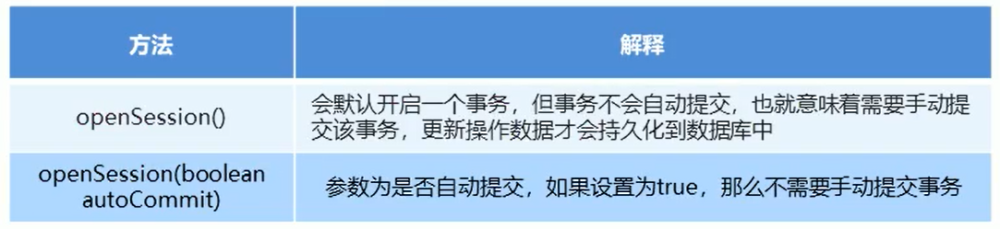

# 一、Mybatis快速入门

## 1.Mybatis简介


+  mybatis 是一个优秀的基于java的持久层框架，它内部封装了jdbc，使开发者只需要关注sql语句本身，而不需要花费精力去处理加载驱动、创建连接、创建statement等繁杂的过程。 
+  mybatis通过xml或注解的方式将要执行的各种 statement配置起来，并通过java对象和statement中sql的动态参数进行映射生成最终执行的sql语句。 
+  最后mybatis框架执行sql并将结果映射为java对象并返回。采用ORM思想解决了实体和数据库映射的问题，对jdbc 进行了封装，屏蔽了jdbc api 底层访问细节，使我们不用与jdbc api 打交道，就可以完成对数据库的持久化操作。 


## 2.Mybatis的快速入门


MyBatis官网地址：[https://mybatis.org/mybatis-3/zh/index.html](https://mybatis.org/mybatis-3/zh/index.html)


### 2.1 添加坐标


```xml
<dependency>
    <groupId>mysql</groupId>
    <artifactId>mysql-connector-java</artifactId>
    <version>5.1.32</version>
</dependency>
<dependency>
    <groupId>org.mybatis</groupId>
    <artifactId>mybatis</artifactId>
    <version>3.4.6</version>
</dependency>
<dependency>
    <groupId>junit</groupId>
    <artifactId>junit</artifactId>
    <version>4.12</version>
    <scope>test</scope>
</dependency>
<dependency>
    <groupId>log4j</groupId>
    <artifactId>log4j</artifactId>
    <version>1.2.17</version>
</dependency>
```


### 2.2 创建user数据表


### 2.3 编写User实体


```java
public class User {

    private int id;
    private String username;
    private String password;

    public int getId() {
        return id;
    }

    public void setId(int id) {
        this.id = id;
    }

    public String getUsername() {
        return username;
    }

    public void setUsername(String username) {
        this.username = username;
    }

    public String getPassword() {
        return password;
    }

    public void setPassword(String password) {
        this.password = password;
    }

    @Override
    public String toString() {
        return "User{" +
                "id=" + id +
                ", username='" + username + '\'' +
                ", password='" + password + '\'' +
                '}';
    }
}
```


### 2.4 编写映射文件UserMapper.xml


UserMapper.xml


```xml
<?xml version="1.0" encoding="UTF-8" ?>
<!DOCTYPE mapper PUBLIC "-//mybatis.org//DTD Mapper 3.0//EN" "http://mybatis.org/dtd/mybatis-3-mapper.dtd">

<mapper namespace="userMapper">
  
    <select id="findAll" resultType="com.itheima.domain.User">
        select * from user
    </select>
  
</mapper>
```


### 2.5 编写MyBatis核心文件


sqlMapConfig.xml


```xml
<?xml version="1.0" encoding="UTF-8" ?>
<!DOCTYPE configuration PUBLIC "-//mybatis.org//DTD Config 3.0//EN" "http://mybatis.org/dtd/mybatis-3-config.dtd">

<configuration>
    <!--    数据源环境-->
    <environments default="development">
        <environment id="development">
            <transactionManager type="JDBC"></transactionManager>
            <dataSource type="POOLED">
                <property name="driver" value="com.mysql.jdbc.Driver"/>
                <property name="url" value="jdbc:mysql://localhost:3306/test"/>
                <property name="username" value="root"/>
                <property name="password" value="root"/>
            </dataSource>
        </environment>
    </environments>


    <!--    加载映射文件-->
    <mappers>
        <mapper resource="com/itheima/mapper/UserMapper.xml"></mapper>
    </mappers>
</configuration>
```


### 2.6 测试


```java
@Test
public void test1() throws IOException {
    //加载核心配置文件
    InputStream resourceAsStream = Resources.getResourceAsStream("sqlMapConfig.xml");
    //获得session工厂对象
    SqlSessionFactory sqlSessionFactory = new SqlSessionFactoryBuilder().build(resourceAsStream);
    //获得sqlSession会话对象
    SqlSession sqlSession = sqlSessionFactory.openSession();
    //执行操作 参数：namespace+id
    List<User> userList = sqlSession.selectList("userMapper.findAll");
    System.out.println(userList);
    //释放资源
    sqlSession.close();
}
```


## 3. MyBatis的映射文件概述





## 4. MyBatis的增删改查操作


### 4.1 插入数据


**1)编写UserMapper映射文件**


```xml
<mapper namespace="userMapper">
  
  <insert id="save" parameterType="com.itheima.domain.User">
    insert into user values (#{id},#{username},#{password});
  </insert>
  
</mapper>
```


**2)测试**


```java
@Test
public void testInsert() throws IOException {

    //模拟user对象
    User user = new User();
    user.setUsername("Tom");
    user.setPassword("abc");

    //加载核心配置文件
    InputStream resourceAsStream = Resources.getResourceAsStream("sqlMapConfig.xml");
    //获得session工厂对象
    SqlSessionFactory sqlSessionFactory = new SqlSessionFactoryBuilder().build(resourceAsStream);
    //获得sqlSession会话对象
    SqlSession sqlSession = sqlSessionFactory.openSession();

    //执行操作
    sqlSession.insert("userMapper.save", user);

    //mybatis执行更新操作 提交事务
    sqlSession.commit();

    //释放资源
    sqlSession.close();
}
```


**3)插入操作注意问题**


+ 插入语句使用insert标签
+ 在映射文件中使用parameterType属性指定要插入的数据类型
+ Sql语句中使用#{实体属性名}方式引用实体中的属性值
+ 插入操作使用的API是sqlSession.insert(“命名空间.id”,实体对象);
+ <font style="color:#E8323C;">插入操作涉及数据库数据变化，所以要使用sqlSession对象显示的提交事务，即sqlSession.commit()</font>


### 4.2修改数据


**1)编写UserMapper映射文件**


```xml
<mapper namespace="userMapper">
  
    <update id="update" parameterType="com.itheima.domain.User">
        update user set username=#{username},password=#{password} where id = #{id}
    </update>
  
</mapper>
```


**2)测试**


```java
@Test
public void testUpdate() throws IOException {

    //模拟user对象
    User user = new User();
    user.setId(3);
    user.setUsername("Lucy");
    user.setPassword("asdf");


    //加载核心配置文件
    InputStream resourceAsStream = Resources.getResourceAsStream("sqlMapConfig.xml");
    //获得session工厂对象
    SqlSessionFactory sqlSessionFactory = new SqlSessionFactoryBuilder().build(resourceAsStream);
    //获得sqlSession会话对象
    SqlSession sqlSession = sqlSessionFactory.openSession();

    //执行操作
    sqlSession.update("userMapper.update", user);

    //mybatis执行更新操作 提交事务
    sqlSession.commit();

    //释放资源
    sqlSession.close();
}
```


**3)修改操作注意问题**


+  修改语句使用update标签 
+  修改操作使用的API是sqlSession.update(“命名空间.id”,实体对象); 


### 4.3 删除数据


**1)编写UserMapper映射文件**


```xml
<mapper namespace="userMapper">
  
    <delete id="delete" parameterType="java.lang.Integer">
        delete from user where id = #{id}
    </delete>
  
</mapper>
```


**2)测试**


```java
@Test
public void testDelete() throws IOException {

    //加载核心配置文件
    InputStream resourceAsStream = Resources.getResourceAsStream("sqlMapConfig.xml");
    //获得session工厂对象
    SqlSessionFactory sqlSessionFactory = new SqlSessionFactoryBuilder().build(resourceAsStream);
    //获得sqlSession会话对象
    SqlSession sqlSession = sqlSessionFactory.openSession();

    //执行操作
    sqlSession.delete("userMapper.delete", 1);

    //mybatis执行更新操作 提交事务
    sqlSession.commit();

    //释放资源
    sqlSession.close();

}
```


**3)删除操作注意问题**


+  删除语句使用delete标签 
+  Sql语句中使用#{任意字符串}方式引用传递的单个参数 
+  删除操作使用的API是sqlSession.delete(“命名空间.id”,Object); 


## 5. MyBatis核心配置文件概述


### 5.1 MyBatis核心配置文件层级关系


+ configuration配置 
    - properties属性
    - settings设置
    - typeAliases类型别名
    - typeHandlers类型处理器
    - objectFactory对象工厂
    - plugins插件
    - environments环境 
        * environment环境变量 
            + transactionManager 事务管理器
            + dataSource 数据源
    - databaseIdProvider 数据库厂商标识
    - mappers 映射器


### 5.2 MyBatis常用配置解析


#### environments标签


数据库环境的配置，支持多环境配置





environments标签：数据源环境配置标签


```xml
<!--    数据源环境-->
<environments default="development">
    <environment id="development">
        <transactionManager type="JDBC"></transactionManager>
        <dataSource type="POOLED">
            <property name="driver" value="${jdbc.driver}"/>
            <property name="url" value="${jdbc.url}"/>
            <property name="username" value="${jdbc.username}"/>
            <property name="password" value="${jdbc.password}"/>
        </dataSource>
    </environment>
</environments>
```


+  事务管理器（transactionManager）类型有两种： 
    -  JDBC：这个配置就是直接使用了JDBC 的提交和回滚设置，它依赖于从数据源得到的连接来管理事务作用域。 
    -  MANAGED：这个配置几乎没做什么。  
它从来不提交或回滚一个连接，而是让容器来管理事务的整个生命周期（比如 JEE 应用服务器的上下文）。  
默认情况下它会关闭连接，然而一些容器并不希望这样，因此需要将 closeConnection 属性设置为 false 来阻止它默认的关闭行为。 
+  数据源（dataSource）类型有三种： 
    - UNPOOLED：这个数据源的实现只是每次被请求时打开和关闭连接。
    - POOLED：这种数据源的实现利用“池”的概念将 JDBC 连接对象组织起来。
    - JNDI：这个数据源的实现是为了能在如 EJB 或应用服务器这类容器中使用，容器可以集中或在外部配置数据源，然后放置一个 JNDI 上下文的引用。


#### mapper标签


该标签的作用是加载映射的，加载方式有如下几种：


+ 使用相对于类路径的资源引用：


```xml
<mappers>
    <mapper resource="com/itheima/mapper/UserMapping.xml"/>
</mappers>
```


+ 使用完全限定资源定位符（URL）：


```xml
<mappers>
    <mapper url="file:///var/mappers/AuthorMapper.xml"/>
</mappers>
```


+ 使用映射器接口实现类的完全限定类名：


```xml
<mappers>
    <!--扫描使用注解的类-->
    <mapper class="com.itheima.mapper.UserMapper"></mapper>
</mappers>
```


+ 将包内的映射器接口实现全部注册为映射器：


```xml
<mappers>
    <!--扫描使用注解的类所在的包-->
    <package name="com.itheima.mapper"></package>
</mappers>
```


#### Properties标签


实际开发中，习惯将数据源的配置信息单独抽取成一个properties文件，该标签可以加载额外配置的properties文件





properties标签：该标签可以加载外部的properties文件


```xml
<properties resource="jdbc.properties"></properties>
```


#### typeAliases标签


类型别名是为Java 类型设置一个短的名字。


原来的类型名称配置如下：


```xml
<select id="findAll" resultType="com.itheima.domain.User">
    select * from user
</select>
```


配置typeAliases，为com.itheima.domain.User定义别名为user


```xml
<!--    自定义别名-->
<typeAliases>
    <typeAlias type="com.itheima.domain.User" alias="user"></typeAlias>
</typeAliases>
```


```xml
<select id="findAll" resultType="user">
    select * from user
</select>
```


mybatis框架已经为我们设置好的一些常用的类型的别名





## 6. MyBatis相应API


### 6.1 SqlSession工厂构建器SqlSessionFactoryBuilder


SqlSessionFactory  build(InputStream inputStream)


通过加载mybatis的核心文件的输入流的形式构建一个SqlSessionFactory对象


```java
String resource = "org/mybatis/builder/mybatis-config.xml"; 

InputStream inputStream = Resources.getResourceAsStream(resource); 

SqlSessionFactoryBuilder builder = new SqlSessionFactoryBuilder(); 

SqlSessionFactory factory = builder.build(inputStream);
```


其中， Resources 工具类，这个类在 org.apache.ibatis.io 包中。Resources 类帮助你从类路径下、文件系统或一个 web URL 中加载资源文件。


### 6.2 SqlSession工厂对象SqlSessionFactory


SqlSessionFactory 有多个方法创建SqlSession 实例。


常用的有如下两个：





### 6.3 SqlSession会话对象


SqlSession 实例在 MyBatis 中是非常强大的一个类。


在这里你会看到所有执行语句、提交或回滚事务和获取映射器实例的方法。


#### 执行语句的方法主要有：


```java
<T> T selectOne(String statement, Object parameter) 
    
<E> List<E> selectList(String statement, Object parameter) 
    
int insert(String statement, Object parameter) 
    
int update(String statement, Object parameter) 
    
int delete(String statement, Object parameter)
```


#### 操作事务的方法主要有：


```java
void commit()  
    
void rollback()
```


> 更新: 2022-08-19 08:00:20  
> 原文: <https://www.yuque.com/like321/tziuog/kgmaeh>