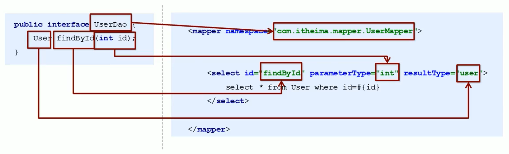

# 二、Mybatis的Dao层实现

MyBatis的Dao层实现的两种方式：


+  手动对Dao进行实现：传统开发方式 
+  代理方式对Dao进行实现 


## 1. 传统开发方式


### 1.1编写UserDao接口


```java
public interface UserDao {
    List<User> findAll() throws IOException;
}
```


### 1.2.编写UserDaoImpl实现


```java
public class UserDaoImpl implements UserDao {

    public List<User> findAll() throws IOException {

        //加载核心配置文件
        InputStream resourceAsStream = Resources.getResourceAsStream("sqlMapConfig.xml");
        //获得session工厂对象
        SqlSessionFactory sqlSessionFactory = new SqlSessionFactoryBuilder().build(resourceAsStream);
        //获得sqlSession会话对象
        SqlSession sqlSession = sqlSessionFactory.openSession();

        List<User> userList = sqlSession.selectList("userMapper.findAll");

        //释放资源
        sqlSession.close();

        return userList;
    }

}
```


### 1.3 测试传统方式


```java
@Test
public void testTraditionDao() throws IOException {
    
    UserDao userDao = new UserDaoImpl();
    List<User> all = userDao.findAll();
    
    System.out.println(all);
    
}
```


## 2、代理开发方式


采用 Mybatis 的代理开发方式实现 DAO 层的开发，这种方式是我们后面进入企业的主流。


Mapper 接口开发方法只需要程序员编写Mapper 接口（相当于Dao 接口），<font style="color:#E8323C;">由Mybatis 框架根据接口定义创建接口的动态代理对象，</font>代理对象的方法体同上边Dao接口实现类方法。


### 2.1 Mapper 接口开发需要遵循以下规范


**1) Mapper.xml文件中的namespace与Mapper接口的全限定名相同**


**2) Mapper接口方法名和Mapper.xml中定义的每个statement的id相同**


**3) Mapper接口方法的输入参数类型和Mapper.xml中定义的每个sql的parameterType的类型相同**


**4) Mapper接口方法的输出参数类型和Mapper.xml中定义的每个sql的resultType的类型相同**





### 2.2 编写UserMapper接口


```java
public interface UserMapper {

    public List<User> findAll();

    public User findById(int id);

}
```


编写UserMapper映射文件


```xml
<mapper namespace="com.itheima.dao.UserMapper">
  
    <select id="findAll" resultType="user">
        select * from user
    </select>
  
    <select id="findById" resultType="user" parameterType="int">
            select * from user where id = #{id}
    </select>
  
</mapper>
```


### 2.3测试代理方式


```java
@Test
public void testProxyDao() throws IOException {
    
    //加载核心配置文件
    InputStream resourceAsStream = Resources.getResourceAsStream("sqlMapConfig.xml");
    //获得session工厂对象
    SqlSessionFactory sqlSessionFactory = new SqlSessionFactoryBuilder().build(resourceAsStream);
    //获得sqlSession会话对象
    SqlSession sqlSession = sqlSessionFactory.openSession();

    //获得MyBatis框架生成的UserMapper接口的实现类
    UserMapper userMapper = sqlSession.getMapper(UserMapper.class);

    List<User> all = userMapper.findAll();
    System.out.println(all);

    User user = userMapper.findById(2);
    System.out.println(user);
    
    //释放资源
    sqlSession.close();
}
```


> 更新: 2022-08-19 08:04:33  
> 原文: <https://www.yuque.com/like321/tziuog/omav3s>