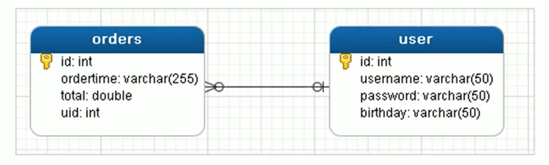
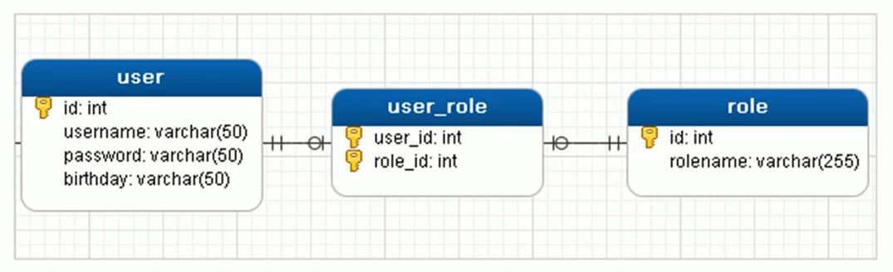

# 五、Mybatis多表查询

## 1. 一对一查询


### 1.1 一对一查询的模型MapperScannerConfigurer


用户表和订单表的关系为，一个用户有多个订单，一个订单只从属于一个用户


一对一查询的需求：查询一个订单，与此同时查询出该订单所属的用户





### 1.2一对一查询的语句


对应的sql语句：select *  from orders o,user u where o.uid=u.id;


### 1.3 创建Order和User实体


```java
public class Order {

    private int id;
    private Date ordertime;
    private double total;

    //代表当前订单从属于哪一个客户
    private User user;
}
```


```java
public class User {
    
    private int id;
    private String username;
    private String password;
    private Date birthday;

}
```


### 1.4 创建OrderMapper接口


```java
public interface OrderMapper {

    public List<Order> findAll();

}
```


### 1.5 配置sqlMapConfig.xml


```xml
<!--    自定义别名-->
<typeAliases>
    <typeAlias type="com.itheima.domain.User" alias="user"></typeAlias>
    <typeAlias type="com.itheima.domain.Order" alias="order"></typeAlias>
</typeAliases>

<!--    加载映射文件-->
<mappers>
    <mapper resource="com/itheima/mapper/UserMapper.xml"></mapper>
    <mapper resource="com/itheima/mapper/OrderMapper.xml"></mapper>
</mappers>
```


### 1.6  配置OrderMapper.xml


**使用做配置**


+ 第一种


```xml
<mapper namespace="com.itheima.mapper.OrderMapper">
    <resultMap id="orderMap" type="order">
        <!--
         手动指定字段与实体属性的映射关系
            column：数据表的字段名称
            property：实体的属性名称
        -->
        <id column="id" property="id"></id>
        <result column="ordertime" property="ordertime"></result>
        <result column="total" property="total"></result>
        
        <result column="uid" property="user.id"></result>
        <result column="username" property="user.username"></result>
        <result column="password" property="user.password"></result>
        <result column="birthday" property="user.birthday"></result>
    </resultMap>
    <select id="findAll" resultMap="orderMap">
        select * from orders o,user u where o.uid = u.id
    </select>
</mapper>
```


+ 第二种：


```xml
<mapper namespace="com.itheima.mapper.OrderMapper">

    <resultMap id="orderMap" type="order">
        <!--
         手动指定字段与实体属性的映射关系
            column：数据表的字段名称
            property：实体的属性名称
        -->
        <id column="id" property="id"></id>
        <result column="ordertime" property="ordertime"></result>
        <result column="total" property="total"></result>
 
        <!--
           property：当前实体（order）中的属性名称（private User user）
           javaType：当前实体（order）中的属性的类型（User）
        -->
        <association property="user" javaType="user">
            <result column="uid" property="id"></result>
            <result column="username" property="username"></result>
            <result column="password" property="password"></result>
            <result column="birthday" property="birthday"></result>
        </association>
    </resultMap>

    <select id="findAll" resultMap="orderMap">
        select * from orders o,user u where o.uid = u.id
    </select>
</mapper>
```


### 1.7 测试结果


```java
@Test
public void test2() throws IOException {
    //加载核心配置文件
    InputStream resourceAsStream = Resources.getResourceAsStream("sqlMapConfig.xml");
    //获得session工厂对象
    SqlSessionFactory sqlSessionFactory = new SqlSessionFactoryBuilder().build(resourceAsStream);
    //获得sqlSession会话对象
    SqlSession sqlSession = sqlSessionFactory.openSession();

    OrderMapper mapper = sqlSession.getMapper(OrderMapper.class);

    List<Order> orderList = mapper.findAll();
    for (Order order : orderList) {
        System.out.println(order);
    }

    sqlSession.close();

}
```


## 2 一对多查询


### 2.1 一对多查询的模型


用户表和订单表的关系为，一个用户有多个订单，一个订单只从属于一个用户


一对多查询的需求：查询一个用户，与此同时查询出该用户具有的订单


### 2.2 一对多查询的语句


对应的sql语句：select *,o.id oid from user u left join orders o on u.id=o.uid;


### 2.3 修改User实体


```java
public class User {
    
    private int id;
    private String username;
    private String password;
    private Date birthday;
    
    //代表当前用户具备哪些订单
    private List<Order> orderList;
}
```


### 2.4 创建UserMapper接口


```java
public interface UserMapper {

    public List<User> findAll();
}
```


### 2.5 配置UserMapper.xml


**使用+做配置**


```xml
<mapper namespace="com.itheima.mapper.UserMapper">

    <resultMap id="userMap" type="user">
        <id column="uid" property="id"></id>
        <result column="username" property="username"></result>
        <result column="password" property="password"></result>
        <result column="birthday" property="birthday"></result>
        <!--
                配置集合信息
                property：集合名称
                ofType：当前集合中的数据类型
        -->
        <collection property="orderList" ofType="order">
            <!--            封装order的数据-->
            <id column="oid" property="id"></id>
            <result column="ordertime" property="ordertime"></result>
            <result column="total" property="total"></result>
        </collection>
    </resultMap>

    <select id="findAll" resultMap="userMap">
        select *,o.id oid from user u left join orders o on u.id=o.uid;
    </select>
</mapper>
```


### 2.6 测试结果


```java
@Test
public void test2() throws IOException {
    //加载核心配置文件
    InputStream resourceAsStream = Resources.getResourceAsStream("sqlMapConfig.xml");
    //获得session工厂对象
    SqlSessionFactory sqlSessionFactory = new SqlSessionFactoryBuilder().build(resourceAsStream);
    //获得sqlSession会话对象
    SqlSession sqlSession = sqlSessionFactory.openSession();

    UserMapper mapper = sqlSession.getMapper(UserMapper.class);

    List<User> userList = mapper.findAll();
    for (User user : userList) {
        System.out.println(user.getUsername());
        List<Order> orderList = user.getOrderList();
        System.out.println(orderList);
    }

    sqlSession.close();

}
```


## 3 多对多查询


### 3.1 多对多查询的模型


用户表和角色表的关系为，一个用户有多个角色，一个角色被多个用户使用


多对多查询的需求：查询用户同时查询出该用户的所有角色





### 3.2 多对多查询的语句


对应的sql语句：select * from user u left join user_role ur on u.id = ur.userid inner join role r on ur.roleid = r.id


### 3.3 创建Role实体，修改User实体


```java
public class Role {
    private int id;
    private String roleName;
    private String roleDesc;
}
```


```java
public class User {
    private int id;
    private String username;
    private String password;
    private Date birthday;
    
    //代表当前用户具备哪些订单
    private List<Order> orderList;
    
    //代表当前用户具备哪些角色
    private List<Role> roleList;
}
```


### 3.4  添加UserMapper接口方法


```java
public interface UserMapper {

    public List<User> findAll();

    public List<User> findUserAndRoleAll();

}
```


### 3.5 配置SqlMapConfig.xml


```xml
<!--    自定义别名-->
<typeAliases>
    <typeAlias type="com.itheima.domain.User" alias="user"></typeAlias>
    <typeAlias type="com.itheima.domain.Order" alias="order"></typeAlias>
    <typeAlias type="com.itheima.domain.Role" alias="role"></typeAlias>
</typeAliases>
```


### 3.6 配置UserMapper.xml


**使用+做配置**


```xml
<resultMap id="userRoleMap" type="user">
    <!--        user的信息-->
    <id column="userid" property="id"></id>
    <result column="username" property="username"></result>
    <result column="password" property="password"></result>
    <result column="birthday" property="birthday"></result>
    <!--        user内部的roleList信息-->
    <collection property="roleList" ofType="role">
        <id column="roleid" property="id"></id>
        <result column="roleName" property="roleName"></result>
        <result column="roleDesc" property="roleDesc"></result>
    </collection>
</resultMap>

<select id="findUserAndRoleAll" resultMap="userRoleMap">
    select * from user u left join user_role ur on u.id = ur.userid inner join role r on ur.roleid = r.id
</select>
```


### 3.7 测试结果


```java
@Test
public void test3() throws IOException {
    //加载核心配置文件
    InputStream resourceAsStream = Resources.getResourceAsStream("sqlMapConfig.xml");
    //获得session工厂对象
    SqlSessionFactory sqlSessionFactory = new SqlSessionFactoryBuilder().build(resourceAsStream);
    //获得sqlSession会话对象
    SqlSession sqlSession = sqlSessionFactory.openSession();

    UserMapper mapper = sqlSession.getMapper(UserMapper.class);

    List<User> userList = mapper.findUserAndRoleAll();
    for (User user : userList) {
        System.out.println(user.getUsername());
        List<Role> roleList = user.getRoleList();
        System.out.println(roleList);
    }

    sqlSession.close();

}
```


> 更新: 2022-08-19 08:14:37  
> 原文: <https://www.yuque.com/like321/tziuog/bipikg>