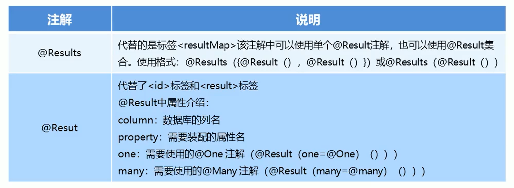
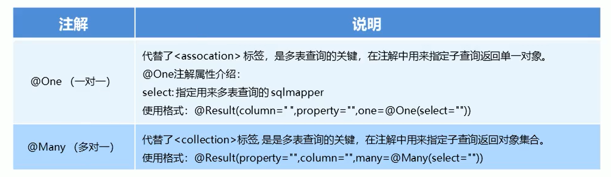
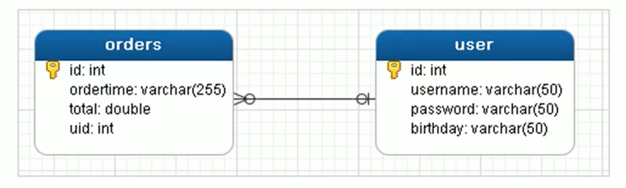
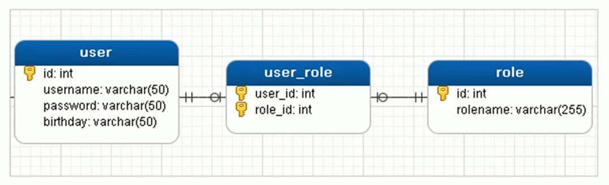

# 六、Mybatis的注解开发

## 1 MyBatis的常用注解


这几年来注解开发越来越流行，Mybatis也可以使用注解开发方式，这样我们就可以减少编写Mapper映射文件了。


@Insert：实现新增


@Update：实现更新


@Delete：实现删除


@Select：实现查询


@Result：实现结果集封装


@Results：可以与@Result  一起使用，封装多个结果集 


@One：实现一对一结果集封装


@Many：实现一对多结果集封装


## 2 MyBatis的增删改查


### 修改MyBatis的核心配置文件


我们使用了注解替代的映射文件，所以我们只需要加载使用了注解的Mapper接口即可


```xml
<mappers>
    <!--扫描使用注解的类-->
    <mapper class="com.itheima.mapper.UserMapper"></mapper>
</mappers>
```


或者指定扫描包含映射关系的接口所在的包也可以


```xml
<mappers>
    <!--扫描使用注解的类所在的包-->
    <package name="com.itheima.mapper"></package>
</mappers>
```


### 编写mapper接口


```java
public interface UserMapper {

    @Insert("insert into user values(#{id},#{username},#{password},#{birthday})")
    public void save(User user);

    @Update("update user set username = #{username},password = #{password} where id = #{id}")
    public void update(User user);

    @Delete("delete from user where id = #{id}")
    public void delete(int id);

    @Select("select * from user where id = #{id}")
    public User findById(int id);

    @Select("select * from user")
    public List<User> findAll();

}
```


### 测试增删改查


```java
public class MybatisTest {

    private UserMapper userMapper;

    @BeforeEach
    public void before() throws IOException {
        InputStream resourceAsStream = Resources.getResourceAsStream("sqlMapConfig.xml");
        SqlSessionFactory sqlSessionFactory = new SqlSessionFactoryBuilder().build(resourceAsStream);
        SqlSession sqlSession = sqlSessionFactory.openSession(true);

        userMapper = sqlSession.getMapper(UserMapper.class);
    }

    @Test
    public void testSave() {

        User user = new User();
        user.setUsername("zhagnsan");
        user.setPassword("abc");

        userMapper.save(user);
    }

    @Test
    public void testUpdate() {

        User user = new User();
        user.setId(2);
        user.setUsername("111");
        user.setPassword("111");

        userMapper.update(user);
    }

    @Test
    public void testDelete() {
        userMapper.delete(4);
    }

    @Test
    public void testFindById() {
        User user = userMapper.findById(2);
        System.out.println(user);
    }

    @Test
    public void testFindAll() {
        List<User> userList = userMapper.findAll();
        for (User user : userList) {
            System.out.println(user);
        }
    }

}
```


## 3 MyBatis的注解实现复杂映射开发


使用注解开发后，我们可以使用@Results注解，@Result注解，@One注解，@Many注解组合完成复杂关系的配置








## 4 一对一查询


### 4.1 一对一查询的模型


用户表和订单表的关系为，一个用户有多个订单，一个订单只从属于一个用户


一对一查询的需求：查询一个订单，与此同时查询出该订单所属的用户


### 4.2 一对一查询的语句


对应的sql语句：


```plain
select * from orders;

select * from user where id=查询出订单的uid;
```


### 4.3 创建Order和User实体


```java
public class Order {

    private int id;
    private Date ordertime;
    private double total;

    //代表当前订单从属于哪一个客户
    private User user;
}
```


```java
public class User {
    
    private int id;
    private String username;
    private String password;
    private Date birthday;

}
```


### 4.4 创建OrderMapper接口


```java
public interface OrderMapper {
    
    List<Order> findAll();
    
}
```


### 4.5 使用注解配置Mapper


+ 第一种：


```java
public interface OrderMapper {

    @Select("select *,o.id oid from orders o,user u where o.uid=u.id")
    @Results({
            @Result(column = "oid",property = "id"),
            @Result(column = "ordertime",property = "ordertime"),
            @Result(column = "total",property = "total"),
            @Result(column = "uid",property = "user.id"),
            @Result(column = "username",property = "user.username"),
            @Result(column = "password",property = "user.password")
    })
    public List<Order> findAll();

}
```


+ 第二种


```java
public interface OrderMapper {

    @Select("select * from orders")
    @Results({
            @Result(column = "id", property = "id"),
            @Result(column = "ordertime", property = "ordertime"),
            @Result(column = "total", property = "total"),
            @Result(
                    property = "user", //要封装的属性名称
                    column = "uid", //根据哪个字段去查询user表的数据
                    javaType = User.class, //要封装的实体类型
                    //select属性 代表查询哪个接口的方法获得数据
                    one = @One(select = "com.itheima.mapper.UserMapper.findById")
            )
    })
    public List<Order> findAll();

}
```


```java
public interface UserMapper {

    @Select("select * from user where id=#{id}")
    User findById(int id);
    
}
```


### 4.6 测试结果


```java
@Test
public void testSelectOrderAndUser() {

    List<Order> orderList = orderMapper.findAll();
    
    for (Order order : orderList) {
        System.out.println(order);
    }
    
}
```


## 5 一对多查询


### 5.1 一对多查询的模型


用户表和订单表的关系为，一个用户有多个订单，一个订单只从属于一个用户


一对多查询的需求：查询一个用户，与此同时查询出该用户具有的订单





### 5.2 一对多查询的语句


对应的sql语句：


```plain
select * from user;

select * from orders where uid=查询出用户的id;
```


### 5.3 修改User实体


```java
public class Order {

    private int id;
    private Date ordertime;
    private double total;

    //代表当前订单从属于哪一个客户
    private User user;
}
```


```java
public class User {
    
    private int id;
    private String username;
    private String password;
    private Date birthday;
    
    //代表当前用户具备哪些订单
    private List<Order> orderList;
}
```


### 5.4 创建UserMapper接口


```java
public interface UserMapper {
    
    public List<User> findUserAndOrderAll();
    
}
```


### 5.5 使用注解配置Mapper


```java
public interface UserMapper {

    @Select("select * from user")
    @Results({
            @Result(id = true, column = "id", property = "id"),
            @Result(column = "username", property = "username"),
            @Result(column = "password", property = "password"),
            @Result(
                    column = "id",
                    property = "orderList",
                    javaType = List.class,
                    many = @Many(select = "com.itheima.mapper.OrderMapper.findByUid")
            )
    })
    public List<User> findUserAndOrderAll();
}
```


```java
public interface OrderMapper {

    @Select("select * from orders where uid = #{uid}")
    public List<Order> findByUid(int uid);

}
```


### 5.6 测试结果


```java
List<User> userAndOrderAll = userMapper.findUserAndOrderAll();

for(User user : userAndOrderAll){

    System.out.println(user.getUsername());

    List<Order> orderList = user.getOrderList();
    for(Order order : orderList){
        System.out.println(order);
    }

    System.out.println("-----------------------------");
}
```


## 6 多对多查询


### 6.1 多对多查询的模型


用户表和角色表的关系为，一个用户有多个角色，一个角色被多个用户使用


多对多查询的需求：查询用户同时查询出该用户的所有角色





### 6.2 多对多查询的语句


对应的sql语句：


```plain
select * from user;

select * from role r,user_role ur where r.id=ur.roleid and ur.userid=用户的id
```


### 6.3 创建Role实体，修改User实体


```java
public class Role {
    
    private int id;
    private String roleName;
    private String roleDesc;

}
```


```java
public class User {

    private int id;
    private String username;
    private String password;
    private Date birthday;

    //当前用户存在哪些订单
    private List<Order> orderList;

    //当前用户具备哪些角色
    private List<Role> roleList;
}
```


### 6.4 添加UserMapper接口方法


```java
public interface UserMapper {
    public List<User> findUserAndRoleAll();
}
```


### 6.5 使用注解配置Mapper


```java
public interface UserMapper {

    @Select("select * from user")
    @Results({
            @Result(id = true, column = "id", property = "id"),
            @Result(column = "username", property = "username"),
            @Result(column = "password", property = "password"),
            @Result(
                    column = "id",
                    property = "roleList",
                    javaType = List.class,
                    many = @Many(select = "com.itheima.mapper.RoleMapper.findByUid")
            )
    })
    public List<User> findUserAndRoleAll();
}
```


```java
public interface RoleMapper {

    @Select("select * from user_role ur,role r where ur.roleid = r.id and ur.userid = #{uid}")
    public List<Role> findByUid(int uid);

}
```


### 6.6 测试结果


```java
List<User> userAndOrderAll = userMapper.findUserAndRoleAll();

for(User user : userAndOrderAll){

    System.out.println(user.getUsername());

    List<Role> roleList = user.getRoleList();
    for(Role role : roleList){
        System.out.println(role);
    }

    System.out.println("-----------------------------");
}
```


> 更新: 2022-08-19 08:16:26  
> 原文: <https://www.yuque.com/like321/tziuog/dvqxki>