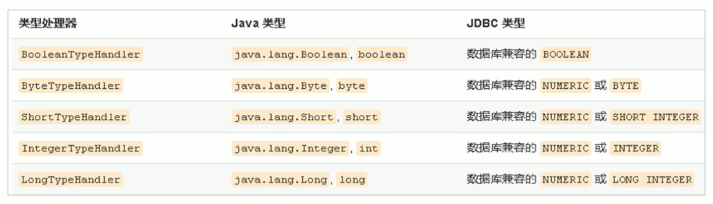

# 四、MyBatis核心配置文件深入

## 1. typeHandlers标签


无论是 MyBatis 在预处理语句（PreparedStatement）中设置一个参数时，还是从结果集中取出一个值时， 都会用类型处理器将获取的值以合适的方式转换成 Java 类型。


下表描述了一些默认的类型处理器（截取部分）。





你可以重写类型处理器或创建你自己的类型处理器来处理不支持的或非标准的类型。


具体做法为：

+  实现 org.apache.ibatis.type.TypeHandler 接口， 或继承一个很便利的类 org.apache.ibatis.type.BaseTypeHandler， 
+  然后可以选择性地将它映射到一个JDBC类型。 


例如需求：


一个Java中的Date数据类型，我想将之存到数据库的时候存成一个1970年至今的毫秒数，取出来时转换成java的Date，


即java的Date与数据库的bigint毫秒值之间转换。


### 1. 定义转换类继承类BaseTypeHandler


### 2. 覆盖4个未实现的方法


其中setNonNullParameter为java程序设置数据到数据库的回调方法，getNullableResult为查询时 mysql的字符串类型转换成 java的Type类型的方法


```java
public class DateTypeHandler extends BaseTypeHandler<Date> {

    //将java类型 转换成 数据库需要的类型
    @Override
    public void setNonNullParameter(PreparedStatement preparedStatement, int i, Date date, JdbcType jdbcType) throws SQLException {
        long time = date.getTime();
        preparedStatement.setLong(i, time);
    }

    //将数据库中类型 转换成 java类型
    //String参数 要转换的字段名称
    //ResultSet 查询出的结果集
    @Override
    public Date getNullableResult(ResultSet resultSet, String s) throws SQLException {
        //获得结果集中需要的数据(long)转换成Date类型 返回
        long resultSetLong = resultSet.getLong(s);
        Date date = new Date(resultSetLong);
        return date;
    }

    //将数据库中类型 转换成 java类型
    @Override
    public Date getNullableResult(ResultSet resultSet, int i) throws SQLException {
        //获得结果集中需要的数据(long)转换成Date类型 返回
        long resultSetLong = resultSet.getLong(i);
        Date date = new Date(resultSetLong);
        return date;
    }

    //将数据库中类型 转换成 java类型
    @Override
    public Date getNullableResult(CallableStatement callableStatement, int i) throws SQLException {
        //获得结果集中需要的数据(long)转换成Date类型 返回
        long resultSetLong = callableStatement.getLong(i);
        Date date = new Date(resultSetLong);
        return date;
    }
}
```


### 3. 在MyBatis核心配置文件中进行注册


```xml
<!--注册类型自定义转换器-->
<typeHandlers>
    <typeHandler handler="com.itheima.handler.DateTypeHandler"></typeHandler>
</typeHandlers>
```


### 4. 测试转换是否正确


```java
public interface UserMapper {

    public void save(User user);

    public User findById(int id);
}
```


```xml
<mapper namespace="com.itheima.mapper.UserMapper">
    <insert id="save" parameterType="user">
        insert into user values (#{id},#{username},#{password},#{birthday})
    </insert>
    <select id="findById" parameterType="int" resultType="user">
        select * from USER  where id = #{id}
    </select>
</mapper>
```


测试添加操作：


```java
@Test
public void test1() throws IOException {
    InputStream resourceAsStream = Resources.getResourceAsStream("sqlMapConfig.xml");
    SqlSessionFactory sqlSessionFactory = new SqlSessionFactoryBuilder().build(resourceAsStream);
    SqlSession sqlSession = sqlSessionFactory.openSession();

    UserMapper mapper = sqlSession.getMapper(UserMapper.class);

    //模拟条件user
    User user = new User();
    user.setUsername("zhangsan");
    user.setPassword("123");
    user.setBirthday(new Date());
    
    mapper.save(user);

    sqlSession.commit();
    sqlSession.close();

}
```


测试查询操作：


```java
@Test
public void test2() throws IOException {
    InputStream resourceAsStream = Resources.getResourceAsStream("sqlMapConfig.xml");
    SqlSessionFactory sqlSessionFactory = new SqlSessionFactoryBuilder().build(resourceAsStream);
    SqlSession sqlSession = sqlSessionFactory.openSession();

    UserMapper mapper = sqlSession.getMapper(UserMapper.class);

    User user = mapper.findById(4);
    System.out.println(user.getBirthday());
    
    sqlSession.close();

}
```


## 2 plugins标签


MyBatis可以使用第三方的插件来对功能进行扩展，


分页助手PageHelper是将分页的复杂操作进行封装，使用简单的方式即可获得分页的相关数据


### 1. 导入通用PageHelper坐标


```xml
<!-- 分页助手 -->
<dependency>
    <groupId>com.github.pagehelper</groupId>
    <artifactId>pagehelper</artifactId>
    <version>3.7.5</version>
</dependency>
<dependency>
    <groupId>com.github.jsqlparser</groupId>
    <artifactId>jsqlparser</artifactId>
    <version>0.9.1</version>
</dependency>
```


### 2. 在mybatis核心配置文件中配置PageHelper插件


```xml
<!-- 注意：分页助手的插件  配置在通用mapper之前 -->
<plugins>
    <plugin interceptor="com.github.pagehelper.PageHelper">
        <!-- 指定方言 -->
        <property name="dialect" value="mysql"/>
    </plugin>
</plugins>
```


### 3. 测试分页代码实现


```java
@Test
public void test3() throws IOException {
    //加载核心配置文件
    InputStream resourceAsStream = Resources.getResourceAsStream("sqlMapConfig.xml");
    //获得session工厂对象
    SqlSessionFactory sqlSessionFactory = new SqlSessionFactoryBuilder().build(resourceAsStream);
    //获得sqlSession会话对象
    SqlSession sqlSession = sqlSessionFactory.openSession();

    UserMapper mapper = sqlSession.getMapper(UserMapper.class);

    //设置分页相关参数 当前页 ， 每页显示的条数
    PageHelper.startPage(1,2);

    List<User> userList = mapper.findAll();
    System.out.println(userList);

    //释放资源
    sqlSession.close();

}
```


### 4. 获得分页相关的其他参数


```java
//其他分页的数据
PageInfo<User> userPageInfo = new PageInfo<>(userList);

System.out.println("当前页：" + userPageInfo.getPageNum());
System.out.println("每页显示条数：" + userPageInfo.getPageSize());
System.out.println("总条数：" + userPageInfo.getTotal());
System.out.println("总页数：" + userPageInfo.getPages());
System.out.println("上一页：" + userPageInfo.getPrePage());
System.out.println("下一页：" + userPageInfo.getNextPage());
System.out.println("是否是第一页：" + userPageInfo.isIsFirstPage());
System.out.println("是否是最后一页：" + userPageInfo.isIsLastPage());
```


> 更新: 2022-08-19 08:12:20  
> 原文: <https://www.yuque.com/like321/tziuog/op0qlk>