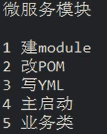

# 一、SpringCloud

## springcloud五大组件：


1、服务注册中心：Eureka实现服务治理；


2、<font style="color:rgb(51, 51, 51);">负载均衡：</font>Ribbon主要提供客户侧的软件负载均衡算法；

<font style="color:rgb(51, 51, 51);"></font>

<font style="color:rgb(51, 51, 51);">3、服务远程调用：Feign （Dubbo）</font>


4、<font style="color:rgb(51, 51, 51);">服务监控和保护：</font>Hystrix断路器，保护系统，控制故障范围；


5、<font style="color:rgb(51, 51, 51);">服务网关：</font>Zuul，api网关，路由，负载均衡等多种作用；


6、<font style="color:rgb(51, 51, 51);">配置中心：</font>Config配置管理。


7、服务总线：Bus


## 技术选型


[查看SpringCloud 和SpringBoo版本兼容性](https://spring.io/projects/spring-cloud#overview)


[查看SpringCloud 对其余各个技术版本的兼容性](https://start.spring.io/actuator/info)  需要转换成JSON进行查看


## 版本定稿
| **技术** | **版本** |
| --- | --- |
| Spring Cloud | **Hoxton.SR1** |
| Spring Boot | **2.2.2.RELEASE** |
| Spring Cloud Alibaba | 2.1.0.RELEASE |
| Java | 8 |
| Maven | 3.5 |
| MySQL | 5.7 |


## 关于SpringCloud各种组件的停更/升级/替换:


1. Eureka停用,可以使用zk作为<font style="color:#E8323C;">服务注册中心</font>


2. <font style="color:#E8323C;">服务调用</font>,Ribbon准备停更,代替为LoadBalance


3. Feign改为OpenFeign


4. Hystrix停更,改为resilence4j	或者阿里巴巴的sentienl


5. Zuul改为gateway


6. <font style="color:#E8323C;">服务配置</font>Config改为  Nacos


7. <font style="color:#E8323C;">服务总线</font>Bus改为Nacos


以前：


现在：


# 环境搭建:


## 1,创建父工程,pom依赖


```xml
<?xml version="1.0" encoding="UTF-8"?>

<project xmlns="http://maven.apache.org/POM/4.0.0" xmlns:xsi="http://www.w3.org/2001/XMLSchema-instance"
         xsi:schemaLocation="http://maven.apache.org/POM/4.0.0 http://maven.apache.org/xsd/maven-4.0.0.xsd">
    <modelVersion>4.0.0</modelVersion>

    <groupId>com.atguigu.springcloud</groupId>
    <artifactId>cloud2020</artifactId>
    <version>1.0-SNAPSHOT</version>
    <packaging>pom</packaging>


    <!-- 统一管理jar包版本 -->
    <properties>
        <project.build.sourceEncoding>UTF-8</project.build.sourceEncoding>
        <maven.compiler.source>1.8</maven.compiler.source>
        <maven.compiler.target>1.8</maven.compiler.target>
        <junit.version>4.12</junit.version>
        <log4j.version>1.2.17</log4j.version>
        <lombok.version>1.16.18</lombok.version>
        <mysql.version>5.1.47</mysql.version>
        <druid.version>1.1.16</druid.version>
        <mybatis.spring.boot.version>1.3.0</mybatis.spring.boot.version>
    </properties>

    <!-- 子模块继承之后，提供作用：锁定版本+子module不用写groupId和version  -->
    <dependencyManagement>
        <dependencies>
            <!--spring boot 2.2.2-->
            <dependency>
                <groupId>org.springframework.boot</groupId>
                <artifactId>spring-boot-dependencies</artifactId>
                <version>2.2.2.RELEASE</version>
                <type>pom</type>
                <scope>import</scope>
            </dependency>
            <!--spring cloud Hoxton.SR1-->
            <dependency>
                <groupId>org.springframework.cloud</groupId>
                <artifactId>spring-cloud-dependencies</artifactId>
                <version>Hoxton.SR1</version>
                <type>pom</type>
                <scope>import</scope>
            </dependency>
            <!--spring cloud alibaba 2.1.0.RELEASE-->
            <dependency>
                <groupId>com.alibaba.cloud</groupId>
                <artifactId>spring-cloud-alibaba-dependencies</artifactId>
                <version>2.1.0.RELEASE</version>
                <type>pom</type>
                <scope>import</scope>
            </dependency>

            <dependency>
                <groupId>mysql</groupId>
                <artifactId>mysql-connector-java</artifactId>
                <version>${mysql.version}</version>
            </dependency>
            <dependency>
                <groupId>com.alibaba</groupId>
                <artifactId>druid</artifactId>
                <version>${druid.version}</version>
            </dependency>
            <dependency>
                <groupId>org.mybatis.spring.boot</groupId>
                <artifactId>mybatis-spring-boot-starter</artifactId>
                <version>${mybatis.spring.boot.version}</version>
            </dependency>
            <dependency>
                <groupId>junit</groupId>
                <artifactId>junit</artifactId>
                <version>${junit.version}</version>
            </dependency>
            <dependency>
                <groupId>log4j</groupId>
                <artifactId>log4j</artifactId>
                <version>${log4j.version}</version>
            </dependency>
            <dependency>
                <groupId>org.projectlombok</groupId>
                <artifactId>lombok</artifactId>
                <version>${lombok.version}</version>
                <optional>true</optional>
            </dependency>
        </dependencies>
    </dependencyManagement>


    <build>
        <plugins>
            <plugin>
                <groupId>org.springframework.boot</groupId>
                <artifactId>spring-boot-maven-plugin</artifactId>
                <configuration>
                    <fork>true</fork>
                    <addResources>true</addResources>
                </configuration>
            </plugin>
        </plugins>
    </build>

</project>
```


+  和 的区别


## 2,创建子模块,payment模块





### 子模块名字:


		cloud-provider-payment8001


### pom依赖


```xml
<?xml version="1.0" encoding="UTF-8"?>
<project xmlns="http://maven.apache.org/POM/4.0.0"
         xmlns:xsi="http://www.w3.org/2001/XMLSchema-instance"
         xsi:schemaLocation="http://maven.apache.org/POM/4.0.0 http://maven.apache.org/xsd/maven-4.0.0.xsd">
    <parent>
        <artifactId>cloud2020</artifactId>
        <groupId>com.atguigu.springcloud</groupId>
        <version>1.0-SNAPSHOT</version>
    </parent>
    <modelVersion>4.0.0</modelVersion>

    <artifactId>cloud-provider-payment8001</artifactId>

    <dependencies>
        <!-- web -->
        <dependency>
            <groupId>org.springframework.boot</groupId>
            <artifactId>spring-boot-starter-web</artifactId>
        </dependency>

        <!-- 图形化监控 -->
        <dependency>
            <groupId>org.springframework.boot</groupId>
            <artifactId>spring-boot-starter-actuator</artifactId>
        </dependency>

        <!-- mybatis 和SpringBoot 整合-->
        <dependency>
            <groupId>org.mybatis.spring.boot</groupId>
            <artifactId>mybatis-spring-boot-starter</artifactId>
        </dependency>

        <!-- druid 数据库连接池 -->
        <dependency>
            <groupId>com.alibaba</groupId>
            <artifactId>druid</artifactId>
        </dependency>
        <!--        <dependency>-->
        <!--            <groupId>com.alibaba</groupId>-->
        <!--            <artifactId>druid-spring-boot-starter</artifactId>-->
        <!--            <version>1.1.10</version>-->
        <!--        </dependency>-->

        <!-- MySQL 驱动 -->
        <dependency>
            <groupId>mysql</groupId>
            <artifactId>mysql-connector-java</artifactId>
        </dependency>
        <!-- jdbc -->
        <dependency>
            <groupId>org.springframework.boot</groupId>
            <artifactId>spring-boot-starter-jdbc</artifactId>
        </dependency>
        <!--热部署-->
        <dependency>
            <groupId>org.springframework.boot</groupId>
            <artifactId>spring-boot-devtools</artifactId>
            <scope>runtime</scope>
            <optional>true</optional>
        </dependency>

        <dependency>
            <groupId>org.projectlombok</groupId>
            <artifactId>lombok</artifactId>
            <optional>true</optional>
        </dependency>

        <dependency>
            <groupId>org.springframework.boot</groupId>
            <artifactId>spring-boot-starter-test</artifactId>
            <scope>test</scope>
        </dependency>
    </dependencies>

</project>
```


### 创建application.yml


```yaml
server:
  port: 8001

spring:
  application:
    name: cloud-payment-service
  datasource:
    type: com.alibaba.druid.pool.DruidDataSource # 当前数据源操作类型
    driver-class-name: org.gjt.mm.mysql.Driver # mysql驱动类
    url: jdbc:mysql://localhost:3306/db2019?useUnicode=true&characterEncoding=UTF-8&useSSL=false&serverTimezone=GMT%2B8
    username: root
    password: root

mybatis:
  mapper-locations: classpath*:mapper/*.xml
  type-aliases-package: com.atguigu.springcloud.entities
    #它一般对应我们的实体类所在的包，这个时候会自动取对应包中不包括包名的简单类名作为包括包名的别名。多个package之间可以用逗号或者分号等来进行分隔（value的值一定要是包的全）
```


### 主启动类


```java
package com.atguigu.springcloud;

import org.springframework.boot.SpringApplication;
import org.springframework.boot.autoconfigure.SpringBootApplication;

/**
 * @author: like
 * @Date: 2021/07/07 0:08
 */
@SpringBootApplication
public class PaymentMain8001 {

    public static void main(String[] args) {
        SpringApplication.run(PaymentMain8001.class, args);
    }

}
```


### 业务类


#### sql


```sql
CREATE TABLE `payment` (
  `id` bigint(20) unsigned NOT NULL AUTO_INCREMENT,
  `serial` varchar(200) NOT NULL DEFAULT '',
  PRIMARY KEY (`id`)
) ENGINE=InnoDB DEFAULT CHARSET=utf8mb4;
```


#### 实体类


```java
package com.atguigu.springcloud.entities;

import lombok.AllArgsConstructor;
import lombok.Data;
import lombok.NoArgsConstructor;

import java.io.Serializable;

/**
 * @author: like
 * @Date: 2021/07/07 6:52
 */
@Data
@NoArgsConstructor
@AllArgsConstructor
public class Payment implements Serializable {

    private Long id;
    private String serial;

}
```


#### entity类 CommonResult< T>


```java
package com.atguigu.springcloud.entities;

import lombok.AllArgsConstructor;
import lombok.Data;
import lombok.NoArgsConstructor;

/**
 * @author: like
 * @Date: 2021/07/07 6:55
 */
@Data
@AllArgsConstructor
@NoArgsConstructor
public class CommonResult<T> {

    private Integer code;
    private String message;
    private T data;

    public CommonResult(Integer code, String message) {
        this(code, message, null);
    }

}
```


#### dao层:


```java
package com.atguigu.springcloud.dao;

import com.atguigu.springcloud.entities.Payment;
import org.apache.ibatis.annotations.Mapper;
import org.apache.ibatis.annotations.Param;

/**
 * @author: like
 * @Date: 2021/07/07 6:59
 */
@Mapper
public interface PaymentDao {

    public int create(Payment payment);

    public Payment getPaymentById(@Param("id") Long id);

}
```


#### mapper配置文件类


				**在resource下,创建mapper/PayMapper.xml**


```xml
<?xml version="1.0" encoding="UTF-8" ?>
<!DOCTYPE mapper
        PUBLIC "-//mybatis.org//DTD Mapper 3.0//EN"
        "http://mybatis.org/dtd/mybatis-3-mapper.dtd">

<mapper namespace="com.atguigu.springcloud.dao.PaymentDao">

    <resultMap id="BaseResultMap" type="payment">
        <id column="id" property="id" jdbcType="BIGINT"/>
        <result column="serial" property="serial" jdbcType="VARCHAR"/>
    </resultMap>
    <select id="getPaymentById" parameterType="long" resultMap="BaseResultMap">
        select * from payment where id=#{id}
    </select>

    <!-- userGeneratedKeys=true 说明把插入的值返回回来,回填到对象中
        keyProperty="id" 说明主键是id
     -->
    <insert id="create" parameterType="payment" useGeneratedKeys="true" keyProperty="id">
        insert into payment(serial) values (#{serial});
    </insert>
</mapper>
```


#### 写service和serviceImpl


```java
package com.atguigu.springcloud.service;

import com.atguigu.springcloud.entities.Payment;
import org.apache.ibatis.annotations.Param;

/**
 * @author: like
 * @Date: 2021/07/07 7:32
 */
public interface PaymentService {

    public int create(Payment payment);

    public Payment getPaymentById(@Param("id") Long id);

}
```


```java
package com.atguigu.springcloud.service.impl;

import com.atguigu.springcloud.dao.PaymentDao;
import com.atguigu.springcloud.entities.Payment;
import com.atguigu.springcloud.service.PaymentService;
import org.springframework.stereotype.Service;

import javax.annotation.Resource;

/**
 * @author: like
 * @Date: 2021/07/07 7:32
 */
@Service
public class PaymentServiceImpl implements PaymentService {

    @Resource
    private PaymentDao paymentDao;

    @Override
    public int create(Payment payment) {
        return paymentDao.create(payment);
    }

    @Override
    public Payment getPaymentById(Long id) {
        return paymentDao.getPaymentById(id);
    }
}
```


#### controller


```java
package com.atguigu.springcloud.controller;

import com.atguigu.springcloud.entities.CommonResult;
import com.atguigu.springcloud.entities.Payment;
import com.atguigu.springcloud.service.PaymentService;
import lombok.extern.slf4j.Slf4j;
import org.springframework.web.bind.annotation.*;

import javax.annotation.Resource;

/**
 * @author: like
 * @Date: 2021/07/07 7:43
 */
@RestController
@Slf4j
public class PaymentController {

    @Resource
    private PaymentService paymentService;

    @PostMapping(value = "/payment/create")
    public CommonResult create(@RequestBody Payment payment) {

        int result = paymentService.create(payment);
        log.info("插入结果：" + result);

        if (result > 0) {
            return new CommonResult(200, "插入数据成功", result);
        } else {
            return new CommonResult(444, "插入数据失败");
        }

    }

    @GetMapping(value = "/payment/get/{id}")
    public CommonResult getPaymentById(@PathVariable("id") Long id) {

        Payment payment = paymentService.getPaymentById(id);
        log.info("查询结果：" + payment);

        if (payment != null) {
            return new CommonResult(200, "查询成功", payment);
        } else {
            return new CommonResult(444, "查询失败");
        }

    }

}
```


## 3,热部署:


### 添加devtools


```xml
<!-- devtools 依赖 -->
<dependency>
    <groupId>org.springframework.boot</groupId>
    <artifactId>spring-boot-devtools</artifactId>
   <scope>runtime</scope>
    <optional>true</optional>
</dependency>
```


### 添加plugin插件


```xml
<build>
  <plugins>
    <plugin>
      <groupId>org.springframework.boot</groupId>
      <artifactId>spring-boot-maven-plugin</artifactId>
      <configuration>
        <fork>true</fork>
        <addResources>true</addResources>
      </configuration>
    </plugin>
  </plugins>
</build>
```


### 开启IDEA的自动编译（静态）


File -> Settings -> Default Settings -> Build -> Compiler 然后勾选 Build project automatically 。


### 开启IDEA的自动编译（动态）


同时按住 Ctrl + Shift + Alt + /  然后进入Registry ，勾选自动编译并调整延时参数。


+ compiler.automake.allow.when.app.running   -> 自动编译
+ compile.document.save.trigger.delay  -> 自动更新文件


### 重启idea


## 4,order模块


### **pom**


```xml
<?xml version="1.0" encoding="UTF-8"?>
<project xmlns="http://maven.apache.org/POM/4.0.0"
         xmlns:xsi="http://www.w3.org/2001/XMLSchema-instance"
         xsi:schemaLocation="http://maven.apache.org/POM/4.0.0 http://maven.apache.org/xsd/maven-4.0.0.xsd">
    <parent>
        <artifactId>cloud2020</artifactId>
        <groupId>com.atguigu.springcloud</groupId>
        <version>1.0-SNAPSHOT</version>
    </parent>
    <modelVersion>4.0.0</modelVersion>

    <artifactId>cloud-consumer-order80</artifactId>

    <dependencies>
        <dependency>
            <groupId>org.springframework.boot</groupId>
            <artifactId>spring-boot-starter-web</artifactId>
        </dependency>
        <dependency>
            <groupId>org.springframework.boot</groupId>
            <artifactId>spring-boot-starter-actuator</artifactId>
        </dependency>
        <dependency>
            <groupId>org.springframework.boot</groupId>
            <artifactId>spring-boot-devtools</artifactId>
            <scope>runtime</scope>
            <optional>true</optional>
        </dependency>
        <dependency>
            <groupId>org.projectlombok</groupId>
            <artifactId>lombok</artifactId>
            <optional>true</optional>
        </dependency>
        <dependency>
            <groupId>org.springframework.boot</groupId>
            <artifactId>spring-boot-starter-test</artifactId>
            <scope>test</scope>
        </dependency>
    </dependencies>
</project>
```


### **yml配置文件**


```yaml
server:
  port: 80
```


### **主启动类**


```java
package com.atguigu.springcloud;

import org.springframework.boot.SpringApplication;
import org.springframework.boot.autoconfigure.SpringBootApplication;

/**
 * @author: like
 * @Date: 2021/07/07 21:28
 */
@SpringBootApplication
public class OrderMain80 {

    public static void main(String[] args) {
        SpringApplication.run(OrderMain80.class, args);
    }

}
```


### **复制pay模块的实体类,entity类**


### **写controller类**


		因为这里是消费者类,主要是消费,那么就没有service和dao,需要调用pay模块的方法。


		并且这里还没有微服务的远程调用,那么如果要调用另外一个模块,则需要使用基本的api调用


使用RestTemplate调用pay模块,


### 使用RestTemplate来进行远程调用


+  RedisTemplate 提供了多种便捷的访问远程HTTP服务的方法 
+  是一种简单轻便的访问restful服务模板类，是Spring提供的用户访问Rest服务的**客户端模板工具集。** 


#### 使用


+ `（url ，requestMap，ResponseBean.class）` 这三个参数分别代表了（Rest请求地址、请求参数、Http响应转换被转换成的对象类型）


#### config配置类


	将restTemplate注入到容器


```java
package com.atguigu.springcloud.config;

import org.springframework.context.annotation.Bean;
import org.springframework.context.annotation.Configuration;
import org.springframework.web.client.RestTemplate;

/**
 * @author: like
 * @Date: 2021/07/07 21:41
 */
@Configuration
public class ApplicationConfig {

    @Bean
    public RestTemplate getRestTemplate(){
        return new RestTemplate();
    }

}
```


#### 编写controller:


```java
package com.atguigu.springcloud.controller;

import com.atguigu.springcloud.entities.CommonResult;
import com.atguigu.springcloud.entities.Payment;
import lombok.extern.slf4j.Slf4j;
import org.springframework.beans.factory.annotation.Autowired;
import org.springframework.web.bind.annotation.*;
import org.springframework.web.client.RestTemplate;

/**
 * @author: like
 * @Date: 2021/07/07 21:32
 */
@RestController
@Slf4j
public class OrderController {

    public static final String PAYMENT_URL = "http://localhost:8001";

    @Autowired
    private RestTemplate restTemplate;

    @PostMapping("/consumer/payment/create")
    public CommonResult<Payment> create(@RequestBody Payment payment) {
        return restTemplate.postForObject(PAYMENT_URL + "/payment/create", payment, CommonResult.class);
    }

    @GetMapping("/consumer/payment/get/{id}")
    public CommonResult<Payment> getPayment(@PathVariable("id") Long id) {
        return restTemplate.getForObject(PAYMENT_URL + "/payment/get/" + id, CommonResult.class);
    }

}
```


## 5,重构


新建一个模块,将重复代码抽取到一个公共模块中


### 创建commons模块


### 抽取公共pom


```xml
<?xml version="1.0" encoding="UTF-8"?>
<project xmlns="http://maven.apache.org/POM/4.0.0"
         xmlns:xsi="http://www.w3.org/2001/XMLSchema-instance"
         xsi:schemaLocation="http://maven.apache.org/POM/4.0.0 http://maven.apache.org/xsd/maven-4.0.0.xsd">
    <parent>
        <artifactId>cloud2020</artifactId>
        <groupId>com.atguigu.springcloud</groupId>
        <version>1.0-SNAPSHOT</version>
    </parent>
    <modelVersion>4.0.0</modelVersion>

    <artifactId>cloud-api-commons</artifactId>

    <dependencies>
        <dependency>
            <groupId>org.springframework.boot</groupId>
            <artifactId>spring-boot-devtools</artifactId>
        </dependency>
        <dependency>
            <groupId>org.projectlombok</groupId>
            <artifactId>lombok</artifactId>
            <optional>true</optional>
        </dependency>
        <dependency>
            <groupId>cn.hutool</groupId>
            <artifactId>hutool-all</artifactId>
            <version>5.1.0</version>
        </dependency>
    </dependencies>


</project>
```


### entity和实体类放入commons中


### 使用mavne,将commone模块打包(install),


maven执行命令  `clean`  `install`


### 其他模块引入commons


	把其余工程中的实体类删除即可，然后把80 和8001的pom中加入commons工程依赖


```xml
<!--引入自己定义的api通用包-->
<dependency>
    <groupId>com.atguigu.springcloud</groupId>
    <artifactId>cloud-api-commons</artifactId>
    <version>${project.version}</version>
</dependency>
```


> 更新: 2022-08-19 16:47:00  
> 原文: <https://www.yuque.com/like321/xgwgyr/yydsqp>